# **第一节——vue安装+前端工程化**

作者：尤雨溪


官网：https://cn.vuejs.org/guide/introduction.html

脚手架文档 https://cli.vuejs.org/zh/guide/creating-a-project.html#vue-create

## 一、概念（了解）

是一套用于构建用户界面的**渐进式框架**。与其它大型框架不同的是，Vue 被设计为可以自底向上逐层应用。Vue 的核心库只关注视图层，不仅易于上手，还便于与第三方库或既有项目整合。另一方面，当与现代化的工具链以及各种支持类库结合使用时，Vue 也完全能够为复杂的单页应用提供驱动

## 二、名词理解（了解）

**渐进式框架：**提供足够的选择，并且没有很多强制性的要求

**自低向上逐层应用：**由基层开始做起，把基础的东西写好，再逐层往上添加效果和功能。

**视图层：**用户看得见，实际使用的页面。或者简单理解成html，css

**第三方库：**例如jq**、**bootstrap

**单页应用(spa):**  指只有一个主页面的应用（一个html页面），一开始只需要加载一次js、css的相关资源。所有内容都包含在主页面，对每一个功能模块组件化。单页应用跳转，就是切换相关组件，页面不刷新

## 三、前端工程化（了解）

### 1、概念

工程化，可以理解为使用一些方式，去改良然后提高行业中现有的步骤、设计、应用方式。前端工程化，就是指对前端进行一些流程的标准化，让开发变得更有效率，且更好地做产品交付。

一开始，网页页面并不复杂，只是提供一些简单的展示和交互的静态页面，甚至不需要后端。

后来需要根据不同用户返回不同的页面信息，此时我们会用后端读取数据，配合一些模板引擎，在后端拼接好内容再返回，这就是所谓的服务端渲染（SSR）。

再后来，页面变得非常复杂，于是出现了前后端分离，前端被单独拎了出来，专门写 html、css 和 js，变成了 单页面应用（SPA）。但复杂也带来了很多问题，比如多个脚本的执行时机不对、css 名冲突、文件过于臃肿、错误的缓存导致没能下载最新的资源，等前端复杂后出现的一系列问题。

随着 Nodejs 的诞生，我们可以用 JS 去写前端工具了。为了解决上面这些问题，前端界出现了一大堆的工具和框架：React、Vue，Angular，Gulp、、babel、Sass、、Webpack、Yarn、TypeScript、ESLint、Docker、k8s 等等。

一切都是为了让前端的开发更工程化，也就是 不停地改良前端项目的开发流程，让开发者能够更高效地开发、更好地进行团队协作、让代码的风格标准化、对资源做压缩以及懒加载、更好地交付部署等

### 2、通过四个维度来谈谈前端工程化一些具体的细节

#### 1、模块化

模块化，指的是将代码功能做拆分，分成独立地单能相互依赖的片段。

**JS 的模块化**。

JS 一开始的职责是给网页提供一些简单的交互，所以语法相对简单且不支持模块化。随着网页的复杂，发现原来的组织方式带来了很多问题，变得难以维护。

于是 CommonJS、AMD、ES Module 等模块系统出现了。正统标准是 ES Module，通过 import 关键字引入模块，通过 export 导出模块。

JS 的模块化将代码做了拆分，解决了全局变量污染、依赖关系不清晰、多人协作不方便、脚本引入顺序、单元测试等问题。

**CSS 的模块化**

CSS 的第一个问题是比较难写，比如不支持选择器嵌套，对此我们可以用 CSS 预编译器（比如 Less、Sass、Stylus）去写一些更高级的语法，然后编译成 CSS。

然后是就 命名冲突问题，一种旧的方案是 BEM，就是通过将 CSS 命名 在组件化的框架中，我们有很多方案，可以用 CSS in JS，也可以用 CSS Module，或者 Vue 特有的 CSS Scoped。

**HTML 的模块化**

html 通常是动态的，在服务端我们会使用模板引擎（template），将得到的数据注入到占位符中。在后端 Nodejs，我们可以用 pug、handlebars、ejs 等。

前后端分离后，我们通常使用的是 Vue 的 template（类似 handlebars 语法）以及 React 的 JSX。

**资源整合模块化**

不同类型的资源无法组织在一起，比如 JS 引擎能识别引入的 js 文件，但无法识别 css 文件。如果我们希望所有的资源都能组织再一起进行管理，要分别管理一个个不同类型的资源要方便地多。

为了解决这个问题，webpack 诞生了。webpack 是一个模块打包器，能够将任何资源转换为 js 代码进行导入。比如图片，它可以先变成一个静态资源服务的一个资源，然后在 js 文件 import 的时候在转换为一个 url 字符串，或者直接就变成一个 base64 字符串。

这些需要使用到一些 loader（加载器）。webpack 是一个框架，使用者需要根据需求，添加一些 loader，去识别不同的文件，转化成 JS 代码导入。

此外还有 plugin（插件），在这整个流程中做一些处理，比如将导出的 JS 文件插入到 HTML 模板中，或是进行代码的压缩等等

#### 2、组件化

组件化是 UI 层面上的更细粒度的拆分，一种类似 div 等原生元素的 “自定义元素”。

组件有自己的 HTML、CSS 和 JS，同时有自己的状态，并支持嵌入到其他组件中并接受外部的数据，可以进行复用。组件化可以看作是 UI 层组织方式的一种模块化。

目前主流的 React 和 Vue 前端框架都是基于组件的。

原本的以资源类型为单位进行组织的管理（所有 JS 文件放一个文件夹、CSS 同理），其实维护起来比较困难，也不好复用，组件化的构想是以视觉为单位进行拆分，做了结构、样式、脚本的组装，抽象出一个 “新的元素”。

组件已经是前端开发的基石了，是一种比较合理的抽象。

#### 3、规范化

然后就是前端代码的规范。规范是很重要的，能让代码能够写得更容易更正确，避免一些不必要的错误。

相关规范包括但不限于

- 目录结构规定。
- 代码风格（包括 JS、HTML、CSS）。
- 注释规范。
- commit message 规范。
- git 工作流规范。
- Code Review。
- 请求接口规范。

## webpack安装vue项目

基于vue-cli脚手架

#### 1、全局安装vue 脚手架 vue-cli

```bash
## 安装
npm install -g @vue/cli

## 安装成功后，检查
vue --version
vue -V
```

#### 2、在命令行里运行vue ui会出现一个图形界面

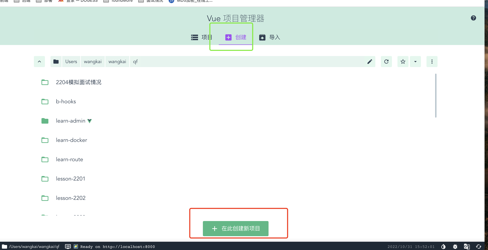

#### 3、点击有右上角

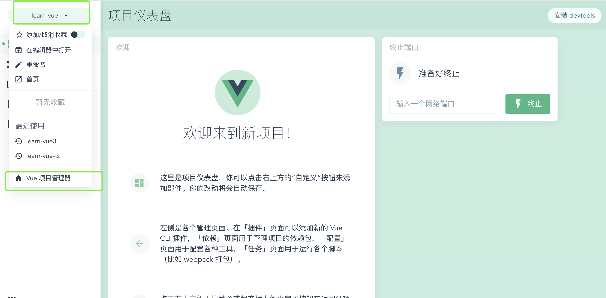

#### 4、选择创建，并选择对应的目录


#### 5、输入项目名

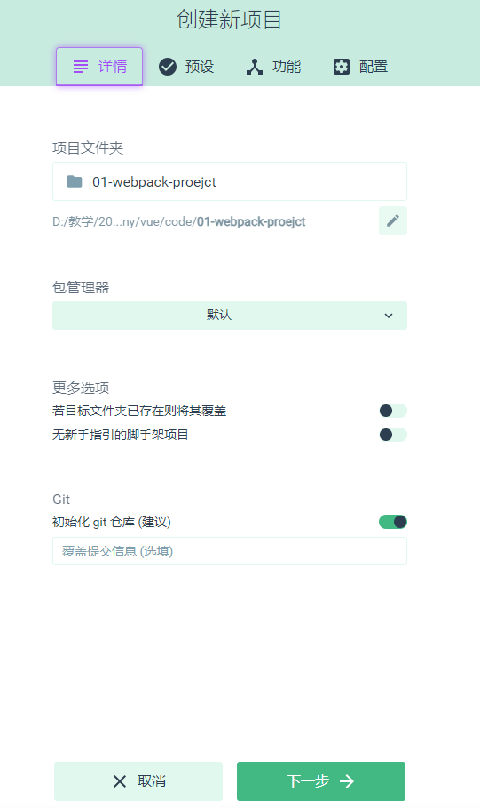

#### 5、选择vue3

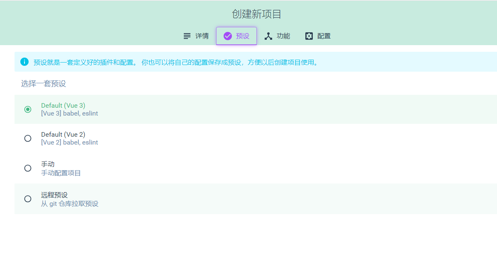

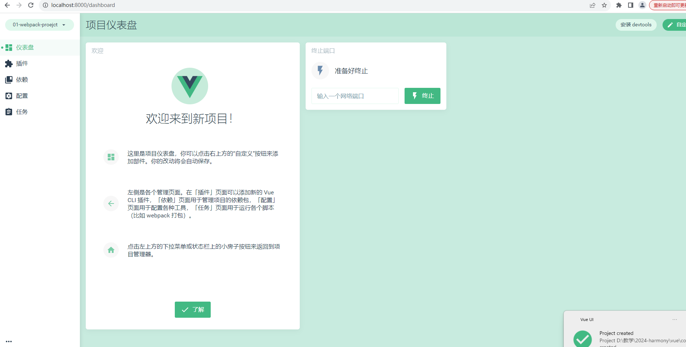

#### 6、启动项目

方式1：进入刚才的创建项目的目录并进入创建的项目运行npm run serve或者yarn serve

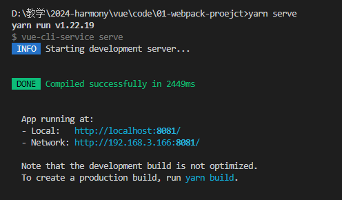

方式2：或者直接选择任务-serve-点击运行也可以启动项目

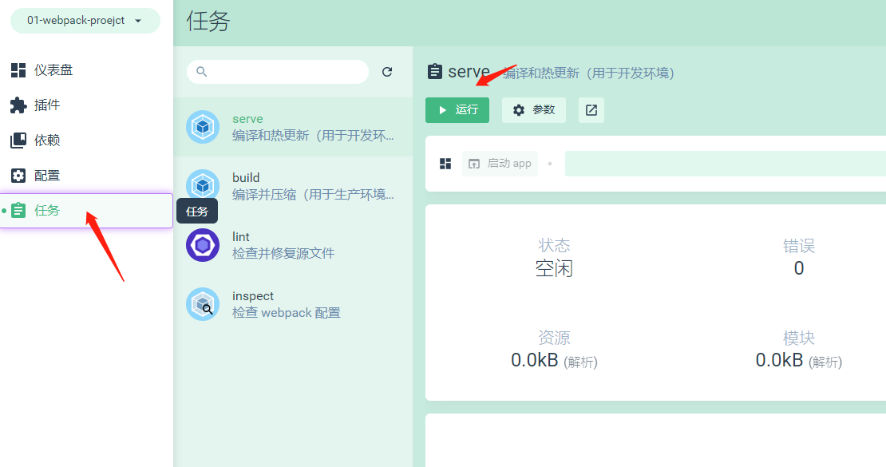

输入 http://localhost:8080/

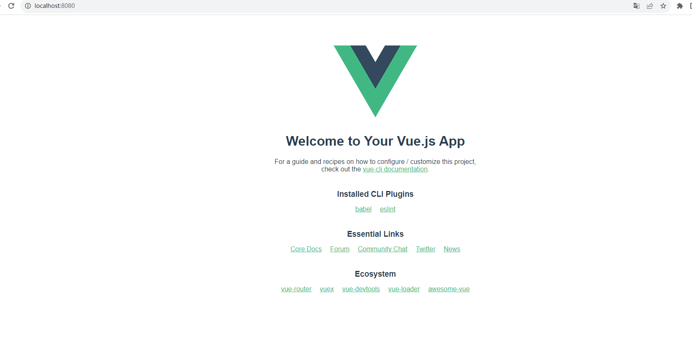

#### 7、项目目录介绍

使用vscode打开项目

```markdown

  README.md
  # 项目第三方依赖包
  node_modules/
  
  package.json
  # 一般用来存放静态依赖
  public/
    index.html
    favicon.ico
  # 存放项目源代码（我们自己写的代码），注意只有放在src目录下的文件才会被webpack打包
  src/
    assets/ # 存放静态目录  图片
    component/ # 存放组件
    app.vue # 页面组件
    main.js # 入口文件
```

##### main.js

main.js 是整个项目的入口文件

mainjs中默认有三行代码，自动生成的，我们只要了解含义，不要修改，后面可能会添加一些代码

```javascript

//1-引入vue框架中的createApp函数
//createApp用来创建vue实例对象
import { createApp } from 'vue'

//2-引入App.vue
//App.vue 在vue中叫组件，在工程化项目中一般一个组件就是一个文件，所以也叫单文件组件
//组件可以理解为我们写的一个页面 或者 一个div ，在组件中我们可以写内容
import App from './App.vue'


//3-下面是 基于App组件中的内容创建vue实例，并且把app中内容显示到public文件下面的index.html页面中 id为app的div中

createApp(App).mount('#app')

```

app.vue我们也叫根组件，整个网站的内容都是在这个容器中的显示的

#### 了解spa

我们使用vue开发的时候，采用的是spa，单页应用开发，即 整个网站其实只有一个页面，后面我们会编写各种组件，页面中要显示什么内容，就把对应组件的内容显示到 页面中即可。

使用spa技术，用户首次访问index.html页面的时候，加载速度比较慢（因为第一次就会把所有组件都下载到用户电脑上），但是后期用户切换页面的时候比较流畅，能达到像是手机上原生app的效果。所以目前很多系统都会采用spa的方式进行开发。

我们之前的开发模式，叫多页应用，一个页面一个html文件，用户访问一个页面，就加载一个页面，所以体验不是很好。

目前前端中主流开发模式就是spa，单页应用开发

尝试修改一下App.vue 中代码

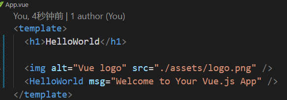

在template标签最前面添加一句html代码，再去看看http://localhost:8080/ ，就能看看页面实时刷新了

## vite安装vue项目（目前常用）

### 方法1

下面直接使用vite 自带的vue模版创建项目

```shell
# npm 6.x
npm create vite@latest my-vue-app --template vue

# npm 7+, extra double-dash is needed:
npm create vite@latest my-vue-app -- --template vue

  cd my-vue-app
  npm install
  npm run dev
  
  #然后根据提示，访问对应本地服务器
```

### 方法2

或者直接npm create vue 

下面使用vite创建vue项目，可以自己选择语言和想要安装的常见库

```
npm create vue 
```


### 4、最终页面


### 5、项目目录

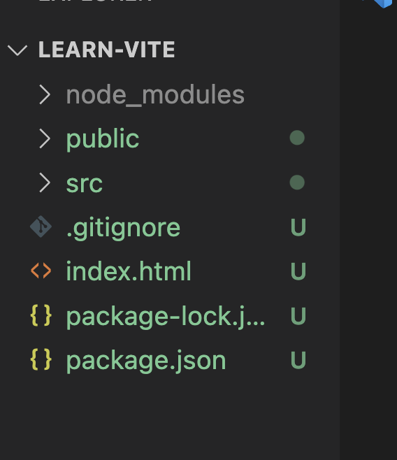

index.html里面的代码

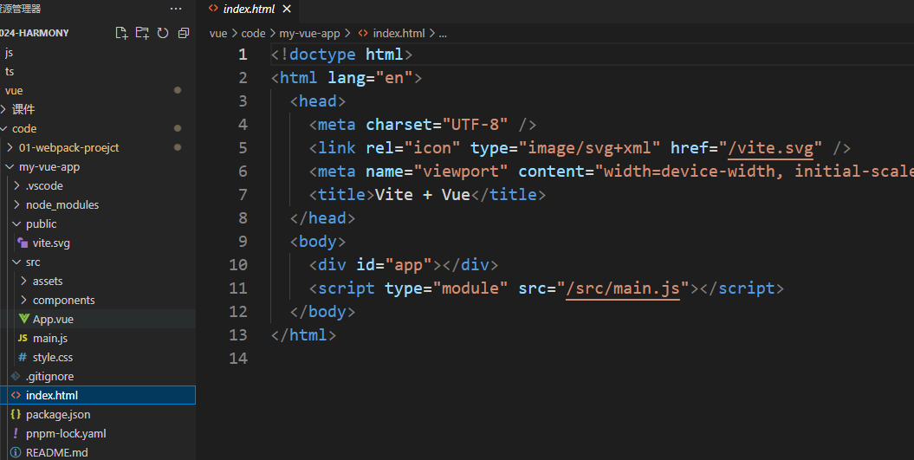

vite创建的项目，看起更容易理解。

index.html引入了main.js

main.js跟上个项目的代码差不多

最终是把App组件的内容，展示到index.html页面中 id为app的div 中

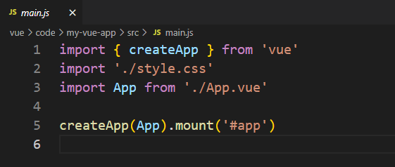

vite的启动速度更多，特别是在项目大的时候。

# vscode插件

推荐的 IDE 配置是 Visual Studio Code + vue-Official扩展。

Vue Official，这个插件让我们在vue文件里面写代码的时候有更好的提示-识别vue文件

Vue 3 Snippets 这个插件，可以让我们使用vue语法有些代码块提示

## 本节扩展面试题

### 1、vite 和 webpack的区别

webpack会先打包，然后启动开发服务器，请求服务器时直接给予打包结果。

而vite是直接启动开发服务器，请求哪个模块再对该模块进行实时编译。

由于现代浏览器本身就支持ES Module，会自动向依赖的Module发出请求。vite充分利用这一点，将开发环境下的模块文件，就作为浏览器要执行的文件，而不是像webpack那样进行打包合并。

由于vite在启动的时候不需要打包，也就意味着不需要分析模块的依赖、不需要编译，因此启动速度非常快。当浏览器请求某个模块时，再根据需要对模块内容进行编译。这种按需动态编译的方式，极大的缩减了编译时间，项目越复杂、模块越多，vite的优势越明显。

在HMR方面，当改动了一个模块后，仅需让浏览器重新请求该模块即可，不像webpack那样需要把该模块的相关依赖模块全部编译一次，效率更高。

当需要打包到生产环境时，vite使用传统的rollup进行打包，因此，vite的主要优势在开发阶段。另外，由于vite利用的是ES Module，因此在代码中不可以使用CommonJS

# 第二节——Vue 基本介绍

 一、MV*的理解

 1、概念

在计算机编程领域，MV*（也称为MVC、MVP、MVVM等）是一种用于组织和设计应用程序结构的模式。这些模式旨在实现应用程序的解耦、可维护性和可扩展性。MV代表着Model-View-（表示控制器或视图模型等其他组件）的缩写，其中可以根据具体的模式而变化

 2、MVC（Model-View-Controller）：

模型（Model）：负责处理应用程序的数据逻辑，通常包含数据的获取、处理和存储。

视图（View）：负责展示数据给用户，通常是用户界面的组件。

控制器（Controller）：负责处理用户输入，并根据输入更新模型和视图。它充当了模型和视图之间的中介者。

 3、MVP（Model-View-Presenter）：

模型（Model）：同样负责处理应用程序的数据逻辑，与MVC中的模型类似。

视图（View）：负责展示数据给用户，但通常比MVC中的视图更为被动，不直接处理用户输入。

主持人（Presenter）：充当了控制器的角色，处理用户输入并根据输入更新模型和视图。与控制器不同的是，它更紧密地与视图交互，可以通过接口直接与视图进行交互。

 4、MVVM（Model-View-ViewModel）：

模型（Model）：同样负责处理应用程序的数据逻辑，与MVC和MVP中的模型类似。

视图（View）：负责展示数据给用户，通常是用户界面的组件。

视图模型（ViewModel）：是连接视图和模型的中介者。它从模型中获取数据，并将数据转换成视图所需的格式，同时处理用户输入，并将用户操作传递给模型。视图模型使得视图与模型的交互解耦，让视图能够更专注于展示数据

 二、声明式及与传统DOM开发对比

 1、什么叫声明式开发

声明式编程是一种编程范型，与命令式编程相对立。它描述目标性质，让计算机明白目标，而非流程。声明式编程不用告诉电脑问题领域，从而避免随之而来的副作用。而指令式编程专则需要用算法来明确的指出每一步该怎么做。

Vue.js 的核心是一个允许采用简洁的模板语法来声明式地将数据渲染进 DOM 的系统

 2、与传统DOM开发对比

 在div中写入你好vue

```vue
//命令式
<!doctype html>
<html lang="en">
  <head>
    <meta charset="UTF-8" />
    <meta name="viewport" content="width=device-width, initial-scale=1.0" />
    <title>Document</title>
  </head>
  <body>
    <div id="app"></div>
    <script>
      document.getElementById('app').innerHTML = '你好vue'
    </script>
  </body>
</html>
```

#### 编写第一个vue代码并实现hello word

将app.vue中代码改成下面即可

```vue
<template>
  <div>{{ message }} </div>
  <div> {{ data }}</div>
</template>
<script>
export default{
    data(){
        return{
            message:'你好Vue!',
            data:new Date().toLocaleDateString(),
        }
    }
}
</script>
<style >
</style>
```

# 第三节——Vue 基础语法(模板语法)

vue语法分为选项式API（Option api）和组合式api（Composition Api）,我们以选项式Api入门

## 模板语法

Vue 使用一种基于 HTML 的模板语法，使我们能够声明式地将其组件实例的数据绑定到呈现的 DOM 上。所有的 Vue 模板都是语法层面合法的 HTML，可以被符合规范的浏览器和 HTML 解析器解析。

在底层机制中，Vue 会将模板编译成高度优化的 JavaScript 代码。结合响应式系统，当应用状态变更时，Vue 能够智能地推导出需要重新渲染的组件的最少数量，并应用最少的 DOM 操作。

## 一、vue文件基本构成

一个vue文件，template、script、style三部分构成。template可以理解成编写html的地方，script编写逻辑js的地方，style编写样式的地方

**template 中就是写模板的地方**

## 二、Vue 的插值表达式 （文本插值）

### 1、概念

vue中，使用{{}}双花括号，在html标签的“内容区域”中表现数据，这个技术称为插值表达式。

表达式：变量、常量、算术运算符、比较运算符、逻辑运算符、三元运算符等等。我们通过把{{}}里面的内容称作组件的状态

```vue
<template>
  <div>
    {{  message }}
  </div>
</template>
```


### 2、如何使用定义状态并在template中显示

```vue
<template>
  <div>
  <!-- 花括号中可以直接展示这个状态 -->
    {{  message }}
  </div>
</template>
<script>
/**
 * 在script中使用export default 导出一个对象
 * 在对象里面定义一个函数data
 * 在data函数里面return 一个 对象
 * 在return 的这个对象里面 可以直接定义当前组件的状态
 */
export default {
  data () {
    return {
      // 定义的message状态
      message: "你好 vue"
    }
  }
}

</script>
```

## 三、属性绑定

### 1、回顾什么叫属性

属性指的是Html元素的属性，例如a标签的title就是一个属性！

### 2、Vue如何动态绑定属性

Vue绑定属性一般是在属性名后面加 : 也就是 v-bind（不推荐使用v-bind），当使用 : 绑定html元素的属性后，属性就相当于参数，属性值为预期值，一般在实际应用中，: 绑定的属性值都是通过计算得来 或者 是一个通过判断时刻变化的值。该操作也叫动态属性在组件传值中经常使用。

v-bind 是vue一个指令，在属性上只用

语法		``:属性名="表达式"``

或者是 `v-bind:属性名="表达式"`

```vue
<template>
<div><a :href="baidu">百度</a></div>
<a v-bind:href="jd">京东</a>
</template>

<script>
export default{
    data(){
        return{
            baidu:'https://www.baidu.com',
            jd:'https://www.jd.com'
        }
    }
}
</script>
<style >
    
</style>
```

## 四、如何展示当前的这个页面（组件）

### 1、在入口文件main.js中引入

```js
import { createApp } from 'vue'
import './style.css';//默认样式 可以删掉
import App from './App.vue'

/**
 * 把引入的组件直接放到createApp中
 */
let app=createApp(APP);
app.mount('#app');
```

## 五、createApp做了那些事情（进阶🚀🚀）

牵扯到很多没学的概念，先进行背诵，vue讲完后再尝试理解

执行 createApp 首先会创建渲染器，这里要注意的是存在2种渲染器类型，并且它们都是通过延迟创建的，主要目的是当用户只引用reactive响应式框架的时候，方便进行**tree-shaking**优化。且两种渲染器都是基于 baseCreateRender 方法来实现。

baseCreateRender 函数执行后会返回 render 渲染函数和 createApp 方法，其中 render 函数是组件创建、更新和卸载的主要核心逻辑实现。createApp则用于创建应用实例，进行应用实例的初始化。

createAppAPI用于生成默认的应用上下文 context，这里定义了应用实例具备的属性和方法，并通过重写扩展 context.app 属性，让用户能够进行对上下文的自定义操作，比如自定义组件、指令、mixin、插件安装等一系列操作。并存在mount方法完成将根组件转为虚拟节点 vNode，并通过render 函数完成对 vNode 的渲染

## 六、🤔为什么data是一个函数

同学们自行解决，答案在第七节揭晓

## 七、条件渲染

### 1、v-if

v-if 指令用于条件性地渲染一块内容。这块内容只会在指令的表达式返回 true的时候被渲染。表示式返回为false的时候会被删除

可以和正常使用if else 嵌套（不推荐）

```vue
<template>
  <div>
    <div v-if="isShow">出现吗</div>
  </div>
</template>

<script>
export default {
  data() {
    return {
      isShow: false,
    };
  },
};
</script>

```

### 2、v-show

v-show和v-if的用法几乎一致（v-show没有嵌套），不同的是带有 v-show 的元素始终会被渲染并保留在 DOM 中。v-show 只是简单地切换元素的 CSS property display block  none

```vue
<template>
  <div>
    <div v-show="isShow">显示吗</div>
  </div>
</template>

<script>
export default {
  data() {
    return {
      isShow: false,
    };
  },
};
</script>

```

## 八-列表渲染

### 一、列表渲染

vue中使用v-for指令进行列表

```vue
<template>
    <!-- item 代表 当前循环的每一项 -->
    <!-- index 代表 当前循环的下标-->
    <!-- 注意：必须要加key-->
     <div v-for="(item,index) in a1" :key="index">
    {{ item }}  <!-- { "name": "李骏", "age": 22 } -->
       <br> 	<!-- { "name": "张志强", "age": 18 } -->
    {{ item.name }}<!-- 李骏 -->
        <br>       <!-- 张志强 -->
    {{ item.age }} <!-- 22 -->
   </div>          <!-- 18 -->
</template>

<script>
export default{
    data(){
        return{
            a1:[
                {
                    name:'李骏',age:22,
                },
                {
                    name:'张志强',age:18,
                }
            ]
        }
    }
}
</script>
```

### 二、为什么循环的时候需要加key

### 1、作用

1.key的作用主要是为了高效的更新虚拟DOM，提高渲染性能。

2.key属性可以避免数据混乱的情况出现。

​		在Vue中，`key`的作用主要是帮助Vue高效地更新虚拟DOM。以下是它的几个关键作用：

1. **唯一标识**：`key`为每个节点提供唯一标识，以便Vue在更新节点时能够快速找到对应的节点。
2. **优化性能**：通过`key`，Vue可以更准确地判断节点是否改变，从而避免不必要的重渲染。
3. **保持组件状态**：在列表渲染中使用`key`可以确保组件的状态在增删节点时保持不变。

使用`key`时，通常会使用唯一标识符，如ID。

分享

### 2、原理

1.vue实现了一套虚拟DOM，使我们可以不直接操作DOM元素只操作数据，就可以重新渲染页面，而隐藏在背后的原理是高效的Diff算法

2当页面数据发生变化时，Diff算法只会比较同一层级的节点；

3.如果节点类型不同，直接干掉前面的节点，再创建并插入新的节点，不会再比较这个节点后面的子节点；如果节点类型相同，则会重新设置该节点属性，从而实现节点更新

4.使用key给每个节点做一个唯一标识，Diff算法就可以正确识别此节点，"就地更新"找到正确的位置插入新的节点

### 3、注意

1.key 的值只能是字符串或数字类型

```js
:key="index"
//通过使用冒号 : 来动态绑定 key 属性，你确保了每个列表项都有一个唯一的标识，
```

\2. key 的值必须具有唯一性（即：key 的值不能重复）

2.建议把数据项 id 属性的值作为 key 的值（因为 id 属性的值具有唯一性）

3.使用 index 的值当作 key 的值没有任何意义（因为 index 的值不具有唯一性，实际项目中如果没有id，推荐使用index）

4.建议使用 v-for 指令时一定要指定 key 的值（既提升性能、又防止列表状态紊乱）

### 4.key加：和不加：区别

  	使用冒号 `:` 表示动态绑定，不加冒号表示静态绑定。通过使用冒号 `:` 来动态绑定 `key` 属性，你确保了每个列表项都有一个唯一的标识，这对于 Vue 的内部机制来说至关重要。


## 九-事件处理

语法：

```js
v-on:事件名=”事件处理函数（）“
```

可以简写为

```js
@:事件名=”事件处理函数（）“
```

事件处理函数要写到 vue的methods配置项中

```js
methods:{
	事件处理函数(){

	}
}
```

例子

模板

```vue
<button v-on:click="fn()"></button>
<button @click="fn()"></button>

<!-- 这样的写法确保了 fn 方法会在点击按钮时被调用，而不是在组件初始化时执行 -->
<button @click="fn"></button>
<button v-on:click="fn"></button>
```

vue

```vue
<template>
 <button @click="fn">{{ age }}</button>
</template>

<script>
export default{
  data(){
    return{
        age:0,
    }
  },
  methods:{
   fn(){
    this.age++;
   }
  }
}
</script>

<style >
   
</style>
```

## 十-获取输入框的值

通过v-model指令可以获取输入框的值

使用str可以获取输入框的值，修改str也可以修改输入框的值

作用：双向绑定输入框的值

```js
<template>
 <div>
    <input type="text" v-model="message" placeholder="请输入">
    <p>你好！{{ message }}</p>、
 <!--inp输入什么，message就是什么  -->
 </div>
</template>

<script>
export default{
  data(){
    return{
      message:"",
    }
  },
  methods:{
  
  }
}
</script>

<style >
   
</style>
```

`  v-model` 是 Vue.js 中用于表单输入元素（如 `<input>`, `<textarea>`, `<select>` 等）的一种特殊指令，它实现了表单控件的双向数据绑定。这意味着它可以同时处理数据的输入和输出，即用户输入的数据会被自动同步到 Vue 实例的数据属性中，同时数据属性的更新也会自动反映到表单控件上。


​    `v-model` 的工作原理

1. **数据绑定**:
   - `v-model` 会在内部为不同的输入元素使用不同的属性与事件。
   - 对于文本和密码输入，`v-model` 会绑定 `value` 属性和 `input` 事件。
   - 对于复选框和单选按钮，`v-model` 会绑定 `checked` 属性和 `change` 事件。
   - 对于 `<select>` 元素，`v-model` 会绑定 `value` 属性和 `change` 事件。
2. **自动同步**:
   - 当用户更改输入框中的值时，`v-model` 会自动将新值同步到 Vue 实例的数据属性中。
   - 同样地，当 Vue 实例的数据属性发生变化时，`v-model` 会自动更新输入框的值。
3. **修饰符**:
   - `v-model` 支持一些修饰符来改变其行为，例如 `.lazy` 会使 `v-model` 在 `change` 事件而非 `input` 事件中同步数据，`.trim` 会自动过滤掉输入值的首尾空白字符，`.number` 会自动将输入值转换为数字。
