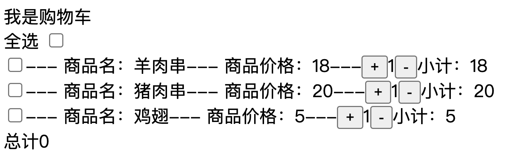

# 第五节——Vue 中如何编写样式

​    

## 一、内联样式

#### 直接使用style属性

```vue
<template>
 <div style="color: red;">第一种</div>
</template>
```

#### 动态绑定style属性

##### 1-属性值是对象形式

```vue
  <!-- 动态绑定style属性-属性值 是对象形式 -->
 <div :style="{color:'orange'}">第二种</div>
  
  <div :style='a2'>第三种</div>
```

data

```vue
<template>
    <div style="color: red;">第一种</div>
    <div :style="{color:'orange'}">第二种</div>
    
    <div :style='a2'>第三种</div>
   <div :style='Object.assign({},a1,a3)'>第四种</div>
   <div :style="[a1,a2]">我是第五种</div>
</template>

<script>
export default{
  data(){
    return{
      a1:{color:'yellow'},
      a2:{color:'green'},
      a3:{fontSize:"30px"}
    }
  },
  methods:{
  
  }
}
</script>

<style >
   
</style>
```


##### 2-属性值是数组形式

```vue
  <!-- 动态绑定style属性-属性值 是数组形式 -->
  <div :style="[a1,a2]">11</div>
```

data

```vue
<script>
export default {
  data() {
     return{
          a1:{color:'blue'},
          a2:{fontSize:'30px'}
        }
  },
};
</script>
```

## 二、引入css文件

主要是在script标签中把css文件当做模块引入，这样引入的是全局样式，如果有多个组件这些样式都会生效。

提前在页面结构中写好类名

### 1、创建learn-style.css文件

```js
.red { color: red; }
```

### 3、在文件中引入

```vue
<template>
  <div class="red">我是红色</div>
</template>

<script>
import './assets/learn-style.css'
export default{
    data(){
        return{
          
        }
    }
}
</script>

<style >
</style>
```


## 三、在style标签中编写

组件的模版中写结构和类名

组件的style标签中写样式


```vue
 <template>

 <!-- style标签中  -->
 <div class="green">我是绿色</div>
  
<template>

<style>
/* style标签中 */
.green {
  color: green;
}
</style>
  
```

### 动态绑定class

class值是一个对象，对象的属性名作为类名，属性值如果是true，就会添加这个类名，false就会删除这个类名

语法-```:class="{类名:true}"```

class值是一个数组，数组中存对象，对象的属性名作为类名，属性值如果是true，就会添加这个类名，false就会删除这个类名

语法-```:class="[{类名1:true},{类名2:true}]"```

```vue
 <template>

 <!-- style标签中  -->
   <div :class="{ b: true }">test6</div>
  
<template>

<style>
.b {
  color: blue;
}

</style>
  
```

   Vue.js 中，你可以使用 `v-bind:class`（或简写为 `:class`）来动态地绑定一个或多个 CSS 类到元素上。这允许你根据组件的状态或数据属性来改变元素的样式。下面我将详细介绍如何使用 `:class` 来动态绑定 CSS 类。

##### 1.**绑定单一类**:

- 如果你想根据一个布尔值来绑定一个 CSS 类，你可以使用三元运算符或计算属性。

  ```vue
  <div :class="{'active': isActive}"></div>
  ```

    这里，`isActive` 是一个布尔值。如果 `isActive` 为 `true`，`active` 类将被添加到元素上；如果为 `false`，则不会添加。

  

##### 2.**绑定多个类**:

- 如果你想根据多个条件来绑定多个类，你可以使用对象或数组。

  ```vue
  <div :class="{ active: isActive, 'text-danger': hasError }"></div>
  ```

    这里，`isActive` 和 `hasError` 都是布尔值。如果 `isActive` 为 `true`，`active` 类将被添加；如果 `hasError` 为 `true`，`text-danger` 类将被添加。

  

##### 3.**使用数组绑定多个类**

- 如果你想根据一个数组来绑定多个类，可以使用数组语法。

  ```vue
  <div :class="[activeClass, errorClass]"></div>
  ```

  这里，`activeClass` 和 `errorClass` 是字符串，它们分别代表 CSS 类名。如果这些变量包含有效的类名，这些类名将被添加到元素上。

  

```vue
<template>
  <div :class="[green,a2]">1111</div>
</template>

<script>
export default{
    data(){
        return{
         green:'green',
         a2:'a2'
        }
    }
}
</script>

<style >
   .green{
    color: green;
   }
   .a2{
    font-size: 30px;
   }
</style>
```


## 五、样式污染问题

### 1、产生原因

Vue最终编译打包后都在一个html页面中，如果在两个组件中取一样类名分别引用在自身，那么后者会覆盖前者。默认情况下，只要导入了组件，不管组件有没有显示在页面中，组件的样式就会生效。也就是说并没有自己的局部作用域

### 2、解决思路

1、手动处理 （起不同的类名，但是项目一大就会导致类名很乱，不利于团队协作）

2、CSS IN JS ： 以js的方式来处理css（推荐）

### 3、CSS IN JS

CSS IN JS是使用 JavaScript 编写 CSS 的统称，用来解决 CSS 样式冲突、覆盖等问题。

CSS IN JS 的具体实现有 50 多种，比如：React常用（CSS Modules、styled-components）、 Vue常用（<style scoped> 、css modules）等。

**推荐使用：<style scoped> （脚手架自动集成，并且非常简单****😄****）**

## 四、Scoped CSS

### 1、基本及使用

在style标签上使用scoped，当 <style> 标签有 scoped 属性时，它的 CSS 只作用于当前组件中的元素。

```vue
<template>
  <div class="ex">hi</div>
</template>
<style scoped>
.ex {
  color: red;
}
</style>
```

### 2、原理解析

- 每个 Vue 文件都将对应一个唯一的 id，该 id 根据文件路径名和内容 hash 生成，通过组合形成scopeId。
- 编译 template 标签时，会为每个标签添加了当前组件的scopeId

：

```vue
<div class="demo">test</div>
// 会被编译成:
<div class="demo" data-v-12e4e11e>test</div>
```

- 编译 style 标签时，会根据当前组件的 scopeId 通过属性选择器和组合选择器输出样式，如:

```json
.demo{color: red;}
// 会被编译成:
.demo[data-v-12e4e11e]{color: red;}
```

- 这样就相当为我们配置的样式加上了一个唯一表示

### 3、对原理更加深入了解（有能力的同学选择背诵）

vue-loader 通过生成哈希 ID，根据 type 的不同调用不同的 loader 将，哈希 ID分别注入到 DOM 和属性选择器中。实现 CSS 局部作用域的效果。CSS Scoped 可以算作为 Vue 定制的一个处理原生 CSS 作用域的解决方案

### 4、混用本地和全局样式

可以直接创建一个全局的css文件，在入口文件处引入，或者在单个组件内使用不加scoped的style

```vue
<style>
/* 全局样式 */
</style>

<style scoped>
/* 本地样式 */
</style>
```

### 5、样式穿透（暂时跳过结合项目讲）

如果你的引入了第三方库，如果你想修改第三方库的样式，直接通过dom查找，修改样式是没有效果的。那么可以使用以下属性>>>，/deep/

```vue
<style lang="scss" scoped>
.box-card {
  /deep/.el-card__body {
    padding: 10px;
  }
}
</style>
<style lang="scss" scoped>
.box-card {
  >>> .el-card__body {
    padding: 10px;
  }
}
</style>
```

### 6、注意

```vue
<template>
<div>
    <!-- v-html -->
    <div v-html="lijun"></div>
</div>
</template>
<script>
export default{
    data(){
        return{
         lijun:'李骏'
        }
    }
}
</script>
<style scoped>
</style>
```

1、通过 v-html 创建的 DOM 内容不受 scoped 样式影响，但是你仍然可以通过深度作用选择器来为他们设置样式

### 深度作用选择器的两种写法

1. **`::v-deep`**:
   - 这是 Vue 3 推荐使用的写法。
   - 用于穿透当前组件的 `scoped` 样式，并作用于子组件的样式。
2. **`/deep/`**:
   - 这是 Vue 2 中推荐使用的写法。
   - 在 Vue 3 中仍然支持，但已被标记为过时，并可能在未来版本中移除。

2、Scoped 样式不能代替 class。考虑到浏览器渲染各种 CSS 选择器的方式，当 p { color: red } 是 scoped 时 (即与特性选择器组合使用时) 会慢很多倍。如果你使用 class 或者 id 取而代之，比如 .example { color: red }，性能影响就会消除


# 第六节——Vue中的事件

## 监听事件

我们可以使用 `v-on` 指令 (简写为 `@`) 来监听 DOM 事件，并在事件触发时执行对应的 JavaScript。

用法：`v-on:click="handler"` 或 `@click="handler"`。

事件处理器 (handler) 的值可以是：

1. **内联事件处理器**：事件被触发时执行的内联 JavaScript 语句 (与 `onclick` 类似)。
2. **方法事件处理器**：method配置项里面定义的方法

##  一、内联事件

Vue 元素的事件处理和 DOM 元素的很相似，但是有一点语法上的不同

使用@修饰符（v-on:的缩写）+事件名的方式 给dom添加事件


内联事件处理器通常用于简单场景，例如：


```vue
<template lang="">
  <button @click="count++">增加1</button>
  <div>{{ count }}</div>
</template>
<script>
export default {
  data() {
    return {
      count: 0,
    };
  },
};
</script>
```


## 二、方法事件处理函数

@事件名="fn"

@事件名="fn(1)"

方法名可以直接加括号如@click="fn(1)"里面进行传参。

注意1：对应的事件处理函数必须在 methods对象中定义。

注意2：方法内部使用 可以通过this使用data里面定义的数据，this.count 。这个事件处理函数里面的this不是原生js中的dom对象

```vue
<template>
  <div>
    <!-- 在button上定义点击事件 -->
 	<button @click="fn">增加1</button>
    <button @click="fn2(3)">增加3</button>
    <div>{{ count }}</div>
  </div>
</template>
<script>
export default {

  /**
   * methods 在vue定义 方法的属性对象
   * 所有的方法都必须在methods里面定义
   */  
   data() {
    return {
      count: 0,
    };
  },

  methods: {
    fn() {
      console.log(1);
      this.count++;
    },
    fn2(arg) {
      console.log(arg);
      this.count = this.count + arg;
    },
  },
}
</script>
```

##  三、事件修饰符 

为了更好地处理事件，Vue3提供了一些便利的事件修饰符。事件修饰符可以用于改变默认事件行为、限制事件触发条件等如.stop、.prevent、.once等等。下面是一些常用的事件修饰符用法

 1、.stop 

阻止事件冒泡，即停止事件在父元素中的传播。

```vue
<template>
  <div @click="a2"> <!-- 2 -->
  <button @click.stop="a1">点击</button> <!-- 1 -->
 </div>
</template>

<script>
export default {
   methods:{
   a1(){
    console.log(1);
   },
   a2(){
    console.log(2);
   }
  }
}

</script>
```

 2、.prevent 

阻止事件的默认行为，如提交表单或点击链接后的页面跳转。

```vue
<template>
  <a href="https://www.baidu.com" @click.prevent="">百度</a>
 <!-- 这样子就取消了a标签的默认跳转 -->
</template>

<script>
export default {
  methods: {
  }
}

</script>
```

 3、.once 

只触发一次事件处理方法，之后解绑事件

```vue
<template>
 <button @click.once="fn('我是元素1',$event)">点一次就失效</button>
</template>

<script>
export default {
  methods: {
    fn(a1,event){
      console.log(a1);//我是元素1
      console.log(event.target.innerHTML);//点一次就失效
        //打印一次以后，后续就失效了
    }
  },
};
</script>
```

##  四、event对象 

 	在Vue.js中，`event`通常指的是在事件处理器中自动提供的第一个参数，它代表触发该事件的原生事件对象。当你在Vue中绑定事件处理器时，Vue会在事件发生时自动将事件对象作为参数传递给你的事件处理函数。这个事件对象通常被称为`event`。

​	事件对象

​	事件对象包含了有关触发事件的信息，如事件的类型、事件的目标元素、键盘键值等。事件对象可以让你访问更多的信息并控制事件的行为。

 **1、默认传入获取event** 

```vue
<template>
  <!-- 
    如果事件什么都不传、并且不写()
    那么事件处理函数会默认接收到event对象
   -->
	<button @click="a1">点击</button>
</template>

<script>
export default {
  methods: {
    a1(event){
      console.log(event);//PointerEvent {isTrusted: true, _vts: 1723032738715, pointerId: 1, width: 1,  …}
      console.log(event.target.innerHTML); //点击
    }
  },
};
</script>
```

 **2、携带其他参数获取event** 

使用模板中使用$event

```vue
<template>
  <!-- 
    使用在template里面使用$event获取当前事件的event对象
   -->
 <button @click="a1('第一',$event)">点击</button>
</template>

<script>
export default {
  methods: {
     a1(a1,b1){
      console.log(a1);//第一
      console.log(b1);//PointerEvent {isTrusted: true, _vts: 1723032738715, pointerId: 1, width: 1,  …}
      console.log(b1.target.innerHTML);//点击
    }
  },
};
</script>
```


##  五、在函数内使用this获取当前Vue上下文 

可以直接使用this.xx 使用data里定义的状态，或者使用this.xx()调用methods里面定义的其他函数

注意：this指向问题

```vue
<template>
  <button @click="handle">点击</button>
</template>

<script>
export default {
  data() {
    return {
      num: 1,
    };
  },

  methods: {
    handle() {
      console.log(this.num);
      this.handle2()
    },
    handle2() {
      console.log("第二个方法");
    },
  },
};
</script>

```


## 六、按键修饰符

在监听键盘事件时，我们经常需要检查特定的按键。Vue 允许在 `v-on` 或 `@` 监听按键事件时添加按键修饰符。

template

你可以直接使用 [`KeyboardEvent.key`](https://developer.mozilla.org/zh-CN/docs/Web/API/KeyboardEvent/key/Key_Values) 暴露的按键名称作为修饰符，但需要转为 kebab-case 形式。

template

在上面的例子中，仅会在 `$event.key` 为 `'PageDown'` 时调用事件处理。

### 按键别名

Vue 为一些常用的按键提供了别名：

- `.enter`
- `.tab`
- `.delete` (捕获“Delete”和“Backspace”两个按键)
- `.esc`
- `.space`
- `.up`
- `.down`
- `.left`
- `.right`


  Vue.js 提供了一种简单的方法来处理用户输入的键盘事件，这通常通过使用按键修饰符来实现。在 Vue 中，你可以通过在 `v-on` 指令后面加上一个特定的修饰符来监听特定的键盘事件。

 **Enter 的使用**

```vue
<template >
 <input type="text" @keyup.enter="a1(title)" v-model="title">
 {{ title }}
</template>
<script>

export default {
  data(){
    return{
      title:'',
    }    
  },
  methods:{
    a1(){
      console.log(this.title);
      //按下回车键以后会在控制台输出输入的值
    }
  }
}
```

**多个修饰符一起使用：**

  如果你需要同时监听多个按键，可以将多个修饰符连在一起使用。例如，要监听用户按下 `enter+向下箭头` 时触发某个方法：

```js
 <input type="text" @keyup.down.enter="a1()" v-model="title">
 {{ title }}

//或者使用 v-on 的完整语法：
<input type="text" v-on:keyup.down.enter="a1()">
```

自定义按键修饰符(了解)：

你还可以为一些不常见的按键创建自定义修饰符。例如，如果你想为 `F1` 键创建一个修饰符，可以这样做：

```js
Vue.config.keyCodes.f1 = 112;

new Vue({
  el: '#app',
  methods: {
    onF1KeyPress: function (e) {
      console.log('F1 key pressed');
    }
  }
});

<!-- 在模板中 -->
<input @keyup.f1="onF1KeyPress">
```

这里我们首先设置了 `f1` 的 keyCode 为 `112`，然后在 Vue 实例中定义了一个方法 `onF1KeyPress`，并在模板中使用了 `.f1` 修饰符来绑定这个方法。


# 第七节——Vue中定义组件状态驱动视图

##  一、概念 

data是存放当前组件状态的地方，组件所有的状态数据都可以放到data里面存储，在data里定义的数据具备响应式。

在组件中data只能是函数。这个函数return一个对象，对象里面对应状态或者数据

ps：早期的版本中data可以不是必是一个函数，可以直接式一个对象。

##  二、修改data驱动视图 

完成点击按钮 num +1功能

```js
<template>
  <div>
   <button @click="a1">{{ num }}</button>
  </div>
</template>

<script>
export default {
  data() {
    return {
      num: 1,
    };
  },

  methods: {
    a1() {
      // 可以直接使用this拿到当前组件的状态并修改，视图会自动重新渲染😄
      this.num += 1;
    },
  },
};
</script>

```


##  三、数据修改是同步的还是异步的 

###  1、思考以下代码会打印出什么内容 

同步更新数据，异步更新dom

```vue
<template>
  <div>
   <button @click="a1">{{ num }}</button>
  </div>
</template>

<script>
export default {
  data() {
    return {
      num:0,
    };
  },
  methods: {
    a1(){
      this.num++;
     console.log('num的值是:',this.num);//num的值是: 1
     console.log(document.querySelector('button').innerHTML);//0
    }
  },
};
</script>

```

**1.Vue 的异步更新机制**

 	Vue 的数据更新是异步进行的。当你在 `a1` 方法中更新了 `num` 的值后，Vue 会在下一个事件循环中更新 DOM。这意味着在你调用 `console.log(document.querySelector('button').innerHTML)` 时，DOM 还没有更新，所以你看到的是旧的值 `0`。

**2.JavaScript 的执行顺序：**

 	 JavaScript 的执行是同步的，所以在 `a1` 方法中，`this.num++` 更新了 `num` 的值，但 DOM 的更新发生在之后。因此，在 `console.log` 调用时，DOM 中的值还没有更新

```js
	// 让num增加1
      this.num++;
      //打印以后确实是增加了1
      console.log(this.num);
      //但是获取dom 里面的内容，发现并没有立刻改变，是num加1以前的值
      console.log(document.querySelector("button").innerHTML);
```

​	数据的修改是同步，dom的更新不是同步的，是异步的

  解决方案：如果你想在 `console.log` 中立即看到更新后的值，你可以使用 Vue 的 `$nextTick` 方法。这个方法允许你在 DOM 更新后执行回调函数。

```js
 this.$nextTick(()=>{
      console.log(document.querySelector('button').innerHTML);
     })
```


###  2、nextTick 

在下次 DOM 更新循环结束之后执行延迟回调。在修改数据之后立即使用这个方法，获取更新后的 DOM。

this.$nextTick()  返回一个promise，在dom更新以后，promise状态会成为成功状态

```vue
<template >
<button @click="a1">{{ num }}</button>
</template>
<script>

export default {
  data(){
    return{
    num:0,
    }
  },
  methods:{
    a1(){
      this.num++;
    console.log('num的值是:',this.num);//num的值是: 1
    console.log(document.querySelector('button').innerHTML);//0
    this.$nextTick(()=>{
     console.log(document.querySelector('button').innerHTML);//1
     })
    }
  }
}
</script>
<style>
</style>

```

或者下面也可以

```js
 a1(){
      this.num++;
   console.log('num的值是:',this.num);//num的值是: 1
   console.log(document.querySelector('button').innerHTML);//0
   this.$nextTick(()=>{
     console.log(document.querySelector('button').innerHTML);//1
     });
   this.$nextTick().then(()=>{
     console.log(document.querySelector('button').innerHTML);//1
     })
    }
  }
```


### 3、原理

Vue是异步执行dom更新的，一旦观察到数据变化，Vue就会开启一个队列，然后把在同一个事件循环 (event loop) 当中观察到数据变化的 watcher 推送进这个队列。如果这个watcher被触发多次，只会被推送到队列一次。这种缓冲行为可以有效的去掉重复数据造成的不必要的计算和DOm操作。而在下一个事件循环时，Vue会清空队列，并进行必要的DOM更新。

当你设置 vm（this）.someData = 'new value'，DOM 并不会马上更新，而是在异步队列被清除，也就是下一个事件循环开始时执行更新时才会进行必要的DOM更新。如果此时你想要根据更新的 DOM 状态去做某些事情，就会出现问题。。为了在数据变化之后等待 Vue 完成更新 DOM ，可以在数据变化之后立即使用 Vue.nextTick(callback) 。这样回调函数在 DOM 更新完成后就会调用

### 4、使用场景

当项目中你想在改变DOM元素的数据后基于新的dom做点什么，对新DOM一系列的js操作都需要放进Vue.nextTick()的回调函数中


### 

## 四、data为什么是一个函数

在Vue组件中，data选项必须是一个函数，而不能直接是一个对象。 这是因为Vue组件可以同时存在多个实例，如果直接使用对象形式的data选项，那么所有的实例将会共享同一个data对象，这样就会造成数据互相干扰的问题。 因此，将data选项设置为函数可以让每个实例都拥有自己独立的data对象


## 五.Vue.nextTick和this.$nextTick(了解)

#####   1.**Vue.nextTick**

`Vue.nextTick` 允许你在 Vue 的数据更新后、DOM 更新完成之前，延迟执行回调函数，确保操作在最新的 DOM 状态下进行，尤其在需要直接操作 DOM 的场景中非常有用。

  这是 Vue 提供的全局函数，它可以在任何地方被调用，即使不在 Vue 实例的上下文中也可以使用。如果你需要在非 Vue 实例的上下文中（例如普通的 JavaScript 函数）使用这个功能，那么你应该使用 `Vue.nextTick`。

#####   2.**this.$nextTick**

​	这是 Vue 实例中的一个方法。当你在一个 Vue 组件的方法中使用 `this.$nextTick` 时，它是从 Vue 实例的上下文中调用的。这意味着你可以直接使用 `this` 访问当前 Vue 实例的属性和方法。

```js
//测试的时候报错了，暂时没找到原因，等后面有时间再回来补全代码
```

​	总的来说，在 Vue 实例的方法中使用 `this.$nextTick` 更加方便且符合 Vue 的编程模式。而在非 Vue 实例的上下文中，如普通 JavaScript 文件或库中，你可以使用 `Vue.nextTick`。

## 六.钩子函数mounted

`   mounted` 钩子在 Vue 实例被挂载到 DOM 中后立即调用。这意味着此时 Vue 已经完成了初始化过程，并且 DOM 已经准备好，可以进行 DOM 操作。这相当于 HTML 页面加载完成后的 `onload` 事件。

```js
<template >
    <button @click="fn">点击</button>
    <button v-if="a1==false" v-lijun>我出现了</button>
    <p>{{a1}}</p>
</template>

<script>
export default {
    mounted(){
        console.log('元素创建成功');    
    },
  data(){
    return{
   a1:true
    };
},
methods:{
    fn(){
        this.a1=false;
    }}};
</script>
<style></style>
```


# 练习——实战购物车功能

###  1、样例 




###  2、需求 

单选全选功能，并且可以互相联动

小计功能

总计功能

商品加减，数量为0时不能在减

### 3、代码

我写的

```vue
<template>
  <h4>我是购物车</h4>
  全选<input type="checkbox" name="" id="" @click="quan()" :checked="isselected">

  <ul>

    <li v-for="(item,index) in arr" :key="item.id">
    <input type="checkbox" :checked="item.isselected" @click="dan(index)">---
    <span>商品名:  {{ item.name }}</span>---
    <span>商品价格:{{ item.price }}</span>---
    <button @click="jia(index)">+</button>
    {{ item.num }}
    <button @click="jian(index)" :disabled="item.num>1?false:true">-</button>
   <span>小计:{{ item.price*item.num }}</span>
   <button @click="del(index)">删除</button>
    </li>

    <div >总计:{{ arr.filter((v)=>v.isselected==true)
    .reduce(function(sum,v){
      return sum+v.num*v.price;
    },0)
      }}</div>
  </ul>
</template>

<script>

export default {
  
  data() {
    return {
      isselected:false,
    arr:[
      { id:1,name:'羊肉串', price:18,   num:1, isselected:false},
      { id:2,name:'猪肉串', price:20,   num:1, isselected:false},
      { id:3,name:'鸡翅串', price:5,   num:1, isselected:false},
    ],
    };
  },
  methods: {

    //加
   jia(i){
    this.arr[i].num++;
   },

  //减
   jian(i){
    this.arr[i].num>1? this.arr[i].num--:'';
   },

  //全选
   quan(){
   this.isselected=!this.isselected;
   if(this.isselected==true){
   this.arr.forEach((item,index)=>{
    item.isselected=true;
   })
   }else{
     this.arr.forEach((item,index)=>{
    item.isselected=false;
   })
   }
   },

  //单选
  dan(i){
  this.arr[i].isselected=!this.arr[i].isselected;
  this.isselected=this.arr.every((v)=>v.isselected==true); 
  },

  //删除
  del(index){
    this.arr.splice(index,1);
  }
  }
}
</script>

<style>

</style>
```


  老师代码

```vue
<template>
  总计：{{
    productArr
      .filter((v) => v.isSelected == true)
      .reduce((sum, v) => sum + v.num * v.price, 0)
  }}
  小计：{{ countFn() }}

  全选:{{ isAll }}
  <input type="checkbox" name="" id="" v-model="isAll" @change="isAllChange" />
  <ul>
    <li v-for="(item, index) in productArr" :key="item.id">
      <!-- v-model 用到 checkbox上 自动双向绑定 checked属性 -->
      <input
        type="checkbox"
        name=""
        id=""
        v-model="item.isSelected"
        @change="singleChange"
      />

      <!-- 单向 -->
      <!-- <input
        type="checkbox"
        name=""
        id=""
        :checked="item.isSelected"
        @change="item.isSelected = !item.isSelected"
      /> -->

      名字： <span>{{ item.name }}</span>
      <br />
      价格： <span>{{ item.price }}</span>
      <br />

      小计： <span>{{ item.price * item.num }}</span>
      <br />
      <button @click="item.num++">+</button>
      <span>{{ item.num }}</span>
      <button @click="item.num--" :disabled="item.num > 1 ? false : true">
        -
      </button>
      <br />
      <button @click="productArr.splice(index, 1)">删除</button>
    </li>
  </ul>
</template>
<script>
/* 
    1- 列表展示--vfor 遍历
    2- 删除--按钮-点击事件，根据下标 删除 对应元素
    3- 修改--按钮-点击事件，修改对应元素的 num属性

    4-小计功能

    单选全选功能，并且可以互相联动


总计功能

*/
export default {
  //mounted当前的组件--vue文件--在页面中加载完毕-这个函数就会执行
  //   window.onload
  //组件的生命周期钩子函数（回调函数）
  mounted() {
    console.log("mounted");
    this.singleChange();
  },

  methods: {
    //单向按钮被change
    singleChange() {
      // 数组中所有元素 的isSelected属性是否都为 true
      this.isAll = this.productArr.every((v) => v.isSelected == true);

      //   this.isAll = flag;
    },
    //全选checkbxo的事件
    isAllChange() {
      //全选按钮的状态
      console.log(this.isAll);
      //影响所有单向按钮的状态
      //   遍历数组-修改元素的isSelected属性为 isAll
      this.productArr.forEach((v) => {
        v.isSelected = this.isAll;
      });
    },

    countFn() {
      //先过滤出 选中元素
      let arr1 = this.productArr.filter((v) => v.isSelected == true);

      //再对选中元素求和
      let sum = 0;
      arr1.forEach((v) => {
        sum += v.price * v.num;
      });
      return sum;
    },
  },
  data() {
    return {
      //记录是否全选，默认是false
      isAll: false,
      count: 0,
      productArr: [
        { id: 1, name: "羊肉串", price: 5, num: 1, isSelected: true },
        { id: 2, name: "羊腰子", price: 20, num: 1, isSelected: true },
        { id: 3, name: "牛肉串", price: 5, num: 1, isSelected: true },
      ],
    };
  },
};
</script>
<style lang=""></style>

```


### todolist

```vue
<template>
  <div>
    <input type="text" name="" id="" v-model="title" />
    {{ title }}
    <button @click="send()">发布</button>
    <!--  -->

    <div v-show="isEditing">
      <input type="text" name="" id="" v-model="editObj.title" />
      <input
        type="checkbox"
        name=""
        id=""
        :checked="editObj.isCompleted"
        @change="editObj.isCompleted = !editObj.isCompleted"
      />
      <button @click="saveFn()">保存</button>
    </div>

    <ul>
      <li
        v-for="(item, index) in arr"
        :key="item.time"
        :style="{ color: item.isCompleted ? 'red' : 'gray' }"
      >
        <input
          type="checkbox"
          name=""
          id=""
          :checked="item.isCompleted"
          @change="item.isCompleted = !item.isCompleted"
        />

        <p :class="item.isCompleted ? 'com' : ''">{{ item.title }}</p>
        <p :class="{ com: item.isCompleted }">{{ item.title }}</p>
        {{ formatDate(item.time) }}
        <button @click="arr.splice(index, 1)">删除</button>
        <button @click="editFn(item, index)">编辑</button>
      </li>
    </ul>
  </div>
</template>
<script>
let a = 1;
export default {
  methods: {
    send() {
      let obj = { title: this.title, time: Date.now(), isCompleted: false };
      this.arr.push(obj);
      this.title = "";
    },
    formatDate(time) {
      let date = new Date(time);
      let h = date.getHours();
      let m = date.getMinutes();
      let s = date.getSeconds();
      if (h < 10) {
        h = "0" + h;
      }
      if (m < 10) {
        m = "0" + m;
      }
      if (s < 10) {
        s = "0" + s;
      }
      let res = h + ":" + m + ":" + s;
      return res;
    },
    editFn(item, i) {
      this.isEditing = true;
      this.editObj = { ...item };
      this.editIndex = i;
    },

    saveFn() {
      let index = this.arr.findIndex((v, i) => {
        // return 条件
        return v.time == this.editObj.time;
      });
      console.log(index);
      this.arr[index] = this.editObj;

      //隐藏编辑框
      this.isEditing = false;
    },
  },
  data() {
    return {
      title: "hello",
      arr: [],
      isEditing: false, 
      editObj: {},
      editIndex: 0,
    };
  },
};

// todo
</script>
<style>
.com {
  /* 中划线 */
  text-decoration: line-through;
}
</style>

```


