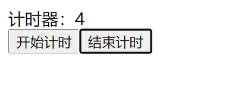
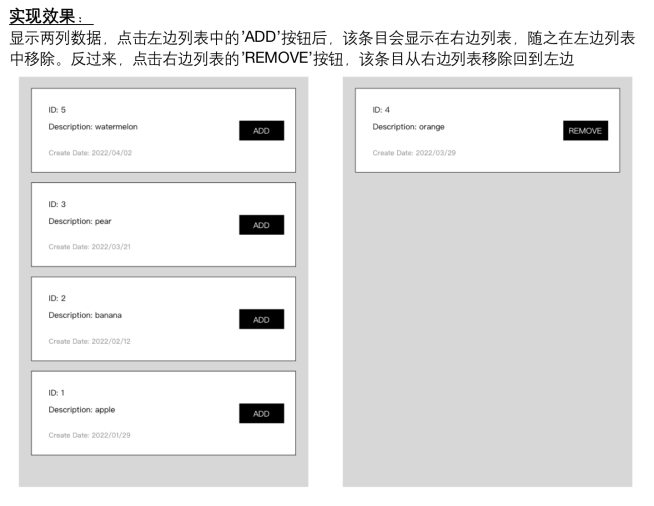

# 第十二——计算属性computed

##  一、概念 

​	在前端开发中，特别是在使用Vue.js这样的框架时，`computed` 属性是一种非常有用的功能。它允许你定义一个属性，该属性是基于其他数据动态计算得出的，并且当依赖的数据发生变化时，这个计算属性会自动更新。


## 二、使用场景：

​		模板内的表达式非常便利，但是设计它们的初衷是用于简单运算的。在模板中放入太多的逻辑，会让模板过重且难以维护，这样我们就可以使用计算属性。

​		例如：我们有这样一个数组，需要在模板中显示总价，而总价的计算需要遍历这个数组（复杂逻辑）

```vue
<template>
        总计:{{ a1.reduce((sum,v)=>sum+v.price*v.num,0)}}
 </template>
<script>
export default {
  data() {
    return {
        a1:[
            {id:1,name:'羊肉串',price:10,num:5},
            {id:2,name:'鸡肉肠',price:15,num:1},
            {id:3,name:'香肠',price:5,num:10},
            {id:4,name:'烤鸭',price:35,num:2},
        ]
    };},};
</script>
<style></style>
```

  这里的模板看起来有些复杂。我们必须认真看好一会儿才能明白它的计算依赖于 `a1`。更重要的是，如果在模板中需要不止一次这样的计算，我们可不想将这样的代码在模板里重复好多遍。

## 三、基本使用 

  **步骤1- 增加配置项computed属性**

  **步骤2-  computed 里面定义一个方法，返回一个值,这个也叫计算属性的getter**

```vue
<template>
       {{ sum }}
 </template>

<script>
export default {
     // 定义一个计算属性countPrice，这里是一个函数，返回一个结果
     // sum属性的值，依赖了a1
    computed:{
        sum(){
            let price=this.a1.reduce((sum,v)=>sum+v.price*v.num,0);
            return price;
        } },
  data() {
    return {
        a1:[
            {id:1,name:'羊肉串',price:10,num:5},
            {id:2,name:'鸡肉肠',price:15,num:1},
            {id:3,name:'香肠',price:5,num:10},
            {id:4,name:'烤鸭',price:35,num:2},
        ]
    };},};
</script>
<style></style>
```

​    **使用步骤3- 在模板的表达式中使用这个方法就可以获取返回值**

```js
{{ sum }}
```


因此我们推荐使用**计算属性**来描述依赖响应式状态的复杂逻辑。这是重构后的示例

```vue
<template>
  <!-- 模板中使用计算属性,这里不要调用 -->
  <div>总计:{{ run }}</div>
</template>

<script>
export default {
  data() {
    return {
        a1:[
            {id:1,name:'羊肉串',price:10,num:5},
            {id:2,name:'鸡肉肠',price:15,num:1},
            {id:3,name:'香肠',price:5,num:10},
            {id:4,name:'烤鸭',price:35,num:2},
        ]
    };},};
    
  //计算属性配置项
  computed:{
    // 定义一个计算属性run，这里是一个函数，返回一个结果
    // run属性的值，依赖了a1
        run(){
           return this.a1.reduce((sum,item)=>sum+item.price*item.num,0);
        }},
</script>
<style></style>
```

   在模板中使用计算属性的方式和一般的属性并无二致(不需要加小括号调用)。Vue 会检测到 `run` 依赖于 `a1`，所以当 `a1` 改变时，任何依赖于 `a1` 的绑定都将同时更新。

   所以，对于任何复杂逻辑，你都应当使用**计算属性**。


## 四、计算属性的好处-缓存 

​     计算属性具有缓存功能，这意味着在每次获取其值时，如果其依赖的数据没有发生变化，则不会重新执行计算过程。

​     计算属性会自动追踪它所依赖的数据的变化。当依赖的数据发生变化时，计算属性会自动重新计算并更新其值，无需显式调用。

   

​    计算属性中的 `getter` 函数是一个用来获取计算属性值的方法。在Vue.js中，计算属性默认是一个只读属性，其值是由 `getter` 函数返回的结果。当依赖的数据发生变化时，计算属性会重新执行 `getter` 函数以获取最新的值。

​    下面模板中使用了两次countPrice，我们在计算属性的getter 函数中打印了一句话，来记录执行次数

```vue
<template>
  <!-- 模板中使用计算属性,这里不要调用 -->
    {{ run }},
    {{ run }},
    {{ run }},
</template>

<script>
export default {
    //计算属性配置项
    computed:{
        // 定义一个计算属性run，这里是一个函数，返回一个结果
        // run属性的值，依赖了a1
        run(){
          console.log('计算了1次');
          return this.a1.reduce((sum,item)=>sum+item.price*item.num,0);
        }},
    
 data() {
    return {
        a1:[
            {id:1,name:'羊肉串',price:10,num:5},
            {id:2,name:'鸡肉肠',price:15,num:1},
            {id:3,name:'香肠',price:5,num:10},
            {id:4,name:'烤鸭',price:35,num:2},
        ]
    };},};};
</script>
<style></style>
```

   **结果发现，使用了三次计算属性，但是只计算了一次**

## 五、vs 方法的区别

大家可能会想到我们在表达式中像这样调用一个函数（方法）也会获得和计算属性相同的结果：

```vue
<template>
    {{ run }},
    {{ run }},
    {{ run }},
<hr>
    {{ pao() }}
    {{ pao() }}
    {{ pao() }}
 </template>

<script>
export default {
 computed:{
   run(){
     console.log('我是计算属性，我计算了1次');
     return this.a1.reduce((sum,item)=>sum+item.price*item.num,0);
        } },
    
  data() {
    return {
        a1:[
            {id:1,name:'羊肉串',price:10,num:5},
            {id:2,name:'鸡肉肠',price:15,num:1},
            {id:3,name:'香肠',price:5,num:10},
            {id:4,name:'烤鸭',price:35,num:2},
        ]
    };},
    
 methods:{
  pao(){
     console.log('我是方法，我计算了1次');
     return this.a1.reduce((sum,item)=>sum+item.price*item.num,0);
        } }};
</script>
<style></style>
```


这样，使用三次，函数就会调用三次


- **性能方面**：计算属性由于其缓存机制，在性能上有优势。

- **代码结构**：计算属性使代码更简洁，更易于理解。

- **使用场景**：计算属性适合于简单的基于数据的计算；方法则适用于更复杂的业务逻辑处理。

  

## 六、修改计算属性

   *   默认情况下，计算属性是只读的。
   *   当你尝试修改一个计算属性时，你会收到一个运行时警告。
   *   只在某些特殊场景中你可能才需要用到“可写”的属性，
   *   如果你想修改计算属性的值，你需要使用一个可写的计算属性，即同时定义 `getter` 和 `setter` 方法。这样你就可以通过 `setter` 方法来修改计算属性的值，并且这些修改会直接影响到依赖的数据。
   *   不推荐直接使用

```vue
 <template>
 <!-- 可以直接使用 -->
   <p>{{ name }}</p>
   <button @click="update">点击修改名字</button>
 </template>

<script>
export default {
   data() {
    return {
        oneName:'张三',
        twoName:'李四'
    } },
    
    methods:{
    update(){
       this.name='李骏 王五';
    }},
     
  /* 可写计算属性
   * 计算属性默认是只读的。
   * 当你尝试修改一个计算属性时，你会收到一个运行时警告。
   * 只在某些特殊场景中你可能才需要用到“可写”的属性，
   * 你可以通过同时提供 getter 和 setter 来创建
   * 不推荐直接使用 */
    computed:{
    name:{
        get(){  // getter
            return this.oneName+this.twoName;
        },
        
        set(e){  // setter 解构赋值
            [this.oneName,this.twoName]=e.split(" ");
        } } }};
</script>

```

​     现在当你再运行 `this.name='李骏 王五';` 时，setter 会被调用而 `oneName` 和 `twoName` 会随之更新。

## 七、最佳实践

### Getter 不应有副作用

​		所谓副作用，就是不要做除了计算，不要做其他事情。

​		计算属性的 getter 应只做计算而没有任何其他的副作用，这一点非常重要，请务必牢记。

​		举例来说，**不要在 getter 中做异步请求或者更改 DOM**！

​		一个计算属性的声明中描述的是如何根据其他值派生一个值。因此 getter 的职责应该仅为计算和返回该值。在之后的学习中我们会讨论如何使用监听器（watch）根据其他响应式状态的变更来创建副作用。

### 避免直接修改计算属性值

   从计算属性返回的值是派生状态。可以把它看作是一个“临时快照”，每当源状态发生变化时，就会创建一个新的快照。更改快照是没有意义的，因此计算属性的返回值应该被视为只读的，并且永远不应该被更改——应该更新它所依赖的源状态以触发新的计算。


## 八、计算属性总结：

### 好处：能监听变化，且有缓存

​			1- 通过计算属性等于说能来监听我们data中数据的变化！

​			2- 如果data中的数据不改变，计算属性不会重新计算；如果data属性变化，那么计算属性就会重新计算

### 计算属性也有缺点：

计算属性(computed)内部不能进行异步操作！

因为计算属性(computed)是通过return返回值传递参数 异步操作的时候return是没有意义的


# 第十三——观察者watch

##  一、概念 

   在Vue中，watch是一个用于监听数据变化的功能。它可以监听一个或多个数据，并在数据发生变化时执行相应的操作。当我们需要在数据变化时执行异步操作、计算属性或执行一些副作用时，watch就派上了用场啦。**注意。watch默认只能进行浅层次监听，如果数据非常复杂，则需要进行深度监听**

##  二、使用步骤

​    观察a1变化，每次变化都会触发watch

  使用1：data增加属性a1,vue配置项中增加watch属性 {}

  使用2：watch对象中 增加属性名和对应的监听函数  

```vue
<template>
   <button @click="jia">点击</button>
   <p>{{a1}}</p>
</template>

<script>
export default {
    data(){
        return{
            a1:0,
        } },

   methods:{
     jia(){
            this.a1++;
        }},

   watch:{
    a1(newValue,oldValue){
     //newValue 是msg最新的值，oldValue 是改变之前msg的值
        console.log('老的值是'+oldValue);
        console.log('新的值是'+newValue);
    }}}
</script>
```


###   使用注意事项：

  ①：不应该使用箭头函数来定义 watcher 函数 (例如 `searchQuery: newValue => this.updateAutocomplete(newValue)`)。理由是箭头函数绑定了父级作用域的上下文，所以 `this` 将不会按照期望指向 Vue 实例，

  ②：侦听器只能侦听 data中已经存在的属性！

- **箭头函数**：不要使用箭头函数定义观察者函数，因为箭头函数会捕获父级作用域的 `this` 值，而不是Vue实例的 `this`。
- **动态属性**：Vue.js 只能侦听到 `data` 对象中已经存在的属性。如果需要动态添加响应式属性，应该使用 `Vue.set` 或者 `this.$set` 方法。


## 应用场景：

​		有些时候数据变化了，你可能要做一个额外的操作，可能是一个ajax操作或者其他的异步操作，这时候可以使用watch监听。

​		ps：当然同步也可以使用他，不过没有缓存而已！所以如果不是异步操作建议使用计算属性。

```vue
<template>
    <input type="text" v-model="title">
    {{ text }}
</template>

<script>
import axios from 'axios';
let http=axios.create({
    baseURL:'https://jx.xuzhixiang.top/ap/api/weather.php?city=',
    timeout:1000,
})
export default {
    data(){
        return{
            title:'合肥',
            text:'',
        } },
    
    watch:{
        title(newValue,oldValue){
            console.log(newValue,oldValue);
            if(newValue!=''){
                let url="https://jx.xuzhixiang.top/ap/api/weather.php?city="+newValue;
                http.get(url,{    
              }).then((e)=>{
                 if(e.data.lives.length>=1){
                   let ah=e.data.lives[0];
                   this.text=ah.province+'省 '+ah.city+' 天气:'+ah.weather;
                 }else{
                    this.text='请输入正确的市区';
                 }
                }) } }}}
</script>
<style></style>
```


## deep深层侦听器

   `watch` 默认是浅层的：被侦听的属性，仅在被赋新值时，才会触发回调函数——而嵌套属性的变化不会触发。如果想侦听所有嵌套的变更，你需要深层侦听器：

​    比如在data中定的是一个对象, a1.name属性不会被监听

```js
<template>
    {{ a1.name }}
    <button @click="gai">点击改名</button>
    <hr>
    {{ a2 }}
    <button @click="gai1">点击改名</button>
</template>

<script>
export default {
    data() {
        return {
            a1: {
                name: '李骏',
            },
            a2: '李圣元'
        }
    },
    watch: {
        a1(newValue, oldValue) {
            console.log(newValue, oldValue);
        },
        a2(xin, lao) {
            console.log(xin, lao);//这个实参叫什么都行
        } },
            
    methods: {
        gai() {
            this.a1.name = '王五'
        },
        gai1() {
            this.a2 = '李骏'
        }}}
</script><style></style>
```

   在上面代码中，a1.name并没有被watch监听，说明默认是浅层监听。


   **要在Vue.js中启用深层监听，需要在 `watch` 对象中为对应的属性添加一个配置对象`handler`，并设置 `deep` 属性为 `true`。这告诉Vue.js需要监视该对象内部属性的变化。**

```js
<template>
    {{ a1.name }}
    <button @click="gai">点击改名</button>
</template>

<script>
export default {
    data() {
        return {
            a1: {
                name: '李骏',
            },}},
        
    watch: {
        a1: {  //添加一个配置对象handler
            handler(newValue, oldValue) {
                console.log(newValue, oldValue);
            },
            deep: true  //开启深层监听
        },},

    methods: {
        gai() {
            this.a1.name = '王五'
        }}}
</script><style></style>
```

​    谨慎使用

   **深度侦听需要遍历被侦听对象中的所有嵌套的属性，当用于大型数据结构时，开销很大。因此请只在必要时才使用它，并且要留意性能。**


## immediate即时回调的侦听器

`    watch` 默认是懒执行的：仅当数据源变化时，才会执行回调。但在某些场景中，我们希望在创建侦听器时，立即执行一遍回调。举例来说，我们想请求一些初始数据，然后在相关状态更改时重新请求数据。

​    我们可以用一个对象来声明侦听器，这个对象有 `handler` 方法和 `immediate: true` 选项，这样便能强制回调函数立即执行：

```vue
<template>
    {{ a1.name }}
    <button @click="gai">点击改名</button>
</template>

<script>
export default {
    data() {
        return {
            a1: {
                name: '李骏',
            },}},
        
    watch: {
        a1: {  //添加一个配置对象handler
            handler(newValue, oldValue) {
                console.log(newValue, oldValue);
            },
            deep: true,  //开启深层监听
            immediate: true //页面刷新以后立刻执行
        },},

    methods: {
        gai() {
            this.a1.name = '王五'
        }}}
</script><style></style>
```


## this.$watch()

​     在Vue.js中，`this.$watch()` 是一个实例方法，用于创建观察者（watcher），它允许您侦听特定数据属性的变化，并在变化发生时执行回调函数。与在 `watch` 对象中定义观察者不同，`this.$watch()` 提供了一种更灵活的方式来创建观察者，尤其是在组件的生命周期中动态创建观察者。

```js
  created() {  //created钩子在实例创建完成之后立即执行。
    this.$watch(
    functionToWatch,          // 要观察的数据属性或计算函数
    callback,                 // 回调函数，当被观察的数据属性变化时执行
    options                    // 可选的配置对象
)}
```

   如果要在特定条件下设置一个侦听器，或者只侦听响应用户交互的内容，这方法很有用。它还允许你提前停止该侦听器。


## 停止侦听器

   用 `watch` 选项或者 `$watch()` 实例方法声明的侦听器，会在宿主组件卸载时自动停止。因此，在大多数场景下，你无需关心怎么停止它。

   在Vue.js中，如果您使用 `this.$watch()` 创建了观察者（watcher），并且希望在某个时刻停止监听数据的变化，可以通过 `this.$watch()` 返回的函数来取消观察者。 

```js
const unwatch = this.$watch('foo', callback)

// ...当该侦听器不再需要时
unwatch();
```


## computed 和 watch 的区别和运用的场景？

**computed：** 是计算属性，依赖其它属性值，并且 computed 的值有缓存，只有它依赖的属性值发生改变，下一次获取 computed 的值时才会重新计算 computed  的值；

**watch：** 更多的是「观察」的作用，类似于某些数据的监听回调 ，每当监听的数据变化时都会执行回调进行后续操作；

**运用场景：**

- 当我们需要进行数值计算，并且依赖于其它数据时，应该使用 computed，因为可以利用 computed 的缓存特性，避免每次获取值时，都要重新计算；
- 当我们需要在数据变化时执行异步或开销较大的操作时，应该使用 watch，使用 watch 选项允许我们执行异步操作 ( 访问一个 API )，限制我们执行该操作的频率，并在我们得到最终结果前，设置中间状态。这些都是计算属性无法做到的。


# 第十四--组件化开发

##  一、什么是组件 

​	组件(Component)是vue.js中很强大的一个功能，可以将一些可重用的代码进行封重用。 所有的Vue 组件同时也是一个Vue 的实例，可以接受使用相同的选项对象和提供相同的生命周期钩子。 

​		一句话概括：组件就是可以扩展HTML元素，封装可重用的HTML代码，可以将组件看作自定义的HTML元素。

​		在vue项目中，所有.vue结尾的文件都是一个组件，一个组件，里面有自己的html，css，js

下面就是一个单文件组件

```vue
<template>
  <div></div>
</template>
<script>
export default {};
</script>
<style></style>
```

#### 为什么组件化

​	编程其实就是现实生活的一种体现！生活中也有组件化设计思想。

​		罗马不是一天建成的，你也不可能一行代码写一个网站！

​	    手机也是由各部分零件组成，

   手机主板类似人体的大脑，主要通过SMT技术将各类器件（如电阻、电容、电感、CPU、内存、运存、屏蔽罩、耳机座、SIM卡座、连接器等）贴装在主板PCB板上

   不同公司开发不同的零件，所有的东西都好像是组成而成，没有一家公司可以独立的自己完成手机的从零生产！手机厂商像是在组装机器一样！

   组件是Vue.js中构建用户界面的核心概念之一。通过组件化开发，可以将复杂的应用程序分解成一系列可重用的小部件，每个部件负责一部分功能。这种方式不仅提高了代码的可读性和可维护性，还使得大型项目的开发变得更加高效和有序。


## 二、vue中组件化设计思想

​    组件允许我们将 UI 划分为独立的、可重用的部分，并且可以对每个部分进行单独的思考。在实际应用中，组件常常被组织成层层嵌套的树状结构。

​    例如，你的网站可能会有页头、侧边栏、内容区等组件，每个组件又包含了其它的像导航链接、按钮、博文之类的组件。

​		组件化以后，就和我们嵌套 HTML 元素的方式类似，Vue 实现了自己的组件模型，使我们可以在每个组件内封装自定义内容与逻辑

​		组件化针对的是页面中的整个完整的功能模块划分，组件是一个html、css、js、image等外链资源，这些部分组成的一个聚合体

#### 优点：代码复用，便于维护

​    划分组件的原则：复用率高的，独立性强的

​    组件应该拥有的特性：可组合，可重用，可测试，可维护

​    vue中的组件化，开发本质就是自定义一个标签！

web标准里面也有自定义标签，Web Components（组件） 规范已经完成并通过，但未被所有浏览器原生实现。目前 Safari 10.1+、Chrome 54+ 和 Firefox 63+ 原生支持 Web Components。相比之下，Vue 组件化开发更加简单，更容易学习，相信未来有一天，浏览器的功能足够强大，我们就不需要学习框架了！

```js
<template>
</template>

<script>
export default {};
</script>

<style></style>
```


 ## 二、组件的使用 

怎么使用组件呢？一般的步骤

- 1.定义组件

- 2.注册组件-组件注册有两种方式：全局注册和局部注册。

- 3.使用组件

  

### 定义组件-封装组件

​    定义组件也叫封装组件，一个vue文件就是一个组件，组件内部有三部分组成，结构，样式，行为

#### template（结构）

​		是组件自己的模板，就是html代码

#### script (行为)

​		是组件自己的内部js，script内部一般会导出一个组件对象，每个组件对象内部都有自己的 data，method，computed，watch等配置项

####   style（样式）

​		是组件自己内部的样式

###   根组件

​     在Vue.js中，根组件是应用程序的最高级别组件，它是所有其他组件的起点。根组件通常负责初始化整个应用程序，并作为其他组件的容器。

​    在 Vue 应用中，根组件通常是你在 `createApp` 中传递的那个组件。它是应用的入口组件，一般是 `App.vue`。

```js
import { createApp } from 'vue'

//引入根组件
import App from './Test.vue'

//引入子组件
import a1 from './components/a1.vue';

// 创建vue实例，传入引入LearnVue组件作为根组件
let app=createApp(App);
app.component('a1',a1);

// 把根组件挂载到 #app上
app.mount('#app');
```

​    根组件一般作为容器使用，没有复用价值。


### 创建一个组件

-    1.定义组件

-    2.注册组件-组件注册有两种方式：全局注册和局部注册。

-    3.使用组件

#### 1-定义组件文件

创建单文件组件 a1.vue

```vue
<template>
    <div>
        {{ a1 }}
        <button>点击</button>
    </div>
</template>

<script>
export default {
    data() {
        return {
            a1: 'Hello World!'
        }}}
</script>

<style>
div {color: yellowgreen;}
</style>
```


#### 2-局部注册组件

script 中 引入a1组件 `import a1 from './components/a1.vue';`

在app.vue的 components配置项中 注册a1组件

```vue
<template>
    <a1></a1>
</template>

<script>
import a1 from './components/a1.vue';
export default {
  /**
   * 在components里注册组件
   * key 是 组件名 value 是对应的组件
   */
 components: {  //注册组件
        a1: a1,  //组件名可以随便取，但是值必须跟引入的名称一致
    }};
</script>
```


#### 3-使用组件

在app.vue中注册的组件，只能在这个文件内部使用

```js
<a1/>
//或者下面
<a1><a1/>
```


#### 4-全局注册

   我们可以使用 Vue 应用实例的 `app.component(组件名，组件对象)` 方法，让组件在当前 Vue 应用中全局可用。

​      先创建一个a1.vue文件

```vue
<template>
    <div>
        {{ a1 }}
        <button>点击</button>
    </div>
</template>

<script>
export default {
    data() {
        return {
            a1: 'Hello World!'
        }}}
</script>

<style>
div {color: yellowgreen;}
</style>
```

​      **然后在main.js中全局注册**

```js
import { createApp } from 'vue'
import App from './Test.vue'
import a1 from './components/a1.vue';//引入组件
let app=createApp(App);// 创建vue实例

//全局注册组件 --- app.mount('#app') 之前
/* 使用component方法注册全局组件，接收两个参数
 * 第一个参数 组件的名字
 * 第二个参数 组件的值
 */
app.component('a1',a1); //全局注册
app.mount('#app')
```

全局组件注册后，使用时不需要额外的引入可以直接使用


#### 5-使用组件

在app实例中注册的组件，在app的所有的子组件内部都能使用

我们在Test.vue组件中使用，Test.vue组件是我们的根组件

```vue
<template>
    <a1><a1/>
</template>
<script>
export default {};
</script>
<style></style>
```


## 封装组件练习

自己封装一个计时器组件

默认从0开始计数，点击按钮按钮，每隔1秒增加1，点击结束停止计时




  子组件：

```vue
<template>
    <div>
        <div>计时器:{{ count }}</div>
        <div>
            <button @click="start">开始计时</button>
            <button @click="end">结束计时</button>
        </div>
    </div>
</template>
<script>
export default {
    data() {
        return {
            count: 0,
            flag: '',
        }
    },
    methods: {
        start() {
            this.flag = setInterval(() => {
                this.count++;
            }, 1000);
        },
        end() {
            clearInterval(this.flag);
        }
    }
}
</script>
<style></style>
```


   在根组件中使用

```vue
<template>
  <div>
    <a1></a1>
    <a1></a1>
    <a1></a1>
  </div>
</template>
<script>
import a1 from './components/a1.vue'; //引入
export default {
  components: {   //局部注册
    a1: a1
  }
}
</script>
<style></style>
```

   可以看到，我们在根组件中使用计时器组件三次，每个组件都有自己的状态，互不影响。

   主要因为组件内部的data是一个对象，每次使用组件，data就会被调用，返回一个新的count。


##  三、组件传值-组件通信 

​		组件间通信也叫组件间传值。

​		组件有 分治 的特点，每个组件之间具有一定的独立性，每个组件都具有自己的template，data，method，computed，watch，生命周期等。

​		在实际工作中使用组件的时候有互相之间传递数据的需求，此时就得考虑如何进行 组件间传值 的问题了。


###  1、父传子 props

​    在Vue.js中，父组件向子组件传递数据是最常见的组件通信方式之一。这种通信方式通常使用 **props** 来实现。

​    在父组件的子组件标签上定义属性，子组件使用props接收。


####    1- 在父组件内部 使用子组件，并且通过属性传递属性值  

​    <!-- 父组件 -->

```vue
<template>
<!-- 使用子组件，把titile的值传给子组件 -->
  <btn title="登录"></btn>
  <btn title="注册"></btn>
</template>

<script>
//引入子组件
import btn from './components/01.组件属性.vue';
export default {
  components: {
    btn: btn,  //局部注册
  },
    
  data() {
    return {
      a1: 0
    }},
    
  methods: {
    jia() {
      this.a1++;
    } }}
</script>
<style></style>
```

1.  创建组件，先在父组件中引入子组件。
2.  局部注册组件
3.  使用注册的组件，把title的值传给子组件

​    <!-- 子组件 -->

```vue
<template>
    <p>{{ a1 }}</p>
   <!-- 把父组件传入的值像插值表达式一样使用即可 -->
    <button @click="jia">{{ title }}</button>
</template>

<script>
export default {
  //声明当前组件 支持的属性 父组件要传入的值，需要在props里面声明
    props: ["title"],
    data() {
        return {
            a1: 0,
        }},
    methods: {
        jia() {
            this.a1++;
        } }}
</script>
<style></style>
```

   1.子组件中首先需要声明父组件传入的属性，在props里面声明

   2.把父组件传入的值像插值表达式一样使用即可


#### 2-  属性声明-props 配置项

​     在Vue.js中，`props` 是一种特殊的属性，用于父组件向子组件传递数据。`props` 的配置项允许你定义子组件期望从父组件接收哪些数据以及这些数据的格式和验证规则。

   在组件中增加一个props 配置项，后面跟一个数组,数组里的字符串，表示组件自己的属性名。这个属性属于这个组件，只能在直接内部使用，只不过没有值（像函数的形参,在使用的时候可以给他赋值）

```js
export default {
  props: ['title','bb'],
   //声明当前组件 支持的属性 父组件要传入的值，需要在props里面声明
};
```

​     props 在组件内部可以像是data里面的状态一样使用

```java
//模板中 {{title}}
//方法中 this.title
<template>
    <button @click="time">点击</button>
    {{ title }}
</template>

<script>
export default {
    props: ["title"],
    methods: {
        time() {
           console.log(this.title);
        }}}
</script>
```

​      

####     **父传子第二种写法**

   可以把props后面的数组写成一个对象，这样子的好处是可以添加一些配置项。比如:type: String,必须为字符类型。required：true,参数必须要传。

```vue
<template>
    <!-- 可以直接使用 -->
    <button>{{  title }}</button>
</template>

<script>
export default {
  // 子组件使用props接收
    
  /* props:属性值 可以是一个数组
   * 数组里存放当前组件接收到的参数
   * 注意：props定义的参数名和父组件传入的参数名必须一致
   */
  // 例:props: ["title"],
   
  /* props:属性值 可以是一个对象
   * 这样子的好处是可以添加一些配置项。
   * 对象的key是当前组件接收的参数
   * 对象的value又是一个对象
   * 这种方式了解即可
   */
  props: {
    title: {
      /* type 接收参数的类型 */
      type: String,
      /* required 参数是否必传 */
      required: false,
      /* 参数默认值 */
      default: "默认名字",
    },},};
</script>
```

####   总结：父传子通过props属性

  1-子组件中在props 中 定义属性 

  2-父组件以属性的形式传值到子组件身上


#### 课后练习-父子通信

给计时器组件，添加计时初始值属性，默认初始值为10

   **子组件**

```vue
<template>
    <p>计时器{{ count }}</p>
    <button @click="start">开始计时</button>
    <button @click="end">结束计时</button>
</template>

<script>
export default {
    props: {  //props可以是数组也可以是一个对象，是对象的话可以设置配置项
        num: {
            type: Number, //要求必须是number类型
            default: 10,  //没用值传入的时候默认是10
        } },
    
    data() {
        return {
            count: this.num,
            timer: null,
        }},
    
    methods: {
        start() {
            this.timer = setInterval(() => {
                this.count++;
            }, 1000)
        },
        end() {
            clearInterval(this.timer);
        }}}
</script>
<style></style>
```

  **父组件中使用**

```vue
<template>
  <div>   <!-- 3.使用组件 -->
    <Time :num="0"></Time>
    <Time :num="a1"></Time>
    <Time num="100"></Time>
  </div>
</template>

<script>
import Time from './components/01.组件属性.vue';  //1.引入组件
export default {
  components: {
    Time,  //2.注册组件
  },
    
  data() {
    return {
      a1: 10,
    }}}
</script>
<style></style>
```

**注意**  

`:num="0"`采用动态绑定属性，传入的是一个数字0 ，动态绑定的时候，属性值引号里面写的js表达式

`:num="a1"` 采用动态绑定属性，传入的是 变量a1 ，a1需要提前在data中定义好

`num="100"`采用的静态绑定，传入的是字符串100，不会随数据变化而更新。


## 单向数据流

​    所有的 props 都遵循着**单向绑定**原则，props 因父组件的更新而变化，自然地将新的状态向下流往子组件，而不会逆向传递。这避免了子组件意外修改父组件的状态的情况，不然应用的数据流将很容易变得混乱而难以理解。

   另外，每次父组件更新后，所有的子组件中的 props 都会被更新到最新值，这意味着你**不应该**在子组件中去更改一个 prop。若你这么做了，Vue 会在控制台上向你抛出警告

​    看下面的例子：子组件里面改了 属性num的值

```js
 props: ["num"], //子组件注册组件
  created() {  //created是一个钩子函数，vue实例创建后立即调用
    // ❌ 会报错！num 是只读的！
     this.num = 5;
  } 
```

​     这里有两种常见的试图变更一个 prop 的情形：

1. **prop 被用于传入初始值；而子组件想在之后将其作为一个局部数据属性**。在这种情况下，最好是新定义一个局部数据属性，从 props 上获取初始值即可：

   ```js
     props: ['num'],
     data() {
       return {
         // 计数器只是将 this.num 作为初始值
         // 像下面这样做就使 prop 和后续更新无关了
         count: this.num
       } }
   ```
   
2. **需要对传入的 prop 值做进一步的转换**。在这种情况中，最好是基于该 prop 值定义一个计算属性：

   ```js
    props: ['num'],
    computed: {    //使用计算属性
               // 该prop变更时计算属性也会自动更新
       newnum() {  //定义一个计算属性newnum
         return this.num.trim().toLowerCase();
       }}
   //trim(): 去除 size 字符串两端的空白字符。
   //toLowerCase(): 将 size 字符串转换为小写字母。
   ```


###   更改对象 / 数组类型的 props

​     如果传入的是对象-对象的属性修改了，父组件中也会改变。

​     当对象或数组作为 props 被传入时，虽然子组件无法更改 props 绑定，但仍然**可以**更改对象或数组内部的值。这是因为 JavaScript 的对象和数组是按引用（地址）传递，而对 Vue 来说，禁止这样的改动虽然可能，但有很大的性能损耗，比较得不偿失，。

​    这种更改的主要缺陷是它允许了子组件以某种不明显的方式影响父组件的状态，可能会使数据流在将来变得更难以理解。

​		在最佳实践中，你应该尽可能避免这样的更改，**除非父子组件在设计上本来就需要紧密耦合**。在大多数场景下，子组件应该抛出一个事件（下面就会学习）来通知父组件做出改变。


  下面父组件传递给子组件一个对象a1，

子组件内部使用gai接收属性，并且内部修改了a1.name 这个属性

```vue
/* 父组件 */
<template>
    <btn :name="a1"></btn>
</template>

<script>
import btn from './components/01.组件属性.vue'
export default {
  components: {
    btn
  },
  data() {
    return {
      a1: {
        name: '李骏',
      }}},}
</script>
<style></style>

/* 子组件 */
<template>
    <p>{{ name }}</p>
    <button @click="gai">点击更改</button>
</template>
<script>
export default {
    props: ["name"],
    methods: {
        gai() {
            this.name.name = '张三'; //更改父组件的name
        }}}
</script>
<style></style>
```

  **像上面那么虽然没问题，但是不建议。**


###  2、子传父 `$emit`

#### 组件事件

​    **组件就是我们自定义的标签，他也可以添加事件**

   在js中，我们可以监听按钮标签的click事件。

   在Vue.js中，子组件向父组件传递数据通常是通过触发事件 (`$emit`) 的方式实现的。

​    同样，组件也是标签(自定义的标签)，组件也为了提供了添加事件的方法。事件名可以自己随便定义。

​    事件的作用：在父组件内部，我们可以通过事件监听一个子组件内部发生了某些事情。一般用于子父通信。


​      触发与监听事件

#####   1-监听子组件的自定义事件

  通过v-on：事件名 就可以监听 组件的事件，testEvent事件名字自己可以自己定义

```java
<MyButton v-on:testEvent="test"></MyButton>
<MyButton @lijun="test"></MyButton>
```

  同样，组件的事件监听器也支持@缩写(上下是一样的)


#####   2-子组件内部可以在适当的时候，触发一个事件

​	组件内部通过 this.$emit('my-event',事件参数) 可以触发组件的自定义事件

```js
$emit(事件名，参数) 第一个参数为 自定义的事件名称 第二个参数为需要传递的数据
```

####    来看个例子

#####    1-App.vue中 监听 子组件MyButton.vue的点击事件

```vue
  <!-- 父组件中 监听 子组件MyButton的自定义事件myClick -->
 <template>
    <MyButton @lijun="test" title="李骏"></MyButton>
    <!-- 设置了一个自定义组件Mybutton，添加了一个自定义事件叫lijun -->
    <!-- 然后父组件传入了一个title值叫李骏  -->
</template>

<script>
import MyButton from './components/MyButton.vue'; //导入子组件
export default {
    components: {
        MyButton //局部注册，名字叫MyButton
    },
    methods: {
        test(e) {
            console.log(e);//子组件传递过来的数据,e可以改成其他的
        }}}
</script>
<style></style>
```

#####    2-子组件中在适当的时候通过$emit触发自定义事件myClick

```vue
<template>
    <button @click="a1">{{ title }}</button>
   <!--  也可以这么写：<button @click="$emit('lijun', '随便打什么')">{{ title }}</button> -->
</template>

<script>
export default {
  emits: ['lijun'],  //声明传入的自定义事件
  props: ['title'],  //配置项接收父组件传入的数据
  methods: {
     a1() {
            this.$emit('lijun', '你好李骏');
  //触发组件的自定义事件myClick，传递数据，这样父组件里面的监听函数 就会执行
        }},};
</script>
<style></style>
```

​     和原生 DOM 事件不一样，组件触发的事件**没有冒泡机制**。你只能监听直接子组件触发的事件。


#### 组件内也可以声明自己的自定义事件

​		组件要触发的事件可以显式地通过 `emits` 选项来声明，这样别人在看我们这个组件的代码的时候，会很容易知道，我们提供了哪些事件

  配置中添加emits配置项，可以声明也可以不声明，推荐声明

```js
emits: ['lijun'],
```

   这个 `emits` 选项还支持对象语法，它允许我们对触发事件的参数进行验证：

​		尽管事件声明是可选的，我们还是推荐你完整地声明所有要触发的事件，以此在代码中作为文档记录组件的用法。

```js
  emits: {
    submit(payload) {
      // 通过返回值为 `true` 还是为 `false` 来判断
      // 验证是否通过
    }
```


####  事件校验（了解）

​     emits也可以写成对象的形式。

​    和对 props 添加类型校验的方式类似，所有触发的事件也可以使用对象形式来描述。

​    要为事件添加校验，那么事件可以被赋值为一个函数，接受的参数就是抛出事件时传入 `this.$emit` 的内容，返回一个布尔值来表明事件是否合法。

```js
export default {
  emits: {
    // 没有校验
    myClick: null,
    // 校验 submit 事件
    submit: ({ email, password }) => {
      if (email && password) {
        return true
      } else {
        console.warn('Invalid submit event payload!')
        return false
      }} },
  methods: {
    submitForm(email, password) {
      this.$emit('submit', { email, password })
    }}}
```

​    上面代码就校验了，组件内部触发自定义事件的时候，必须传入邮箱和密码，两个参数。**不然就会报警告。**


###  3、祖孙传值---依赖注入 

####  provide / inject 依赖注入 

   provide（提供数据）：可以让我们指定想要提供给后代组件的数据或方法

​    inject（注入）：在任何后代组件中接收想要添加在这个组件上的数据或方法，不管组件嵌套多深都可以直接注入数据，拿来用。父组件和孙子组件都可以用。

#####    创建父组件father.vue

```vue
<template>
    <div class="a2">父亲组件 {{ name }}</div> <!-- 注入的数据可以像data一样直接用 -->
    <hr>
    <son></son> <!-- 使用孙组件 -->
</template>

<script>
import son from './son.vue';  //引入孙组件
export default {
    inject: ['name'],   //注入数据
    components: { son }  //局部注册孙组件
}
</script>
<style scoped>
.a2 {
    color: orange;
    border: 1px solid chartreuse;
}
</style>
```

#####    创建孙组件son.vue 

father.vue组件使用son.vue 组件

```vue
<template>
    <div class="a3">孙子组件 {{ name }}</div>  <!-- 注入的数据可以像data一样直接用 -->
</template>

<script>
export default {
    inject: ['name'],  //注入数据
}
</script>
<style scoped>
.a3 {
    color: blue;
    border: 1px solid yellow;
}
</style>
```

#####   创建爷组件grandfather.vue  根组件

   根组件在main.js 设置到 createApp(App)里面

   根组件中使用father.vue组件

```vue
<template>
    <div>爷爷组件</div>
    <hr>
    <father></father>   <!-- 使用父组件 -->
</template>

<script>
import father from './father.vue'; //引入父组件
export default {
    components: {
        father  //局部注册父组件
    },
    //提供
    provide() {
        // 定义爷爷组件(上层组件 提供给底层组件的数据)
        return {
            name: '李骏'  //把name数据提供给下面的组件
        }}}
</script>
<style scoped>
div {
    color: red;
    border: 1px solid rebeccapurple;
}
</style>
```


##### 爷组件provide提供数据

在最上级组件（根组件）中，provide配置中的提供数据

   * provide 是一个函数 函数必须有返回值
   * 返回的值可以在任意子级组件接收

```vue
<template>
    <div>爷爷组件</div>
    <hr>
    <father></father>
</template>

<script>
import father from './father.vue';
export default {
  components: {
        father //局部注册
    },

  /**
   * 使用provide 提供值
   * provide 是一个函数 函数必须有返回值
   * 返回的值可以在任意子级组件接收
   */
  provide () {
   return {
            name: '李骏'
        }},};
</script>
```

##### 孙组件inject注入数据

   在孙子son组件中使用inject配置项,注入数据，inject的值是一个数组，数组中写要注入的数据的名字字符串   例: inject: ['name'],

```vue
<template>
    <div class="a3">孙子组件 {{ name }}</div>
</template>
<script>
export default {
    //注入数据
    inject: ['name'],
}
</script>
<style scoped>
.a3 {
    color: blue;
    border: 1px solid yellow;
}
</style>
```

####  provide / inject 使用场景 

国际化

主题色切换

祖孙传值


#### 应用层 Provide

除了在一个组件中提供依赖，我们还可以在整个应用层面提供依赖：

在应用级别提供的数据在该应用内的所有组件中都可以注入。

```js
import { createApp } from 'vue'
const app = createApp({})
app.provide(/* 注入名 */ 'name', /* 值 */'你好，我是李骏')
app.mount('#app');
```

##### inject (注入)

要注入上层组件提供的数据，需使用 `inject` 选项来声明：

```vue
<template>
  {{ name }}
</template>

<script>
export default {
  inject: ['name'],  //注入数据
  created() {
    console.log(this.name) //你好，我是李骏
  }}
</script>
```


####  $attrs 透传属性（了解）

   多层嵌套组件传递数据时，如果只是传递数据，而不做中间处理的话就可以用这个，比如父组件向孙子组件传递数据时

   $attrs：包含父作用域里除 class 和 style 除外的非 props 属性集合。通过 this.$attrs 获取父作用域中所有符合条件的属性集合，然后还要继续传给子组件内部的其他组件，就可以通过 v-bind="$attrs"

爷爷组件

```vue
<template>
  <div>
    <Child1 @handle2="handle" name="来自爷爷的问候"></Child1>
  </div>
</template>

<script>
import Child1 from "./child1.vue";
export default {
  components: {
    Child1,
  },

  methods: {
    handle (msg) {
      console.log("触发接收？", msg)
    }}};
</script>
```

子组件

​    在子组件内部 将child1 组件的 attrs 里面的值 都传入 child2的 属性里面

`<Child2 v-bind="$attrs"></Child2>` 相当于是将当前组件的所有传入的属性，都传入child2组件

```vue
<template>
  <div>
    子组件
    <!-- 使用 v-bind="$attrs" 继续往下传-->
    <!-- 将child1 组件的 attrs 里面的值 都传入 child2的 属性里面 -->
    <Child2 v-bind="$attrs"></Child2>
  </div>
</template>

<script>
import Child2 from "./child2.vue";
export default {
  components: {
    Child2,
  },
};
</script>
```

   孙组件，获取自己的attrs属性

```vue
<template>
  <div>孙组件 ---{{ msg }}</div>
</template>
<script>
export default {
  /**
   * 超纲一点生命周期😄
   * 组件创建完成后调用
   */
  created() {
    /**
     * 使用 this.$attrs 获取上级组件往下抛的所有的值
     * 注意：这里传入的事件会在事件名前加上on，并且驼峰 如 爷爷组件传入的
     * @handle2 在这里变成了onHandle2
     */
    console.log(this.$attrs);
  },
};
</script>
```


###  4、兄弟组件传值 

​    在Vue.js中，兄弟组件之间通常不直接通信，因为这会导致组件之间的耦合度增加。解决兄弟组件之间的通信问题通常有三种主要方法：

1.   状态提升，把两个兄弟组件共同的数据提升到一个根组件里，这样子就都可以使用

2.   事件总线，vue2中用的比较多。

3.   状态管理，任何组件之间的通信。(后面会说)

   

#### **1.状态提升**

  原理就是把两个兄弟组件共同的数据提升到一个根组件里，这样子就都可以使用。

##### ①.根组件_APP.vue

```vue
<template>
    <p>{{ a1 }}</p>
    <bro1 :num="a1" @change="fn"></bro1> <!-- 添加事件，子传父 -->
    <bro2 :num="a1"></bro2>  <!-- 使用子组件 -->
</template>

<script>
import bro1 from './bro1.vue';  //引入子组件
import bro2 from './bro2.vue';  //引入子组件
export default {
    components: { bro1, bro2 }, //局部注册
    data() {
        return {
            a1: 10
        } },
    methods: {
        fn(e) {
            console.log(e); //1000
            this.a1 = e;
        }  }}
</script>
<style></style>
```

##### ②.兄弟1_bor1.vue

​    如果需要修改的话，还是父传子那一套。通过$emit通知父组件修改

```vue
<template>
    <p>bro1的值是{{ num }}</p>
    <!-- 触发事件，通知父组件修改 -->
    <button @click="$emit('change', 1000)">点击更改</button>
</template>

<script>
export default {
    props: ['num'], //属性声明
    emits: ['change'], //事件声明
   ,}
</script>
<style></style>
```

##### ③.兄弟2_bor2.vue

```vue
<template>
    <p>bro2的值是{{ num }}</p>
</template>
<script>
export default {
    props: ['num'],  //属性声明
}
</script>
<style></style>
```


#### **2.事件总线**

   这里也可以使用事件总线的方式来解决。

   事件总线（Event Bus）是一种用于在软件系统中传递事件和消息的机制。它基于发布-订阅模式，允许不同组件或模块之间进行解耦，通过发送和接收事件来实现彼此之间的通信。

   事件总线通常由三个主要组件组成：发布者（Publisher）、订阅者（Subscriber）和事件（Event）。发布者负责发布事件，订阅者则订阅感兴趣的事件，并在事件发生时执行相应的操作。

   通过使用事件总线，系统中的不同模块可以通过发布和订阅事件的方式进行通信，而不需要直接依赖于彼此。这种解耦的方式可以提高系统的可扩展性和灵活性，同时也降低了模块之间的耦合度。

   事件总线在许多领域都有广泛的应用，包括前端开发、后端开发、分布式系统等。它可以用于实现事件驱动的架构、消息队列、异步通信等场景，帮助开发人员更好地组织和管理系统中的事件和消息。

**应用**
   拿vue来说，vue2中提供了事件总线，vue3中好像没有。当然实际业务中好像很少会用到，就拿我们项目来说当跨组件（不是父子组件）通信时一般使用pinia。在组件a中改变缓存中的值，在组件b中监听值的变化。

   一般在具体业务中很少会用到，因为可能会导致事件比较多，难以维护。但是在项目框架中使用感觉还是很有用的，统一维护处理各种事件。


#####  event bus 

   EventBus 是中央事件总线，不管是父子组件，兄弟组件，跨层级组件等都可以使用它完成通信操作。

   在 Vue 3 中，由于 Vue 2 中可用的全局事件总线（Vue.prototype.$emit 和 Vue.prototype.$on）被移除，我们需要使用其他方式来实现类似的功能。在 Vue 3 中，可以使用 mitt 这个第三方库来创建一个事件总线。

##### 安装

```js
pnpm install mitt
```

##### **使用**

在需要使用事件总线的地方导入和创建它

```js
import mitt from 'mitt';
//创建一个事件总线对象
const eventBus = mitt();
//默认导出事件总线对象
export default eventBus;
```

   发送事件

   要发送事件，你可以使用 eventBus.emit(eventName, payload) 方法

```js
eventBus.emit('eventName', payload);
```

   监听事件

```js
eventBus.on('eventName', (payload) => {
  // 处理事件的回调逻辑
});
```

   取消监听

```js
eventBus.off('eventName', handler);
```

   我们创建一个evnentBus.js文件，里面创建一个mitt实例，导出

```js
import mitt from 'mitt';
//创建一个事件总线对象
const eventBus = mitt();
//默认导出事件总线对象
export default eventBus;
```

​     任意一个组件内部(这里在bro1内部)，可以引入 实例，在mounted里面监听事件

```js
 import eventBus from "./evnentBus";
 mounted() {
    //监听test事件
   eventBus.on('lijun', (e) => {
            console.log('b2监听的回调函数');
            console.log(e);
        })},
```

​     在任意一个组件内部，都可以触发这个事件.

​     这里在child2组件内部 点击按钮的时候触发test事件，传入值111

```js
  <button @click="fn">test</button>
 import eventBus from "./evnentBus"; 
 methods: {
    fn() {
      console.log("孙子组件 触发 test 事件111");
      eventBus.emit('lijun', 9999);
    }, },
```


# 第十三——组件的生命周期

##  一、概念 

​    世间万物都有自己生命周期，vue也有这一特点，vue的每个组件的生命周期都可以简单分为四个阶段：创建阶段，挂载阶段，更新阶段，销毁阶段。

​    每个 Vue 实例（组件）在被创建时都要经过一系列的初始化过程——例如，需要设置数据监听、编译模板、将实例挂载到 DOM 并在数据变化时更新 DOM 等。

​     总共**四个阶段，八个钩子函数**


   **现在有两个组件，一个父组件和一个子组件，父组件点击按钮会创建子组件，代码如下：**

   父组件

```vue
<template>
    <button @click="create">点击创建组件</button>
    <button @click="delet">点击卸载组件</button>
    <son v-if="istrue == true"></son>
</template>

<script>
import son from './子组件.vue'; //引入子组件
export default {
    components: {
        son, //局部注册
    },
    
    data() {
        return {
            istrue: false,
        } },
    
    methods: {
        create() {
            this.istrue = true;
        },
        delet() {
            this.istrue = false;
        } }}
</script>
<style scoped>
p {
    color: red;
}
</style>
```

  子组件

```vue
<template>
    <p>我是一个组件</p>
</template>

<script>
export default {
    beforeCreate() {
        console.log('创建前----准备创建子组件');
    },
    created() {
        console.log('创建后----子组件创建完成');
    },
    beforeMount() {
        console.log('挂载前----子组件开始挂载');
    },
    mounted() {
        console.log('挂载后----子组件挂载完毕');
    },
    beforeUpdate() {
        console.log('更新前----子组件更新前');
    },
    updated() {
        console.log('更新后----子组件更新完成');
    },
    beforeUnmount() {
        console.log('卸载前----子组件即将卸载');
    },
    unmounted() {
        console.log('卸载后----子组件已经被卸载');
    }}
</script>
<style></style>
```


##  一、创建阶段 

###  1、创建前(`beforeCreate`)

   在组件实例创建之前调用，此时组件的数据观测、事件监听和模板编译尚未开始，因此无法访问到组件的响应式数据、计算属性、方法等

-  在这个阶段，Vue 实例刚刚被创建，但是还没有挂载到 DOM 上。
- 此时尚未初始化 `data`、`methods`、`computed` 和 `watch` 等属性。

```vue
<template>
    <p>我是一个组件</p>
</template>

<script>
export default {
 beforeCreate() {  
        console.log('创建前-----准备创建子组件');  //beforeCreate()是一个生命周期钩子函数
    }}
</script>
```

###    2、**创建后 (`created`)** 

​    在组件实例创建之后调用，此时组件的数据观测、事件监听和模板编译已经完成，可以访问到组件的响应式数据、计算属性、方法等，但是还没有挂载到 DOM 上，因此无法访问到组件的元素或子组件。常用于发送网络请求。

-  在这个阶段，Vue 实例已经被创建，并且已经初始化了 `data`、`methods`、`computed` 和 `watch` 等属性。

```vue
<template>
 <p>我是一个组件</p>
</template>

<script>
export default {
created() {
        console.log('创建后----子组件创建完成');
    },}
</script>
```

##  二、挂载阶段 

###  1、**挂载前 (`beforeMount`)**

   在组件挂载到 DOM 之前调用，此时组件的虚拟 DOM 已经创建，但是还没有插入到父容器中，可以对虚拟 DOM 进行一些操作或修改

- 在这个阶段，Vue 实例开始挂载过程，但尚未完成挂载。
- 此时可以访问到 `el` 属性，但还不能访问到真实的 DOM 元素。

```vue
<template>
   <p>我是一个组件</p>
</template>

<script>
export default {
beforeMount() {
        console.log('挂载前----子组件开始挂载');
 }}
</script>
```

###  2、**挂载后 (`mounted`)**

   在组件挂载到 DOM 之后调用，此时组件的虚拟 DOM 已经插入到父容器中，并且生成了真实的 DOM 节点，可以访问到组件的元素或子组件，并且可以执行一些需要 DOM 的操作或者ajax请求。

- 在这个阶段，Vue 实例已经完成挂载，并且可以访问到真实的 DOM 元素。
- 这是初始化操作的最佳时机，例如获取外部数据或设置DOM事件监听器。

```vue
<template>
   <p>我是一个组件</p>
</template>

<script>
export default {
 mounted() {
     console.log('挂载后----子组件挂载完毕');
 }}
</script>
```

##  三、更新阶段 

###  1、**更新前 (`beforeUpdate`)**

   在组件更新之前调用，此时组件的数据已经发生变化，但是还没有更新到 DOM 上，可以在这个钩子中获取更新前的状态，并进行一些比较或逻辑处理。

- 在这个阶段，Vue 实例即将重新渲染和更新 DOM。
- 你可以在这个阶段对组件的状态进行最后的调整。

```vue
<template>
   <p>我是一个组件</p>
</template>

<script>
export default {
beforeUpdate() {
        console.log('更新前---子组件更新前');
    }}
</script>
```

###  2、**更新后 (`updated`)**

​     在组件更新之后调用，此时组件的数据已经更新到 DOM 上，并且完成了重新渲染，可以在这个钩子中获取更新后的状态，并进行一些后续操作或效果处理。**不能在这个生命周期里做响应式操作，否则会死循环**

- 在这个阶段，Vue 实例已经完成了 DOM 更新。

- 你可以在这个阶段对更新后的 DOM 执行操作，比如滚动或动画。


```vue
<template>
  <p>我是一个组件</p>
</template>
<script>
export default {
 updated() {
        console.log('更新后----子组件更新完成');
    }}
</script>
```

##  四、卸载阶段 

###  1、卸载前(`beforeUnmount `)

​    在组件卸载之前调用，此时组件还处于可用状态，可以在这个钩子中执行一些清理操作，如移除事件监听器、取消网络请求、停止定时器等。

- 在这个阶段，Vue 实例即将被销毁。
- 此时不能再访问到实例的任何方法或属性。

```vue
<template>
 <p>我是一个组件</p>
</template>

<script>
export default {
beforeUnmount() {
        console.log('卸载前----子组件即将卸载');
    }}
</script>
```

###  2、卸载后(`unmounted `)

​     在组件卸载之后调用，此时组件已经从 DOM 中移除，并且停止了所有的响应式效果和事件监听，无法再访问到组件的任何属性或方法。

- 在这个阶段，Vue 实例已经被完全销毁。
- 此时不能再访问到实例的任何方法或属性。

```vue
<template>
  <p>我是一个组件</p>
</template>

<script>
export default {
unmounted() {
        console.log('卸载后----子组件已经被卸载');
    }}
</script>
```


## 总结：生命周期的每个阶段适合做什么

**created**

```js
我们在此时可以进行一些简单的Ajax，并可以对页面进行初始化之类的操作，（如果ajax请求以后不操作dom，也可以在此发起）
```

**mounted**

```js
我们在此时可以去获取节点信息，做Ajax请求，对节点做一些操作
```

**beforeupdate**

```js
我们可以在此时访问现有的Dom，手动移除一些添加的监听事件
```

**updated**

```js
但还是不建议在此时进行数据操作，避免进入死循环
```

**beforeUnmount**

```js
在此时可以做一些操作，比如销毁定时器，解绑全局事件，销毁插件对象等
```


##  十、forceUpdate 

###  1、概念 

   迫使Vue实例重新（rander）渲染虚拟DOM，注意并不是重新加载组件。结合vue的生命周期，调用$forceUpdate后只会触发beforeUpdate和updated这两个钩子函数，不会触发其他的钩子函数。它仅仅影响实例本身和插入插槽内容的子组件，而不是所有子组件

​    在Vue.js中，`$forceUpdate` 是Vue实例的一个方法，用于强制更新虚拟DOM。它仅存在于Vue 2中，并不在Vue 3的官方API中。

###    2、基本使用 

​    把当在data里没有显示的声明一个对象的属性，而是之后给该对象添加属性，这种情况vue是检测不到数据变化的，可以使用$forceUpdate()。

​    `name` 没有在 `data` 中定义，因此它不是一个响应式数据。

```vue
<template>
    {{ name }}
    <button @click="update">点击修改名字</button>
</template>

<script>
export default {
  methods: {
    update () {
       this.name = '李骏';
      // 如果不加forceUpdate 页面不会渲染
      this.$forceUpdate();
    }}};
</script>
```

###  3、注意 

  **官方说如果你现在的场景需要用forceUpdate方法 ,那么99%是你的代码逻辑操作有问题。😈**


# 第十四——ref和$refs获取DOM

##  一、概念 

​    虽然 Vue 的声明性渲染模型为你抽象了大部分对 DOM 的直接操作，但在某些情况下，我们仍然需要直接访问底层 DOM 元素。要实现这一点，我们可以使用特殊的 `ref` 属性：

​    ref 被用来给DOM元素或组件注册引用信息。引用信息会根据父组件的 $refs 对象进行注册。如果在普通的DOM元素上使用，引用信息就是元素; 如果用在子组件上，引用信息就是组件实例。

​    注意：只要想要在Vue中直接操作DOM元素，就必须用ref属性进行注册

##  二、ref和$refs属性

​      ref获取dom和js获取dom的不同是，ref功能更加强大，可以获取子组件，并且可以更改子组件内部的值、属性和方法。

​    使用方法:   ①.在template在标签里使用ref,并且设置名字。

```vue
<button ref="a1">第一个点击</button>
```

​							②.在script中使用this.$refs获取dom

```java
mounted() { console.log(this.$refs.a1); },
//得到的是:<button>第一个点击</button>
```


<父组件>

```vue
<template>
    <div id="a0">a0</div>  <!-- js获取dom的写法 -->
    <hr>
    <div ref="a1">a1</div>  <!-- ref获取dom的写法 -->
    <hr>
    <son ref="a2"></son>  <!-- 使用子组件 -->
</template>

<script>
import son from './子组件.vue'; //引入子组件
export default {
    components: {son},  //局部注册
    mounted(){
        //js的写法
        let a0 = document.querySelector('#a0');
        console.log(a0);
        a0.innerHTML = '李骏'
        
        //vue提供的ref属性
      console.log(this.$refs.a1);  // <div>a1</div> 
        //可以获取子组件
      console.log(this.$refs.a2);  //<son></son>
      this.$refs.a2.b1 = 4231;
      console.log(this.$refs.a2.b1);
    }}
</script>
```

<子组件>

```vue
<template>
    <button>我是一个组件</button>
    {{ b1 }}
</template>

<script>
export default {
    data() {
        return {
            b1: 1000
        }},}
</script>
<style></style>
```


##  三、在组件上使用ref 

ref 加在子组件上，用this.$refs.xxx 获取到的是组件实例，可以使用组件的所有方法

```vue
<template>
    <son ref="a2"></son>  <!-- 使用子组件 -->
</template>

<script>
import son from './子组件.vue';
export default {
    components: {son},  //局部注册
    mounted(){;
        //可以获取子组件
      console.log(this.$refs.a2);
      this.$refs.a2.b1 = 4231;
      console.log(this.$refs.a2.b1); //4231
    }}
</script>
```


# 第十五、组件上的v-model

  `v-model` 可以在组件上使用以实现双向绑定。

  首先让我们回忆一下 `v-model` 在原生元素上的用法：

```js
<input v-model="search" />
```

  在代码背后，模板编译器会对 `v-model` 进行更冗长的等价展开。因此上面的代码其实等价于下面这段：

```js
<input
  :value="search"
  @input="search = $event.target.value"
/>

<input
  :value="search"
  @input="e=>search = e.target.value"
/>
```

​     而当使用在一个组件上时

```vue
 <template>
    <Mybutton v-model="a1"></Mybutton> <!-- 在子组件上使用v-model -->
    {{ a1 }}
</template>

<script>
import Mybutton from './Mybutton.vue';   //引入子组件
export default {
    components: { Mybutton },  //局部注册
    data() {
        return {
            a1: '你好',
        }}}
</script>
<style></style>
```

​     `v-model` 会被展开为如下的形式（**这个展开是固定的，vue做的-需要记住**）：

```js
< Mybutton
  :modelValue="search"
  @update:modelValue="newValue => searchText = newValue" />
```

​     等于说是Mybutton内部 会有一个modelValue属性，并且提供一个自定义事件，update:modelValue ，自定义事件在 Mybutton内部触发的时候，会把事件参数传递给  modelValue属性绑定的变量，在这里就是search，从而实现了 双向绑定。


   要让这个例子实际工作起来，`<Mybutton>` 组件内部需要做两件事：

1. 将内部原生 `<input>` 元素的 `value` 属性 绑定到 `modelValue`  prop上
2. 当原生的 `input` 事件触发时，触发一个携带了新值的 `update:modelValue` 自定义事件

​     这样才能让组件外部同步获取到组件内部的input的value值

​    这里是相应的代码：

```vue
<!-- Mybutton.vue -->
<template>
  <input type="text" 
         :value="modelValue" 
         @input="$emit('update:modelValue', $event.target.value)">
</template>

<script>
export default {
    props: ['modelValue'],
    emits: ['update:modelValue']
}
</script>
<style></style>
```

   现在 `v-model` 可以在这个组件上正常工作了


## `v-model` 的参数

​    默认情况下，`v-model` 在组件上默认都是使用 `modelValue` 作为 prop，并以 `update:modelValue` 作为对应的事件。我们可以通过给 `v-model` 指定一个参数来更改这些名字：

```java
<Mybutton v-model:title="a1" />

<Mybutton v-model:modelValue="a1"></Mybutton> //这个和下面代码是一样的
<Mybutton v-model="a1"></Mybutton>
```

​    这个代码会被vue解析成如下

```java
< Mybutton
  :title="a1" 
  @update:title="newValue => a1 = newValue"/> //上面第一个代码
      
< Mybutton
  :modelValue="a1"
  @update:modelValue="newValue => a1 = newValue" />
```

​       等于说要Mybutton组件内部，要有一个属性title，一个事件 @update:title

​    在这个例子中，子组件应声明一个 `title` 属性，并通过触发 `update:title` 事件更新父组件值：

```vue
<!-- Mybutton.vue -->
<script>
export default {
  props: ['modelValue','title'],  //定义了组件接受的外部属性
  emits: ['update:modelValue','update:title',]  //定了组件的自定义事件
}
</script>
```

​      组件内部模板中修改input

​    1-得把title属性绑定到 input的value上
​    2-并且在input 的input事件触发的时候，触发组件的自定义事件，并且把输入框的值 传出去
 这样才能让组件外部同步获取到组件内部的input的value值

```vue
<template>
<input type="text"
       :value="title"
       @input="$emit('update:title', $event.target.value)">

<input type="text" 
       :value="modelValue" 
       @input="$emit('update:modelValue', $event.target.value)">
</template>
```


## 练习：封装一个登录表单组件

封装一个登录表单组件，可以如下使用

```java
<MyForm v-model:username="name" v-model:upassword="password"></MyForm>
```

完整代码如下

父组件App.vue

```vue
<template>
   <!-- 父传子，把username和upasswprd传给子组件 -->
  <MyForm v-model:username="name" v-model:upassword="password"></MyForm>
   <!-- Vue.js 对于 v-model 的自定义事件名称有特定的要求，即 update:[propName] -->

  <p>{{ name }} {{ password }}</p>
</template>

<script>
import MyForm from './views/MyForm.vue'; //引入子组件
export default {
  components: {
    MyForm  //局部注册
  },
  data() {
    return {
      name: '',
      password: ''
    }},}
</script>
<style></style>
```

子组件MyForm.vue

```vue
<template>
        用户名: <input type="text" 
                    :value="username"  
                    @input="$emit('update:username', $event.target.value)">
        			<!-- 子传父，把$event.target.value传给父组件的username -->
             <br>
        密码: <input type="password" 
                   :value="upassword" 
                   @input="$emit('update:upassword', $event.target.value)">
          			<!-- 子传父，把$event.target.value传给父组件的upassword -->
</template>
<script>
export default {
    props: ['username', 'upassword'], //属性，定义父组件传过来的值 
    emits: ['update: username', 'update: upassword']  //事件，声明了两个事件
    //Vue.js 对于 v-model 的自定义事件名称有特定的要求，即 update:[propName]
}
</script>
<style></style>
```


## 第十六——面试真题实战-穿梭框

显示两列数据,点击左边列表中的ADD按钮后,该条目会显示在右边列表,随之在左边列表

移除.反过来,点击右边列表的REMOVE"按钮,该条目从右边列表移除回到左边

实现效果




根据创建时间升序


```
<template lang="">
  <div></div>
</template>
<script>
export default {
  data() {
    return {
      arr: [
        {
          id: 1,
          title: "你好",
          desc: "测试都是胜多负少",
          createdAt: "2024-3-4 16:37:50",
          isLeft: true,
        },
        {
          id: 2,
          title: "哈哈哈",
          desc: "哈哈哈",
          createdAt: "2024-3-2 16:37:50",
          isLeft: true,
        },
        {
          id: 3,
          title: "嘻嘻嘻",
          desc: "嘻嘻嘻1111",
          createdAt: "2024-3-5 16:37:50",
          isLeft: fasle,
        },
      ],
    };
  },
};
</script>
<style lang=""></style>

```


