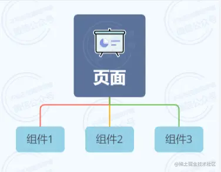
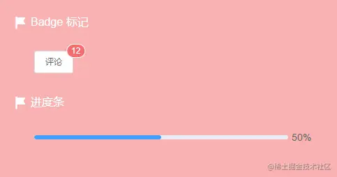
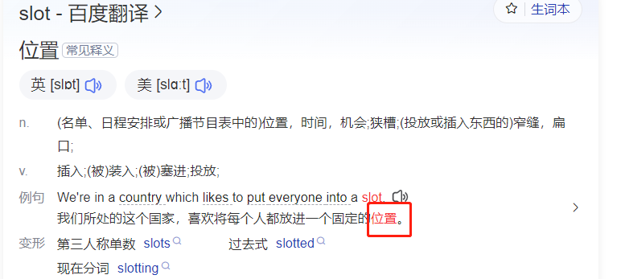
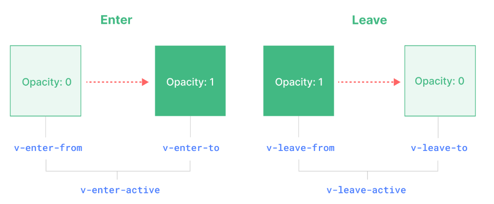
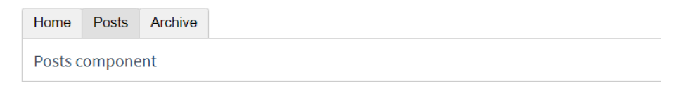
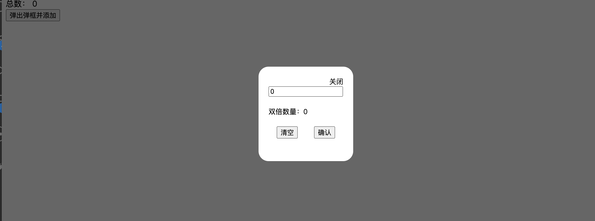

# 第十八节——插槽

## 概念 

   在日常的项目开发中，当我们在编写一个完整的组件时，不可避免的会引用一些`外部组件`或者`自定义组件`。



​    有了这种`引用关系`之后，我们就可以把它们称为`父组件`或者`子组件`，同时`父子组件`之间有很多的通信方式，比如可以通过`props`向`子组件`传递数据，或者通过`$emit`、`$parent`调用`父组件`中的方法。

​      下面就是一个非常简单的`父组件`引用`子组件`的例子。

```vue
<!-- 子组件: Mybutton.vue -->
<template>
  <div class="child">
    <!-- 标记 -->
    <div>
      <div class="content">
        <!-- 是Element UI库中的徽标组件，通常用来显示未读消息数量等提示信息。-->
        <el-badge :value="12" class="item">  
          <el-button size="small">评论</el-button>
        </el-badge>
      </div>
    </div>
   
    <!-- 进度条 -->
    <div>
      <div class="content">
        <el-progress :percentage="50"></el-progress>
      </div>
    </div>
  </div>
</template>

<!-- 省略其它代码 -->
```

​    接着我们在`App`组件中引用`Child`组件。

```html
<!-- 父组件: app.vue -->
<template>
    <Mybutton></Mybutton>  <!-- 使用子组件 -->
</template>

<script>
import Mybutton from './Mybutton.vue'  //引入子组件
export default {
  name: 'App',  //给父组件命名
  components: {
    Mybutton  //局部注册子组件
  }}
</script>
```

最后运行项目，`子组件`的内容成功被引用并展示在页面上。


   那假如我们现在有这样一个需求：在引用`Mybutton`组件的同时，希望在`Mybutton`组件的`指定位置`插入一段内容：`<h1> 你好，李骏 </h1>`。

   如果我们直接将内容写入`<child></child>`内部，是不会生效的。

```html
<!-- 父组件: App.vue -->
<template>
  <div id="app">
      <!-- 使用子组件 -->
      <Mybutton> 
        <h1>你好，李骏</h1> <!-- !!!不会生效 -->
       </Mybutton>   
  </div>
</template>

<script>
import Mybutton from './Mybutton.vue' //引入子组件
export default {
  name: 'App',  //给父组件命名
  components: {
    Mybutton  //局部注册
  }}
</script>
```

可以看到并未达到预期效果：



​		**有一种做法，是直接去修改child内部代码，但是这样不够灵活（并且如果child是别人封装好的第三方组件库，我们可能不能修改他的源代码），后期我们想要在那个位置插入一个p标签怎么办呢？**

​    那为了解决类似这样的问题，`Vue`就设计出来了`slot`这个东西。`slot`翻译过来叫做`插槽`，也可称其为`Vue`的内容分发机制，它的主要作用就是向`子组件`的`指定位置`插入一段内容，这个内容可以是`HTML`或者`其他的组件`。


​     在Vue中，插槽（Slots）是一种用于组件模板中的特殊语法，用于实现组件的内容分发和复用。

​    插槽允许父组件在子组件的模板中插入任意的内容，从而实现更灵活的组件组合和定制

```vue
<Mytext> 这里就是插槽 <Mytext> <!-- 插入文本 -->
    
<Mytext> <button>测试</button> <Mytext> <!-- 插入html标签 -->
<button>测试</button> <!-- 就是向MyTable插槽中插入的内容  -->
    
<Mytext> <MyButton><MyButton> <Mytext>  <!-- 插入组件 -->  
```



## 默认插槽slot 

​     默认插槽是最常用的插槽类型。

1. 用于在没有指定名称的情况下插入内容。

2. 适用于只有一个插槽的情况

   

**插槽的使用**

  ①.父组件中使用子组件 ，在子组件标签中插入标签或者组件

  ②.子组件中使用<slot></slot>,在哪使用哪里就会显示父组件插入的内容

### 1-父组件使用子组件时插入内容

​     父组件在使用子组件时，可以在子组件的标签内放置内容，这些内容将被插入到子组件模板中的默认插槽位置

**父组件**

```vue
<template>
        <Mybutton>   <!-- 使用子组件 -->
        <button>父组件按钮1</button>     <!-- 默认插槽 子组件中插入两个button按钮 -->
        <button>父组件按钮2</button>
        </Mybutton>
</template>

<script>
import Mybutton from './Mybutton.vue'  //引入子组件
export default {
    components: {
        Mybutton  //局部注册
    }}
</script>
```

###  2-在子组件的模板中，使用`<slot></slot>`标签定义默认插槽的位置。

​    一个萝卜一个坑，子组件有预留有位置，插入的内容才能在子组件中显示

​    子组件中使用`<slot></slot>`标签定义默认插入内容的位置

**子组件**

```vue
<template>
    <slot></slot>   <!-- 默认插槽的内容 就会被插入到<slot>标签的位置上 -->
</template>

<script>
export default {}
</script>
<style></style>
```


## 渲染作用域

  插槽内容可以访问到父组件的数据作用域，因为插槽内容本身是在父组件模板中定义的。举例来说：

```vue
<template>
    <Mybutton> 插字 {{ a1 }}</Mybutton> <!-- 使用子组件，插入内容 -->
</template>

<script>
import Mybutton from './Mybutton.vue'; //引入子组件
export default {
    components: {
        Mybutton //局部注册
    },
    data() {
        return {
            a1: '我是渲染作用域' //这个a1就是渲染作用域
        }},}
</script>
<style></style>
```

​    这里的a1提前在app的data中定义的。

​    这里的 `{{ a1 }}` 插值表达式渲染的内容都是一样的。

​    插槽内容**无法访问**子组件的数据。Vue 模板中的表达式只能访问其定义时所处的作用域，这和 JavaScript 的词法作用域规则是一致的。换言之：

> 父组件模板中的表达式只能访问父组件的作用域；子组件模板中的表达式只能访问子组件的作用域。


## 具名插槽<template #Name>

​    除了默认插槽，Vue还支持具名插槽。

​    1.**具名插槽**允许你在父组件中定义多个插槽，并且每个插槽都有一个特定的名字。

​    2.父组件可以根据插槽的名称来插入内容。使用 `<template #Name> 定义具名插槽`

​    3.子组件使用<slot name="Name"></slot>标签定义具名插槽的位置，并为每个插槽指定一个唯一的名称。


### 1.父组件使用 `<template #Name> 定义具名插槽`

```java
<template>
          <Mybutton> //使用子组件
              <template #lijun>  //具名插槽，名字叫lijun
                 <div>你好，我叫李骏</div> //插入内容
              </template>
    
   		      <template #btn>  //具名插槽，名字叫btn
               <button>我是具名插槽的按钮</button>  //插入内容
              </template>
          </Mybutton>
</template>
    
<script>
import Mybutton from './Mybutton.vue'; //引入子组件
export default {
    components: {
        Mybutton  //局部注册
    }
</script>
<style></style>
```

### 2.子组件使用`<slot name="Name"></slot>`标签定义具名插槽的位置

```vue
<template>
      <slot name="lijun"></slot> <!-- slot获取父组件传来名字是lijun的标签 -->
	  <slot name="btn"></slot> <!-- 获取父组件传来btn的按钮  -->
</template>

<script>
export default {}
</script>
<style></style>
```


## 作用域插槽（了解）

  `作用域插槽`Scoped Slots的相关概念，相对于前面两种类型的插槽来说，有些难以理解。

​    作用域插槽（Scoped Slots）是Vue.js中一种非常强大的功能，它允许子组件向父组件传递数据，以便父组件可以根据这些数据生成内容。作用域插槽增强了Vue中的插槽功能，使得父组件可以访问子组件的数据，并根据这些数据动态地生成内容。

  如果需要用一句话去总结`作用域插槽`，那就是`在父组件中访问子组件的数据`，或者从`数据流向`的角度来讲就是`将子组件的数据传递到父组件`。 

### 子组件

  核心 代码 `<slot name="btn" :n="num" :a="a1"></slot>`

  把当前组件，也就是子组件的数据 作为属性（这里使用n属性 :a,属性名自己定义），传递给 solt标签（插槽内容），因为插槽内容是在父组件中定义的 ，所以父组件的插入的内容 就可以使用到这里的属性

```vue
<template>
  <!-- <Mybutton.vue> 的模板 -->
    <!-- 把当前组件，也就是子组件的数据 作为属性（这里使用n属性:num），传递给 solt标签（插槽内容）,
      因为插槽内容是在父组件中定义的,所以父组件的插入的内容 就可以使用到这里的属性-->
    <slot name="btn" :n="num" :a="a1"></slot> 
	<!-- n,a名字可以随便取 num和a1是要传给父组件的值  -->
</template>

<script>
export default {
  data() {
        return {
            num: 100,
            a1: 55,
        }},};
</script>
<style></style>
```

### 父组件

  v-slot可以作用到组件上，可以作用到组件内部的template上，

`<template v-slot:btn="obj">{{ obj.n }}{{ obj.a }}</template>`

  obj变量可以自己起名，obj 是一个对象，{obj.n }，这个对象里面内容是子组件传递过来的，
         对象里面包含所有子组件中给slot传递的属性

```java
<template>
    <Mybutton>
      // v-slot可以作用到组件上，可以作用到组件内部的template上，
      //  obj是一个对象，{obj.n }，这个对象里面内容是子组件传递过来的，
      // 对象里面包含所子组件中给slot传递的属性 
         <template v-slot:btn="obj">
          // btn是子组件具名插槽的名称，他传过来的值
          // obj是对象，名字可以随便取，obj.n是子组件具名插槽传过来的值
            {{ obj.n }}
            {{ obj.a }}
          </template>
    </Mybutton>
</template>

<script>
import MyComponent from "./MyComponent.vue";
export default {
  components: { Mybutton } //局部注册
};
</script>
<style></style>

```

  这种用法,看起比较麻烦,不如直接插入一个返回按钮简单。如下可能会更简单

```vue
    <Mybutton>
      <template v-slot="btn">
        <button>返回</button>
      </template>
    </Mybutton>
```

但是，这样用有一个好处，Button的内容就是子组件自己控制，想要是什么都可以


# 第十九节——vue内置组件

Vue提供了一些内置的组件，这些组件可以在Vue应用中直接使用，无需额外安装或配置。以下是一些常见的Vue内置组件

##  一、过渡效果`<transition>` 和 `<transition-group>` 

### 1、概念 

Vue3过渡效果开发（内置组件 <Transition>、内置组件 <TransitionGroup>）

Vue 提供了两个内置组件，可以帮助你制作基于状态变化的过渡和动画：

- `<Transition>` 会在一个元素或组件进入和离开 DOM 时应用动画。。
- `<TransitionGroup>` 会在一个 `v-for` 列表中的元素或组件被插入，移动，或移除时应用动画。

###  `<Transition>` 组件

`<Transition>` 是一个内置组件，这意味着它在任意别的组件中都可以被使用，无需注册。它可以将进入和离开动画应用到通过默认插槽传递给它的元素或组件上。进入或离开可以由以下的条件之一触发：

- 由 `v-if` 所触发的切换
- 由 `v-show` 所触发的切换
- 由特殊元素 `<component>` 切换的动态组件

以下是最基本用法的示例：

#### 1-使用Transition组件

Transition 内部写想要发送动画的元素，按钮控制内容的显示和隐藏

```vue
<template>
  <button @click="a1 = !a1">点击显形</button>
  <Transition>
    <p v-if="a1 == true">{{ a2 }}</p>
  </Transition>
</template>

<script>
export default {
  data() {
    return {
      a1: false,
      a2: '李骏'
    }},}
</script>
<style></style>
```

​		**默认上面是没有过渡效果的，也不会添加类名！**

​		当一个 `<Transition>` 组件中的元素被插入或移除时，会发生下面这些事情：

​		Vue 会自动检测目标元素是否应用了 CSS 过渡或动画。如果是，则一些 CSS 过渡 class 会在适当的时机被添加和移除。

​	所以我们需要先定义样式--通过特定的类名，定义动画的起始状态和过渡效果

#### 2-定义添加（显示）动画的起始状态和过度效果

在p标签显示的时候，vue就会自动给p添加v-enter-active 和  v-enter-to 类名

**这些类需要我们提前定义好，里面有过度效果（类名才会自动添加和删除）！**

1. `v-enter-from`：进入动画的起始状态。在元素插入之前添加，在元素插入完成后的下一帧移除。

2. `v-enter-active`：进入动画的生效状态。应用于整个进入动画阶段。在元素被插入之前添加，在过渡或动画完成之后移除。这个 class 可以被用来定义进入动画的持续时间、延迟与速度曲线类型。

3. `v-enter-to`：进入动画的结束状态。在元素插入完成后的下一帧被添加 (也就是 `v-enter-from` 被移除的同时)，在过渡或动画完成之后移除。

   

进入动画的起始状态 我们将 元素的opacity设置为0

进入动画的过渡过程 我们将 元素 的  transition: opacity 3s ease;      给opacity过渡设置动画 3秒

进入动画的结束状态 我们将 元素的opacity设置为1

代码如下：可以点击切换按钮测试一下，观察进入过渡效果

```vue
<template>
  <button @click="a1 = !a1">点击显形</button>
  <Transition>
    <p v-if="a1 == true">{{ a2 }}</p>
  </Transition>
</template>

<script>
export default {
  data() {
    return {
      a1: true,
      a2: '李骏'
    }},}
</script>

<style>
/* 进入动画的起始状态 */
.v-enter-from {
  opacity: 0;
}
/* 进入的这个过程的过渡效果- 进入动画的生效状态*/
.v-enter-active {
  transition: opacity 3s ease;
}
/* 进入动画的结束状态*/
.v-enter-to {
  opacity: 1;
}

p {
  background-color: red;
}
</style>
```


#### 3-定义删除（隐藏）动画的起始状态和过度效果

1. `v-leave-from`：离开动画的起始状态。在离开过渡效果被触发时立即添加，在一帧后被移除。
2. `v-leave-active`：离开动画的生效状态。应用于整个离开动画阶段。在离开过渡效果被触发时立即添加，在过渡或动画完成之后移除。这个 class 可以被用来定义离开动画的持续时间、延迟与速度曲线类型。
3. `v-leave-to`：离开动画的结束状态。在一个离开动画被触发后的下一帧被添加 (也就是 `v-leave-from` 被移除的同时)，在过渡或动画完成之后移除。


离开动画的起始状态 我们将 元素的opacity设置为0

离开动画的过渡过程 我们将 元素 的  transition: opacity 0.5s ease;      给opacity过渡设置动画 0.5秒

离开动画的结束状态 我们将 元素的opacity设置为1

代码如下：可以点击切换按钮测试一下，观察进入过渡

```java
/* 离开动画的起始状态 */
.v-leave-from {
  opacity: 1;
}
/* 离开动画的生效状态--整个离开动画过渡阶段 */
.v-leave-active {
  transition: opacity 1.5s ease;
}
/* 离开动画的结束状态 */
.v-leave-to {
  opacity: 0;
}
```


一共有 6 个应用于进入与离开过渡效果的 CSS class。



`v-enter-active` 和 `v-leave-active` 给我们提供了为进入和离开动画指定不同速度曲线的能力，需要配合css过渡效果使用

### 为过渡效果命名

如果网页中有多个地方都需要加动画，用同一个类名，显然是不行的。

我们可以给 ``<Transition>`` 组件传一个 `name` prop 来声明一个过渡效果名：

template

```java
<template>
  <button @click="a1 = !a1">点击显形</button>
    
  <Transition name="lijun">
    <p v-if="a1 == true">{{ a2 }}</p>
  </Transition>
        
</template>
```

对于一个有名字的过渡效果，对它起作用的过渡 class 会以其名字而不是 `v` 作为前缀。比如，上方例子中被应用的 class 将会是 `lijun-enter-active` 而不是 `v-enter-active`。这个“fade”过渡的 class 应该是这样：

css

```java
.lijun-enter-active,
.lijun-leave-active {
  transition: opacity 0.5s ease;
}

.lijun-enter-from,
.lijun-leave-to {
  opacity: 0;
}
```

### CSS 的 animation帧动画

原生 CSS 动画和 CSS transition 的应用方式基本上是相同的

对于大多数的 CSS 动画，我们可以简单地在 `*-enter-active` 和 `*-leave-active` class 下声明它们。


下面是一个示例：

```java
<template>
  <button @click="lijun = !lijun">点击显示</button>
    
  <transition name="a1">
    <div class="a1" v-if="lijun"></div>
  </transition>
        
</template>
```

css样式里面 -只关注动画执行过程

在帧动画bounce-in中设置  ，三个关键帧，表示从隐藏到消失过程

0% --transform: scale(0)

50%--transform: scale(1.25);

100%--transform: scale(1);

```java
@keyframes a1-in {
  0% {
    transform: scale(0);
  }

  50% {
    transform: scale(1.25);
  }

  100% {
    transform: scale(1);
  }}
```

.a1-enter-active 进入动画的执行采用，这个关键帧a1-in动画  ：animation: a1-in 0.5s

.a1-leave-active 立刻动画的执行采用，这个关键帧a1-in动画的逆向过程：animation: a1-in 0.5s reverse

总体代码代码如下

```vue
<template>
  <button @click="lijun = !lijun">点击显示</button>
    
  <transition name="a1">
    <div class="a1" v-if="lijun"></div>
  </transition>
        
</template>

<script>
export default {
  data() {
    return {
      lijun: true
    }},}
</script>
    
<style>
.a1 {
  width: 100px;
  height: 100px;
  background-color: red;
}

/* 动画的持续时间和过渡函数 */
.a1-enter-active,
.a1-leave-active {
  transition: all 1s ease;
}

/* 进入动画的起始和结束状态 */
.a1-enter-from,
.a1-leave-to {
  transform: scale(0);
}

.a1-enter-to,
.a1-leave-from {
  transform: scale(1);
}

@keyframes a1-in {
  0% {
    transform: scale(0);
  }
    
  50% {
    transform: scale(1.25);
  }
    
  100% {
    transform: scale(1);
  }}
</style>
```


### 出现时过渡

如果你想在某个节点初次渲染时应用一个过渡效果，你可以添加 `appear` prop：

```java
<transition appear>
    <div class="a1" v-if="lijun"></div>
</transition>
```

###  

### transition-group组件

会在一个 `v-for` 列表中的元素或组件被插入，移动，或移除时应用动画。

`<transition-group name="a" tag="ul">`  

这里name的作用跟之前一样

tag的作用是transition-group 这个组件最终被渲染成一个ul标签


css样式如下,主要是过渡效果，和进入起始的状态，和离开后的状态（因为进入以后和离开以前 元素都是在页面中显示的opacity都是1，我们不用再去定义）

```vue
<style>
/* 
    激活时的过渡效果
    a 为 name定义的值
    -enter-active这部分写死
  
    过渡效果需要自己写
  */
.lijun-enter-active,
.lijun-leave-active {
  transition: all 0.5s ease;
}

.lijun-move {
  transition: transform 0.5s ease;
}

.lijun-enter-from,
.lijun-leave-to {
  opacity: 0;
  transform: translateX(20px);
}
</style>
```

完整代码如下 ，js逻辑，是实现了一个，简单的列表的添加和删除

```vue
<template>
  <button @click="add">点击添加</button>
  <button @click="remove">点击移除</button>

  <!-- 指定了一个名字叫lijun，transition-group初次渲染为span标签，这里用tag指定他渲染的标签是ul -->
  <transition-group name="lijun" tag="ul"> 
      <!-- 渲染列表，transition-group会 会跟踪每个列表项的位置变化。 -->
    <li v-for="item in arry" :key="item.id" @click="remove(item)"> 
      {{ item.text }} {{ item.id }}
    </li>
  </transition-group>

</template>

<script>
export default {
  data() {
    return {
      arry: [
        { id: 1, text: '列表' },
        { id: 2, text: '列表' },
        { id: 3, text: '列表' }
      ]
    }; },
    
  methods: {
    add() {
      this.arry.push({ id: Date.now(), text: '列表' }); 
     //每次添加触发这个方法，文本是新的数据，并且每次触发时候的id是跟当前的时间戳有关，这样id就不会相同
    },
    remove(item) {
      this.arry.splice(this.arry.indexOf(item), 1);  
        //找到item在数组中的位置，然后移除他
    }}};
</script>

<style>
/* 
    激活时的过渡效果
    a 为 name定义的值
    -enter-active这部分写死
  
    过渡效果需要自己写
  */
.lijun-enter-active,
.lijun-leave-active {
  transition: all 0.5s ease;
}

.lijun-move {
  transition: transform 0.5s ease;
}

.lijun-enter-from,
.lijun-leave-to {
  opacity: 0;
  transform: translateX(20px);
}
</style>
```

### **2、transition-group 和transition区别**

​    在 Vue.js 中，`<transition>` 和 `<transition-group>` 都是用来处理元素和组件在渲染过程中的过渡效果，但它们之间有一些关键的区别：

1.   `<transition>` 组件用于单个元素或组件的过渡效果。它可以为元素的插入、更新和移除添加过渡效果。当你需要为一个特定的元素添加过渡效果时，通常会使用 `<transition>`。
2.   `<transition-group>` 组件则用于一组元素的过渡效果，它可以为列表中元素的添加、更新和移除提供更加复杂的过渡效果。它与 `<transition>` 的主要区别在于它能够管理一个元素集合，例如列表中的多个项目。

​    总结来说，如果你需要为一个单独的元素添加过渡效果，那么 `<transition>` 就足够了；如果你需要处理一组元素的过渡效果，并且可能涉及到元素的添加、删除和位置变化，那么 `<transition-group>` 是更好的选择。


## 二、`<component>`动态组件

### 1、概念

​    **component 是动态组件，底层是vi-if的原理，不用的组件会被销毁，可以跟kepp-alive搭配使用，让不用的组件进入缓存。**

​    有的时候，在不同组件之间进行动态切换是非常有用的，比如在一个多标签的界面里，像是选项卡一样，学习这个以后，我们可以用动态组件实现一个类似选项卡的效果。

#### is切换component占位

在实例、组件的模板中的某一个标签上，可以通过is属性来指定为另一个目标的组件，这个时候我们一般会使用component标签来占位、设置is属性来指定目标组件

```java
<template>
    <btn></btn> //使用子组件
    <component is="btn"></component> //is等于谁，最终就会被渲染为谁(子组件btn)
</template>
    
<script>
import btn from './Mybutton.vue' //引入子组件
export default {
    components: {
        btn //局部注册
    }}
</script>
<style></style> 
```

### 3、例子

​    根据选择动态渲染对应的组件，

​    子组件Mybutton.vue和子组件MyLijun.vue 随便创建就行，在父组件app.vue里面使用

  **父组件app.vue**

```vue
<template>
  <btn></btn>  <!-- 使用子组件btn -->
  <lijun></lijun>  <!-- 使用子组件lijun -->

  <component is="lijun"></component> <!-- is等于谁，等于的组件就是谁 -->
  <component :is="a1"></component> <!-- 想使用a1指向的组件，就必须要动态使用 -->
</template>

<script>
import btn from './Mybutton.vue'   //引入子组件
import lijun from './MyLijun.vue'  //引入子组件
export default {
    components: {
        btn, lijun  //局部注册
    },
    data() {
        return {
            a1: 'btn' //定义一个变量指向子组件btn
        }},}
</script>
<style></style>
```

  **子组件Mybutton.vue**

```vue
<template>
    <button>我是按钮</button>
</template>

<script>
export default {
    name: 'btn',//给组件起名 这样子可以在父组件里被include包含
    created() {
        console.log('创建成功'); //生命周期——创建后
    },
    unmounted() {
        console.log('销毁完毕'); //生命周期——卸载后
    }}
</script>
<style></style>
```

  **子组件MyLijun.vue**

```vue
<template>
    <div>我是李骏组件</div>
</template>

<script>
export default {
  name: 'lijun', //给组件起名 这样子可以在父组件里被include包含
  created() {
      console.log('创建成功'); //生命周期——创建后
    },
    unmounted() {
      console.log('销毁完毕'); //生命周期——卸载后
    }};
</script>
<style></style>
```


## 三、`<keep-alive>`

### 1、概念

  **`<KeepAlive>` 是一个内置组件, 组件用于缓存动态组件component**，它的功能是在多个组件间动态切换时缓存被移除的组件实例。以便在组件切换时保留其状态或避免重新渲染。它会缓存被包裹的组件的实例，并在组件切换时保持实例的状态，以提高应用的性能和响应性

​		之前学习的**component动态组件**的切换，默认情况下，一个组件实例在被替换掉后会被销毁。这会导致它丢失其中所有已变化的状态 —— 当这个组件再一次被显示时，会创建一个只带有初始状态的新实例。

​		如果此时给每个组件加入一个输入框，输入内容切换组件查看效果，发现切换回来数据不在。

我们可以给每个组件都加上生命周期，来看一下

​     **子组件Mybutton.vue**

```vue
<template>
    <button>我是按钮</button>
</template>

<script>
export default {
    name: 'btn',//起名
    created() {
        console.log('btn创建成功');  //生命周期——创建后
    },
    mounted() {
        console.log('btn页面组件被挂载');  //生命周期——挂载后
    },
    unmounted() {
        console.log('btn销毁完毕');  //生命周期——卸载后
    },
    activated() { //这个是KeepAlive的内置
        console.log('每次从缓存中被插入的时候就会调用');
    },
    deactivated() { //这个是KeepAlive的内置
        console.log('从dom移除，进入缓存的时候触发');
}}
</script>
<style></style>
```

​    **子组件MyLijun.vue**

```vue
<template>
    <div>我是李骏组件</div>
</template>

<script>
export default {
    name: 'lijun', //给组件起名
    created() {
        console.log('lijun创建成功');  //生命周期——创建后
    },
    mounted() {
        console.log('lijun页面组件被挂载');  //生命周期——挂载后
    },
    unmounted() {
        console.log('lijun销毁完毕');  //生命周期——卸载后
    }}
</script>
<style></style>
```

​    **父组件app.vue**  **(在下面这个代码里，父组件已经有缓存了)。**

```vue
<template>
    <KeepAlive include="btn,lijun"> <!-- include可以选择想要缓存的子组件 -->
        <component :is='a1' @click="dian"></component>
        <!-- 动态组件使用:is，现在等于子组件btn被缓存 -->
    </KeepAlive>
</template>

<script>
import btn from './Mybutton.vue'  //引入子组件btn
import lijun from './MyLijun.vue'  //引入子组件lijun
export default {
    components: {
        btn, lijun  //局部注册
    },
    data() {
        return {
            a1: 'btn',
            a2: 'lijun'
        }},
    methods: {
        dian() {
          //点击以后触发方法，如果是子组件btn就变成子组件lijun
            if (this.a1 == 'btn') {
                this.a1 = 'lijun';
            } else if (this.a1 == 'lijun') {
                this.a1 = 'btn';
            }}}}
</script>
<style></style>
```

  我们会发现一个组件被销毁了，另一个组件被创建了

  切回来之后，之前已更改的状态都被重置了。

### 2、使用

​    我们想要组件能在被“切走”的时候保留它们的状态。要解决这个问题，我们可以用 `<KeepAlive>` 内置组件将这些动态组件包装起来：

```java
<KeepAlive>
        <component :is='a1' @click="dian"></component>
</KeepAlive>
```

   现在再来切换试试：在组件切换时状态也能被保留了！

### 3、包含(include)/排除(exclude)

  `` 默认会缓存内部的所有组件实例，但我们可以通过 `include` 和 `exclude` prop 来定制该行为。这两个 prop 的值都可以是一个以英文逗号分隔的字符串、一个正则表达式，或是包含这两种类型的一个数组。

   **include 用来设置是被缓存的组件** 

   **exclude用来设置是不想被缓存的组件** 

```java
//以英文逗号分隔的字符串,想要缓存btn和lijun组件
<KeepAlive include="btn,lijun">
  <component :is='a1' @click="dian"></component>
</KeepAlive>

//正则表达式(需使用`v-bind`)想要缓存btn和lijun组件
<KeepAlive :include="/btn|lijun/">
  <component :is='a1' @click="dian"></component>
</KeepAlive>

//数组(需使用`v-bind`)想要缓存btn和lijun组件，其他都不缓存
<KeepAlive :include="['btn', 'lijun']">
  <component :is='a1' @click="dian"></component>
</KeepAlive>

//数组(需使用`v-bind`)不想要缓存btn和lijun组件，其他都缓存
<KeepAlive :exclude="['btn', 'lijun']">
  <component :is='a1' @click="dian"></component>
</KeepAlive>
```

  它会根据组件的 `name` 选项进行匹配，所以组件如果想要条件性地被 `KeepAlive` 缓存，就必须显式声明一个 `name` 选项。

```java
   var ComponentA = {
       name: 'btn',//起名
   	...
      };
      
   var ComponentB = {
        name: 'lijun', //给组件起名
     ...
      };
      
    <keep-alive include="lijun">
       <component :is='a1' @click="dian"></component>
    </keep-alive>
```

   这样只有a组件被缓存了

### 4-缓存组件的生命周期`activated` 和 `deactivated`

​    当一个组件实例从 DOM 上移除但因为被 `<KeepAlive>` 缓存而仍作为组件树的一部分时，它将变为**不活跃**状态而不是被卸载。当一个组件实例作为缓存树的一部分插入到 DOM 中时，它将重新**被激活**。

​    一个持续存在的组件可以通过 `activated` 和 `deactivated` 选项来注册相应的两个状态的生命周期钩子：

```vue
<template>
    <div>我是李骏组件</div>
</template>

<script>
export default {
  name: 'lijun', //给组件起名
  created() {
    console.log('lijun创建成功');
  },
  unmounted() {
    console.log('lijun销毁完毕');
  },
  activated() {
    // 在首次挂载、
    // 以及每次从缓存中被重新插入的时候调用
    console.log("以及每次从缓存中被重新插入的时候触发");
  },
  deactivated() {
    // 在从 DOM 上移除、进入缓存
    // 以及组件卸载时调用
    console.log('从dom移除，进入缓存的时候触发');
  },
};
</script>
<style></style>
```

请注意：

- `activated` 在组件挂载时也会调用，并且 `deactivated` 在组件卸载时也会调用。
- 这两个钩子不仅适用于 `<KeepAlive>` 缓存的根组件，也适用于缓存树中的后代组件。


## 四、`<Teleport>` tp组件

### 1、概念

​    它可以将一个组件内部的一部分模板“传送”到该组件的 DOM 结构外层的位置去。这类场景最常见的例子就是全屏的模态框。

​    在Vue.js中，`Teleport` 是Vue 3引入的一个新特性，它允许你将一部分DOM节点“传送到”文档中的其他位置，而不是默认的父节点。这可以用于实现模态框、弹出菜单、固定定位元素等功能，而不必使用复杂的JavaScript代码来移动DOM。

### 2、参数to

​    指定传送的目标。to 的值可以是一个 CSS 选择器字符串，也可以是一个 DOM 元素对象。`<Teleport to="selector">...</Teleport>` 用于指定要传送的目标位置。

### 3、例子

点击按钮的时候，把Teleport组件内部的代码，会被传送到body标签中

```java
<button @click="open = true">点击显示</button>  //当点击时，会将open数据属性设置为true。
    
<Teleport to="body">  //是Vue3中的内置组件，用于将模态框的内容传送到页面的body元素中。
  <div v-if="open" class="modal"> //只有当open的值为true时才会显示。
    <p>Hello World!</p>
    <button @click="open = false">点击隐藏</button>
  </div>
</Teleport>
```


## 五、`<slot>`插槽

   插槽配套的组件，上面说过了。有三种插槽，匿名插槽，具名插槽，作用域插槽。

1. 匿名插槽是最简单的一种插槽类型，它没有名称，通常用于在组件内部放置默认的内容。当一个组件没有使用 `slot` 属性时，所有的内容都被视为匿名插槽的内容。
2. 具名插槽允许我们在组件模板中定义多个插槽，并为每个插槽分配一个名称。这使得我们可以更灵活地组织和重用组件内的布局。
3. 作用域插槽允许父组件访问子组件的数据。这种插槽通常用于传递数据给插槽中的内容，使得父组件可以根据子组件提供的数据动态地渲染内容。


## 六、`<router-view>` 和 `<router-link>`路由

  <router-view> 组件用于在Vue路由中渲染匹配到的组件，根据当前的路由状态动态地渲染对应的组件内容。<router-link> 组件用于生成路由链接，提供了一种声明式的方式来导航到不同的路由。详细的内容下节课学习。


# vue调试工具安装和使用

[  点击谷歌插件商店](https://chrome.google.com/webstore/detail/vuejs-devtools/)安装

  或者使用离线安装包安装

  点击chrom浏览器右上角三个点，更多工具-扩展程序

  打开右上角的开发模式

  然后把课件里面的Vue.js devtools.crx 文件拖到刚刚的页面，点击添加即可。

  然后需要设置

  然后重启浏览器，打开控制台，找到vue，点击就可以看到整个网站的结果和数据


   Vue 的浏览器开发者插件使我们可以浏览一个 Vue 应用的组件树，查看各个组件的状态，追踪状态管理的事件，还可以进行组件性能分析。


# 练习—面试真题实战-封装弹窗组件

要求封装一个标准的弹框组件，并实现以下功能



如下使用这个组件

```
  <div class="box">
    <button @click="show = true">按钮</button>
    <qfModal v-if="show" @cancel="show = false" title="hello">
      测试你好
    </qfModal>
  </div>
```

参考代码

```vue
<template>
  <Teleport to="body">
    <div class="moda-box">
      <div class="moda-content">
        <h2>{{ title }}</h2>
        <div>
          <slot></slot>
        </div>
        <div class="btn-box">
          <button @click="$emit('cancel')">
            {{ cancelButtonName || "取消" }}
          </button>
          <button @click="$emit('ok')">{{ okButtonName || "确定" }}</button>
        </div>
      </div>
    </div>
  </Teleport>
</template>

<script>
/**
 * 组件
 * title 标题
 * okButtonName 确定按钮的名字
 * cancelButtonName 取消按钮的名字
 *
 * 暴露出两个事件
 * ok 确定按钮的事件
 * cancel  取消按钮的事件
 */
export default {
  props: ["title", "okButtonName", "cancelButtonName"],
  emits: ["cancel", "ok"],
};
</script>

<style scoped>
.moda-box {
  position: fixed;
  left: 0;
  top: 0;
  background: rgba(0, 0, 0, 0.3);
  display: flex;
  justify-content: center;
  align-items: center;

  width: 100%;
  height: 100%;
}

.moda-content {
  width: 500px;
  background: white;
  border-radius: 10px;
  padding: 20px;

  display: flex;
  flex-direction: column;
  align-items: center;
}

.btn-box {
  display: flex;
  align-items: center;
  justify-content: space-between;
  width: 100%;
}

.btn-box button {
  width: 150px;
}
</style>
```

