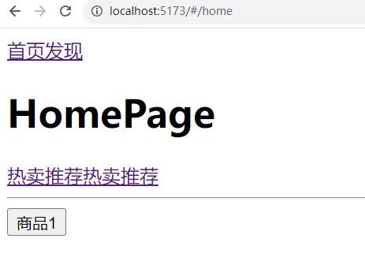

# 第二十一节——路由初识

文档地址 https://router.vuejs.org/zh/
version版本   V4.x

## 一、什么是路由

路由的核心就是 用户访问不同的地址，页面展示不同的组件（一个组件可以写一个页面的内容）

前端路由指的是一种将浏览器URL与特定页面或视图关联起来的技术。在传统的Web开发中，当用户点击链接或者输入URL时，服务器会接收到请求并返回相应的HTML页面。而在前端路由中，当用户点击链接或者输入URL时，浏览器会根据路由规则对URL进行解析，并使用JavaScript控制页面的展示。

前端路由通常使用JavaScript库来实现，比如React Router、Vue Router等。它们允许开发者定义路由规则，并根据这些规则来显示不同的组件或页面。例如，当用户点击一个链接时，前端路由会将URL解析为一个路由路径，然后根据路径匹配相应的组件或页面并显示在页面上，而不需要向服务器发起请求。

前端路由可以提高Web应用的性能和用户体验，因为它允许应用实现快速的页面切换和动态的内容加载，同时减少了服务器的负载。

### 为什么要用路由

目前前端中比较流行的是做单页应用（spa）开发，整个网站（系统）只有一个页面，我们看起来的页面切换，实际是不同页面组件的切换，可以模拟 安卓和iosapp的效果切换起来非常流畅，用户体验比较好。

因为做的是单页应用，组件页面的之间的切换比较多，所有就用单独的路由功能来控制切面的页面。

所谓的路由路由起始就是，一个路径对应一个页面组件，浏览器地址栏地址不一样，就显示不同的页面组件。

注意：一个页面可以是一个组件，一个按钮也可以是一个组件

### spa（单页应用）

​		我们使用vue开的的整个网站是一个页面-我们点击不同的按钮会显示不同页面-一个页面对应一个组件。

​		单页应用的

#### 		好处：

​				可以模拟 安卓和iosapp的效果切换起来非常流畅。

#### 		弊端：

​			对seo不友好，首屏加载速度比较慢，单页应用往往把整个网站的所有内容同一个打包引入到首页中。导致首页内容比较多，加载速度慢，首页容易白屏。


类似 https://m.weibo.cn/  的移动端就是这样


## 二、vue-router介绍

Vue Router 是 [Vue.js](https://vuejs.org/) 的官方路由。它与 Vue.js 核心深度集成，让用 Vue.js 构建单页应用变得轻而易举。功能包括：

- 嵌套路由映射
- 动态路由选择
- 模块化、基于组件的路由配置
- 路由参数、查询、通配符
- 展示由 Vue.js 的过渡系统提供的过渡效果
- 细致的导航控制
- 自动激活 CSS 类的链接
- HTML5 history 模式或 hash 模式
- 可定制的滚动行为
- URL 的正确编码


## 三、安装

​      1.创建一个新的项目

```js
pnpm create vite my-vue-router --template vue
npm create vite@latest my-vue-app -- --template vue

//或者创建vue脚手架的时候选择 是否引入 Vue Router 进行单页面应用开发？选择是
pnpm create vue
```

  安装依赖，然后安装vue-router，然后启动项目

```js
pnpm install vue-router
```

​    2.或者创建vue脚手架的时候选择 是否引入 Vue Router 进行单页面应用开发？选择是。这样子就可以省掉后面的几步


## 四、定义路由表-挂载路由

### 1-创建router对象

在src下创建router目录，并在目录里创建index.js文件，

引入'vue-router' 里面的createRouter 函数，使用这个函数创建路由router（路由插件）

```javascript
import { createRouter, createWebHashHistory } from 'vue-router' //这里选择的是Hash模式
const router =  createRouter({})
```

### 2-配置路由表routes

​    createRouter函数的参数一个对象，在对象里面配置routes 属性，属性值是一个数组（路由表），数组中存放路由对象（route）

​    每一条route对象都有两个属性，path和component

   path对应这条路由信息的地址

   component对应这个路由要显示的组件

```javascript
import { createRouter, createWebHistory } from 'vue-router' // 路由模式:history模式
// 一般在views文件夹下创建路由组件，然后引入进来
import HomeView from '../views/HomeView.vue' //引入HomeView组件
import lijun from '@/views/lijun.vue' //引入lijun组件

// @默认情况下，@符号被配置为指向项目中的src目录。
import AboutView from '@/views/AboutView.vue' //引入AboutView组件

// 创建了vue router实例
const router = createRouter({
  
  history: createWebHistory(import.meta.env.BASE_URL),  //创建路由history模式实例 
  // 路由表---所有的页面跳转规则都在这定义
  // 数组-》一个一个的route对象，一个route对象就是一条路由规则
  routes: [
    {
      path: '/', //根路径，一般指向的是一个主组件
      component: HomeView //组件
    },
    {
      path: '/about', //路径
      component: AboutView //组件
    },
    {
      path:'/lijun', //路径
      component:lijun //组件
    }
  ]})
export default router
```

​    routes配置项中可以配置很多条路由route

​    **我们提前创建一个页面组件 src/views/lijun.vue,然后在index.js中引入即可**

```vue
<template>
    <h1>李骏的页面</h1>
</template>

<script>
export default {}
</script>
<style>
h1 {
    color: aquamarine;
}
</style>
```

​     **完整代码如下**

```javascript
import { createRouter,createWebHashHistory} from "vue-router";  //引入路由组件

import lijun from '@/views/lijun.vue' //引入lijun组件

// 使用 createRouter 创建路由实例 
const router = createRouter({
    
  // 确定路由模式,当前使用的是Hash模式
  history: createWebHashHistory(),
  
  // 定义路由表
  routes: [
    {
      // 路由地址
      path: "/lijun", //路径
      // 对应路由显示组件
      component: lijun, //组件
    },],});

export default router; //导出router对象
```

  注意：这里最后导出了router对象，router对象其实是一个vue插件，我们想要在vue中使用这个路由插件，需要在我们项目的入口文件，main.js 中挂载这个router插件，才能在我们的vue项目中使用路由功能


### 3、在入口文件引入，并挂载

  `app.use(router)`也叫挂载路由，这表示在vue实例中，我们的路由规则就生效了。

  **不过如果使用vue脚手架创建的话，会自动帮我们挂载。**

  **注意：挂载路由插件，要在app.mount之前**

```js
import { createApp } from 'vue'
import App from './App.vue'
import router from './router'  //引入router对象

const app = createApp(App)

app.use(router)  // 使用use方法挂载到vue上

app.mount('#app')
```


### 4、在根组件（App.vue）上使用router-view展示路由

  router-view 是一个内置组件也叫路由视图组件

`router-view`  里面会显示和url对应的组件。一般我们把他写到项目的根组件（app.vue）中

  我们的地址栏的地址改变以后，  路由会将匹配到的组件将渲染在router-view里

  我们的例子中，如果我们访问/lijun 这个路由，对应的组件会显示到router-view内容。

/lijun 这个路由对应的组件是lijun.vue

```vue
<template>
<button @click="$router.push('/lijun')">李骏页面</button>
 <router-view></router-view>
</template>
```


### 5、访问地址查看页面

  http://localhost:5173/#/lijun 结果出现了lijun.vue组件的内容

​    如果是history: createWebHashHistory()，我们会发现，这个地址里面 路由多了一个#，这个是路由模式里面的hash路由（哈希路由）


### 6、示例代码如下

**index.js**

```js
import { createRouter, createWebHistory } from 'vue-router'  //引入路由组件
import HomeView from '../views/HomeView.vue' //引入HomeView
import lijun from '@/views/lijun.vue'  //引入lijun

// @路径别名 -指的是src文件夹
import AboutView from '@/views/AboutView.vue'  //引入AboutView

// 创建了vue router实例
const router = createRouter({
  // 路由模式
  history: createWebHistory(import.meta.env.BASE_URL), //历史模式
  // 路由表---所有的页面跳转规则都在这定义
  //数组--一个一个的route对象，一个route对象就是一条路由规则
  routes: [
    {
      path: '/', //主路径
      component: HomeView //主组件
    },
    {
      path: '/about', //路径
      component: AboutView //组件
    },
    {
      path:'/lijun', //路径
      component:lijun //组件
    }]})

export default router  //导出
```

**App.vue**

```vue
<template>
  <!-- 路由跳转 -->
  <button @click="$router.push('/')">首页</button> <!-- 第一种跳转 -->
  <button @click="$router.push('/lijun')">李骏页面</button>

  <button @click="goMe">关于我</button> <!-- 第二种跳转 -->

  <!-- router-link组件 的to属性也可以实现跳转 -->
  <!-- router-link最终被渲染成a标签 -->
  <router-link to="/about">关于我</router-link> <!-- 第三种跳转 -->

  <!-- vue-router内置的组件 --路由视图--根据不同url路径切换不同组件-->
  <router-view></router-view> <!-- 必须的内置组件 -->
</template>

<script>
// 默认访问的根组件
// 根组件中能根据不同的路径切换不同的组件
export default {
  methods: {
    goMe() {
      this.$router.push('about');  //第二种跳转，调用函数跳转
    }},}
</script>
<style></style>
```

**HomeView.vue**

```vue
<script setup>
</script>

<template>
  <p>首页</p>
</template>
<style scoped>
p {
  color: red;
}
</style>
```

**AboutView.vue**

```vue
<template>
  <p>关于我</p>
</template>

<script>
export default {}
</script>
<style scoped>
p {
  color: peru;
}
</style>
```

**lijun.vue**

```vue
<template>
    <h1>李骏的页面</h1>
</template>

<script>
export default {}
</script>
<style>
h1 {
    color: aquamarine;}
</style>
```

**main.js**

```js
import { createApp } from 'vue'
import App from './App.vue'
import router from './router' //引入

const app = createApp(App)
app.use(router)  //使用use方法挂载到vue上
app.mount('#app')
```


## 三、路由模式

### 1、hash模式

  使用 URL 的 hash 来模拟一个完整的 URL，于是当 URL 改变时，页面不会重新加载，其显示的网路路径中会有 “#” 号，有一点点丑。比如http://example.com/#/about。这是最安全的模式，因为他兼容所有的浏览器和服务器。

底层原理--主要通过window.onhashchange监听hash值变化--  改变页面组件

使用方法如下

```js
import { createRouter, createWebHashHistory } from "vue-router";  //引入路由组件
import HomeView from '../views/HomeView.vue'  //引入HomeView组件

  //创建router实例
const router = createRouter({
  history: createWebHashHistory(),  //确定路由模式是Hash模式
  // 路由表---所有的页面跳转规则都在这定义
  // 数组--一个一个的route对象，一个route对象就是一条路由规则
  routes: [
    {
      path: '/', //主路径
      component: HomeView //主组件
    },})
```

### 2、history模式

底层原理 --依赖于Html5 的history，pushState（‘/’） API（改变地址栏的地址，但是不刷新页面）

使用方法如下

```js
import { createRouter, createWebHistory } from "vue-router"; //引入路由组件

import HomeView from '../views/HomeView.vue' //引入HomeView组件

  //创建router实例
const router = createRouter({
  history: createWebHistory(),  //确定路由模式是history模式
  // 路由表---所有的页面跳转规则都在这定义
  // 数组--一个一个的route对象，一个route对象就是一条路由规则
  routes: [
    {
      path: '/', //主路径
      component: HomeView //主组件
    },})
```

​    当你使用 history 模式时，URL 就像正常的 url，例如 `http://yoursite.com/user/id`，也好看！

​    不过这种模式要玩好，还需要后台配置支持。因为我们的应用是个单页客户端应用，如果后台没有正确的配置，当用户在浏览器直接访问 `http://oursite.com/user/id` 就会返回 404，这就不好看了。

​    所以呢，你要在服务端增加一个覆盖所有情况的候选资源：如果 URL 匹配不到任何静态资源，则应该返回同一个 `index.html` 页面，这个页面就是你 app 依赖的页面。


### 3.哈希模式和历史模式区别

1. -- 历史模式 --路径中没有#号

​      --哈希模式 --路径中#号  location.hash  url后面的#部分 锚点

2. --底层实现原理不同

​      哈希模式-主要通过window.onhashchange监听hash值变化

​	  历史模式=底层原理 --依赖于Html5 的history.pushState（‘/’） API（改变地址栏的地址，但是不刷新页面）

3.  --历史模式 需要服务器配置--访问页面路径--永远返回首页


### 后端配置例子（知道即可）

#### Apache

```java
<IfModule mod_negotiation.c>
  Options -MultiViews
</IfModule>
<IfModule mod_rewrite.c>
  RewriteEngine On
  RewriteBase /
  RewriteRule ^index\.html$ - [L]
  RewriteCond %{REQUEST_FILENAME} !-f
  RewriteCond %{REQUEST_FILENAME} !-d
  RewriteRule . /index.html [L]
</IfModule>
```

除了 `mod_rewrite`，你也可以使用 [`FallbackResource` (opens new window)](https://httpd.apache.org/docs/2.2/mod/mod_dir.html#fallbackresource)。

#### [#](https://v3.router.vuejs.org/zh/guide/essentials/history-mode.html#nginx)nginx

```java
location / {
  try_files $uri $uri/ /index.html;
}
```

### 3、abstract 模式（了解）

abstract 是vue路由中的第三种模式，本身是用来在不支持浏览器API的环境中，充当fallback，而不论是hash还是history模式都会对浏览器上的url产生作用


# 第二十二节——页面中使用路由

​    

## 一、页面中进行路由跳转

​		在页面中进行页面跳转的方法有两种

​		一种叫做声明式路由，在模板中使用`<router-link to="">`组件

​		一种叫做编程式路由，在js代码，使用this.$router.push("")

| 声明式                    | 编程式              |
| :------------------------ | :------------------ |
| `<router-link :to="...">` | `$router.push(...)` |


### 1、声明式路由导航`router-link`

​    请注意，我们没有使用常规的 `a` 标签，而是使用一个自定义组件 `router-link` 来创建链接。这使得 Vue Router 可以在不重新加载页面的情况下更改 URL，处理 URL 的生成以及编码

​    在模板中使用`<router-link to="url">`组件,通过传递 `to` 来跳转到指定的链接，会产生历史记录。

`<router-link>` 将呈现一个带有正确 `href` 属性的 `<a>` 标签

app.vue

```vue
	<!--使用 router-link 组件进行导航 -->
    <!--通过传递 `to` 来指定链接 -->
    <!--`<router-link>` 将呈现一个带有正确 `href` 属性的 `<a>` 标签-->
   <router-link to="/My">关于我</router-link>
   <router-link to="/lijun">李骏的页面</router-link>
  <!-- 路由出口 -->
  <!-- 路由匹配到的组件将渲染在这里 -->
  <router-view></router-view>
```


### 2、编程式路由导航`$router.push()`

​    除了使用 `<router-link>` 创建 a 标签来定义导航链接，我们还可以借助 router 的实例方法，通过编写代码来实现页面跳转

注意： 在app中挂载路由以后，可以任意组件中通过this.$router 获取路由实例对象

​			这里只用push方法跳转到对应的地址，参数为url地址， this.$router.push(地址)，会产生历史记录

```vue
<template>
    <button @click="goMe">李骏的页面</button>
    <button @click="$router.push('/lijun')">李骏页面</button> <!-- 上下效果一致 -->
   
</template>
<script>
  export default {
    methods: {
      goMe() {
        /**
       * 使用 this.$router对象里的push方法
       * 接收一个路由地址作为参数
       * 跳转到lijun页面
       */
       this.$router.push('/lijun'); //跳转到lijun组件
      } }}
</script>
```

​    push的参数也可以是一个对象

```js
// 字符串路径
router.push('/lijun')

// 带有路径的对象
router.push({ path: '/lijun' })

// 命名的路由 -命名路由，需要在路由router里面配置路由的表的时候，增加一个name属性
router.push({ name: 'lijun' })
```

​    命名路由，需要在路由router里面配置路由的表的时候，增加一个name属性

​    router/index.js

```js
routes: [
    {
      path:'/lijun', // 路由地址
      component: lijun,// 对应路由显示组件
      name: "lijun",  // 为路由规则定义名字
    }, 
```


### 3、编程式路由，替换当前页面replace.replace( )

使用 this.$router对象里的replace方法，替换以后，不能返回之前的页面

```vue
<template>
    <button @click="goMe">跳转到李骏页面</button>
</template>

<script>
  export default {
    methods: {
      goMe() {
        /**
       * 使用 this.$router对象里的replace方法
       * 接收一个路由地址作为参数
       * 从首页替换到lijun页面
       * 不会再历史记录中新增数据
       */
        this.$router.replace('/lijun')
      } } }
</script>
```

​    也可以直接在传递给 `router.push` 的 `对象参数` 中增加一个属性 `replace: true` ：


  ```js
router.push({ path: '/lijun', replace: true })
// 相当于
router.replace({ path: '/lijun' })
  ```


### 4、前进或后退到浏览器历史记录中的特定页面

该方法采用一个整数作为参数，表示在历史堆栈中前进或后退多少步，类似于 `window.history.go(n)`

```js
// 向前移动一条记录，与 router.forward() 相同
router.go(1)

// 返回一条记录，与 router.back() 相同
router.go(-1)

// 前进 3 条记录
router.go(3)

// 如果没有那么多记录，静默失败
router.go(-100)
router.go(100)
```

​    **一个例子**

```vue
<template>
    <button @click="goMe">点击后退一页</button>
</template>

<script>
  export default {
    methods: {
      goMe() {
        this.$router.go(-1)  //后退一页
      }}}
</script>
```


## 二、路由传参

###    1、搜索传参

​     搜索传参（也称为查询参数或查询字符串）是指在 URL 地址中通过查询字符串形式传递参数的一种方法。查询字符串通常出现在 URL 中的问号 (`?`) 之后，用于传递额外的信息给服务器或客户端。在 Vue Router 中，查询参数是一种常见的路由传参方式。

#### 父组件通过在后面拼接`?id=`来进行传参

有三种格式: 

1. ` <router-link:to="'/a2?id='+id"> `
2. `@click="$router.push('/a1?id='+id)"`
3. `@click="$router.push({ path: '/a1', query: { id: id } })"`

   **app.vue**

```vue
<template>

  <router-link :to="'/a1?id=' + arr[0].id">
      <p>{{ arr[0].name }}</p>   <!-- 第一种.router-link拼接字符串传参 -->
  </router-link>

<p @click="$router.push('/a1?id=' + arr[2].id)"> 
    {{ arr[2].name }}   <!-- 第二种.$router拼接字符串传参 -->
</p>

<p @click="$router.push({  
           path: '/a1',
           query: { id: arr[0].id,
           			age: arr[0].age 
           }})">    <!-- 第三种.传入对象，path里面放路径,query里面放id -->
   {{ arr[0].name }}
</p>

  <router-view></router-view>  <!-- 用来显示匹配到的子路由组件的内容 -->
</template>

<script>
export default {
  data() {
    return {
      arr: [
        { id:1001,name:'李骏',age:22,},
        { id:1002,name:'张三',age:18,},
        { id:1003,name:'李四',age: 30},
      ]
    }},}
</script>
<style></style>
```

  **a1.vue**

```vue
<template>
    <p>我是a1</p>
</template>

<script>
export default {
    created() {
        // 一条路由规则对象
        console.log(this.$route); //输出当前路由的详细信息到浏览器的控制台。
        console.log(this.$route.query.id); //输出传入的id
    }}
</script>
<style></style>
```

  **a2.vue**

```vue
<template>
    <p>我是a2</p>
</template>

<script>
export default {
    created() {
        // 一条路由规则对象
        console.log(this.$route); //输出当前路由的详细信息到浏览器的控制台。
        console.log(this.$route.query); //输出query对象
    }}
</script>
<style></style>
```

#### 子组件this.$route

   在 Vue.js 中，`this.$route` 是 Vue Router 提供的一个对象，用于访问当前路由的信息。这个对象包含了当前路由的详细信息，帮助你在组件内获取路由的状态和数据。`this.$route` 是 Vue Router 实例的一个属性，它在每个 Vue 组件中都可以访问到。


### 2、params动态传参

​    1.首先需要在index.js的路由表中定义，参数使用的时候/进行拼接，定义后默认为必传参数

​    2.在子组件里通过this.$route.params获取传过来的参数

   **格式为: path:'/a2/ （后面跟的就是动态id格式） `:id/:age`',**

```js
//路由表里面定义的时候,使用  :id 和 :name 作为动态参数  
//path: "/productDetail/:id/:name", 
import { createRouter, createWebHashHistory } from 'vue-router'  //引入路由组件
import a2 from '@/views/a2.vue'  //引入子组件a2.vue

const router = createRouter({  //创建router实例
  history: createWebHashHistory(),  //选择Hash模式作为路由模式
  routes: [
    {  //动态传参
      path:'/a2/:id/:age', // 在路由规则中配置动态，选择动态id要传入的参数是id和age
      component:a2,  //定义组件名
      name:'a2'  //路由名，动态id不能通过路径，要通过路由名称
    }]})

export default router  //导出
```


#### 定义path中添加:id

跳转到b页面需要携带id 和 name两个参数

```jsx
import { createRouter, createWebHashHistory } from 'vue-router'
import a1 from '@/views/a1.vue'
import a2 from '@/views/a2.vue'

/**
 * 使用 createRouter 创建路由实例
 */
const router = createRouter({
  history: createWebHashHistory(),   // 确定路由模式,当前使用hash模式
  /**
   * 定义路由表
   */
  routes: [
  {
      path:'/a1',  // 路由地址
      component: a1,   // 对应路由显示组件
      name: "a1",  //路由名
    },
    {
      path:'/a2/:id/:age',  // 路由地址，动态id传入值是id和age
      component: a2,  // 对应路由显示组件
      name:"a2" //路由名，动态id不能通过路径，要通过路由名称
    },]})

/**
 * 导出
 */
export default router
```

#### 跳转$router.push

  我们定义了名为 id和age的参数，它可以在 URL 中的 /:id/:age中找到。当用户访问 /a1/123 时，123 将成为路由的id参数

 **App.vue**

```vue
<template>
  <button @click="$router.push({
                    '/a2'+1000+'/'+22   
                    })">动态id跳转到a1页面</button>  
     <!-- 第一种，路由表定义好要传的参数以后，在后面直接通过拼接的方式传动态id -->

    <button @click="lijun">跳转到a1页面</button>  <!-- 第二种，函数传参 -->

     <button @click="$router({
                     name:'a2',params:{ id:5201314 , age:22 }
                     })">跳转到a1页面</button>  <!-- 这和第二种一样-->

</template>

<script>
  export default {
    methods: {
      lijun () {

        /**
       * 使用/拼接
       * 参数的顺序和路由表定义的顺序一致 
       */
        // this.$router.push('/lijun/1/张三')
      
      /**
       * 如果参数非常多那么也可以直接传入一个params对象
       */
      this.$router.push({
        // 注意：要在这里定义路由的名字
        name: 'a1',
        /**
         * 要传的参数
         * 会自动拼接在url上
         */
        params: {
          id: 1,
          age: 22,
       }})}}}
</script>
```

#### 接收参数$route.params

**a1.vue**

```vue
<template>
    a1页面 {{$route.params}} <!-- 展示数据 -->
</template>

<script>
  export default {
    created () {  //生命周期函数，创建完成后打印
      /**
     * 使用 $route 的 params 对象接收
     * 
     */
      console.log(this.$route);  //一条路由规则对象
      console.log(this.$route.params)  //传入的值的对象
      console.log(this.$route.params.id); //传入的id
    }}
</script>
```


#### ps：router和route的区别(面试题)

1. **router是vue-router的实例**
2. **route是一条路由规则对象**

   在页面中跳转用$router.push(有r)， 在页面中获取路由跳转的参数用$route.params (没有r)

   router指的的vue-router这个路由插件，route值的是当前页面的路由配置对象


### 3、query传参

参数使用?进行拼接，参数之间用&隔开，不需要在路由表中定义

**app.vue**

```Java
this.$router.push('/lijun?id='+id&name) //  第一种.$router.push拼接字符串传参
<router-link :to="'/lijun?id='+id"></router-link>  // 第二种.router-link拼接字符串传参 
  
this.$router.push({  // 第三种.使用query传参，push里面可以是一个对象
        path: '/lijun', // 路由路径
        /**
         * 要传的参数
         * 会自动拼接在url上
         */
        query: {  //要传的参数，name&id
          name: '李骏',
          id: 1001
        }})
```

#### 跳转

```vue
<template>
    <button @click="run">跳转到李骏的页面</button>
</template>

<script>
export default {
  methods: {
    run() {
      
      /**
       * 使用?进行拼接参数之间用&隔开
       * 类似于get请求参数
       */
      // this.$router.push('/b?id=1&name=张三')

      /**
       * 如果参数非常多那么也可以直接传入一个query对象
       */
      this.$router.push({
        // 路由路径
        path: '/lijun',
        /**
         * 要传的参数
         * 会自动拼接在url上
         */
        query: {
          name: '李骏',
          id: 1001
        }})}}}
</script>
```

#### 接收参数$route.query

```vue
<template>
  李骏的页面
</template>

<script>
  export default {
    created () {
      /**
     * 使用 $route 的 query 对象接收 query形式的传参
     */
      console.log(this.$route); //输出的是当前路由的详细信息
      console.log(this.$route.query)  //输出当前的查询参数
      console.log(this.$route.query.id);  //输出查询参数的id
    }}
</script>
```

## 三、嵌套路由

​    点击顶栏导航按钮。页面跳转。导航栏保持不变。页面改变。

​    在 Vue.js 中，二级路由是指位于某个父级路由下的路由。这些子路由的路径相对于父级路由的路径。例如，如果你有一个父级路由 `/parent`，并且你希望在其下定义子路由 `/child`，那么实际访问的路径将是 `/parent/child`。

1.   二级路由是在 Vue.js 中组织多层级页面结构的一种有效方法。

2.   可以通过在父级路由中定义 `children` 属性来实现二级路由。

3.   子路由的路径是相对于父级路由的路径的。

   

### 1、路由表中定义children

​    首先需要在一级路由的配置中添加children属性，属性值数数组，数组中存放多一个子路由配置对象，path指定子路由的跳转地址，component子路由要显示的组件内容

**index.js**

```jsx
import { createRouter, createWebHashHistory } from 'vue-router' //引入路由组件
import a1 from '@/views/a1.vue'  //引入a1子组件
import a2 from '@/views/a2.vue'  //引入a2子组件
import lijun from '@/views/lijun.vue'  //引入lijun子组件

// 使用 createRouter 创建路由实例
const router = createRouter({
  history: createWebHashHistory(),   //确定路由模式,当前使用hash模式
  //定义路由表
  routes: [
    {
      path:'/a1',  //路由地址
      component:a1,  //对应路由显示组件
      /**
       * 使用 children 定义当前路由下的子路由
       * children 是一个 数组 写法和上面几乎一致
       */
      children: [
        {
          path:'/a2/',
          component:a2,
          name:'a2',
          // 也可以像下面一样，这里配置的地址是什么，跳转到子路由的地址就是什么  
          // path: "/a1/a2",
          //比如配置的是/a2，一会就要用/a2跳转到这个子路由  
          //比如配置的是/a1/a2，一会就要用/a1/a2跳转到这个子路由 
          //子路的路径写成/a1/a2，只是增加了可读性,感官上是二级
        },
        {
          path: "/lijun",
          name:"lijun"
          component: lijun,
},],}],});
export default router; //导出
```

### 2、在a1页面中展示对应子路由`<router-view>`

  然后在A页面中展示对应子路由`<router-view>`,这后面的写法和一级路由一致，这里的代码采用了动态id的方式，写法和一级一样即可。

  使用` <@click="$router.push( { name:'a',params:{id:1314,age:22}})">`跳转

```vue
<template>
  <button @click="$router.push({ name: 'a2', params: { id: 1314, age: 30 } })">点击进入a2</button>
    <!-- 在home页面中使用 router-view 展示二级 子路由-->
    <router-view></router-view>  <!-- 写法和一级路由一样，只不过index.js里面多了children -->

</template>
<script>
</script>
```


### 3.代码示范

  **index.js**  首先需要在这的路由表里配置好children

```js
import { createRouter, createWebHashHistory } from 'vue-router' //引入路由组件
import a1 from '@/views/a1.vue'  //引入子组件a1
import a2 from '@/views/a2.vue'  //引入子组件a2

const router = createRouter({    //创建router实例
  history: createWebHashHistory(),  //选择路由模式是hash模式
  routes: [   //定义路由表
    {
      path:'/a1',  //路由地址
      component:a1,  //路由组件
      name:'a1',     //路由名
      // 配置a1的二级路由，首先在内部添加一个children
      children:[
        {
          path:'/a2/:id/:age', //二级路由a2,路由跳转动态id -- 得在路由规则中配置 动态id:id
          component:a2, //路由组件
          name:'a2'     //路由名,动态传参需要name
        } ] },
    {
      path:'/a2/:id/:age', //一级路由a2,这个和上面那个地址一样，只是跳转方式不同
      component:a2,  //路由组件
      name:'a2'   //路由名,动态传参需要name
    }]})

export default router
```

**根组件App.vue**  点击按钮跳转到一级路由

```vue
<template>
  <button @click="$router.push({
    path: '/a1',
  })">点击跳转到一级路由a1</button>

  <router-view></router-view>  <!-- 一级路由组件 -->
</template>

<script>
export default {
}
</script>
<style></style>
```

**一级路由a1.vue**

```vue
<template>
    <p>我是a1</p>
    <button @click="$router.push(
        { name: 'a2', params: { id: 1314, age: 30 } })">
        点击进入a2</button>  <!-- 动态id传参 -->

    <router-view></router-view>  <!-- 二级路由组件 -->
</template>

<script>
export default {
}
</script>
<style scoped></style>
```

**二级路由a2.vue**

```vue
<template>
    <p>我是a2</p>{{ $route.params }} <!-- 动态id传参 -->
</template>

<script>
export default {
}
</script>
<style scoped></style>
```


## 四、路由重定向

   所谓路由重定向，就是用户在访问地址A的时候，我们让页面强制跳转到另一个地址。

​     路由重定向是 Vue Router 中的一个特性，它允许你在路由匹配时自动导航到另一个路由。路由重定向在某些场景下非常有用，例如当用户访问一个特定的路径时，你希望自动将他们重定向到另一个路径。

​    我看来看一个网站`https://i.maoyan.com`  （浏览器模拟手机环境下打开）  猫眼

​    浏览中访问以后，直接会跳转到 `https://i.maoyan.com/#movie`

​    这就是重定向，我们访问他的首页/根目录，他给我们重定向到了 movie电影页面

### redirect属性

​		比如我们现在用户打开网页的时候默认是根路径 / ,我想要打开的时候显示 /a1这个地址，这个时候也可以添加一条路由规则。路径是根，redirect 属性后面根重定向的地址。

​    这样子打开根路径以后，也会自动打开下面的一级路由a1。(了解即可)、

###     **一级路由重定向**

```js
{
  path:'/',
  redirect:'/a1'  //一级路由重定向
},
```

​    这样表示如果路径是/,需要被重定向到/a1地址

​    最后路由表添加一条规则，规则是这样的

```js
route:[
    { path: "/", redirect: "/a1" },
    { path: "/a1", component: a1 },
];
```

重新打开页面测试一下，发现直接跳转到首页了。也不会报警告了。

我们会发现，浏览器中输入`http://localhost:5173/`

就会自动跳转到`http://localhost:5173/#/a1`

这就叫重定向。


###     二级路由重定向

​    这样子,不管我们打开根组件还是a1组件，都会自动打开a2组件

​    **redirect:'/a2/:id/:age'**

```js
route:[
    { 
        path: "/",
        redirect:'/a1'  // 当访问根路径时，将自动重定向到 '/a1' 路径
    },
   {
      path:'/a1',
      component:a1,
       
      // 配置a1的二级路由重定向
      // 当访问 '/a1' 时，将自动重定向到 '/a1/a2/:id/:age' 路径
      redirect:'/a2/:id/:age',  
      children:[
        {
          path:'/a2/:id/:age',
          component:a2,
          name:'a2'
}]},];
```


### 嵌套路由（二级路由），还有一个问题

​    我们访问首页的时候，默认是想要展示热卖的内容，但是现在什么都没有展示，只要点击热卖的时候，才会触发子由路。我们添加一个路由重定向可以解决这个问题，默认可以让首页中对应的二级路由生效



```js
    {
      path: "/",
      redirect: "/home",
    },
    {
      path: "/home",
      redirect: "/hot",
    },
```

再来一条重定向，将/home重定向为 /hot 这样就出发了 home页面的二级路由。

最后目前为止我们打开 /  或者 /home 都会跳转到 /hot


## 五、响应路由参数的变化（vue组件复用）

​		使用带有参数的路由时需要注意的是，当用户从 `/article/1` 导航到 `/article/2` 时，**相同的组件实例将被重复使用,vueRouter默认会使用刚刚创建的组件**。

​		因为两个路由都渲染同个组件，比起销毁再创建，复用则显得更加高效。

​		**不过，这也意味着组件的一些生命周期钩子不会被调用**。比如 mouted - created 

​       访问的是详情页 商品2， 点击推荐商品又进入详情页，商品1， 这个时候，vue底层发现要展示的组件还是详情页，vue并没有再次创建详情页组件，而是复用了刚刚的组件，导致 created  mounted 都不会重新执行，商品1的ajax请求不会重新发起

​      **解决问题： 监听页面路由参数改变，一旦改变，在watch里重新发起请求--只能watch监听**


### 应用场景（问题）

​    我们在文章组件里面展示一个对应id的文章，这个页面还有个功能，可以展示一些相关的文章

​    我们来实现一下 实现一个Article.vue 组件

```vue
<template >
        文章页面
        <p>文章的id{{ $route.params.id }}</p>
        <div>
            相关文章
            <hr>
            <router-link to="/article/3">文章3</router-link>
            <router-link to="/article/4">文章4</router-link>

        </div>
</template>
<script>
export default {
    mounted() {
    	console.log("mounted");
        console.log(this.$route.params);
        console.log(this.$route.query);
    }}
</script>
```

然后在router的路由表配置 routes中注册这个路由

```js
import Aritcle from "../views/Article.vue";

routes:[
	...,
	{
      path: "/article/:id",
      component: Aritcle,
      name: "article",
    },]
```

然后在findPage页面添加一些跳转信息

```vue
<template>
  <div>Find</div>

  <div>
    <h1>文章类别</h1>
    <router-link to="/article/1">文章1</router-link>
    <router-link to="/article/2">文章2</router-link>
  </div>

</template>
<script>
export default {};
</script>
<style></style>
```

​    我们会发现,find页面进入id1的文章页面的时候，mouted生命周期触发了,此刻我们可以请求详情接口，请求文章信息。

但是，在相关文章页，点击进入id为3的文章的时候，mouted生命周期没有执行!

​	  这是因为**vue并没有再次创建详情页组件，而是复用了刚刚的组件**

​		ps：使用带有参数的路由时需要注意的是，当用户从 `/article/1` 导航到 `/article/3` 时，**相同的组件实例将被重复使用,vueRouter默认会使用刚刚创建的组件**。

​		因为两个路由都渲染同个组件，比起销毁再创建，复用则显得更加高效。


###  解决方法：watch `$route`

​    要对同一个组件中参数的变化做出响应的话，你可以简单地  watch监听 `$route` 对象上的任意属性，在这个场景中，就是 `$route.params` ：

```vue
<script>
export default {
    mounted() {
        console.log(this.$route.params, 'mounted');
        // console.log(this.$route.query);
    },
    created() {
        this.$watch(
            // watch监听的第一个参数-也可是一个函数，如果是函数，返回要监听的对象
            () => this.$route.params,
            // watch监听的第二个参数，是一个回调函数，params改变了，回调函数就会执行
            //   toParams 是最新的参数
      		//   previousParams 是之前的参数
            (toParams, previousParams) => {
                // 对路由变化做出响应...
                console.log(toParams, 'watch-created');
            })},
    
    //也可以把watch放外面
    // watch: {
    //   $route: {
    //     async handler() {
    //       console.log(this.$route.query);
    //       let r = await http({
    //         url: "/goods/item/" + this.$route.query.id,
    //       });
    //       console.log(r.data);
    //       this.info = r.data.info;
    //     },
    //     deep: true,
    //   }, },
}
</script>
```


## 六、组件解耦（项目的-优化-封装）

​		你的组件中直接使用 `$route`的参数 会使组件和路由紧密耦合，这限制了组件的灵活性，因为它只能用于特定的 URL。

​		虽然这不一定是件坏事，但我们可以通过 `props` 配置来解除这种行为。

​		简单来说就是，我们的Article组件必须配合路由传入参数才能使用。很多时候这就必须要去我们要使用路由的地址，去控制Article的里面的id，就不是很灵活，不利用组件的复用。

​    ` props:true`会把传入的路由参数转换为组件的参数


#### 之前**`$route` 的耦合的情况**

  刚刚Article组件我们是这样写的

```vue
<template>
        文章页面
        <p>文章的id{{ $route.params.id }}</p>
</template>
```

  路由配置是这样的

```js
 { path: "/article/:id", component: Article }
```

#### **修改后，通过 `props` 解耦**

​    修改文章组件,增加属性id，props: ['id']

  **Article.vue**

```vue
<script>
export default {
    props: ['id'],  
    mounted() {
        console.log(this.id, 'mounted');
    }}
</script>
```

​    修改路由配置，增加props:true, 这样，route.params将会被设置组件的属性

**index.js**

```js
{ path: "/article/:id", component: Article, props: true },
                 //rops:true`会把传入的路由参数转换为组件的参数
```

   然后模板中就可以使用id这个属性了，在生命周期中也可以直接使用this.id属性

Article.vue

```vue
<template>
        文章页面
        <p>文章的id{{ id }}</p>   <!-- 然后就可以直接用了 -->
</template>

<script>
export default {
    props: ['id'],    //声明属性
    mounted() {
        console.log(this.id, 'mounted');
    }}
</script>
```

​    这样你便可以在任何地方使用该组件，使得该组件更易于重用和测试。

​     **当然不解耦也是可以的。** （有些时候能用就用）


## 七、捕获所有路由或 404 Not found 路由

  如果用户访问了一个不存在的路由，该怎么办呢？

  有些网站是提供了一404页面展示给用户，有些网站是直接重定向到首页


  不管怎么样，我们都得能匹配到这个404路由。

​		常规参数只匹配 url 片段之间的字符，用 `/` 分隔。

​		如果我们想匹配**任意路径**，我们可以使用自定义的 *路径参数* 正则表达式，在 *路径参数* 后面的括号中加入 正则表达式 。

​		我们在路由配置的最后一行添加一个路由配置。注意路由的匹配规则根据配置数组的顺序，从上到下，依次匹配，

​		如果都匹配不到，就会匹配到最后要给 万能匹配。

#### 路径参数使用正则匹配404路由

​	需要提前编写一个NotFound组件，并且在路由配置中配置路径的正则。在路由配置的最后一行添加一个路由配置

```js
    { path: "/:pathMatch(.*)", component: NotFound },
    //这条规则的path(.*)能匹配任意的路径 component是组件，要写个组件页面
    //上面所有的路由规则都匹配不到，一定会匹配到这个组件
```

`:pathMatch` 表示将匹配所有内容并将其放在 `$route.params.pathMatch` 下

`(.*)`表示匹配任何路径


#### 404路由匹配到-notFound组件

例子

路由配置中添加配置-在路由配置的最后一行添加一个路由配置

```js
{ path: "/:pathMatch(.*)", component: NotFound },
```

首页中随便添加要给router-link

```vue
 <router-link to="/bbb">测试404</router-link> 
 <!-- 点击以后，因为没有bbb这个组件，所以会跳转到NotFound.vue -->
```

**NotFound.vue** 

```vue
<template>
        {{ $route.params.pathMatch }} 这个路径 找不到
</template>

<script>
export default {
}
</script>
<style>
</style>
```


# 第二十三节——路由守卫-路由拦截

## 一、概念

​    路由守卫也叫路由钩子，或者导航守卫。“导航”表示路由正在发生改变。

​    正如其名，`vue-router` 提供的导航守卫主要用来通过跳转或取消的方式守卫导航。有多种机会植入路由导航过程中：全局的, 单个路由独享的, 或者组件级的。

​    ps：我们可以理解为一种回调函数-或者是事件，意思就是路由跳转过程中的一些钩子函数（跳转过程会触发的一些函数）！在函数中我们可以控制到底要不要跳转，也可以传递参数

   这个大的过程分为跳转前，中，后等等细小的过程，在每一个过程中都有一函数，这个函数能让你操作一些其他的

   事儿的时机，**比如跳转前是否验证登录然后决定是否让用户跳转到这个页面**，这就是导航守卫。


## 二、全局守卫router.beforeEach

  是指路由实例上直接操作的钩子函数，他的特点是所有路由配置的组件都会触发，直白点就是触发路由就会触发这些钩子函数。钩子函数按执行顺序包括beforeEach、beforeResolve、afterEach三个

###   1、全局前置beforeEach🚀🚀（常用）

  可以使用 `router.beforeEach` 注册一个全局前置守卫：任意的路由发生改变之前会触发。

   一般配合路由元meta一起使用

```js
const router = createRouter({
  history: createWebHashHistory(),
  routes: [
    {
      path:'/',
      component:lijn,
      meta:{
        isdenlu:true  //路由元
      }
    }]})

router.beforeEach((to, from) => { //to是要跳转的组件，from是来自哪个组件
   //这里可以用路由元to.meta做判断 if(to.meta)
    console.log(to.meta); //查看路由元信息
    
  // 返回 false 以取消路由跳转
  return false
  //可以正常跳转，默认是true
  return true 
   //强制跳转到登录页
  return {path:"/login"}  
})
```

 当一个导航触发时，全局前置守卫调用

 每个守卫方法接收三个参数：

- **`to: Route`**: 即将要进入的目标 路由对象	`{path:'',params:'',name}`
- **`from: Route`**: 当前导航正要离开的路由对象
- 可以返回的值如下:
  - `false`: 取消当前的导航。如果浏览器的 URL 改变了(可能是用户手动或者浏览器后退按钮)，那么 URL 地址会重置到 `from` 路由对应的地址。
  - 一个路由地址: 通过一个路由地址跳转到一个不同的地址，就像你调用 `router.push()` 一样，你可以设置诸如 `replace: true` 或 `name: 'home'` 之类的配置。当前的导航被中断，然后进行一个新的导航，就和 `from` 一样。

​		有些网站只能登录后才能正常，除了登录和注册页面，用户触发任何页面的路由，都需要去登录页面登录一下。

​		这里在路由变化的之前，我们可以使用这样的逻辑，做一个判断，如果即将访问的路由的name 不是Login登录，并且用户没有登录，我们就强制让用户访问登录路由。

​		这里有一个在用户未能验证身份时重定向到 `/login` 的示例：

```js
const router = createRouter({
  history: createWebHashHistory(),
  routes: [
    {
      path:'/',
      component:a1,
      meta:{
          isdenlu:true  //路由元
      }}]})

router.beforeEach(async (to, from) => {
  // 我们可以在登录的时候在本地存入isLogin字段，值为 1
  let isLogin = localStorage.getItem("isLogin");  //取出本地islogin的值
  console.log(to.meta); //查看路由元信息
    
  // 检查用户是否已登录
  // 如果没有登录，或者访问的页面 不是Login 或者Reg 页面
  // 直接 跳转到 Login页面
  if (
    //
    isLogin=='0' &&    //如果取不出来本地islogin值，就是0，就不让登录
    // ❗️ 避免无限重定向
    to.name !== "Login" &&
    to.name !== "Reg"
  ) {
    // 只要不是登录或者也不是注册页面，并且没有登录，都将用户重定向到登录页面
    return { name: "Login" };
  }
  return true //不写的 话默认返回true
});
```


### 可选的第三个参数 `next`

在之前的 Vue Router 版本中，也是可以使用 *第三个参数* `next` 的。这是一个常见的错误来源，可以通过 [RFC](https://github.com/vuejs/rfcs/blob/master/active-rfcs/0037-router-return-guards.md#motivation) 来消除错误。然而，它仍然是被支持的，这意味着你可以向任何导航守卫传递第三个参数。在这种情况下，**确保 `next`** 在任何给定的导航守卫中都被**严格调用一次**。它可以出现多于一次，但是只能在所有的逻辑路径都不重叠的情况下，否则钩子永远都不会被解析或报错。

**确保 `next` 函数在任何给定的导航守卫中都被严格调用一次。它可以出现多于一次，但是只能在所有的逻辑路径都不重叠的情况下，否则钩子永远都不会被解析或报错**。


​	 简单来讲，现在不建议使用，容易出现错。

​	这里有一个在用户未能验证身份时重定向到`/login`的**错误用例**：

```js
// BAD
router.beforeEach((to, from, next) => {
  if (to.name !== 'Login' && !isAuthenticated) next({ name: 'Login' })
  // 如果用户未能验证身份，则 `next` 会被调用两次
  next()
})
```

​    下面是正确的写法

```js
// GOOD
router.beforeEach((to, from, next) => {
  if (to.name !== 'Login' && !isAuthenticated) next({ name: 'Login' })
  else next()
})
```

```js

router.beforeEach((to, from, next) => {
  //to 将要访问的路径
  //from 代表从哪个路径跳转而来
  //next 是一个函数，表示放行 使用后beforeEach 必须得调用next
  // next() 放行
  //next('/login') 强制跳转
  //next(false) 不跳转
})	
```


### 2、beforeResolve

  这个钩子和beforeEach类似，也是路由跳转前触发，参数也是to,from,next三个，和beforeEach区别官方解释为：

​		区别是在导航被确认之前，同时在所有组件内守卫和异步路由组件被解析之后，解析守卫就被调用。

  即在 beforeEach 和 组件内beforeEnter 之后，afterEach之前调用

```js
router.beforeResolve((to, from, next) => {
  //to 将要访问的路径
  //from 代表从哪个路径跳转而来
  //next 是一个函数，表示放行 使用后beforeEach 必须得调用next
  // next() 放行  next('/login') 强制跳转
// next(false) 不跳转
})
```


### 3、全局后置afterEach

  和beforeEach相反，他是在路由跳转完成后触发，参数包括to,from没有了next（参数会单独介绍）,他发生在beforeEach和beforeResolve之后，beforeRouteEnter（组件内守卫，后讲）之前

```js
router.afterEach((to, from) => {
  //to 将要访问的路径
  //from 代表从哪个路径跳转而来
    
  document.title=to.meta.title;//更改标题，title在index.js里定义好 
})
```

  它们对于分析、更改页面标题等

  比较可以来记录用户所有访问的页面，来分析用户行为等等


## 三、beforeEnter 单个路由独享（少）

  beforeEnter 在路由配置中定义的钩子函数，它会在路由被激活之前调用。它和全局前置守卫的参数一样，但是只对该路由生效。

```js
import { createRouter, createWebHashHistory } from "vue-router";

/**
 * 使用 createRouter 创建路由实例
 */
const router = createRouter({
  // 确定路由模式,当前使用hash模式
  history: createWebHashHistory(),
  /**
   * 定义路由表
   */
  routes: [
    {
      // 路由地址
      path: "/a",
      // 对应路由显示组件
      component: () => import("./../a.vue"),
      beforeEnter: (to, from, next) => {
        next()  //只有a路由才触发这个，局部路由守卫
      },
});

/**
 * 导出
 */
export default router;
```

  `beforeEnter` 守卫 **只在进入路由时触发**，不会在 `params`、`query` 或 `hash` 改变时触发。例如，从 `/users/2` 进入到 `/users/3` 或者从 `/users/2#info` 进入到 `/users/2#projects`。它们只有在 **从一个不同的** 路由导航时，才会被触发。


## 四、组件内守卫(少)

  是指在组件内执行的钩子函数，类似于组件内的生命周期，相当于为配置路由的组件添加的生命周期钩子函数。钩子函数按执行顺序包括beforeRouteEnter、beforeRouteUpdate 、beforeRouteLeave三个

### 1、beforeRouteEnter

   路由进入之前调用，参数包括to，from，next。该钩子在全局守卫beforeEach和独享守卫beforeEnter之后，全局beforeResolve和全局afterEach之前调用，要注意的是该守卫内访问不到组件的实例，也就是this为undefined，也就是他在beforeCreate生命周期前触发。

   在这个钩子函数中，可以通过传一个回调给 next来访问组件实例。在导航被确认的时候执行回调，并且把组件实例作为回调方法的参数，可以在这个守卫中请求服务端获取数据，当成功获取并能进入路由时，调用next并在回调中通过 vm访问组件实例进行赋值等操作，（next中函数的调用在mounted之后：为了确保能对组件实例的完整访问）

```js
beforeRouteEnter (to, from, next) {
  // 这里还无法访问到组件实例，this === undefined
  next( vm => {
    // 通过 `vm` 访问组件实例
  })}
```

### 2、beforeRouteUpdate

​    在当前路由改变时，并且该组件被复用时调用，可以通过this访问实例。参数包括to，from，next。

​    对于一个带有动态参数的路径 /foo/:id，在 /foo/1 和 /foo/2 之间跳转的时候，组件实例会被复用，该守卫会被调用 当前路由query变更时，该守卫会被调用。

```js
beforeRouteUpdate (to, from) {
	
}
```

### 3、beforeRouteLeave(提示是否离开)

​    导航离开该组件的对应路由时调用，可以访问组件实例this，参数包括to，from，next。只有调用next才可以跳转

```js
beforeRouteLeave (to, from, next) {
	
}
```

   beforeRouteLeave这个离开守卫通常用来禁止用户在还未保存修改前突然离开。

   未保存，可以弹出提示，该导航可以通过 `next(false)` 来取消。


## 五、路由元信息meta（常用）

#### 场景

​		如果项目中一些页面是需要登录的，一些是不需要登录的。这种需求，我们可以在路由对象中提前标记，并且在跳转之前做判断。这个需要用到路由元信息

​		路由元meta信息就是，在路由对象中增加一下属性，来记录一些额外的信息，常见的就是用来标记是一个路由是否登录。

#### 设置路由meta信息

  定义路由的时候可以配置 `meta` 字段：

```js
const routes = [
  {
    path: '/posts',
    component: PostsLayout,
    children: [
      {
        path: 'new',
        component: PostsNew,
        // 只有经过身份验证的用户才能创建帖子
        meta: { requiresAuth: true }
      },
      {
        path: ':id',
        component: PostsDetail
        // 任何人都可以阅读文章
        meta: { requiresAuth: false，title:'名字' } //这里属性可以任意设置
      }
    ]}]
```

  我们在 路由里面设置meta信息 ，requiresAuth为true，表示访问这个路由访是需要登录的

  那么如何访问这个 `meta` 字段呢？在全局守卫中访问路由元信息

  Vue Router 提供了一个 `$route.meta` 方法

#### 在路由守卫中验证路由元信息

  下面例子展示在全局导航守卫中检查元字段：

```js
router.beforeEach((to, from) => {
    // 我们可以在登录的时候存入 1
  let isLogin = localStorage.getItem("isLogin");
  if (to.meta.requiresAuth && isLogin=='0') {
    // 此路由需要授权，请检查是否已登录
    // 如果没有，则重定向到登录页面
    return {
      path: '/login'
    }}})
```


# 第二十三节——路由懒加载+动态添加路由

## 一、路由懒加载（项目优化）

​		当打包构建应用时，JavaScript 包会变得非常大，影响页面加载。

​		如果我们能把不同路由对应的组件分割成不同的代码块，然后当路由被访问的时候才加载对应组件，这样就会更加高效。

​		Vue Router 支持开箱即用的动态导入，这意味着你可以用动态导入代替静态导入：

```js
 {
      path: "/me",
      // component: Me,
      component: () => import("../views/Me.vue"),  //路由懒加载
         //文件用的时候才加载
    },
```

1.   作用：代码分隔，减少打包以后的js文件体积
2.  特点：这个组件只有再访问到的时候，才会被加到游览器中

  **一般来说，对所有的路由都使用动态导入是比较好的方案**


## 二、动态添加路由（先跳过，结合项目讲）🚀🚀

​		对路由的添加通常是通过 routes 选项来完成的，但是在某些情况下，你可能想在应用程序已经运行的时候添加或删除路由。

​		动态路由主要通过两个函数实现。router.addRoute() 和router.removeRoute()。

### 1、添加路由

```jsx
/**
 * 接收一个参数是路由对象
 */
router.addRoute({ path: "/about", component: About,name:"about" });

/**
 * 添加嵌套路由
 * 第一个参数是父级路由的name
 * 第二个参数 是路由对象
 */
router.addRoute("父级路由Name", { path: "/about", component: About,name:"about" });
```

​		主要使用场景就是在登录以后，才会返回，需要显示的路由菜单

比如登录以后，返回了用户的具有操作权限的目录菜单，这个时候，我们就需要动态的添加进去路由中


​    我们在app.vue中  点击登录成功以后，把newRouters里面的信息（设定是服务器返回的），添加到路由表中`this.$router.addRoute`;

​    并且在模版中遍历newRouters 中的数据，产生管理菜单。

​		我们需要提前在项目中创建好Manger.vue页面

```vue
<template>

    <button @click="btnClick()">登录按钮</button>

    <div>
      管理菜单
      <!-- 管理菜单 -->
      <router-link
        :to="item.path"
        v-for="(item, index) in newRoutes"
        :key="index"
      >
        {{ item.meta.title }}
      </router-link>
    </div>
    <router-view></router-view>
</template>

<script>
export default {
  data() {
    return {
      newRoutes: [],
    };
  },
  mounted() {
  
  },
  methods: {
    btnClick() {
      localStorage.setItem("isLogin", "1");
        //假设在的进入以后，回去查询当前用户的是否就有管理权限，有的话，就添加管理菜单
      this.newRoutes = [
        {
          path: "/manager",
          name: "manager",
          meta: {
            title: "管理商品",
          },
          component: () => import("@/views/Manager.vue"),
        },
      ];
      this.$router.addRoute(this.newRoutes[0]);
      console.log(this.$router.getRoutes());
      // this.$router.push("/home");
    }, },};
</script>
```


### 2、删除路由

```js
// 传入要删除路由的name
router.removeRoute('about')
```

