# 第二十七节——组合式API介绍

## 前言

   Vue3 官方文档是这样定义组合式函数的。`A "composable" is a function that leverages Vue's Composition API to encapsulate and reuse stateful logic.`，一个利用 Vue 的组合式 API 来封装和复用具有状态逻辑的函数。
这个概念借鉴自 React 的 Hook。在 16.8 的版本中，React 引入了 React Hook。这是一项特别强大的技术，通过封装有状态的函数，极大提高了组件的编写效率和维护性。


​    Hooks是React等函数式编程框架中非常受欢迎的工具，随着VUE3 Composition API 函数式编程风格的推出，现在也受到越来越多VUE3开发者的青睐，它让开发者的代码具有更高的复用度且更加清晰、易于维护。


​    react里面叫hooks，vue中叫 Composition API，组合式api


**「组合式API的优点」**

组合式API有一个很重要的优点，在组合式API中可以实现`更灵活的代码组织`：

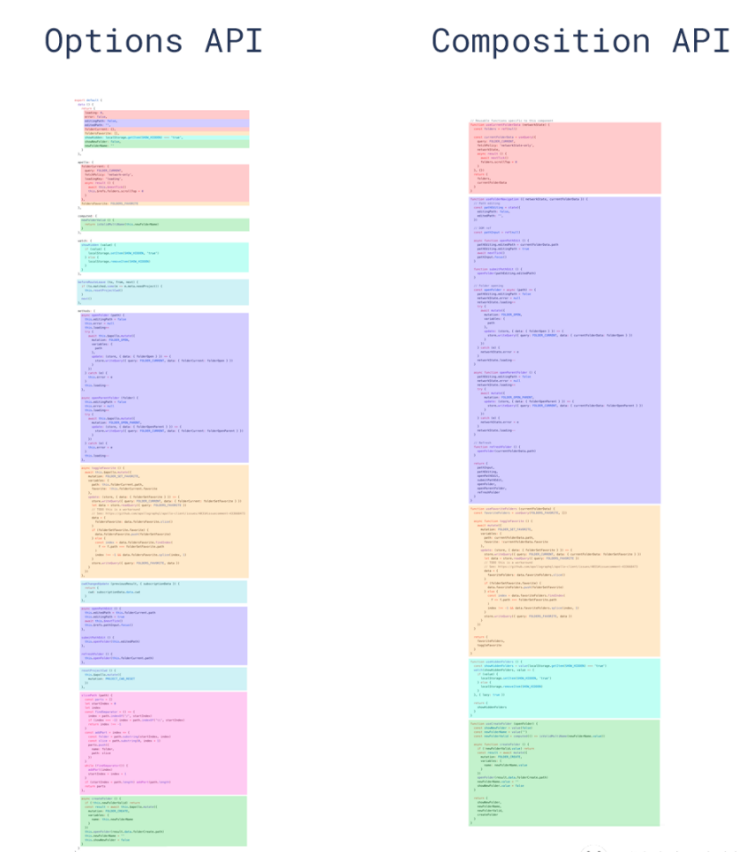

​    在选项式API中，人为地将代码分为了多个模块，非常有益于开发者上手，但是在模块复杂、代码量多的情况下将带来一些问题：

​     `模块复杂`的情况下，查阅相同逻辑的内容时，需要`反复翻阅`组件的内容，对于开发者特别是非原本组件开发者而言，这会极大地`加重负担`，而如果使用组合式API，因为整个组件都是基于响应式变量以及函数，我们可以把处理相同业务逻辑的内容放在同一个区域，这样可以方便阅读理解，并且在抽离、复用时提供了很大的便利，在大型项目维护中非常重要。


## API 风格

Vue3 中的vue组件可以按两种不同的风格书写：**选项式 API** 和**组合式 API**。

### 选项式 API (Options API)

使用选项式 API，我们可以用包含多个选项的对象来描述组件的逻辑，例如 `data`、`methods` 和 `mounted`。选项所定义的属性都会暴露在函数内部的 `this` 上，它会指向当前的组件实例。

```js
<script>
export default {
  // data() 返回的属性将会成为响应式的状态
  // 并且暴露在 `this` 上
  data() {
    return {
      count: 0
    }
  },

  // methods 是一些用来更改状态与触发更新的函数
  // 它们可以在模板中作为事件监听器绑定
  methods: {
    increment() {
      this.count++
    }},}
</script>

<template>
  <button @click="increment">Count is: {{ count }}</button>
</template>
```


### 组合式 API (Composition API)

​		组合式API(Composition API)是一系列 API 函数的集合，是函数式编程

​		通过组合式API，使我们可以使用API函数而不是声明选项的方式书写 Vue组件逻辑。

#### setup初识

​		在单文件组件中，组合式 API 通常会与 `setup` 搭配使用。这个 `setup` attribute 是一个标识，告诉 Vue 需要在编译时进行一些处理，让我们可以更简洁地使用组合式 API。比如，`<script setup>` 中的导入和顶层变量/函数都能够在模板中直接使用。

下面是使用了组合式 API 与 `<script setup>` 改造后和上面的模板完全一样的组件：

```vue
<script setup>

//引入ref，ref 用来创建响应式数据
import { ref } from 'vue'

// 响应式状态,类似选项式api中 data选项中定义的数据  data:{count:0}  methods:{inc(){}}
const count = ref(0)
// 用来修改状态、触发更新的函数，类似选项式api中 method中定义的函数
function increment() {
  //修改响应式状态的时候需要.value
  count.value++
}
</script>

<template>
//模板中使用不需要加.value
  <button @click="increment">Count is: {{ count }}</button>
</template>
```


### 该选哪一个？

​		两种 API 风格都能够覆盖大部分的应用场景。它们只是同一个底层系统所提供的两套不同的接口。

​		实际上，选项式 API 是在组合式 API 的基础上实现的！关于 Vue 的基础概念和知识在它们之间都是通用的。

​		选项式 API 以“组件实例”的概念为中心 (即上述例子中的 `this`)，对于有面向对象语言背景的用户来说，这通常与基于类的心智模型更为一致。同时，它将响应性相关的细节抽象出来，并**强制按照选项来组织代码**，从而对初学者而言更为友好。

​		组合式 API 是 Vue 3 中引入的一种新的 API 设计模式，它可以使开发者更好地**组织和复用组件逻辑**。传统的选项式 API 通过将相关的选项属性和生命周期钩子分散在不同的选项中来定义组件逻辑，而组合式 API 允许开发者通过组合逻辑功能来组织组件。

​		组合式 API 的核心概念是 "Composition"（组合），即将组件逻辑划分为一组独立的功能块，每个功能块都可以包含状态、计算属性、方法等。这些功能块可以在需要时通过其他组件进行组合和复用。

​		使用组合式 API，开发者可以更灵活地组织组件代码，将关注点分离，并使得代码更容易测试和复用。它还提供了更细粒度的控制，使开发者可以更深入地探索组件的内部实现。同时，组合式 API 也与 TypeScript 更好地集成，提供了更好的类型推断和代码补全，使得开发者在开发过程中更加高效。

​		总结来说，组合式 API 是 Vue 3 中引入的一种新的 API 设计模式，通过**组合逻辑功能来组织和复用组件逻辑，使得组件代码更加灵活**、可测试和可复用。

### 1、更好的逻辑复用

### 2、更灵活的代码组织

### 3、 更好的类型推导(ts支持)

### 4、更小的生产包体积

搭配 <script setup>使用组合式 API比等价情况下的选项式API更高效，对代码压缩也更友好。这是由于 <script setup> 形式书写的组件模板被编译为了一个内联函数，和 <script setup>中的代码位于同一作用域。


如果你是使用 Vue 的新手，这里是我们的大致建议：

- 在学习的过程中，推荐采用更易于自己理解的风格。再强调一下，大部分的核心概念在这两种风格之间都是通用的。熟悉了一种风格以后，你也能够很快地理解另一种风格。
- 在生产项目中：
  - 当你不需要使用构建工具，或者打算主要在低复杂度的场景中使用 Vue，例如渐进增强的应用场景，推荐采用选项式 API。
  - 当你打算用 Vue 构建完整的单页应用，推荐采用组合式 API + 单文件组件。


## 模板语法

### 跟原来一样

插值语法，v-if  v-for v-model 等指令  跟原来一样

## 组合式api概览

###  1、响应式API

例如 ref()和 reactive()，使我们可以直接创建响应式状态、计算属性和侦听器。

### 2、生命周期钩子

例如 onMounted() 和 onUnmounted()，使我们可以在组件各个生命周期阶段添加逻辑。

### 3、依赖注入

 例如 provide() 和 inject()，使我们可以在使用响应式API时，利用Vue的依赖注入系统。

# **第二十八节——setup**

## 一、介绍

setup 一开始是一个组件选项，在组件被创建之前，props 被解析之后执行。它是组合式 API 的入口。

早期的写法是使用setup选项，但是用起来比较麻烦，后面改成了`<script setup>`  setup脚本

### 1. setup选项的写法和执行时机(了解)

```vue
<template>
  <div>
    {{ num }}
    <button @click="num++">按钮</button>
    <button @click="jia">按钮</button>
  </div>
</template>

<script>
import { ref } from 'vue'
export default {
  setup() {
    let num = ref(0)
    function jia() {
      num.value++
    }
    return { num, jia } //要使用setup的属性方法，必须要返回这个值和函数
  },
  data() {
    return {}
  }
}
</script>

<style></style>
```

在组件进行渲染时会优先执行setup函数，其执行时期是先于beforeCreate之前。

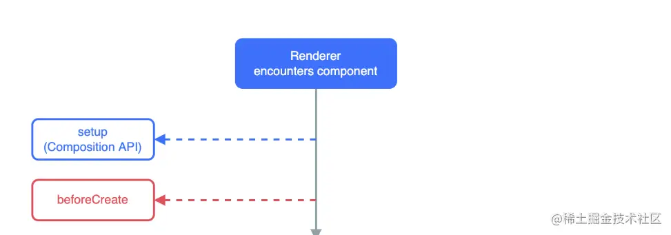

代码案例

```vue
<template>
  <div>
    main
  </div>
</template>

<script>
export default {
  setup(){
    console.log("setup")
  },
  beforeCreate() {
    console.log("beforeCreate")
  }
}
</script>
```


### 2. 如何使用setup函数（了解）

```vue
<script>
import { ref } from "vue";
export default {
  setup() {
    //具备响应式的数据
    let count = ref(1);
    // 不具备响应式的数据
    let num = 100;
    function clickHandler() {
      // 修改数据，必须.value ,修改完以后模版会发生改变
      count.value++;
      // 修改完以后，模板不变
      num++;
    }
    return { //要使用setup的属性方法，必须要返回这个值和函数
      count,
      num,
      clickHandler,
    };
  },
  beforeCreate() {
    console.log("beforeCreate");
  },
};
</script>

<template>
  count: {{ count }}
  <hr />
  num: {{ num }}
  <button @click="clickHandler">按钮</button>
</template>
```

​		在setup函数中的数据和方法**必须要return出去**模板中才能够使用，并且没有使用ref创建的数据，是没有响应式的。

​	

### 3. `<script setup>`语法糖（常用）

​		在定义了许多变量或者函数时，**如果每一个变量和函数都需要return的话，会显的代码十分的冗余**，所以就有了<script setup>这种语法糖写法，直接定义，直接使用，**日后开发大部分都是这种写法**。

语法糖写法（实现效果与上个例子一致）

```vue
<script setup>
import { ref } from "vue";
// 定义响应式数据，类似选项式api中data选项中的数据
let count = ref(10);
function fn() {
  // setup中 使用的时候需要加.value (因为要追踪改变)
  count.value++;
}
</script>

<template>
  <!-- 模板中使用使用不需要加.value -->
  {{ count }}
</template>
<style></style>
```


### 4.`<script setup>`语法糖好处

1.解决了vue2的data和methods方法相距太远，无法组件之间复用

2.提供了script标签引入共同业务逻辑的代码块，顺序执行

3.script变成setup函数，默认直接暴露给模版

4.组件直接挂载，无需注册


## 二、🍔组合式API-定义响应式数据（常用）

​		ref和reactive 这两个函数都是类似vue2中的data一样，用于生成响应式数据。

​		vue3中实现响应式数据的方法是就是使用ref和reactive，所谓响应式就是界面和数据同步，能实现实时更新

​		响应式的底层原理：vue2中响应式是通过defineProperty实现的，vue3中是通过ES6的Proxy来实现的

### 1. reactive函数

reactive()：接受**对象类型数据的参数**传入并返回一个**响应式的对象**

##### 1-引入reactive函数

reactive属于vue3 新增的组合式api之一 需要从vue中引入

```js
import {reactive} from "vue"
```

##### 2-创建响应式数据

reactive()接受**对象类型数据的参数**传入并返回一个**响应式的对象,**返回的对象具备参数对象一样的属性

```js
/**
 * 使用 reactive 定义 响应式数据
 * info 改变数据会重新渲染
 */
 
const info = reactive({
 name: '李骏',age:0
})
```

##### 3-定义函数，修改响应式数据,

###### **注意：**

**不能把整个info的值替换** 否则会失去响应式

```js
const setCount = () => {
  info = {count:0}
}
```

##### 4-模板中使用响应式数据

添加点击事件，点击的时候触发函数，修改响应式数据，模版会自动更新

```vue
<template>
  <button @click="setCount">{{ info.count }}</button>
</template>
```


完整代码如下

```vue
<template>
  <button @click="setCount">{{ arr.count }}</button>
</template>

<script setup>
//1.导入函数
import {reactive} from "vue";

//2.执行函数 传入一个对象类型的参数，并使用变量接收
const arr = reactive({
  count: 0
})
const setCount = () => {
  arr.count++  //在reative里面，不需要使用value就可以
}
</script>
```

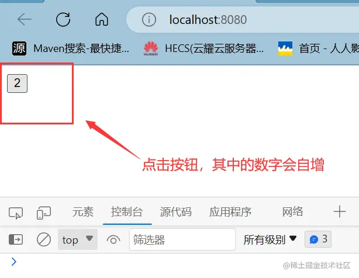

​    也可以定义一个数组

```js
let arr = reactive([2, 3, 4]);

function changeHandler() {
  arr.push(100);
}
```

​    模板中调用函数修改数组以后，模板也会自动改变

```vue
<button @click="changeHandler">{{arr}}</button>
```


### 2. ref函数（常用）

  ref函数是简单类型和对象类型都可以接受并返回一个响应式的对象

  reactive函数只能接受对象类型

##### 1-引入ref函数

```js
import {ref} from "vue";
```

##### 2-创建基本类型的响应式数据

创建基础类型的数据，ref的参数是基础类型数据的初始值

像下面，count的初始值为10

```js
const count = ref(10)
console.log(count)
```

​	打印count，可以发现ref产生的是一个响应式的对象，有一个value属性

​	 ref创建的数据，js脚本中修改的时候需要加.value

##### 

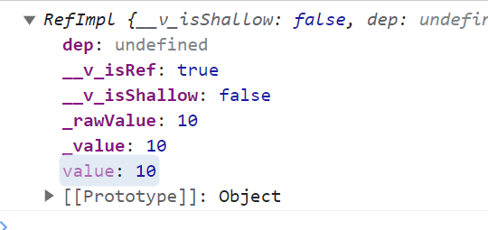

##### 3- 定义函数，修改数据

```js
const setCount = () => {
  //在脚本区域修改由ref产生的响应式数据，必须通过.value属性
  count.value++
}
```


##### 4-模板中使用ref数据

模板中使用的时候，不需要加.value,直接使用变量即可

```vue
<template>
  <button @click="setCount">{{ count }}</button>
</template>
```


总体代码如下：

```vue
<template>
  <button @click="setCount">{{ count }}</button>
</template>

<script setup>
//1.导入函数
import {ref} from "vue";
//2.执行函数 传入一个对象类型的参数，并使用变量接收
const count = ref(10)
const setCount = () => {
  //在脚本区域修改由ref产生的响应式数据，必须通过.value属性
  count.value++
}
</script>
```


##### 5-ref创建对象类型的属性

使用的时候需要在value上操作对象的属性

```js
// ref 创建对象类型
let obj = ref({ name: '李骏', age: 19 })
//使用的时候需要在value上操作对象的属性
obj.value.name;  //李骏
// ref 创建对象类型
let arr2 = ref([1, 2, 3]);
//使用的时候需要在value上操作数组
arr2.value.push(100);
```

##### 6-ref本质

   ref本质也是reactive，ref(0)等价于reactive({value: 0})

   ref和reactive都属于递归监听，也就是数据的每一层都是响应式的，如果数据量比较大，非常消耗性能。


### 3.ref和reactive区别-场景

##### ref

- 创建一个响应式数据，一般来说用于创建**简单类型**的响应式对象，比如String、Number...基础类型
- 也可以定义引用数据类型

##### reactive

- 创建一个对象的响应式代理，参数只能是对象

相同点：ref与reactive都是对数据深度监听，不管是简单类型还是复杂的对象，只要发生改变时都出触发视图更新


### `reactive()` 的局限性

`reactive()` API 有一些局限性：

1. **有限的值类型**：它只能用于对象类型 (对象、数组和如 `Map`、`Set` 这样的集合类型)。它不能持有如 `string`、`number` 或 `boolean` 这样的原始类型。

2. **不能替换整个对象**：由于 Vue 的响应式跟踪是通过属性访问实现的，因此我们必须始终保持对响应式对象的相同引用。这意味着我们不能轻易地“替换”响应式对象，因为这样的话与第一个引用的响应性连接将丢失：

   js

   ```js
   let state = reactive({ count: 0 })
   
   // 上面的 ({ count: 0 }) 引用将不再被追踪
   // (响应性连接已丢失！)
   state = reactive({ count: 1 })  //赋值新的对象以后，会失去响应式
   ```

3. **对解构操作不友好**：当我们将响应式对象的原始类型属性解构为本地变量时，或者将该属性传递给函数时，我们将丢失响应性连接：

   js

   ```js
   const state = reactive({ count: 0 })
   
   // 当解构时，count 已经与 state.count 断开连接
   let { count } = state
   // 不会影响原始的 state
   count++
   
   // 该函数接收到的是一个普通的数字
   // 并且无法追踪 state.count 的变化
   // 我们必须传入整个对象以保持响应性
   callSomeFunction(state.count)
   ```

由于这些限制，我们建议使用 `ref()` 作为声明响应式状态的主要 API。


ps：**一般项目中我们使用ref撸到底就行！**

掌握了两个，看自己习惯


# 三、🍟组合式API-computed

​    computed()：计算属性的思想与vue2-vue3 的是完全一致的，组合式API下**只是修改了写法**

### 1-导入computed函数

```js
import { ref, computed } from 'vue'
```

### 2-使用computed函数

​    computed函数，参数是一个函数，参数返回一个对象，返回的对象的值，依赖于 return的值

​    返回的值也是一个响应式对象

```js
let arr = ref([20, 30, 50, 1, 2, 3, 4, 5, 6, 7, 8, 9])

//2.执行函数return计算后的值 变量接收
let count = computed(() => {
  return arr.value.filter((item) => item > 10).reduce((sum, item) => sum + item, 0)
})
```

### 3-模板中使用

```vue
<template>
  {{ count }}
  <button @click="arr[0]++">点击</button>
</template>
```

### 4-修改了原始的数组，计算属性就会自动改变

```js
setTimeout(() => {
  arr.value.push(9,10)
}, 3000)
```

总体代码：

```vue
<script setup>
//1.导入computed函数
import { ref, computed } from 'vue'

let arr = ref([20, 30, 50, 1, 2, 3, 4, 5, 6, 7, 8, 9])

//2.执行函数return计算后的值 变量接收
let count = computed(() => {
  return arr.value.filter((item) => item > 10).reduce((sum, item) => sum + item, 0)
})

setTimeout(() => {
  arr.value.push(9,10)
}, 3000)
</script>
```

​    `提示：`计算属性中不应该有**异步请求**，修改**DOM**这些操作，同时避免直接修改计算属性的值，计算属性应该是**只读的**


# 四、🌭组合式API-watch

​     watch的作用与vue2-vue3中是一致的，侦听**一个或者多个数据**的变化，数据变化时执行回调函数。

​    watch简单来说就是监听一个数据的改变。

额外的两个参数：

1. immediate（立即执行）
2. deep（深度侦听）

## 1. 基础使用-单个数据的侦听

### 1-引入watch

```js
import {ref, watch} from "vue";
```

### 2-监听一个ref数据

watch 

第一个参数是要监听的数据

第二个参数是 监听的回调函数，一旦数据有变，回调函数就会执行，回调函数两个参数，一个是改变后的新值，一个是改变前的原始值

​	**ps：监听的回调函数中的两个参数在使用的时候不需要加.value**

```js
let count = ref(10)

//2.调用watch 侦听count的变化
//此处的newValue和oldValue，不加.value，直接使用count数据还是需要加value
watch(count, (newValue, oldVale) => {
  console.log("监听函数中直接使用数据", count.value);
  console.log("newValue", newValue);
  console.log("oldValue", oldValue);})
```


下面代码，是在点击按钮的时候，修改原始值，使用watch监听了原始值的改变

```vue
<template>
  <button @click="setCount">{{ count }}</button>
</template>

<script setup>
//1.导入watch
import {ref, watch} from "vue";

const count = ref(0)
const setCount = () => {
  count.value++
}

//2.调用watch 侦听变化
//此处的ref对象不加.value
watch(count, (newValue, oldVale) => {
  console.log(`count发生了变化,旧值为${oldVale}，新值为${newValue}`)
})
</script>
```


## 2. 基础使用-多个数据的侦听

同时侦听多个数据的变化，不管哪个数据变化都需要执行回调

这种情况watch的参数可以是一个数组。

```vue
<template>
  <button @click="setCount">{{ count }}</button><br>
  <button @click="setName">{{ name }}</button>
</template>

<script setup>
//1.导入watch
import {ref, watch} from "vue";
//创建两个响应式数据
const count = ref(0)
const name = ref("test")

const setCount = () => {
  count.value++
}
const setName = () => {
  name.value="test被修改了"
}

//2.调用watch 侦听变化
//此处的ref对象不加.value
watch([count,name], ([newCount,newName], [oldCount,oldName]) => {
  console.log(`count发生了变化,旧值为${oldCount}，新值为${newCount}`)
  console.log(`name发生了变化,旧值为${oldName}，新值为${newName}`)
})
</script>
```

无论点击哪个按钮，都会执行回调函数


## 3. immediate选项

immediate选项，是watch的第三个参数对象里面的配置项

在某些情况下，我们可能需要在组件初始化阶段就立即执行侦听器，以获取某些初始数据或执行某些操作，这个时候便可开启immediate选项

```vue
<template>
  <button @click="setCount">{{ count }}</button>
</template>

<script setup>
//1.导入watch
import {ref, watch} from "vue";
const count = ref(0)
const setCount = () => {
  count.value++
}

watch(count, () => {
  console.log("该监听器已被创建")
}, {immediate: true})  //打开网页立刻执行一次
</script>
```

  在侦听器创建时(页面刷新时)**立即触发回调**，响应式数据变化之后继续执行回调


## 4. deep选项

   通过watch监听的ref对象默认是**浅层侦听**，直接修改**嵌套的对象属性**不会触发回调执行，你需要监听一个由ref产生的对象类型的响应式数据的属性值时，需要开启deep选项。

   deep选项，是watch的第三个参数对象里面的配置项，**deep:true，开启深层侦听**


没有开启deep选项时

```vue
<template>
  <button @click="setCount">{{ state.count }}</button>
</template>

<script setup>
//1.导入watch
import {ref, watch} from "vue";
const state = ref({count: 0})
const setCount = () => {
  state.value.count++
}

watch(state, () => {
  console.log("数据发生了变化")  //可以看到，state.value.count的值变化了。
}) 							   //但是watch没有执行
</script>
```

点击按钮，页面数据会修改，但是wath监听的回调函数没有执行


开启deep选项

```js
//与上述代码一致，只是在watch中开启deep选项
watch(state, () => {
  console.log("数据发生了变化")  //此时watch就会执行了
},{deep:true})
```

  开启过后，执行了回调函数并打印了语句


## 5. 精确监听

当你开启deep选项时，就会递归遍历，监听对象的所有属性都会被监听，特别是在处理大型对象或频繁更新的对象时，会造成性能浪费。

```vue
<template>
  <div>当前的名字为：{{ info.name }}</div>
  <div>当前的年龄为：{{ info.age }}</div>

  <button @click="changeName">修改名字</button>
  <button @click="changeAge">修改年龄</button>
</template>

<script setup>
import {ref, watch} from "vue";
const info = ref({name: '张三', age: 18})

const changeName = () => {
  info.value.name = "李四"
}
const changeAge = () => {
  info.value.age = 68
}

//不开启deep选项，精确监听age属性
watch(
    () => info.value.age,  //只有修改年龄，watch才触发
    					   //也可以这样 ()=>{return info.value.age}
    () => console.log("age发生变化了")
)
</script>
```

   修改name时，控制台没有变化，修改age时，监听到变化，执行回调函数，打印了语句


# 六、watchEffect

watch简单来说就是监听一个数据的改变。

`watchEffect` 用于立即执行一个函数，并响应该函数内部所依赖的所有响应式引用或计算属性。

## 主要区别与相关点

### 主要区别

- **自动侦测依赖 vs 显式声明**: `watchEffect` 自动侦测函数内所用到的所有响应式引用，而 `watch` 需要你明确指定要观察的引用。
- **立即执行**: `watchEffect` 创建时会立即执行一次，而 `watch` 默认不会，除非设置了 `immediate` 选项。
- **旧值与新值**: `watch` 回调提供新值和旧值，而 `watchEffect` 不提供。
- **多源观察**: `watch` 可以观察多个源，但 `watchEffect` 观察函数内的所有响应式引用。

### 相关点

- **响应性**: 两者都提供强大的响应性支持。
- **生命周期**: 在组件卸载时，两者都会自动停止观察。

## 使用场景

- **使用 watch**:
  - 当你需要访问旧值和新值。
  - 当你需要基于条件观察某个值。
  - 当你需要更细粒度的控制（如 `deep`, `flush` 等选项）。
- **使用 watchEffect**:
  - 当你需要依赖多个响应式引用，并希望所有这些改变都触发同一函数。
  - 当你不需要旧值，只关心新值。


watchEffect官方解释：

​		为了根据响应式状态*自动应用*和*重新应用*副作用（自动应用就是第一个调用监听函数，重新应用副作用，就是数据改变以后，自动调用监听函数），我们可以使用 watchEffect 函数。

​		它立即执行传入的一个函数，同时响应式追踪其依赖，并在其依赖变更时重新运行该函数，简单来说，我们写的函数，会立即执行一次，然后每次里面的数据发生变化后再出发该函数

```vue
<template>
  <div>{{ count }}</div>
</template>

<script setup>
import { watchEffect, ref, reactive } from "vue";
const count = ref(1)
const info = reactive({ name: '张三' })
/**
 * 创建后会立即执行，然后每次里面使用的响应式数据发生改变的时候
 * 注意是响应式数据
 * 该函数会再再次执行
 */
watchEffect(() => {
  console.log(count.value)
  console.log(info.name)
})

setTimeout(() => {
  count.value += 1
}, 100)

setTimeout(() => {
  info.name = '李四'
}, 2000)

</script>
```


# 七、🍿组合式API-生命周期函数

​    Vue的生命周期指的是Vue实例从创建到销毁的过程，包括开始创建、初始化数据、编译模板、挂载Dom→数据更新→再次编译模板、再次挂载Dom等过程。这个过程总共分为8个阶段：创建前/后，载入前/后，更新前/后和销毁前/后。

官网的生命周期图（组合式）

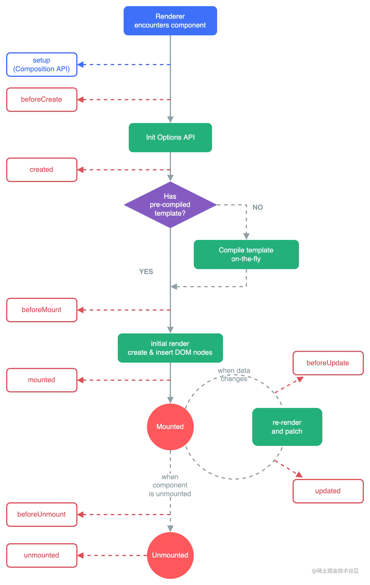

### Vue3的生命周期API（选项式  VS  组合式）

组合式的setup脚本等同于 原来的 beforeCreate/created

|      选项式API       |    组合式API    |
| :------------------: | :-------------: |
| beforeCreate/created |      setup      |
|     beforeMount      |  onBeforeMount  |
|       mounted        |    onMounted    |
|     beforeUpdate     | onBeforeUpdate  |
|       updated        |    onUpdated    |
|    beforeUnmount     | onBeforeUnmount |
|      unmounted       |   onUnmounted   |

### 以onMounted函数为例

引入 `import {onMounted} from "vue"`

使用onMounted是一个函数，用来监听挂载完成这个生命周期

onMounted的参数是一个函数，组件规则完毕以后，这个监听函数会执行。

```vue
<template>
  <div>onMounted</div>
</template>

<script setup>
//1.导入
import {onMounted} from "vue";
//2.执行函数
onMounted(()=>{
  console.log("组件挂载完毕")
})
</script>
```

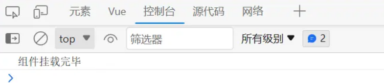

### 生命周期函数是可以多次监听的

多次监听时传入的回调会在时机成熟时**依次执行**

```vue
<template>
  <div>onMounted</div>
</template>

<script setup>
//1.导入
import {onMounted} from "vue";
//2.执行函数
onMounted(()=>{
  console.log("onMounted1")
})
onMounted(()=>{
  console.log("onMounted2")  //这两个生命周期都会执行
})
</script>
```

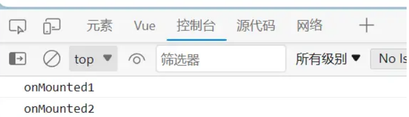

​     当在一个onMounted中有大量的代码的时候，可以再写一个onMounted进行补充逻辑，换句话说就是，不敢动屎代码的时候，加上去就完事了。


# 八、ref模版引用

​    **通过ref标识可以获取真实的dom对象或者组件实例对象**

### ref标记dom

   vue中想要获取dom，可以使用ref模版引用

```java
<h1 ref="h1Ref">这是一个标签</h1>
<Mytime ref="a1"></Mytime> //这是一个组件
```

​    选项式api中，使用`this.$refs.h1Ref`就可以。

​    组合式api中，得在setup里面创建一个响应式数据ref，初始值赋值为null，然后在onMounted 生命周期内部才能使用。（组件挂载完毕以后我们的定义的ref.value自动会被赋值为dom对象）

**ps：这里模板中定义的ref模版引用的名字，必须和setup中 定义的响应式数据ref 变量的名字一致，否则会报错。**

#### 0-模板中通过ref标记dom

```java
<h1 ref="h1Ref">这是一个标签</h1>
<Mytime ref="a1"></Mytime> //这是一个组件
```


#### 1-setup中定义响应式数据

```java
const h1Ref = ref(null)
let a1 = ref(null)
```

#### 2-onMounted生命周期内部使用

```java
onMounted(()=>{
  //h1ref.value 就是dom对象
  console.log(h1ref.value.innerText);  
    //因为数据没有在dom里面挂载，需要在挂在后才能拿到里面的值
})
```


​    通过ref标识获取真实的dom对象

```vue
<template>
  <!--2。通过ref标识绑定ref对象-->
  <h1 ref="h1Ref">这是一个标签</h1>
  <TestCom ref="testComRef"/>
</template>

<script setup>
import {onMounted, ref} from "vue";
import TestCom from "@/components/TestCom";
    
//1. 调用ref函数
const h1Ref = ref(null)
const testComRef = ref(null)
//组件挂载完毕后才能够获取
onMounted(()=>{
  console.log(h1Ref.value)
  console.log(testComRef.value)
})

let a1 = ref(null)
console.log(a1.value)  //null
onMounted(() => {
  console.log(a1.value.b1)  //组件里面的值
})
</script>
```


### ref标记自定义组件（少）

如果子组件<MyButton/>内部有自己的状态和方法，通过ref标记组件以后，发现，打印出来的组件的实例对象中却会发展没有 

#### 1-先给MyButton组件，添加一个状态myAttr和方法test

```vue
<template lang="">
  <button @click="clickHandler">{{ title }} {{myAttr}}</button>
</template>

<script setup>
import { defineProps, defineEmits, ref } from "vue";
let props = defineProps({
  title: { type: String },
});
    
//组件自己的方法
function test() {
  console.log("test");
}
//组件自己的状态
let myAttr = ref("111");

</script>
```


尝试一下

#### 2- 父组件app中通过ref标记 自定义组件

```java
<MyButton ref="btn1" title="按钮"></MyButton>
```

#### 3-父组件app的setup中 ,定义btn1，在生命周期onMounted中获取

```java
let btn1 = ref(null);
onMounted(() => {
  console.log(btn1); //ref响应式数据
  console.log(btn1.value); //.value 拿到 组件实例对象

});
```

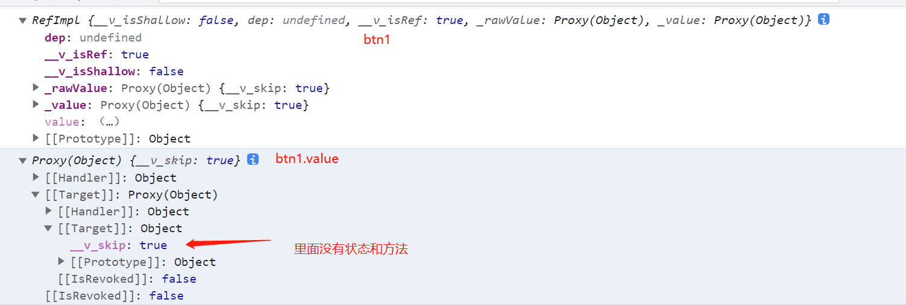


​    默认情况下在<script setup>==语法糖下组件内部的属性和方法是不开放给父组件访问的，这样设计的主要原因是防止意外修改

   vue3提供了defineExpose编译宏来指定暴漏哪些状态和方法允许访问。

#### 4-子组件内部使用defineExpose暴漏

```vue
<template lang="">
  <button @click="clickHandler">{{ title }} {{myAttr}}</button>
</template>

<script setup>

import { defineProps, defineEmits, ref } from "vue";

// let props = defineProps(["title"]);
let props = defineProps({
  title: { type: String },
});
//组件自己的方法
function test() {
  console.log("test");
}
//组件自己的状态
let myAttr = ref("111");
// Expose 暴露 myAttr 和 test 
defineExpose({ myAttr, test });  //组件不暴露的话，其他组件组件是拿不到值的
</script>
```

​      **暴漏以后，就可以获取到**

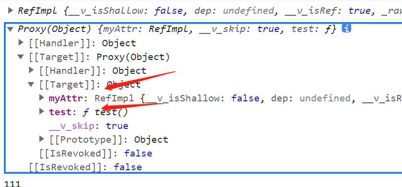


# 九、🧂组合式API-组件通信

​    setup中使用另一个组件的时候，只需要导入，不需要注册组件，会自动注册对应组件

## 1. 父传子

基本思想：

1. 子组件内部通过defineProps定义需要接收的参数
2. 父组件给子组件绑定属性

### 1-子组件内部通过defineProps定义需要接收的参数

定义MyButton组件（子组件）

```vue
<template lang="">
  <!-- 3-模板中可以使用使用属性名 -->
  <button>{{ props.title }}</button>
</template>

<script setup>
// 1-引入defineProps
import { defineProps } from "vue";
// 2-子组件内部-定义组件内部需要接收属性
// let props = defineProps(["title"]);
let props = defineProps({
  title: { type: String },
});

// props 会被自动转为响应式对象，props里面可以使用 父组件传递过来的属性
// 模板中可以使用使用属性名
console.log(props);
console.log(props.title);
</script>
```

### 2-父组件给子组件传递属性


App组件父组件）内部使用 子组件

引入组件，不需要注册

```js
import MyButton from "./components/MyButton.vue";
```

直接可以在模版中使用

```java
<MyButton title="按钮"></MyButton>
```


ps：传递的数据可以是普通数据，也可以是响应式数据

```vue
  <MyButton :title="btn1Title"></MyButton>
  
  <script setup>
  	let btn1Title = ref("你好");
  </script>
```


代码如下

```vue
<template lang="">
  <MyButton title="按钮"></MyButton>
  <MyButton :title="btn1Title"></MyButton>
</template>
<script setup>
import { ref } from "vue";
import MyButton from "./components/MyButton.vue";
let btn1Title = ref("你好");
</script>
```


父组件

```vue
<template>
        父组件
        <le title="父组件"></le>
</template>

<script setup lang="js">
import le from './2.子组件.vue'
</script>
<style></style>
```

子组件

```vue
<template>
        在子组件
        <button>{{ title }}</button>
</template>

<script setup lang="js">
import { defineProps} from 'vue'
 defineProps(['title'])
</script>

<style></style>
```


## 2. 子传父

基本思想：

1. 子组件内部，通过defineEmits定义事件emit，通过emit方法在适当的时候触发事件
2. 父组件中给子组件标签通过@绑定事件


### 1-子组件内部，通过emitEmits定义事件,得到emit

引入`import { defineEmits } from "vue";`

通过emitEmits定义事件

`let emit = defineEmits(["myClick"]);`

通过emit方法在适当的时候触发事件

`emit("myClick", "组件事件传递出去的数据11")`


子组件代码如下

```vue
<template lang="">
  <!-- 3-模板中给按钮添加点击事件，点击的时候执行clickHandler函数 -->
  <button @click="clickHandler">{{ title }}</button>
</template>
<script setup>

//0-引入defineEmits
import { defineProps, defineEmits } from "vue";
// let props = defineProps(["title"]);
let props = defineProps({
  title: { type: String },
});

//1- 定义事件 myClick
let emit = defineEmits(["myClick"]);
//2-按钮被点击的时候，触发自定义事件myClick
function clickHandler() {
  console.log("子组件内部 触发了点击事件 ");
  emit("myClick", "组件事件传递出去的数据11");
}
</script>
```


### 2-父组件中给子组件标签通过@绑定事件

```vue
<template lang="">
  <!-- 父组件内部，监听子组件的自定义事件 -->
  <MyButton title="按钮" @myClick="console.log(1)"></MyButton>
  <MyButton :title="btn1Title" @myClick="fn"></MyButton>
</template>

<script setup>
import { ref } from "vue";
import MyButton from "./components/MyButton.vue";
let btn1Title = ref("你好");
function fn(data) {
  console.log(data);//子组件传递过来的数据
  console.log("父组件内部监听到了 子组件的myClick触发");
}
</script>
```


代码如下:

父组件

```vue
<template>
        父组件
        <le title="父组件" @lijun="fn"></le>
</template>

<script setup lang="js">
import le from './2.子组件.vue'
function fn(e) {
    console.log('子传父用事件');
    console.log(e);
}
</script>
<style></style>
```

子组件

```vue
<template>
        在子组件
        <button @click="emits('lijun', { a: 1 })">{{ title }}</button>
</template>

<script setup lang="js">
import { defineProps, defineEmits } from 'vue'
let r = defineProps(['title'])
let emits = defineEmits(['lijun'])
</script>
<style></style>
```


## 3、祖孙传值🥐组合式API-provide和inject

#### 作用

顶层组件向任意底层组件传递数据和方法，实现**跨层组件通信**

语法

父组件提供（provide）数据(生产数据)

```js
import { provide ,ref} from "vue";
// 顶层组件提供数据，提供的数据的key为info，value为注入的数据
provide("info", 数据);
```

任意底层组件注入（inject）数据（消费数据）

```js
// 任意底层注入数据，注入的时候传入使用对应的key  
let info = inject("info");
console.log(info); //数据
```


下面我们定义了三个组件，app作为爷爷，Son作为孩子，Grandson作为孙子

#### 传递静态数据

注入静态数据，父亲中的静态数据改变后，子组件不会改变

```js
import { provide ,ref} from "vue";
// 顶层组件提供静态数据
provide("info", { a: 1 });
```

后代中使用

```js
// 孙子注入静态数据
let info = inject("info");
console.log(info); //{a:1}
```


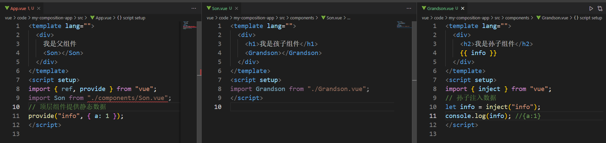


#### 传响应式数据

在调用provider时，将第二个参数设置为**ref对象**

```jsx
import { provide ,ref} from "vue";
let testInfo = ref({ age: 1, color: "red" });
//提供响应式数据
provide("testInfo", testInfo);
```

后代组件中使用

```js
//孙子注入响应式数据
let testInfo = inject("testInfo");
console.log(testInfo);
```


注入响应式数据，父亲中的数据，改变了，子组件会改变

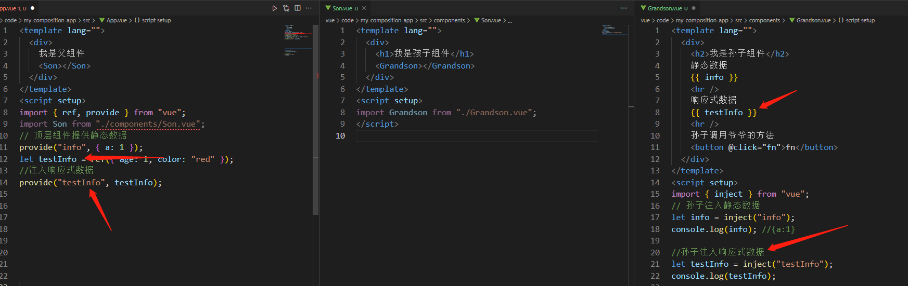


#### 顶层传递方法

也可以注入一个函数

注意：谁的数据谁负责修改。一般我们通过注入方法，让后代组件调用，来修改注入的数据的值（一般后代组件不能直接修改数据）


提供一个方法，修改提供的testInfo的值

```js
function fn() {
  testInfo.value.age++;
}
// 提供方法
provide("fn", fn);
```

后代中注入方法，调用

```js
// 孙子注入方法
let fn = inject("fn");
```

后代中可以调用爷爷的方法

```js
    孙子调用爷爷的方法
    <button @click="fn">fn</button>
```


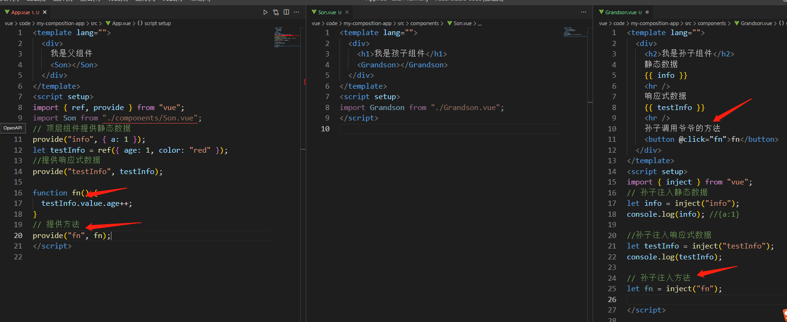


#### 直接修改注入的对象

ps:因为这里注入的是对象，传递的是对象的引用地址，所以后代中也可以直接修改 注入的响应式对象

```js
<button @click="fn2">fn2</button>
function fn2() {
  testInfo.value.age++;
}
```


## 4-组件的v-model

   如果我们有一个自定义组件 MyInput 可以像下面一样使用

```js
<MyInput v-model="name">
let name=ref('zhangsan');
```


### vue3.3新增的defineModel

​    vue3.3新增的defineModel 宏，简化了组件的v-model使用方法。

   从 Vue 3.4 开始，推荐的实现方式是使用 `defineModel()` 宏

```vue
<!-- Child.vue -->
<script setup>
const model = defineModel()

function update() {
  model.value++
}
</script>

<template>
  <div>parent bound v-model is: {{ model }}</div>
</template>
```

​    父组件可以用 `v-model` 绑定一个值：

template

```js
<!-- Parent.vue -->
<Child v-model="count" />
```

   `defineModel()` 返回的值是一个 ref。它可以像其他 ref 一样被访问以及修改，不过它能起到在父组件和当前变量之间的双向绑定的作用：

- 它的 `.value` 和父组件的 `v-model` 的值同步；
- 当它被子组件变更了，会触发父组件绑定的值一起更新。

​    这意味着你也可以用 `v-model` 把这个 ref 绑定到一个原生 input 元素上，在提供相同的 `v-model` 用法的同时轻松包装原生 input 元素：

```vue
<script setup>
	const model = defineModel()
</script>

<template>
  <input v-model="model" />
</template>
```


### 底层原理----组件的v-model自动解析

   还记得，这个v-model 会被vue解析成什么吗

`defineModel` 是一个便利宏。编译器将其展开为以下内容：

- 一个名为 `modelValue` 的 prop，本地 ref 的值与其同步；
- 一个名为 `update:modelValue` 的事件，当本地 ref 的值发生变更时触发。

​    v-model:username 解析后如下，就是给组件传递一个username属性，一个update:username事件

解析后的代码如下（自动的）

```js
<MyInput
  :modelValue="name"
  @update:modelValue="newValue => name = newValue"/>
```


   在 3.4 版本之前，你一般会按照如下的方式来实现上述相同的子组件：

```vue
<script setup>
  const props = defineProps(['modelValue'])
  const emit = defineEmits(['update:modelValue'])
</script>

<template>
  <input
    :value="props.modelValue"
    @input="emit('update:modelValue', $event.target.value)"/>
</template>
```

   `@update:username="newValue => name = newValue"`

   newValue是自定义事件传递过来的参数赋值给父组件中定义的name，newValue是函数的形参，怎么写都行，只要是合法的变量名就可以。


  子组件内部应该这样实现

### 1-组件内部定义属性和事件

```js
let props = defineProps(["username"]);
let emit = defineEmits(["update:username"]);
```

### 2-给组件的input绑定 username属性，监听组件里面的输入框的input事件

```vue
<template lang="">
  <!-- 2-给组件的input绑定 username属性，监听组件里面的输入框的input事件 -->
  <input type="text" :value="username" @input="inputHandler" />
</template>
```

### 3- 组件里面的输入框的input事件 触发以后，触发组件的自定义事件，并且把输入框的值传递出去

```js
function inputHandler(e) {
  // 组件里面的输入框的input事件 触发以后，触发组件的自定义事件，并且把输入框的值传递出去
  emit("update:username", e.target.value);
}
```


Myinput总体如下

```vue
<template lang="">
  <!-- 2-给组件的input绑定 username属性，监听组件里面的输入框的input事件 -->
  <input type="text" :value="username" @input="inputHandler" />
</template>

<script setup>
import { defineProps, defineEmits } from "vue";
// 1-定义属性和事件
let props = defineProps(["username"]);
let emit = defineEmits(["update:username"]);
// 3-
function inputHandler(e) {
  // 组件里面的输入框的input事件 触发以后，触发组件的自定义事件，并且把输入框的值传递出去
  emit("update:username", e.target.value);
}
</script>
<style lang=""></style>
```


带参数的v-model

```js
<!--组件的v-model 绑定的数据 一定要是ref数据，否则 会失去响应式  -->
 <!-- 《MyInput v-model=“ref数据"》 -->


 // MyInput 内部
    let model = defineModel();
    // model.value 获取外部传递过来的ref数据 --

// 《MyInput v-model:username=“ref数据" v-model:password=“ref数据"》

 // MyInput 内部
    let username = defineModel('username');
    // username.value 获取外部传递过来的ref数据 --

    let password = defineModel('password');
   //  password.value 获取外部传递过来的ref数据 --
```

   改宏自动注册一个username 属性和update:username事件，并且返回了一个可以直接变更的ref数据

  我可可以直接给组件的input绑定 v-model

```vue
<template lang="">
  <MyInput v-model:username="username" v-model:password="password"></MyInput>
  {{ username }}-{{ password }}
  <!-- <MyInput  :modelValue="str" @update:modelValue="newValue=> str.value = newValue"></MyInput> -->
</template>

<script setup>
import { ref, reactive } from "vue";
import MyInput from "@/05-input.vue";
let username = ref("zhangsan");
let password = ref("123");
```


总体代码如下：

```vue
<template>
  <input type="text" name="" id="" @input="fn" :value="username" />
  <input type="text" name="" id="" @input="fn2" :value="password" />
</template>

<script setup>
import { defineEmits, defineProps, defineModel } from "vue";

//获取到 v-model绑定的 数据-返回了 ref对象
let username = defineModel("username");
let password = defineModel("password");

console.log(username, password);

function fn(e) {
  console.log(username);
  console.log(e.target.value);
  username.value = e.target.value;
}
function fn2(e) {
  password.value = e.target.value;
}
</script>

<style></style>
```


### 4-代码案例

App.vue

```vue
<template>
    {{ flag }}
    <Switch v-model="flag"></Switch> 
	<!-- 通过v-model把flag传给Switch组件 -->
</template>

<script setup lang="js">
import Switch from './components/Switch.vue';  //引入Switch组件
import { ref } from 'vue' //引入ref
let flag = ref(true)  
</script>

<style></style>
```

Switch.vue

```vue
<template>
   <button :class="{ color: flag == true }" @click="flag = true">开</button>
   <button :class="{ color: flag == false }" @click="flag = false">关</button>
</template>

<script setup lang="js">
import { defineModel } from 'vue' //vue自带
let flag = defineModel()  //接受app.vue传入的值
</script>

<style scoped>
.color {
    color: red;}
</style>
```


## 5-非父子组件

​		非父子的-非爷孙的（同级组件，或者跨越很多层级的组件）推荐使用状态管理

### 什么是全局状态管理？

理论上来说，每一个 Vue 组件实例都已经在“管理”它自己的响应式状态了。我们以一个简单的计数器组件为例：

vue

```vue
<script setup>
import { ref } from 'vue'

// 状态
const count = ref(0)

// 动作
function increment() {
  count.value++
}
</script>

<!-- 视图 -->
<template>{{ count }}</template>
```

它是一个独立的单元，由以下几个部分组成：

- **状态**：驱动整个应用的数据源；
- **视图**：对**状态**的一种声明式映射；
- **交互**：状态根据用户在**视图**中的输入而作出相应变更的可能方式。

下面是“单向数据流”这一概念的简单图示：


​	

然而，当我们有**多个组件共享一个共同的状态**时，就没有这么简单了：

1. 多个视图可能都依赖于同一份状态。
2. 来自不同视图的交互也可能需要更改同一份状态。

对于情景 1，一个可行的办法是将共享状态“提升”到共同的祖先组件上去，再通过 props 传递下来。然而在深层次的组件树结构中这么做的话，很快就会使得代码变得繁琐冗长。这会导致另一个问题：Prop 逐级透传问题。

对于情景 2，我们经常发现自己会直接通过模板引用获取父/子实例，或者通过触发的事件尝试改变和同步多个状态的副本。但这些模式的健壮性都不甚理想，很容易就会导致代码难以维护。

一个更简单直接的解决方案是抽取出组件间的共享状态，放在一个全局单例中来管理。这样我们的组件树就变成了一个大的“视图”，而任何位置上的组件都可以访问其中的状态或触发动作


### 用响应式 API 做简单状态管理

如果你有一部分状态需要在多个组件实例间共享，你可以使用 [`reactive()`](https://cn.vuejs.org/api/reactivity-core.html#reactive) 来创建一个响应式对象，并将它导入到多个组件中：

js

```js
// store.js
import { reactive } from 'vue'

export const store = reactive({  //store仓库
  count: 0
})
```

vue

```vue
<!-- ComponentA.vue -->
<script setup>
import { store } from './store.js'
</script>

<template>From A: {{ store.count }}</template>
```

vue

```vue
<!-- ComponentB.vue -->
<script setup>
import { store } from './store.js'
</script>

<template>From B: {{ store.count }}</template>
```

现在每当 `store` 对象被更改时，`<ComponentA>` 与 `<ComponentB>` 都会自动更新它们的视图。现在我们有了单一的数据源。

然而，这也意味着任意一个导入了 `store` 的组件都可以随意修改它的状态：

template

```vue
<template>
  <button @click="store.count++">
    From B: {{ store.count }}
  </button>
</template>
```

虽然这在简单的情况下是可行的，但从长远来看，可以被任何组件任意改变的全局状态是不太容易维护的。为了确保改变状态的逻辑像状态本身一样集中，建议在 store 上定义方法，方法的名称应该要能表达出行动的意图：

js

```js
// store.js
import { reactive } from 'vue'

export const store = reactive({
  count: 0,
  increment() {
    this.count++
  }
})
```

template

```vue
<template>
  <button @click="store.increment()">
    From B: {{ store.count }}
  </button>
</template>
```


除了我们这里用到的单个响应式对象作为一个 store 之外，你还可以使用其他响应式 API 例如 `ref()` 或是 `computed()`，或是甚至通过一个组合式函数来返回一个全局状态：

js

```js
import { ref } from 'vue'

// 全局状态，创建在模块作用域下
const globalCount = ref(1)

export function useCount() {
  // 局部状态，每个组件都会创建
  const localCount = ref(1)

  return {
    globalCount,
    localCount
  }
}
```

store.js

```js
import { reactive } from "vue";
const store = reactive({  //store 仓库
  num: 10,  //state 状态
  jia() {  //action 行为
    store.num++;
  },
});

export { store };
```

app.vue

```vue
<template> 
    {{ store.num }}
    <button @click="store.jia">点击加1</button>
</template>

<script setup lang="ts">
import { store } from './views/store';
</script>
<style></style>
```


# 十、组合式API使用路由


路由的安装-创建路由，路由模式，路由表，路由挂载 ，模板中使用router-view 和之前 都是一样的。

### 路由的使用步骤1-2-3-4 和之前一样

1-安装`pnpm i vue-router `

2-创建路由 createRouter，定义路由表,路由模式

router/index.js

```js
import { createRouter, createWebHashHistory } from "vue-router";
let router = createRouter({
  routes: [
    {
      path: "/",
      name: "home",
      component: () => import("../components/Home.vue"),
    },

    {
      path: "/detail",
      name: "detail",
      component: () => import("../components/Detail.vue"),
    },
  ],
  history: createWebHashHistory(),
});
export default router;
```


3-挂载到vue实例中

```js
import router from "./router";
let app = createApp(App);
// 挂载router
app.use(router);
```


4-定义router-view视图

app中 使用router-view 定义路由的出口

```vue
<template>
  <button @click="$router.push('/')">
  {{$route.params + '--'+$route.query }}
      
    <router-view></router-view>
</template>
```


上面的步骤和之前的一样

this.$router   this.$route

setup中使用路由的方式不一样(没有this)


## 路由useRouter

1-从vue-router引入 useRouter这个钩子  

```js
import { useRouter } from 'vue-router'
```

2-初始化这个钩子并赋值给router(this.$router)

```js
const router = useRouter()
```

组件的setup

```vue
<script setup>
  // 从vue-router引入 useRouter这个钩子
  import { useRouter } from 'vue-router'
  
  // 初始化这个钩子并赋值给router
  const router = useRouter()
  
  // 跳转到详情页面
  const link2 = () => {
    // 使用我们刚声明的router跳转
    router.push('/detail')
  }
</script>
```

这里这个router的使用方式和之前一样


## useRoute

获取当前组件中 route配置

```js
import { useRoute } from 'vue-router'
```

创建

```js
const route = useRoute()
```

获取跳转的参数( this.$route)

```js
route.query 获取传递的搜索参数
route.params 获取传递的动态id （需要在路由配置中配置/detail/:id）
```


App.vue

```vue
<template>
    app路由
    <button @click="fn">点击进入test</button>
  <router-view></router-view>
</template>

<script setup lang="ts">
import { useRouter } from 'vue-router';
let router = useRouter()
function fn() {
  router.push('/lijun?id=100')
}
</script>
<style></style>
```

1Test.vue

```vue
<template>
        test组件
</template>

<script setup lang="ts">
</script>
<style></style>
```

2Li.vue

```vue
<template>
        李骏组件
        {{ route.query.id }}
</template>

<script setup lang="ts">
import { useRoute } from 'vue-router';
let route = useRoute()
console.log(route.query.id);
</script>

<style></style>
```

## 总结

- **`useRouter`**：用于获取和操作路由实例，主要用于导航到其他路由。
- **`useRoute`**：用于获取当前活跃的路由信息，包含当前路由的所有状态。

   **所以useRouter是路由实例，useRoute是路由信息**


# 十、什么是“组合式函数”？hooks


Vue Hooks: 让Vue开发更简单与高效


##  Hooks简介

**「1. 什么是Hooks」**

Hooks并不是VUE特有的概念，实际上它原本被用于指代一些特定时间点会触发的勾子。而在React16之后，它被赋予了新的意义：

> ❝
>
> 一系列以 `use` 作为开头的方法，它们提供了让你可以完全避开 `class式写法`，在函数式组件中完成生命周期、状态管理、逻辑复用等几乎全部组件开发工作的能力
>
> ```
> Hooks最核心的价值来自于内部的状态管理
> ```
>
> ❞

​    在VUE3中，`Hooks`的概念结合了VUE的响应式系统，被称为`组合函数`。组合函数是VUE3组合式API中提供的新的逻辑复用的方案，是一类利用 Vue 的组合式 API 来封装和复用有状态逻辑的函数


**「2. Hooks与composition Api」**

​    Hooks是一种`基于闭包`的函数式编程思维产物，所以通常我们会在`函数式风格`的框架或组件中使用Hook，比如VUE的组合式API(Composition Api)。Hooks在VUE2所使用的`选项式风格API`中也不是不可以使用，毕竟Hook本质只是一个函数，只要hook内部所使用的api能够得到支持，我们可以在任何地方使用它们，只是可能需要额外的支持以及效果没有函数式组件中那么好，因为仍会被选项分割。

VUE3推出时为开发者带来了全新的Composition API即组合式API。它是一种通过函数来描述组件逻辑的开发模式。组合式API为开发者带来了更好的逻辑复用能力，通过`组合函数`来实现更加简洁高效的逻辑复用。

如下代码就是 组合式api

```vue
<script setup>
import { ref, onMounted } from 'vue'

// 响应式状态
const count = ref(0)

// 用来修改状态、触发更新的函数
function increment() {
  count.value++
}

// 生命周期钩子
onMounted(() => {
  console.log(`The initial count is ${count.value}.`)
})
</script>

<template>
  <button @click="increment">Count is: {{ count }}</button>
</template>
```


## 为什么要使用Hook

**「1. Mixin/Class的局限性」**

在以往VUE2的选项式API中，主要通过Mixin或是Class继承来实现逻辑复用，但这种方式有三个明显的`短板`：

- **「不清晰的数据来源」**：当使用了多个mixin/class时，哪个数据是哪个模块提供的将变得难以追寻，这将提高维护难度
- **「命名空间冲突」**：来自多个class/mixin的开发者可能会注册同样的属性名，造成冲突
- **「隐性的跨模块交流」**：不同的mixin/class之间可能存在某种相互作用，产生未知的后果

以上三种主要的缺点导致在大型项目的开发中，多mixin/class的组合将导致逻辑的混乱以及维护难度的提升，因而在VUE3的官方文档中不再继续推荐使用，保留mixin也只是为了迁移的需求或方便VUE2用户熟悉。

**「2. Hooks的优势」**

其实Mixin/Class的缺点反过来就是Hooks的优点：

- 清晰一目了然的源头：Hooks不是一个类，没有将状态、方法存放在对象中，然后通过导出对象的形式实现复用，也就不会有对象间过度`耦合`、`干扰`等问题。Hooks中的各类状态是封装在内部的，与外界隔离，仅暴露部分函数、变量，这使得其来源、功能`清晰可辨`且`不易被干扰`
- 没有命名冲突的问题：Hooks本质是闭包函数，内部所导出的变量、方法支持重命名，因而同一个Hook在同一个组件中可以N次使用而不冲突
- 精简逻辑：一个Hook开发完成后，在使用Hook时不需要关心其内部逻辑，只需知道有什么效果、如何使用即可，专注于其他核心业务逻辑，可以节省大量重复代码

在 Vue 应用的概念中，“组合式函数”(Composables) 是一个利用 Vue 的组合式 API 来封装和复用**有状态逻辑**的函数。

当构建前端应用时，我们常常需要复用公共任务的逻辑。例如为了在不同地方格式化时间，我们可能会抽取一个可复用的日期格式化函数。这个函数封装了**无状态的逻辑**：它在接收一些输入后立刻返回所期望的输出。复用无状态逻辑的库有很多，比如你可能已经用过的 [lodash](https://lodash.com/) 或是 [date-fns](https://date-fns.org/)。

相比之下，有状态逻辑负责管理会随时间而变化的状态。一个简单的例子是跟踪当前鼠标在页面中的位置。在实际应用中，也可能是像触摸手势或与数据库的连接状态这样的更复杂的逻辑。


## 鼠标跟踪器示例

如果我们要直接在组件中使用组合式 API 实现鼠标跟踪功能，它会是这样的：

vue

```vue
<script setup>
import { ref, onMounted, onUnmounted } from 'vue'

const x = ref(0)
const y = ref(0)

function update(event) {
  x.value = event.pageX
  y.value = event.pageY
}

onMounted(() => window.addEventListener('mousemove', update))
onUnmounted(() => window.removeEventListener('mousemove', update))
</script>

<template>Mouse position is at: {{ x }}, {{ y }}</template>
```

但是，如果我们想在多个组件中复用这个相同的逻辑呢？我们可以把这个逻辑以一个组合式函数的形式提取到外部文件中：

js

```js
// mouse.js
import { ref, onMounted, onUnmounted } from 'vue'

// 按照惯例，组合式函数名以“use”开头
export function useMouse() {
  // 被组合式函数封装和管理的状态
  const x = ref(0)
  const y = ref(0)

  // 组合式函数可以随时更改其状态。
  function update(event) {
    x.value = event.pageX
    y.value = event.pageY
  }

  // 一个组合式函数也可以挂靠在所属组件的生命周期上
  // 来启动和卸载副作用
  onMounted(() => window.addEventListener('mousemove', update))
  onUnmounted(() => window.removeEventListener('mousemove', update))

  // 通过返回值暴露所管理的状态
  return { x, y }
}
```

下面是它在组件中使用的方式：

vue

```vue
<script setup>
import { useMouse } from './mouse.js'

const { x, y } = useMouse()
</script>

<template>Mouse position is at: {{ x }}, {{ y }}</template>
```

​    如你所见，核心逻辑完全一致，我们做的只是把它移到一个外部函数中去，并返回需要暴露的状态。和在组件中一样，你也可以在组合式函数中使用所有的[组合式 API](https://cn.vuejs.org/api/#composition-api)。现在，`useMouse()` 的功能可以在任何组件中轻易复用了。

​    更酷的是，你还可以嵌套多个组合式函数：一个组合式函数可以调用一个或多个其他的组合式函数。这使得我们可以像使用多个组件组合成整个应用一样，用多个较小且逻辑独立的单元来组合形成复杂的逻辑。实际上，这正是为什么我们决定将实现了这一设计模式的 API 集合命名为组合式 API。

​    举例来说，我们可以将添加和清除 DOM 事件监听器的逻辑也封装进一个组合式函数中：

js

```js
// event.js
import { onMounted, onUnmounted } from 'vue'

export function useEventListener(target, event, callback) {
  // 如果你想的话，
  // 也可以用字符串形式的 CSS 选择器来寻找目标 DOM 元素
  onMounted(() => target.addEventListener(event, callback))
  onUnmounted(() => target.removeEventListener(event, callback))
}
```

​    有了它，之前的 `useMouse()` 组合式函数可以被简化为：

js

```js
// mouse.js
import { ref } from 'vue'
import { useEventListener } from './event'

export function useMouse() {
  const x = ref(0)
  const y = ref(0)

  useEventListener(window, 'mousemove', (event) => {
    x.value = event.pageX
    y.value = event.pageY
  })

  return { x, y }
}
```

  代码如下:

app.vue

```vue
<template>
  <div>
    {{ x }}:{{ y }}
  </div>
</template>
<script setup lang="ts">
import { zuobiao } from './views/hooks';
let { x, y } = zuobiao()

</script>
<style></style>
```

hooks.js

```js
import { ref } from "vue";
function zuobiao() {
  let x = ref(0);
  let y = ref(0);

  window.onmousemove = function (e) {
    x.value = e.clientX;
    y.value = e.clientY;
  };
  return { x, y };
}
export { zuobiao };
```


# 十一、第三方库Vue-Use

   `vueuse` 是一个基于 Vue 3 的实用工具库，它提供了一系列有用的组合式函数（composables），可以帮助开发者更方便地编写功能强大的 Vue 应用程序。`vueuse` 包含了许多实用的功能，涵盖了常见的 Web 开发需求，如状态管理、动画、异步加载、浏览器交互等。

`官网:https://v7-7-1.vueuse.org/guide/`

​     vueuse 的特点

1. **组合式 API**：`vueuse` 采用了 Vue 3 的组合式 API，使得代码更易读、更易维护。
2. **实用工具函数**：提供了大量的实用工具函数，覆盖了常见的开发需求。
3. **响应式**：所有工具函数都是响应式的，可以无缝集成到 Vue 的响应式系统中。
4. **轻量级**：`vueuse` 的核心库非常轻量，可以根据需要按需引入不同的功能模块。


### 安装

```js
pnpm i @vueuse/core
```

### 使用

   这里使用的是vue-use的本地存储，只能存储一次，所以使用的时候如果数据没有变化，先把本地存储清理掉

```vue
<template>
    {{ store.name }}-----{{ store.age }}
    <button @click="store.age++">按钮</button>

   <hr>
    {{ x }}:{{ y }}
</template>

<script setup lang="ts">
import { useLocalStorage, useMouse } from '@vueuse/core' //引入

// persist state in localStorage
// 返回ref数据--响应式数据
// 后面通过store 可以获取本地的数据，也可以修改本地的数据
const store = useLocalStorage(  
  'user',
  {
    name: 'Apple',
    color: 'red',
    age: 0
  },
)

// tracks mouse position
const { x, y } = useMouse() //可以直接拿到鼠标x,y轴坐标
</script>
<style></style>
```


### 常见功能

#### 1. `useMouse`

获取鼠标位置：

```js
import { useMouse } from '@vueuse/core';

const { x, y } = useMouse();
```


#### 2. `useElementBounding`

获取元素的边界信息：

```js
import { ref, onMounted } from 'vue';
import { useElementBounding } from '@vueuse/core';

const elRef = ref<HTMLElement | null>(null);

onMounted(() => {
  const bounding = useElementBounding(elRef.value);
  console.log(bounding.top, bounding.left, bounding.width, bounding.height);
});
```


#### 3. `useFetch`

异步数据请求：

```js
import { useFetch } from '@vueuse/core';

const { data, error, fetch } = useFetch('/api/data');

fetch().then(() => {
  if (error.value) {
    console.error(error.value);
  } else {
    console.log(data.value);
  }
});
```


#### 4. `useLocalStorage`

本地存储：

```js
import { useLocalStorage } from '@vueuse/core';

const count = useLocalStorage('count', 0);

count.value++;
```


#### 5. `useDark`

切换暗黑模式：

```js
import { useDark } from '@vueuse/core';

const isDark = useDark();

isDark.value = !isDark.value;
```


### 更多功能

`vueuse` 提供了大量其他实用工具函数，包括但不限于：

- `useClipboard`：复制文本到剪贴板。
- `useThrottle`：节流函数。
- `useDebounce`：防抖函数。
- `useIntersectionObserver`：交集观察器。
- `useMediaQuery`：媒体查询。
- `useStorage`：本地存储。
- `useTimeout`：延迟执行。
- `useInterval`：定时执行。
- `useIdle`：检测空闲状态。
- `useEventListener`：注册事件监听器。


### 总结

`vueuse` 是一个非常实用的工具库，可以帮助开发者更高效地编写 Vue 3 应用程序。通过提供一系列组合式函数，`vueuse` 可以简化常见的开发任务，提高开发效率。


# 十二、自动导入插件`unplugin`

​    `unplugin-auto-import` 是一个 Vite 和 Webpack 插件，它可以自动导入 Vue 组件和其他常用的库函数。这意味着你可以直接使用某些功能而不需要显式地导入它们，该插件会在构建过程中自动为你处理导入逻辑。

​    主要特点

1. **自动化导入**：`unplugin-auto-import` 可以检测你的源码文件，并根据你使用的功能自动添加相应的导入语句。
2. **支持 Vue 3**：尤其适用于 Vue 3 的组合式 API (`Composition API`)，让开发者无需手动导入如 `ref`, `computed`, `onMounted` 等组合式函数。
3. **兼容性**：虽然它是为 Vue 3 设计的，但也支持其他库和框架中的自动导入。
4. **类型安全**：支持生成类型定义文件（`.d.ts`），这有助于提供更好的类型检查和 IDE 代码补全支持。
5. **配置灵活**：可以根据项目需求来定制化配置需要自动导入的模块列表

​    

​    这个插件特别适合 Vue 3 的组合式 API 风格，允许你在 `.vue` 单文件组件中直接使用组合式函数（composables）和其他 Vue 全局 API，而不需要在每个文件顶部手动导入它们。

### 安装

```js
npm i -D unplugin-auto-import
```

### 配置

vite-config.js

```js
import AutoImport from "unplugin-auto-import/vite";

// https://vitejs.dev/config/
export default defineConfig({
  plugins: [
    vue(), // ...
    AutoImport({
      imports: ["vue", "vue-router"],//自动导入vue 和vue-router 的api 
      dts: './auto-imports.d.ts', // 生成全局自动导入的声明文件
    })
  ],
  ...
});
```

### 使用

```vue
<template>
  <div>{{ count }}</div>
</template>

<script setup>
const count = ref(0);
const increment = () => count.value++;
onMounted(increment); // 在组件挂载后立即执行一次 increment 函数
</script>
```

​    在这个例子中，`ref` 和 `onMounted` 都是 Vue 3 的 Composition API 中的一部分，由于我们配置了 `unplugin-auto-import`，所以它们会被自动导入。

​    总之，`unplugin-auto-import` 是一个能够帮助提高开发效率的工具，特别是对于那些频繁使用相同 API 的大型项目。


# 
