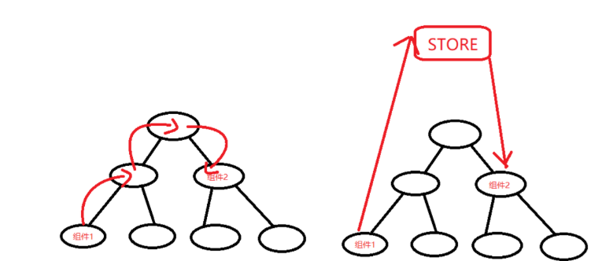
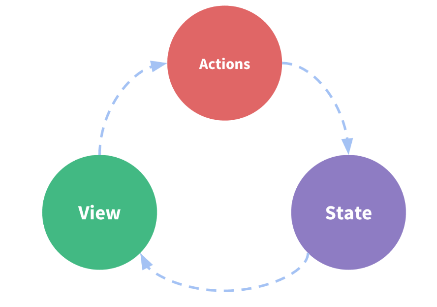
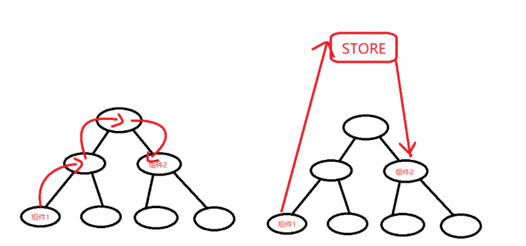

# 第二十六节-Pinia 

## 状态管理概念

   Pinia ，发音为 /piːnjʌ/，来源于西班牙语 piña 。意思为菠萝，表示与菠萝一样，由很多小块组成。在 Pinia 中，每个 Store 都是单独存在，一同进行状态管理。

   Pinia 是由 Vue.js 团队成员开发，最初是为了探索 Vuex 下一次迭代会是什么样子。过程中，Pinia 实现了 Vuex5 提案的大部分内容，于是就取而代之了。

   与 Vuex 相比，Pinia 提供了更简单的 API，更少的规范，以及 Composition-API 风格的 API 。更重要的是，与 TypeScript 一起使用具有可靠的类型推断支持。

- Pinia 与 Vuex 3.x/4.x 的不同
- mutations 不复存在。只有 state 、getters 、actions。
- actions 中支持同步和异步方法修改 state 状态。
- 与 TypeScript 一起使用具有可靠的类型推断支持。
- 不再有模块嵌套，只有 Store 的概念，Store 之间可以相互调用。
- 支持插件扩展，可以非常方便实现本地存储等功能。
- 更加轻量，压缩后体积只有 2kb 左右。


​    pinia是一个专为 Vue.js 应用程序开发的**状态管理模式 + 库**。它采用集中式存储管理应用的所有组件的状态，并以相应的规则保证状态以一种可预测的方式发生变化。

​	简单来说可以理解为 组件 之间用来共享数据的一种方式，数据data在vue也叫状态，pinia是专门来统一的管理数据的。

​		类似全局变量，定义好以后在哪里都可以使用。也叫全局状态，或者全局的data，而不是局限到一个组件内部！


## 目的

### 1、思考以下问题

   如果你的项目里有很多页面（组件/视图），页面之间存在多级的嵌套关系，此时，这些页面假如都需要共享一个状态的时候，此时就会产生以下两个问题：

- 多个视图依赖同一个状态
- 来自不同视图的行为需要变更同一个状态

### 2、目前能想到的解决方案

​	我们之前学习过组件之间的通信，就是数据的传递。之间的数据的传递-有父子-子父-兄弟，使用vuex就不局限域这些关系，任何两个组件都可以互相共享数据。

父子通信-：通过v-bind -属性绑定

子父通信：通过 v-on  自定义事件，事件绑定

兄弟组件：EventBus，发送数据的组件用$emit,接收数据的组件用$on

​		但是如果是跨多级组件，甚至是完全没有关系的组件，上面使用起来就比较麻烦。

​		虽然可以通过各种各样的办法解决，可实在很不优雅，而且等项目做大了，代码就会变成屎山，实在令人心烦。

### 3、状态管理出场

​    把各个组件都需要依赖的同一个状态抽取出来，在全局使用单例模式进行管理（全局状态管理）。

  在这种模式下，

​	1-任何组件都可以直接访问到这个状态，

​	2-任何组件也都可以通过类似事件的方式去修改状态。

​	3-当状态发生改变时，所有的组件都获得更新


​    这就是 pinia背后的基本思想，借鉴了 Flux、Redux。与其他模式不同的是，pinia是专门为 Vue 设计的状态管理库，以利用 Vue.js 的细粒度数据响应机制来进行高效的状态更新


## pinia数据共享

###   1-数据共享的图示

​    pinia 是一种 **全局** 范围内的状态管理（数据）方式，可以在任意组件之间的数据共享或者叫传递

  不使用pinia也能进行组件之间的数据传递，比如父子，子父，兄弟这种，比较直接。

  不过，如果两个组件相隔特别远的话，比如这样爷爷-父亲-孙子-曾孙子，传递起来非常麻烦



​    如果不使用pinia，如图1，组件1和组件2传值，简直不要太麻烦。

  使用pinia，如图2，组件1可以把数据给到一个全局的store ，组件2可以获取！

  store英文含义是 仓库，储藏所，这是vue里面的一个名词，用来存储全局状态（全局数据）

###   2-pinia管理数据的好处

   集中管理数据，易于开发和维护

   组件之间传递数据，更加简单高高效

###   3-pinia中的数据是响应式的，能够保持数据的和页面的同步

  为什么不直接使用全局变量？

  pinia中的数据是响应式的，能够保持数据的和页面的同步（和vue有关系）。而全局变量就不行。


###   4-什么样的数据适合使用pinia存储管理？

  组件内部的私有数据，放入data即可。

  **多个组件之间需要共享的数据**我们可以使用pinia。简单的父子，子父也没有必要使用pinia，一般的中小项目不必使用pinia，用了反而麻烦。


##   理解什么是“状态管理模式”？

   说了那么多，我们从一个例子理解状态管理里面的几个概念！

  让我们从一个简单的 Vue 计数应用开始

```vue
<template>
    {{ count }}
    <hr>
    <button @click="addCount">加1</button>
</template>

<script>
export default {
  data() {
    return { count: 0 }
  },
  methods: {
    addCount() {
      this.count++
    }
  }
}
</script>
```

  这个状态自管理应用(data组件内部自己控制)包含以下几个部分：

- **状态**（state），驱动应用的数据源（count）；
- **视图**（views），以声明方式将**状态**映射到视图 （组件的模板）；
- **操作**（actions），响应在**视图**上的用户输入导致的状态变化（addCount函数）。

  以下是一个表示“单向数据流”理念的简单示意：




​    但是，当我们的应用遇到**多个组件共享状态**时，单向数据流的简洁性很容易被破坏：

- 多个视图依赖于同一状态。
- 来自不同视图的行为需要变更同一状态。

​    对于问题一，传参的方法对于多层嵌套的组件将会非常繁琐，并且对于兄弟组件间的状态传递无能为力。

​    对于问题二，我们经常会采用父子组件直接引用或者通过事件来变更和同步状态的多份拷贝。以上的这些模式非常脆弱，通常会导致无法维护的代码。

​		所以，我们为什么不把组件的共享状态抽取出来，以一个全局单例模式管理呢？在这种模式下，我们的组件树构成了一个巨大的“视图”，不管在树的哪个位置，任何组件都能获取状态或者触发行为！



​		通过定义和隔离状态管理中的各种概念并通过强制规则维持视图和状态间的独立性，我们的代码将会变得更结构化且易维护。

​		这就是 pinia背后的基本思想，借鉴了 [Flux](https://facebook.github.io/flux/docs/overview)、[Redux](http://redux.js.org/) 和 [The Elm Architecture](https://guide.elm-lang.org/architecture/)。与其他模式不同的是，pinia 是专门为 Vue.js 设计的状态管理库，以利用 Vue.js 的细粒度数据响应机制来进行高效的状态更新。


##   为什么你应该使用 Pinia？

​    Pinia 是 Vue 的专属状态管理库，它允许你跨组件或页面共享状态。

###    Pinia 与 Vuex 相比 

- 接口更简单，代码更简洁： 

  - 舍弃了 mutation，减少了很多不必要的代码。
  - 可以直接对数据进行读写，直接调用 action 方法，不再需要 commit、dispatch（牛逼）。

- 更好的 TypeScript 支持： 

  - Vuex 中的很多属性缺少类型支持，需要开发者自行进行模块类型的声明。
  - Pinia 中的所有内容都是类型化的，尽可能地利用了 TS 的类型推断。

  

  

## 一、使用pinia

### 1 、安装Pinia 依赖

​    准备创建一个项目，来学习Pinia 

```js
pnpm create vite my-pinia-app -- --template vue
cd my-pinia-app
pnpm i #安装依赖
```

​    安装vuex

```json
pnpm install pinia
```

​    启动项目

```js
pnpm run  dev
```


####     把pinia挂载到vue实例上

​    创建一个 pinia 实例 (根 store) 并将其传递给应用：

```js
import { createApp } from "vue";
import App from "./App.vue";

// 引入createPinia创建pinia的函数

import { createPinia } from "pinia";
// 创一个pinia根实例
const pinia = createPinia();
let app = createApp(App);
// 根 store 并将其传递给应用
app.use(pinia);

app.mount("#app");
```


###   2-store概念

#### Store 是什么？

​		Store (如 Pinia) 是一个保存状态和业务逻辑的实体，它并不与你的组件树绑定。换句话说，**它承载着全局状态**。它有点像一个永远存在的组件，每个组件都可以读取和写入它。它有**两个概念**，state 和 action，我们可以假设这些概念相当于组件中的 `data`、  和 `methods`。

####   应该在什么时候使用 Store?

​		一个 Store 应该包含可以在整个应用中访问的数据。这包括在许多地方使用的数据，例如显示在导航栏中的用户信息，以及需要通过页面保存的数据，例如一个非常复杂的多步骤（多页面）表单。

​		另一方面，你应该避免在 Store 中引入那些原本可以在组件中保存的本地数据，例如，一个元素在页面中的可见性。

   并非所有的应用都需要访问全局状态，但如果你的应用确实需要一个全局状态，那 Pinia 将使你的开发过程更轻松

###   3、定义一个store

​		我们得知道pinia中的 Store 是用 `defineStore()` 定义的，它的第一个参数要求是一个**独一无二的**名字。

  下面我们使用defineStore

#### 创建一个store，并且导出

创建 src/stores/counter.js

```js
import { defineStore } from 'pinia'

// 你可以对 `defineStore()` 的返回值进行任意命名，但最好使用 store 的名字，同时以 `use` 开头且以 `Store` 结尾。(比如 `useUserStore`，`useCartStore`，`useProductStore`)
// 第一个参数是你的应用中 Store 的唯一 ID。来标记这个全局状态
export const useAlertsStore = defineStore('alerts', {
  // 其他配置...
})
```

​		这个**名字** ，也被用作 *id* ，是必须传入的， Pinia 将用它来连接 store 和 devtools。为了养成习惯性的用法，将返回的函数命名为 *use...* 是一个符合组合式函数风格的约定。

​		`defineStore()` 的第二个参数可接一个option store对象。


####   Option Store

​    与 Vue 的选项式 API 类似，我们也可以传入一个带有 `state`、`actions`属性的 Option 对象

​    你可以认为 `state` 是 store 的数据 (`data`)，而 `actions` 则是方法 (`methods`)。

```js
export const useCounterStore = defineStore('counter', {
  state: () => ({ count: 0 }),//state这里是一个函数 返回一个对象，类似选项式api里面的data
  actions: {//类型选项式api里面的方法
  	//定义修改数据的方法
    add(n) {
      //这里直接通过this.count 就可以 获取state里面定义的状态
      this.count++
    },
  },})
```

#### 或者setupstore

```java
import { defineStore } from 'pinia'
export const useCounterStore = defineStore('counter', () => {
  const count = ref(0)  
  function add() {
    count.value++
  }
  return { count, add }
})
```

  count就是 state里面的数据，add函数就是 action里面的方法

  ps：最后需要return 要暴漏出去的状态和方法


###   4-组件中使用 Store

​		虽然我们前面定义了一个 store叫做useCounterStore，但是在 `<script setup>` 中，我们必须调用 `useCounterStore()`，才能使用store 实例。

##### 		  创建store实例

​		我们在组件的setup里面，创建了store以后`const store = useCounterStore()`,我们就可以在组件中的任意位置访问 `store` 变量

####          组合式api 直接使用store里面的数据state

​		**这里直接使用store上的属性即可，`store.count`,**  不用像vux里面 store.state.count

​		组件内部

```vue
<script setup>
import { useCounterStore } from './stores/counter'
// 可以在组件中的任意位置访问 `store` 变量 ✨
const store = useCounterStore()
store.count
</script>

<template>
  <!-- 直接从 store 中访问 state -->
  <div>Current Count: {{ store.count }}</div>
</template>
```

​		一旦 store 被实例化，你可以直接访问在 store 的 `state`、 和 `actions` 中定义的任何属性。

​		注意，`store` 是一个用 `reactive` 包装的对象，这意味着不需要在 getters 后面写 `.value`，就像 `setup` 中的 `props` 一样

#####         直接修改store里面的数据state

​		store里面的状态数据是可以直接修改的，`store.count=100`

```vue
 <div>Current Count: {{ store.count }}</div>
 <button @click="store.count++">加1</button>
```

// 或者使用 $patch 修改 （可以修改多个属性）（选项式的sotre定义支持重置）

```      js
store.$patch({
  count: store.count + 1,
})
```

重置 State

```js
// 通过调用 store 的 $reset() 方法将 **state** 重置为初始值。
store.$reset()
```

##### State 也可以使用解构

  **但是解构会失去响应式**，需要 StoreToRefs 避免丢失响应式

```js
import { storeToRefs } from 'pinia'
const store = useCounterStore()
const {count} = storeToRefs(store)
```

  然后就可以是使用count了


##### 调用store里面的action修改数据state

​		Action 可以像函数或者通常意义上的方法一样被调用：`store.add()`

```vue
 <div>Current Count: {{ store.count }}</div>
 <button @click="store.add()">加1</button>
```


#### 选项式api中使用sotre

```vue
<template lang="">
  <div>{{ userStore.num }}</div>
  <button @click="userStore.addNum(10)">按钮</button>
</template>

<script>
import { useUserStore } from "./store/user";
export default {
  // 在选项式api 组件中使用 pinia
  setup(props) {
    let userStore = useUserStore();
    return {
      userStore,
    };
  },
  mounted() {
    console.log(this.userStore.num);
  },
};
</script>
<style lang=""></style>
```


### 5、其他js文件中使用store

##### 在组件外使用 store

​    Pinia store 依靠 `pinia` 实例在所有调用中共享同一个 store 实例。大多数时候，只需调用你定义的 `useStore()` 函数，完全开箱即用。例如，在 `setup()` 中，你不需要再做任何事情。但在组件之外，情况就有点不同了。 实际上，`useStore()` 给你的 `app` 自动注入了 `pinia` 实例。这意味着，如果 `pinia` 实例不能自动注入，你必须手动提供给 `useStore()` 函数。 你可以根据不同的应用，以不同的方式解决这个问题。


   比如router/index.js文件中

```js
import { useCounterStore } from "@/store/count"

// ❌ 由于引入顺序的问题，这将失败，此时可能pinia还没被创建
 let countStore = useCounterStore() 
....
const router = createRouter({
  history: createWebHashHistory(),
  routes: routes
})
router.beforeEach((to) => {
  //必须这样写
  // ✅ 这样做是可行的，因为路由器是在其被安装之后开始导航的，
  // 而此时 Pinia 也已经被安装。
  let countStore = useCounterStore()
  console.log(countStore.count)
})
```


### 6.pinia 本地存储

TIP

由于 pinia 是内存存储，一刷新浏览器仓库中的值就没有了，有时候我们需要即使刷新浏览器，仓库中的值还在，方便后续使用，这个时候我们就需要把仓库中的值持久化的存储起来，我们可以使用 [pinia-plugin-persistedstate](https://www.npmjs.com/package/pinia-plugin-persistedstate) 去实现

```js
pnpm i pinia-plugin-persistedstate -S
```


创建pinia的时候，使用插件

```js
import { createPinia } from "pinia"
import piniaPluginPersistedstate from "pinia-plugin-persistedstate"

// 创一个pinia根实例
const pinia = createPinia()
pinia.use(piniaPluginPersistedstate);
app.use(pinia);
....
```


在定义仓库时，创建 Store 时，将 `persist` 选项设置为 `true`。

选项式的配置

```js
import { defineStore } from "pinia"

export const useCounterStore = defineStore("counter", {
  // state: () => ({ count: 100 }), //state这里是一个函数 返回一个对象，类似选项式api里面的data
  state: () => ({ count: 100 }), //state这里是一个函数 返回一个对象，类似选项式api里面的data
  actions: {
    //类型选项式api里面的方法
    //定义修改数据的方法
    add() {
      //这里直接通过this.count 就可以 获取state里面定义的状态
      this.count++
    }
  },
  persist: true  //这样子就会本地持久化
})
```


组合式的配置，第三个参数，对象里面设置persist: true

```js
import { defineStore } from 'pinia'

export const useStore = defineStore(
  'main',
  () => {
    const someState = ref('你好 pinia')
    return { someState }
  },
  {
    persist: true,
  },
)
```


## 二、pinia中的getters

   与 Vue 的选项式 API 类似，我们也可以传入一个带有 `state`、`actions` 与 `getters` 属性的 Option 对象.

   我们刚刚学习了， `state` 是 store 的数据 (`data`)，而 `actions` 则是方法 (`methods`)。

  Getter 完全等同于 store 的 state 的计算值(计算属性)。

### 1、定义getter

​	可以通过 `defineStore()` 中的 `getters` 属性来定义它们。

​	  getters配置项对一个对象，里面可以定义多个getter，每个geter都是一个函数，并且它将接收 `state` 作为第一个参数：

```js
export const useCounterStore = defineStore('counter', {
  state: () => ({
    count: 0,
  }),
  getters: {
    doubleCount(state) {
      return state.count * 2;
    },
  },
})
```

这里我们定义了一个doubleCount，返回2倍的count。

​		我们也可以通过 `this` 访问到**整个 store 实例**

```js
 getters: {
    doubleCount() {
      return this.count * 2;
    },
  },
```


### 2、组件中使用getter

```vue
<script setup>
import { useCounterStore } from "./stores/counter";
const store = useCounterStore();
</script>

<template>
  <p>Double count is {{ store.doubleCount }}</p>
</template>
```


## 三、多个store互相访问

pinia中可以定义多个store，用户的store，购物车store等，有时候需要在一个store中访问其他store中数据

```js
import { defineStore } from "pinia";
export const useOtherStore = defineStore("other-store", {
  state: () => {
    return { num: 1000 };
  },
});
```


可以在一个store中引入另一个store，创建另一个store实例，然后使用

```js
// stores/counter.js
import { defineStore } from "pinia";
//1- 引入其他store
import { useOtherStore } from "./otherStore";

export const useCounterStore = defineStore("counter", {
  state: () => {
    return { count: 0 };
  },
  getters: {
    doubleCount() {
      return this.count * 2;
    },
  },
  actions: {
    add() {
      console.log("add");
      // 2-创建其他store的实例
      let otherStore = useOtherStore();
      //使用里面的数据
      console.log(otherStore.num);

      this.count = this.count + otherStore.num;
    },
  },
});
```


## 四、pinia 配合ts

代码都是原来的，咱们用ts的类型推论即可。

1-我们创建的项目要是支持ts的

```js
pnpm create vite my-pinia-ts-app -- --template vue
```

然后选择vue，选择ts

2-安装，pinia  `pnpm i pinia`


3-然后基本步骤和原来一样，只是创建的store文件是 ts的

store/counter.ts  ，里面的代码都是原来的，咱们用ts的类型推论即可


## 四、选项式api中使用  pinia的mapState（了解）

  pinia对比vuex好用很多，一般都是配合组合式api使用，在选项式api中也能用

#### 

##### 映射state为计算属性

  可以使用 `computed`，配合`mapState()` 辅助函数将 state 属性映射为只读的计算属性：

```js
import { mapState } from "pinia";
import { useCounterStore } from "./stores/counter";
export default {
  computed: {
    ...mapState(useCounterStore, ["count"])//把useCounterStore 里面count 映射到组件的count属性上
  },
  mounted() {
    console.log(this.count)//
  },
};
```

**注意：这里不需要创建store实例了**


 代码如下：

```vue
<template lang="">
  <div>{{ count }}</div>
</template>
<script>
import { mapState } from "pinia";
import { useCounterStore } from "./stores/counter";
export default {
  computed: {
    ...mapState(useCounterStore, ["count"]),
  },
};
</script>
<style lang=""></style>
```


#####   映射state为可修改的计算属性

​    如果你想修改这些 state 属性 (例如，如果你有一个表单)，你可以使用 `mapWritableState()` 作为代替

  我们需要提前在useCounterStore 定义一个txt 的state

```vue
<template lang="">
  <div>{{ count }}</div>
  <input type="text" v-model="txt" />
</template>

<script>
import { mapState, mapWritableState } from "pinia";
import { useCounterStore } from "./stores/counter";
export default {
  computed: {
    ...mapState(useCounterStore, ["count"]),
    ...mapWritableState(useCounterStore, ["txt"]),
  },
};
</script>
<style lang=""></style>
```


##### 映射action为method

  使用 `mapActions()` 辅助函数将 action 属性映射为你组件中的方法。

```js
 methods: {

    // 访问组件内的 this.add()
    ...mapActions(useCounterStore, ["add"]),

  },
```

  然后就可以 访问组件内的 this.add()


## 给予整个 store 的访问权

如果你需要访问 store 里的大部分内容，映射 store 的每一个属性可能太麻烦。你可以试试用 `mapStores()` 来访问整个 store：

```vue
<template lang="">
  <div>首页-- {{ counterStore.count }}</div>
  <!-- <div>首页-- {{ count }}</div> -->
</template>

<script>
export default {
  computed: {
    // ...mapState(useCounterStore, ["count"])
    ...mapStores(useCounterStore)
  },
  mounted() {
    console.log(this.counterStore.count)//使用state
    this.counterStore.count = 20//可以修改
    setTimeout(() => {
      this.counterStore.add()//使用actions
    }, 1000)
}</script>
```

   默认情况下，Pinia 会在每个 store 的 `id` 后面加上 `"Store"` 的后缀 作为映射到组件上的计算属性的名字


## 总结

​		使用简单：回顾以前使用的 Vuex，pinia 是不是 Api 是不是非常简洁，Pinia 抛弃了 Mutation 和 Module，只保留State、Getter 和 Action，而且使用方法和组件中 `Data`、 `Computed` 和 `Methods` 类似，上手零成本。

​		极致轻量化：代码只有1kb左右。

​		支持vue2和vue3：是Vuex的完美过渡替代者

​		它类型安全：支持TypeScript，类型可自动推断，**`即使在 JavaScript 中亦可为你提供自动补全功能！`**(划重点)

