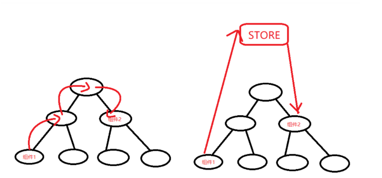
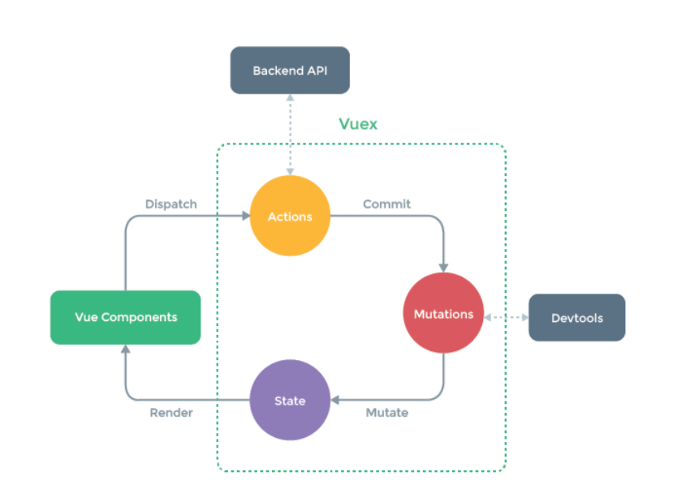
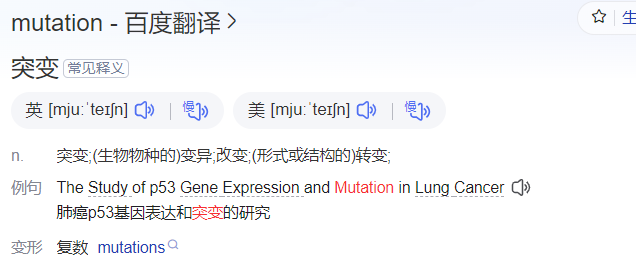
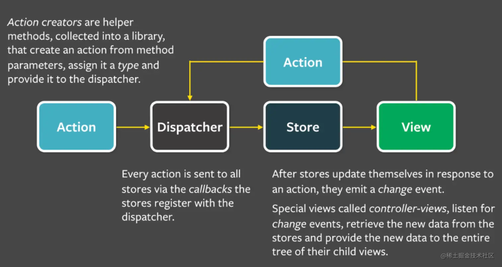

# 第二十五节——Vuex--历史遗留

文档地址
https://vuex.vuejs.org/zh/
version
V4.x

## 一、概念

Vuex 是一个专为 Vue.js 应用程序开发的**状态管理模式 + 库**。它采用集中式存储管理应用的所有组件的状态，并以相应的规则保证状态以一种可预测的方式发生变化。

​	简单来说可以理解为 组件 之间用来共享数据的一种方式，数据data在vue也叫状态，vuex是专门来统一的管理数据的。

​		类似全局变量，定义好以后在哪里都可以使用。所有vuex也叫全局状态，或者全局的data，而不是局限到一个组件内部！


## 二、目的

### 1、思考以下问题

如果你的项目里有很多页面（组件/视图），页面之间存在多级的嵌套关系，此时，这些页面假如都需要共享一个状态的时候，此时就会产生以下两个问题：

- 多个视图依赖同一个状态
- 来自不同视图的行为需要变更同一个状态

### 2、目前能想到的解决方案

​	我们之前学习过组件之间的通信，就是数据的传递。之间的数据的传递-有父子-子父-兄弟，使用vuex就不局限域这些关系，任何两个组件都可以互相共享数据。

父子通信-：通过v-bind -属性绑定

子父通信：通过 v-on  自定义事件，事件绑定

兄弟组件：EventBus，发送数据的组件用$emit,接收数据的组件用$on

​		但是如果是跨多级组件，甚至是完全没有关系的组件，上面使用起来就比较麻烦。

​		虽然可以通过各种各样的办法解决，可实在很不优雅，而且等项目做大了，代码就会变成屎山，实在令人心烦。

### 3、vuex出场

把各个组件都需要依赖的同一个状态抽取出来，在全局使用单例模式进行管理（全局状态管理）。

在这种模式下，

​	1-任何组件都可以直接访问到这个状态，

​	2-任何组件也都可以通过类似事件的方式去修改状态。

​	3-当状态发生改变时，所有的组件都获得更新


这就是 Vuex 背后的基本思想，借鉴了 Flux、Redux。与其他模式不同的是，Vuex 是专门为 Vue 设计的状态管理库，以利用 Vue.js 的细粒度数据响应机制来进行高效的状态更新


## 三、vuex数据共享

### 1-vuex数据共享的图示

vuex 是一种 **全局** 范围内的状态管理（数据）方式，可以在任意组件之间的数据共享或者叫传递

不使用vuex也能进行组件之间的数据传递，比如父子，子父，兄弟这种，比较直接。

不过，如果两个组件相隔特别远的话，比如这样爷爷-父亲-孙子-曾孙子，传递起来非常麻烦


如果不使用vuex，如图1，组件1和组件2传值，简直不要太麻烦。

使用vuex，如图2，组件1可以把数据给到一个全局的store ，组件2可以获取！

store英文含义是 仓库，储藏所，这是vue里面的一个名词，用来存储全局状态（全局数据）

### 2-vuex管理数据的好处

集中管理数据，易于开发和维护

组件之间传递数据，更加简单高高效

### 3-vuex中的数据是响应式的，能够保持数据的和页面的同步

为什么不直接使用全局变量？

vuex中的数据是响应式的，能够保持数据的和页面的同步（和vue有关系）。而全局变量就不行。


### 4-什么样的数据适合使用vuex 存储管理？

组件内部的私有数据，放入data即可。

**多个组件之间需要共享的数据**我们可以使用vuex。简单的父子，子父也没有必要使用vuex，一般的中小项目不必使用vuex，用了反而麻烦。


## 四、理解什么是“状态管理模式”？

说了那么多，我们从一个例子理解状态管理里面的几个概念！

让我们从一个简单的 Vue 计数应用开始

```
<template>
  <div>
    {{ count }}
    <hr>
    <button @click="addCount">加1</button>
  </div>
</template>
<script>
export default {
  data() {
    return { count: 0 }
  },
  methods: {
    addCount() {
      this.count++
    }
  }
}
</script>
```

这个状态自管理应用(data组件内部自己控制)包含以下几个部分：

- **状态**（state），驱动应用的数据源（count）；
- **视图**（views），以声明方式将**状态**映射到视图 （组件的模板）；
- **操作**（actions），响应在**视图**上的用户输入导致的状态变化（addCount函数）。

以下是一个表示“单向数据流”理念的简单示意：


但是，当我们的应用遇到**多个组件共享状态**时，单向数据流的简洁性很容易被破坏：

- 多个视图依赖于同一状态。
- 来自不同视图的行为需要变更同一状态。

对于问题一，传参的方法对于多层嵌套的组件将会非常繁琐，并且对于兄弟组件间的状态传递无能为力。

对于问题二，我们经常会采用父子组件直接引用或者通过事件来变更和同步状态的多份拷贝。以上的这些模式非常脆弱，通常会导致无法维护的代码。

​		所以，我们为什么不把组件的共享状态抽取出来，以一个全局单例模式管理呢？在这种模式下，我们的组件树构成了一个巨大的“视图”，不管在树的哪个位置，任何组件都能获取状态或者触发行为！



​		通过定义和隔离状态管理中的各种概念并通过强制规则维持视图和状态间的独立性，我们的代码将会变得更结构化且易维护。

​		这就是 Vuex 背后的基本思想，借鉴了 [Flux](https://facebook.github.io/flux/docs/overview)、[Redux](http://redux.js.org/) 和 [The Elm Architecture](https://guide.elm-lang.org/architecture/)。与其他模式不同的是，Vuex 是专门为 Vue.js 设计的状态管理库，以利用 Vue.js 的细粒度数据响应机制来进行高效的状态更新。

下图是vuex的图示




### 什么情况下我应该使用 Vuex？

Vuex 可以帮助我们管理共享状态，并附带了更多的概念和框架。这需要对短期和长期效益进行权衡。

如果您不打算开发大型单页应用，使用 Vuex 可能是繁琐冗余的。确实是如此——如果您的应用够简单，您最好不要使用 Vuex。一个简单的 store 模式就足够您所需了。但是，如果您需要构建一个中大型单页应用，您很可能会考虑如何更好地在组件外部管理状态，Vuex 将会成为自然而然的选择。引用 Redux 的作者 Dan Abramov 的话说就是：

> Flux 架构就像眼镜：您自会知道什么时候需要它。

学完的他的用法，该用到的时候，就能自然而然的想到他


## 五、核心概念和使用

### 1 、安装vuex依赖

准备创建一个项目，来学习vuex

```
pnpm create vite my-vuex-app -- --template vue
pnpm i 安装依赖
```

安装vuex

```
pnpm install vuex
```

启动项目

```
pnpm run  dev
```


### 2 、创建store

​		Vuex 使用**单一状态树**，用一个对象store就包含了全部的应用层级状态。至此它便作为一个“唯一数据源 ”而存在。

​	引入vuex的createStore创建一个store，store里面可以定义各种配置项，来配置状态（数据状态state）和方法（改变数据的方法Mutation）。

​		一个vuex实例就是 store 对象。

一般我们习惯在src创建store文件夹，下面创建index.js，里面定义vuex里面的内容

```
import { createStore } from 'vuex'

// 创建一个新的 store 实例
const store = createStore({
	//配置项
})
export default store
```

将store 对象挂载到app实例中，只有这样，一会我们才能在其他组件中到vue中的东西。


```
import { createApp } from "vue";
import App from "./App.vue";
import store from "./store";
let app = createApp(App);
app.use(store);
app.mount("#app");

```


### 3、state配置项

#### 		1-定义state中的状态

​			state状态是定义在store中的，state里面可以定义各种状态（数据）。

​			注意：原来的count就可以定义 在store的state配置项中

​		state配置项是一个函数，return一个对象，对象里面定义状态

```
import { createStore } from 'vuex'

// 创建一个新的 store 实例
const store = createStore({
  state () {
    return {
    //状态数据
      count: 0
    }
  }
})
export default store
```

#### 		2-组件中用$store.state 访问状态

因为Vuex 通过 Vue 的插件系统将 store 实例从根组件中“注入”到所有的子组件里。且子组件能通过 `this.$store` 访问到。

可以使用this.$store.state 使用 state里面的定义的状态


比如使用count：this.$store.state.count 

模板中不用加this直接$store.state.count 

```
<template>
  <div>
    {{ $store.state.count }}
  </div>
</template>
<script>
export default {
  mounted() {
    console.log(this.$store.state.count);
  },
};
</script>
```


总结：这样我们就完成了count数据的定义和展示，感觉比较以前直接在组件内部稍微复杂一点，但是，带来的好处，也是可见的**，任意的组件**都可以使用这个数据。

#### 3-定义计算属性访问状态

将 $store.state.count转为组件内部的计算属性访问状态，这样效率高

ps：这样如果组件内部多个地方使用了这个计算属性，只会在第一次计算，第二次使用如果count没有变化就直接使用缓存，如果有变化就重新计算。

```
  computed: {
    count() {
      return this.$store.state.count;
    },
  },

```

组件内部可以直接使用count属性

```
   模板中 {{ count }}
   js中 this.count 

```

##### 辅助函数

当一个组件需要获取多个状态的时候，将这些状态都声明为计算属性会有些重复和冗余。为了解决这个问题，我们可以使用 `mapState` 辅助函数帮助我们生成计算属性，让你少按几次键：

1-组件内部从vuex引入mapState

```
import {mapState} from 'vuex'

```

2-通过刚才导入的mapState函数，将当前组件需要的全局数据，映射为当前组件的computed计算属性。

```
mapState(['状态属性名1','状态属性名2'])

```


 将 store.state中的count 变为组件内部的计算属性 count

```
computed: {...mapState([
  'count'
])}

```


### 4、Mutations配置项

Mutation 英文含义为改变，突变

​	

​		更改 Vuex 的 store 中的state状态的唯一方法是触发一个 mutation（也叫提交一个mutation，提交一个改变）。

​	    ps：不要直接修改$store.state中的数据，虽然操作起来比较繁琐，但是可以几种监控所有数据的变量

#### 1-定义一个mutation修改操作

​		mutations配置项是一个对象，里面可以定义多个mutation（改变数据的函数），一个mutation就是一个函数，并且它会接受 state 作为第一个参数。通过state就可以修改状态


```
import { createStore } from "vuex";
let store = createStore({
  state() {
    return {
      count: 0,
    };
  },
  mutations: {
    add(state) {
      state.count++;
    },
  },
});
export default store;


```

​		Vuex 中的 mutation 非常类似于事件：每个 mutation 都有一个字符串的事件类型 (type)和一个回调函数 (handler)。这个回调函数就是我们实际进行状态更改的地方。

​	上面定义的mutation的事件类型就为 add，回调函数是add这个函数

​		注意：mutation是同步的，只能写同步操作

#### 2-组件内部调用mutation 修改数据

​		任意组件内部想要修改count，都要触发对应的mutation函数

​		不能直接调用一个 mutation 处理函数。这个选项更像是事件注册：“当触发一个类型为 `increment` 的 mutation 时，调用此函数。”要唤醒一个 mutation 处理函数，你需要以相应的 type 调用 **store.commit** 方法：


```
this.$store.commit('add')

```

任意组件内部**store.commit** 方法：

我们在app中添加一个按钮，点击按钮的时候触发mutation

```
<template>
  <div>
    {{ count }}
    <button @click="btnClick">加1</button>
  </div>
</template>
<script>
export default {
  computed: {
    count() {
      return this.$store.state.count;
    },
  },
  methods: {
    btnClick() {
      // this.$store.state.count++;//虽然可以这样，但是不建议哈
      this.$store.commit("add");
    },
  },
};
</script>

```


##### 提交载荷（Payload,参数）

你可以向 `store.commit` 传入额外的参数，即 mutation 的**载荷（payload）**：

```
store.commit('add', 10)

```


相当于调用了increment函数，并且传入了参数10

```
// mutation 里面可以获取参数
mutations: {
  add (state, n=1) {
  	//这样写，默认是加1，如果传入数据，就加对应的数据
    state.count += n
  }
}

store.commit('increment', 10)

```


### 5、action

vuex提供了action用于处理异步任务

如果想要异步的改变数据，必须要使用action，不能直接使用mutation（只能同步修改数据-否则vue-dev-tool追踪不到改变），但是在action里面还是要通过触发mutation的方式间接改变数据。

#### 定义一个action

```
const store = createStore({
  state: {
    count: 0
  },
  mutations: {
    add (state,n=1) {
      state.count+=n
    }
  },
  actions: {
    addCountAsync (store) {
      //这里的提交可以异步的提交
      setTimeout(() => {
          store.commit('add')
        }, 1000)    }
  }
})

```

在actions 里面定义一个函数addCountAsync。参数是store，

函数里面写个延时器，使用store里的commit提交一个mutation，修改数据。

Action 函数接受一个与 store 实例具有相同方法和属性的 context 对象，因此你可以调用 `context.commit` 提交一个 mutation，或者通过 `context.state` 和 `context.getters` 来获取 state 和 getters

#### 组件里面触发一个action

Action 通过 `store.dispatch` 方法触发：

```
store.dispatch('addCountAsync')

```


使用store里面的dispatch触发action

app组件内部添加一个按钮

```
  methods: {
    btnClick2() {
      this.$store.dispatch("addCountAsync");
    },
 }

```


#### 触发actions异步任务时携带参数

```
// 以载荷形式分发
store.dispatch('addCountAsync', 2)


```

​	第一个参数还是store，第二参数 是给mutation传入的数据

 修改action，接收参数

```
actions: {
    addCountAsync(store, n) {
      //这里的提交可以异步的提交
      setTimeout(() => {
        store.commit("add", n);
      }, 1000);
    },
  },

```


## 六、五大核心概念总结

​		vuex有五大核心概念state，getter，mutation，action，module，

### 		先来总体看这几个概念

📦 **state**（已学）：整个应用的状态管理单例，等效于 Vue 组件中的 data，对应了 Flux 架构中的 store。

🧮 **getter**：可以由 state 中的数据派生而成，等效于 Vue 组件中的计算属性。它会自动收集依赖，以实现计算属性的缓存。

🛠 **mutation**（已学）：类似于事件，包含一个类型名和对应的回调函数，在回调函数中可以对 state 中的数据进行同步修改。

- Vuex 不允许直接调用该函数，而是需要通过 `store.commit` 方法提交一个操作，并将参数传入回调函数。
- commit 的参数也可以是一个数据对象，正如 Flux 架构中的 action 对象一样，它包含了类型名 `type` 和负载 `payload`。
- 这里要求 mutation 中回调函数的操作一定是同步的，这是因为同步的、可序列化的操作步骤能保证生成唯一的日志记录，才能使得 devtools 能够实现对状态的追踪，实现 time-travel。

🔨 **action**（已学）：action 内部的操作不受限制，可以进行任意的异步操作。我们需要通过 `dispatch` 方法来触发 action 操作，同样的，参数包含了类型名 `type` 和负载 `payload`。

- action 的操作本质上已经脱离了 Vuex 本身，假如将它剥离出来，仅仅在用户（开发者）代码中调用 `commit` 来提交 mutation 也能达到一样的效果。

📁 **module**：store 的分割，每个 module 都具有独立的 state、getter、mutation 和 action。

- 可以使用 `module.registerModule` 动态注册模块。
- 支持模块相互嵌套，可以通过设置命名空间来进行数据和操作隔离。


我们已经学了state，mutation，action还有两个 ，getter和mudule（用的少）

### 🧮 **getter**（了解）

- 可以由 state 中的数据派生而成，等效于 Vue 组件中的计算属性。它会自动收集依赖，以实现计算属性的缓存。


​		getter用于对store里面的数据进行加工处理，形成新的数据

​		1-getter用于对store里面的数据进行加工处理，形成新的数据，类似计算属性

​		2-store中的数据发生改变，getter的数据也会发生变化

##### 定义getter

```
let store = createStore({
  state() {
    return {
      count: 0,
    };
  },
  getters: {
    // 返回2倍的 count
    newCount(state) {
    	//在这里可以写一些复杂的逻辑
      return state.count * 2;
    },
  }
}

```


##### 通过属性访问

我们可以很容易地在任何组件中使用它：

Getter 会暴露为 `store.getters` 对象，你可以以属性的形式访问这些值：

```
store.getters.newCount 

```

组件内部将getter转为计算属性：

```
computed: {
  newCount () {
    return this.$store.getters.newCount
  }
}

```

组件的模板内可以使用newCount

```
 2倍的count：{{ newCount }}

```


### 📁 **module**(了解)

- 可以使用 `module.registerModule` 动态注册模块。
- 支持模块相互嵌套，可以通过设置命名空间来进行数据和操作隔离

##### 为什么会有模块化？

> 由于使用单一状态树，应用的所有状态会集中到一个比较大的对象。当应用变得非常复杂时，store 对象就有可能变得相当臃肿。

这句话的意思是，如果把所有的状态都放在state中，当项目变得越来越大的时候，Vuex会变得越来越难以维护

由此，又有了Vuex的模块化

##### 模块化的应用

###### 

##### 需求：

1. user中管理用户的状态  token

2. setting中管理 应用的名称 name

   


 ##### 定义两个模块   **user** 和  **setting**

   

```js
import { createStore } from "vuex";

const store  = createStore({
 modules: {
    user: {
      state: {
        token: "12345",
      }, 
      mutations: {
        updateToken(state, newToken) {
          // 这里的 `state` 对象是模块的局部状态
          state.token = newToken;
        },
      },
    },
    setting: {
      state: {
        name: "Vuex实例",
      },
    },
  },
 })

```


##### 组件中分别显示用户的token和应用名称name

```vue
<template>
  <div>
      <div>用户token {{ $store.state.user.token }}</div>
      <div>网站名称 {{ $store.state.setting.name }}</div>
  </div>
</template>

```

请注意： 此时要获取子模块的状态 需要通过 $store.**state**.**模块名称**.**属性名** 来获取

##### 调用mutation

​			默认情况下，模块内部的 action 和 mutation 仍然是注册在**全局命名空间**的——这样使得多个模块能够对同一个 action 或 mutation 作出响应

可以直接使用`$store.commit('updateToken', '123') `调用updateToken方法

app.vue模板添加一个按钮，调用修改方法

```
    <hr />
    token:{{ $store.state.user.token }}
    <button @click="$store.commit('updateToken', '123')">修改token为123</button>

```

可以在user模块内开启命名空间，namespaced: true,

```
import { createStore } from "vuex";

const store  = createStore({
 modules: {
    user: {
      //开启命名空间
  	  namespaced: true,
      state: {
        token: "12345",
      }, 
      mutations: {
        updateToken(state, newToken) {
          // 这里的 `state` 对象是模块的局部状态
          state.token = newToken;
        },
      },
    },
    setting: {
      state: {
        name: "Vuex实例",
      },
    },
  },
 })

```

这样想要触发updateToken方法

就得在事件名前面加一个user,   事件名为user/updateToken

像是这样`$store.commit('user/updateToken', '123')`

```
    token:{{ $store.state.user.token }}

    <button @click="$store.commit('user/updateToken', '123')">
      修改token为123
    </button>

```


## 七、Vuex 的缺点

1. 学习曲线较陡峭：Vuex 的概念比较复杂，因此学习曲线比较陡峭。
2. 繁琐：Vuex 在处理一些简单的状态管理需求时可能会有些繁琐，因为它需要使用一些复杂的概念和 API。


## 八、Vuex 与 Pinia 核心架构

Pinia 后面的会讲到

### Flux 架构

Flux 是 Facebook 在构建大型 Web 应用程序时为了解决**数据一致性**问题而设计出的一种架构，它是一种描述状态管理的设计模式。绝大多数前端领域的状态管理工具都遵循这种架构，或者以它为参考原型。

Flux 架构主要有四个组成部分：

- 📦 **store**：状态数据的存储管理中心，可以有多个，可以接受 action 做出响应。
- 🖼 **view**：视图，根据 store 中的数据渲染生成页面，与 store 之间存在发布订阅关系。
- 🛠 **action**：一种描述动作行为的数据对象，通常会包含动作类型 type 和需要传递的参数 payload 等属性。
- 📮 **dispatcher**：调度器，接收 action 并分发至 store。



整个数据流动关系为：

1、view 视图中的交互行为会创建 action，交由 dispatcher 调度器。

2、dispatcher 接收到 action 后会分发至对应的 store。

3、store 接收到 action 后做出响应动作，并触发 change 事件，通知与其关联的 view 重新渲染内容。

这就是 Flux 架构最核心的特点：**单向数据流**。

与传统的 MVC 架构相比，单向数据流也带来了一个好处：**可预测性**。

所有对于状态的修改都需要经过 dispatcher 派发的 action 来触发的，每一个 action 都是一个单独的数据对象实体，**可序列化**，操作记录可追踪，更易于调试。

Vuex 与 Pinia 大体上沿用 Flux 的思想，并针对 Vue 框架单独进行了一些设计上的优化。

pinia和Vuex一样都是是vue的全局状态管理器。其实Pinia就是Vuex5，只不过为了尊重原作者的贡献就沿用了这个看起来很甜的名字Pinia（菠萝）。

### Pinia 与 Vuex 相比 

- 接口更简单，代码更简洁： 
  - 舍弃了 mutation，减少了很多不必要的代码。
  - 可以直接对数据进行读写，直接调用 action 方法，不再需要 commit、dispatch（牛逼）。
- 更好的 TypeScript 支持： 
  - Vuex 中的很多属性缺少类型支持，需要开发者自行进行模块类型的声明。
  - Pinia 中的所有内容都是类型化的，尽可能地利用了 TS 的类型推断。


