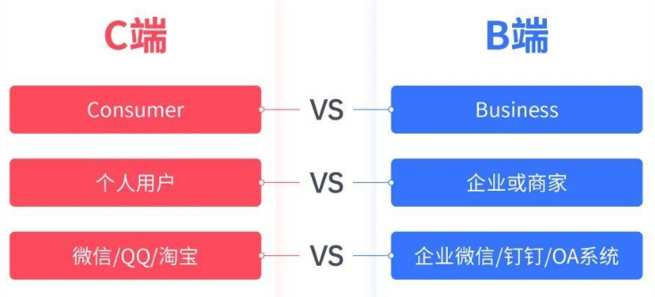
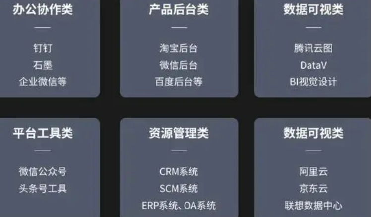
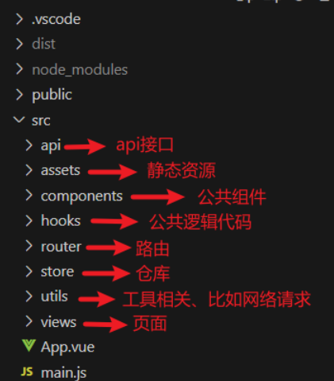
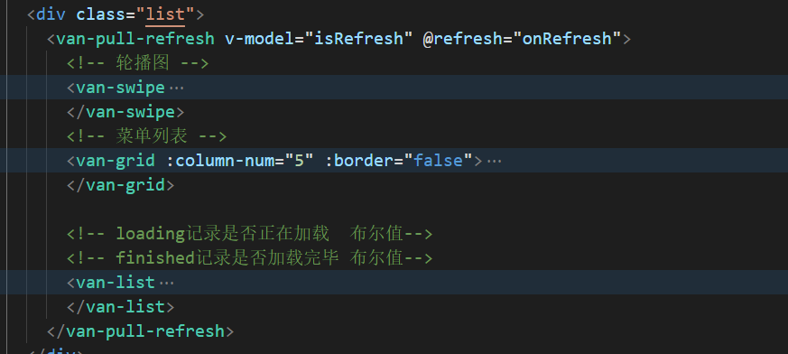
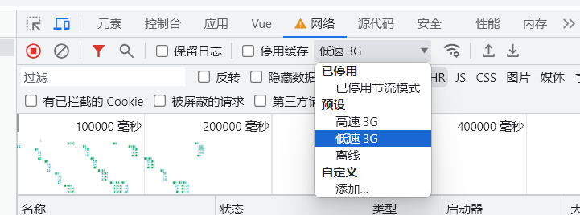

# 移动端项目第一章节

## 0、 b端和c端


xx后台管理系统，一般都是PC端，给公司的管理人员用的，或者公司员工（B端）。

京东，淘宝是给买家看的。移动端、PC端都是给客户看的（C端）。



```
C端
“C端”是互联网术语，指的是消费者或个人用户端，主要涉及个人用户，强调用户的使用体验，通常以单个个体使用为主，核心功能是满足用户的基本需求，其他功能多为附加的，旨在为“碎片化的时间”服务，特点是数据量大，因为用户群体庞大，数据增长通常是指数级的

C端产品，C是Consumer的缩写，主要针对的是个人消费者，比如微信、QQ、抖音、淘宝、微博、爱奇艺视频等，更多的是希望引导用户在页面上多停留、消费。

C端产品，解决的是用户在生活场景中的需求痛点；
B端产品服务于组织，组织的需求不是从单个用户需求点出发，而是一种生产关系的连接和延伸。


C端产品的本质基本都是一个核心功能，例如：音乐类的核心功能就是听音乐；阅读类的核心功能就是阅读；游戏类的核心功能就是游戏。

B释义为：Business；通常为企业或商家为工作或商业目的而使用的系统型软件、工具或平台。例如：网易云、网易有数或企业内部的ERP系统等等。

C端&B端产品的本质及特性：

C端产品的特性可以总结为一个词——“分享”例如“评论”、“打赏”其实都基于“分享”，即让他人听见“我”的声音，看见“我”的想法。

B端产品的本质则是满足用户的工作需要，而工作需要从来不是单一的功能就可以满足的，其必然包括多项功能的复合及嵌套应用支持。

B端产品的特性也非常明确——即“协同工作”。在处于信息时代的现代公司或企业中，几乎已没有可以单独完成而不需要协同合作的工作。


B端，主要指针对于商业机构和公司用户的产品，多数都是系统级的管理产品，比如钉钉、OA系统、企业微信等，这类产品希望尽可能的高效、减少投入，帮公司去获得更好的业务体验

随着企业数字化时代的到来，B端产品正渗透到各场景工作中，常见的B端产品有：

办公协作类：如钉钉、石墨、企业微信等；

产品后台类：淘宝后台、微信后台、百度后台等；

平台工具类：微信公众平台、头条号工具等；

资源管理类：CRM系统、SCM系统、ERP系统、OA系统等；

数据可视类：腾讯云图、阿里云、京东云等；
```




b端也叫后台管理系统，面向：运营人员，或者后台管理员，如商城类管理系统，会包含商品管理、用户管理、订单管理、库存管理等信息。商家买这个系统，用来添加商品，管理商品信息。给商家管理用的。可以是人事管理系统，物业管理系统、生产管理系统，销售管理系统，oa办公系统，ERP企业管理系统等。

特点：需要登录才能看，不是面向所有人。

公司有专门的销售人员卖系统，而你作为开发人员，不断的添加新功能。当有客户需要特殊功能的时候，可以做定制化。（加需求，得加钱！）

### 前端端技术栈（c端）

技术栈：Vue3(Options api)  + Vue Router4.x+Vant+ pinia

插件：axios、lodash、sass

```bash
pnpm i axios sass lodash
```

### 后端技术栈

nodejs 、express、mongoDB、jwt、restfulAPI

公司的后端多样化，java，php，c#，python，go，c++


项目开发流程 --需求分析-需求文档（产品经理）  

项目经理 

​	------- UI设计人员-》根据需求分析-设置出原型图（https://modao.cc/community?page=1&category=project_basic&jsid=SEM-BAIDU-CJPZ-GW&policy=everyone）

​    -------根据原型图-出设计稿（精细）

​    ------开发

​		   ---前端--静态页面 ---（）mock模拟数据

  		 ---后端---数据库设计--写restful api 接口  

​					如果提前给接口规范文档，前端也可以mock接口数据（模拟）


接口有问题--项目基本完成----搞前后端联调

测试 人员 测试 -》 bug   -》 测试 bug  -》测试     


内侧-》上传测试服务器-

上线-》前端打包以后的html和js-css-图片 上传 公司的服务器 （ftp工具）

## 1、项目介绍

xx商城 是一个仿某东的移动端购物网站

https://www.mihoyogift.com/m/


### 1.1、项目所用技术栈

- vue@3
- vue-router@4
- pinia
- pinia-plugin-persistedstate
- axios
- vant
- normalize.css
- sass
- less
- eslint

### 1.2、项目所涉及技术点

- axios（axios 配置、api 封装）
- 复杂数据的列表渲染（分类页面）
- 复杂路由的使用（嵌套路由、权限控制）
- 仓库的使用（token 存储、购物车数据）
- vant 主题修改
- ...

## 2、项目创建

### 2.1、使用 `vite` 创建项目

TIP

[参考地址](https://cn.vitejs.dev/guide/#scaffolding-your-first-vite-project)

1、使用 `vite` 创建项目

```js
pnpm create vue
```

选择使用 ts，vue-router，pinia，其他可选


2、安装依赖包

```js
cd 进入项目
pnpm i
```


3、运行项目

```js
pnpm dev
```


DANGER

运行项目和安装包都要在项目根目录！！！


创建项目的时候：

1-勾选  vue-router-  eslint--prettier  

2-vscode 安装了 eslint插件和prettier  插件

3-vscode配置  js文件和vue文件的默认格式化程序--，右键 ，使用。。格式化--配置默认格式化程序-选prettier

4-配置vscode自动保存-设置搜save-勾选

5-配置vscode -保存时候自动格式化-设置搜 format on save


### 2.2、生成的项目分析

```
main.js

import { createApp } from 'vue'
import App from './App.vue'

// 导入根组件，渲染根组件到 id=app 的div中去
const app = createApp(App)
app.mount('#app')
```

项目的入口文件


```
App.vue

import { createApp } from 'vue'
import App from './App.vue'

// 导入根组件，渲染根组件到 id=app 的div中去
const app = createApp(App)
app.mount('#app')
```

项目的根组件，也是项目一启动看到的第一个页面

### 引入組件报错（js项目不需要配置）

给项目根目录下的env.d.ts

添加如下代码，解决 引入vue文件报错问题

```
/// <reference types="vite/client" />

// 通过声明文件
// 告诉ts，所有的vue文件的他的类型 是一个 vue组件
declare module '*.vue' {
  import type { DefineComponent } from 'vue'
  const vueComponent: DefineComponent<{}, {}, any>
  export default vueComponent
}

```


### 2.3、 项目目录结构调整



## 3、vant 集成与移动端适配

### 3.1、vant 集成

1、安装 [vant](https://vant-contrib.gitee.io/vant/#/zh-CN/quickstart)

参加vant官网-https://vant.pro/vant/#/zh-CN 

```
pnpm i vant
```


2、常规用法

```
main.js

mport { createApp } from 'vue'
// 1. 引入你需要的组件
import { Button } from 'vant'
// 2. 引入组件样式
import 'vant/lib/index.css'

const app = createApp()
// 3. 注册你需要的组件
app.use(Button)
app.mount('#app')

```

js

```
随便某个组件.vue

<van-button type="primary">主要按钮</van-button>

```

vue

WARNING

正式项目中，组件的样式一般都是按需导入，而不是全部导入，上述我们全部导入了 `vant` 的样式，下面我们来按需引入组件样式

#### 按需引入组件

这块可以参考 vant 的 [官方文档](https://vant-contrib.gitee.io/vant/#/zh-CN/quickstart#fang-fa-er.-an-xu-yin-ru-zu-jian-yang-shi)，写得很详细


**组件可以按需引入，但是样式只能在 全部引入**

```
// 2. 引入组件样式
import 'vant/lib/index.css'
```


安装插件

```
pnpm add @vant/auto-import-resolver unplugin-vue-components unplugin-auto-import -D
```


如果是基于 Vite 的项目，在 vite.config.js 文件中配置插件：

```
import { fileURLToPath, URL } from 'node:url'

import AutoImport from 'unplugin-auto-import/vite'
import Components from 'unplugin-vue-components/vite'
import { VantResolver } from '@vant/auto-import-resolver'

import { defineConfig } from 'vite'
import vue from '@vitejs/plugin-vue'
import VueDevTools from 'vite-plugin-vue-devtools'

// https://vitejs.dev/config/
export default defineConfig({
  plugins: [
    vue(),
    VueDevTools(),
    AutoImport({
      resolvers: [VantResolver()]
    }),
    Components({
      resolvers: [VantResolver()]
    })
  ],
  resolve: {
    alias: {
      '@': fileURLToPath(new URL('./src', import.meta.url))
    }
  }
})

```

完成以上两步，就可以直接在模板中使用 Vant 组件了，`unplugin-vue-components` 会解析模板并自动注册对应的组件, `@vant/auto-import-resolver` 会自动引入对应的组件样式。

```html
<template>
  <van-button type="primary" />
</template>
```


### 3.2、移动端适配


Vant 默认使用 `px` 作为样式单位，如果需要使用 `viewport` 单位 (vw, vh, vmin, vmax)，推荐使用 [postcss-px-to-viewport](https://github.com/evrone/postcss-px-to-viewport) 进行转换。

#### vh-vw布局

[postcss-px-to-viewport](https://github.com/evrone/postcss-px-to-viewport) 是一款 PostCSS 插件，用于自动将 px 单位转化为 vw/vh 单位


1、安装包

```
pnpm i postcss-px-to-viewport -D

```


2、项目**根目录**下创建`postcss.config.cjs`，并且写上以下内容

项目需要创建cjs文件,postcss.config.cjs

```
// postcss.config.cjs

module.exports = {
  plugins: {
    'postcss-px-to-viewport': {
      viewportWidth: 375
    }
  }
}


```


3、**新增或更改了项目配置文件**，一定要重新运行项目

```
npm run dev

```

插件只识别处理，样式css文件，或者style标签的样式

**行内样式不会被插件处理，不会自动识别转为vh ，vw**


#### rem布局

如果使用rem布局，参见文档

https://vant-contrib.gitee.io/vant/#/zh-CN/advanced-usage#rem-bu-ju-gua-pei


## 4、全局样式设置

### 4.1、normalize.css

TIP

[normalize.css](https://www.npmjs.com/package/normalize.css) 是一个设置项目基础样式的第三方库，用于把网页的一些 margin、paddding 等样式设置为 0

使用步骤：

1、安装

```
pnpm install --save normalize.css
```


2、使用，在入口文件 `main.js` 中引入即可

```
import Vue from 'vue'
import App from './App.vue'

// 引入 normalize.css
import 'normalize.css'

```


### 4.2、全局样式

TIP

项目的全局样式是 normalize.css 没有设置的一些属性，我们需要自己写全局样式来设置，比如全局的高度等样式

使用步骤：

1、编写全局样式文件  这里是scss文件，**需要下载scss插件，使用pnpm i sass下载**

```js
src/assets/style/global.scss

// 全局样式
html,
body,
#app {
  height: 100%;
  box-sizing: border-box;
  background-color: #f3f3f3;
}
```


2、在入口文件 `main.js` 中使用

···

```js
import Vue from 'vue'
import App from './App.vue'

// 引入 normalize.css
import 'normalize.css'
// 引入 全局样式
import '@/assets/styles/global.scss'
```

记得要安装sass

```js
pnpm i sass -D
```


WARNING

自定义的全局样式文件，一定要在所有样式文件的后面，这样才能覆盖掉其它样式，以我们自己写的为准


### 4.3 、禁止	用户缩放页面

移动端一般设置禁止用户缩放页面

在HTML中，可以通过meta标签来控制页面的缩放行为。具体来说，可以使用viewport属性来设置用户是否可以缩放页面。如果你想禁止用户缩放你的页面，可以设置user-scalable=0，同时设置maximum-scale=1.0和minimum-scale=1.0以确保页面不会缩小到比初始大小还小。

```js
<meta name="viewport"
    content="width=device-width, initial-scale=1.0, maximum-scale=1.0, minimum-scale=1.0, user-scalable=0">
```


## 5、路由基本配置

5.1、创建项目所需页面

| 一级路由 | 二级路由（子页面） | 路径                    | 是否需要权限才能访问 |
| :------- | :----------------- | :---------------------- | :------------------- |
| 登录     |                    | /src/views/Login.vue    | 否                   |
| Layout   |                    | /src/views/Layout.vue   | 部分子页面需要       |
|          | 首页               | /src/views/Home.vue     | 否                   |
|          | 分类               | /src/views/Category.vue | 否                   |
|          | 购物车             | /src/views/Cart.vue     | 是                   |
|          | 我的               | /src/views/My.vue       | 是                   |
| 商品详情 |                    | /src/views/Detail.vue   | 否                   |

5.2、配置路由规则

```
src/router/index.js


import { createRouter, createWebHashHistory } from "vue-router";
import Layout from "@/views/Layout.vue";
import Login from "@/views/Login.vue";
import Reg from "@/views/Reg.vue";

const routes = [
  {
    path: "/",
    name: "layout",
    component: Layout,
  },
  {
    path: "/login",
    name: "login",
    component: Login,
  },
  {
    path: "/reg",
    name: "reg",
    component: Reg,
  },
];

const router = createRouter({
  history: createWebHashHistory(),
  routes,
});

export default router;


```

js

## 6、登录

### 6.1、登录页面渲染

```
src/views/Login.vue

<template>
  <div>
    <van-nav-bar title="登录" left-arrow />
    <van-form class="my-form"  @submit="onSubmit">
      <van-field
        v-model="loginForm.loginname"
        name="用户名"
        label="手机号"
        placeholder="用户名"
        :rules="[
          { required: true, message: '请输入手机号' },
          { pattern: /^1[3-9]\d{9}$/, message: '手机号不合法' },
        ]"
      />
      <van-field
        v-model="loginForm.password"
        type="password"
        name="密码"
        label="密码"
        placeholder="密码"
        :rules="[
          { required: true, message: '请填写密码' },
          { pattern: /\S{6,}$/, message: '密码至少6位' },
        ]"
      />
      <div style="margin: 16px">
        <van-button round block type="primary" native-type="submit"
          >登录</van-button
        >
      </div>
    </van-form>
  </div>
</template>

<script setup lang="ts">
import { reactive } from "vue";
const loginForm = reactive({
  loginname: "17797752155",
  password: "123456",
});
</script>


```


### 6.2、登录按钮-路由跳转

TIP

登录成功之后，跳转到首页，点击左上角返回，返回到上一个页面

```
// 提交
const onSubmit = async () => {
    router.push("/");
};

// 返回
const onClickLeft = () => {
  router.back();
};
```


### 注册类似

```
<template>
  <div>
    <van-nav-bar title="注册" left-arrow />
    <van-form class="my-form" @submit="onSubmit">
      <van-field
        v-model="loginForm.loginname"
        name="用户名"
        label="手机号"
        placeholder="用户名"
        :rules="[
          { required: true, message: '请输入手机号' },
          { pattern: /^1[3-9]\d{9}$/, message: '手机号不合法' },
        ]"
      />
      <van-field
        v-model="loginForm.password"
        type="password"
        name="密码"
        label="密码"
        placeholder="密码"
        :rules="[
          { required: true, message: '请填写密码' },
          { pattern: /\S{6,}$/, message: '密码至少6位' },
        ]"
      />
      <div style="margin: 16px">
        <van-button round block type="primary" native-type="submit"
          >注册</van-button
        >
      </div>
    </van-form>
  </div>
</template>

<script setup lang="ts">
import { reactive } from "vue";
import { useRouter } from "vue-router";
import { showSuccessToast, showFailToast } from "vant";
let router = useRouter();

const loginForm = reactive({
  loginname: "17797752155",
  password: "123456",
});

// 提交

const onSubmit = async () => {
  console.log("注册");

  router.push("/login");
};

// 返回
const onClickLeft = () => {
  router.back();
};
</script>

```


## 7、Axios

### 7.1、API 接口文档

TIP

登录账号：

| tel         | password | username |
| :---------- | :------- | :------- |
| 17797752155 | 123456   | zhangsan |
| 13811112222 | 123456   | lisi     |
| 13911111111 | 123456   | wangwu   |

http://localhost.top:3001/apidoc/

### 7.2、Axios 基本设置

请求直接写到组件内部，不利于代码维护

#### 安装包

```
pnpm i axios
```


#### 二次封装axios

src/utils/request.js  

```


import axios from "axios";

const instance = axios.create({
  //
  baseURL: "http://localhost:3001/api",
});


export default instance;

```

js

### 7.3、API 接口封装

```
src/api/user.js

import request from '@/utils/request'

// 封装登录api接口
export const login = data => {
  // 返回示例创建的Promise对象
  return request({
    url: 'user/login',
    method: 'POST',
    data
  })
}

```

js

#### 请求拦截器 .

读取token 存入token

```

// 拦截器
// 添加请求拦截器
instance.interceptors.request.use(
  function (config) {
    // 在发送请求之前做些什么
    let token = localStorage.getItem("token");
    if (token) {
      config.headers.token = token;
    }
    return config;
  },
  function (error) {
    // 对请求错误做些什么
    return Promise.reject(error);
  }
);
```

#### 响应拦截器

中处理toke 无效

**注意，这里的响应拦截器中，  return  了response.data** 

默认代码中return 的是  response，**想想为什么要这样修改**

```
// 添加响应拦截器
instance.interceptors.response.use(
  function (response) {
    // 2xx 范围内的状态码都会触发该函数。
    // 对响应数据做点什么
    if (response.data.code == 10119) {
      localStorage.removeItem("token");
      router.replace("/login");
    }
    return response.data;
    // return response;
  },
  function (error) {
    // 超出 2xx 范围的状态码都会触发该函数。
    // 对响应错误做点什么
    return Promise.reject(error);
  }
);

```


## 8、Pinia

### 8.1、仓库初始化

TIP

`Vue3` 中状态管理工具，我们一般选择 `pinia`，但是 Vue3中也是可以用 `Vuex` 的

1、安装依赖包

```
pnpm i pinia -S
```


2、创建 pinia

```
src/store/index.js

import { createPinia } from 'pinia'

const pinia = createPinia()

export default pinia

```

js

3、入口文件中集成

```
src/main.js


import { createApp } from 'vue'
import App from './App.vue'
import pinia from '@/store'

const app = createApp(App)
app.use(pinia)
app.mount('#app')
```

js

### 8.2、user 模块

1、定义 user 仓库，并且写好里面的内容

```
src/store/modules/user.js

import { defineStore } from "pinia";
import { ref } from "vue";

interface UserInfo {
  username: string;
  token: string;
}

export const useUserStore = defineStore("user", () => {
  // 用户信息
  const userInfo = ref<UserInfo>({ username: "", token: "" });

  const setUserInfo = (value: UserInfo) => {
    userInfo.value = value;
    // userInfo
  };

  // 获取token
  const getToken = () => {
    return userInfo.value.token;
  };

  return {
    userInfo,
    setUserInfo,
    getToken,
  };
});

```

2-哪个地方使用 ，引入user.ts 文件就行

```
import { useUserStore } from "@/store/modules/user";
let  userStore = useUserStore()
userStore.userInfo
userStore.setUserInfo
```


### 8.3、pinia 本地存储

TIP

**由于 pinia 是内存存储，一刷新浏览器仓库中的值就没有了**，有时候我们需要即使刷新浏览器，仓库中的值还在，方便后续使用，这个时候我们就需要把仓库中的值持久化的存储起来，我们可以使用 [pinia-plugin-persistedstate](https://www.npmjs.com/package/pinia-plugin-persistedstate) 去实现

1、安装依赖包

bash

```
pnpm i pinia-plugin-persistedstate -S

```


2、在创建 pinia 时，编写持久化相关代码

```
src/store/index.js


import { createPinia } from 'pinia'
import piniaPluginPersistedstate from 'pinia-plugin-persistedstate'

const pinia = createPinia()
pinia.use(piniaPluginPersistedstate)

export default pinia
```

js

3、在定义仓库时，在第三个参数上设置持久化

```
src/store/modules/user.js


import { defineStore } from 'pinia'

export const useUserStore = defineStore(
  'user',
  () => {
    // ...
  },
   {persist: true}
)

```

js


## 9、Layout页面

App.vue

定义一级router-view出口

```
<script setup lang="ts">

</script>

<template>
  <router-view></router-view>
</template>

```

Layout.vue

定义二级router-view出口

```
<template>
  layout

  <router-view></router-view>
</template>

<script setup lang="ts"></script>

<style></style>

```


### 9.1、嵌套路由规则配置

/  对应 layout组件

/的children 配置 嵌套的 /home  /my  /cart /cate

分别创建对应的Home.vue My.vue Cart.vue Cate.vue 等页面组件


```
import { createRouter, createWebHashHistory } from "vue-router";
import Layout from "@/views/Layout.vue";
import Login from "@/views/Login.vue";
import Reg from "@/views/Reg.vue";

const routes = [
  {
    path: "/",
    name: "layout",
    component: Layout,
    redirect: "/home",
    children: [
      {
        path: "/home",
        name: "home",
        component: () => import("@/views/Home.vue"),
      },
      {
        path: "/my",
        name: "my",
        component: () => import("@/views/My.vue"),
      },
      {
        path: "/cart",
        name: "cart",
        component: () => import("@/views/Cart.vue"),
      },
      {
        path: "/cate",
        name: "cate",
        component: () => import("@/views/Cate.vue"),
      },
    ],
  },
  {
    path: "/login",
    name: "login",
    component: Login,
  },
  {
    path: "/reg",
    name: "reg",
    component: Reg,
  },
];

const router = createRouter({
  history: createWebHashHistory(),
  routes,
});

export default router;

```


### 9.2、TabBar 与路由

```
src/views/Layout.vue

<template>

  <div class="app">
    <!-- 嵌套路由出口--内容区 -->
    <div class="con">
      <router-view></router-view>
    </div>
    <!-- 底部导航区域 -->
    <van-tabbar
      active-color="#c82519"
      inactive-color="#333"
      route
      :fixed="false"
    >
      <van-tabbar-item icon="wap-home-o" to="/home">首页</van-tabbar-item>
      <van-tabbar-item icon="apps-o" to="/cate">分类</van-tabbar-item>
      <van-tabbar-item icon="cart-o" to="/cart">购物车</van-tabbar-item>
      <van-tabbar-item icon="manager-o" to="/my">我的</van-tabbar-item>
    </van-tabbar>
  </div>
</template>
```


这里取消了 van-tabbar的fixed属性，我们自己控制他的位置

如果使用sass记得安装 sass  pnpm i sass

样式

```
.app {
  height: 100vh;
  display: flex;
  flex-direction: column;
}
.con {
  overflow: auto;
  flex: 1;
}
```

整个.app容器高度 100vh，撑满整个视口，内部采用flex布局

里面存放，con和tabbar ，tabber的高度是固定的45px

con区域的高度，使用flex：1  撑满除了tabber之外的区域，

后续con中内容较多，可能滚动，这里这是overflow：auto


## 10、首页

### 10.1、首页搜索栏静态页面

使用van-search 组件，放入一个home页面容器，

```

  <div class="home">
    <!-- 搜索框 -->
    <van-search
      shape="round"
      background="#c82519"
      placeholder="请输入搜索关键词"
    />
    <div class="list"></list>
 </div>  
```

给home设置 高度100%,撑满整个父容器，刚好留出tabbar的位置，

home里面的内容，采用flex布局，列排布,

里面的searchbar高度是固定的

里面的list容器高度撑开剩余内容，flex设置为1

后面list的内容过多的话，设置list内部可以滚动overflow: auto;


```
.home {
  // 高度100% 撑满整个父容器
  height: 100%;
  display: flex;
  flex-direction: column;
   // 列表（包含-轮播图-分类菜单-商品列表）--撑开剩余内容，内部自动滚动
  .list {
    flex: 1;
    overflow: auto;
  }
}

```


### 10.2、首页轮播图静态页面

使用van-swipe 组件 ，放入list容器中

```
<div class="home">
    <!-- 搜索框 -->
    <van-search
      shape="round"
      background="#c82519"
      placeholder="请输入搜索关键词"
    />
    <div class="list">
      <!-- 轮播图 -->
      <van-swipe
        style="height: 200px; width: 100%"
        :autoplay="3000"
        indicator-color="red"
        lazy-render
      >
        <van-swipe-item>
          <van-image
            width="100%"
            height="100%"
            src="https://fastly.jsdelivr.net/npm/@vant/assets/cat.jpeg"
          />
        </van-swipe-item>
        <van-swipe-item>
          <van-image
            width="100%"
            height="100%"
            src="https://fastly.jsdelivr.net/npm/@vant/assets/cat.jpeg"
          />
        </van-swipe-item>
      </van-swipe>

    </div>
</div> 
   

```


轮播组件使用lazy-render 可以开启懒加载模式

一会list容器中还会放入  一个菜单，和一个商品列表 内容， 


### 10.3   、首页-目录菜单静态页面

使用van-grid组件 ，放入list容器中，

```
 <div class="home">
    <!-- 搜索框 -->
    <van-search
      shape="round"
      background="#c82519"
      placeholder="请输入搜索关键词"
    />
    <div class="list">
      <!-- 轮播图 -->
      <van-swipe
        style="height: 200px; width: 100%"
        :autoplay="3000"
        indicator-color="red"
      >
        <van-swipe-item>
          <van-image
            width="100%"
            height="100%"
            src="https://fastly.jsdelivr.net/npm/@vant/assets/cat.jpeg"
          />
        </van-swipe-item>
        <van-swipe-item>
          <van-image
            width="100%"
            height="100%"
            src="https://fastly.jsdelivr.net/npm/@vant/assets/cat.jpeg"
          />
        </van-swipe-item>
      </van-swipe>
      <!-- 菜单列表 -->
      <van-grid :column-num="5" :border="false">
        <van-grid-item
          v-for="item in menuList"
          :key="item.id"
          :icon="item.icon"
          :text="item.title"
        />
      </van-grid>
    </div>
  </div>
```

### 10.4  首页-商品列表静态页面

使用van-grid组件 ，放入list容器中,循环出一些 girditem出来，看下效果

```
  <div class="home">
    <!-- 搜索框 -->
    <van-search
      shape="round"
      background="#c82519"
      placeholder="请输入搜索关键词"
    />
    <div class="list">
      <!-- 轮播图 -->
      <van-swipe
        style="height: 200px; width: 100%"
        :autoplay="3000"
        indicator-color="red"
      >
        <van-swipe-item>
          <van-image
            width="100%"
            height="100%"
            src="https://fastly.jsdelivr.net/npm/@vant/assets/cat.jpeg"
          />
        </van-swipe-item>
        <van-swipe-item>
          <van-image
            width="100%"
            height="100%"
            src="https://fastly.jsdelivr.net/npm/@vant/assets/cat.jpeg"
          />
        </van-swipe-item>
      </van-swipe>
      <!-- 菜单列表 -->
      <van-grid :column-num="5" :border="false">
        <van-grid-item
          v-for="index in 10"
          :key="index"
          icon="photo-o"
          :text="index"
        />
      </van-grid>
      <!-- 商品列表 -->
      <van-grid :column-num="2">
        <van-grid-item
          v-for="index in 10"
          :key="index"
          icon="photo-o"
          :text="index"
        />
      </van-grid>
    </div>
  </div>
```


### --首页静态内容搭建完毕---


### 10.5 、轮播图api接口编写

src/api/home.js

```
import request from "@/utils/request";

// 获取首页轮播图数据
export const getBannerList = () => {
  return request({
    url: "/banner/list",
  });
};

```

js

### 10.6、轮播图接口调用和渲染列表

#### 接口调用

```
import { ref, reactive } from "vue";
import { getBannerList, getMenuList, getGoodsList } from "@/api/home";


const bannerList = ref([]);
// 获取轮播图列表数据
const getBannerListData = async () => {
  const res = await getBannerList();
  bannerList.value = res.data;
};
getBannerListData();
```

#### 列表渲染

```
      <van-swipe
        style="height: 200px; width: 100%"
        :autoplay="3000"
        indicator-color="red"
        lazy-render
      >
        <van-swipe-item
          v-for="(item, index) in bannerList"
          :key="item.bannerid"
        >
          <van-image width="100%" height="100%" :src="item.img" />
        </van-swipe-item>
      </van-swipe>
```


模版中会报错，不影响代码执行，主要是因为，没有识别出数组中元素的类型

#### 类型体操-ref的泛型写法

上面的代码，会报一些错误，编写类型可以解决报错问题

```
import { ref, reactive } from "vue";
import { getBannerList, getMenuList, getGoodsList } from "@/api/home";

//编写轮播数组中元素类型接口
interface IBannerItem {
  img: string;
  bannerid: string;
}
// 定义轮播数据的数组
// 如果后续需要得到类型，提示，我们需要给ref通过泛型给ref的value的类型
// ref<指定value的类型>(value)
// ref<Array>([])  表示value的类型是数组，
// 数组的元素的类型也得指定 也是通过泛型
// ref<Array<IBannerItem>>([])
const bannerList = ref<Array<IBannerItem>>([]);
// 或者这样也可以
//const bannerList = ref<IBannerItem[]>([]);

// 获取轮播图列表数据
const getBannerListData = async () => {
  const res = await getBannerList();
  bannerList.value = res.data;
};
getBannerListData();
```


这样不停的写类型，也叫**类型体操**，写完以后再使用bannerList就会得提示，想要得到很好的提示，体操少不了！！！

如果不写类型体操-代码中可能会报一些红色的，错误，不管也行，不影响代码执行。

#### anyscript

不想写类型体操，可以用any代替

```
// 定义轮播数据的数组
const bannerList = ref<Array<any>>([]);
```

有些人写的ts   也叫anyscript


### 10.7、首页菜单渲染

#### 菜单api接口

src/api/home.js

```


import request from '@/utils/request'

// 获取首页分类菜单数据
export const getMenuList = () => {
  return request({
    url: 'menu/list'
  })
}
```

#### 菜单接口调用

```
const menuList = ref([]);
// 获取菜单列表数据
const getMenuListData = async () => {
  const res = await getMenuList();
  menuList.value = res.data;
};
getMenuListData();
```


#### 菜单渲染

```
    <!-- 菜单列表 -->
const menuList = ref([]);
// 获取菜单列表数据
const getMenuListData = async () => {
  const res = await getMenuList();
  menuList.value = res.data;
};
getMenuListData();
```

vue

### 

### 10.8、商品列表 渲染

src/api/home.js

```

// 分页获取商品列表数据
export const getGoodsList = ({ count = 1, limitNum = 10 }) => {
  return request({
    url: 'pro/list',
    params: {
      count,
      limitNum
    }
  })
}
```


#### 获取第一页数据并渲染

js

```

// *****商品列表功能
// 保存商品列表
const goodsList = ref<Array<any>>([]);
// 保存分页数据
const goodsQueryObj = reactive({ count: 1, limitNum: 10 });
// 获取商品列表
const getGoodsListData = async () => {
  goodsQueryObj.count++;
  const res = await getGoodsList(goodsQueryObj);
  goodsList.value = [...res.data];
};
getGoodsListData();
```


模版

```
      <!-- 商品列表 -->
      <van-grid :column-num="2" :gutter="5" class="plist">
        <van-grid-item
          v-for="(item, index) in goodsList"
          :key="item.proid"
          @click="$router.push(`/detail?proid=${item.proid}`)"
        >
          <van-image :src="item.img1" />
          <div class="pname">{{ item.proname }}</div>
          <div class="price">{{ item.originprice }}</div>
        </van-grid-item>
      </van-grid>
```

css 内容自定义（当然这里我们也可以全部使用div，然后使用flex布局，自己控制样式比较灵活）

```

.home {
  // 高度100% 撑满整个父容器
  height: 100%;
  display: flex;
  flex-direction: column;
  // 列表（包含-轮播图-分类菜单-商品列表）--撑开剩余内容，内部自动滚动
  .list {
    flex: 1;
    overflow-y: scroll;
    overflow-x: hidden;
    .plist {
      .van-grid-item {
        width: 174px;
        height: 254px;
        .van-image {
          width: 174px;
          height: 174px;
        }

        .pname {
          width: 174px;
          height: 20px;
          line-height: 20px;

          text-align: center;
          color: #c3c3c3;
          white-space: nowrap; /* 确保文本在一行内显示 */
          overflow: hidden; /* 隐藏溢出的内容 */
          text-overflow: ellipsis; /* 使用省略号表示文本溢出 */
        }

        .price {
          width: 174px;
          height: 20px;
          line-height: 20px;
          color: red;
        }
      }
    }
  }
}
//修改组件内部样式
:deep .plist .van-grid-item__content {
  padding-top: 0px;
}
```


### 10.9、上拉加载更多

```
List 组件通过 loading 和 finished 两个变量控制加载状态，当组件滚动到底部时，会触发 load 事件并将 loading 设置成 true。此时可以发起异步操作并更新数据，数据更新完毕后，将 loading 设置成 false 即可。若数据已全部加载完毕，则直接将 finished 设置成 true 即可。
```


TIP

上拉加载更多，可以使用`vant`提供的 [List](https://vant-contrib.gitee.io/vant/#/zh-CN/list) 组件

这个组件需要提供，几个数据，

v-model:loading="loadingMore"  绑定一个布尔值，组件内部用来记录，是否正在加载更多

 :finished="lodeingMorefinished"  组件用来记录是否加载完毕 布尔值

 @load="getGoodsListData"   监听一个load事件，组件内需要加载更多的时候，就会调用这个函数，我们在这个函数中发起请求，把列表数据，添加到 数组中，让列表渲染

```

```


 finished-text="没有更多了"  没有更多数据以后，列表底部显示的内容

```
   <!-- loadingMore记录是否正在加载  布尔值-->
      <!-- lodeingMorefinished记录是否加载完毕 布尔值-->
      <van-list
        v-model:loading="loadingMore"
        :finished="lodeingMorefinished"
        finished-text="没有更多了"
        @load="getGoodsListData"
      >
        <!-- 商品列表 -->
        <van-grid :column-num="2" :gutter="5" class="plist">
          <van-grid-item
            v-for="(item, index) in goodsList"
            :key="item.proid"
            @click="$router.push(`/detail?proid=${item.proid}`)"
          >
            <van-image :src="item.img1" />
            <div class="pname">{{ item.proname }}</div>
            <div class="price">{{ item.originprice }}</div>
          </van-grid-item>
        </van-grid>
      </van-list>
    </div>
```

js

```

// *****商品列表功能
// 保存商品列表
const goodsList = ref<Array<any>>([]);
// 保存分页数据
const goodsQueryObj = reactive({ count: 1, limitNum: 10 });

//  -------0-------上拉加载更多组件需要的两个变量
// 是否还有更多数据
const lodeingMorefinished = ref(false);
// 是否正在加载更多
const loadingMore = ref(false);

// 获取商品列表
const getGoodsListData = async () => {
  goodsQueryObj.count++;
  const res = await getGoodsList(goodsQueryObj);
  // goodsList.value = [...res.data];
  // ------1---加载更多的时候，需要把服务器每次返回的数据都添加到数组中，不是直接覆盖
  goodsList.value = [...goodsList.value, ...res.data];

  // ------2---加载更多的时候,判断服务器如果返回的数据小于，我们请求的数据长度说明，没有数据了
  if (res.data.length < goodsQueryObj.limitNum) {
    // 没有数据啦---将加载完毕置为false
    lodeingMorefinished.value = true;
  }
  // ------3---加载更多的时候每次加载数据，完毕 ---一定要把这个属性设置为false，否则滚动到下面就不会加载了
  loadingMore.value = false;
};
//------4---加载更多的时候 加载更多组件 开启会默认触发一次 获取列表数据--我们自己调用的可以注释了
// getGoodsListData();
```

注意看上面的代码的4个步骤就行，结合文档理解使用


WARNING

- van-list加载数据完毕之后，要记得把`loadingMore`属性设置为`false`，否则后续加载会有问题
- `@load` 第一次也会加载，所以无需在生命周期钩子中再调用了发送请求的方法了

### 10.10、下拉刷新

TIP

下拉刷新更多，可以使用`vant`提供的 [PullRefresh](https://vant-contrib.gitee.io/vant/#/zh-CN/pull-refresh) 组件

```
下拉刷新时会触发 refresh 事件，在事件的回调函数中可以进行同步或异步操作，操作完成后将 v-model 设置为 false，表示加载完成。
```


模板修改

```

    <van-pull-refresh v-model="isRefresh" @refresh="onRefresh">
    
    </van-pull-refresh> 

```

v-model="isRefresh" 是组件内部来记录是否正在刷新的，初始值false，用户触发了下拉刷新操作，组件内部会把此属性，改变true，并且调用 @refresh="onRefresh" 这个事件，这个事件处理函数需要我们自己处理，刷新请求的逻辑


使用van-pull-refresh组件 把  list中 结构 全部套进 van-pull-refresh组件中




js

```
// ---------下拉刷新相关
// 下拉刷新标记 -1
let isRefresh = ref(false);
// 用户下拉刷新动作要执行的函数 -2
const onRefresh = async () => {
  //下拉刷新开始-3---清空数组内容，一会请求最新数据
  goodsList.value = [];
  //下拉刷新开始-4 重置页码
  goodsQueryObj.count = 0;
  // 下拉刷新开始-5--调用接口请求最新数据-把最新数据，装入数组中
  const res = await getGoodsList(goodsQueryObj);
  goodsList.value = [...res.data];
  // async 函数内部，执行成功以后，返回默认会返回一个promise对象，，所以利用这个promise，可以知道什么时候加载函数执行完了

  // 下拉刷新完成------6  加载请求函数，处理完毕，把加载更多状态变为false-结束下拉刷新
  isRefresh.value = false;
};

```


完成以后，可以使用chrome 低速网络模式测试一下效果




### 10.11、Scoped CSS

TIP

当我们需要在自己的 scoped 样式中，去更改第三方样式的时候，这个时候就需要用到`vue-loader`中的 [深度作用选择器](https://vue-loader.vuejs.org/zh/guide/scoped-css.html#深度作用选择器)

WARNING

- vue2 开发中，如果要使用深度作用选择器，可以使用 `>>>`或`/deep/` 或 `::v-deep`
- vue2 开发中，如果是用了 `sass` 预处理器，则无法使用`>>>`或`/deep/`
- vue3 中，[深度作用选择器](https://blog.csdn.net/m0_51431448/article/details/123003864) 写法是`:deep(你要改的第三方的样式)`
-  Vue 3引入了::v-deep选择器作为替代/deep/选择器的方法。 （:deep 也可以）


修改最底部加载更多的div的样式

```
// Vue 3引入了::v-deep选择器作为替代/deep/选择器的方法。
// 深度作用选择器
::v-deep .van-list__finished-text {
  width: 100%;
  text-align: center;
}

// :deep .van-list__finished-text {
//   width: 100%;
//   text-align: center;
// }
```


## 11、分类页面

### 11.1、分类页面数据获取

```
src/api/cate.js

import request from "@/utils/request";

// 获取分类列表
export const getCategories = () => {
  return request({
    url: "category/list",
  });
};

```

js

```

```


### 11.2、渲染一级分类

分类，这里没有现成的组件，这里，我们自己编写，结构和样式

cate.vue

```
<template>
  <div class="scroll-view-container">
    <!-- 左边的一级分类 -->
    <div class="left-scroll-view">
      <div
        class="left-scroll-view-item"
        v-for="(item, index) in categories"
        :key="item.cat_id"
        :class="{ active: index === currentIndex }"
        @click="currentIndex = index"
      >
        <!--如果 index === currentIndex 就加上active 样式 -->
        {{ item.cat_name }}
      </div>
    </div>


  </div>
</template>
```

：


### 11.4、渲染二级&三级分类

```
 <!-- 右边的二级和三级 -->
    <div class="right-scroll-view" v-if="level2List?.length > 0">
      <div v-for="item in level2List" :key="item.cat_id" class="cate-lv2-title">
        <h4>{{ item.cat_name }}</h4>
        <!-- 遍历该二级下的三级分类 -->
        <div class="cate-lv3-list">
          <!-- 三级的分类 -->
          <div
            class="cate-lv3-item"
            v-for="subitem in item.children"
            :key="subitem.cat_id"
          >
            
            <span class="name">{{ subitem.cat_name }}</span>
          </div>
        </div>
      </div>
    </div>
    <van-empty v-else image-size="10rem" description="暂无二级分类~" />
```

js

```
// 二级分分类
const level2List = ref([]);
watchEffect(() => {
  level2List.value = categories.value[currentIndex.value]?.children;
});
```


## 12、商品详情页面

### 12.1、跳转到详情页面

TIP

思考：详情页面是几级路由？跳转到详情页面要写哪几步？

1、配置路由规则

```
src/router/index.js


import { createRouter, createWebHashHistory } from "vue-router";
import Layout from "@/views/Layout.vue";
import Login from "@/views/Login.vue";
import Reg from "@/views/Reg.vue";

const routes = [
  {
    path: "/",
    name: "layout",
    component: Layout,
    redirect: "/home",
    children: [
      {
        path: "/home",
        name: "home",
        component: () => import("@/views/Home.vue"),
      },
      {
        path: "/my",
        name: "my",
        component: () => import("@/views/My.vue"),
      },
      {
        path: "/cart",
        name: "cart",
        component: () => import("@/views/Cart.vue"),
      },
      {
        path: "/cate",
        name: "cate",
        component: () => import("@/views/Cate.vue"),
      },
    ],
  },
  {
    path: "/login",
    name: "login",
    component: Login,
  },
  {
    path: "/reg",
    name: "reg",
    component: Reg,
  },
  {
    path: "/detail",
    component: () => import("@/views/Detail.vue"),
  },
];

const router = createRouter({
  history: createWebHashHistory(),
  routes,
});

export default router;

```

js

2、点击首页商品列表项，进行跳转

首页的商品都添加一个点击事件，点击的时候进入详情页，把商品id传过去

```
          <!-- 商品列表 -->
          <van-grid :column-num="2" :gutter="5" class="plist">
            <van-grid-item
              v-for="(item, index) in goodsList"
              :key="item.proid"
              @click="$router.push(`/detail?proid=${item.proid}`)"
            >
              <van-image :src="item.img1" />
              <div class="pname">{{ item.proname }}</div>
              <div class="price">{{ item.originprice }}</div>
            </van-grid-item>
          </van-grid>
```


### 12.2、获取详情页面数据

1、封装获取详情数据api

src/api/goods.js

```
import request from '@/utils/request'

// 封装获取商品详情数据
export const getGoodsDetail = proid => {
  return request({
    url: `pro/detail/${proid}`
  })
}


```


2、详情页面获取数据

detail.vue

```
<template>
  <div>
    <!-- 导航栏 -->
    <van-nav-bar title="商品详情" left-arrow @click-left="onClickLeft" />
  </div>
</template>

<script setup>
import { ref } from 'vue'
import { useRoute, useRouter } from 'vue-router'
import { getGoodsDetail } from '@/api/goods'
const route = useRoute()
const router = useRouter()
const goodsDetail = ref(null)

const getGoodsDetailData = async () => {
  const res = await getGoodsDetail(route.query.proid)
  goodsDetail.value = res.data
}

const onClickLeft = () => {
  router.back()
}

getGoodsDetailData()
</script>
```


### 12.3、详情页面渲染

```
<template>
  <div v-if="goodsDetail">
    <!-- 导航栏 -->
    <van-nav-bar
      :title="goodsDetail.proname"
      left-arrow
      @click-left="onClickLeft"
    />
    <!-- 轮播图渲染 -->
    <van-swipe class="my-swipe" :autoplay="3000" indicator-color="white">
      <van-swipe-item
        v-for="(item, index) in goodsDetail.banners[0].split(',')"
        :key="index"
      >
        
      </van-swipe-item>
    </van-swipe>
    <!-- 详情信息 -->
    <div class="info">
      <p>
        <van-tag size="large" type="danger" style="margin-right: 5px"
          >自营</van-tag
        >
        {{ goodsDetail.proname }}
      </p>
      <p class="price">￥{{ formatPrice(goodsDetail.originprice) }}</p>
    </div>
  </div>
</template>

<script setup>
import { ref } from 'vue'
import { useRoute, useRouter } from 'vue-router'
import { getGoodsDetail } from '@/api/goods'
const route = useRoute()
const router = useRouter()
const goodsDetail = ref(null)

const getGoodsDetailData = async () => {
  const res = await getGoodsDetail(route.query.proid)
  goodsDetail.value = res.data
}

const onClickLeft = () => {
  router.back()
}

getGoodsDetailData()

// 格式化金额
const formatPrice = price => {
  return price.toFixed(2)
}

</script>

<style lang="scss" scoped>
.info {
  padding: 10px;
  padding-bottom: 50px;
  .price {
    font-size: 20px;
    color: red;
    font-weight: bold;
  }
}
</style>
```


### 12.4、底部商品导航渲染

详情页面 底部

```
 <!-- 底部商品导航 -->
    <van-action-bar>
      <van-action-bar-icon icon="chat-o" text="客服" />
      <van-action-bar-icon
        icon="cart-o"
        text="购物车"
        @click="$router.replace('/cart')"
      />
      <van-action-bar-icon icon="shop-o" text="店铺" />
      <van-action-bar-button type="warning" @click="add" text="加入购物车" />
      <van-action-bar-button type="danger" text="立即购买" />
    </van-action-bar>
```

js

```
function add() {
  console.log("加入购物车");
}
```


tip

一般从一个tab跳转到另个tab 不能后退  用 repalce

### 登录权限

点击加入购物车，进入购物车，都需要判断用户是否，登录，怎么做？


## 13、购物车

### 13.1、加入购物车

TIP

在详情页面底部，有一个加入购物车按钮，点击加入购物车即可加入进去


#### 13.1.1、加入购物车接口

api/goods.js

```
interface ICartAdd {
  userid: string;
  proid: string;
  pnum: number;
}
// 加入购物车
export const CartAdd = (data: ICartAdd) => {
  return request({
    url: "/cart/add",
    method: "post",
    data,
  });
};

```


#### 13.1.2、详情页面加入购物车

```
async function add() {
  // 判断是否登录
  let token = localStorage.getItem("token");
  if (!token) {
    router.push("/login");
  }
  console.log("加入购物车");
  console.log(goodsDetail.value);
  let userid = localStorage.getItem("userid") as string;
  let proid = route.query.proid as string;
  let pnum = 1;

  let r = await CartAdd({ userid, proid, pnum });
  console.log(r);
  if (r.code == 200) {
    showSuccessToast(r.message);
  }
}
```


### 13.3、购物车页面

#### 13.3.1、购物车页面列表渲染

1、接口

```
export const CartList = (userid: string) => {
  return request({
    url: "/cart/list",
    method: "post",
    data: { userid },
  });
};
```


2、`购物车页面`

整体布局和首页很类似

```
<template lang="">
  <div class="cart">
    <van-nav-bar :title="$route.meta.title" @click-left="$router.back()" />

    <div class="box">
      <van-card
        v-for="(item, index) in proArr"
        :key="item.proid"
        :price="item.originprice"
        :title="item.proname"
        :thumb="item.img1"
      >
        <template #footer>
          <van-checkbox
            class="ck"
            v-model="item.flag"
            @change="singleChange(item)"
          ></van-checkbox>

          <van-stepper
            v-model="item.num"
            min="0"
            integer
            @change="cartNumChange(item)"
          />
          <van-button
            @click="cartDeleteHandler(item)"
            type="danger"
            size="small"
            >删除</van-button
          >
        </template>
      </van-card>
    </div>
    <van-submit-bar :price="3050" button-text="提交订单" @submit="onSubmit">
      <van-checkbox v-model="checked" @change="allChange">全选</van-checkbox>
    </van-submit-bar>
  </div>
</template>
```

css

```
// 高度100%  留出下面的tabber位置，内部采用flex布局
.cart {
  height: 100%;
  display: flex;
  flex-direction: column;
}
// box里面是列表-设置可以滚动，
// 高度撑起剩余文职
.box {
  flex: 1;
  overflow: auto;
}
// 底部一个提交bar- 清除他默认的定位--默认是固定到底部的
.van-submit-bar {
  position: static;
}
```


card组件内部的样式做些修改

```

// 修改 card内部的一些样式
:deep .van-card__footer {
  display: flex;
  justify-content: space-between;
  margin-top: 20px;
}
:deep .van-card__header {
  margin-left: 50px;
}
.van-card {
  position: relative;
}
.ck {
  position: absolute;
  left: 20px;
  top: 50%;
  transform: translateY(-50%);
}
.van-stepper {
  margin-left: 50px;
}

```


js

```

// 购物车列表
let userid = localStorage.getItem("userid") as string;
let proArr = ref([]);
CartList(userid).then((r) => {
  console.log(r.data);
  proArr.value = r.data;
});
```


#### 13.3.2、购物车数量更改

1、接口

```
export const CartUpdateNum = (cartid: string, num: number) => {
  return request({
    url: "/cart/updatenum",
    method: "post",
    data: { cartid, num },
  });
};

```

js

2、change事件

```
<template lang="">
  <van-nav-bar :title="$route.meta.title" @click-left="$router.back()" />

  <van-card
    v-for="(item, index) in proArr"
    :key="item.proid"
    :price="item.originprice"
    :title="item.proname"
    :thumb="item.img1"
  >
    <template #footer>
      <van-stepper
        v-model="item.num"
        min="0"
        integer
        @change="cartNumChange(item)"
      />
    </template>
  </van-card>
</template>
```


js

```
// 购物车数量变更
async function cartNumChange(item) {
  console.log(item.num);
  let r = await CartUpdateNum(item.cartid, item.num);
  console.log(r);
}
```


#### 13.3.3、删除购物车

1、接口

```
export const CartRemoveOne = (cartid: string) => {
  return request({
    url: "/cart/remove",
    method: "post",
    data: { cartid },
  });
};

```

js

2、页面

```
 <template #footer>
      <van-stepper
        v-model="item.num"
        min="0"
        integer
        @change="cartNumChange(item)"
      />
      <van-button type="danger" size="small">删除</van-button>
 </template>
```


js

```
async function cartDeleteHandler(item) {
  let r = await CartRemoveOne(item.cartid);
  console.log(r);
  loadList();
}
```


### 13.4、购物车全选和反选


接口配置

```

export const CartSelectOne = (cartid: string, flag: boolean) => {
  return request({
    url: "/cart/selectone",
    method: "post",
    data: { cartid, flag },
  });
};
export const CartSelectAll = (userid: string, type: boolean) => {
  return request({
    url: "/cart/selectall",
    method: "post",
    data: { userid, type },
  });
};

```


#### 底部结算渲染 --全选

```
  <van-submit-bar :price="3050" button-text="提交订单" @submit="onSubmit">
    <van-checkbox v-model="checked" @change="allChange">全选</van-checkbox>
  </van-submit-bar>
```

#### 单选

```
 <template #footer>
          <van-checkbox
            class="ck"
            v-model="item.flag"
            @change="singleChange(item)"
          ></van-checkbox>

          <van-stepper
            v-model="item.num"
            min="0"
            integer
            @change="cartNumChange(item)"
          />
          <van-button
            @click="cartDeleteHandler(item)"
            type="danger"
            size="small"
            >删除</van-button
          >
        </template>
```


#### 13.4.2、全选&反选逻辑处理

```
// 记录全选按钮的状态
let checked = ref(false);

function singleChange(item) {
  CartSelectOne(item.cartid, item.flag).then((r) => {
    console.log(r);
    checked.value = proArr.value.every((v) => v.flag == true);
  });
}
function allChange(e) {
  console.log(e);

  let userid = localStorage.getItem("userid");
  CartSelectAll(userid, e).then((r) => {
    console.log(r);
    proArr.value.forEach((v) => (v.flag = e));
  });
}
```


loadlist 完判断一下是否全选

```
function loadList() {
  CartList(userid).then((r) => {
    console.log(r.data);
    proArr.value = r.data;

    checked.value = proArr.value.every((v) => v.flag == true);
  });
}

```


## 14、我的页面

### 14.1、我的信息数据获取和渲染

```
src/api/user.js

// 获取用户信息
export const getUserInfo = () => {
  return request({
    url: "/user/info",
  });
};

```


2、渲染我的页面

```
<template>
  <div class="my-container" v-if="userInfo">
    <div class="header">
      <van-image round width="100px" height="100px" :src="userInfo.avatar" />
      <p class="nickname">{{ userInfo.username }}</p>
    </div>
    <div class="body">
      <van-cell title="会员中心" is-link />
      <van-cell title="我的订单" @click="$router.push('/order')" is-link />
      <van-cell title="收货地址" is-link />
      <van-cell title="我的足迹" is-link />
      <van-cell title="我的收藏" is-link />
      <van-cell title="意见反馈" is-link />
    </div>
    <div class="footer">
      <van-button block round type="danger" @click="logout">退出</van-button>
    </div>
  </div>
</template>
```

css

```

<style lang="scss" scoped>
.my-container {
  .header {
    width: 100%;
    height: 250px;
    display: flex;
    align-items: center;
    justify-content: center;
    background-color: #c82519;
    flex-direction: column;
    .nickname {
      margin-top: 20px;
      color: white;
      font-size: 18px;
    }
  }
  .footer {
    padding: 30px 10px 0px;
  }
}
</style>

```


js

```

<script setup>
import { ref } from "vue";
import { getUserInfo } from "@/api/user";

const userInfo = ref(null);

const getUserInfoData = async () => {
  const res = await getUserInfo();
  userInfo.value = res.data;
};

getUserInfoData();
</script>

```


### 14.2、退出

```
 <div class="footer">
      <van-button block round type="danger" @click="logout">退出</van-button>
    </div>
```

js

```\
import { showConfirmDialog } from 'vant'
import { useRouter } from 'vue-router'


function logout() {
  showConfirmDialog({
    title: "提示",
    message: "确定退出吗？",
    confirmButtonColor: "#c82519",
  })
    .then(() => {
      // on confirm
      // 清空token
      localStorage.removeItem("token");
      // 跳转登录页面
      router.replace("/login");
    })
    .catch(() => {
      // on cancel
    });
}
```


注意：编程式导航 `push` 和 `replace`方法的区别

## 15、权限控制

TIP

- 我们这个项目，我的页面必须等用户登录之后，才能访问，这个时候，就需要用到 [导航守卫](https://v3.router.vuejs.org/zh/guide/advanced/navigation-guards.html)
- 如果登录之后的token过期了，需要在 `响应拦截器` 中进行处理，并且跳转到登录页面中去

### 15.1、导航守卫

#### 15.1.1、全局前置守卫

先给需要登录的页面添加标记

```

const routes: any = [
  {
    path: "/",
    name: "layout",
    component: Layout,
    redirect: "/home",
    children: [
      {
        path: "/home",
        name: "home",
        component: () => import("@/views/Home.vue"),
        meta: {
          title: "首页",
        },
      },
      {
        path: "/my",
        name: "my",
        component: () => import("@/views/My.vue"),
        meta: {
          title: "我的",
          requireLogin: true,
        },
      },
      {
        path: "/cart",
        name: "cart",
        component: () => import("@/views/Cart.vue"),
        meta: {
          title: "购物车",
          requireLogin: true,
        },
      },
      {
        path: "/cate",
        name: "cate",
        component: () => import("@/views/Cate.vue"),
        meta: {
          title: "分类",
        },
      },
    ],
  },
  {
    path: "/login",
    name: "login",
    component: Login,
    meta: {
      title: "登录",
    },
  },
  {
    path: "/reg",
    name: "reg",
    component: Reg,
    meta: {
      title: "注册",
    },
  },
  {
    path: "/detail",
    name: "detail",
    component: Detail,
    meta: {
      title: "详情",
    },
  },
];
```


全局前置守卫在路由跳转之前执行

```
src/router/index.js


const router = createRouter({
  history: createWebHashHistory(),
  routes,
});

router.beforeEach((to, from) => {
  if (to.meta.requireLogin === true) {
    let token = localStorage.getItem("token");
    if (token) {
    } else {
      return "/login";
    }
  }
});

```

开发中，权限控制一般还是用全局导航守卫去实现！！！

#### 15.1.2、全局后置钩子

全局后置钩子在路由跳转完成之后执行

```
router.afterEach((to, from) => {
  // 设置标题
  document.title = to.meta.title;
});
```


### 15.2 网页加载进度展示

例子：使用 [nprogress](https://www.npmjs.com/package/nprogress) 展示加载进度

1、安装依赖包

```
pnpm i nprogress
```


2、引入nprogress

```
src/router/index.js

import NProgress from 'nprogress'
import 'nprogress/nprogress.css'

```

前置守卫中添加一句

```
router.beforeEach(to => {
  NProgress.start() 
  ....
})

```

后置守卫中添加一句

```
router.afterEach((to, from) => {
  NProgress.done()
  // 设置标题
  document.title = to.meta.title
})
```


全局样式中更改下加载进度条的颜色

```
#nprogress .bar,
#nprogress .peg {
  background-color: #c82519 !important;
}
```


### 15.2、token过期处理

TIP

token过期处理，一般在响应拦截器中去处理

token过期主要是删除token，并且跳转到登录页面

```
src/utils/request.js

import {useRouter} from 'vue-router'
let router = useRouter()


// 添加响应拦截器
instance.interceptors.response.use(
  function (response) {
    // 2xx 范围内的状态码都会触发该函数。
    // 对响应数据做点什么
    if (response.data.code == 10119) {
      localStorage.removeItem("token");
      router.replace("/login");
    }
    return response.data;
  },
  function (error) {
    // 超出 2xx 范围的状态码都会触发该函数。
    // 对响应错误做点什么
    return Promise.reject(error);
  }
);

```


## 16、打包上线

### 16.1、项目优化

#### 1、实现路由懒加载

```
src/router/index.js

import Layout from "@/views/Layout.vue";

修改静态路由为路由懒加载
const Layout = () => import('@/views/Layout.vue')

```


修改静态路由为路由懒加载 ，可以减少，实现打包时候的代码分割，减少首页体积

最好是把，一级页面都用静态路由，二级的页面（内页都用动态路由）


### 16.2、部署到服务器


2、更改 `vite.config.js` 文件

```
import { defineConfig } from 'vite'
// ...

// https://vitejs.dev/config/
export default defineConfig({
  base: './',
  // ...
})
```

这样打包以后的文件里面引用的资源都是相对路径，而不是绝对路径。

默认这里是 / 根路径，如果我们的打包以后的前端代码不是放到服务器的根目录下面，用绝对的路径，就会报错，找不到资源！！！！！

npm run build

打包命令执行成功以后 ，dist文件下面的内容就是我们需要放到线上或者生产环境里面代码了


打包命令执行成功以后 ，dist文件下面的内容就可以上传到服务器了，dist文件下面的内容就可以上传到服务器了


有些时候，`前端`、`后台` 项目部署在公司是属于运维的事情


ftp上传文件到服务器

