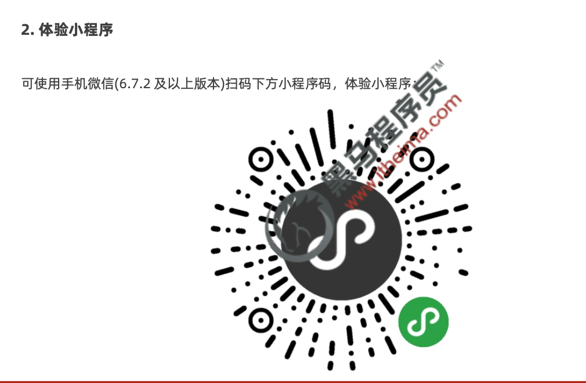
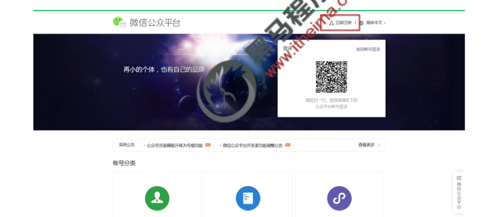
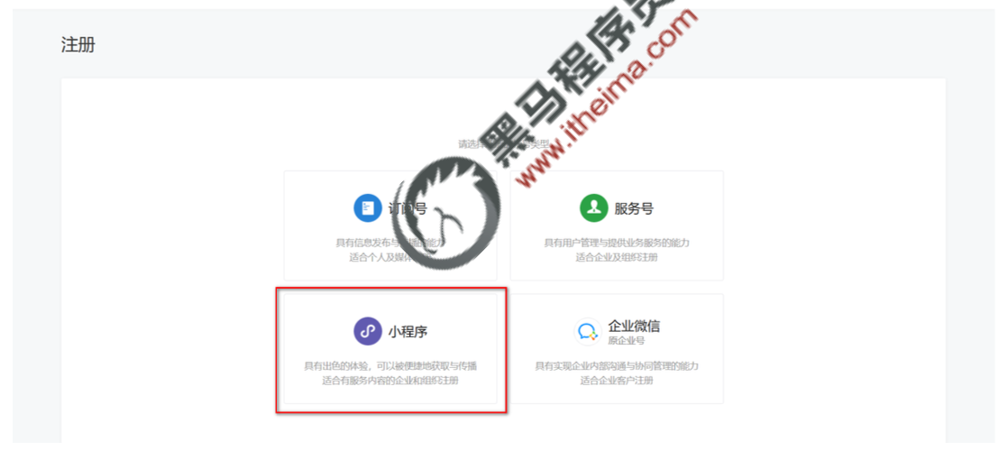
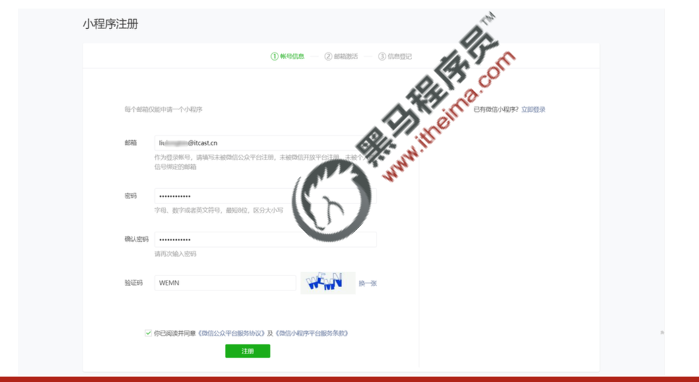

## 小程序简介

### 小程序与普通网页开发的区别

##### 运行环境不同

网页运行在浏览器环境中

小程序运行在微信环境中

##### API 不同

由于运行环境的不同，所以小程序中，

无法调用 DOM 和 BOM 的 API。

但是，小程序中可以调用微信环境提供

的各种 API，例如：

- 地理定位
- 扫码
- 支付

##### 开发模式不同

网页的开发模式：浏览器 + 代码编辑器

小程序有自己的一套标准开发模式：

- 申请小程序开发账号
- 安装小程序开发者工具
- 创建和配置小程序项目

2. ### 体验小程序

## 第一个小程序- 注册小程序开发帐号

### 点击注册按钮

使用浏览器打开 https://mp.weixin.qq.com/ 网址，点击右上角的“立即注册”即可进入到小程序开发账号

的注册流程，主要流程截图如下：

### 选择注册账号的类型

### 填写账号信息

