```ts
// 装饰器
import { CircleShape } from '@kit.ArkUI';
import { InputMethodListDialog } from '@ohos.inputMethodList';

@Entry //主入口，一个页面只能有一个主入口
@Component //组件
struct Index {
  // struct 表示结构体

  // @State 装饰器修饰的数据是一个响应式的数据，数据改变之后页面会自动更新
  @State message: string = '请输入内容';  //定义一个数据

  // 每一个组件都需要一个build函数，这个函数里面写的是组件的内容
  // 在这个函数内不能写console.log输出，不能switch case
  // 组件定义的时候，build函数的最外层只能有一个根节点
  build() {
    // RelativeContainer() 相对布局的容器
    // 如果组件可以设置子组件，那么使用{ 子组件 }
    // Column() 线性布局 列的意思，从上往下一个一个排
    Column() {
      Image("https://img.clnya.fun/chlorine-coder.webp")
        .width('40%')
        .borderRadius('300px')
        .margin({
          top:'10'
        })// 如果模拟器中使用网络图片，需要设置权限
      TextInput({
        placeholder:'请输入用户名'
      })
        .margin({
          top:'10'
        })
      TextInput({
        placeholder:'请输入密码'
      })
        .type(InputType.Password)
      Button("登录")
        .margin({
          top:'10'
        })
        .backgroundColor('#ff56632')
        .fontColor('black')
        .type(ButtonType.Normal)
        .borderRadius('30px')
      Text('没有账号，我要注册')
        .margin({
          left:'230'
        })
        .fontSize('12')

    }
     //这下面的是全局样式
    .height('100%') //高度 单位是vp 屏幕像素比
    .width('100%')  //宽度
    .backgroundColor('#52999932')
  }
}
```


## 装饰器

```ts
import { CircleShape } from '@kit.ArkUI';
import { InputMethodListDialog } from '@ohos.inputMethodList';
```

相对布局 RelativeContainer()  默认没有样式，会挤在一起

线性布局 Column()  列的意思，从上往下一个一个排


## 网络图片使用

​	`Image`

###  1.使用图片

​	如果模拟器中使用网络图片，需要设置权限(预览的时候可以直接展示图片，模拟器需要权限)

```ts
Image("https://img.clnya.fun/chlorine-coder.webp")
```

###  2.设置网络图片权限

​	在module.json5下设置

```ts
"requestPermissions": [
      {
        "name": "ohos.permission.INTERNET"
      }
    ]
```


## 本地图片使用

```ts
Image($r('app.media.app_icon'))
```


## 输入框--密码框

`InputType.Password`

```ts
 TextInput({
        placeholder:'请输入用户名'
      })
        .margin({
          top:'10'
        })
      TextInput({
        placeholder:'请输入密码'
      })
		.type(InputType.Password)
```


## Button点击事件

`.onClick`

```ts
 Button("登录")
        .margin({
          top:'10'
        })
        .onClick(()=>{
          console.log('你好') //这样子在日志哪里会打印出你好
          console.log(123+'') //无法直接打印数字会报错，必须要转换成字符串
        })
```


## 轻提示

`promptAction.showToast`

```ts
.onClick(()=>{
            promptAction.showToast({
              message:"这是一个轻提示弹窗"
            })
          })
```


### 1.定义响应式数据

在arkts中我们可以使用`@state`定义一个响应式的数据

```ts
@State count:number=1

 Button(this.count+'')
        .onClick(()=>{
          this.count++
        })
```


###  2.输入内容弹出轻提示

```ts
 TextInput({
        placeholder:'请输入内容'
      }).onChange((e)=>{
        promptAction.showToast({
          message:e
        })
      })
```

```ts
  @State name:string='请输入文本'

Text(this.name)
TextInput({
        placeholder:'请输入内容'
      }).onChange((e)=>{
       console.log(e)  //这个e是我输入的值
      })
```


## 点击叉清空输入框内容

 ` .cancelButton({})`

```ts
  TextInput({
          placeholder:'请输入内容'
        })
          .cancelButton({})
```


## 输入框只能输入数字

`InputType.PhoneNumber`

```ts
type(InputType.PhoneNumber)
```


## textAlign让文本右边对齐

`.textAlign(TextAlign.End)`

```ts
 Text('没有账号，我要注册')
        .width('100%')
        .textAlign(TextAlign.End) //让文本右边对齐
        .fontSize('14')
        .fontColor('#999')
```


## 清空按钮原始样式

`ButtonType.Normal`

```ts
  Button("登录")
        .width('100%')
        .onClick(()=>{
          console.log('你好')
          console.log(123+'')
        })
        .type(ButtonType.Normal)
```


## 间距space

```ts
Column({
      space:12
    }) {
      Image("https://img.clnya.fun/chlorine-coder.webp")
    }
```


## 设置初始化加载的页面

在EntryAbility.ets里面设置

​	pages/Index把这个改成你想选择的页面

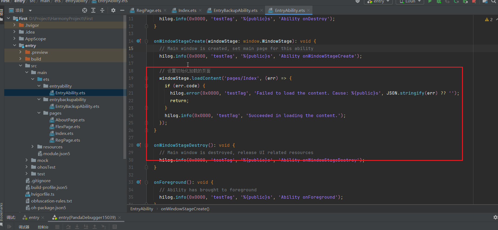

```ts
// 设置初始化加载的页面
    windowStage.loadContent('pages/Index', (err) => {
      if (err.code) {
        hilog.error(0x0000, 'testTag', 'Failed to load the content. Cause: %{public}s', JSON.stringify(err) ?? '');
        return;
      }
      hilog.info(0x0000, 'testTag', 'Succeeded in loading the content.');
    });
  }
```


## 	鸿蒙默认单位vp

```ts
  .height('100%') //高度 单位是vp 屏幕像素比
  .width('100%')  //宽度
  .backgroundColor('#52963299')
```


## 修改app默认昵称

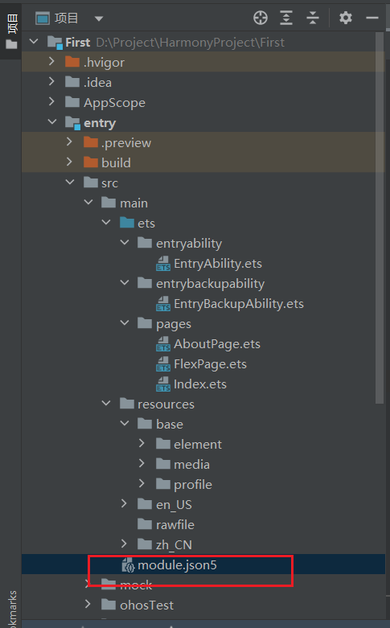

按住ctrl加鼠标左键，可以快速打开依赖的文件夹

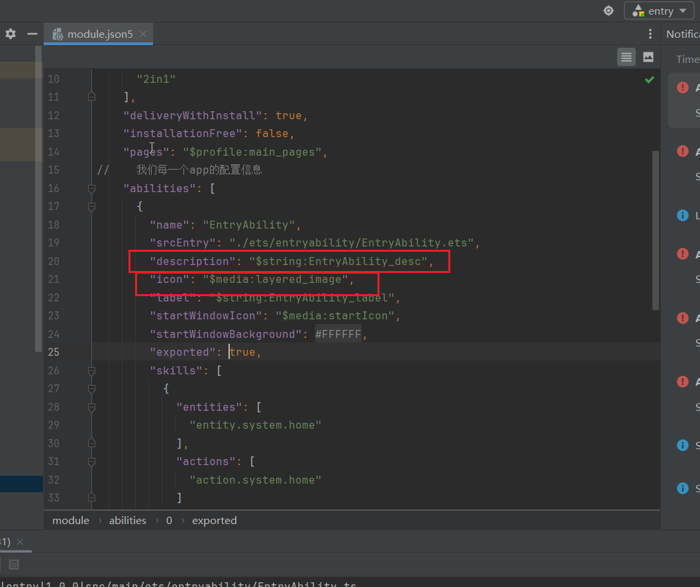

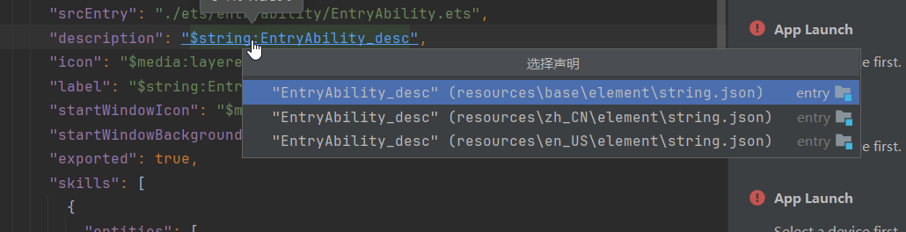

中文

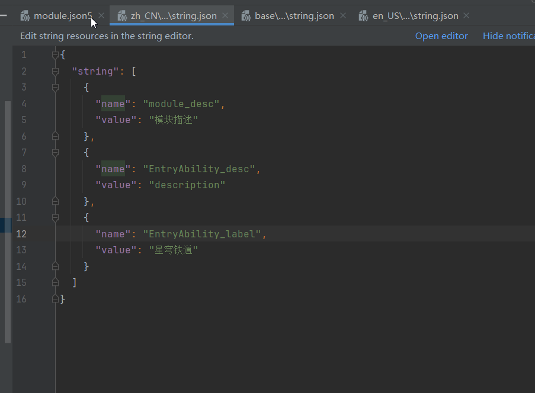

在这三个文件里面全部更改即可

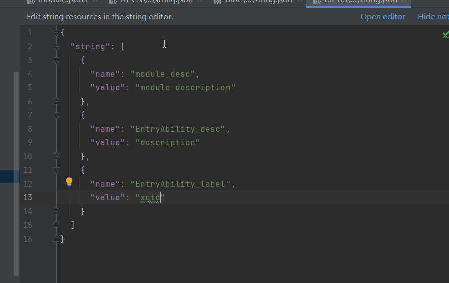

## 修改app图标

在这个文件夹下面放入图标

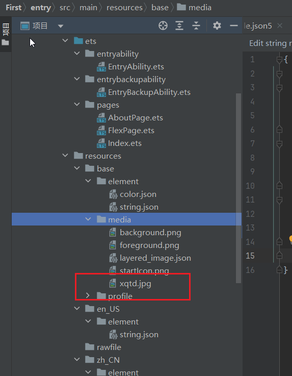

在module.json5那个文件里修改，

```ts
 "abilities": [
      {
        "name": "EntryAbility",
        "srcEntry": "./ets/entryability/EntryAbility.ets",
        "description": "$string:EntryAbility_desc",
        "icon": "$media:xqtd", //表示桌面上的小图标
        "label": "$string:EntryAbility_label",
        "startWindowIcon": "$media:xqtd", //启动屏幕
        "startWindowBackground": "$color:start_window_background", //启动屏幕的背景色
        "exported": true,
        "skills": [
```

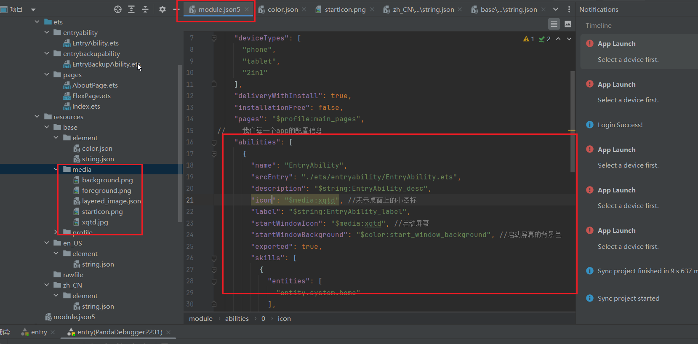


## 实现界面多语言切换

在中文英文和默认的都加上这一行

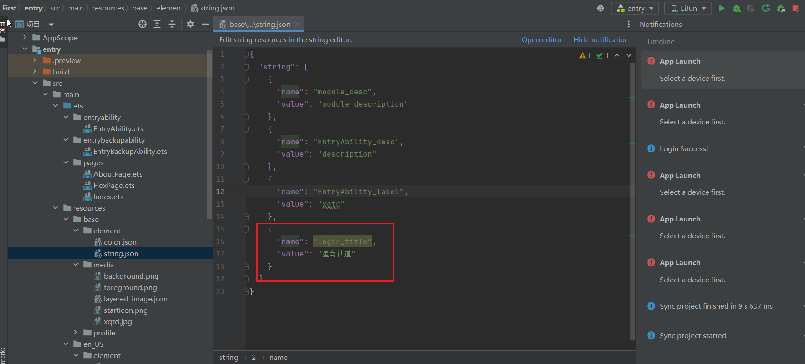

然后使用的适合通过$r选择相应的数据即可

```ts
Text($r("app.string.Login_title"))
```


##  Navigator页面跳转

```ts
 // 跳转
      Navigator({
        target:'pages/RegPage' //目标页
      }){
        Text('没有账号，我要注册')
          .width('100%')
          .textAlign(TextAlign.End)
          .fontSize('14')
          .fontColor('#999')
      }
```


## 轮播图

​    直接使用swiper组件，里面放文本或者图片即可，设置atuoplay(true)，可以让图片自动轮播

   .indicator(Indicator.dot())  //小圆点

```ts
Swiper(){ Image('https://img2.baidu.com/it/u=1409005732,3786216107&fm=253&app=120&size=w931&n=0&f=JPE2dcc36ddaafc6ae2fb96c4bae75')
         .width('100%') Image('https://img2.baidu.com/it/u=1409005732,3786216107&fm=253&app=120&size=w931&n=0&f=JPE2dcc36ddaafc6ae2fb96c4bae75')
          .width('100%') Image('https://img2.baidu.com/it/u=1409005732,3786216107&fm=253&app=120&size=w931&n=0&f=JPE2dcc36ddaafc6ae2fb96c4bae75')
          .width('100%') Image('https://img2.baidu.com/it/u=1409005732,3786216107&fm=253&app=120&size=w931&n=0&f=JPE2dcc36ddaafc6ae2fb96c4bae75')
          .width('100%') Image('https://img2.baidu.com/it/u=1409005732,3786216107&fm=253&app=120&size=w931&n=0&f=JPE2dcc36ddaafc6ae2fb96c4bae75')
        .width('100%')
      }.autoPlay(true)  //让图片自动轮播
```


## layoutWeight占满剩余空间

```ts
Column()
	.width('80%')
	.backgroundColor('#fff')
	.layoutWeight(1) //会占满剩余的空间，类似flex:1
```


## Blank空白占位

blank会占满剩下的空间，类似空格占满

```ts
Blank() //类似于空格占位符

//或者这样子也可以，不推荐
column()
	.layoutWeight(1)
```


## 自身位置偏移

.offset

```ts
 Button('按钮1')
          .offset({ //以自身的位置进行偏移
            bottom:120
          }).align(Alignment.Bottom) //按钮内部的字进行移动

.aliginSelf(itemAlign.Start) //设置自己
```


## 绝对位置position

```ts
Text("你好未来")
	.position({
		left:40,
		top:30
	})
	  .zIndex(12) //层级改变
```


## 层级改变

```ts
 .zIndex(12) //层级改变
```


## 导航栏Tabs

.vertical(true) //竖排

.barPosition(BarPosition.End) //选项卡位置在底部

.scrollable(false) //禁止滑动切换

.barHeight(0) //设置tarBar的高度

`Tabs()里面直接写布局即可`

```ts
 Tabs(){
        TabContent(){
          Column(){
            Text('首页')
          }
        }.tabBar({
          text:'首页', //底部名称
          icon:$r('app.media.xqtd') //底部图标
        })
     
        TabContent(){
          Text('列表')
        }.tabBar('列表')
     
        TabContent(){
          Text('购物车')
        }.tabBar(this.tabBarbuild())
     
        TabContent(){
          Text('我的')
        }.tabBar('我的')
      } 
									//选项卡默认在最上方
      .barPosition(BarPosition.End) //选项卡位置在底部
      .scrollable(false) //禁止滑动切换
	  .barHeight(0) //设置tarBar的高度
	  .vertical(true) //竖排
    }
```


### 	1.下面是静态的

```ts
@Entry
@Component
struct MainPage {

  // 是自定义渲染，是一个函数，函数里面跟着组件,
  @Builder
tabBarbuild(){
Column({
  space:5
}){
  Image($r('app.media.xqtd'))
    .width(20)
    .height(20)
  Text('列表')
    .fontSize(14)
}
}

  build() {
    RelativeContainer() {
    //选项卡
      Tabs(){
        TabContent(){
          Column(){
            Text('首页')
          }
        }.tabBar({
          text:'首页', //底部名称
          icon:$r('app.media.xqtd') //底部图标
        })
        TabContent(){
          Text('列表')
        }.tabBar('列表')
        TabContent(){
          Text('购物车')
        }.tabBar(this.tabBarbuild())
        TabContent(){
          Text('我的')
        }.tabBar('我的')
      } //选项卡默认在最上方
      .barPosition(BarPosition.End) //选项卡位置在底部
      .scrollable(false) //禁止滑动切换
       .vertical(true) //竖排
    }

    .height('100%')
    .width('100%')
  }
}
```


### 2.类似行内式，动态生成

①.首先定义一个函数组件

```ts
 @Builder
tabBarbuild(label:string,img:string){
Column({
  space:5
}){
  Image(img)
    .width(20)
    .height(20)
  Text(label)
    .fontSize(14)
}
}
```

②.然后再下面调用

```ts
 .tabBar(this.tabBarbuild('李骏','https://ecmb.bdimg.com/tam-ogel/-504296542_-299042061_200_200.jpg'))
        //使用了builder实现自定义渲染
```

③.完整代码如下：

```ts
@Entry
@Component
struct MainPage {

  // 是自定义渲染，是一个函数，函数里面跟着组件,
  @Builder
tabBarbuild(label:string,img:string){
Column({
  space:5
}){
  Image(img)
    .width(20)
    .height(20)
  Text(label)
    .fontSize(14)
}
}

  build() {
    RelativeContainer() {
    //选项卡
      Tabs(){
        TabContent(){
          Column(){
            Text('首页')
          }
        }.tabBar({
          text:'首页', //底部名称
          icon:$r('app.media.xqtd') //底部图标
        })
        TabContent(){
          Text('列表')
        }.tabBar('列表')
        TabContent(){
          Text('购物车')
        }
        .tabBar(this.tabBarbuild('李骏','https://ecmb.bdimg.com/tam-ogel/-504296542_-299042061_200_200.jpg'))
        //使用了builder实现自定义渲染
        TabContent(){
          Text('我的')
        }.tabBar('我的')
      } //选项卡默认在最上方
      .barPosition(BarPosition.End) //选项卡位置在底部
      .scrollable(false) //禁止滑动切换
    }

    .height('100%')
    .width('100%')
  }
}
```


### 3.自定义组件渲染

①.首先定义一个组件

```ts
@Component
struct Home{
  build() {
    Column(){
      Text('风灵月影')
      Text('拉人入会，获取积分成就')
    }
  }
}
```

②.然后直接使用

```ts
Home() //使用自定义组件的方式实现渲染
```

③.完整代码如下

```ts
@Component
struct Home{
  build() {
    Column(){
      Text('风灵月影')
      Text('拉人入会，获取积分成就')
    }
  }
}

@Entry
@Component
struct MainPage {

  // 是自定义渲染，是一个函数，函数里面跟着组件,
  @Builder
tabBarbuild(label:string,img:string){
Column({
  space:5
}){
  Image(img)
    .width(20)
    .height(20)
  Text(label)
    .fontSize(14)
}
}

  build() {
    RelativeContainer() {
    //选项卡
      Tabs(){
        TabContent(){
          // Column(){
          //   Text('首页')
          // }
          Home() //使用自定义组件的方式实现渲染
        }.tabBar({
          text:'首页', //底部名称
          icon:$r('app.media.xqtd') //底部图标
        })
        TabContent(){
          Text('列表')
        }.tabBar('列表')
        TabContent(){
          Text('购物车')
        }
        .tabBar(this.tabBarbuild('李骏','https://ecmb.bdimg.com/tam-ogel/-504296542_-299042061_200_200.jpg'))
        //使用了builder实现自定义渲染
        TabContent(){
          Text('我的')
        }.tabBar('我的')
      } //选项卡默认在最上方
      .barPosition(BarPosition.End) //选项卡位置在底部
      .scrollable(false) //禁止滑动切换
    }

    .height('100%')
    .width('100%')
  }
}
```


## 组件的导入导出

### 1.首先新建一个文件夹

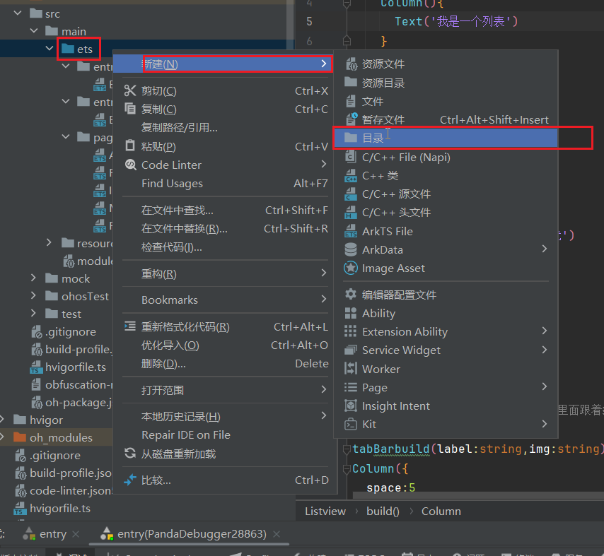

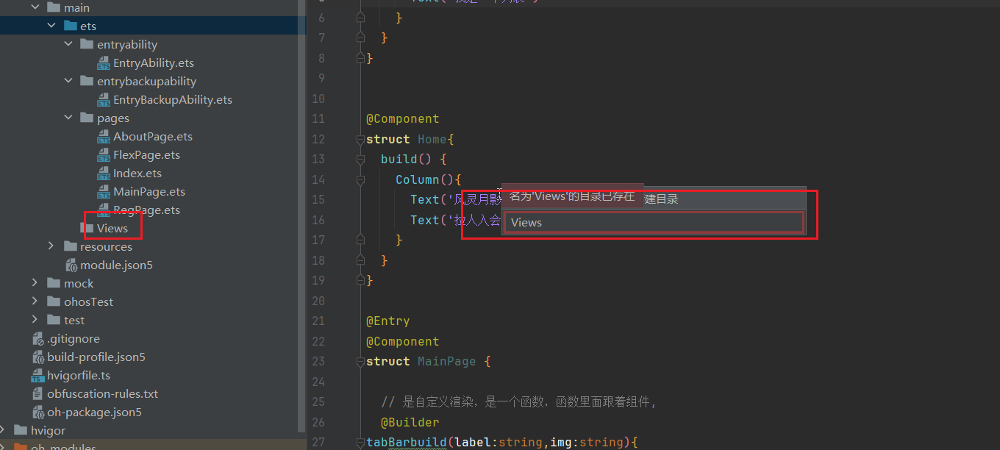

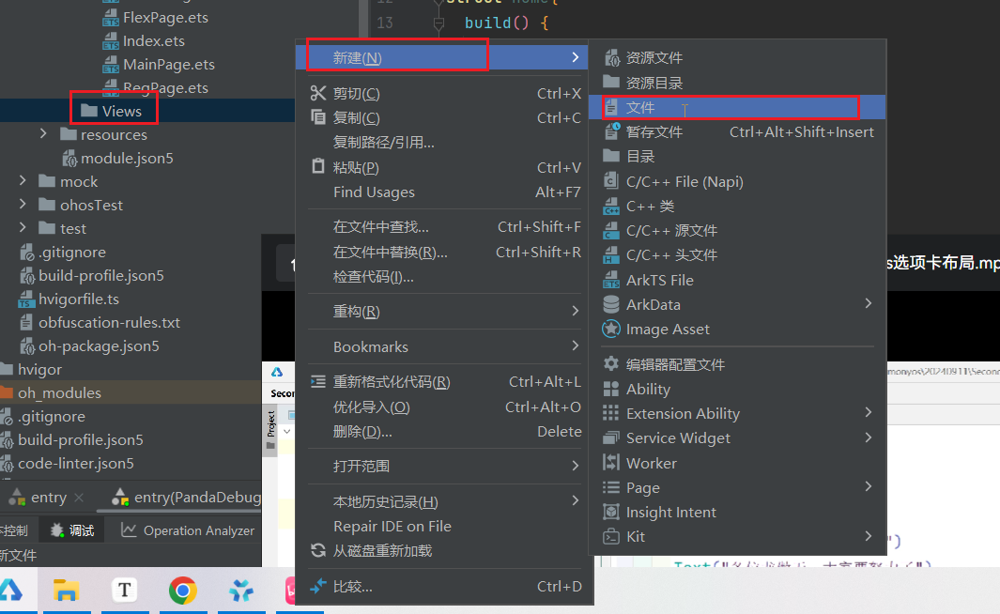

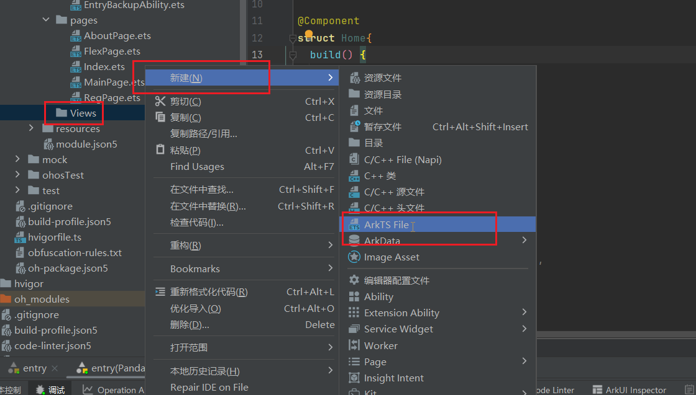

名字随便取，比如说现在叫list.ets

### 2.导出导入

​     里面写组件代码，然后导出

```ts
@Component
export  struct Listview{
  build() {
    Column(){
      Text('我是一个列表')
    }
  }
}
```

​    使用的时候导入

```ts
import {Listview} from '../Views/list'
```

​    使用

```ts
Listview()
```

### 3.创建文件做统一导出导入

​    创建一个Index文件做统一的导出导入

```ts
//此文件中的文件都在这个文件中做统一的导出
export {Listview} from './list'
export {username} from './username'
```

​     导入的时候，一次性导入即可

```ts
import { Listview,username } from '../Views/index'
```


### 4.完整代码如下：

​    list.ets

```ts
@Component
export  struct Listview{
  build() {
    Column(){
      Text('我是一个列表')
      Text('我是一个列表')
    }
  }
}
```

​    MainPage.ets

```ts
import { Listview } from '../Views/list'


@Component
struct Home{
  build() {
    Column(){
      Text('风灵月影')
      Text('拉人入会，获取积分成就')
    }
  }
}

@Entry
@Component
struct MainPage {

  // 是自定义渲染，是一个函数，函数里面跟着组件,
  @Builder
tabBarbuild(label:string,img:string){
Column({
  space:5
}){
  Image(img)
    .width(20)
    .height(20)
  Text(label)
    .fontSize(14)
}
}

  build() {
    RelativeContainer() {
    //选项卡
      Tabs(){
        TabContent(){
          // Column(){
          //   Text('首页')
          // }
          Home() //使用自定义组件的方式实现渲染
        }.tabBar({
          text:'首页', //底部名称
          icon:$r('app.media.xqtd') //底部图标
        })
        TabContent(){
          // Text('列表')
          Listview()
        }.tabBar('列表')
        TabContent(){
          Text('购物车')
        }
        .tabBar(this.tabBarbuild('李骏','https://ecmb.bdimg.com/tam-ogel/-504296542_-299042061_200_200.jpg'))
        //使用了builder实现自定义渲染
        TabContent(){
          Text('我的')
        }.tabBar('我的')
      } //选项卡默认在最上方
      .barPosition(BarPosition.End) //选项卡位置在底部
      .scrollable(false) //禁止滑动切换
    }

    .height('100%')
    .width('100%')
  }
}
```

Index.ets

```ts
//此文件中的文件都在这个文件中做统一的导出
export {Listview} from './list'
```


## interface定义接口

interface Ulist{} 定义类型接口

const listData:Ulist[]=[{}] 声明类型

```ts
interface Ulist{
  id:Number;
  name:String;
  img:String;
}

// []这个数据的数据类型是由Ulist这个对象组成的数字
const listData:Ulist[]=[{
  id:1001,
  name:'黑塔',
  img:'https://img0.baidu.com/it/u=87766000,1151851566&fm=253&fmt=auto&app=138&f=JPEG?w=500&h=889'
}]
```


### ?设置接口类型可选

   //问号表示可选参数

 //截断运算符

```ts
interface Person{
  name?:string, //问号表示可选参数
  desc?:string
}
 @State person:Person={}

Text(this.goods?.name) //也可以这么使用
var obj={a:123}
obj.a //123
obj.b //undefined
obj.b.c //Uncaught TypeError.. 报错
obj.b?.c //会判断b是否存在，存在b在执行c
```


## ForEach()循环语法

​    接收三个参数  1.数据  

​									2.函数，生成每一项的展示内容 `item:string,index:number`

​									3.生成key的函数，每一个key一定唯一

```ts
// 接收三个参数 1.数据 2.函数，生成每一项的展示内容 3.生成key的函数，每一个key一定唯一
ForEach(listData,(item:Ulist)=>{},(item:Ulist)=>item.id)
```

​	`需要注意的地方，ForEach的参数key是一个字符串`

```ts
ForEach(this.people,(item:string,index:number)=>{ //item是内容，index是索引
          ListItem(){
            ColumnSplit(){
              Text(item)
              Button('删除')
                .onClick(()=>{
                  this.people.splice(index,1)
                })
            }
          }
        },(item:string)=>item)
```

代码如下:

```ts
ForEach(GoodsList,(item:IGoods)=>{},(item:IGoods)=>item.goods_id)
```

```ts
interface Ulist{
  id:string;
  name:string;
  img:string;
}

// []这个数据的数据类型是由Ulist这个对象组成的数字
const listData:Ulist[]=[{
  id:'1001',
  name:'黑塔',
  img:'https://img0.baidu.com/it/u=87766000,1151851566&fm=253&fmt=auto&app=138&f=JPEG?w=500&h=889'
},
  {
    id:'1002',
    name:'花火',
    img:'https://img0.baidu.com/it/u=87766000,1151851566&fm=253&fmt=auto&app=138&f=JPEG?w=500&h=889'
  },
  {
    id:'1003',
    name:'黑天鹅',
    img:'https://img0.baidu.com/it/u=87766000,1151851566&fm=253&fmt=auto&app=138&f=JPEG?w=500&h=889'
  },
  {
    id:'1004',
    name:'毁灭大君',
    img:'https://img0.baidu.com/it/u=87766000,1151851566&fm=253&fmt=auto&app=138&f=JPEG?w=500&h=889'
  }]

@Entry
@Component
struct ListPage {


  build() {
Column(){
  Text('原此行，终抵群星')
  // List是一个列表组件
  List({
    space:16 //上下的间距
  }){
    // 每一项需要使用ListItem进行包括
    // 接收三个参数 1.数据 2.函数，生成每一项的展示内容 3.生成key的函数，每一个key一定唯一
    ForEach(listData,(item:Ulist)=>{
      ListItem(){
        Column(){
          Image(item.img)
          Text(item.name)
        }
        .padding(2)
        .border({
          width:{
            bottom:1
          },
          color:'#996699'
        })
        .margin(2)
      }
    },(item:Ulist)=>item.id)
  }
  .lanes(1) //每一行排放的数量
  .height('100%')
  .width('100%')
  .alignListItem(ListItemAlign.Center)
} }
}
```

```ts
@Entry
@Component


struct ArrPage {
people:string[]=['胡桃','甘雨','冷鸟','剑来']

  build() {
  Column(){
   //  需要注意的地方，ForEach的参数key是一个字符串
   ForEach(this.people,(item:string)=>{
     Text(item)
   },(item:string)=>item)
  }
  }
}
```


## 三元表达式

```ts
 Text(item)
       .fontColor(item=='胡桃'?'#f00':'#000')
```

​    include，一个方法，包含雨吗？包含雨就显示颜色

```ts
 Text(item)
       .fontColor(item.includes('雨')?'#f00':'000') 
```

​    完整代码如下:

```ts
@Entry
@Component


struct ArrPage {
people:string[]=['胡桃','甘雨','冷鸟','剑来雨']

  build() {
  Column(){
   //  需要注意的地方，ForEach的参数key是一个字符串
   ForEach(this.people,(item:string)=>{
     Text(item)
       .fontColor(item.includes('雨')?'#f00':'000')
   },(item:string)=>item)
  }
  }
}
```


## visibility控制显示隐藏

visibility控制显示/隐藏，但是依然会占用位置

```TS
//visibility控制显示/隐藏，但是依然会占用位置
.visibility(Visibility.Hidden)  //隐藏
.visibility(Visibility.Visible) //显示
```


## 渲染控制if、else

```ts
	//渲染控制 还可以使用if else语句进行控制
    if (true){ 	//if()里面写判断，num==1
      Button('我是一个按钮')
    }else{
      Button('我不是一个按钮')
    }
    //但是无法使用switch case语句
```


## 扩展安全区域

​	.expandSafeArea([SafeAreaType.SYSTEM],[SafeAreaEdge.TOP,SafeAreaEdge.BOTTOM])

​	Array <[SafeAreaType](zh-cn_topic_0000001990052457.html#ZH-CN_TOPIC_0000001990052457__safeareatype10)> 配置扩展安全区域的类型。

   Array <[SafeAreaEdge](zh-cn_topic_0000001990052457.html#ZH-CN_TOPIC_0000001990052457__safeareaedge10)> 配置扩展安全区域的方向。

```ts
@Entry
@Component
struct SafePage {


  build() {
    Column(){
      Column()
        .width('100%')
        .backgroundColor('0033ff')
      // 扩展安全区域
      Text('关于')
    }
    .height('100%')
    .width('100%')
    .backgroundColor('#990033')
    .expandSafeArea([SafeAreaType.SYSTEM],[SafeAreaEdge.TOP,SafeAreaEdge.BOTTOM]) //上下全部填充
  }
}
```


## animation动画效果

通过animation实现

```ts
@Entry
@Component
struct AnimationPage {
@State cHeight:number=200 //通过@state装饰器设置一个响应式的数据

  build() {

   Column(){
     Button('变形')
       //添加点击事件
       .onClick(()=>{
         if(this.cHeight<300){
           this.cHeight+=100
         }else{
           this.cHeight=200
         }
       })
     Column(){

     }
     .height(this.cHeight)
     .width('80%')
     // 通过animation实现
     .animation({
       duration:5000, //时间  delay:延时时间
       curve:Curve.Linear //动画速度曲线 Linear线性速度
     })
     .backgroundColor('#883366')
    }
    .height('100%')
    .width('100%')
    .alignItems(HorizontalAlign.Center) //居中对齐
  }
}
```


## 设置输入框的值

```ts
 TextInput({
            placeholder:'请输入内容',
            text:this.message //2.设置输入框的内容，这个时候是空了
          })
```


## onchange内容改变事件

```ts
.onChange((index)=>{
            this.message=index //改变值
          })
```


## onContentWillChange内容改变事件前

```ts
.onContentWillChange((pre,index) => { //pre上一次的索引，index，点击以后的索引
        this.currentTabIndex = index; //设置变量，等于点击以后选项卡的索引
        return true //必须要有返回值
      })
```


## onsubmit提交

```ts
//提交的时候执行
.onsubmit((v)=>{ //v表示我们搜索框中输入的内容
   this.people.push(this.message)
   this.message='' //1.置空，但是不会立刻刷新页面
})
```


## 小键盘确认按钮的名字

```ts
// 确认按钮的名字
.enterKeyType(EnterKeyType.Done)
.enterKeyType(EnterKeyType.Send)   //发送
.enterKeyType(EnterKeyType.Search) //搜索
```


## 文字2行显示

### 1.设置省略文字的位置

### 2.多出来的文字变成省略号

```ts
  Text(item.name)
              .maxLines(2) //文字2行显示
              .ellipsisMode(EllipsisMode.END) //设置省略文字的位置,出现省略号
              .textOverflow({
                overflow:TextOverflow.Ellipsis //多出来的文字变成省略号
              })
```


## 页面触底之后执行

```ts
List(){

}.onReachEnd(()=>{
        //页面触底之后执行
    })
```


## $$实现数据和组件属性的双向绑定

```ts
@state name:string='Hello World'

Row(){
    Textinput({
        placheolder:'请输入内容',
        text:$$this.name //$$可以实现我们state数据和组件内置属性的双向绑定
    })
}
```


## as数据类型转换

```ts
//提前定义好数据类型
interface PageParams{
  id:string;
  name:string;
}

// 生命周期钩子函数，组件创建的时候执行
  aboutToAppear(): void {
    //需要定义一个数据类型，通过as进行数据类型转换
    const obj:PageParams=router.getParams() as PageParams //定义类型
    console.log(JSON.stringify(obj)) //console不能打印对象，这里转换为字符串
    console.log(obj.name)
  }
```


## layoutWeight占满剩下的空间

```ts
 List() {
        ForEach(this.listData, (item: Goods) => {
          ListItem() {
            Column() {
              Image(item.cover_url)
                .width('100%')
              Text(item.name)
              Text(item.price)
            }
          }
        }, (item: Goods) => item.goods_id)
      }.width('100%')
      .lanes(2)
      .onReachEnd(()=>{
        //页面触底之后执行
        this.loadData()
      })
      .layoutWeight(1) //占满剩下的空间
```


## 阴影效果shadow

```ts
List() { }
	.shadow({
          offsetX:0, //x轴方向
          offsetY:1,  //y轴方向
          color:'#ccc', //阴影颜色
          radius:2 //阴影大小
       })
```


## toFixed保留小数点后两位

```ts
Text('￥'+(item.price/100).toFixed(2))
```


## Counter购物车数量加减组件

```ts
Counter(){
	Text(8+'') //当前的数量
}.onInc(()=>{  //加

}).onDec(()=>{  //减

})
```


## 非空断言操作符 `!`

  使用了 TypeScript 的非空断言操作符 `!`。这个操作符告诉编译器你确定 `res` 不会是 `null` 或 `undefined`，即使编译器可能认为它可能是其中之一。这样做可以避免编译时的错误提示。

```ts
loadBanners(): Promise<BannerModal[]>{ //类型声明
    return this.httpRequest.get('/api/v1/banners')
      .then(res=>{
        return (res!['data'] as BannerModal[]) //强制类型转行
      })
  }
```


## Marquee跑马灯(滚动条)

```ts
  Marquee({
        src: '夏娜，日本轻小说《灼眼的夏娜》及其衍生作品中的女主角。从小就居住在“天道宫”，跟着威尔艾米娜·卡梅尔、还有（小白）梅利希姆，在天道宫中为成为完美的火雾战士而努力锻炼，文武双全的杀手。已释放出天壤劫火的全部威力，成为真正的“炎发灼眼的杀手”。习得“真红”，“飞焰”，“审判”，“断罪”等自在法，因自身火雾战士的立场无法赞同祭礼之蛇坂井悠二的做法，回到御崎市与坂井悠二展开最后的对决。决心要用“最强的自在法”击败坂井悠二，并将坂井悠二带回。跟吉田一美算是情敌也算是好友，喜欢坂井悠二，深信有坂井悠二在旁没有办不到的事情。', //内容
        start: true //开始状态，默认启动
      })
```


## 分割线Divider

```ts
  Column({
           space:4
         }){
           Image(item.coverImage)
           Text(item.name)
           Divider() //分隔线，可以设置熟悉
      				.color('#ff99cc')
      				.width(8)
         }
```


## 搜索框Search

```ts
Search({
  placeholder:'请输入关键词'
})
.onsubmit(v=>{ //v是搜索框中输入的内容
    
})
  .borderRadius(4)
  .margin('0')
```


## Checkbox复选框

```ts
 Row(){
        Checkbox()
     	  .shape(CheckBoxShape.ROUNDED_SQUARE) //默认是正方形
          .select(true) //默认勾选
        Text('是否同意用户协议?')
      }
```


## Border边框

```ts
 .border({
            style:BorderStyle.Solid, //实线
            width:10,
            color:'#fff'
          })
```


## startsWith判断字符串是什么开头的

```ts
//对图片进行函数处理
function dalimg(url:string){
  if(url){
    if(url.startsWith('http')) //如果不是http开头，做下面的if判断处理
      return url;
    else
      return 'http://192.168.226.1:1337'+url
  }
  return 'https://img0.baidu.com/it/u=3464850806,2136683181&fm=253&fmt=auto&app=138&f=JPG?w=500&h=281'
}
```


## encodeURI转换成 UTF-8 编码格式

encodeURI(keyword)} 把需要转换的字符串放这个方法里面即可。

url里面是不能传中文的，所以我们通过get发起请求的时候，需要对url进行特殊的处理

```ts
return session.get(`http://192.168.0.108:1337/api/v1/products?page=${page}&name=${encodeURI(keyword)}`)
```


## 如何生成函数注释

在函数上方写一个 /**，然后按住enter回车键，回车即可，

```ts
/**
 * 
 * @param url
 * @returns 
 */
```


## span设置文本中的某一些文字变颜色

```ts
Text(){
    //text组件中可以添加Span作为子组件
         Span("￥")
         Span(item.price+'')
              .fontColor('#ff2200')
              }
```


## UUID得到一个随机的ID

https://developer.huawei.com/consumer/cn/doc/harmonyos-references-V5/js-apis-util-V5#utilgeneraterandomuuid9

​    是js中内置的api

```ts
crypto.randomUUID() //得到一个随机不重复的字符串
```

在鸿蒙中使用的话，鸿蒙内置了一个已经封装好的UUID

```ts
let uuid = util.generateRandomUUID(true); //鸿蒙通过这个方法调用
console.info("RFC 4122 Version 4 UUID:" + uuid);
// 输出随机生成的UUID

id:util.generateRandomUUID();  //使用uuid作为不重复的id数据
```


## 获取用户的坐标

### 1.获取用户权限

首先我们要获取用户坐标的话，这种属于用户级别的权限

我们需要先在module.json5中配置


modele.json5

```ts
 "requestPermissions": [{
      'name': 'ohos.permission.INTERNET'
    },{
      "name": 'ohos.permission.APPROXIMATELY_LOCATION',
      "usedScene": {
        //问客户权限什么时候启用
        "when": "inuse",//在使用软件的时候使用
        "abilities": ["EntryAbility"]
      },
      //为什么要用
      "reason": '$string:Location_reason' //这里是弹给用户的提示,调用了string.json
    }]
```

string.json

```ts
   {
      "name": "Location_reason",
      "value": "我需要你的gps，请给我"
    }
```


### 2.界面使用

  配置完以后在界面使用

```ts
//页面一出现的时候调用
aboutToAppear(): void {
    let atManager=abilityAccessCtrl.createAtManager()
    atManager.requestPermissionsFromUser(getContext(),["ohos.permission.APPROXIMATELY_LOCATION"]) //第一个参数是获取上下文,第二个参数是获取用户权限的数组
      .then(res=>{
        //获取当前位置坐标成功
      })
  }
  
  //按钮点击以后调用
  Button('签到')
        .onClick(async ()=>{
        //此处进行签到，获取当前位置
          geoLocationManager.getCurrentLocation()
            .then(res=>{
              console.log('获取位置成功！')
            })
        })
```

  `完整代码如下:(推荐下面这种用法)`

​    因为我们需要把得到的坐标来进行判断是否签到成功，所以按钮点击以后获取坐标，必须使用async和awitc来等待返回的数据，在进行签到判断

```ts
import { abilityAccessCtrl } from '@kit.AbilityKit';
import { geoLocationManager } from '@kit.LocationKit';

@Entry
@Component
struct Index {
  @State message: string = 'Hello World';

  aboutToAppear(): void {
    let atManager=abilityAccessCtrl.createAtManager()
    atManager.requestPermissionsFromUser(getContext(),["ohos.permission.APPROXIMATELY_LOCATION"]) //第一个参数是获取上下文,第二个参数是获取用户权限的数组
      .then(res=>{
        //获取当前位置坐标成功
      })
  }


  build() {
    Column() {
      Button('签到')
        .onClick(async ()=>{
        //此处进行签到，获取当前位置
         const gpsData=await geoLocationManager.getCurrentLocation()
            // .then(gpsData=>{
            //   console.log('获取位置成功！')
            // })
        })
    }
    .height('100%')
    .width('100%')
  }
}
```


## RichText富文本组件，解析HTML格式

RichText富文本组件，解析并显示HTML格式文本

```ts
 RichText(`<h1 style="text-align: center;">h1标题</h1>' +
  '<h1 style="text-align: center;"><i>h1斜体</i></h1>' +
  '<h1 style="text-align: center;"><u>h1下划线</u></h1>' +
  '<h2 style="text-align: center;">h2标题</h2>' +
  '<h3 style="text-align: center;">h3标题</h3>' +
  '<p style="text-align: center;">p常规</p><hr/>' +
  '<div style="width: 500px;height: 500px;border: 1px solid;margin: 0 auto;">' +
  '<p style="font-size: 35px;text-align: center;font-weight: bold; color: rgb(24,78,228)">字体大小35px,行高45px</p>' +
  '<p style="background-color: #e5e5e5;line-height: 45px;font-size: 35px;text-indent: 2em;">' +
  '<p>这是一段文字这是一段文字这是一段文字这是一段文字这是一段文字这是一段文字这是一段文字这是一段文字这是一段文字</p>`;
)
```


## TextPickerDialog文本滑动选择器弹窗

TextPickerDialog.show

```ts
TextPickerDialog.show({
    range:['鹏哥','我想','完整的']，
    onAccept(v){
    promptAcion.showToast({ 
        message:v.value[0] //获取当前选择的是谁
    })
}
})
```


## Refresh刷新组件

`Refresh `，上拉刷新。

也支持代码块`@Builder`上拉刷新

```ts
@Entry
@Component
struct AboutPage {
	@State isRefreshing:boolean=false
    
   @Builder //代码块
  myRefresh() {
      Text(this.isRefreshing?'刷新中...':'好了!!!')
  }

build() {
    Column() {

      // 刷新组件
      Refresh({
        refreshing: $$this.isRefreshing //双向绑定
        builder: this.myRefresh() //绑定代码块,可以自定义刷新显示效果
      }) {
        Column() {
          Text('A')
          Text('B')
          Text('C')
        }
      }.onRefreshing(()=>{
        console.log('进行刷新')
        setTimeout(()=>{
          this.isRefreshing=false //结束刷新
        },3000)
      })
```


## video视频组件

`video`

```ts
Video({
	src:''
})
   .controls(true)
   .width('100%')
   .height('50%')
```


## 按钮上显示文字Badge

`Badge` 按钮上出现红字

```ts
Badge({
	value:'12',
	style:{
	badgeSize:16,badgeColor:'#FA2A2D'
	},
	position:BadgePosition.Right,
}){
	Button('点一下')
}
```


## 二维码QRCode

QRCode

```ts
QRCode(this.value).width(140).height(140)
QRCode("今天是2024年10月10日").width(140).height(140)
```


## 警告弹窗AlertDialog

`AlertDialog`

```ts
Button("弹窗")
	.onclick(()=>{
	  AlertDialog.show({
	    message:'确定要这样操作吗?',
        backgroundColor:'#ffccc0', //遮罩层背景颜色  
          
     // isModal:false, //是否是模态的，就是有没有遮罩层背景,默认是true
          
     // alignment:DialogAlignment.Bottom, //弹窗的位置
        autoCancel:false, // 点击遮罩层是否关闭，默认是true可以直接关闭
   
// 可以使用这种方式或者buttons属性设置按钮，但是两种方案二选一          
     // primaryButton:{ value:'确定',action:()=>{}  } 主要的按钮
     // 主要的按钮和下面buttons按钮的数组二选一
          
     // secondearyButton 第二个按钮
          
        buttons:[{
            value:'确定', // 文字
         // style:DialogButtonStyle.HIGHLIGHT, //样式，高亮的
            action:()=>{ // 行为
               promptAction.showToast({
                   message:'点了确定按钮'
               })
            },
        },{
            value:'取消',
            action:()=>{
                  promptAction.showToast({
                   message:'点了取消按钮'
               })
            },{
            value:'第三个按钮',
            action:()=>{
                
                }
        }
        }]
	  })
	})
```


