## 一、自定义组件

### 1.自定义组件Component

```ts
//自定义组件
@Component
struct GoodsView { //定义一个组件
  @Prop name:string='' //父传子，用属性，子组件定义name、price属性
  @Prop price:number=1
  build() {
    Column() {
      Text(this.name)
      Text('￥'+this.price+'元')
    }
    .backgroundColor('#7c999999')
    .padding(12)
    .width('100%')
  }
}
```


### 2.自定义代码块Builder

```ts
@Builder //创建一个自定义builder做显示效果的简单封装
linkTo(txt:string){
    Row(){
        Text(txt)
        Blank()
        Text('>')
    }
    .width('100%')
    .border({
        width:{
            bottom:1
        },
        style:BorderStyle.Solid,
        color:'#999'
    })
    .padding(8)
}

build(){
	Colum(){
     //通过buildder创建一个自定义渲染效果
	this.linkto('我的订单') //用的时候直接调用
	this.linkto('我的人生')
	this.linkto('我的世界')
	}
}
```


## 二、父传子prop

1.prop声明传入的属性默认值

```ts
//@Prop 设置属性，从外面传递数据过来
@Prop name:string='' //父传子，用属性，子组件定义name、price属性
@Prop price:number=1
@Require  @Prop desc:string='' // @Require 表示这个属性必须要传 
```

2.传入的值`互相独立不影响`

```ts
 GoodsView({
        name:'时崎狂三',
        price:1221
      })
 GoodsView({
        name:'五河琴里',
        price:243100
      })
```

完整代码如下:

```ts
//自定义组件
@Component
struct GoodsView { //定义一个组件
  @Prop name:string='' //父传子，用属性，子组件定义name、price属性
  @Prop price:number=1
  build() {
    Column() {
      Text(this.name)
      Text('￥'+this.price+'元')
    }
    .backgroundColor('#7c999999')
    .padding(12)
    .width('100%')
  }
}

@Entry
@Component
struct GoodsPage {
  build() {
    Column() {
      GoodsView({
        name:'时崎狂三',
        price:1221 
      })
    }
    .height('100%')
    .width('100%')
  }
}
```


### @Link实现子组件改变父组件

  如果使用prop，//原来的pp一旦改变，新的pp也会改变

​								    //但新的pp改变，原来的pp却不会改变

  使用Link,里面的改变，外面的也改。外面的改变，里面也会改变

```ts
 @Link mpp:number //@Link定义的数据，不能设置初始值，需要从外面传进来，改变之后对应的数据会跟着响应式变化
 @Link carts:Cart [] //可以实现子组件改变数据之后，父组件数据也进行改变
```

  完整代码如下:

```ts
//自定义组件
@Component
struct GoodsView { //定义一个组件
  @Require @Prop name:string='' //父传子，用属性，子组件定义name、price属性
  @Prop price:number=1
  @Link mpp:number //@Link定义的数据，不能设置初始值，需要从外面传进来，改变之后对应的数据会跟着响应式变化
  build() {
    Column() {
      Text(this.name)
      Text('￥'+this.price+'元')
        .onClick(()=>{
          this.price--
        })
      Text(this.mpp+',传递过来的') //原来的pp一旦改变，这个pp也会改变
        .onClick(()=>{
          this.mpp++ //这个改变，原来的pp不会改变，是全新的值
        })
    }
    .backgroundColor('#7c999999')
    .padding(12)
    .width('100%')
  }
}

@Entry
@Component
struct GoodsPage {
  @State pp:number=100 //动态数据

  build() {
    Column() {
      Text('pp:'+this.pp)
      Button('点击pp减1')
        .onClick(()=>{
          this.pp--
        })
      GoodsView({
        name:'时崎狂三',
        price:1221,
        mpp:this.pp //传一个动态数据
      })
      GoodsView({
        name:'五河琴里',
        price:243100,
        mpp:this.pp //传一个动态数据
      })
      GoodsView({
        name:'五河琴里',
        price:243100,
        mpp:this.pp //传一个动态数据
      })
    }
    .height('100%')
    .width('100%')
  }
}
```


### 组件传函数

```ts
say:()=>void=()=>{} //往组件中传递函数

 GoodsView({
        name:'时崎狂三',
        price:1221,
        mpp:this.pp, //传一个动态数据
        say:()=>{
          // console.log('我是传递进来的数据')
          promptAction.showToast({
            message:'这是我传递进来的参数'
          })
        }
      })
```

  完整代码如下:

```ts
//自定义组件
import { promptAction } from '@kit.ArkUI'

@Component
struct GoodsView { //定义一个组件
  @Require @Prop name:string='' //父传子，用属性，子组件定义name、price属性
  @Prop price:number=1
  @Link mpp:number //@Link定义的数据，不能设置初始值，需要从外面传进来，改变之后对应的数据会跟着响应式变化
  say:()=>void=()=>{} //往组件中传递函数
  build() {
    Column() {
      Text(this.name)
      Text('￥'+this.price+'元')
        .onClick(()=>{
          this.price--
        })
      Text(this.mpp+',传递过来的') //原来的pp一旦改变，这个pp也会改变
        .onClick(()=>{
          this.mpp++ //这个改变，原来的pp不会改变，是全新的值
        })
      Button('点击触发say函数')
        .onClick(()=>{
          this.say()
        })
    }
    .backgroundColor('#7c999999')
    .padding(12)
    .width('100%')
  }
}

@Entry
@Component
struct GoodsPage {
  @State pp:number=100 //动态数据

  build() {
    Column() {
      Text('pp:'+this.pp)
      Button('点击pp减1')
        .onClick(()=>{
          this.pp--
        })
      GoodsView({
        name:'时崎狂三',
        price:1221,
        mpp:this.pp, //传一个动态数据
        say:()=>{
          // console.log('我是传递进来的数据')
          promptAction.showToast({
            message:'这是我传递进来的参数'
          })
        }
      })
      GoodsView({
        name:'五河琴里',
        price:243100,
        mpp:this.pp //传一个动态数据
      })
      GoodsView({
        name:'五河琴里',
        price:243100,
        mpp:this.pp //传一个动态数据
      })
    }
    .height('100%')
    .width('100%')
  }
}
```


## 三、Class类定义类型

除了通过interface定义类型之外，外面还可以通过类来定义类型

`interface 只是用来表达数据类型，不需要额外的操作的时候`

`class  不仅仅是用来表达数据类型，可能还需要额外的操作的时候`

```ts
//类
class MyPerson {
  id: string;
  name: string;
  desc: string;
  age: number;

//类的构造函数，这个函数在类实例化的时候会调用    
  constructor(name: string, desc: string, age: number = 18) { //构造函数，需要三个参数
    this.id = "D" + Date.now() + Math.random() * 999999; //让id是唯一的，不重复的
    this.name = name;
    this.desc = desc;
    this.age = age;
  }
}

 @State people: MyPerson[] = [//people是由MyPerson组成的数组
```

通过类型创建实体

```ts
@Entry
@Component
struct ClassPage {
  @State people: MyPerson[] = [//people是由MyPerson组成的数组
    new MyPerson('五河琴里', '她有一个红色的双马尾', 18), //需要几个实体，就这样创建几个
    new MyPerson('时崎狂三', '她的武器叫刻刻帝', 23),
    new MyPerson('夜刀神十香', '她有一个翻转的形态', 16),
  ]
```

完整代码如下:

```ts
class MyPerson {
  id: string;
  name: string;
  desc: string;
  age: number;

  constructor(name: string, desc: string, age: number = 18) { //构造函数，需要三个参数
    this.id = "D" + Date.now() + Math.random() * 999999; //让id是唯一的，不重复的
    this.name = name;
    this.desc = desc;
    this.age = age;
  }
}

@Entry
@Component
struct ClassPage {
  @State people: MyPerson[] = [//people是由MyPerson组成的数组
    new MyPerson('五河琴里', '她有一个红色的双马尾', 18),
    new MyPerson('时崎狂三', '她的武器叫刻刻帝', 23),
    new MyPerson('夜刀神十香', '她有一个翻转的形态', 16),
  ]

  build() {
    Scroll(){
      Column() {
        ForEach(this.people, (item: MyPerson) => {
          Column() {
            Text(item.name)
            Text(item.desc)
            Button(item.age + '岁')

            Button('删除')
              .onClick(()=>{
                //findIndex数组方法，找到对应数据的索引，如果当前数据的索引和下标数据的索引id一致，就会删除
                this.people.splice(this.people.findIndex(Uitem=>Uitem.id==item.id),1)
              })
          }
          .margin(12)
          .backgroundColor('#ccc')
          .width('100%')
        }, (item: MyPerson) => item.id)
        Button('新增')
          .onClick(() => {
            this.people.push(new MyPerson('鸢一折纸', '她的外号叫折纸大师', Math.ceil(Math.random() * 120)))
          })
      }
      }
  }
}
```


### 1.监听复杂数据类型改变

   但是上面的代码有弊端，我们无法直接修改年龄，因为年龄是一个复杂数据类型

我们需要通过`组件`的方式修改年龄

```ts
@Observed //1.如果我们需要监听复杂数据类型的改变，需要为他使用Observed 装饰器
@ObjectLink person:MyPerson  //2.@ObjectLink用来监听一个复杂数据类型的改变
```

```ts
//3.如果想改变一个复杂数据类型的话，需要通过组件的形式
@Component
struct PersonView{
  //2.@ObjectLink用来监听一个复杂数据类型的改变
  @ObjectLink person:MyPerson
  //定义一个删除函数
  del:(id:string)=>void=(id:string)=>{}
  build() {
    Column() {
      Text(this.person.name)
      Text(this.person.desc)
      Button(this.person.age + '岁')
        .onClick(()=>{
          this.person.age+=1
        })
      Button('删除')
        .onClick(()=>{
          //findIndex数组方法，找到对应数据的索引，如果当前数据的索引和下标数据的索引id一致，就会删除
          // this.people.splice(this.people.findIndex(Uitem=>Uitem.id==this.person.id),1)
        this.del(this.person.id)
        })
    }
    .margin(12)
    .backgroundColor('#ccc')
    .width('100%')
  }
}
```

`完整代码如下`

```ts
@Observed //1.如果我们需要监听复杂数据类型的改变，需要为他使用Observed 装饰器
class MyPerson {
  id: string;
  name: string;
  desc: string;
  age: number;

  constructor(name: string, desc: string, age: number = 18) { //构造函数，需要三个参数
    this.id = "D" + Date.now() + Math.random() * 999999; //让id是唯一的，不重复的
    this.name = name;
    this.desc = desc;
    this.age = age;
  }
}

//如果想改变一个复杂数据类型的话，需要通过组件的形式
@Component
struct PersonView{
  //2.@ObjectLink用来监听一个复杂数据类型的改变
  @ObjectLink person:MyPerson
  //定义一个删除函数
  del:(id:string)=>void=(id:string)=>{}
  build() {
    Column() {
      Text(this.person.name)
      Text(this.person.desc)
      Button(this.person.age + '岁')
        .onClick(()=>{
          this.person.age+=1
        })
      Button('删除')
        .onClick(()=>{
          //findIndex数组方法，找到对应数据的索引，如果当前数据的索引和下标数据的索引id一致，就会删除
          // this.people.splice(this.people.findIndex(Uitem=>Uitem.id==this.person.id),1)
        this.del(this.person.id)
        })
    }
    .margin(12)
    .backgroundColor('#ccc')
    .width('100%')
  }
}

@Entry
@Component
struct ClassPage {
  @State people: MyPerson[] = [//people是由MyPerson组成的数组
    new MyPerson('五河琴里', '她有一个红色的双马尾', 18),
    new MyPerson('时崎狂三', '她的武器叫刻刻帝', 23),
    new MyPerson('夜刀神十香', '她有一个翻转的形态', 16),
  ]

  build() {
    Scroll(){
      Column() {
        ForEach(this.people, (person: MyPerson) => {
          PersonView({ //组件
            person:person,
            del:(id:string)=>{
              this.people.splice(this.people.findIndex(item=>item.id==person.id),1)
            }
          })
        }, (item: MyPerson) => item.id)
        Button('新增')
          .onClick(() => {
            this.people.push(new MyPerson('鸢一折纸', '她的外号叫折纸大师', Math.ceil(Math.random() * 120)))
          })
      }
      }
  }
}
```


### 2.以类的形式展示数据

   当类中的数据改变之后可以监听到这个对象的改变，但是如果改变的是对象中的复杂数据类型就没办法监听到

```ts
interface Banner {
  id: string;
  url: string;
}

interface Goods {
  id: string;
  name: string;
  img: string;
}

class HomePageMode {
  banners: Banner[] = []
  goods: Goods[] = []
  count: number = 1

  /**
   * 初始化数据
   */
  init() {
    //   此处你可去调接口
    this.banners = [{
      id: '1',
      url: '',//这里放图片地址
    }, {
      id: '2',
      url: '',
    }
    ]
    this.goods = [{
      id: '1',
      name: '商品一',
      img: ''
    }, {
      id: '2',
      name: '商品二',
      img: ''
    }]
  }

  loadMoreGoods() { //加载更多商品
    this.plus()
    this.goods.push({
      id: "D" + Date.now() + Math.random() * 9999,
      name: '商品-' + this.goods.length,
      img: ''
    })
  }

  plus() {
    this.count++
  }
}

@Entry
@Component
struct HomePage {
  // 当类中的数据改变之后可以监听到这个对象的改变，但是如果改变的是对象中的复杂数据类型就没办法监听到
  @State pm: HomePageMode = new HomePageMode(); //设置数据

  aboutToAppear(): void {
    this.pm.init() //调用初始化数据的方法
  }

  build() {
    Column() {
      // 轮播
      Swiper() {
        ForEach(this.pm.banners, (item: Banner) => {
          Image(item.url)
            .width('100%')
        }, (item: Banner) => item.id)
      }

      List() {
        ListItem() {
          Column() {
            Text('公告')
          }
        }

        ListItem() {
          Column() {
            Text('通知')
          }
        }

        ListItem() {
          Column() {
            Text('新闻')
          }
        }

        ListItem() {
          Column() {
            Text('发布')
          }
        }

        ListItem() {
          Column() {
            Text('米家')
          }
        }
      }.lanes(4)

      //列表数据
      List() {
        ForEach(this.pm.goods, (item: Goods) => {
          ListItem() {
            Column() {
              Text(item.name)
            }
            .backgroundColor('#ccc')
            .padding(16)
            .margin({
              top: 12
            })
            .width('100%')
          }
        }, (item: Goods) => item.id)
      }

      Button('加载更多--' + this.pm.count)
        .onClick(() => {
          this.pm.loadMoreGoods()
        })
      Button('count加')
        .onClick(() => {
          this.pm.plus()
        })
    }
    .height('100%')
    .width('100%')
  }
}
```


### 3.通过自定义一个数组对象的方式实现数据改变之后重新渲染

```ts
// 自己定义一个响应式的数组数据
@Observed
class observedArray<T> extends Array<T>{
  constructor(args?:T[]) {
    if(args instanceof Array){
      super(...args) //调用父类的构造函数
    }else{
      super()
    }
  }
}
```

`完整代码如下`

```ts
interface Banner {
  id: string;
  url: string;
}

// 自己定义一个响应式的数组数据
@Observed
class observedArray<T> extends Array<T>{
  constructor(args?:T[]) {
    if(args instanceof Array){
      super(...args)
    }else{
      super()
    }
  }
}

@Observed
class Goods {
  id: string;
  name: string;
  img: string;

  constructor(name: string, img: string) {
    this.id = 'D' + Date.now() + Math.random() * 99999;
    this.name = name;
    this.img = img;
  }
}

class HomePageMode {
  banners: Banner[] = []
  goods: observedArray<Goods> = new observedArray()
  count: number = 1

  /**
   * 初始化数据
   */
  init() {
    //   此处你可去调接口
    this.banners = [{
      id: '1',
      url: '',
    },{
      id: '2',
      url: '',
    }
    ]
    this.goods.push(...[new Goods('商品一', ''),
      new Goods('商品二', '')])
  }

  loadMoreGoods() { //加载更多商品
    this.plus()
    this.goods.push(new Goods('商品-' + this.goods.length, ''))
  }

  plus() {
    this.count++
  }
}

@Component
struct GoodsListView {
  @ObjectLink listData: observedArray<Goods>

  build() {
    List() {
      ForEach(this.listData, (item: Goods) => {
        ListItem() {
          Column() {
            Text(item.name)
          }
          .backgroundColor('#ccc')
          .padding(16)
          .margin({
            top: 12
          })
          .width('100%')
        }
      }, (item: Goods) => item.id)
    }

  }
}

@Entry
@Component
struct HomePage {
  // 当类中的数据改变之后可以监听到这个对象的改变，但是如果改变的是对象中的复杂数据类型就没办法监听到
  @State pm: HomePageMode = new HomePageMode(); //设置数据

  aboutToAppear(): void {
    this.pm.init() //调用初始化数据的方法
  }

  build() {
    Column() {
      // 轮播
      Swiper() {
        ForEach(this.pm.banners, (item: Banner) => {
          Image(item.url)
            .width('100%')
        }, (item: Banner) => item.id)
      }

      List() {
        ListItem() {
          Column() {
            Text('公告')
          }
        }

        ListItem() {
          Column() {
            Text('通知')
          }
        }

        ListItem() {
          Column() {
            Text('新闻')
          }
        }

        ListItem() {
          Column() {
            Text('发布')
          }
        }

        ListItem() {
          Column() {
            Text('米家')
          }
        }
      }.lanes(4)

      //列表数据
      GoodsListView({
        listData:this.pm.goods //单独渲染我的列表数据
      })
      Button('加载更多--' + this.pm.count)
        .onClick(() => {
          this.pm.loadMoreGoods()
        })
      Button('count加')
        .onClick(() => {
          this.pm.plus()
        })
    }
    .height('100%')
    .width('100%')
  }
}
```


## 四、router实现页面跳转

###   `1.router.pushUrl`

1.引入arkUI

2.router.pushUrl  跳转的地址 传递的参数

3.router.back() 回退上一级

```ts
import { router } from '@kit.ArkUI' //1.引入arkUI

router.pushUrl({
              url:'view/DetailPage',  //跳转的地址
              params:{   //表示我们要传递的数据，参数
                id:1,
                name:'燃烧灼眼的魔女' //把id和name传到另一个组件去
              }})
```

3.接受传递的参数

router.getParams() 接受传递的参数

```ts
 // 生命周期钩子函数，组件创建的时候执行
  aboutToAppear(): void {
    const obj=router.getParams() //接受传递的参数，赋值给obj
    console.log(JSON.stringify(obj)) //console不能打印对象，这里转换为字符串
  }
```

4.如果想要直接拿到对象里面数据类型的值，直接打印是无法拿到的，需要提前定义好数据类型

```ts
//提前定义好数据类型
interface PageParams{
  id:string;
  name:string;
}

 // 生命周期钩子函数，组件创建的时候执行
  aboutToAppear(): void {
    //需要定义一个数据类型，通过as进行数据类型强制转换
    const obj:PageParams=router.getParams() as PageParams //定义类型
    console.log(JSON.stringify(obj)) //console不能打印对象，这里转换为字符串
    console.log(obj.name) //这样子才能拿到obj里面的name值
  }
```


完整代码如下:

`DetailPage.ets`

```ts
import { router } from '@kit.ArkUI' //1.引入arkUI

//提前定义好数据类型
interface PageParams{
  id:string;
  name:string;
}

@Entry
@Component
struct ListPage {

  // 生命周期钩子函数，组件创建的时候执行
  aboutToAppear(): void {
    //需要定义一个数据类型，通过as进行数据类型强制转换
    const obj:PageParams=router.getParams() as PageParams //定义类型
    console.log(JSON.stringify(obj)) //console不能打印对象，这里转换为字符串
    console.log(obj.name)
  }

  build() {
    Column() {
      Text('这是详情页')
      Button('去列表页')
        .onClick(()=>{
          //替换当前页
          router.replaceUrl({
            url:'view/ListPage' //2.跳转的地址
          })
        })

    }
    .height('100%')
    .width('100%')
  }
}
```

`ListPage.ets`

```ts
import { router } from '@kit.ArkUI'

@Entry
@Component
struct ListPage {


  build() {
    Column() {
      Text('这是列表页')

      Column(){
        Text('夏娜')
        Button('详情')
          .onClick(()=>{
            router.pushUrl({
              url:'view/DetailPage', //地址
              params:{ //表示我们要传递的数据，参数
                id:1,
                name:'燃烧灼眼的魔女'
              }
            })
          })
      }
      .padding(12)
      .backgroundColor('#999933')
      .margin(8)

      Column(){
        Text('五河琴里')
        Button('详情')
          .onClick(()=>{
            router.pushUrl({
              url:'view/DetailPage', //地址
              params:{ //表示我们要传递的数据，参数
                id:2,
                name:'约战中强大的精灵'
              }
            })
          })
      }
      .padding(12)
      .backgroundColor('#999933')
      .margin(8)

    }
    .height('100%')
    .width('100%')
  }
}
```


### `2.router.replaceUrl`

   router.replaceUrl  //替换当前页,会失去历史记录

```ts
//替换当前页
router.replaceUrl({
   url:'view/ListPage' //2.跳转的地址
    })
```

​    完整代码如下:

```ts
import { router } from '@kit.ArkUI' //1.引入arkUI
@Entry
@Component
struct ListPage {
  build() {
    Column() {
      Text('这是详情页')
      Button('去列表页')
        .onClick(()=>{
          //替换当前页
          router.replaceUrl({
            url:'view/ListPage' //2.跳转的地址
          })
        })}
    .height('100%')
    .width('100%')
  }}
```


### 3.路由模式

   路由有两种模式

   router.RouterMode.Standard 默认模式(基础模式) 

   router.RouterMode.Single 单例模式

​     基础模式是，如果路由栈里有相同的路由已经存在的话，他会继续新增一个新的路由页面，一直叠加下去。每一次跳转都会向路由栈中添加一个新的内容。


​    

​     单例模式，每一次跳转的时候都会判断路由栈中是否存在当前页面，如果存在，那么就不会新建一个新的加入，而是会把对应的页面放在路由栈的顶部进行显示。


代码如下:

```ts
   // 路由有两种模式
            // router.RouterMode.Standard 默认模式
            // router.RouterMode.Single 单例模式
            router.pushUrl({
              url:'view/DetailPage', //地址
              params:{ //表示我们要传递的数据，参数
                id:1,
                name:'燃烧灼眼的魔女'
              }
            },router.RouterMode.Single) //单例模式
```


## 五、获取网络请求

### 1.通过http模块发起网络请求

 ①.首先必须要在module.json5里面配置权限

```java
 "requestPermissions": [
      {
        'name': 'ohos.permission.INTERNET'
      }
    ]
```


②.通过内置的api调用接口

 http.createHttp()

```ts
import { http } from '@kit.NetworkKit' //1.引入内置http组件

@Entry
@Component
struct HomesPage {

//定义一个函数
loadData(){
  const httpReauest=http.createHttp() //2.创建http实例
  httpReauest.request('https://api-mall.mihoyogift.com/common/homeishop/v1/goods/search_goods_spu_list?limit=40&page=1&shop_code=bh3&order_by=comprehensive&show_sale_type=1&hide_sold_out=false&random=true',{
    //3.第一个表示请求地址，第二个表示配置信息
    method:http.RequestMethod.GET, //4.GET请求，我们需要设置请求方式的时候使用内置的枚举类型
    extraData:{}, //数据
    expectDataType:http.HttpDataType.OBJECT //返回的数据类型
  })
    .then(res=>{
      console.log(JSON.stringify(res.result)) //5.把对象转换为字符串
    })
}
```

`完整代码如下:`

```ts
import { http } from '@kit.NetworkKit' //1.引入内置http组件

// 1.定义类型
interface Goods {
  goods_id: string;
  name: string;
  cover_url: string;
  price: string;
}

@Entry
@Component
struct HomesPage {
  @State listData: Goods[] = [] //做一个空的数组，类型是Goods数组
  @State page:number=1

  //定义一个函数
  loadData() {
    const httpReauest = http.createHttp()
    httpReauest.request('https://api-mall.mihoyogift.com/common/homeishop/v1/goods/search_goods_spu_list?limit=40&page='+this.page+'&shop_code=bh3&order_by=comprehensive&show_sale_type=1&hide_sold_out=false&random=true',
      {
        //第一个表示请求地址，第二个表示配置信息
        method: http.RequestMethod.GET, //GET请求，我们需要设置请求方式的时候使用内置的枚举类型
        extraData: {}, //数据
        expectDataType: http.HttpDataType.OBJECT //返回的数据类型
      })
      .then(res => {
        console.log(JSON.stringify(res.result)) //把对象转换为字符串
        // 需要对object对象做as操作，转换为已知的数据类型，不然他不知道数据里有什么数据类型
       const tmpList = res.result['data']['list'] as Goods[] //2.取出list列表的值，as强制类型转换为Goods的数组
       this.listData.push(...tmpList) //加载更多
        //得到的值赋给listData，然后页面直接展示listData即可
        this.page++
      })
  }

  build() {
    Column() {
      Button('获取数据')
        .onClick(() => {
          this.loadData()
        })

      List() {
        ForEach(this.listData, (item: Goods) => {
          ListItem() {
            Column({
              space:2
            }) {
              Image(item.cover_url)
                .width('90%')
              Text(item.name)
                .maxLines(2)
                .textOverflow({
                  overflow:TextOverflow.Ellipsis
                })
                .ellipsisMode(EllipsisMode.END)
              Text('$'+item.price+'元')
                .fontColor('#ee0000')
                .fontStyle(FontStyle.Italic)
                .fontWeight(FontWeight.Bold)
            }
            .shadow({
              offsetX:0,
              offsetY:1,
              color:'#ccc',
              radius:2
            })
            .padding(4)
          }
        }, (item: Goods) => item.goods_id)
      }.width('100%')
      .lanes(2)
      .backgroundColor('#23cccccc')
      .onReachEnd(()=>{
        //页面触底之后执行
        this.loadData()
      })
      .layoutWeight(1) //占满剩下的空间

    }
    .height('100%')
    .width('100%')
  }
}
```


### 2.页面跳转传递id参数

`HomesPage.ets`

```ts
import { http } from '@kit.NetworkKit'
import { router } from '@kit.ArkUI';

// 1.定义类型
interface Goods {
  goods_id: string;
  name: string;
  cover_url: string;
  price: string;
}

@Entry
@Component
struct HomesPage {
  @State listData: Goods[] = [] //做一个空的数组，类型是Goods数组
  @State page:number=1

  //定义一个函数
  loadData() {
    const httpReauest = http.createHttp()
    httpReauest.request('https://api-mall.mihoyogift.com/common/homeishop/v1/goods/search_goods_spu_list?limit=40&page='+this.page+'&shop_code=bh3&order_by=comprehensive&show_sale_type=1&hide_sold_out=false&random=true',
      {
        //第一个表示请求地址，第二个表示配置信息
        method: http.RequestMethod.GET, //GET请求，我们需要设置请求方式的时候使用内置的枚举类型
        extraData: {}, //数据
        expectDataType: http.HttpDataType.OBJECT //返回的数据类型
      })
      .then(res => {
        console.log(JSON.stringify(res.result)) //把对象转换为字符串
        // 需要对object对象做as操作，转换为已知的数据类型，不然他不知道数据里有什么数据类型
       const tmpList = res.result['data']['list'] as Goods[] //2.取出list列表的值，as强制类型转换为Goods的数组
       this.listData.push(...tmpList) //加载更多
        //得到的值赋给listData，然后页面直接展示listData即可
        this.page++
      })
  }

  build() {
    Column() {
      Button('获取数据')
        .onClick(() => {
          this.loadData()
        })

      List() {
        ForEach(this.listData, (item: Goods) => {
          ListItem() {
            Column({
              space:2
            }) {
              Image(item.cover_url)
                .width('90%')
                .onClick(()=>{
                  router.pushUrl({ //点击跳转到详情页
                    url:'Http/DetailsPage',
                    params:{
                      id:item.goods_id
                    }
                  })
                })
              Text(item.name)
                .maxLines(2)
                .textOverflow({
                  overflow:TextOverflow.Ellipsis
                })
                .ellipsisMode(EllipsisMode.END)
              Text('$'+item.price+'元')
                .fontColor('#ee0000')
                .fontStyle(FontStyle.Italic)
                .fontWeight(FontWeight.Bold)
            }
            .shadow({
              offsetX:0,
              offsetY:1,
              color:'#ccc',
              radius:2
            })
            .padding(4)
          }
        }, (item: Goods) => item.goods_id)
      }.width('100%')
      .lanes(2)
      .backgroundColor('#23cccccc')
      .onReachEnd(()=>{
        //页面触底之后执行
        this.loadData()
      })
      .layoutWeight(1) //占满剩下的空间

    }
    .height('100%')
    .width('100%')
  }
}
```

`DetailsPage.ets`

```ts
import { router } from '@kit.ArkUI'
import { http } from '@kit.NetworkKit';

interface Goods{
  id: string;
  cover_url:string;
}

@Entry
@Component
struct DetailsPage {
  @State List:Goods[]=[]
  // https://api-mall.mihoyogift.com/common/homeishop/v1/goods/detail?goods_id=2024484388689124806656
  // 生命周期钩子函数，组件创建的时候执行
  aboutToAppear(): void {
    const  obj:Goods=router.getParams() as Goods //接受传递的参数，赋值给obj
    http.createHttp().request(`https://api-mall.mihoyogift.com/common/homeishop/v1/goods/detail?goods_id=${obj.id}`,{
      expectDataType:http.HttpDataType.OBJECT //返回的数据类型，默认是字符串不是对象，通过第二个参数把字符串转换为对象
    })
      .then(res=>{
  			console.log(JSON.stringify(res.result))
      })
  }

  build() {
    Column() {

    }
    .height('100%')
    .width('100%')
  }
}
```


### 3.网络请求代码封装以及post请求演示

新建一个utils文件夹，里面新建一个tools.ets文件，文件中封装了get和post请求

完整代码如下:

```ts
import { http } from '@kit.NetworkKit'

export  class HttpRequest{
  // get请求
  //用的时候直接HttpRequest.get(''),静态函数，然后直接.then即可
  static get(url:string){
    return http.createHttp().request(url,{ //return直接返回给get函数
      expectDataType:http.HttpDataType.OBJECT //转换为object类型
    })
  }

  // post请求 用的时候直接HttpRequest.post('',{})
  static post(url:string,data:object){
    return http.createHttp().request(url,{ //return直接返回给get函数
      method:http.RequestMethod.POST, //请求方式改为post请求，内置api
      header:{
        'Content-Type':'application/json' //需要在请求头中设置传输的请求体中的数据的数据类型
      },
      extraData:data, //传递的数据
      expectDataType:http.HttpDataType.OBJECT //转换为object类型
    })
  }
}
```


## 六、rcp模块发送网络请求

###   1.使用rcp模块发起网络请求

  `当前最多可创建16个rcp.session实例。`

​	 rcp远场通信协议 也是用来发起网络请求的

​	 rcp.createSession

```
https://developer.huawei.com/consumer/cn/doc/harmonyos-references-V5/remote-communication-rcp-V5#section12392443193017
```

代码如下: 

```ts
import rcp from '@hms.collaboration.rcp' //引入rcp内置api

interface Goods{ //接口类型声明
  id:string;
  name:string;
  coverImage:string;
  price:number;
}

@Entry
@Component
struct RcpPage {

  // rcp远场通信协议 也是用来发起网络请求的
  testRequest(){
    const session= rcp.createSession({
      baseAddress:'http://172.27.176.1',//网络请求基础地址
        headers:{
            token:KVStorageTools.getData('token') //获取请求头的token
        }
      // 请求的配置信息
      requestConfiguration:{
        transfer:{
          //超时时间
          timeout:{
            connectMs:5000, //允许建立连接的最长时间，默认是一分钟
            transferMs:5000 //允许传输数据的最长时间，默认是一分钟
          }
        }
      }
    })
    session.get('/api/v1/produvts',)
      .then(res=>{
       const list= res.toJSON()!['data'] as Goods[] //res.toJSON可能不存在，可能为null，加感叹号表示一定存在是一个对象。toJSON表示返回的数据转换为一个对象
        console.log(list.length+'')
      })
    // session.post() //post请求
    // session.put() //put请求
    // session.delete() //delete请求
  }

  // 生命周期钩子函数，初始化的时候直接调用
  aboutToAppear(): void {
    this.testRequest() //这样子初始化的时候就发起了一个网络请求
  }
```


### 2.定义一个rcp的拦截器

rcp`Interceptor` 拦截器。

```
// 网络请求拦截器
 interceptors:[new MyInterceptor()], //网络请求实例化
```

```ts
// implements 实现接口
class  MyInterceptor implements rcp.Interceptor{
  intercept(context: rcp.RequestContext, next: rcp.RequestHandler): Promise<rcp.Response> {
    // context 表示请求的上下文
    // next 表示响应
    const url = context.request.url.href;

    //!存在的目的就是强制转换，默认我们的数据是存在的
    context.request.headers!['token']='123' //为网络请求设置请求头

    const promise = next.handle(context); // 获取服务器端的响应结果
    // promise.then((resp) => {
    //   resp.statusCode;
    // });
    return promise;
  }

}

@Entry
@Component
struct RcpPage {

    // 网络请求拦截器
      interceptors:[new MyInterceptor()], //网络请求实例化
```


### 3.关于接口和类以及继承和实现

定义一个接口，然后定义一个类，类继承这个接口，然后点击图中的implents

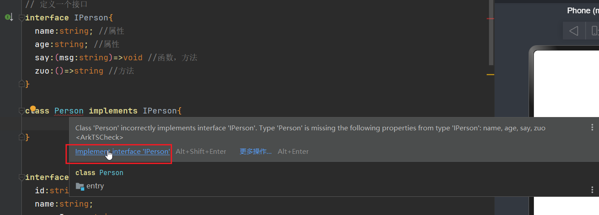

   之后就会变成下面这个代码

```ts
//接口，定义一个接口,接口只是定义了数据类型以及一些函数名字
interface IPerson {
  name: string; //属性
  age: string; //属性
  say: (msg: string) => void //函数，方法
  zuo: () => string //方法
}

//接口实现，类的作用是实现这个接口的具体内容 implements
class Person implements IPerson {
  name: string;
  age: string;

  constructor(name: string, age: string) {
    this.name = name;
    this.age = age;
  }

  say(meg: string) {
  }

  zuo() {
    return ''
  }
}

//继承，他会默认继承父类里的say,zuo方法，以及name和age属性
class SunZi extends Person{
  constructor(name:string,age:string) {
    super(name,age)
  }
}
```


### 4.rcp网络请求的封装

`http-request.ets`

```ts
import rcp from '@hms.collaboration.rcp';

//拦截器
class  MyInterceptor implements rcp.Interceptor{
  intercept(context: rcp.RequestContext, next: rcp.RequestHandler): Promise<rcp.Response> {
    // context 表示请求的上下文
    // next 表示响应
    const url = context.request.url.href;

    //!存在的目的就是强制转换，默认我们的数据是存在的
    context.request.headers!['token']='123' //为网络请求设置请求头

    const promise = next.handle(context); // 获取服务器端的响应结果
    // promise.then((resp) => {
    //   resp.statusCode;
    // });
    return promise;
  }
}

export  class HttpRequest{
  static rcpSession(){
    const session= rcp.createSession({
      baseAddress:'http://172.27.176.1',//网络请求基础地址

      // 网络请求拦截器
      interceptors:[new MyInterceptor()], //网络请求实例化

      // 请求的配置信息
      requestConfiguration:{
        transfer:{
          //超时时间
          timeout:{
            connectMs:5000, //允许建立连接的最长时间，默认是一分钟
            transferMs:5000 //允许传输数据的最长时间，默认是一分钟
          }
        }
      }
    })
    return session;
  }

  static get(url:string){
    return HttpRequest.rcpSession().get(url)
  }

  static post(url:string,data:object){
    return HttpRequest.rcpSession().post(url,data)
  }

  static put(url:string,data:object){
    return HttpRequest.rcpSession().put(url,data)
  }

  static del(url:string){
    return HttpRequest.rcpSession().delete(url)
  }

}
```

`RcpPage.ets`

```ts
import { HttpRequest } from '../utils/http-request';

interface uName {
  userName: string;
  password: string;
}


@Entry
@Component
struct RcpPage {
testLogin(){
    // HttpRequest.get('').then(res=>{ //发送get请求
    //
    // })

    const obj:uName={
      userName:'张三',
      password:'17231'
    }
    HttpRequest.post('/api/v1/auth/login',obj) //发送post请求
      .then(res=>{
        console.log(JSON.stringify(res.toJSON()))
      })
  }
  
   // 生命周期钩子函数，初始化的时候直接调用
  aboutToAppear(): void {
    this.testLogin()
  }
```


### 5.通过rcp上传本地图片(难点!)

#### ①、rcp上传本地图片

```ts
//文件上传
//我们使用rcp传递一个formdata数据、
const session=rcp.createSession()
const formData=new rcp.MultipartForm({
    "file":{
        contentType:'multipart/form-data', //文件类型,设置文件为图片
        contentOrPath:'' //地址或者内容
    }
})
```

#### ②、picker获取本地存储的文件

`注意，一般配合rcp发起网络请求一起使用`

​    picker.DocumentViewPicker()   //文件选择   官方文档:https://developer.huawei.com/consumer/cn/doc/harmonyos-references-V5/js-apis-file-picker-V5

​    文件安全沙箱:https://developer.huawei.com/consumer/cn/doc/harmonyos-guides-V5/share-app-file-V5

`完整代码如下`

```ts
import fs from '@ohos.file.fs'
import picker from '@kit.CoreFileKit'


Button("选择文件") //文件选择
	.onClick(()=>{
    let myPicker=new picker.DocumentViewPicker()  //点击以后创建myPicker实例
     //select 选择手机文件，弹出一个选择框
    myPicker.select({ 
        
    }).then(res=>{
        this.imgSrc=res[0] //获取到选择的结果，是一个数组
        // res是一个数组，这个数组中包含了我们选择的文件的路径信息
        // 此处会涉及到系统的文件权限问题
        // 系统中的文件可以分为以下几类
        // - 系统文件
        // - 用户文件
        // - app的文件
        // 文件安全沙箱，我们需要把对应的文件进行一些处理之后，存放在可以被app访问的位置进行操作
        
        // 文件上传
        // 使用rcp传递一个formdata数据
        
        // 把用户的文件存储在app的临时目录中
        // 需要先获取临时目录
        let context=getContext() //context 表示当前上下文
        
        // destPath 我的目标地址
        const file=fs.openSync(this.imgSrc) //打开图片，获取图片赋值给file
        // 每一个file都有一个fd属性，这个是文件的唯一值，我们操作文件的时候可以使用这个fd
        
        const destPath=context.cacheDir+"/avatar.jpg" //context.cacheDir缓存目录
        //设置了一个路径，用来临时存储我的文件，缓存目录中存储我的文件，存储的文件叫avatar.jpg
        fs.copyFileSync(file.fd,destPath) //把原文件复制到缓存目录中，文件拷贝
        //第一个参数表示原文件，第二个参数表示目标地址
        
        //rcp发起网络请求
        const session=rcp.createSession()
        const formData=new rcp.MultipartForm({
            "file":{
                contentType:'image/png', //文件类型,设置文件为图片
                contentOrPath:destPath //地址或者内容,目标是缓存目录地址
            }
})
        //然后把缓存目录的图片直接调用接口上传即可
        session.post('http://192.168.14.70:1337/api/v1/common/upload_file',formData)
        	.then(res=>{
            console.log('文件上传成功！')
            //res.json()
        })
    })
})
```


#### ③、文件上传代码封装

`tools.rts`

```ts
import fs from '@ohos.file.fs'
import picker from '@kit.CoreFileKit'

// 文件上传  context上下文传入,cb是一个回调函数,返回一个结果
export funciton uploadFile(context:common.UIAbilityContext,cb:(str:string)=>void){
     let myPicker=new picker.DocumentViewPicker()  //点击以后创建myPicker实例
     //select 选择手机文件，弹出一个选择框
    myPicker.select({ 
        
    }).then(res=>{
        // this.imgSrc=res[0] //获取到选择的结果，是一个数组
        // res是一个数组，这个数组中包含了我们选择的文件的路径信息
        // 此处会涉及到系统的文件权限问题
        // 系统中的文件可以分为以下几类
        // - 系统文件
        // - 用户文件
        // - app的文件
        // 文件安全沙箱，我们需要把对应的文件进行一些处理之后，存放在可以被app访问的位置进行操作
        
        // 文件上传
        // 使用rcp传递一个formdata数据
        
        // 把用户的文件存储在app的临时目录中
        // 需要先获取临时目录
        
        // destPath 我的目标地址
        const file=fs.openSync(res[0]) //打开图片，获取图片赋值给file
        // 每一个file都有一个fd属性，这个是文件的唯一值，我们操作文件的时候可以使用这个fd
        
        const destPath=context.cacheDir+"/avatar.jpg" //context.cacheDir缓存目录
        //设置了一个路径，用来临时存储我的文件，缓存目录中存储我的文件，存储的文件叫avatar.jpg
        fs.copyFileSync(file.fd,destPath) //把原文件复制到缓存目录中，文件拷贝
        //第一个参数表示原文件，第二个参数表示目标地址
        
        //rcp发起网络请求
        const session=rcp.createSession()
        const formData=new rcp.MultipartForm({
            "file":{
                contentType:'image/png', //文件类型,设置文件为图片
                contentOrPath:destPath //地址或者内容,目标是缓存目录地址
            }
})
        //然后把缓存目录的图片直接调用接口上传即可
        session.post('http://192.168.14.70:1337/api/v1/common/upload_file',formData)
        	.then(res=>{
            console.log('文件上传成功！')
            const data=res.toJSON()!['data'] as string
            cb(data)
        })
    })
})
}
```

`index.ets`页面使用的时候如下:

```ts
Button("选择文件") //文件选择
	.onClick(()=>{
    let context=getContext() as common.UIAbilityContext
    uploadFile(context,(str)=>{
        //调用文件上传服务
        this.imgSrc=dalImage(str)
    })
}
```


## 七、navigation组件导航跳转页面(推荐)

  从API Version 10开始，推荐使用[NavPathStack](https://developer.huawei.com/consumer/cn/doc/harmonyos-references-V5/ts-basic-components-navigation-V5#navpathstack10)配合navDestination属性进行页面路由。

### 1.navigation方式主页面跳转

 Navigation(){}    //组件导航 需要放在最外层

.toolbarConfiguration([{   //设置底部导航

```ts
import { promptAction } from '@kit.ArkUI'

@Entry
@Component
struct Index {
  build() {
      //组件导航 需要放在最外层
    Navigation(){
      Column(){
        Text('五河士道')
        Text('五河琴里')
        Text('时崎狂三')
      }
    }
    .toolbarConfiguration([{ //设置底部导航
      value:'首页', //文字
      //行为，类似点击事件
      action:()=>{
        promptAction.showToast({
          message:'首页'
        })
      },
      icon:'', //没有点击时候的小图标
      activeIcon:'', //点击以后的小图标
    },{
      value:'列表' //底部导航的内容2
    },{
      value:'论坛' //底部导航的内容3
    },{
      value:'我的' //底部导航的内容4
    }])
      .title('我的牧场') //标题
    .hideTitleBar(true) //隐藏标题栏
  }
}
```


### 2.navDestination子页面以及页面跳转

 .navDestination(this.PageMap) //设置二级页面

pathStack:NavPathStack=new NavPathStack() // 创建一个页面栈对象

 NavDestination(this.pathStack){ //绑定页面栈对象

```ts
import { promptAction } from '@kit.ArkUI'

interface IListPageParams{
  id:number;
  name:string;
  age:number;
}

// 列表页
@Component
struct ListPage{
    // 创建一个页面栈对象并传入Navigation
  pathStack:NavPathStack=new NavPathStack()
    
  build() {
  //所有的子页面都需要在最外层包含NavDestination这个节点
    NavDestination(this.pathStack){ //绑定页面栈对象
      Column(){
        Text('列表页')
      }
    }
    .title('列表页') //标题
    .onReady((context)=>{ //读取上下文
      this.pathStack=context.pathStack //从上下文中获取pathStack参数，这个数据一定要和第一个的页面的数据对应上

      this.pathStack.getParamByName('ListPage') //获取ListPage里面的参数，是obj那个对象的值
      // 可以用来获取参数
    })
  }
}

@Entry
@Component
struct Index {

  // 创建一个实例，用来绑定当前的页面
  pathStack:NavPathStack=new NavPathStack()

  //定义PageMap函数，点击跳转以后触发这个函数
  @Builder
  PageMap(name: string) {
    if (name === "ListPage") {
      //设置对应的页面
      ListPage() //展示组件
    } else if (name === "NavDestinationTitle2") {

    } else if (name === "NavDestinationTitle3") {

    }
  }

  build() {
    Navigation(this.pathStack){
      Column(){
        Text('五河士道')
        Text('五河琴里')
        Text('时崎狂三')
        Button('去列表页')
          .onClick(()=>{
            const obj:IListPageParams={
              id:10001,
              name:'我爱你五河琴里',
              age:18
            }
            // 通过上面创造的实例，跳转到指定的页面，会执行绑定PageMap函数
            this.pathStack.pushPath({
              name:'ListPage',
              param:obj //传参，把obj这个对象的参数通过param传到二级菜单里面去
            })
          })
      }
    }
    .toolbarConfiguration([{ //设置底部导航
      value:'首页', //文字
      //行为，类似点击事件
      action:()=>{
        promptAction.showToast({
          message:'首页'
        })
      },
      icon:'', //没有点击时候的小图标
      activeIcon:'', //点击以后的小图标
    },{
      value:'列表'
    },{
      value:'论坛'
    },{
      value:'我的'
    }])
      .title('我的牧场') //标题
    // .hideTitleBar(true) //隐藏标题栏
    .navDestination(this.PageMap) //设置二级页面
    //页面跳转，点击以后触发PageMap函数
  }
}
```


### 3.tabs选项卡切换

   this.pathStack.clear() //清空路由栈，直接回首页

   status:ToolbarItemStatus.ACTIVE //默认选中这个路由

`Tabs()  //选项卡`

`TabContent()  //每一个选项卡的内容`

`.scrollable(false) //禁止滑动切换`

 `@State tanIndex:number=0   //索引，默认为第一个页面，通过索引切换路由页面`

`TabsController  //是Tabs组件的控制器，用于控制Tabs组件进行内容页切换`

` controller:this.tabController //和控制器绑定`

`this.tabController.changeIndex(0) //通过控制器切换到第0个页面`

.onReady((context) //子页面执行

完整代码如下:

`index.ets`主页面

```ts
import { promptAction } from '@kit.ArkUI'
import {ListPageView} from '../views/ListPageView'
import {DetailPageView} from '../views/DetailPageView'

interface IListPageParams{
  id:number;
  name:string;
  age:number;
}


@Entry
@Component
struct Index {
  //索引，默认为第一个页面，通过索引切换路由页面
  @State tanIndex:number=0 

  // 创建一个实例，用来绑定当前的页面
  pathStack:NavPathStack=new NavPathStack()
    
  // 控制器 TabsController是Tabs组件的控制器，用于控制Tabs组件进行内容页切换
  tabController:TabsController=new TabsController()

  //定义PageMap函数，点击跳转以后触发这个函数
  @Builder
  PageMap(name: string) {
    // 根据传递的name属性展示对应的页面组件
    if (name === "ListPage") {
      //设置对应的页面
      ListPageView() //展示组件
    } else if (name === "DetailPage") {
      DetailPageView()
    } else if (name === "IndexPage") {
      Index()
    }
  }

  build() {
    Navigation(this.pathStack){
      Column(){
        Tabs({  //选项卡
          controller:this.tabController //通过一个controller属性实现组件和一个变量的绑定
          // 然后我们就可以通过这个变量操作组件的一些行为
        }){
          TabContent(){  //每一个选项卡的内容
            Column(){
              Text('时崎狂三')
              Button('去列表页')
                .onClick(()=>{
                  const obj:IListPageParams={
                    id:10001,
                    name:'我爱你五河琴里',
                    age:18
                  }
                  // 通过上面创造的实例，跳转到指定的页面，会执行绑定PageMap函数
                  this.pathStack.pushPath({
                    name:'ListPage',
                    param:obj //传参，把obj这个对象的参数通过param传到二级菜单里面去
                  })
                })
            }
          }
          TabContent() {
            Text('五河琴里')
          }
          TabContent() {
            Text('五河士道')
          }
          TabContent() {
            Text('鸢一折纸')
          }
        }
        .scrollable(false) //禁止滑动切换


      }
    }
    .toolbarConfiguration([{ //设置底部导航
      value:'首页', //文字
      //行为，类似点击事件
      action:()=>{
        promptAction.showToast({
          message:'首页'
        })
        this.tabController.changeIndex(0) //点击切换选项卡为第一个
        this.tanIndex=0

      },
      icon:$rawfile('image/花火4k.ico'), //没有点击时候的小图标
      activeIcon:$rawfile('image/花火4k.ico'), //点击以后的小图标
      status:this.tanIndex==0?ToolbarItemStatus.ACTIVE:ToolbarItemStatus.NORMAL, //默认选中这个路由
      //rawfile这个资源文件夹进行打包的时候,他不会打包到主文件里面，而是作为资源文件进行拷贝
    },{
      value:'列表',
      icon:$rawfile('image/logo.ico'), //没有点击时候的小图标
      activeIcon:$rawfile('image/logo.ico'), //点击以后的小图标
      // activeSymbolIcon: {}, //更改选中的颜色
      status:this.tanIndex==1?ToolbarItemStatus.ACTIVE:ToolbarItemStatus.NORMAL, //默认选中这个路由
      action:()=>{
        this.tabController.changeIndex(1) //点击切换选项卡为第二个
        this.tanIndex=1
      }
    },{
      value:'论坛',
      icon:$rawfile('image/god.ico'), //没有点击时候的小图标
      activeIcon:$rawfile('image/god.ico'), //点击以后的小图标
      action:()=>{
        this.tabController.changeIndex(2) //点击切换选项卡为第三个
        this.tanIndex=2
      },
      status:this.tanIndex==2?ToolbarItemStatus.ACTIVE:ToolbarItemStatus.NORMAL, //默认选中这个路由
    },{
      value:'我的',
      icon:$rawfile('image/favicon.ico'), //没有点击时候的小图标
      activeIcon:$rawfile('image/favicon.ico'), //点击以后的小图标
      action:()=>{
        this.tabController.changeIndex(3) //点击切换选项卡为第四个
        this.tanIndex=3
      },
      status:this.tanIndex==3?ToolbarItemStatus.ACTIVE:ToolbarItemStatus.NORMAL, //默认选中这个路由
    }])
      .title('我的牧场') //标题
    // .hideTitleBar(true) //隐藏标题栏
    .navDestination(this.PageMap) //设置二级页面
    //页面跳转，点击以后触发PageMap函数
  }
}
```

`ListPageView.ets`二级页面

.onReady

this.pathStack=context.pathStack 

 this.pathStack.getParamByName('ListPage')

  this.pathStack.pushPath({}） 绑定一个名字

```ts
// 列表页
@Component
export  struct ListPageView{
  pathStack:NavPathStack=new NavPathStack()
  build() {
    //所有的子页面都需要在最外层包含NavDestination这个节点
    NavDestination(){
      Column(){
        Text('列表页')
        Button('去详情页')
          .onClick(()=>{
            this.pathStack.pushPath({
              name:'DetailPage'
            })
          })
      }
    }
    .title('列表页') //标题
    .onReady((context)=>{
      this.pathStack=context.pathStack //从上下文中获取pathStack参数，这个数据一定要和第一个的页面的数据对应上

      this.pathStack.getParamByName('ListPage') //获取ListPage里面的参数，是obj那个对象的值
      // 可以用来获取参数
    })
  }
}
```

`DetailPageView.ets`

```ts
// 列表页
@Component
export  struct DetailPageView{
  pathStack:NavPathStack=new NavPathStack()
  build() {
    //所有的子页面都需要在最外层包含NavDestination这个节点
    NavDestination(){
      Column(){
        Text('详情页')
        Button('回首页')
          .onClick(()=>{
            this.pathStack.clear() //清空路由栈，直接回首页
            // this.pathStack.popToIndex(-1) //使用-1好像可以回到首页
          })
      }
    }
    .title('详情页') //标题
    .onReady((context)=>{
      this.pathStack=context.pathStack //从上下文中获取pathStack参数，这个数据一定要和第一个的页面的数据对应上

      this.pathStack.getParamByName('ListPage') //获取ListPage里面的参数，是obj那个对象的值
      // 可以用来获取参数
    })
  }
}
```


## 八、模块化开发

```
https://developer.huawei.com/consumer/cn/doc/harmonyos-guides-V5/hap-package-V5
```

### 1.HAR静态共享包

   静态共享包可以作为三方库，供其他应用使用。

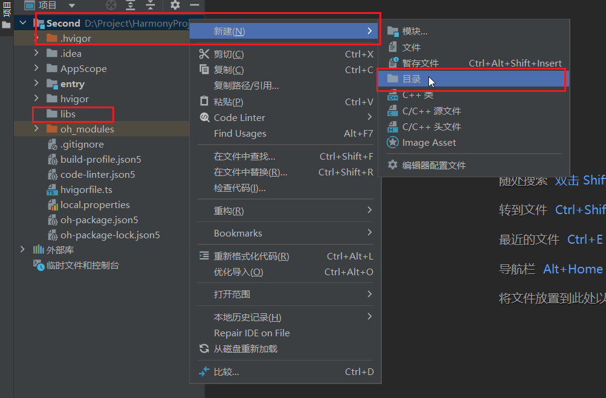

然后右击libs文件夹，新建一个模块

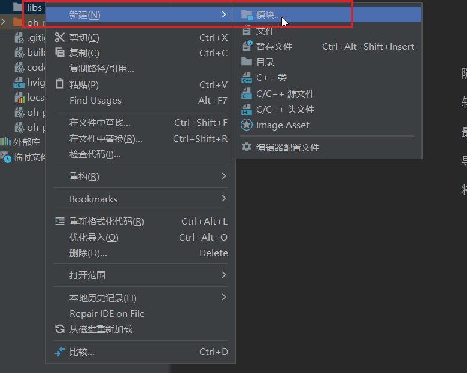

选择Static Library静态页面，命名为lznb_tools文件

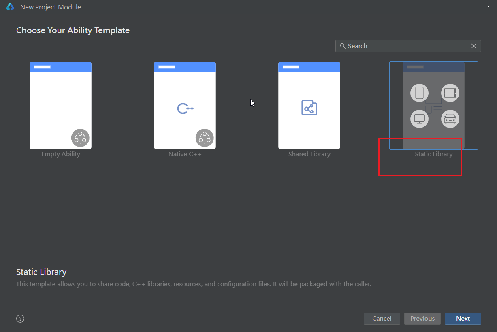


文件夹内是这样子的，主要关注index.ets和ets下的文件


  在这里，创建了PostDetailPage和PostsPage以及uitls下的tools文件，这里的都是组件，通过export导出。

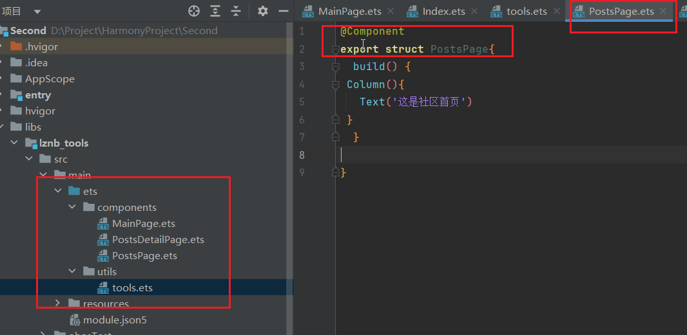

然后关注index这个文件，这个文件下都是要导出模块的组件

```ts
// 导出这个文件
export { MainPage } from './src/main/ets/components/MainPage'
export {PostsDetailPage} from './src/main/ets/components/PostsDetailPage'
export {PostsPage} from './src/main/ets/components/PostsPage'
export {sum} from './src/main/ets/utils/tools'
```

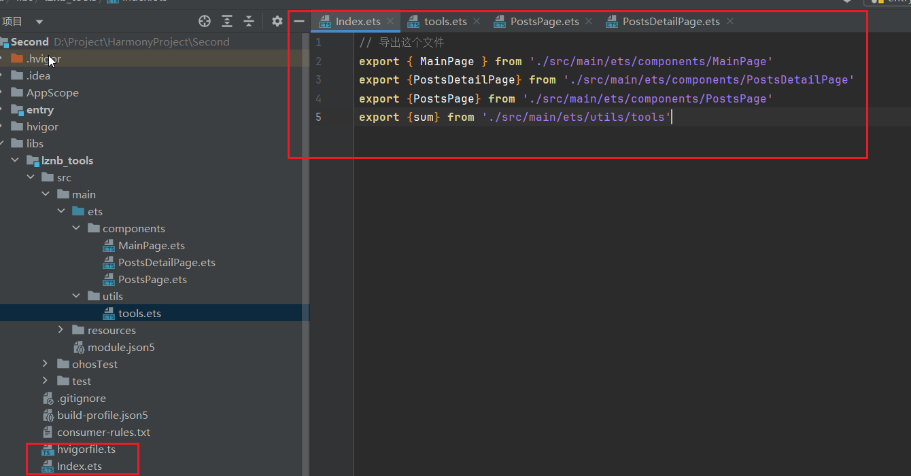

然后，我们选择lznb_tools文件夹，在最上方构建那里，选择构建模块

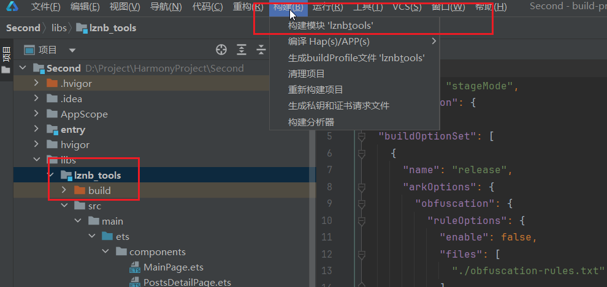

构建完毕以后，会自动生成一个build文件夹，lznb_tools.har就是我们的静态资源文件

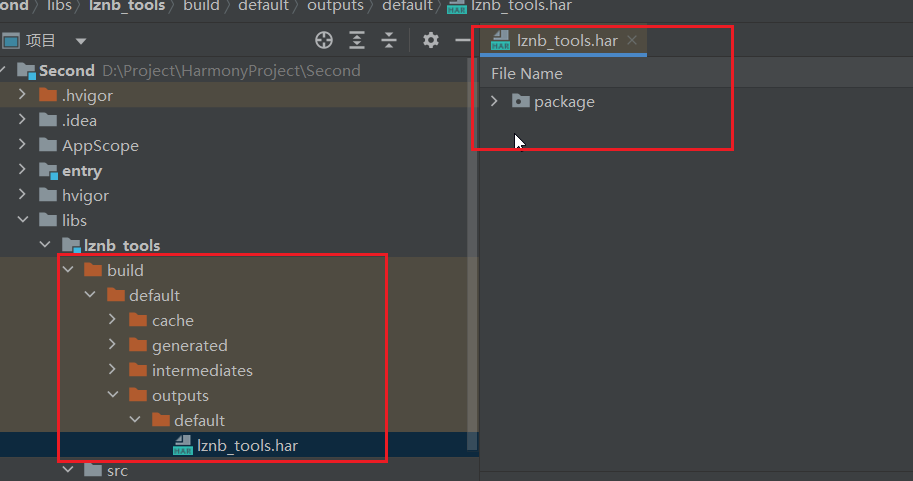

 然后我们回到需要静态资源文件的文件夹，找到oh-package.json5，在里面添加依赖项,选择那个需要导入的静态资源文件

```json
{
  "name": "entry",
  "version": "1.0.0",
  "description": "Please describe the basic information.",
  "main": "",
  "author": "",
  "license": "",
  //依赖项
  "dependencies": {
    '@lznb/tools': 'file:../libs/lznb_tools' //静态资源文件地址
     //@lznb/tools 名字随便取，可以构建就行
     //file:..要加，这个代表本地资源文件夹，当前资源文件系统
  }
}
```


 然后点击右上角，重新构建

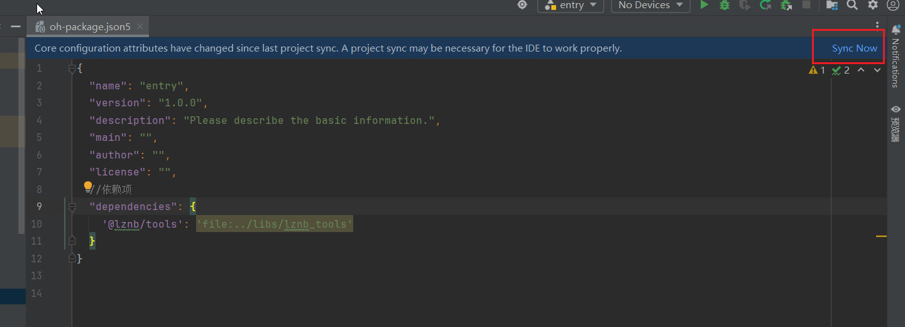

  然后就可以了，在自己的页面直接引入模块的那个组件，直接使用即可

```ts
// 引入模块
import {sum,PostsPage} from '@lznb/tools' //sum是一个方法，用的时候当组件方法使用就行

//用的时候直接
PostsPage() //PostsPage是一个页面组件，可以直接展示
```


### 2.HSP动态共享包

​    HSP不支持独立发布，而是跟随其宿主应用的APP包一起发布，与宿主应用同进程，具有相同的包名和生命周期。

   动态共享包就是创建模块的时候选择Shared library

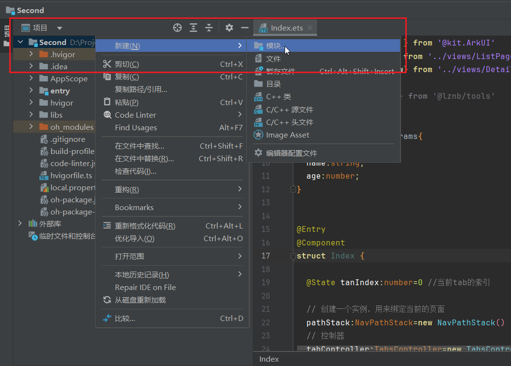

选则第三个

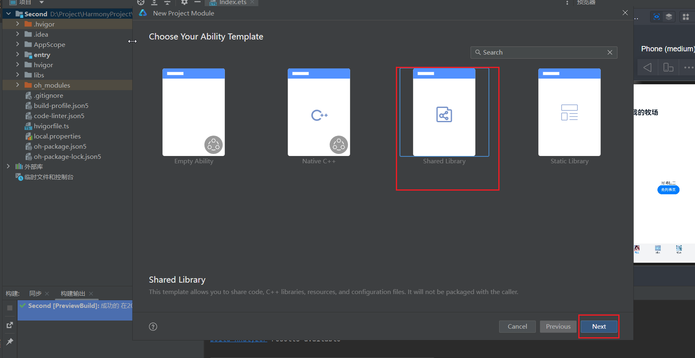

然后名称随便取，这里叫My_toolkits。步骤和前面的静态资源包一样，只不过构建模块后，出现的文件夹是下面这个样子的。多了两个文件。

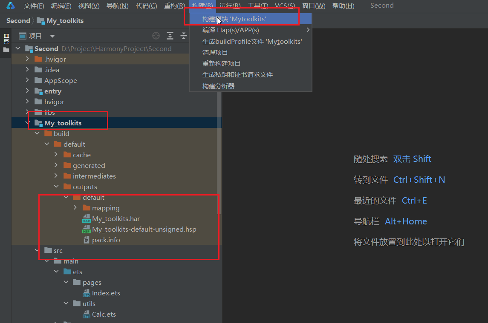

引入的时候也是一样的，在要用的页面，在oh-package.json5加上导入的名字和路径.

```json
{
  "name": "entry",
  "version": "1.0.0",
  "description": "Please describe the basic information.",
  "main": "",
  "author": "",
  "license": "",
  //依赖项
  "dependencies": {
    '@lznb/tools': 'file:../libs/lznb_tools',
    'mytoolkits': 'file:../libs/lznb_tools'
  }
}
```

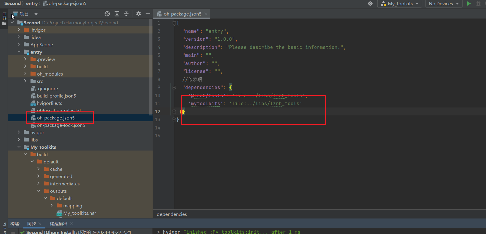

  使用的时候和静态资源包一样使用即可


## 九、web网页嵌套

### 1.使用web网页加载详情页

` resourtces-rawfile资源文件夹`

  rawfile当作资源文件夹使用，它里面的文件不会被压缩，不会被合并，不会被编译。放的是什么就是什么，不能再resourtces文件夹里面新增别的文件夹，可以再rawfile里面创建新的文件夹


webController:WebviewController=new webview.WebviewController   //实例对象

src:$rawfile('web/goods.html')    //网页的地址

controller:this.webController    //绑定实例对象

```ts
//!DevEco Studio里面的代码

@Component
export struct HomeView {
		webController:WebviewController=new webview.WebviewController //实例对象
 Column(){
        Web({
          src:$rawfile('web/goods.html'), //网页的地址
          controller:this.webController //绑定实例对象
        })
     		/* .javaScriptAccess(true)
               .javaScriptProxy({
                controller:this.webController,
                methodList:[],
                object:{},
                name:'myNative'
            })*/
            .onPageEnd(() => { //生命周期钩子函数，页面加载完成后执行
              //在原生app的代码中调用网页的方法进行处理
              this.webController.runJavaScript('loadProductData(56)') //执行vscode的网页代码方法
            })
      }
```


### 2.网页调试工具vConsole

  官方地址:https://github.com/Tencent/vConsole   //vConsole是一个移动端调试网页的工具

`在vscode中使用`

 src="https://unpkg.com/vconsole@latest/dist/vconsole.min.js"   //引入

 var vConsole = new window.VConsole();    //实例对象

```html
//!VS Code中的代码

<body>
    <div id="content"></div>
    <script src="https://unpkg.com/vconsole@latest/dist/vconsole.min.js"></script> //引入vConsole
    <script>
      var vConsole = new window.VConsole(); //实例对象
        
      const tagContent = document.querySelector("#content");
      function loadProductData(id) {
        fetch("http://192.168.14.46:1337/api/v1/products/" + id)
          .then((res) => res.json())
          .then((res) => {
            tagContent.innerHTML = res.data.content;
          });
      }
      //   loadProductData(56);
    </script>
  </body>
```


## 十、数据本地存储

### 1.用户首选项实现数据持久化(不推荐)

  官方文档:https://developer.huawei.com/consumer/cn/doc/harmonyos-guides-V5/data-persistence-by-preferences-V5#%E5%BC%80%E5%8F%91%E6%AD%A5%E9%AA%A4

```ts
import { preferences } from '@kit.ArkData'; //导入
import { UIAbility } from '@kit.AbilityKit';
import { BusinessError } from '@kit.BasicServicesKit';
import { window } from '@kit.ArkUI';

//所有的读取存取删除，都是在dataPreferences变量上执行的
let dataPreferences: preferences.Preferences | null = null; 

class EntryAbility extends UIAbility {
  onWindowStageCreate(windowStage: window.WindowStage) {
    let options: preferences.Options = { name: 'myStore' };
    dataPreferences = preferences.getPreferencesSync(this.context, options);
  }
}
```


### 2.kvstorage通过键值型数据库实现数据持久化(推荐)

​    键值型数据库存储的数据也是永久的，但是相比较首选项来说，存取的数据更多更高级。

​    官方文档:https://developer.huawei.com/consumer/cn/doc/harmonyos-guides-V5/data-persistence-by-kv-store-V

​    ①.首先在ets文件夹下新建一个tools.ets文件

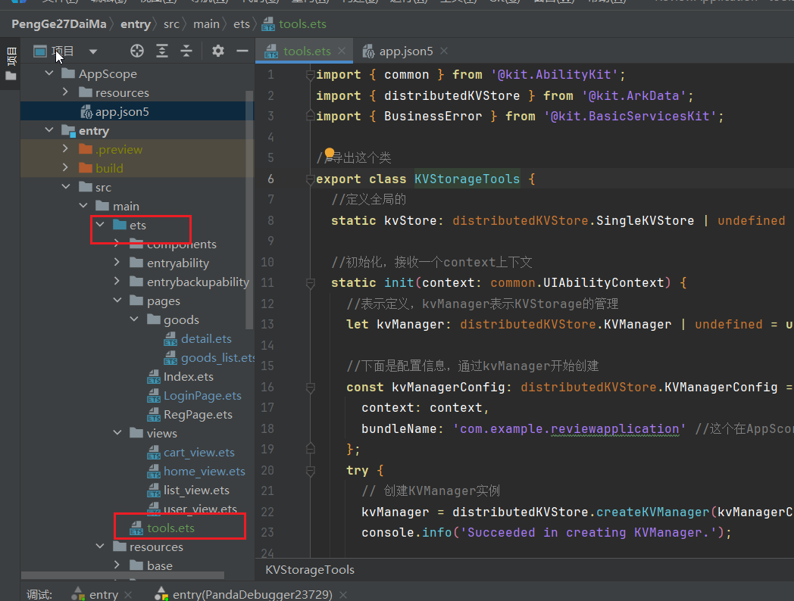

文件的代码如下:

```ts
import { common } from '@kit.AbilityKit';
import { distributedKVStore } from '@kit.ArkData';
import { BusinessError } from '@kit.BasicServicesKit';

//4.最后导出这个类
export class KVStorageTools {
  //定义全局的变量kvStore
  static kvStore: distributedKVStore.SingleKVStore | undefined = undefined;

  //1.首先初始化，接收一个context表示上下文
  static init(context: common.UIAbilityContext) {
      
    //表示定义一个kvManager,表示KVStorage的管理
    let kvManager: distributedKVStore.KVManager | undefined = undefined;

    //下面是配置信息，通过kvManager开始创建
    const kvManagerConfig: distributedKVStore.KVManagerConfig = {
      context: context,
        
     //这个在AppScore里面的app.json5里面有一个bundleName，是唯一的
      bundleName: 'com.example.reviewapplication' 
    };
    try {
        
      // 创建KVManager实例
      kvManager = distributedKVStore.createKVManager(kvManagerConfig);
      console.info('Succeeded in creating KVManager.');

      // let kvStore: distributedKVStore.SingleKVStore|undefined=undefined; //定义局部的变量kvStore
      try {
        const options: distributedKVStore.Options = {
          createIfMissing: true,
          encrypt: false,
          backup: false,
          autoSync: false,
            
          // kvStoreType不填时，默认创建多设备协同数据库
          kvStoreType: distributedKVStore.KVStoreType.SINGLE_VERSION,
          // 多设备协同数据库：kvStoreType: distributedKVStore.KVStoreType.DEVICE_COLLABORATION,
          securityLevel: distributedKVStore.SecurityLevel.S1
        };
        kvManager.getKVStore<distributedKVStore.SingleKVStore>('storeId', options,
          (err, store: distributedKVStore.SingleKVStore) => {
            if (err) {
              console.error(`Failed to get KVStore: Code:${err.code},message:${err.message}`);
              return;
            }
            console.info('Succeeded in getting KVStore.');

            //全局变量进行赋值，以上的操作都是为了创建kvStore,创建好以后，后面就可以使用了
            KVStorageTools.kvStore = store;
            
            // 请确保获取到键值数据库实例后，再进行相关数据操作
          });
        // 继续创建获取数据库
      } catch (e) {
        let error = e as BusinessError;
        console.error(`Failed to create KVManager. Code:${error.code},message:${error.message}`);
      }
    }catch (e) {
      let error = e as BusinessError;
      console.error(`Failed to create KVManager. Code:${error.code},message:${error.message}`);
    }
  }

  //2.然后进行存入数据，通过put存
  static setData(key: string, val: string) {
    try {
      //调用put方法存数据
      KVStorageTools.kvStore!.put(key, val, (err) => {
        if (err !== undefined) {
          console.error(`Failed to put data. Code:${err.code},message:${err.message}`);
          return;
        }
        console.info('Succeeded in putting data.');
      });
    } catch (e) {
      let error = e as BusinessError;
      console.error(`An unexpected error occurred. Code:${error.code},message:${error.message}`);
    }
  }

  //3.这里开始取出数据，通过get取
  static getData(key: string, cb: (str: string)=>void) {
  //调用get方法获取存的数据，data就是我们的数据
    KVStorageTools.kvStore?.get(key,(err, data) =>{
      //调用回调函数cb,然后把data传出去
      cb(data as string)
    })
  }
    
  //4.这里删除token,退出登录。调用delete方法，删除键值对
  static removeData(key:string){
      KVStorageTools.keStore?.delete(key,(err)=>{ //key就是键
          if(err){ //err是没有删除成功，如果没删除成功，执行这个if
              promptAction.showToast({
                  message:err.message
              })
              return
          }
          return
      }) 
  }
}
```

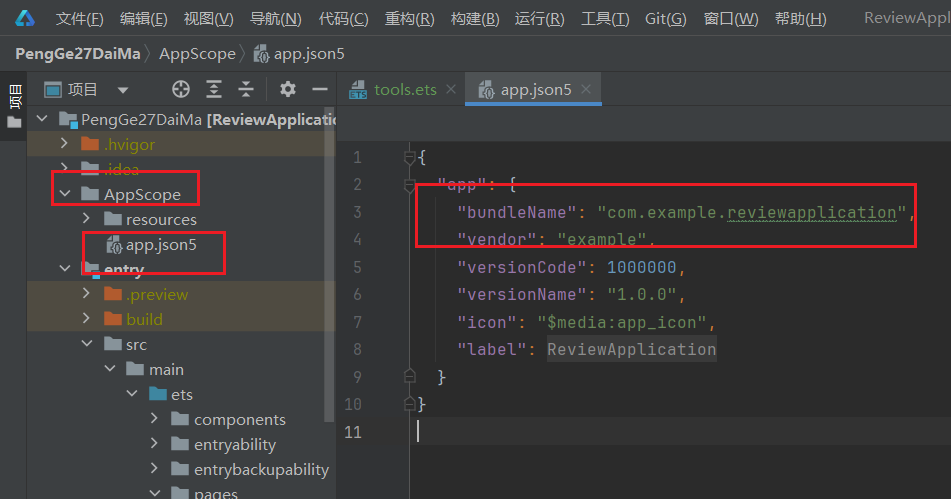

  ②.上面数据库创建完毕以后，我们在页面中通过下面的方法进行本地数据的存取

  KVStorageTools.setData("token", res.data)    //本地数据库存入,存一个键值对，键名token，值是res.data

  KVStorageTools.getData("token", res=>{})    //本地数据库取出,取出键值对，键名是token

页面完整代码如下:

```ts
import { promptAction, router } from '@kit.ArkUI';
import { Logo } from '../components/logo';
import { KVStorageTools } from '../tools';
import { rcp } from '@kit.RemoteCommunicationKit';

interface ResponseBody{
  code: string;
  data: string;
}

function loginAPI(userName: string, password: string) {
  let session = rcp.createSession()
  return session.post("http://192.168.14.46:1337/api/v1/auth/login", {
    userName: userName,
    password: password
  })
    .then(res=>res.toJSON() as ResponseBody)
}

@Entry
@Component
struct LoginPage {
  @State isAllowRules: boolean = false
  @State userName: string = ''
  @State password: string = ''

  aboutToAppear(): void {
    // KVStorageTools.getData("token", res=>{
    //   console.log(res) 2.初始化的时候取出token数据
    // })
  }

  build() {
    Column({
      space: 8
    }) {
      Logo()
      TextInput({
        placeholder: '请输入用户名',
        text: $$this.userName
      })
        .borderRadius(4)
      TextInput({
        placeholder: '请输入密码',
        text: $$this.password
      })
        .type(InputType.Password)
        .borderRadius(4)
        // .backgroundColor("#cc99cc")

      Row(){
        Checkbox()
          .shape(CheckBoxShape.ROUNDED_SQUARE)
          .select(this.isAllowRules)
          .onChange(v=>{
            this.isAllowRules = v
          })
        Text("是否同意用户协议?")
          .fontSize(12)
          .onClick(()=>{
            this.isAllowRules = !this.isAllowRules
          })
      }
      .width('100%')
      .justifyContent(FlexAlign.End)

      Button("登录")
        .width('75%')
        .type(ButtonType.Normal) // 形状
        .onClick(()=>{

          if(this.isAllowRules) {
            if(this.userName && this.password) {
              loginAPI(this.userName, this.password)
                .then(res=>{
                  if(res.code == "1") {
                    promptAction.showToast({
                      message: '登录成功'
                    })
                    KVStorageTools.setData("token", res.data) //1.设置，点击登录以后设置一个token数据
                  } else {
                    promptAction.showToast({
                      message: res.data
                    })
                  }
                })

            } else {
              promptAction.showToast({
                message: '请输入登录信息'
              })
            }
          } else {
            promptAction.showToast({
              message: '请勾选用户协议'
            })
          }
        })
        
        Button('退出登录')
        	.onClick(()=>{
            KVStorageTools.removeData('token') //退出登录，删除token
            this.token='' //置空
        })

      Text("没有账号，我要注册!!!")
        .width('100%')
        .textAlign(TextAlign.End)
        .fontSize(14)
        .fontColor('#999')
        .onClick(()=>{
          router.pushUrl({
            url: 'pages/RegPage'
          })
        })
    }
    .height('100%')
    .width('100%')
    .padding(12)
  }
}
```

③.上面操作完还是拿不到数据，因为还需要在EntryAbility.ets中进行数据库初始化

```ts
//初始化
KVStorageTools.init(this.context)
```


也可以在这里初始化，`推荐在onCreate处进行初始化`

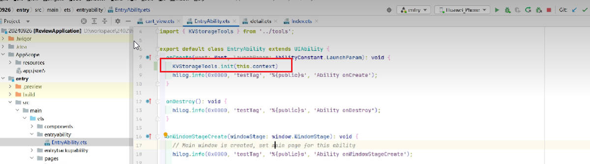


④.使用本地存储获取token的话，发请求的时候需要在里面设置请求头

  headers:{
            token:KVStorageTools.getData('token')  //获取请求头的token
        }

`代码如下:`

```ts
aboutToAppear():void{
    KVStorageTools.getData('token',res=>{ //获取请求头的token，res就是获取到的值
      const session= rcp.createSession({
      baseAddress:'http://172.27.176.1',//网络请求基础地址
        headers:{
            token:res //res赋值给token
        }
      // 请求的配置信息
      requestConfiguration:{
        transfer:{
          //超时时间
          timeout:{
            connectMs:5000, //允许建立连接的最长时间，默认是一分钟
            transferMs:5000 //允许传输数据的最长时间，默认是一分钟
          }} }})
    session.get('/api/v1/produvts',)
      .then(res=>{
       const list= res.toJSON()!['data'] as Goods[] //res.toJSON可能不存在，可能为null，加感叹号表示一定存在是一个对象。toJSON表示返回的数据转换为一个对象
        console.log(list.length+'')
      })
})
}
```

