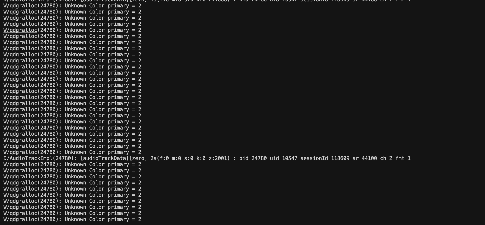

## flutter开发中遇到的一些问题

### 1.如何去除终端不想要的信息

使用flutter run | grep "I/flutter"

### 2. flutter连接安卓设备的2种办法

#### 一、第一种usb连接

直接把安卓设备插上usb数据线，然后开启设备的开发者模式，就可以使用命令

flutter devices 查看当前可连接设备

flutter run 直接运行在真机上面

#### 二、无限远程调试

1.首先开启安卓设备的开发者模式，开启开发者模式中的无限远程调试模式

2.安卓设备和电脑需要同时处在1个Wi-Fi网络中，开启以后，无限远程调试页面会出现一个ip地址和端口号，这个是后续连接时用的

3.点击安卓设备的配队码，会弹出一个框，框里有ip地址和5位数的配队码。ip地址大概是这样192.168.1.111:5555

4.使用adb pair连接配队码，具体格式如下:adb pair 192.168.1.111:5555 ,可以带端口号也可以不带，这边建议不带，直接使用adb pair 192.168.1.111即可

5.一般只要处于同一个网络，即使是手机热点，这个时候也配队成功了。

6.还记得刚开始页面出现的ip地址和端口号吗？这个时候我们使用adb connect 192.168.1.111,就可以连接上安卓设备了

7.使用adb devices 可以查看当前连上了哪些设备

👉 建议：无线调试比 USB 不稳定，尤其是热点环境下，掉线可以重新 adb connect。

### 3.安卓语言程序的报错

我在使用flutter开发代码过程中，应用程序崩溃的时候，flutter的catch并不会显示报错信息，即使是命令行也不显示。

解决办法是，打开android studio，在android studio的命令行可以看报错日志，那里有更详细的报错信息。

**⚠️注意，安卓的报错请使用android studio来查看报错信息，vscode是显示不了语言程序崩溃问题的**

​	在 Flutter 开发中，如果是 Dart 层 抛出的异常（比如 Future 的 catchError、try...catch 里的错误），VS Code 或 flutter run 的控制台都能捕获并显示。但如果是 Android 原生层（Java/Kotlin/NDK）崩溃，那就不是 Dart 可以捕获的了：

​	Flutter 的日志只会打印一行模糊的 Lost connection to device 或 Exited (sigterm)。

​	真正的 Crash 堆栈信息 需要在 Android Studio 的 Logcat 里查看。

​	👉 解决办法：

- 打开 Android Studio，进入 Logcat。
- 选择对应的运行设备（真机/模拟器）。
- 在 Logcat 搜索 E/AndroidRuntime，能看到完整的 Java/Kotlin 崩溃堆栈。
- 如果是 Native 层（C/C++），会有 signal 11 (SIGSEGV) 之类的信息，也都在 Logcat。

⚠️ VS Code 的终端只负责 Flutter/Dart 的日志，不会显示系统级的原生崩溃。

### 4. iOS 真机调试常见问题
  现象：flutter run 无法在 iPhone 真机运行，提示 codesign 或 provisioning profile 错误
  原因：iOS 需要开发者证书与描述文件支持

  👉 解决办法：

- 打开 Xcode → 选中项目 → Signing & Capabilities
- 勾选 "Automatically manage signing"，选择 Apple ID
- 确保手机已信任 Mac 的开发者证书

### 5.插件在 iOS/Android 表现不一致
    现象：同一个插件，Android 正常，iOS 出错（或反过来）
    原因：插件内部调用原生 API，而两个平台差异大

    👉 解决办法：

- 查看插件 issue 列表，确认是否为已知 bug
- 必要时自己写 平台通道 (MethodChannel) 来桥接原生 API

### 6. 内存泄漏 / 性能问题
    现象：长时间运行 App 卡顿、内存暴涨
    👉 排查办法：
- 使用 flutter devtools → Memory/Performance 分析
- 检查 ListView/GridView 是否正确使用 builder 形式
- 检查是否有 Stream/Controller 未关闭