# 1. 了解搜索技术

## 1.1.   什么是搜索

什么是搜索， 计算机根据用户输入的关键词进行匹配，从已有的数据库中摘录出相关的记录反馈给用户。 

 

线性匹配：

select * from item where title like ’%小米%‘


## 1.2.   新业务需求

比如，用户在百度文本框中输入，“吃饭睡觉写程序”，会出现的以下结果：


从结果可以看出，百度搜索具备以下明显特点：

   1、即使在相关结果数量接近3600万时，也能快速得出结果。

   2、搜索的结果不仅仅局限于完整的“吃饭睡觉写程序”这一短语，而是将此短语拆分成，“写程序”，“吃饭”，“睡觉”，“程序”等关键字。

   3、对拆分后的搜索关键字进行标红显示。

   4、即使只满足部分关键字也能查询出来

   5、即使输错一两个字母也能查询出来，例如：搜索facebool，能查询到Facebook

   问题：上述功能，使用大家以前学过的数据库搜索能够方便实现吗？


## 1.3.   搜索引擎

搜索引擎（search engine）是一种信息检索系统，旨在协助搜索存储在计算机系统中的信息。                          

搜索引擎按照功能通常分为垂直搜索和综合搜索。

​      1、垂直搜索是指专门针对某一类信息进行搜索。例如：会搜网 主要做商务搜索的，并且提供商务信息。除此之外还有爱看图标网、职友集等。

​      2、综合搜索是指对众多信息进行综合性的搜索。例如：百度、谷歌、搜狗、360搜索等。

​      3、站内搜索是指对网站内的信息进行的搜索。例如：京东、招聘网站等

​      4、软件内部搜索，例如word、eclipse、idea等


## 1.4.   倒排索引(Inverted index)

搜索引擎目前主流的实现原理：倒排索引技术

**倒排索引又叫反向索引**（如下图）以字或词为关键字进行索引，表中关键字所对应的记录表项，记录了出现这个字或词的所有文档，每一个表项记录该文档的编号和关键字在该文档中出现的位置情况。

一个未经处理的数据库中，一般是以文档ID作为索引，以文档内容作为记录。
而倒排索引指的是将单词或记录作为索引，将文档ID作为记录，这样便可以方便地通过单词或记录查找到其所在的文档。


文档保存时：   使用文档id和倒排列表id绑定存储

​	例如文档编号为1的文档：  [1,1],[1,2],[1,3],[1,4],[1,5]

​	用户搜索时，es可以将用户搜索的内容按照单词id拆分

​	例如用户搜索：谷歌 ， 单词ID=1

​	es可以根据1去文档的倒排列表关系中查找哪些文档绑定id中包含1，将包含1的文件按照它的评分方式评分然后查询显示


在实际的运用中，我们可以对数据库中原始的数据结构（如：商品表），在业务空闲时，事先生成**文档列表（左图）及倒排索引区域（右图）**。

用户有查询需求时，**先访问倒排索引数据区域**（右图），得出文档编号后，通过文档编号即可快速，准确的**通过左图找到具体的文档内容**。

 例如：用户输入“跳槽”关键字，先到右图的索引区查询，

找到[1,4]；再根据id=1和id=4到左图找到两条记录。整个过程走的都是索引，比传统的链式匹配更加快速。


## 1.5.   认识lucene

倒排索引技术只是底层原理，我们可以自己写代码实现。也可以使用开源组织写好的方案：lucene。

官网：http://lucene.apache.org

- Lucene是一套用于**全文检索**和搜寻的开源程序库，由Apache软件基金会支持和提供

- Lucene提供了一个简单却强大的应用程序接口（API），能够做全文索引和搜寻，在Java开发环境里Lucene是一个成熟的免费开放源代码工具

- Lucene并不是现成的搜索引擎产品，但可以用来制作搜索引擎产品。例如：solr和elasticsearch


## 1.6.   什么是全文检索


倒排索引是全文检索技术的一种实现方式。


# 2.下载安装

Apache提供的Lucene只是一个提供全文搜索功能类库的核心工具包，而真正使用它还需要一个完善的服务框架搭建起来的应用。

**lucene是类似于servlet，而搜索引擎就是tomcat 。**

目前市面上流行的搜索引擎软件，主流的就两款：elasticsearch和solr。这两款都是基于lucene的搭建的，可以独立部署启动的搜索引擎服务软件。由于内核相同，所以两者除了服务器安装、部署、管理、集群以外，对于数据的操作，修改、添加、保存、查询等等都十分类似。就好像都是支持sql语言的两种数据库软件。只要学会其中一个另一个很容易上手。

从实际企业使用情况来看，elasticSearch的市场份额逐步在取代solr，国内百度、京东、新浪都是基于elasticSearch实现的搜索功能。国外就更多了 像维基百科、GitHub、Stack Overflow等等也都是基于ES的。

## 2.1.   elastic

Elastic有一条完整的产品线及解决方案：**Elasticsearch、Kibana**、Logstash等，前面说的三个就是大家常说的ELK技术栈。实现企业海量日志的处理分析的解决方案。大数据领域的重要一份子。

Elastic官网：https://www.elastic.co/cn/

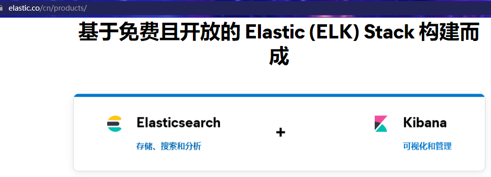

文档：https://www.elastic.co/guide/en/elasticsearch/reference/7.6/index.html


## 2.2 下载

我们只需要用到elasticsearch和kibana，es还需要中文的处理插件ik分词器，我们选择讲解的版本是7.6.2的，**kibana、elasticsearch和IK分词器的版本号要一致，否则可能带来兼容性问题**

另外，es需要jdk1.8以上的环境(虚拟机中必须安装jdk并配置了环境变量)

下载地址如下：

### 2.2.1 elasticsearch

https://www.elastic.co/cn/downloads/past-releases#elasticsearch

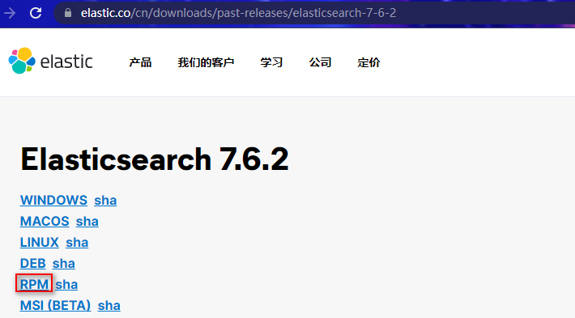

### 2.2.2 kibana地址

https://www.elastic.co/cn/downloads/past-releases#kibana

**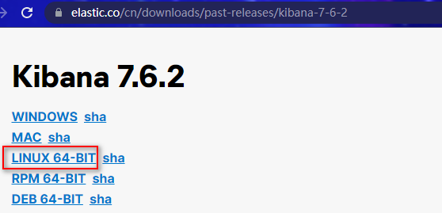**

### 2.2.3 ik中文分词器地址

https://github.com/medcl/elasticsearch-analysis-ik/tags

## 2.3 安装elasticsearch

把课前资料中的elasticsearch、kibana拷贝到/opt目录下

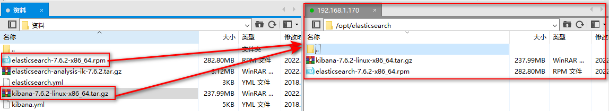

### 2.3.1 安装elasticsearch

```
cd /opt/elasticsearch/
rpm -ivh elasticsearch-7.6.2-x86_64.rpm 
```

### 2.3.2 elasticsearch配置jdk：

elasticsearch7.X版本需要jdk11以上的版本，安装过的es目录下自带jdk11：

```
ll /usr/share/elasticsearch
```

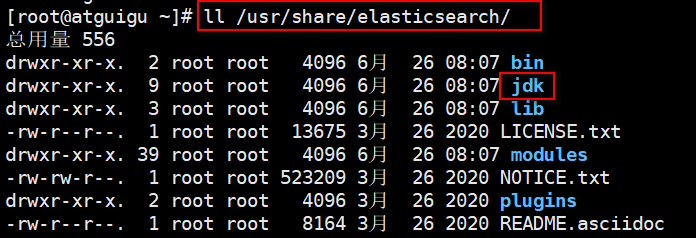


配置jdk路径：

```
vim /etc/sysconfig/elasticsearch
# 修改javahome为(/usr/share/elasticsearch/jdk)
```


### 2.3.3 elasticsearch配置：

切换到/etc/elasticsearch目录下，看到两个配置文件jvm.options和elasticsearch.yml


**1、首先修改jvm.options。**elasticsearch默认占用所有内存，导致虚拟机很慢，可以改的小一点。

```
vim /etc/elasticsearch/jvm.options
```

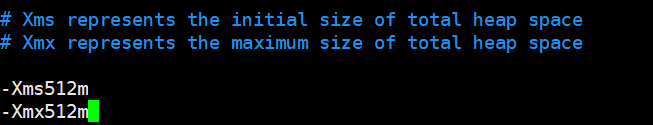

**2、再修改elasticsearch.yml**

修改yml配置的注意事项：**每行必须顶格，不能有空格**，  **":"后面必须有一个空格****

- 集群名称，同一集群名称必须相同（集群配置）

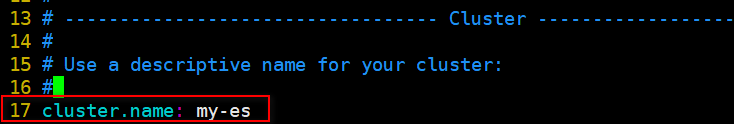

- 单个节点名称 （集群配置）

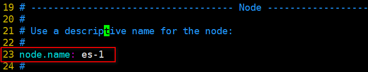

- 如果配置集群了，一定要设置当前节点为主节点

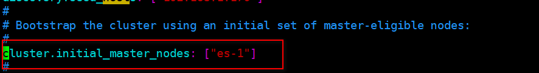

- 保存es数据和日志文件的目录(不修改，使用默认的)

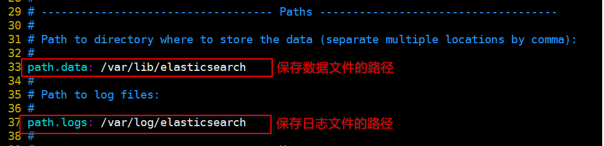

- 把bootstrap自检程序关掉(提高启动速度)

```
# 修改原配置
bootstrap.memory_lock: false
# 新增配置
bootstrap.system_call_filter: false
```

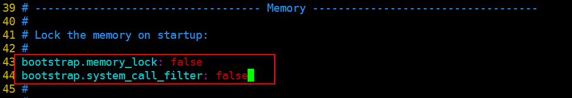

- 默认只允许本机访问，修改为0.0.0.0后则可以远程访问；端口使用默认：9200

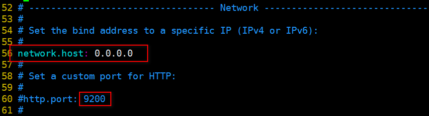

- 配置集群列表，这里只有一个。可以配置计算机名，也可以配置ip，**<font style='color:red'>推荐ip</font>**,主机名是你计算机名，一定不可以写错！！

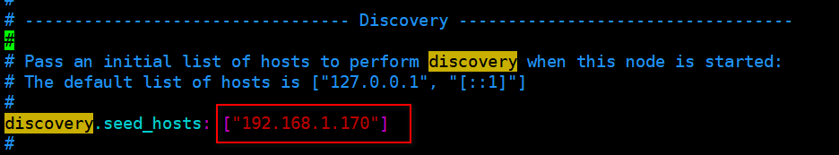

- elasticsearch服务器硬盘剩余空间不足5%，会抛出cluster_block_exception异常,在elasticsearch.yml最后配置取消硬盘检查:(新增)

```
cluster.routing.allocation.disk.threshold_enabled: false
```


### 2.3.4 设置es访问配置文件的权限

**必须设置**！！！！！！！！！！！！！！！！

```
chmod -R 777 /etc/elasticsearch/
```

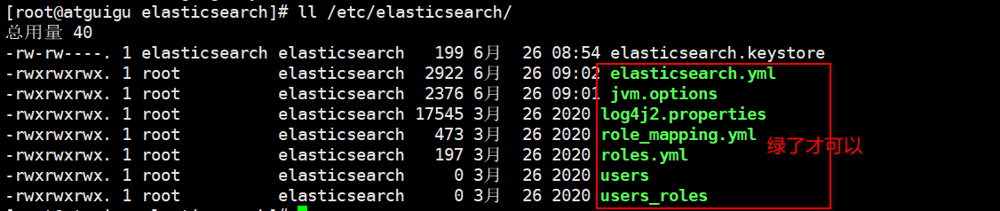

### 2.3.5.    启动

启动elasticsearch：`systemctl start elasticsearch`

如果启动未成功，请去查看相关日志

```
cat  /var/log/elasticsearch/{cluster-name}.log
```

例如：这里cluster-name配置的是my-es，那么就是指：

```
cat  /var/log/elasticsearch/my-es.log文件
```

tail  -n行数 -f  日志文件名

一般是配置文件的错误,按照上面的配置检查一遍

### 2.3.6.    测试

浏览器访问：http://192.168.1.179:9200

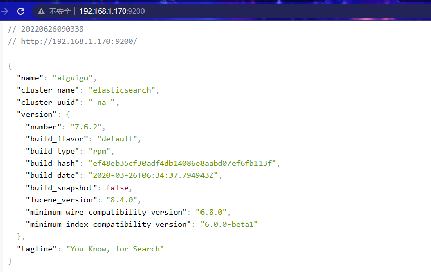

如果访问失败：

​	原因1：防火墙可能没有关闭

​	原因2：配置文件  network.hosts修改错误或者  集群节点主机名配置错误

## 2.4 安装kibana

Kibana是一个针对Elasticsearch的开源分析及可视化平台，用来搜索、查看交互存储在Elasticsearch索引中的数据。使用Kibana，可以通过各种图表进行高级数据分析及展示。

解压缩进入kibana的config目录：

```
cd /opt/elasticsearch/
# 解压缩
tar -zxvf kibana-7.6.2-linux-x86_64.tar.gz
# 切换进config目录
cd kibana-7.6.2-linux-x86_64/config/
```

- 默认端口号：5601


- 修改配置文件，允许访问的ip地址

		修改为虚拟机IP地址

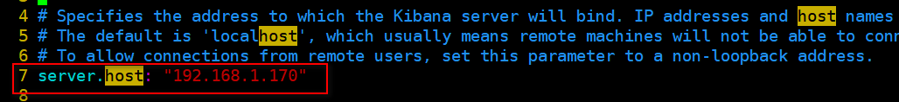

- 配置elasticsearch服务器列表：

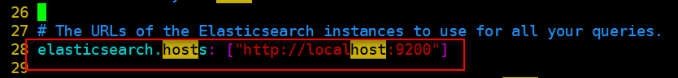

- 启动：切换到kibana的bin目录下

```
cd /opt/elasticsearch/kibana-7.6.2-linux-x86_64/bin
```

```
# 会输出日志，并独占当前窗口(--allow-root表示允许使用root用户启动)
./kibana --allow-root  
# 后台启动
nohup  ./kibana --allow-root  &

```


- 注意：不要使用`ps -ef | grep kibana`查询kibana进程，因为kibana的进程不叫kibana

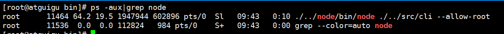

**必须先启动elasticSearch 启动kibana后才可以访问**

- 测试：通过浏览器访问kibana

   http://192.168.1.170:5601

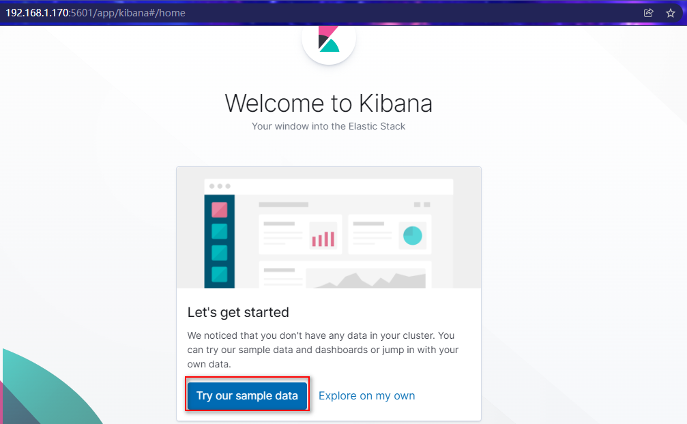

点击左边菜单DevTools 

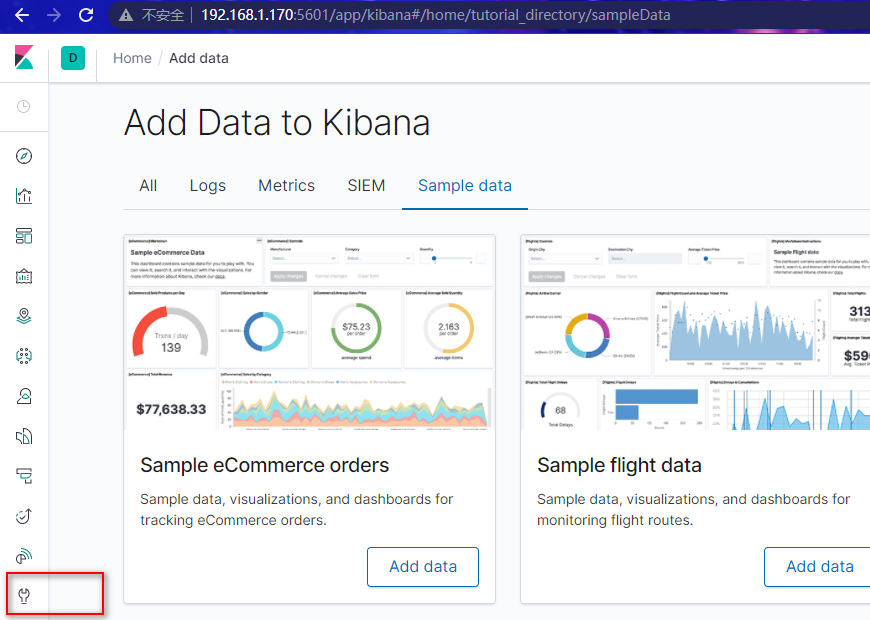

在Console中，执行默认的DSL语句得到结果

 

表示es启动正常，并且与kibana连接正常。


## 2.5  IK分词器

### 2.5.1.    中文问题

大家先不管语法，我们先测试一波。

在kibana控制台输入下面的请求：

```
GET _analyze
{
  "text": "我是中国人"
}
```

运行得到结果：

```
{
  "tokens" : [
    {
      "token" : "我",
      "start_offset" : 0,
      "end_offset" : 1,
      "type" : "<IDEOGRAPHIC>",
      "position" : 0
    },
    {
      "token" : "是",
      "start_offset" : 1,
      "end_offset" : 2,
      "type" : "<IDEOGRAPHIC>",
      "position" : 1
    },
    {
      "token" : "中",
      "start_offset" : 2,
      "end_offset" : 3,
      "type" : "<IDEOGRAPHIC>",
      "position" : 2
    },
    {
      "token" : "国",
      "start_offset" : 3,
      "end_offset" : 4,
      "type" : "<IDEOGRAPHIC>",
      "position" : 3
    },
    {
      "token" : "人",
      "start_offset" : 4,
      "end_offset" : 5,
      "type" : "<IDEOGRAPHIC>",
      "position" : 4
    }
  ]
}
```


### 2.5.2.    中文分词器

elasticsearch本身自带的中文分词，就是单纯把中文一个字一个字的分开，根本没有词汇的概念。但是实际应用中，用户都是以词汇为条件，进行查询匹配的，如果能够把文章以词汇为单位切分开，那么与用户的查询条件能够更贴切的匹配上，查询速度也更加快速。

因此一般我们会用第三方提供的分词器：

       

IK分词器使用最多。


### 2.5.3.    IK分词器

Lucene的IK分词器早在2012年已经没有维护了，现在我们要使用的是在其基础上维护升级的版本，并且开发为ElasticSearch的集成插件了，与Elasticsearch一起维护升级，版本也保持一致：7.6.2。

上传课前资料中的elasticsearch-analysis-ik-7.6.2.tar.gz包到/usr/share/elasticsearch/plugins目录下，

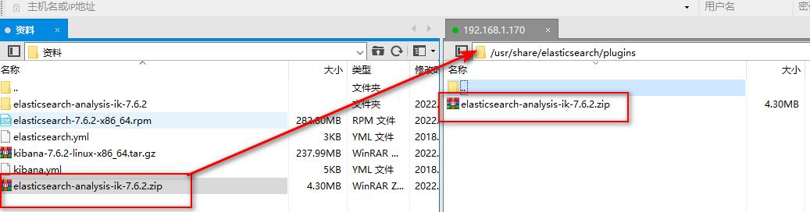

并解压到：/usr/share/elasticsearch/plugins/

```
# 切换到目录下
cd /usr/share/elasticsearch/plugins/
# 解压缩到指定目录下
unzip elasticsearch-analysis-ik-7.6.2.zip -d ik-analyzer
# 一定要删除压缩包
rm -rvf elasticsearch-analysis-ik-7.6.2.zip
```


重启elasticsearch :    

```
systemctl restart elasticsearch.service
```

再次测试：  

​	**ik_smart**: 最粗粒度的拆分

​	**ik_max_word**：最细粒度的拆

```
GET _analyze
{
  "analyzer": "ik_smart", 
  "text": "我是中国人"
}
```


ik分词器还提供了更详尽的分词方式：**ik_max_word**

```
GET _analyze
{
  "analyzer": "ik_max_word", 
  "text": "我是中国人"
}
```

分词效果：

```json
{
  "tokens" : [
    {
      "token" : "我",
      "start_offset" : 0,
      "end_offset" : 1,
      "type" : "CN_CHAR",
      "position" : 0
    },
    {
      "token" : "是",
      "start_offset" : 1,
      "end_offset" : 2,
      "type" : "CN_CHAR",
      "position" : 1
    },
    {
      "token" : "中国人",
      "start_offset" : 2,
      "end_offset" : 5,
      "type" : "CN_WORD",
      "position" : 2
    },
    {
      "token" : "中国",
      "start_offset" : 2,
      "end_offset" : 4,
      "type" : "CN_WORD",
      "position" : 3
    },
    {
      "token" : "国人",
      "start_offset" : 3,
      "end_offset" : 5,
      "type" : "CN_WORD",
      "position" : 4
    }
  ]
}
```

分词更完美！！


### 2.5.4.    自定义词库

中文语言在不断发展，新的词汇不断涌现，怎么不断完善分词需求？

ik分词器提供了重要的扩展能力：

**扩展词典**（新创建词功能）： 有些词IK分词器不识别 例如：“尚硅谷”，“夺笋哪”，“针不戳”

**停用词典**（停用某些词功能）： 有些词不需要建立索引  例如：“哦”，“啊”，“的”

elasticsearch加载ik分词器插件时，ik会读取一个配置文件，这个配置文件在ik分词器根目录的config目录下：


打开该配置文件：


这里有两种方式配置扩展词典和停用词典：

1. 本地方式：ext_dict配置扩展词典，ext_stopwords配置停用词典。
2. 远程方式：tomcat或者nginx

第一种方式每次修改词典都要重启搜索服务，不推荐。推荐使用nginx的方式，并发量大，修改内容不需要重启。


**第一步：利用nginx搭建远程词库。**

```
vim /usr/local/nginx/conf/nginx.conf
```

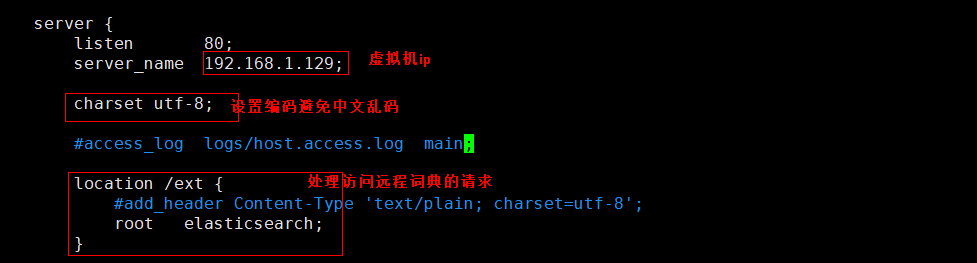

需要在nginx根目录下创建对应的elasticsearch目录

```
mkdir -p /usr/local/nginx/elasticsearch/ext
# 创建扩展字典文件
vim /usr/local/nginx/elasticsearch/ext/ext_dict.txt
```


添加扩展词典，**每行一个关键词**：


测试：

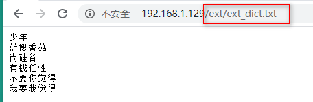


**第二步：在ik分词器中引用远程词库**

进入ik分词器的conf目录：cd /usr/share/elasticsearch/plugins/ik-analyzer/config/

```
vim /usr/share/elasticsearch/plugins/ik-analyzer/config/IKAnalyzer.cfg.xml
```


**重启elasticsearch服务**，再次测试

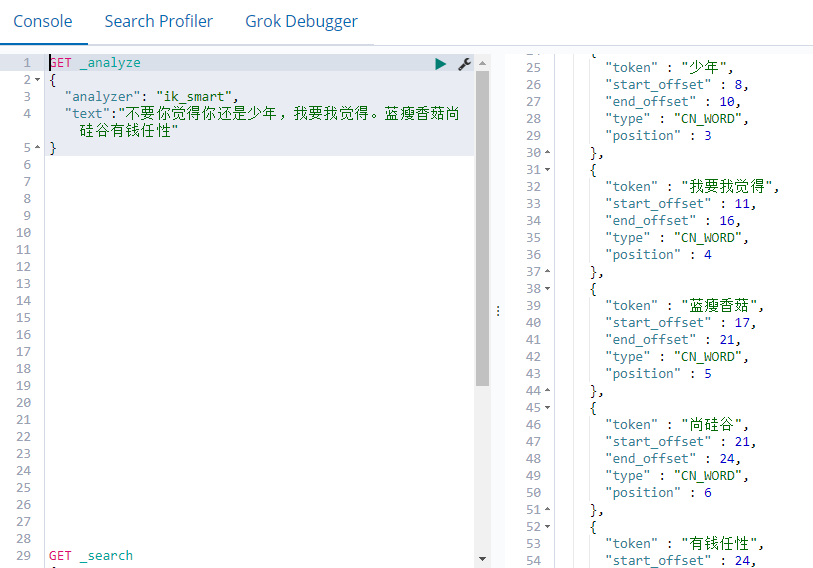

分词效果就是好！​

添加新词条后，es只会对新增的数据用新词分词。历史数据是不会重新分词的。如果想要历史数据重新分词。需要执行：

```
POST {index}/_update_by_query?conflicts=proceed
```


# 3. elasticsearch基本操作


## 3.1. 基本概念

Elasticsearch也是基于Lucene的全文检索库，本质也是存储数据，很多概念与MySQL类似的。

对比关系：

```
索引（indices）----------------------Databases 数据库

  类型（type）--------------------------Table 数据表 [7.x废弃]

     文档（Document）----------------------Row 行

	    字段（Field）-------------------------Columns 列 
```


要注意的是：Elasticsearch本身就是分布式的，因此即便你只有一个节点，Elasticsearch默认也会对你的数据进行分片和副本操作，当你向集群添加新数据时，数据也会在新加入的节点中进行平衡。


## 3.2. 索引操作（indeces）

### 3.2.1. 查询索引

查看es中有哪些索引库：

```
GET /_cat/indices?v
```

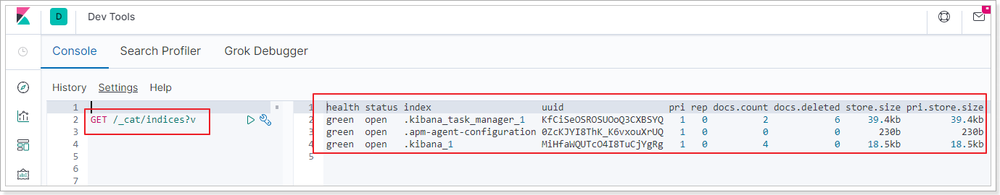

es 中会默认存在一个名为.kibana和.kibana_task_manager的索引

表头的含义

|     字段名     | 含义说明                                                     |
| :------------: | :----------------------------------------------------------- |
|     health     | green(集群完整) yellow(单点正常、集群不完整) red(单点不正常) |
|     status     | 是否能使用                                                   |
|     index      | 索引名                                                       |
|      uuid      | 索引统一编号                                                 |
|      pri       | 主节点几个                                                   |
|      rep       | 从节点几个                                                   |
|   docs.count   | 文档数                                                       |
|  docs.deleted  | 文档被删了多少                                               |
|   store.size   | 整体占空间大小                                               |
| pri.store.size | 主节点占                                                     |


### 3.2.2. 创建索引

```
PUT /索引名
```

参数可选：指定分片及副本，默认分片为3，副本为2。

```json
{
    "settings": {
        "number_of_shards": 3,
        "number_of_replicas": 2
      }
}
```

演示：

```json
PUT /atguigu
{
  "settings": {
    "number_of_shards": 3,
    "number_of_replicas": 2
  }
}
# 创建成功后如下图所示
```


再次查询，可以看到刚刚创建的索引：


### 3.2.3. 查看索引具体信息

```
GET /索引名
```


或者，我们可以使用*来查询所有索引具体信息


### 3.2.4. 删除索引

```
DELETE /索引库名
```

演示：


查看atguigu:


## 3.3. 映射配置（_mapping）

索引有了，接下来肯定是添加数据。但是，在添加数据之前必须定义映射。

什么是映射？

> 映射是定义文档的过程，文档包含哪些字段，这些字段是否保存，是否索引，是否分词等

只有配置清楚，Elasticsearch才会帮我们进行索引库的创建（不一定）


### 3.3.1. 创建映射字段

```
PUT /索引库名/_mapping
{
  "properties": {
    "字段名": {
      "type": "类型",
      "index": true，
      "store": true，
      "analyzer": "分词器"
    }
  }
}
```

字段名：类似于列名，properties下可以指定许多字段。

每个字段可以有很多属性。例如：

- type：类型，String（text  keyword） Numeric（long integer float double） date boolean
- index：是否索引，默认为true
- store：是否存储，默认为false，即使为false也会存储到_source中，如果为true则会额外存储一份
- analyzer：分词器，这里使用ik分词器：`ik_max_word`或者`ik_smart`


> 示例

发起请求：

```json
PUT atguigu/_mapping
{
  "properties": {
    "title": {
      "type": "text",
      "analyzer": "ik_max_word"
    },
    "images": {
      "type": "keyword",
      "index": "false"
    },
    "price": {
      "type": "long"
    }
  }
}
```

响应结果：

```
{
  "acknowledged": true
}

```


### 3.3.2. 查看映射关系

> 语法：

```
GET /索引库名/_mapping
```

> 示例：

```
GET /atguigu/_mapping
```

> 响应：

```json
{
  "atguigu" : {
    "mappings" : {
      "properties" : {
        "images" : {
          "type" : "keyword",
          "index" : false
        },
        "price" : {
          "type" : "double"
        },
        "title" : {
          "type" : "text",
          "analyzer" : "ik_max_word"
        }
      }
    }
  }
}
```


## 3.4. 新增文档（document）

有了索引、类型和映射，就可以对文档做增删改查操作了。

### 3.4.1. 基本玩法

如果我们想要自己新增的时候指定id，可以这么做：

```
POST /索引库名/_doc/id值
{
    ...
}
```

演示：

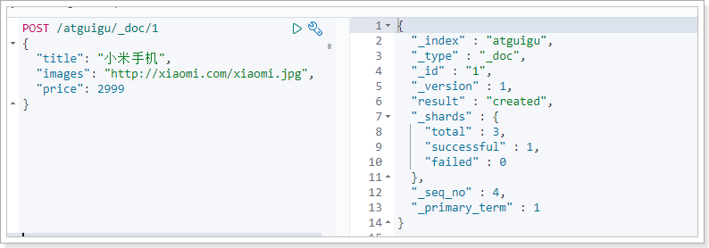

查询：小米手机的id是我们指定的id

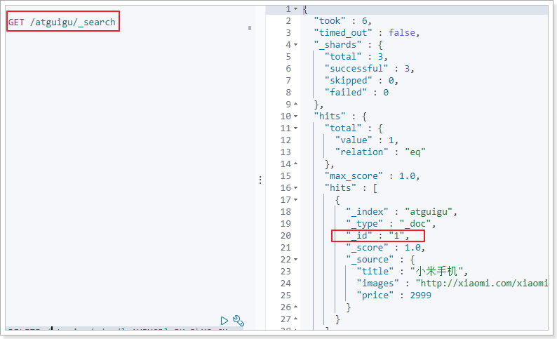

- `_source`：源文档信息，所有的数据都在里面。
- `_id`：这条文档的唯一标识，与文档自己的id字段没有关联


### 3.4.2. 智能判断

事实上Elasticsearch非常智能，你不需要给索引库设置任何mapping映射，它也可以根据你输入的数据来判断类型，动态添加数据映射。

测试一下：

```json
POST /atguigu/_doc/2
{
    "title":"小米手机",
    "images":"http://image.jd.com/12479122.jpg",
    "price":2899,
    "stock": 200,
    "saleable":true,
    "attr": {
        "category": "手机",
        "brand": "小米"
    }
}
```

我们额外添加了stock库存，saleable是否上架，attr其他属性几个字段。

来看结果：`GET /atguigu/_search`

```json
{
  "took" : 4,
  "timed_out" : false,
  "_shards" : {
    "total" : 3,
    "successful" : 3,
    "skipped" : 0,
    "failed" : 0
  },
  "hits" : {
    "total" : {
      "value" : 2,
      "relation" : "eq"
    },
    "max_score" : 1.0,
    "hits" : [
      {
        "_index" : "atguigu",
        "_type" : "_doc",
        "_id" : "2",
        "_score" : 1.0,
        "_source" : {
          "title" : "小米手机",
          "images" : "http://image.jd.com/12479122.jpg",
          "price" : 2899,
          "stock" : 200,
          "saleable" : true,
          "attr" : {
            "category" : "手机",
            "brand" : "小米"
          }
        }
      },
      {
        "_index" : "atguigu",
        "_type" : "_doc",
        "_id" : "1",
        "_score" : 1.0,
        "_source" : {
          "title" : "小米手机",
          "images" : "http://xiaomi.com/xiaomi.jpg",
          "price" : 2999
        }
      }
    ]
  }
}
```

再看下索引库的映射关系: `GET /atguigu/_mapping`

```json
{
  "atguigu" : {
    "mappings" : {
      "properties" : {
        "attr" : {
          "properties" : {
            "brand" : {
              "type" : "text",
              "fields" : {
                "keyword" : {
                  "type" : "keyword",
                  "ignore_above" : 256
                }
              }
            },
            "category" : {
              "type" : "text",
              "fields" : {
                "keyword" : {
                  "type" : "keyword",
                  "ignore_above" : 256
                }
              }
            }
          }
        },
        "images" : {
          "type" : "keyword",
          "index" : false
        },
        "price" : {
          "type" : "double"
        },
        "saleable" : {
          "type" : "boolean"
        },
        "stock" : {
          "type" : "long"
        },
        "title" : {
          "type" : "text",
          "analyzer" : "ik_max_word"
        }
      }
    }
  }
}
```

stock，saleable，attr都被成功映射了。

如果是字符串类型的数据，会添加两种类型：text + keyword。如上例中的category 和 brand


## 3.5. 删除数据

删除使用DELETE请求，同样，需要根据id进行删除：

> 语法

```
DELETE /索引库名/_doc/id值
```

> 示例：

```
DELETE /atguigu/_doc/2
```

> 结果：

```json
{
  "_index" : "atguigu",
  "_type" : "_doc",
  "_id" : "2",
  "_version" : 2,
  "result" : "deleted",
  "_shards" : {
    "total" : 3,
    "successful" : 1,
    "failed" : 0
  },
  "_seq_no" : 3,
  "_primary_term" : 1
}
```

## 3.6 更新文档

语法：

```
POST /索引库名/_update/id值
{
	doc:{
		"属性":"值"
	}
}
```


```json
POST /atguigu/_update/1
{
  "doc": {
    "title":"aaa"
  }
}
```

结果：

```json
{
  "_index" : "atguigu",
  "_type" : "_doc",
  "_id" : "2",
  "_version" : 3,
  "result" : "updated",
  "_shards" : {
    "total" : 3,
    "successful" : 1,
    "failed" : 0
  },
  "_seq_no" : 5,
  "_primary_term" : 1
}

```


# 4. 查询

之前已经见识了查询功能

查询所有：

```
GET /{index}/_search
```

根据id查询：

```
GET /{index}/_doc/{id}
```

除了上述简单查询之外。elasticsearch作为搜索引擎，最复杂最强大的功能就是搜索查询功能。包括：匹配查询、词条查询、模糊查询、组合查询、范围查询、高亮、排序、分页等等查询功能。


基本查询语法如下：

```json
GET /索引库名/_search
{
    "query":{
        "查询类型":{
            "查询条件":"查询条件值"
        }
    }
}
```

这里的query代表一个查询对象，里面可以有不同的查询属性

- 查询类型：
  - 例如：`match_all`， `match`，`term` ， `range` 等等
- 查询条件：查询条件会根据类型的不同，写法也有差异


查询结果：

- took：查询花费时间，单位是毫秒
- time_out：是否超时
- _shards：分片信息
- hits：搜索结果总览对象
  - total：搜索到的总条数
  - max_score：所有结果中文档得分的最高分
  - hits：搜索结果的文档对象数组，每个元素是一条搜索到的文档信息
    - _index：索引库
    - _type：文档类型
    - _id：文档id
    - _score：文档得分
    - _source：文档的源数据


## 4.1. 数据准备

```json
POST /atguigu/_bulk
{"index":{"_id":1}}
{ "title":"小米手机", "images":"http://image.jd.com/12479122.jpg", "price":1999, "stock": 200, "attr": { "category": "手机", "brand": "小米" } }
{"index":{"_id":2}}
{"title":"超米手机", "images":"http://image.jd.com/12479122.jpg", "price":2999, "stock": 300, "attr": { "category": "手机", "brand": "小米" } }
{"index":{"_id":3}}
{ "title":"小米电视", "images":"http://image.jd.com/12479122.jpg", "price":3999, "stock": 400, "attr": { "category": "电视", "brand": "小米" } }
{"index":{"_id":4}}
{ "title":"小米笔记本", "images":"http://image.jd.com/12479122.jpg", "price":4999, "stock": 200, "attr": { "category": "笔记本", "brand": "小米" } }
{"index":{"_id":5}}
{ "title":"华为手机", "images":"http://image.jd.com/12479122.jpg", "price":3999, "stock": 400, "attr": { "category": "手机", "brand": "华为" } }
{"index":{"_id":6}}
{ "title":"华为笔记本", "images":"http://image.jd.com/12479122.jpg", "price":5999, "stock": 200, "attr": { "category": "笔记本", "brand": "华为" } }
{"index":{"_id":7}}
{ "title":"荣耀手机", "images":"http://image.jd.com/12479122.jpg", "price":2999, "stock": 300, "attr": { "category": "手机", "brand": "华为" } }
{"index":{"_id":8}}
{ "title":"oppo手机", "images":"http://image.jd.com/12479122.jpg", "price":2799, "stock": 400, "attr": { "category": "手机", "brand": "oppo" } }
{"index":{"_id":9}}
{ "title":"vivo手机", "images":"http://image.jd.com/12479122.jpg", "price":2699, "stock": 300, "attr": { "category": "手机", "brand": "vivo" } }
{"index":{"_id":10}}
{ "title":"华为nova手机", "images":"http://image.jd.com/12479122.jpg", "price":2999, "stock": 300, "attr": { "category": "手机", "brand": "华为" } }
```


## 4.2. 匹配查询（match）

条件匹配

```json
GET /atguigu/_search
{
  "query": {
    "match": {
      "title": "小米手机"
    }
  }
}
```

查询出很多数据，不仅包括`小米手机`，而且与`小米`或者`手机`相关的都会查询到，说明多个词之间是`or`的关系。

某些情况下，我们需要更精确查找，我们希望这个关系变成`and`，可以这样做：

```json
GET /atguigu/_search
{
  "query": {
    "match": {
      "title": {
        "query": "小米手机",
        "operator": "and"
      }
    }
  }
}
```

查询结果：

```josn
{
  "took" : 19,
  "timed_out" : false,
  "_shards" : {
    "total" : 3,
    "successful" : 3,
    "skipped" : 0,
    "failed" : 0
  },
  "hits" : {
    "total" : {
      "value" : 1,
      "relation" : "eq"
    },
    "max_score" : 1.7494967,
    "hits" : [
      {
        "_index" : "atguigu",
        "_type" : "_doc",
        "_id" : "1",
        "_score" : 1.7494967,
        "_source" : {
          "title" : "小米手机",
          "images" : "http://image.jd.com/12479122.jpg",
          "price" : 1999,
          "stock" : 200,
          "attr" : {
            "category" : "手机",
            "brand" : "小米"
          }
        }
      }
    ]
  }
}
```


## 4.3. 词条查询（term）

`term` 查询被用于精确值 匹配，这些精确值可能是数字、时间、布尔或者那些**未分词**的字符串。

```json
GET /atguigu/_search
{
    "query":{
        "term":{
            "price": 4999
        }
    }
}
```


## 4.4. 范围查询（range）

`range` 查询找出那些落在指定区间内的数字或者时间

```json
GET /atguigu/_search
{
    "query":{
        "range": {
            "price": {
                "gte":  1000,
                "lt":   3000
            }
    	}
    }
}
```

`range`查询允许以下字符：

| 操作符 |   说明   |
| :----: | :------: |
|   gt   |   大于   |
|  gte   | 大于等于 |
|   lt   |   小于   |
|  lte   | 小于等于 |


## 4.5. 布尔组合（bool)

布尔查询又叫**组合查询**

`bool`把各种其它查询通过`must`（与）、`must_not`（非）、`should`（或）的方式进行组合

```json
GET /atguigu/_search
{
    "query":{
        "bool":{
        	"must": [
        	  {
        	    "range": {
        	      "price": {
        	        "gte": 1000,
        	        "lte": 3000
        	      }
        	    }
        	  },
        	  {
        	    "range": {
        	      "price": {
        	        "gte": 2000,
        	        "lte": 4000
        	      }
        	    }
        	  }
        	]
        }
    }
}
```

注意：一个组合查询里面只能出现一种组合，不能混用


## 4.6. 过滤（filter）

所有的查询都会影响到文档的评分及排名。如果我们需要在查询结果中进行过滤，并且不希望过滤条件影响评分，那么就不要把过滤条件作为查询条件来用。而是使用`filter`方式：

```json
GET /atguigu/_search
{
  "query": {
    "bool": {
      "must": {
        "match": { "title": "小米手机" }
      },
      "filter": {
        "range": {
          "price": { "gt": 2000, "lt": 3000 }
        }
      }
    }
  }
}
```

注意：`filter`中还可以再次进行`bool`组合条件过滤。


## 4.7. 排序（sort）

`sort` 可以让我们按照不同的字段进行排序，并且通过`order`指定排序的方式

```json
GET /atguigu/_search
{
  "query": {
    "match": {
      "title": "小米手机"
    }
  },
  "sort": [
    {
      "price": { "order": "desc" }
    },
    {
      "_score": { "order": "desc"}
    }
  ]
}
```


## 4.8. 分页（from/size）

```json
GET /atguigu/_search
{
  "query": {
    "match": {
      "title": "小米手机"
    }
  },
  "from": 2,
  "size": 2
}
```

from：从那一条开始

size：取多少条


## 4.9. 高亮（highlight）

查看百度高亮的原理：


发现：高亮的本质是给关键字添加了<em>标签，在前端再给该标签添加样式即可。


```
GET /atguigu/_search
{
  "query": {
    "match": {
      "title": "小米"
    }
  },
  "highlight": {
    "fields": {"title": {}}, 
    "pre_tags": "<em>",
    "post_tags": "</em>"
  }
}
```

fields：高亮字段

pre_tags：前置标签

post_tags：后置标签

查询结果如下：


## 4.10. 结果过滤（_source）

默认情况下，elasticsearch在搜索的结果中，会把文档中保存在`_source`的所有字段都返回。

如果我们只想获取其中的部分字段，可以添加`_source`的过滤

```json
GET /atguigu/_search
{
  "_source": ["title","price"],
  "query": {
    "term": {
      "price": 2699
    }
  }
}
```

返回结果，只有两个字段：

```
{
  "took" : 9,
  "timed_out" : false,
  "_shards" : {
    "total" : 2,
    "successful" : 2,
    "skipped" : 0,
    "failed" : 0
  },
  "hits" : {
    "total" : 1,
    "max_score" : 1.0,
    "hits" : [
      {
        "_index" : "atguigu",
        "_type" : "goods",
        "_id" : "9",
        "_score" : 1.0,
        "_source" : {
          "price" : 2699,
          "title" : "vivo手机"
        }
      }
    ]
  }
}
```


# 5. 聚合（aggregations）

聚合可以让我们极其方便的实现对数据的统计、分析。例如：

- 什么品牌的手机最受欢迎？
- 这些手机的平均价格、最高价格、最低价格？
- 这些手机每月的销售情况如何？

实现这些统计功能的比数据库的sql要方便的多，而且查询速度非常快，可以实现实时搜索效果。


## 5.1. 基本概念

Elasticsearch中的聚合，包含多种类型，最常用的两种，一个叫`桶`，一个叫`度量`：

> **桶（bucket）**

桶的作用，是按照某种方式对数据进行分组，每一组数据在ES中称为一个`桶`，例如我们根据国籍对人划分，可以得到`中国桶`、`英国桶`，`日本桶`……或者我们按照年龄段对人进行划分：0~10,10~20,20~30,30~40等。

Elasticsearch中提供的划分桶的方式有很多：

- Date Histogram Aggregation：根据日期阶梯分组，例如给定阶梯为周，会自动每周分为一组
- Histogram Aggregation：根据数值阶梯分组，与日期类似
- Terms Aggregation：根据词条内容分组，词条内容完全匹配的为一组
- Range Aggregation：数值和日期的范围分组，指定开始和结束，然后按段分组
- ……


bucket aggregations 只负责对数据进行分组，并不进行计算，因此往往bucket中往往会嵌套另一种聚合：metrics aggregations即度量


> **度量（metrics）**

分组完成以后，我们一般会对组中的数据进行聚合运算，例如求平均值、最大、最小、求和等，这些在ES中称为`度量`

比较常用的一些度量聚合方式：

- Avg Aggregation：求平均值
- Max Aggregation：求最大值
- Min Aggregation：求最小值
- Percentiles Aggregation：求百分比
- Stats Aggregation：同时返回avg、max、min、sum、count等
- Sum Aggregation：求和
- Top hits Aggregation：求前几
- Value Count Aggregation：求总数
- ……


## 5.2. 聚合为桶

首先，我们按照手机的品牌`attr.brand.keyword`来划分`桶`

```json
GET /atguigu/_search
{
    "size" : 0,
    "aggs" : { 
        "brands" : { 
            "terms" : { 
              "field" : "attr.brand.keyword"
            }
        }
    }
}
```

- size： 查询条数，这里设置为0，因为我们不关心搜索到的数据，只关心聚合结果，提高效率
- aggs：声明这是一个聚合查询，是aggregations的缩写
  - brands：给这次聚合起一个名字，任意。
    - terms：划分桶的方式，这里是根据词条划分
      - field：划分桶的字段

结果：

```json
{
  "took" : 23,
  "timed_out" : false,
  "_shards" : {
    "total" : 3,
    "successful" : 3,
    "skipped" : 0,
    "failed" : 0
  },
  "hits" : {
    "total" : {
      "value" : 10,
      "relation" : "eq"
    },
    "max_score" : null,
    "hits" : [ ]
  },
  "aggregations" : {
    "brands" : {
      "doc_count_error_upper_bound" : 0,
      "sum_other_doc_count" : 0,
      "buckets" : [
        {
          "key" : "华为",
          "doc_count" : 4
        },
        {
          "key" : "小米",
          "doc_count" : 4
        },
        {
          "key" : "oppo",
          "doc_count" : 1
        },
        {
          "key" : "vivo",
          "doc_count" : 1
        }
      ]
    }
  }
}
```

- hits：查询结果为空，因为我们设置了size为0
- aggregations：聚合的结果
- brands：我们定义的聚合名称
- buckets：查找到的桶，每个不同的品牌字段值都会形成一个桶
  - key：这个桶对应的品牌字段的值
  - doc_count：这个桶中的文档数量


## 5.3. 桶内度量

前面的例子告诉我们每个桶里面的文档数量，这很有用。 但通常，我们的应用需要提供更复杂的文档度量。 例如，每种品牌手机的平均价格是多少？

因此，我们需要告诉Elasticsearch`使用哪个字段`，`使用何种度量方式`进行运算，这些信息要嵌套在`桶`内，`度量`的运算会基于`桶`内的文档进行

现在，我们为刚刚的聚合结果添加 求价格平均值的度量：

```json
GET /atguigu/_search
{
    "size" : 0,
    "aggs" : { 
        "brands" : { 
            "terms" : { 
              "field" : "attr.brand.keyword"
            },
            "aggs":{
                "avg_price": { 
                   "avg": {
                      "field": "price" 
                   }
                }
            }
        }
    }
}
```

- aggs：我们在上一个aggs(brands)中添加新的aggs。可见`度量`也是一个聚合
- avg_price：聚合的名称
- avg：度量的类型，这里是求平均值
- field：度量运算的字段


结果：

```json
{
  "took" : 82,
  "timed_out" : false,
  "_shards" : {
    "total" : 3,
    "successful" : 3,
    "skipped" : 0,
    "failed" : 0
  },
  "hits" : {
    "total" : {
      "value" : 10,
      "relation" : "eq"
    },
    "max_score" : null,
    "hits" : [ ]
  },
  "aggregations" : {
    "brands" : {
      "doc_count_error_upper_bound" : 0,
      "sum_other_doc_count" : 0,
      "buckets" : [
        {
          "key" : "华为",
          "doc_count" : 4,
          "avg_price" : {
            "value" : 3999.0
          }
        },
        {
          "key" : "小米",
          "doc_count" : 4,
          "avg_price" : {
            "value" : 3499.0
          }
        },
        {
          "key" : "oppo",
          "doc_count" : 1,
          "avg_price" : {
            "value" : 2799.0
          }
        },
        {
          "key" : "vivo",
          "doc_count" : 1,
          "avg_price" : {
            "value" : 2699.0
          }
        }
      ]
    }
  }
}
```

可以看到每个桶中都有自己的`avg_price`字段，这是度量聚合的结果


## 5.4. 桶内嵌套桶

刚刚的案例中，我们在桶内嵌套度量运算。事实上桶不仅可以嵌套运算， 还可以再嵌套其它桶。也就是说在每个分组中，再分更多组。

比如：我们想统计每个品牌都生产了那些产品，按照`attr.category.keyword`字段再进行分桶

```json
GET /atguigu/_search
{
    "size" : 0,
    "aggs" : { 
        "brands" : { 
            "terms" : { 
              "field" : "attr.brand.keyword"
            },
            "aggs":{
                "avg_price": { 
                   "avg": {
                      "field": "price" 
                   }
                },
                "categorys": {
                  "terms": {
                    "field": "attr.category.keyword"
                  }
                }
            }
        }
    }
}
```


部分结果：

```json
{
  "took" : 27,
  "timed_out" : false,
  "_shards" : {
    "total" : 3,
    "successful" : 3,
    "skipped" : 0,
    "failed" : 0
  },
  "hits" : {
    "total" : {
      "value" : 10,
      "relation" : "eq"
    },
    "max_score" : null,
    "hits" : [ ]
  },
  "aggregations" : {
    "brands" : {
      "doc_count_error_upper_bound" : 0,
      "sum_other_doc_count" : 0,
      "buckets" : [
        {
          "key" : "华为",
          "doc_count" : 4,
          "categorys" : {
            "doc_count_error_upper_bound" : 0,
            "sum_other_doc_count" : 0,
            "buckets" : [
              {
                "key" : "手机",
                "doc_count" : 3
              },
              {
                "key" : "笔记本",
                "doc_count" : 1
              }
            ]
          },
          "avg_price" : {
            "value" : 3999.0
          }
        },
        {
          "key" : "小米",
          "doc_count" : 4,
          "categorys" : {
            "doc_count_error_upper_bound" : 0,
            "sum_other_doc_count" : 0,
            "buckets" : [
              {
                "key" : "手机",
                "doc_count" : 2
              },
              {
                "key" : "电视",
                "doc_count" : 1
              },
              {
                "key" : "笔记本",
                "doc_count" : 1
              }
            ]
          },
          "avg_price" : {
            "value" : 3499.0
          }
        },
        {
          "key" : "oppo",
          "doc_count" : 1,
          "categorys" : {
            "doc_count_error_upper_bound" : 0,
            "sum_other_doc_count" : 0,
            "buckets" : [
              {
                "key" : "手机",
                "doc_count" : 1
              }
            ]
          },
          "avg_price" : {
            "value" : 2799.0
          }
        },
        {
          "key" : "vivo",
          "doc_count" : 1,
          "categorys" : {
            "doc_count_error_upper_bound" : 0,
            "sum_other_doc_count" : 0,
            "buckets" : [
              {
                "key" : "手机",
                "doc_count" : 1
              }
            ]
          },
          "avg_price" : {
            "value" : 2699.0
          }
        }
      ]
    }
  }
}
```

- 我们可以看到，新的聚合`categorys`被嵌套在原来每一个`brands`的桶中。
- 每个品牌下面都根据 `attr.category.keyword`字段进行了分组
- 我们能读取到的信息：
  - 华为有4中产品
  - 华为产品的平均售价是 3999.0美元。
  - 其中3种手机产品，1种笔记本产品


**综合练习：**查询有货的小米手机前五条记录，标题关键字高亮显示，按照价格排序，只需要标题价格图片属性。并查询品牌分类桶。


# 6. SpringData-Elasticsearch

目前市面上有两类客户端

一类是TransportClient 为代表的ES原生客户端，不能执行原生dsl语句必须使用它的Java api方法。

另外一种是以Rest Api为主的missing client，最典型的就是jest。 这种客户端可以直接使用dsl语句拼成的字符串，直接传给服务端，然后返回json字符串再解析。

两种方式各有优劣，但是最近elasticsearch官网，宣布计划在7.0以后的版本中废除TransportClient。以RestClient为主。

​		RestClient: jest, java low level client,java high level client

​						springboot又提供了 EsRestTemplate 简化了es操作,底层使用了java high level client实现

​										还提供了EsRepostitory


由于原生的Elasticsearch客户端API非常麻烦（https://www.elastic.co/guide/en/elasticsearch/client/index.html）。所以这里直接学习Spring提供的套件：Spring Data Elasticsearch。

https://docs.spring.io/spring-data/elasticsearch/docs/current/reference/html/#repositories

**spring-data-Elasticsearch 使用之前，必须先确定版本，elasticsearch 对版本的要求比较高。**


每个springboot场景启动器(引入了一组依赖并且配置了版本号的maven项目)

项目开发时会引入多个场景启动器，如果多个场景器引入了 同一个依赖但是版本不同，由于maven自动解决依赖冲突会按照先声明者路径短者优先的原则 挑选一个版本使用。没有被用到的版本的依赖 如果项目代码中使用了它的新特性会导致代码运行错误


后面的谷粒学院项目：springboot2.3.6.RELEASE   springcloud Hoxton.SR9     springcloudalibaba:2.2.6.RELEASE


springboot和elasticsearch的版本对照：

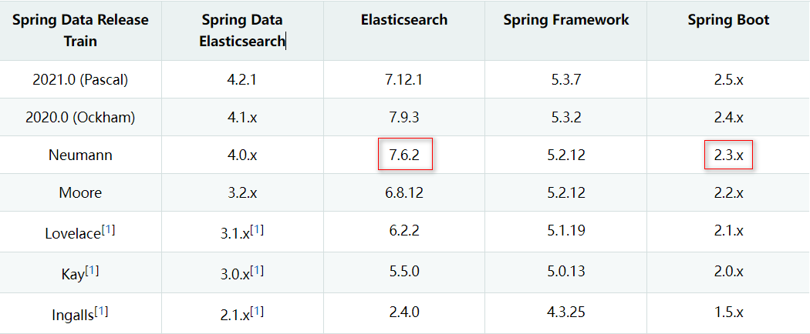

## 6.1. 创建module

在gmall工程下创建一个模块：


 


引入依赖：

```xml
<?xml version="1.0" encoding="UTF-8"?>
<project xmlns="http://maven.apache.org/POM/4.0.0" xmlns:xsi="http://www.w3.org/2001/XMLSchema-instance"
         xsi:schemaLocation="http://maven.apache.org/POM/4.0.0 https://maven.apache.org/xsd/maven-4.0.0.xsd">
    <modelVersion>4.0.0</modelVersion>
    <parent>
        <groupId>org.springframework.boot</groupId>
        <artifactId>spring-boot-starter-parent</artifactId>
        <version>2.3.7.RELEASE</version>
        <relativePath/> <!-- lookup parent from repository -->
    </parent>
    <groupId>com.atguigu</groupId>
    <artifactId>es-demo</artifactId>
    <version>0.0.1-SNAPSHOT</version>
    <name>es-demo</name>
    <description>Demo project for Spring Boot</description>
    <properties>
        <java.version>1.8</java.version>
    </properties>
    <dependencies>
        <dependency>
            <groupId>org.springframework.boot</groupId>
            <artifactId>spring-boot-starter-data-elasticsearch</artifactId>
        </dependency>
        <dependency>
            <groupId>org.projectlombok</groupId>
            <artifactId>lombok</artifactId>
        </dependency>

        <dependency>
            <groupId>org.springframework.boot</groupId>
            <artifactId>spring-boot-starter-test</artifactId>
            <scope>test</scope>
        </dependency>
        <!-- 如果不手动添加如下依赖，可能报错： Failed to resolve org.junit.platform:junit-platform-launcher:1.6.3 -->
        <dependency>
            <groupId>org.junit.platform</groupId>
            <artifactId>junit-platform-launcher</artifactId>
        </dependency>
    </dependencies>

    <build>
        <plugins>
            <plugin>
                <groupId>org.springframework.boot</groupId>
                <artifactId>spring-boot-maven-plugin</artifactId>
            </plugin>
        </plugins>
    </build>

</project>
```


在application.properties中添加配置

```properties
# 单机情况下
spring.elasticsearch.rest.uris=http://192.168.1.170:9200
# 集群情况下
#spring.elasticsearch.rest.uris[0]=http://192.168.1.170:9200
#spring.elasticsearch.rest.uris[1]=http://192.168.1.171:9200
```


## 6.2. 实体类

**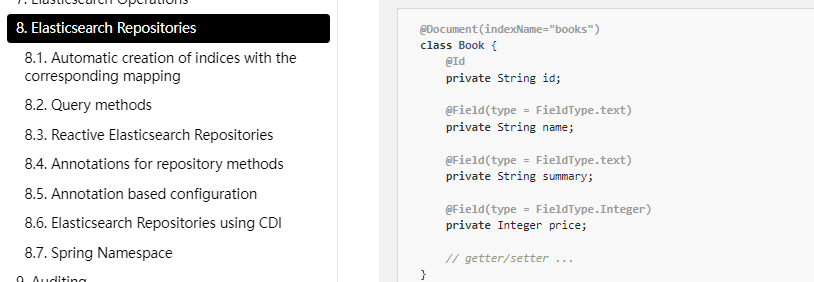**

```java
@AllArgsConstructor
@NoArgsConstructor
@ToString
@Data
@Document(indexName = "user", shards = 3, replicas = 2)
public class User {

    @Id
    private Long id;
    @Field(type = FieldType.Text, analyzer = "ik_max_word")
    private String name;
    @Field(type = FieldType.Integer)
    private Integer age;
    @Field(type = FieldType.Keyword, index = false)
    private String password;
}
```

Spring Data通过注解来声明字段的映射属性，有下面的三个注解：

- `@Document` 作用在类，标记实体类为文档对象，一般有四个属性
  - indexName：对应索引库名称
  - shards：分片数量，默认1
  - replicas：副本数量，默认1
- `@Id` 作用在成员变量，标记一个字段作为id主键
- `@Field` 作用在成员变量，标记为文档的字段，并指定字段映射属性：
  - type：字段类型，取值是枚举：FieldType
  - index：是否索引，布尔类型，默认是true
  - store：是否存储，布尔类型，默认是false
  - analyzer：分词器名称：ik_max_word


## 6.3. ElasticsearchRestTemplate

### 6.3.1 创建索引及映射

```java
@SpringBootTest
class EsDemoApplicationTests {

    // ElasticsearchTemplate是TransportClient客户端 已过期
    // ElasticsearchRestTemplate是RestHighLevel客户端
    @Autowired
    ElasticsearchRestTemplate restTemplate;

    @Test
    void contextLoads() {
        // 索引库操作对象
        IndexOperations ops = this.restTemplate.indexOps(User.class);
        ops.create(); // 初始化索引库
        ops.putMapping(indexOps.createMapping()); // 声明创建映射
    }
    //新增文档
    @Test
    void save(){
        restTemplate.save(new User(1L,"zhangsan",20,"zhangsan@126.com"));
    }
    //根据id查询文档
    @Test
    void get(){//根据id查找
        User user = restTemplate.queryForObject(GetQuery.getById("1"), User.class);
        System.out.println(user);
    }

}
```


### 6.3.2 查询文档

```java
//查询所有
@Test
void testMatchAll(){
    NativeSearchQueryBuilder builder = new NativeSearchQueryBuilder();
    builder.withQuery(QueryBuilders.matchAllQuery());
    SearchHits<User> search = elasticsearchRestTemplate.search(builder.build(), User.class);
    List<SearchHit<User>> searchHits = search.getSearchHits();
    searchHits.forEach(s->{
        User user = s.getContent();
        String id = s.getId();
        System.out.println(user);
        System.out.println(id);
    });
}
//匹配查询
@Test
void testMatch() {
    NativeSearchQueryBuilder builder = new NativeSearchQueryBuilder();
    builder.withQuery(QueryBuilders.matchQuery("username", "cuicui"));
    SearchHits<User> searchHits = elasticsearchRestTemplate.search(builder.build(), User.class);
    List<SearchHit<User>> hitList = searchHits.getSearchHits();
    hitList.forEach(hit->{
        User user = hit.getContent();
        System.out.println(user);
    });
}
//布尔查询、过滤查询
@Test
void testBoolFilter(){
    NativeSearchQueryBuilder builder = new NativeSearchQueryBuilder();
    builder.withQuery(QueryBuilders.boolQuery()
                      .must(QueryBuilders.matchQuery("username","cuicui"))//布尔组合
                      .filter(QueryBuilders.rangeQuery("age").gte(22)));//过滤查询
    SearchHits<User> searchHits = elasticsearchRestTemplate.search(builder.build(), User.class);
    System.out.println(searchHits.getTotalHits());
    List<SearchHit<User>> hits = searchHits.getSearchHits();
    hits.forEach(h->{
        System.out.println(h.getContent());
    });
}
```

### 6.3.3 复杂查询

匹配、过滤、分页、高亮、聚合度量查询

```java
@Autowired
ElasticsearchRestTemplate restTemplate;
@Test
void testSearch(){
    // 自定义搜索查询构建器
    NativeSearchQueryBuilder queryBuilder = new NativeSearchQueryBuilder();
    // 放入搜索条件
    queryBuilder.withQuery(QueryBuilders.matchQuery("name", "冰冰").operator(Operator.AND));
    // 放入年龄的过滤条件
    queryBuilder.withFilter(QueryBuilders.rangeQuery("age").gte(19).lte(23));
    // 放入排序条件
    queryBuilder.withSort(SortBuilders.fieldSort("age").order(SortOrder.DESC));
    // 分页
    queryBuilder.withPageable(PageRequest.of(0, 3));
    // 高亮
    queryBuilder.withHighlightBuilder(new HighlightBuilder().field("name").preTags("<em>").postTags("</em>"));

    // 添加聚合条件
    queryBuilder.addAggregation(AggregationBuilders.terms("pwdAgg").field("password"));
    //打印设置的Filter的DSL语句
    System.out.println(queryBuilder.build().getFilter().toString());
    //打印设置的查询的DSL语句
    System.out.println(queryBuilder.build().getQuery().toString());
    // 执行查询操作
    SearchHits<User> hits = this.restTemplate.search(queryBuilder.build(), User.class);

    // 获取搜索结果集
    List<SearchHit<User>> searchHits = hits.getSearchHits();
    System.out.println("总共命中：" + hits.getTotalHits());
    // 遍历打印
    searchHits.forEach(searchHit -> {
        System.out.println("===========================================");
        User user = searchHit.getContent();
        System.out.println("高亮前：" + user);
        List<String> names = searchHit.getHighlightField("name");
        user.setName(names.get(0));
        System.out.println("高亮后：" + user);
    });

    // 解析聚合结果集
    Aggregations aggregations = hits.getAggregations();
    ParsedStringTerms pwdAgg = aggregations.get("pwdAgg");
    pwdAgg.getBuckets().forEach(bucket -> {
        System.out.println("--------------------------------------------");
        System.out.println("桶的名称：" + bucket.getKeyAsString());
        System.out.println("桶中的文档数量：" + bucket.getDocCount());
    });
}
```

NativeSearchQueryBuilder：Spring提供的一个查询条件构建器，帮助构建json格式的请求体

`Page<item>`：默认是分页查询，因此返回的是一个分页的结果对象，包含属性：

- totalElements：总条数
- totalPages：总页数
- Iterator：迭代器，本身实现了Iterator接口，因此可直接迭代得到当前页的数据


## 6.4. Repository文档操作

官方文档：https://docs.spring.io/spring-data/elasticsearch/docs/current/reference/html/#elasticsearch.repositories

Spring Data 的强大之处，就在于你不用写任何DAO处理，自动根据方法名或类的信息进行CRUD操作。只要你定义一个接口，然后继承Repository提供的一些子接口，就能具备各种基本的CRUD功能。

 

其中ElasticsearchRepository接口功能最强大。该接口的方法包括：


定义UserRepository：

```java
public interface UserRepository extends ElasticsearchRepository<User, Long> {

}
```


### 6.4.1. 新增

```java
@Autowired
UserRepository userRepository;

@Test
void testAdd(){
    this.userRepository.save(new User(1l, "zhang3", 20, "123456"));
}
```

修改和新增是同一个接口，区分的依据就是id，这一点跟我们在页面发起PUT请求是类似的。

执行成功之后查看数据：

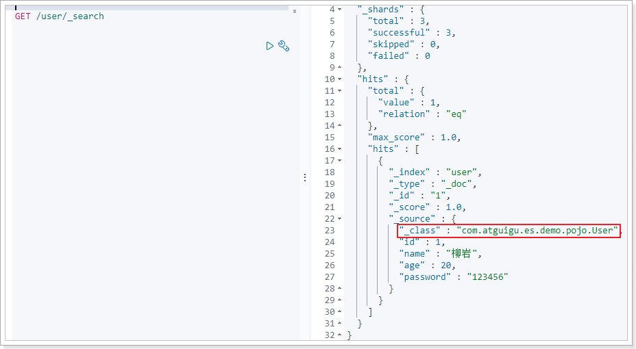

7.x版本会自动添加一个_class字段，但是不影响相关操作。


### 6.4.2. 删除

```java
@Test
void testDelete(){
    this.userRepository.deleteById(1l);
}
```


### 6.4.3. 基本查询


查询一个：

```java
@Test
void testFind(){
    System.out.println(this.userRepository.findById(1l).get());
}
```

基本查询扩展：

**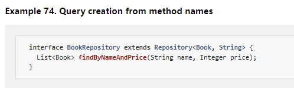**

| Keyword                                       | Sample                                     | Elasticsearch Query String                                   |
| :-------------------------------------------- | :----------------------------------------- | :----------------------------------------------------------- |
| `And`                                         | `findByNameAndPrice`                       | `{ "query" : { "bool" : { "must" : [ { "query_string" : { "query" : "?", "fields" : [ "name" ] } }, { "query_string" : { "query" : "?", "fields" : [ "price" ] } } ] } }}` |
| `Or`                                          | `findByNameOrPrice`                        | `{ "query" : { "bool" : { "should" : [ { "query_string" : { "query" : "?", "fields" : [ "name" ] } }, { "query_string" : { "query" : "?", "fields" : [ "price" ] } } ] } }}` |
| `Is`                                          | `findByName`                               | `{ "query" : { "bool" : { "must" : [ { "query_string" : { "query" : "?", "fields" : [ "name" ] } } ] } }}` |
| `Not`                                         | `findByNameNot`                            | `{ "query" : { "bool" : { "must_not" : [ { "query_string" : { "query" : "?", "fields" : [ "name" ] } } ] } }}` |
| `Between`                                     | `findByPriceBetween`                       | `{ "query" : { "bool" : { "must" : [ {"range" : {"price" : {"from" : ?, "to" : ?, "include_lower" : true, "include_upper" : true } } } ] } }}` |
| `LessThan`                                    | `findByPriceLessThan`                      | `{ "query" : { "bool" : { "must" : [ {"range" : {"price" : {"from" : null, "to" : ?, "include_lower" : true, "include_upper" : false } } } ] } }}` |
| `LessThanEqual`                               | `findByPriceLessThanEqual`                 | `{ "query" : { "bool" : { "must" : [ {"range" : {"price" : {"from" : null, "to" : ?, "include_lower" : true, "include_upper" : true } } } ] } }}` |
| `GreaterThan`                                 | `findByPriceGreaterThan`                   | `{ "query" : { "bool" : { "must" : [ {"range" : {"price" : {"from" : ?, "to" : null, "include_lower" : false, "include_upper" : true } } } ] } }}` |
| `GreaterThanEqual`                            | `findByPriceGreaterThan`                   | `{ "query" : { "bool" : { "must" : [ {"range" : {"price" : {"from" : ?, "to" : null, "include_lower" : true, "include_upper" : true } } } ] } }}` |
| `Before`                                      | `findByPriceBefore`                        | `{ "query" : { "bool" : { "must" : [ {"range" : {"price" : {"from" : null, "to" : ?, "include_lower" : true, "include_upper" : true } } } ] } }}` |
| `After`                                       | `findByPriceAfter`                         | `{ "query" : { "bool" : { "must" : [ {"range" : {"price" : {"from" : ?, "to" : null, "include_lower" : true, "include_upper" : true } } } ] } }}` |
| `Like`                                        | `findByNameLike`                           | `{ "query" : { "bool" : { "must" : [ { "query_string" : { "query" : "?*", "fields" : [ "name" ] }, "analyze_wildcard": true } ] } }}` |
| `StartingWith`                                | `findByNameStartingWith`                   | `{ "query" : { "bool" : { "must" : [ { "query_string" : { "query" : "?*", "fields" : [ "name" ] }, "analyze_wildcard": true } ] } }}` |
| `EndingWith`                                  | `findByNameEndingWith`                     | `{ "query" : { "bool" : { "must" : [ { "query_string" : { "query" : "*?", "fields" : [ "name" ] }, "analyze_wildcard": true } ] } }}` |
| `Contains/Containing`                         | `findByNameContaining`                     | `{ "query" : { "bool" : { "must" : [ { "query_string" : { "query" : "*?*", "fields" : [ "name" ] }, "analyze_wildcard": true } ] } }}` |
| `In` (when annotated as FieldType.Keyword)    | `findByNameIn(Collection<String>names)`    | `{ "query" : { "bool" : { "must" : [ {"bool" : {"must" : [ {"terms" : {"name" : ["?","?"]}} ] } } ] } }}` |
| `In`                                          | `findByNameIn(Collection<String>names)`    | `{ "query": {"bool": {"must": [{"query_string":{"query": "\"?\" \"?\"", "fields": ["name"]}}]}}}` |
| `NotIn` (when annotated as FieldType.Keyword) | `findByNameNotIn(Collection<String>names)` | `{ "query" : { "bool" : { "must" : [ {"bool" : {"must_not" : [ {"terms" : {"name" : ["?","?"]}} ] } } ] } }}` |
| `NotIn`                                       | `findByNameNotIn(Collection<String>names)` | `{"query": {"bool": {"must": [{"query_string": {"query": "NOT(\"?\" \"?\")", "fields": ["name"]}}]}}}` |
| `Near`                                        | `findByStoreNear`                          | `Not Supported Yet !`                                        |
| `True`                                        | `findByAvailableTrue`                      | `{ "query" : { "bool" : { "must" : [ { "query_string" : { "query" : "true", "fields" : [ "available" ] } } ] } }}` |
| `False`                                       | `findByAvailableFalse`                     | `{ "query" : { "bool" : { "must" : [ { "query_string" : { "query" : "false", "fields" : [ "available" ] } } ] } }}` |
| `OrderBy`                                     | `findByAvailableTrueOrderByNameDesc`       | `{ "query" : { "bool" : { "must" : [ { "query_string" : { "query" : "true", "fields" : [ "available" ] } } ] } }, "sort":[{"name":{"order":"desc"}}] }` |


### 6.4.4. 使用@Query注解

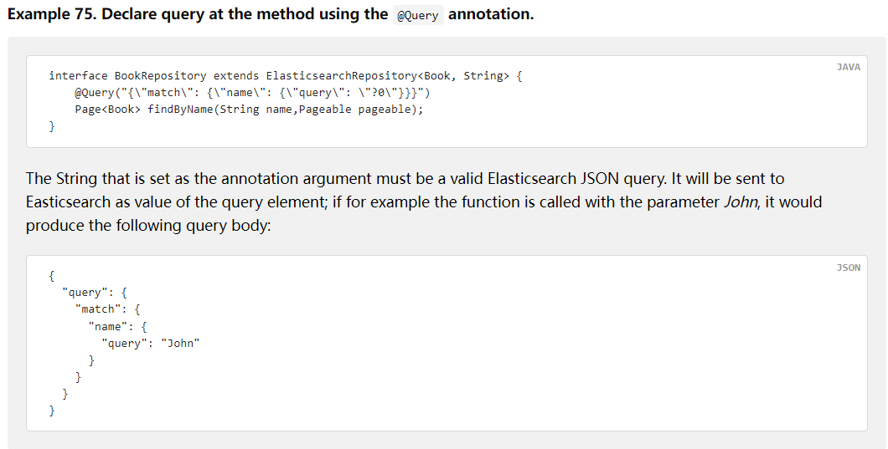

```java
@Query("{\n" +
        "    \"range\": {\n" +
        "      \"age\": {\n" +
        "        \"gte\": \"?0\",\n" +
        "        \"lte\": \"?1\"\n" +
        "      }\n" +
        "    }\n" +
        "  }")
List<User> findByAgeBetween2(Integer age1 , Integer age2);
```


## 6.5. RestHighLevelClient

如果是6.8.x推荐使用原生RestHighLevelClient客户端

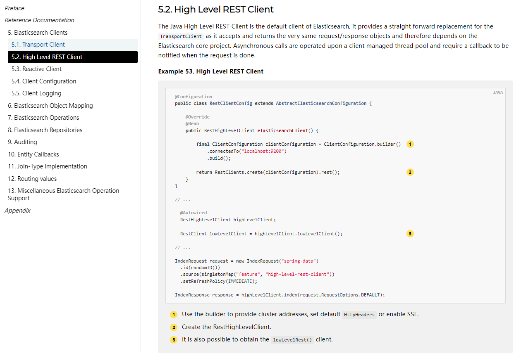

```java
@SpringBootTest
class EsDemoApplicationTests2 {

    // springboot-elasticsearch 对应原生客户端提供了支持，直接注入即可使用
    @Autowired
    private RestHighLevelClient restHighLevelClient;

    // jackson工具类
    private static final ObjectMapper MAPPER = new ObjectMapper();

    @Test
    void testRestHighLevelClient() throws IOException {
        // 搜索条件构建器
        SearchSourceBuilder sourceBuilder = new SearchSourceBuilder();
        // 构建搜索请求体，设置索引库 并设置搜索条件构建器
        SearchRequest searchRequest = new SearchRequest(new String[]{"user"}, sourceBuilder);
        // 向构建器中放入搜索条件
        BoolQueryBuilder boolQueryBuilder = QueryBuilders.boolQuery();
        sourceBuilder.query(boolQueryBuilder);
        boolQueryBuilder.must(QueryBuilders.matchQuery("name", "冰冰").operator(Operator.AND));
        boolQueryBuilder.filter(QueryBuilders.rangeQuery("age").gte(19).lte(23));

        // 排序
        sourceBuilder.sort("age", SortOrder.DESC);

        // 分页
        sourceBuilder.from(2);
        sourceBuilder.size(2);

        // 高亮
        sourceBuilder.highlighter(new HighlightBuilder().field("name").preTags("<em>").postTags("</em>"));

        // 聚合
        sourceBuilder.aggregation(AggregationBuilders.terms("pwdAgg").field("password"));

        System.out.println(sourceBuilder);
        // 执行搜索功能，返回响应对象
        SearchResponse response = this.restHighLevelClient.search(searchRequest, RequestOptions.DEFAULT);
        System.out.println(response);

        // 查询结果集
        SearchHits hits = response.getHits();
        System.out.println("一共命中：" + hits.getTotalHits());
        SearchHit[] hitsHits = hits.getHits();
        for (SearchHit hitsHit : hitsHits) {
            String json = hitsHit.getSourceAsString();
            User user = MAPPER.readValue(json, User.class);
            System.out.println("高亮前：" + user);

            // 高亮结果集
            Map<String, HighlightField> highlightFields = hitsHit.getHighlightFields();
            HighlightField highlightField = highlightFields.get("name");
            user.setName(highlightField.fragments()[0].string());
            System.out.println("高亮后：" + user);
        }

        // 聚合结果集
        Aggregations aggregations = response.getAggregations();
        ParsedStringTerms pwdAgg = aggregations.get("pwdAgg");
        List<? extends Terms.Bucket> buckets = pwdAgg.getBuckets();
        buckets.forEach(bucket -> {
            System.out.println("桶的key：" + bucket.getKeyAsString());
            System.out.println("桶中的元素数量：" + bucket.getDocCount());
        });
    }

}
```

上述程序在7.x中会报错：

```
com.fasterxml.jackson.databind.exc.UnrecognizedPropertyException: Unrecognized field "_class" (class com.atguigu.es.demo.pojo.User), not marked as ignorable (4 known properties: "id", "age", "name", "password"])
 at [Source: (String)"{"_class":"com.atguigu.es.demo.pojo.User","id":3,"name":"李冰冰","age":20,"password":"123456"}"; line: 1, column: 12] (through reference chain: com.atguigu.es.demo.pojo.User["_class"])
```

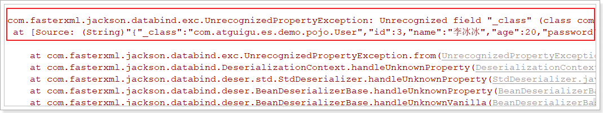

意思：User实体类中没有_class字段，反序列化时就会出错。

解决方法如下：

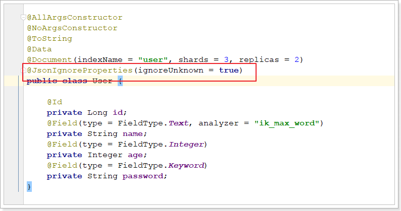

