# 1. RabbitMQ

## 1.1.   分布式开发遇到的问题

随着微服务架构的流行，MQ成了解决微服务之间问题的常用工具。

以电商应用为例，应用中有订单系统、库存系统、物流系统、支付系统。用户创建订单后，如果耦合调用库存系统、物流系统、支付系统，任何一个子系统出了故障，都会造成下单操作异常。

当转变成基于消息队列的方式后，系统间调用的问题会减少很多，比如物流系统因为发生故障，需要几分钟来修复。在这几分钟的时间里，物流系统要处理的内存被缓存在消息队列中，用户的下单操作可以正常完成。当物流系统恢复后，继续处理订单信息即可，中单用户感受不到物流系统的故障。提升系统的可用性。


## 1.2.   消息队列（MQ）

### 1.2.1.   什么是消息队列

消息队列，即MQ，Message Queue。


**消息传递：**指的是程序之间通过消息发送数据进行通信，而不是通过直接调用彼此来通信，直接调用通常是用于诸如远程过程调用的技术。

**排队：**指的是应用程序通过队列来通信。

**业务场景说明：**

消息队列在大型电子商务类网站，如京东、淘宝、去哪儿等网站有着深入的应用，为什么会产生消息队列？有几个原因：

不同进程（process）之间传递消息时，两个进程之间**耦合**程度过高，改动一个进程，引发必须修改另一个进程，为了**隔离**这两个进程，在两进程间抽离出一层（一个模块），所有两进程之间传递的消息，都必须通过消息队列来传递，单独修改某一个进程，不会影响另一个；

不同进程（process）之间传递消息时，为了实现标准化，将消息的格式规范化了，并且，某一个进程接受的**消息太多**，一下子无法处理完，并且也有先后顺序，必须对收到的消息**进行排队**，因此诞生了事实上的消息队列；

消息队列是典型的：生产者、消费者模型。生产者不断向消息队列中生产消息，消费者不断的从队列中获取消息。因为消息的生产和消费都是异步的，而且只关心消息的发送和接收，没有业务逻辑的侵入，这样就实现了生产者和消费者的解耦。

结合前面所说的问题：

- 商品服务对商品增删改以后，无需去操作索引库，只是发送一条消息，也不关心消息被谁接收。
- 搜索服务服务接收消息，去处理索引库。

如果以后有其它系统也依赖商品服务的数据，同样监听消息即可，商品服务无需任何代码修改。


### 1.2.2 消息队列主要作用

#### 1、异步处理

串行和并行：

(1) **串行方式：**

> 将注册信息写入数据库后，发送注册邮件，再发送注册短信，以上三个任务全部完成后才返回给客户端。 这有一个问题是，邮件，短信并不是必须的，它只是一个通知，而这种做法让客户端等待没有必要等待的东西。

(2) **并行方式：**

> 将注册信息写入数据库后，发送邮件的同时，发送短信，以上三个任务完成后，返回给客户端，并行的方式能提高处理的时间。

传统模式的缺点：

- 一些非必要的业务逻辑以同步(串行)的方式运行，太耗费时间。


中间件模式的的优点：

- 将消息写入消息队列，非必要的业务逻辑以异步的方式运行，加快响应速度


#### 2、解耦服务

传统模式的缺点：

- 系统间耦合性太强，系统A在代码中直接调用系统B和系统C的代码，如果将来D系统接入，系统A还需要修改代码，过于麻烦！

****

消息中间件模式的的优点：

- 将消息写入消息队列，需要消息的系统自己从消息队列中订阅，从而系统A不需要做任何修改。

****

#### 3、流量削峰(削峰填谷)

流量削峰一般在秒杀活动中应用广泛
场景: 秒杀活动，一般会因为流量过大，导致应用挂掉,为了解决这个问题，一般在应用前端加入消息队列。

**传统模式**

如订单系统，在下单的时候就会往数据库写数据。但是数据库只能支撑每秒1000左右的并发写入，并发量再高就容易宕机。低峰期的时候并发也就100多个，但是在高峰期时候，并发量会突然激增到5000以上，这个时候数据库肯定卡死了。


**中间件模式**

消息被MQ保存起来了，然后系统就可以按照自己的消费能力来消费，比如每秒1000个数据，这样慢慢写入数据库，这样就不会卡死数据库了。


### 1.2.2.   AMQP和JMS

MQ是消息通信的模型，并不是具体实现。现在实现MQ的有两种主流方式：AMQP、JMS。


两者间的区别和联系：

- JMS是定义了统一的接口，来对消息操作进行统一；AMQP是通过规定协议来统一数据交互的格式
- JMS限定了必须使用Java语言；AMQP只是协议，不规定实现方式，因此是跨语言的。
- JMS规定了两种消息模型；而AMQP的消息模型更加丰富


### 1.2.3.   常见MQ产品


- ActiveMQ：基于JMS
- RabbitMQ：基于AMQP协议，erlang语言开发，稳定性好
- RocketMQ：基于JMS，阿里巴巴产品，目前交由Apache基金会
- Kafka：分布式消息系统，高吞吐量


### 1.2.4.   RabbitMQ

RabbitMQ由erlang语言开发，是基于AMQP的一款消息管理系统

官网： http://www.rabbitmq.com/

官方教程：http://www.rabbitmq.com/getstarted.html


 

RabbitMQ 基础架构如下图：


**Broker：**接收和分发消息的应用，RabbitMQ Server就是 Message Broker

**Virtual host：**出于多租户和安全因素设计的，把 AMQP 的基本组件划分到一个虚拟的分组中，类似于网络中的 namespace 概念。当多个不同的用户使用同一个 RabbitMQ server 提供的服务时，可以划分出多个vhost，每个用户在自己的 vhost 创建 exchange／queue 等

**Connection：**publisher／consumer 和 broker 之间的 TCP 连接

**Channel：**如果每一次访问 RabbitMQ 都建立一个 Connection，在消息量大的时候建立 TCP Connection的开销将是巨大的，效率也较低。Channel 是在 connection 内部建立的逻辑连接，如果应用程序支持多线程，通常每个thread创建单独的 channel 进行通讯，AMQP method 包含了channel id 帮助客户端和message broker 识别 channel，所以 channel 之间是完全隔离的。Channel 作为轻量级的 Connection 极大减少了操作系统建立 TCP connection 的开销

**Exchange：**message 到达 broker 的第一站，根据分发规则，匹配查询表中的 routing key，分发消息到queue 中去。常用的类型有：direct (point-to-point), topic (publish-subscribe) and fanout (multicast)

**Queue：**消息最终被送到这里等待 consumer 取走

**Binding：**exchange 和 queue 之间的虚拟连接，binding 中可以包含 routing key。Binding 信息被保存到 exchange 中的查询表中，用于 message 的分发依据


## 1.3.   下载和安装

### 1.3.1.   下载

官网下载地址：http://www.rabbitmq.com/download.html


### 1.3.2.   安装

#### 1. 方式1-docker中安装

下载镜像：`docker pull rabbitmq:management`

创建实例并启动：

```
docker run -d --name rabbitmq --publish 5671:5671 \
--publish 5672:5672 --publish 4369:4369 --publish 25672:25672 --publish 15671:15671 --publish 15672:15672 \
rabbitmq:management
```

注：
4369 -- erlang发现口
5672 --client端通信口

15672 -- 管理界面ui端口
25672 -- server间内部通信口

#### 2.  方式2-安装包安装

##### 2.1 安装Erlang、Socat、RabbitMQ

拷贝课件中的安装包到虚拟机/opt目录下

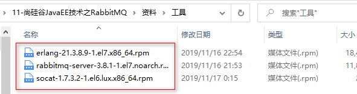

执行安装命令：

```sh
rpm -ivh erlang-21.3.8.9-1.el7.x86_64.rpm

rpm -ivh socat-1.7.3.2-1.el6.lux.x86_64.rpm 

rpm -ivh  rabbitmq-server-3.8.1-1.el7.noarch.rpm
#如果rabbitmq安装报错，在线安装socat
yum install -y socat
```

安装成功后rabbitmq命令存放在：/usr/lib/rabbitmq/lib/rabbitmq_server-3.8.1/sbin 

**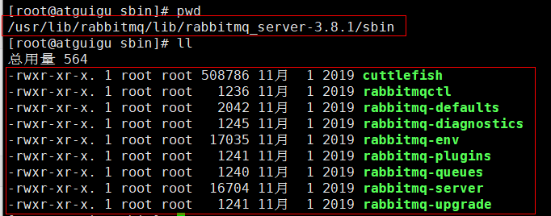**

##### 2.2 启用管理插件

```
rabbitmq-plugins enable rabbitmq_management
```

##### 2.3 RabbitMQ启停命令

```
# 第一次启动时会比较慢
systemctl start rabbitmq-server.service

systemctl status rabbitmq-server.service

systemctl restart rabbitmq-server.service

systemctl stop rabbitmq-server.service 
```

##### 2.4 查看进程

```
ps -ef | grep rabbitmq
```

rabbitmq启动时会监听三个端口号：

​	5672： 其他程序和rabbitmq交互的端口[比如：java程序需要使用rabbitmq，就和此端口建立连接]

​	15672：rabbitmq的后台管理系统的端口号[rabbitmq的客户端]

​	25672：集群环境搭建的端口号

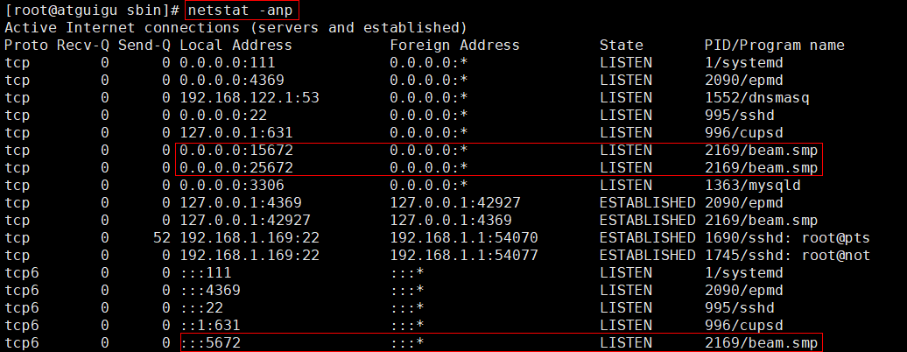

### 1.3.3.   测试

在web浏览器中输入地址：http://虚拟机ip:15672/

输入默认账号: guest   : guest，默认不允许远程连接

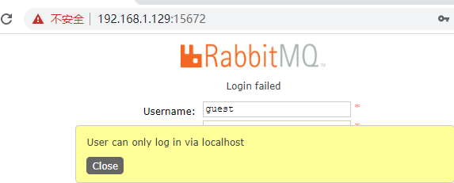

解决：

增加管理员账号：

```
rabbitmqctl add_user admin admin
```

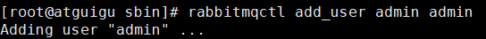

如果新增慢，然后报错新增失败，解决方案：

```sh
//查询当前主机的名称
cat /etc/hostname
//将主机名称和本机的ip 127.0.0.1绑定映射存到hosts文件中
vim /etc/hosts
127.0.0.1    查询到的主机名称
//然后再次添加用户
rabbitmqctl add_user admin admin
```


给账号分配角色：

```
# 角色:
# 1、超级管理员(administrator)：所有权限
# 2、监控者(monitoring): 登录控制台、查看mq信息权限
# 3、策略制定者(policymaker)：登录控制台、管理policy权限
# 4、普通管理者(management)：只能登录控制台
rabbitmqctl set_user_tags admin administrator
```

修改角色密码：

```
rabbitmqctl change_password admin 123456
```

查看用户列表：

```
rabbitmqctl list_users
```

测试，使用新建账号登录

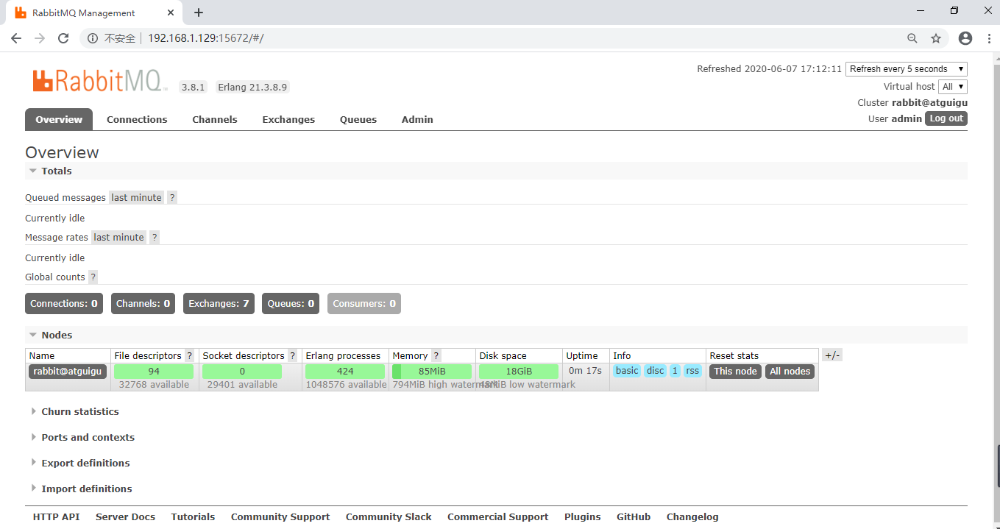


overview：概览

connections：无论生产者还是消费者，都需要与RabbitMQ建立连接后才可以完成消息的生产和消费，在这里可以查看连接情况

channels：通道，建立连接后，会形成通道，消息的投递获取依赖通道。

Exchanges：交换机，用来实现消息的路由

Queues：队列，即消息队列，消息存放在队列中，等待消费，消费后被移除队列。

 

端口：

5672: rabbitMq的编程语言客户端连接端口

15672：rabbitMq管理界面端口

25672：rabbitMq集群的端口

### 1.3.4. 卸载

1、停止rabbitmq服务

```
systemctl stop rabbitmq-server
```


2、卸载erlang
查看erlang安装的相关列表

```
yum list|grep erlang
```


卸载erlang所有内容

```
yum -y remove erlang-*
```


删除erlang目录

```
rm -rf /usr/lib64/erlang
```

3、卸载rabbitmq
查看rabbitmq安装的相关列表

```
yum list|grep rabbitmq
```


卸载rabbitmq所有内容

```
yum -y remove rabbitmq-server.noarch
```


查找并删除rabbitmq相关目录

```
find / -name rabbit*
```

依次删除对应目录：rm -rf 路径
例如：

```sh
rm -rvf /var/lib/rabbitmq
rm -rvf /usr/lib/rabbitmq
rm -rvf /var/log/rabbitmq
```


## 1.4.   管理界面

### 1.4.1.   管理界面添加用户

通过管理界面我们也可以自己创建一个用户：


1、 超级管理员(administrator)

可登陆管理控制台，可查看所有的信息，并且可以对用户，策略(policy)进行操作。

2、 监控者(monitoring)

可登陆管理控制台，同时可以查看rabbitmq节点的相关信息(进程数，内存使用情况，磁盘使用情况等)

3、 策略制定者(policymaker)

可登陆管理控制台, 同时可以对policy进行管理。但无法查看节点的相关信息(上图红框标识的部分)。

4、 普通管理者(management)

仅可登陆管理控制台，无法看到节点信息，也无法对策略进行管理。

5、 其他

无法登陆管理控制台，通常就是普通的生产者和消费者。

 

### 1.4.2.   创建Virtual Hosts

虚拟主机：类似于mysql中的database。他们都是以“/”开头


### 1.4.3.   设置权限


# 2. 五种消息模型

RabbitMQ提供了6种消息模型，但是第6种其实是RPC，并不是MQ，因此不予学习。那么也就剩下5种。

但是其实3、4、5这三种都属于订阅模型，只不过进行路由的方式不同。


我们通过一个demo工程来了解下RabbitMQ的工作方式，导入工程：

 

依赖：

```xml
<project xmlns="http://maven.apache.org/POM/4.0.0" xmlns:xsi="http://www.w3.org/2001/XMLSchema-instance"
	xsi:schemaLocation="http://maven.apache.org/POM/4.0.0 http://maven.apache.org/xsd/maven-4.0.0.xsd">
	<modelVersion>4.0.0</modelVersion>
	<groupId>cn.atguigu.rabbitmq</groupId>
	<artifactId>atguigu-rabbitmq</artifactId>
	<version>0.0.1-SNAPSHOT</version>
	<parent>
		<groupId>org.springframework.boot</groupId>
		<artifactId>spring-boot-starter-parent</artifactId>
		<version>2.3.0.RELEASE</version>
	</parent>
	<properties>
		<java.version>1.8</java.version>
	</properties>
	<dependencies>
		<dependency>
			<groupId>org.apache.commons</groupId>
			<artifactId>commons-lang3</artifactId>
			<version>3.3.2</version>
		</dependency>
		<dependency>
			<groupId>org.springframework.boot</groupId>
			<artifactId>spring-boot-starter-amqp</artifactId>
		</dependency>
		<dependency>
			<groupId>org.springframework.boot</groupId>
			<artifactId>spring-boot-starter-test</artifactId>
		</dependency>
	</dependencies>
</project>
```

我们抽取一个建立RabbitMQ连接的工具类，方便其他程序获取连接：

```java
import com.rabbitmq.client.Connection;
import com.rabbitmq.client.ConnectionFactory;

public class ConnectionUtil {
    public static Connection getConnection() throws Exception {
        //定义连接工厂
        ConnectionFactory factory = new ConnectionFactory();
        //设置服务地址
        factory.setHost("192.168.1.129");
        //端口
        factory.setPort(5672);
        //设置账号信息，用户名、密码、vhost
        factory.setVirtualHost("/zhenguo");
        factory.setUsername("anni");
        factory.setPassword("123456");
        // 通过工程获取连接
        Connection connection = factory.newConnection();
        return connection;
    }
}
```


## 2.1.   基本消息模型-simple

官方介绍：

 

RabbitMQ是一个消息代理：它接受和转发消息。 你可以把它想象成一个邮局：当你把邮件放在邮箱里时，你可以确定邮差先生最终会把邮件发送给你的收件人。 在这个比喻中，RabbitMQ是邮政信箱，邮局和邮递员。

RabbitMQ与邮局的主要区别是它不处理纸张，而是接受，存储和转发数据消息的二进制数据块。

 

P（producer/ publisher）：生产者，一个发送消息的用户应用程序。

C（consumer）：消费者，消费和接收有类似的意思，消费者是一个主要用来等待接收消息的用户应用程序

队列（红色区域）：rabbitmq内部类似于邮箱的一个概念。虽然消息流经rabbitmq和你的应用程序，但是它们只能存储在队列中。队列只受主机的内存和磁盘限制，实质上是一个大的消息缓冲区。许多生产者可以发送消息到一个队列，许多消费者可以尝试从一个队列接收数据。

总之：

生产者将消息发送到队列，消费者从队列中获取消息，队列是存储消息的缓冲区。


我们将用Java编写两个程序;发送单个消息的生产者，以及接收消息并将其打印出来的消费者。我们将详细介绍Java API中的一些细节，这是一个消息传递的“Hello World”。

我们将调用我们的消息发布者（发送者）Send和我们的消息消费者（接收者）Recv。发布者将连接到RabbitMQ，发送一条消息，然后退出。

### 2.1.1.   生产者发送消息

```java
public class Send {

    private final static String QUEUE_NAME = "simple_queue";

    public static void main(String[] argv) throws Exception {
        // 获取到连接以及mq通道
        Connection connection = ConnectionUtil.getConnection();
        // 从连接中创建通道，这是完成大部分API的地方。
        Channel channel = connection.createChannel();

        // 声明（创建）队列，必须声明队列才能够发送消息，我们可以把消息发送到队列中。
        /**
         * 参数1：queue，队列名称
         * 参数2：durable，是否持久化
         * 参数3：exclusive，队列是否为专用队列，如果是专用队列断开连接后会自动删除
         * 参数4：autoDelete，队列长时间闲置时是否需要删除
         * 参数5：arguments，队列的其他参数
         */
        channel.queueDeclare(QUEUE_NAME, false, false, false, null);

        // 消息内容
        String message = "Hello World!";
        channel.basicPublish("", QUEUE_NAME, null, message.getBytes());
        System.out.println(" [x] Sent '" + message + "'");

        //关闭通道和连接
        channel.close();
        connection.close();
    }
}
```

控制台：


### 2.1.2.   管理工具中查看消息

进入队列页面，可以看到新建了一个队列：simple_queue


点击队列名称，进入详情页，可以查看消息：

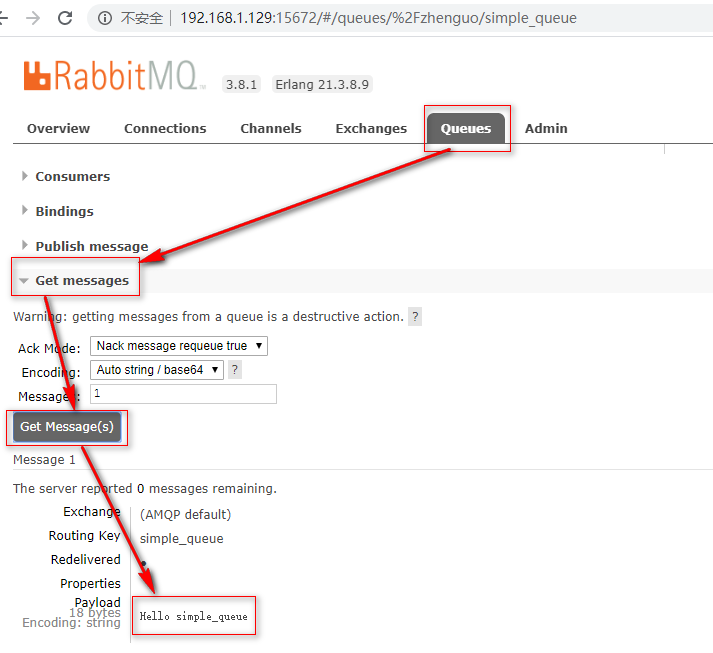

在控制台查看消息并不会将消息消费，所以消息还在。


### 2.1.3.   消费者获取消息

```java
public class Recv {
    private final static String QUEUE_NAME = "simple_queue";

    public static void main(String[] argv) throws Exception {
        // 获取到连接
        Connection connection = ConnectionUtil.getConnection();
        // 创建通道
        Channel channel = connection.createChannel();
        // 声明队列
        channel.queueDeclare(QUEUE_NAME, false, false, false, null);
        // 定义队列的消费者
        DefaultConsumer consumer = new DefaultConsumer(channel) {
            // 获取消息，并且处理，这个方法类似事件监听，如果有消息的时候，会被自动调用
            @Override
            public void handleDelivery(String consumerTag, Envelope envelope, BasicProperties properties,
                    byte[] body) throws IOException {
                // body 即消息体
                String msg = new String(body);
                System.out.println(" [x] received : " + msg + "!");
            }
        };
        // 监听队列，第二个参数：是否自动进行消息确认。阻塞等待获取队列中的消息
        channel.basicConsume(QUEUE_NAME, true, consumer);
    }
}
```

控制台：


这个时候，队列中的消息就没了：


我们发现，消费者已经获取了消息，但是程序没有停止，一直在监听队列中是否有新的消息。一旦有新的消息进入队列，就会立即打印.


### 2.1.4.   消息确认机制（ACK）

通过刚才的案例可以看出，消息一旦被消费者接收，队列中的消息就会被删除。

那么问题来了：RabbitMQ怎么知道消息被接收了呢？

如果消费者领取消息后，还没执行操作就挂掉了呢？或者抛出了异常？消息消费失败，但是RabbitMQ无从得知，这样消息就丢失了！

因此，RabbitMQ有一个ACK机制。当消费者获取消息后，会向RabbitMQ发送回执ACK（Acknowledge character：确认字符），告知消息已经被接收。不过这种回执ACK分两种情况：

- 自动ACK：消息一旦被接收，消费者自动发送ACK
- 手动ACK：消息接收后，不会发送ACK，需要手动调用

大家觉得哪种更好呢？

这需要看消息的重要性：

- 如果消息不太重要，丢失也没有影响，那么自动ACK会比较方便
- 如果消息非常重要，不容丢失。那么最好在消费完成后手动ACK，否则接收消息后就自动ACK，RabbitMQ就会把消息从队列中删除。如果此时消费者宕机，那么消息就丢失了。

我们之前的测试都是自动ACK的，如果要手动ACK，需要改动我们的代码：

```java
public class Recv2 {
    private final static String QUEUE_NAME = "simple_queue";

    public static void main(String[] argv) throws Exception {
        // 获取到连接
        Connection connection = ConnectionUtil.getConnection();
        // 创建通道
        final Channel channel = connection.createChannel();
        // 声明队列
        channel.queueDeclare(QUEUE_NAME, false, false, false, null);
        // 定义队列的消费者
        DefaultConsumer consumer = new DefaultConsumer(channel) {
            // 获取消息，并且处理，这个方法类似事件监听，如果有消息的时候，会被自动调用
            @Override
            public void handleDelivery(String consumerTag, Envelope envelope, BasicProperties properties,
                    byte[] body) throws IOException {
                // body 即消息体
                String msg = new String(body);
                System.out.println(" [x] received : " + msg + "!");
                // 手动进行ACK
                channel.basicAck(envelope.getDeliveryTag(), false);
            }
        };
        // 监听队列，第二个参数false，手动进行ACK
        channel.basicConsume(QUEUE_NAME, false, consumer);
    }
}
```

注意到最后一行代码：

```java
channel.basicConsume(QUEUE_NAME, false, consumer);
```

如果第二个参数为true，则会自动进行ACK；如果为false，则需要手动ACK。方法的声明：


#### 2.1.4.1.   自动ACK存在的问题

修改消费者，添加异常，如下：


生产者不做任何修改，直接运行，消息发送成功：


运行消费者，程序抛出异常。但是消息依然被消费：


管理界面：


 

#### 2.1.4.2.   演示手动ACK

修改消费者，把自动改成手动（去掉之前制造的异常）


生产者不变，再次运行：


运行消费者


但是，查看管理界面，发现：


停掉消费者的程序，发现：


这是因为虽然我们设置了手动ACK，但是代码中并没有进行消息确认！所以消息并未被真正消费掉。

当我们关掉这个消费者，消息的状态再次称为Ready

 

修改代码手动ACK：


执行：


消息消费成功！


## 2.2.   work消息模型

工作队列或者竞争消费者模式

 

在第一篇教程中，我们编写了一个程序，从一个命名队列中发送并接受消息。在这里，我们将创建一个工作队列，在多个工作者之间分配耗时任务。

工作队列，又称任务队列。主要思想就是避免执行资源密集型任务时，必须等待它执行完成。相反我们稍后完成任务，我们将任务封装为消息并将其发送到队列。 在后台运行的工作进程将获取任务并最终执行作业。当你运行许多消费者时，任务将在他们之间共享，但是**一个消息只能被一个消费者获取**。

这个概念在Web应用程序中特别有用，因为在短的HTTP请求窗口中无法处理复杂的任务。

接下来我们来模拟这个流程：

```
P：生产者：任务的发布者

C1：消费者，领取任务并且完成任务，假设完成速度较快

C2：消费者2：领取任务并完成任务，假设完成速度慢
```


面试题：避免消息堆积？

1）采用workqueue，多个消费者监听同一队列。

2）接收到消息以后，而是通过线程池，异步消费。

 

### 2.2.1.   生产者

生产者与案例1中的几乎一样：

```java
public class Send {
    private final static String QUEUE_NAME = "test_work_queue";

    public static void main(String[] argv) throws Exception {
        // 获取到连接
        Connection connection = ConnectionUtil.getConnection();
        // 获取通道
        Channel channel = connection.createChannel();
        // 声明队列
        channel.queueDeclare(QUEUE_NAME, false, false, false, null);
        // 循环发布任务
        for (int i = 0; i < 50; i++) {
            // 消息内容
            String message = "task .. " + i;
            channel.basicPublish("", QUEUE_NAME, null, message.getBytes());
            System.out.println(" [x] Sent '" + message + "'");

            Thread.sleep(i * 2);
        }
        // 关闭通道和连接
        channel.close();
        connection.close();
    }
}
```

不过这里我们是循环发送50条消息。

### 2.2.2.   消费者1

```java
public class Recv1 {
    private final static String QUEUE_NAME = "test_work_queue";

    public static void main(String[] argv) throws Exception {
        // 获取到连接
        Connection connection = ConnectionUtil.getConnection();
        // 创建通道
        Channel channel = connection.createChannel();
        // 声明队列
        channel.queueDeclare(QUEUE_NAME, false, false, false, null);
        // 定义队列的消费者
        DefaultConsumer consumer = new DefaultConsumer(channel) {
            @Override
            public void handleDelivery(String consumerTag, Envelope envelope, AMQP.BasicProperties properties, byte[] body) throws IOException {
                String msg = new String(body);
                System.out.println(" [消费者1] received : " + msg + "!");
                //模拟消耗时间
                try {
                    Thread.sleep(1000);
                } catch (InterruptedException e) {
                    e.printStackTrace();
                }
                channel.basicAck(envelope.getDeliveryTag(),false);
            }
        };
        channel.basicConsume(QUEUE_NAME, false ,consumer);
    }
}
```

### 2.2.3.   消费者2

```java
public class Recv2 {
    private final static String QUEUE_NAME = "test_work_queue";

    public static void main(String[] argv) throws Exception {
        // 获取到连接
        Connection connection = ConnectionUtil.getConnection();
        // 创建通道
        Channel channel = connection.createChannel();
        // 声明队列
        channel.queueDeclare(QUEUE_NAME, false, false, false, null);
        // 定义队列的消费者
        DefaultConsumer consumer = new DefaultConsumer(channel) {
            @Override
            public void handleDelivery(String consumerTag, Envelope envelope, AMQP.BasicProperties properties, byte[] body) throws IOException {
                String msg = new String(body);
                System.out.println(" [消费者2] received : " + msg + "!");
                channel.basicAck(envelope.getDeliveryTag(),false);
            }
        };
        channel.basicConsume(QUEUE_NAME, false ,consumer);
    }
}
```

与消费者1基本类似，就是没有设置消费耗时时间。

这里是模拟有些消费者快，有些比较慢。


接下来，两个消费者一同启动，然后发送50条消息：


可以发现，两个消费者各自消费了25条消息，而且各不相同，这就实现了任务的分发。


### 2.2.4.   能者多劳

刚才的实现有问题吗？

- 消费者2比消费者1的效率要低，一次任务的耗时较长
- 然而两人最终消费的消息数量是一样的
- 消费者1大量时间处于空闲状态，消费者2一直忙碌

现在的状态属于是把任务平均分配，正确的做法应该是消费越快的人，消费的越多。

怎么实现呢？

在比较慢的消费者创建队列后我们可以使用basicQos方法和prefetchCount = 1设置。 这告诉RabbitMQ一次不要向工作人员发送多于一条消息。 或者换句话说，不要向工作人员发送新消息，直到它处理并确认了前一个消息。 相反，它会将其分派给空闲的下一个工作人员。(注意：必须手动ack)


再次测试：


## 2.3.   订阅模型分类

在之前的模式中，我们创建了一个工作队列。 工作队列背后的假设是：每个任务只被传递给一个工作人员。 在这一部分，我们将做一些完全不同的事情 - 我们将会传递一个信息给多个消费者。 这种模式被称为“发布/订阅”。 

订阅模型示意图：

 

解读：

1、1个生产者，多个消费者

2、每一个消费者都有自己的一个队列

3、生产者没有将消息直接发送到队列，而是发送到了交换机

4、每个队列都要绑定到交换机

5、生产者发送的消息，经过交换机到达队列，实现一个消息被多个消费者获取的目的

X（Exchanges）：交换机一方面：接收生产者发送的消息。另一方面：知道如何处理消息，例如递交给某个特别队列、递交给所有队列、或是将消息丢弃。到底如何操作，取决于Exchange的类型。

Exchange类型有以下几种：

```
Fanout：广播，将消息交给所有绑定到交换机的队列

Direct：定向，把消息交给符合指定routing key 的队列 

Topic：通配符，把消息交给符合routing pattern（路由模式） 的队列

```

我们这里先学习

```
Fanout：广播模式
```

**Exchange（交换机）只负责转发消息，不具备存储消息的能力**，因此如果没有任何队列与Exchange绑定，或者没有符合路由规则的队列，那么消息会丢失！


## 2.4.   订阅模型-Fanout

Fanout，也称为广播。

流程图：

 

在广播模式下，消息发送流程是这样的：

- 1）  可以有多个消费者
- 2）  每个**消费者有自己的queue**（队列）
- 3）  每个**队列都要绑定到Exchange**（交换机）
- 4）  **生产者发送的消息，只能发送到交换机**，交换机来决定要发给哪个队列，生产者无法决定。
- 5）  交换机把消息发送给绑定过的所有队列
- 6）  队列的消费者都能拿到消息。实现一条消息被多个消费者消费


### 2.4.1.   生产者

两个变化：

- 1）  声明Exchange，不再声明Queue
- 2）  发送消息到Exchange，不再发送到Queue

```java
public class Send {

    private final static String EXCHANGE_NAME = "fanout_exchange_test";

    public static void main(String[] argv) throws Exception {
        // 获取到连接
        Connection connection = ConnectionUtil.getConnection();
        // 获取通道
        Channel channel = connection.createChannel();
        
        // 声明exchange，指定类型为fanout
        channel.exchangeDeclare(EXCHANGE_NAME, "fanout");
        
        // 消息内容
        String message = "Hello everyone";
        // 发布消息到Exchange
        channel.basicPublish(EXCHANGE_NAME, "", null, message.getBytes());
        System.out.println(" [生产者] Sent '" + message + "'");

        channel.close();
        connection.close();
    }
}

```

### 2.4.2.   消费者1

```java
public class Recv1 {
    private final static String QUEUE_NAME = "fanout_exchange_queue_1";

    private final static String EXCHANGE_NAME = "fanout_exchange_test";

    public static void main(String[] argv) throws Exception {
        // 获取到连接
        Connection connection = ConnectionUtil.getConnection();
        // 获取通道
        Channel channel = connection.createChannel();
        // 声明队列
        channel.queueDeclare(QUEUE_NAME, false, false, false, null);

        // 绑定队列到交换机
        channel.queueBind(QUEUE_NAME, EXCHANGE_NAME, "");

        // 定义队列的消费者
        DefaultConsumer consumer = new DefaultConsumer(channel) {
            // 获取消息，并且处理，这个方法类似事件监听，如果有消息的时候，会被自动调用
            @Override
            public void handleDelivery(String consumerTag, Envelope envelope, BasicProperties properties,
                    byte[] body) throws IOException {
                // body 即消息体
                String msg = new String(body);
                System.out.println(" [消费者1] received : " + msg + "!");
            }
        };
        // 监听队列，自动返回完成
        channel.basicConsume(QUEUE_NAME, true, consumer);
    }
}

```

要注意代码中：**队列需要和交换机绑定**

### 2.4.3.   消费者2

```java
public class Recv2 {
    private final static String QUEUE_NAME = "fanout_exchange_queue_2";

    private final static String EXCHANGE_NAME = "fanout_exchange_test";

    public static void main(String[] argv) throws Exception {
        // 获取到连接
        Connection connection = ConnectionUtil.getConnection();
        // 获取通道
        Channel channel = connection.createChannel();
        // 声明队列
        channel.queueDeclare(QUEUE_NAME, false, false, false, null);

        // 绑定队列到交换机
        channel.queueBind(QUEUE_NAME, EXCHANGE_NAME, "");
        
        // 定义队列的消费者
        DefaultConsumer consumer = new DefaultConsumer(channel) {
            // 获取消息，并且处理，这个方法类似事件监听，如果有消息的时候，会被自动调用
            @Override
            public void handleDelivery(String consumerTag, Envelope envelope, BasicProperties properties,
                    byte[] body) throws IOException {
                // body 即消息体
                String msg = new String(body);
                System.out.println(" [消费者2] received : " + msg + "!");
            }
        };
        // 监听队列，手动返回完成
        channel.basicConsume(QUEUE_NAME, true, consumer);
    }
}

```


### 2.4.4.   测试

我们运行两个消费者，然后发送1条消息：


应用场景：文字直播

## 2.5.   订阅模型-Direct

有选择性的接收消息

在订阅模式中，生产者发布消息，所有消费者都可以获取所有消息。

在路由模式中，我们将添加一个功能 - 我们将只能订阅一部分消息。 例如，我们只能将重要的错误消息引导到日志文件（以节省磁盘空间），同时仍然能够在控制台上打印所有日志消息。

但是，在某些场景下，我们希望不同的消息被不同的队列消费。这时就要用到Direct类型的Exchange。

在Direct模型下，队列与交换机的绑定，不能是任意绑定了，而是要指定一个RoutingKey（路由key）

消息的发送方在向Exchange发送消息时，也必须指定消息的routing key。

 

P：生产者，向Exchange发送消息，发送消息时，会指定一个routing key。

X：Exchange（交换机），接收生产者的消息，然后把消息递交给 与routing key完全匹配的队列

C1：消费者，其所在队列指定了需要routing key 为 error 的消息

C2：消费者，其所在队列指定了需要routing key 为 info、error、warning 的消息


### 2.5.1.   生产者

此处我们模拟商品的增删改，发送消息的RoutingKey分别是：insert、update、delete

```java
public class Send {
    private final static String EXCHANGE_NAME = "direct_exchange_test";

    public static void main(String[] argv) throws Exception {
        // 获取到连接
        Connection connection = ConnectionUtil.getConnection();
        // 获取通道
        Channel channel = connection.createChannel();
        // 声明exchange，指定类型为direct
        channel.exchangeDeclare(EXCHANGE_NAME, "direct");
        // 消息内容
        String message = "商品新增了， id = 1001";
        // 发送消息，并且指定routing key 为：insert ,代表新增商品
        channel.basicPublish(EXCHANGE_NAME, "insert", null, message.getBytes());
        System.out.println(" [商品服务：] Sent '" + message + "'");

        channel.close();
        connection.close();
    }
}
```


### 2.5.2.   消费者1

我们此处假设消费者1只接收两种类型的消息：更新商品和删除商品。

```java
public class Recv {
    private final static String QUEUE_NAME = "direct_exchange_queue_1";
    private final static String EXCHANGE_NAME = "direct_exchange_test";

    public static void main(String[] argv) throws Exception {
        // 获取到连接
        Connection connection = ConnectionUtil.getConnection();
        // 获取通道
        Channel channel = connection.createChannel();
        // 声明队列
        channel.queueDeclare(QUEUE_NAME, false, false, false, null);
        
        // 绑定队列到交换机，同时指定需要订阅的routing key。假设此处需要update和delete消息
        channel.queueBind(QUEUE_NAME, EXCHANGE_NAME, "update");
        channel.queueBind(QUEUE_NAME, EXCHANGE_NAME, "delete");

        // 定义队列的消费者
        DefaultConsumer consumer = new DefaultConsumer(channel) {
            // 获取消息，并且处理，这个方法类似事件监听，如果有消息的时候，会被自动调用
            @Override
            public void handleDelivery(String consumerTag, Envelope envelope, BasicProperties properties,
                    byte[] body) throws IOException {
                // body 即消息体
                String msg = new String(body);
                System.out.println(" [消费者1] received : " + msg + "!");
            }
        };
        // 监听队列，自动ACK
        channel.basicConsume(QUEUE_NAME, true, consumer);
    }
}

```


### 2.5.3.   消费者2

我们此处假设消费者2接收所有类型的消息：新增商品，更新商品和删除商品。

```java
public class Recv2 {
    private final static String QUEUE_NAME = "direct_exchange_queue_2";
    private final static String EXCHANGE_NAME = "direct_exchange_test";

    public static void main(String[] argv) throws Exception {
        // 获取到连接
        Connection connection = ConnectionUtil.getConnection();
        // 获取通道
        Channel channel = connection.createChannel();
        // 声明队列
        channel.queueDeclare(QUEUE_NAME, false, false, false, null);
        
        // 绑定队列到交换机，同时指定需要订阅的routing key。订阅 insert、update、delete
        channel.queueBind(QUEUE_NAME, EXCHANGE_NAME, "insert");
        channel.queueBind(QUEUE_NAME, EXCHANGE_NAME, "update");
        channel.queueBind(QUEUE_NAME, EXCHANGE_NAME, "delete");

        // 定义队列的消费者
        DefaultConsumer consumer = new DefaultConsumer(channel) {
            // 获取消息，并且处理，这个方法类似事件监听，如果有消息的时候，会被自动调用
            @Override
            public void handleDelivery(String consumerTag, Envelope envelope, BasicProperties properties,
                    byte[] body) throws IOException {
                // body 即消息体
                String msg = new String(body);
                System.out.println(" [消费者2] received : " + msg + "!");
            }
        };
        // 监听队列，自动ACK
        channel.basicConsume(QUEUE_NAME, true, consumer);
    }
}
```


### 2.5.4.   测试

我们分别发送增、删、改的RoutingKey，发现结果：

 


## 2.6.   订阅模型-Topic

`Topic`类型的`Exchange`与`Direct`相比，都是可以根据`RoutingKey`把消息路由到不同的队列。只不过`Topic`类型`Exchange`可以让队列在绑定`Routing key` 的时候使用通配符！

`Routingkey` 一般都是有一个或多个单词组成，多个单词之间以”.”分割，例如： `item.insert`

 通配符规则：

```
`#`：匹配一个或多个词

`*`：匹配不多不少恰好1个词
```

举例：

```
`audit.#`：能够匹配`audit.irs.corporate` 或者 `audit.irs`

`audit.*`：只能匹配`audit.irs`
```


 

在这个例子中，我们将发送所有描述动物的消息。消息将使用由三个字（两个点）组成的routing key发送。路由关键字中的第一个单词将描述速度，第二个颜色和第三个种类：“<speed>.<color>.<species>”。

我们创建了三个绑定：


```
Q1绑定了绑定键“*.orange.*”，Q2绑定了“*.*.rabbit”和“lazy.＃”。
```

Q1匹配所有的橙色动物。

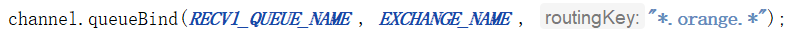

Q2匹配关于兔子以及懒惰动物的消息。

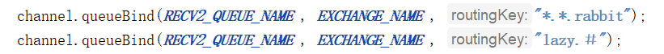

练习，生产者发送如下消息，会进入那个队列：

quick.orange.rabbit     Q1 Q2

lazy.orange.elephant	Q1  Q2 

quick.orange.fox	Q1   

lazy.pink.rabbit    Q2	 

quick.brown.fox 	

quick.orange.male.rabbit 

orange 

lazy       Q2

### 2.6.1.   生产者

使用topic类型的Exchange，发送消息的routing key有3种： `item.isnert`、`item.update`、`item.delete`：

```java
public class Send {
    private final static String EXCHANGE_NAME = "topic_exchange_test";

    public static void main(String[] argv) throws Exception {
        // 获取到连接
        Connection connection = ConnectionUtil.getConnection();
        // 获取通道
        Channel channel = connection.createChannel();
        // 声明exchange，指定类型为topic
        channel.exchangeDeclare(EXCHANGE_NAME, "topic");
        // 消息内容
        String message = "新增商品 : id = 1001";
        // 发送消息，并且指定routing key 为：insert ,代表新增商品
        channel.basicPublish(EXCHANGE_NAME, "item.insert", null, message.getBytes());
        System.out.println(" [商品服务：] Sent '" + message + "'");

        channel.close();
        connection.close();
    }
}
```


### 2.6.2.   消费者1

我们此处假设消费者1只接收两种类型的消息：更新商品和删除商品

```java
public class Recv {
    private final static String QUEUE_NAME = "topic_exchange_queue_1";
    private final static String EXCHANGE_NAME = "topic_exchange_test";

    public static void main(String[] argv) throws Exception {
        // 获取到连接
        Connection connection = ConnectionUtil.getConnection();
        // 获取通道
        Channel channel = connection.createChannel();
        // 声明队列
        channel.queueDeclare(QUEUE_NAME, false, false, false, null);
        
        // 绑定队列到交换机，同时指定需要订阅的routing key。需要 update、delete
        channel.queueBind(QUEUE_NAME, EXCHANGE_NAME, "item.update");
        channel.queueBind(QUEUE_NAME, EXCHANGE_NAME, "item.delete");

        // 定义队列的消费者
        DefaultConsumer consumer = new DefaultConsumer(channel) {
            // 获取消息，并且处理，这个方法类似事件监听，如果有消息的时候，会被自动调用
            @Override
            public void handleDelivery(String consumerTag, Envelope envelope, BasicProperties properties,
                    byte[] body) throws IOException {
                // body 即消息体
                String msg = new String(body);
                System.out.println(" [消费者1] received : " + msg + "!");
            }
        };
        // 监听队列，自动ACK
        channel.basicConsume(QUEUE_NAME, true, consumer);
    }
}

```


### 2.6.3.   消费者2

我们此处假设消费者2接收所有类型的消息：新增商品，更新商品和删除商品。

```java
/**
 * 消费者2
 */
public class Recv2 {
    private final static String QUEUE_NAME = "topic_exchange_queue_2";
    private final static String EXCHANGE_NAME = "topic_exchange_test";

    public static void main(String[] argv) throws Exception {
        // 获取到连接
        Connection connection = ConnectionUtil.getConnection();
        // 获取通道
        Channel channel = connection.createChannel();
        // 声明队列
        channel.queueDeclare(QUEUE_NAME, false, false, false, null);
        
        // 绑定队列到交换机，同时指定需要订阅的routing key。订阅 insert、update、delete
        channel.queueBind(QUEUE_NAME, EXCHANGE_NAME, "item.*");

        // 定义队列的消费者
        DefaultConsumer consumer = new DefaultConsumer(channel) {
            // 获取消息，并且处理，这个方法类似事件监听，如果有消息的时候，会被自动调用
            @Override
            public void handleDelivery(String consumerTag, Envelope envelope, BasicProperties properties,
                    byte[] body) throws IOException {
                // body 即消息体
                String msg = new String(body);
                System.out.println(" [消费者2] received : " + msg + "!");
            }
        };
        // 监听队列，自动ACK
        channel.basicConsume(QUEUE_NAME, true, consumer);
    }
}

```


## 2.7.   持久化

如何避免消息丢失？

1）  消费者的ACK机制。可以防止消费者丢失消息。

2）  但是，如果在消费者消费之前，MQ就宕机了，消息就没了。


是可以将消息进行持久化呢？

要将消息持久化，前提是：队列、Exchange都持久化


### 2.7.1.   交换机持久化


### 2.7.2.   队列持久化


### 2.7.3.   消息持久化

```
MessageProperties：使用rabbitmq包下的类
```


# 3. Spring AMQP

## 3.1.   简介

Spring有很多不同的项目，其中就有对AMQP的支持：


Spring AMQP的页面：http://spring.io/projects/spring-amqp


注意这里一段描述：

                                             

```
Spring-amqp是对AMQP协议的抽象实现(AmqpTemplate)，而spring-rabbit 是对协议的具体实现(RabbitTemplate)，也是目前的唯一实现。底层使用的就是RabbitMQ。
```

现在通过测试案例测试使用：mq的使用需要生产者服发送消息到mq，消费者消费mq队列中的消息。

**案例：**访问生产者demo的支付接口，生产者 发送订单支付的消息，消费者服务根据消息完成保存支付日志更新库存等操作。


## 3.2.   生产者Demo工程

### 3.2.1 创建

创建springboot项目(demo-producter)引入rabbitmq依赖：

修改springboot父工程版本

```xml
<parent>
    <groupId>org.springframework.boot</groupId>
    <artifactId>spring-boot-starter-parent</artifactId>
    <version>2.3.6.RELEASE</version>
    <relativePath/> <!-- lookup parent from repository -->
</parent>
```

创建后的依赖：web和AMQP场景启动器

```xml
<dependency>
    <groupId>org.springframework.boot</groupId>
    <artifactId>spring-boot-starter-web</artifactId>
</dependency>
<dependency>
    <groupId>org.springframework.boot</groupId>
    <artifactId>spring-boot-starter-amqp</artifactId>
</dependency>
```

在`application.yml`中添加RabbitMQ配置：

```yaml
server:
  port: 8081
spring:
  rabbitmq:
    host: 192.168.1.170
    port: 5672
    virtual-host: /cc
    username: cuicui
    password: 123456
```


### 3.2.2 订单支付接口

```java
@RestController
@RequestMapping("order")
public class OrderController {
    @GetMapping("pay/{orderId}")
    public String pay(@PathVariable("orderId")String orderId){
        System.out.println("订单："+orderId+ " 支付完成，更新订单状态为已支付.");
        //发送消息到mq
        return "success";
    }

}
```

### 3.2.3 springboot发送mq消息

#### 1、AmqpTemplate

Spring最擅长的事情就是封装，把他人的框架进行封装和整合。

Spring为AMQP提供了统一的消息处理模板：AmqpTemplate，非常方便的发送消息，其发送方法：


红框圈起来的是比较常用的3个方法，分别是：

- 指定交换机、RoutingKey和消息体
- 指定消息
- 指定RoutingKey和消息，会向默认的交换机发送消息

springAmqp提供了AmqpTemplate，同时springrabbit提供了RabbitTemplate，功能在AmqpTemplate基础上进行了扩展。

```java
@SpringBootTest
class DemoProducterApplicationTests {
    @Autowired
    RabbitTemplate rabbitTemplate;
    @Autowired
    AmqpTemplate amqpTemplate;
    @Test
    void contextLoads() {
        amqpTemplate.convertAndSend("demo.exchange","a.b" , "hehe");
    }
}
```

执行测试方法测试，发现报出如下错误：因为交换机没有初始化

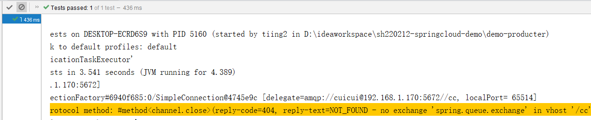

#### 2、交换机队列创建绑定方式1-配置类

```java
@Configuration
public class MqConfig {

    //创建topic类型的交换机
    @Bean
    public TopicExchange demoExchange(){
        return ExchangeBuilder.topicExchange("demo.exchange")
            .durable(true) //配置持久化
            .ignoreDeclarationExceptions() //忽略声明时的异常
            .build();
    }
    //创建队列
    @Bean
    public Queue demoQueue(){
        return QueueBuilder.durable("demo.queue")//创建持久化的队列
            .build();
    }
    //队列绑定到交换机
    @Bean
    public Binding demoQueueBinding(TopicExchange demoExchange,Queue demoQueue){
        return BindingBuilder.bind(demoQueue)//队列
            .to(demoExchange)//交换机
            .with("a.#");//绑定的路由key
    }

}
```

#### 3、测试消息发送

再次执行测试类，可以看到mq控制台中多了 demo.exchange和demo.queue，队列中也有消息。

```java
@Test
void contextLoads() throws IOException {
    //1、交换机不存在：
    //        amqpTemplate.convertAndSend("demo-exchange2","a.b","demo测试....");
    //2、交换机存在，路由key没有绑定的队列
    //        amqpTemplate.convertAndSend("demo-exchange","d.a.b.c","demo测试....");
    //3、交换机队列都存在 绑定了路由key
    amqpTemplate.convertAndSend("demo-exchange","a.b","demo测试....");
    System.in.read();//阻塞不让线程停止，来保证mq的回调能执行
}
```


### 3.2.4 生产者确认

为了确保生产者成功发送消息，RabbitTemplate提供了生产者确认回调，消息发送失败可以调用设置的回调方法进行处理，步骤如下：

#### 1、 添加配置：

```yaml
spring:
  rabbitmq:
    host: 192.168.1.170
    username: cuicui
    password: 123456
    virtual-host: /cc
    port: 5672
    publisher-confirm-type: simple # SIMPLE-同步确认（阻塞） CORRELATED-异步确认
    publisher-returns: true # 确认消息是否到达队列
server:
  port: 8081
```

#### 2、 创建ProducerAckConfig

内容如下：

```java
@Configuration
@Slf4j
public class RabbitConfig {

    @Autowired
    private RabbitTemplate rabbitTemplate;

    @PostConstruct
    public void init(){
        // 确认消息是否到达交换机
        this.rabbitTemplate.setConfirmCallback((correlationData, ack, cause) -> {
            if (!ack){
                log.warn("消息没有到达交换机：" + cause);
            }
        });

        // 确认消息是否到达队列，到达队列该方法不执行
        this.rabbitTemplate.setReturnCallback((message, replyCode, replyText, exchange, routingKey) -> {
            log.warn("消息没有到达队列，来自于交换机：{}，路由键：{}，消息内容：{}", exchange, routingKey, new String(message.getBody()));
        });
    }
}
```

#### 3、 测试

**测试**1：消息正常发送，正常消费


**测试**2：消息到达交换机，没有达到队列(交换机存在，但是路由key和绑定的队列不一致)

```java
 amqpTemplate.convertAndSend("demo.exchange","c.a.b" , "hehe");
```


**测试**3：消息不能到达交换机（交换机不存在）

```java
 amqpTemplate.convertAndSend("demo.exchange2","a.b" , "hehe");
```


### 3.2.5 生产者发送订单支付成功消息

现在完成订单支付成功时发送mq消息的业务

#### 1、在MqConfig中创建订单业务交换机

```java
@Bean
public TopicExchange orderExchange() {
    return ExchangeBuilder.topicExchange("order.exchange")
        .durable(true) //配置持久化
        .ignoreDeclarationExceptions() //忽略声明时的异常
        .build();
}
```

#### 2、发送消息

```java
@Autowired
RabbitTemplate rabbitTemplate;
@GetMapping("pay/{orderId}")
public String pay(@PathVariable("orderId")String orderId){
    System.out.println("订单："+orderId+ " 支付完成，更新订单状态为已支付.");
    //发送消息到mq
    rabbitTemplate.convertAndSend("order.exchange","order.pay",orderId);
    return "success";
}
```

#### 3、启动生产者服务

启动后访问：http://localhost:8081/order/pay/1

可以向交换机中发送消息


## 3.3 消费者Demo工程


### 3.3.1 创建

创建springboot项目(demo-consumer)

依赖和 生产者服务一样

application.yml配置：

```yaml
server:
  port: 8082
spring:
  rabbitmq:
    host: 192.168.1.170
    port: 5672
    virtual-host: /cc
    username: cuicui
    password: 123456
    listener:
      type: simple # simple-listener容器使用一个额外线程处理消息  direct-listener（监听器）容器直接使用consumer线程
      simple:
        prefetch: 1 # 能者多劳
        concurrency: 3 # 避免消息堆积，初始化多个消费者线程
```


### 3.3.2 springboot消费mq消息

#### 1、@RabbitListener注解

@RabbitListener可以绑定已存在的队列 标注在方法上消费队列中的消息

```java
@Configuration
public class ConsumerMqConfig {
    //队列必须是mq中已存在的队列
    @RabbitListener(queues = "demo.queue")
    public void consumer1(String msg){//String类型的形参表示获取到的队列中的消息
        System.out.println("获取到消息："+ msg);
    }
}
```

测试：启动消费者服务，生产者发送消息测试

#### 2、交换机队列创建绑定方式2-注解

`@RabbitListener`：方法上的注解，声明这个方法是一个消费者方法，需要指定下面的属性：

- `bindings`：指定绑定关系，可以有多个。值是`@QueueBinding`的数组。`@QueueBinding`包含下面属性：
  - `value`：这个消费者关联的队列。值是`@Queue`，代表一个队列
  - `exchange`：队列所绑定的交换机，值是`@Exchange`类型
  - `key`：队列和交换机绑定的`RoutingKey`

```java
@RabbitListener(bindings = @QueueBinding(
    value = @Queue(value = "demo.queue2" , durable = "true"),//创建新队列
    exchange = @Exchange(value = "demo.exchange2",durable = "true",//创建新交换机
                         ignoreDeclarationExceptions = "true",type = ExchangeTypes.TOPIC),
    key = "a.*"// 绑定队列交换机的routingkey
))
public void consumer2(String msg){
    System.out.println("consumer2获取到消息： "+ msg);
}
```

测试：重启消费者服务，发现交换机队列成功创建 并且绑定成功

在生产者测试代码中向交换机中发送消息测试。


### 3.3.3 消费者确认

#### 1、简介

消费者接受到消息使用时的确认机制：ack，默认消费者接受到消息后自动确认

springboot-rabbit提供了三种消息确认模式：

- **AcknowledgeMode.NONE**：不确认模式（不管程序是否异常只要执行了监听方法，消息即被消费。相当于rabbitmq中的自动确认，这种方式不推荐使用）
- **AcknowledgeMode.AUTO**：自动确认模式（默认，消费者没有异常会自动确认，有异常则不确认，无限重试，导致**程序死循环**。不要和rabbit中的自动确认混淆）
- **AcknowledgeMode.MANUAL**：手动确认模式（需要手动调用channel.basicAck确认，可以捕获异常控制重试次数，甚至可以控制失败消息的处理方式）

全局配置方法：

```yaml
# rabbitmq:
    listener:
      simple:
       # !!!!!!!!!!!!!!!!!!!!!!!!!!!!!!!!!!!!!!!!!!!!!!!!!!!!!!!!!!!!!!!!!!!!!!!!!!!!
        acknowledge-mode: manual # manual-手动  auto-自动（无异常直接确认，有异常无限重试） none-不重试
```

或者

以下只针对设置的消费者

```JAVA
@RabbitListener(queues = "demo.queue",
                ackMode = "MANUAL" )// NONE,AUTO
```


#### 2、 确认模式测试

##### 2.1、AUTO-自动确认模式

在**消费者**中制造一个异常：然后重启消费者服务

```java
@RabbitListener(queues = "demo.queue")
public void consumer1(String msg){//String类型的形参表示获取到的队列中的消息
    System.out.println("获取到消息："+ msg);
    int i =  1/0;
}
```

运行**生产者**测试代码发送消息到demo.exchange交换机测试：

```java
@Test
void contextLoads() {
    amqpTemplate.convertAndSend("demo.exchange","a.b" , "hehe");
}
```

测试结果：


可以看到mq将无限重试，消费消息：(默认AUTO确认模式，消息消费有异常，设置消息重新归队到mq消息队列中，然后消费者监听器又可以重新消费消息)

消息将无法消费：

停掉应用消息回到Ready状态，消息不会丢失！

##### 2.2、NONE-不确认模式

修改**消费者**确认模式为NONE：重启消费者服务

再次执行**生产者**测试代码：


所有的消息都被消费：

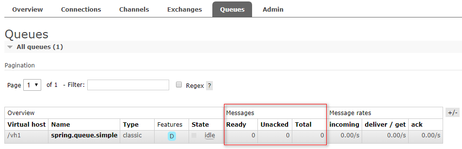

##### 2.3、MANUAL-不确认模式

修改**消费者**确认模式为：MANUAL

再次执行**生产者**测试代码：

测试结果：消息接收到了但是队列中消息等待确认，如果停掉程序会重新进入ready状态


程序停止运行：

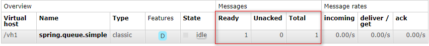

**修改消费者代码**：确认消息

#### 3、手动ack


```java
    @RabbitListener(queues = "demo.queue")
public  void consumer1(String msg, Channel channel , Message message) throws Exception {
    try {
        System.out.println("接收到消息：" + msg);
        int i = 1 / 0;
        // 确认收到消息，false只确认当前consumer一个消息收到，true确认所有consumer获得的消息
        channel.basicAck(message.getMessageProperties().getDeliveryTag(), false);
    } catch (Exception e) {
        if (message.getMessageProperties().getRedelivered()) {
            System.out.println("消息重试后依然失败，拒绝再次接收");
            // 拒绝消息，不再重新入队（如果绑定了死信队列消息会进入死信队列，没有绑定死信队列则消息被丢弃，也可以把失败消息记录到redis或者mysql中），也可以设置为true再重试。
            channel.basicReject(message.getMessageProperties().getDeliveryTag(), false);
        } else {
            System.out.println("消息消费时出现异常，即将再次返回队列处理");
            // Nack消息，重新入队（重试一次）
            channel.basicNack(message.getMessageProperties().getDeliveryTag(), false, true);
        }
        e.printStackTrace();
    }
}
```

执行测试代码：

​	测试结果确认消息没有异常时消息被消费掉

​	第一次手动确认消息有异常时进入basicNack，消息重新归队再次重试

​	重试手动确认消息再次失败进入basicReject，执行拒绝消息


### 3.3.4 消费者消费订单支付成功的消息

消费者服务中创建消费者监听方法，监听订单支付成功的消息：

```java
@RabbitListener(bindings = @QueueBinding(
    value = @Queue(value = "order.pay.queue" , durable = "true"),
    exchange = @Exchange(value = "order.exchange",durable = "true",
                         ignoreDeclarationExceptions = "true",type = ExchangeTypes.TOPIC),
    key = "order.pay"
))
public void orderPayConsumer(String msg, Channel channel , Message message) throws IOException {
    try {
        System.out.println("订单 "+ msg+ " 支持成功的日志.....");
        channel.basicAck(message.getMessageProperties().getDeliveryTag(),false);
    } catch (Exception e) {
        e.printStackTrace();
        if(message.getMessageProperties().isRedelivered()){
            channel.basicReject(message.getMessageProperties().getDeliveryTag(),false);
        }else{
            channel.basicNack(message.getMessageProperties().getDeliveryTag(),false,true);
        }
    }
}

```

访问测试：http://localhost:8081/order/pay/1

## 3.4 死信队列

死信，在官网中对应的单词为“Dead Letter”，DLX，Deal-Letter-Exchange，死信交换器。当一个消息在队列中变成死信（DeadMessage）之后，他能被重新发送到DLX中，与DLX绑定的队列就是死信队列。可以看出翻译确实非常的简单粗暴。那么死信是个什么东西呢？

“死信”是RabbitMQ中的一种消息机制，当你在消费消息时，如果队列里的消息出现以下情况：

1. 消息被否定确认，使用 `channel.basicNack` 或 `channel.basicReject` ，并且此时`requeue` 属性被设置为`false`。
2. 消息在队列的存活时间超过设置的TTL时间。
3. 消息队列的消息数量已经超过最大队列长度。

那么该消息将成为“死信”。

“死信”消息会被RabbitMQ进行特殊处理，如果配置了死信队列信息，那么该消息将会被丢进死信队列中，如果没有配置，则该消息将会被丢弃。


死信的队列的使用，大概可以分为以下步骤：

1. 配置业务队列，绑定到业务交换机上
2. 为业务队列配置死信交换机（DLX）和路由key
3. 为死信交换机配置死信队列（DLQ）

在配置类中增加配置：

```java
/**
     * 声明业务交换机
     *
     * @return
     */
@Bean
public TopicExchange topicExchange() {
    return new TopicExchange("spring.test.exchange", true, false);
}

/**
     * 声明处理业务的队列
     * 并把死信交换机绑定到业务队列
     * @return
     */
@Bean
public Queue queue() {
    return QueueBuilder.durable("spring.test.queue")//创建持久化的队列
        .deadLetterExchange("dead-exchange")//业务队列绑定死信交换机
        .deadLetterRoutingKey("msg.dead")//指定路由key
        .build();
}

/**
     * 业务队列绑定到业务交换机
     * @return
     */
@Bean
public Binding binding() {
    return new Binding("spring.test.queue", Binding.DestinationType.QUEUE, "spring.test.exchange", "a.b", null);
}

/**
     * 声明死信交换机
     * @return
     */
@Bean
public TopicExchange deadExchange(){
    return ExchangeBuilder.topicExchange("dead-exchange")
        .durable(true) //配置持久化
        .ignoreDeclarationExceptions() //忽略声明时的异常
        .build();
}

/**
     * 声明死信队列
     * @return
     */
@Bean
public Queue deadQueue(){
    return QueueBuilder.durable("dead-queue")
        .build();
}

/**
     * 把死信队列绑定到死信交换机
     * @return
     */
@Bean
public Binding deadBinding(Queue deadQueue, TopicExchange deadExchange) {
    return BindingBuilder.bind(deadQueue)//队列
        .to(deadExchange)//交换机
        .with("msg.dead");//绑定的路由key
}
```

消费者监听器：

```java
@RabbitListener(
    queues = {"spring.test.queue"}
)
public void listen(String msg, Channel channel , Message message) throws IOException {
    try {
        System.out.println("接收到消息：" + msg);
        int i = 1 / 0;
        // 确认收到消息，false只确认当前consumer一个消息收到，true确认所有consumer获得的消息
        channel.basicAck(message.getMessageProperties().getDeliveryTag(), false);
    } catch (Exception e) {
        if (message.getMessageProperties().getRedelivered()) {
            System.out.println("消息重试后依然失败，拒绝再次接收2");
            // 拒绝消息，不再重新入队（如果绑定了死信队列消息会进入死信队列，没有绑定死信队列则消息被丢弃，也可以把失败消息记录到redis或者mysql中），也可以设置为true再重试。
            channel.basicReject(message.getMessageProperties().getDeliveryTag(), false);
        } else {
            System.out.println("消息消费时出现异常，即将再次返回队列处理2");
            // Nack消息，重新入队（重试一次）
            channel.basicNack(message.getMessageProperties().getDeliveryTag(), false, true);
        }
        e.printStackTrace();
    }
}
```

**注意：测试前，需要把项目停掉，并在rabbitmq浏览器控制台删除之前声明好的交换机及队列**

```java
@Autowired
AmqpTemplate amqpTemplate;
@Test
void contextLoads() {
    amqpTemplate.convertAndSend("spring.test.exchange" , "a.b" , "hehe.....");
    while(true){}
}
```

运行测试后：


可以看到spring.test.queue由于绑定死信交换机，死信消息已经进入死信队列。

## 3.5 延迟队列

### **3.5.1 **简介

**消息生存时间 TTL**

TTL（Time-To-Live）是 RabbitMQ 的一种高级特性，表示了一条消息的最大生存时间，单位为毫秒。如果一条消息在 TTL 设置的时间内没有被消费，那么它就会变成一条死信，进入我们上面所说的死信队列。

有两种不同的方式可以设置消息的 TTL 属性，一种方式是直接在创建队列的时候设置整个队列的 TTL 过期时间，所有进入队列的消息，都被设置成了统一的过期时间，一旦消息过期，马上就会被丢弃，进入死信队列。

如果我们把需要延迟的消息，将 TTL 设置为其延迟时间，投递到 RabbitMQ 的普通队列中，一直不去消费它，那么经过 TTL 的时间后，消息就会自动被投递到死信队列，这时候我们使用消费者进程实时地去消费死信队列中的消息，不就实现了延迟队列的效果。

**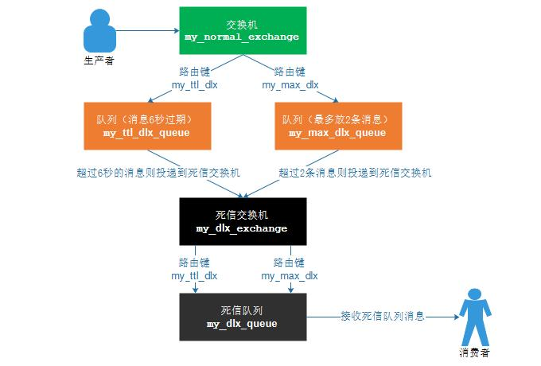**

延迟队列实现步骤：

​	1、生产者将消息发送到交换机

​	2、交换机将消息路由到一个队列中[队列中消息有过期时间:例如10秒]

​	3、设置过期时间的消息队列绑定死信交换机	

​	4、死信交换机会将消息路由到死信队列

​	5、消费者在延迟时间后可以从死信队列中获取消息

给死信队列绑定延迟队列，当消息超过1分钟没有被消费，则进入延迟队列：

​	<b style='color:red'>注意:需要删除之前的交换机和队列</b>

### 3.5.2 实现

#### 1、配置延迟交换机延迟队列并绑定

新增的配置

```java
//延迟交换机
@Bean
public TopicExchange delayExchange() {
    return ExchangeBuilder.topicExchange("delay-exchange")
        .durable(true) //配置持久化
        .ignoreDeclarationExceptions() //忽略声明时的异常
        .build();
}
//延迟队列
@Bean
public Queue delayQueue() {
    return QueueBuilder.durable("delay-queue")
        .build();
}
//延迟队列绑定延迟交换机
@Bean
public Binding delayBinding(Queue delayQueue, TopicExchange delayExchange) {
    return BindingBuilder.bind(delayQueue)//队列
        .to(delayExchange)//交换机
        .with("msg.delay");//绑定的路由key
}
```

#### 2、死信队列设置消息过期时间绑定延迟队列

修改死信队列配置

```java
@Bean
public Queue deadQueue() {
    return QueueBuilder.durable("dead-queue")
        .deadLetterExchange("delay-exchange")
        .deadLetterRoutingKey("msg.delay")
        .ttl(60000)
        .build();
}
```

#### 3、测试

生产者发送消息

如果消费者消费失败丢弃消息，消息会被丢弃到死信队列中

死信队列中的消息再配置的ttl时间达到后会进入延迟队列


我们也可以再通过消费者监听消费延迟队列中的消息


**总结：无论 业务队列交换机、死信队列交换机还是延迟队列交换机 ， 他们都是一样的，用来接收其他队列丢弃的消息的队列是死信队列，配置了消息的ttl过期时间的是延迟队列。**


# 4、面试题

为什么使用rabbitmq

rabbitmq的工作模式

可靠性

重复消费

如何保证RabbitMQ消息的顺序性

消息积压

