# 尚硅谷JavaEE之SpringCloud


# 1、微服务理论

## 1.1 SpringCloud简介

《分布式系统原理与范型》定义："分布式系统是若干独立计算机的集合，这些计算机对于用户来说就像单个相关系统"。通俗点来说就是 将一个单体项目分成很多个模块，各个模块协同工作，各个模块构成了分布式系统。

分布式系统（distributed system）是建立在网络之上的软件系统。

Spring Cloud 规范及实现意图要解决的问题其实就是**微服务架构实施过程中存在的**⼀些问题，⽐如微服务架构中的**服务注册发现**问题、⽹络问题（⽐如熔断场景）、 统⼀认证安全授权问题、负载均衡问题、链路追踪等问题。

它是⼀系列框架的有序集合。它利⽤**Spring Boot**的开发便利性巧妙地简化了分布式系统基础设施的开发，如服务发现注册、配置中⼼、消息总线、负载均衡、断路器、数据监控等，都可以⽤Spring Boot的开发⻛格做到⼀键启动和部署。

微服务框架之SpringBoot：

<https://docs.spring.io/spring-boot/docs/2.3.6.RELEASE/reference/htmlsingle/>

分布式系统微服务架构之SpringCloud：

<https://docs.spring.io/spring-cloud/docs/Hoxton.SR9/reference/html/>

中文社区：

<https://www.bookstack.cn/read/spring-cloud-docs/docs-index.md>

## 1.2 分布式与集群的关系

集群指的是将几台服务器集中在一起，实现同一业务。

分布式中的每一个节点，都可以做集群。 而集群并不一定就是分布式的。

## 1.3 软件架构演变


> 单一应用架构

当网站流量很小时，只需一个应用，将所有功能都部署在一起，以减少部署节点和成本。此时，用于简化增删改查工作量的数据访问框架(ORM)是关键。   

                                                                                                       

> 垂直应用架构

当访问量逐渐增大，单一应用增加机器带来的加速度越来越小，将应用拆成互不相干的几个应用，以提升效率。此时，用于加速前端页面开发的Web框架(MVC)是关键。

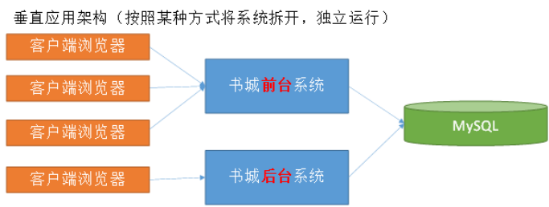

> 分布式服务架构

当垂直应用越来越多，应用之间交互不可避免，将核心业务抽取出来，作为独立的服务，逐渐形成稳定的服务中心，使前端应用能更快速的响应多变的市场需求。此时，用于提高业务复用及整合的分布式服务框架(RPC)是关键。

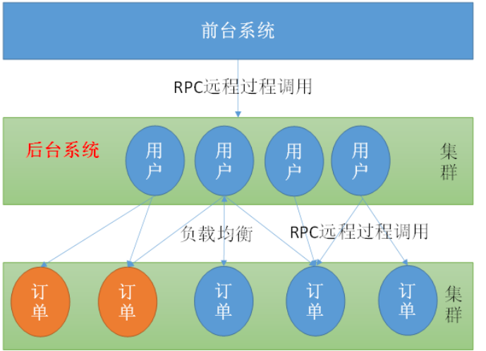

> 流动计算架构

当服务越来越多，容量的评估，小服务资源的浪费等问题逐渐显现，此时需增加**一个调度中心**基于访问压力实时管理集群容量，提高集群利用率。此时，用于提高机器利用率的资源调度和治理中心(SOA)是关键。

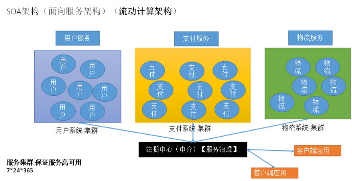


## 1.4 服务之间的交互方式

 1、RPC(Remote Procedure Call)

​		指远程过程调用，是一种进程间通信方式

​	   Netty（Socket）+自定义序列化

2、RestAPI  

​		严格来说，SpringCloud是使用Rest方式进行服务之间交互的，不属于RPC

​		HTTP+JSON


## 1.5 分布式思想与基本概念

### 1.5.1 高并发

1)  **通过设计保证系统可以并行处理很多请求。应对大量流量与请求**

-   Tomcat最多支持并发多少用户？

    Tomcat 默认配置的最大请求数是 150，也就是说同时支持 150 个并发，当然了，也可以将其改大。当某个应用拥有 250 个以上并发的时候，应考虑应用服务器的集群。

    具体能承载多少并发，需要看硬件的配置，CPU 越多性能越高，分配给 JVM 的内存越多性能也就越高，但也会加重 GC 的负担。

-   操作系统对于进程中的线程数有一定的限制：

    Windows 每个进程中的线程数不允许超过 2000

    Linux 每个进程中的线程数不允许超过 1000

    Java 中每开启一个线程需要耗用 1MB 的 JVM 内存空间用于作为线程栈之用。

    Tomcat 默认的 HTTP 实现是采用阻塞式的 Socket 通信，每个请求都需要创建一个线程处理。这种模式下的并发量受到线程数的限制，但对于 Tomcat 来说几乎没有 BUG 存在了。

    Tomcat 还可以配置 NIO 方式的 Socket 通信，在性能上高于阻塞式的，每个请求也不需要创建一个线程进行处理，并发能力比前者高。但没有阻塞式的成熟。

    这个并发能力还与应用的逻辑密切相关，如果逻辑很复杂需要大量的计算，那并发能力势必会下降。如果每个请求都含有很多的数据库操作，那么对于数据库的性能也是非常高的。

    对于单台数据库服务器来说，允许客户端的连接数量是有限制的。

    并发能力问题涉及整个系统架构和业务逻辑。

    系统环境不同，Tomcat版本不同、JDK版本不同、以及修改的设定参数不同。并发量的差异还是满大的。

2)  **高并发衡量指标**

-   响应时间(RT)

    -   请求做出响应的时间，即一个http请求返回所用的时间

-   吞吐量

    -   系统在单位时间内处理请求的数量

-   QPS(Query/Request Per Second)、 TPS（Transaction Per Second）

-   每秒查询（请求）数、每秒事务数

    -   专业的测试工具：Load Runner

    -   Apache ab

    -   Apache JMeter

-   并发用户数

    -   承载的正常使用系统功能的用户的数量

### 1.5.2 高可用

服务集群部署

数据库主从+双机热备

-   主-备方式（Active-Standby方式）

主-备方式即指的是一台服务器处于某种业务的激活状态（即Active状态），另一台服务器处于该业务的备用状态（即Standby状态)。

-   双主机方式（Active-Active方式）

双主机方式即指两种不同业务分别在两台服务器上互为主备状态（即Active-Standby和Standby-Active状态）

### 1.5.3 注册中心

保存某个服务所在地址等信息，方便调用者实时获取其他服务信息

-   服务注册

    -   服务提供者

-   服务发现

    -   服务消费者

### 1.5.4 负载均衡

​	动态将请求派发给比较闲的服务器

**策略：**

-   轮询(Round Robin)

-   加权轮询(Weighted Round Robin)

-   随机Random

-   哈希Hash

-   最小连接数LC

-   最短响应时间LRT

### 1.5.5 服务雪崩

服务之间复杂调用，一个服务不可用，导致整个系统受影响不可用

### 1.5.6 熔断

某个服务频繁超时，直接将其短路，快速返回mock（模拟/虚拟）值

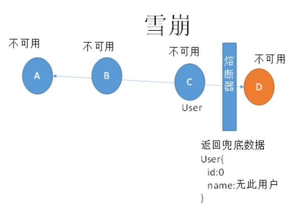

### 1.5.7 限流

限制某个服务每秒的调用本服务的频率

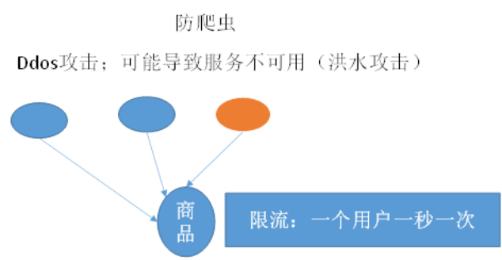

### 1.5.8 API网关

API网关要做很多工作，它作为一个系统的后端总入口，承载着所有服务的组合路由转换等工作，除此之外，我们一般也会把安全，限流，缓存，日志，监控，重试，熔断等放到 API 网关来做

### 1.5.9 服务跟踪

追踪服务的调用链，记录整个系统执行请求过程。如：请求响应时间，判断链中的哪些服务属于慢服务（可能存在问题，需要改善）。

## 1.6 微服务架构图


## 1.7 关于SpringBoot和SpringCloud版本

官方版本对照： <https://start.spring.io/actuator/info>

授课版本：

​	springBoot2.3.6

​	SpringCloud Hoxton.SR9

​	SpringCloud Alibaba 2.2.6


# 2、准备工作(测试项目搭建)


## 2.1 项目需求

商城项目订单创建时会涉及到保存订单、修改库存、修改账户信息等业务。可以拆分成分布式架构的多个服务处理高并发的请求。数据库垂直拆分成不同的库、业务拆分成多个服务，请求和数据库访问被负载到多个节点上可以应对高并发的请求

用户提交下单请求，订单服务保存订单，远程访问库存服务修改库存

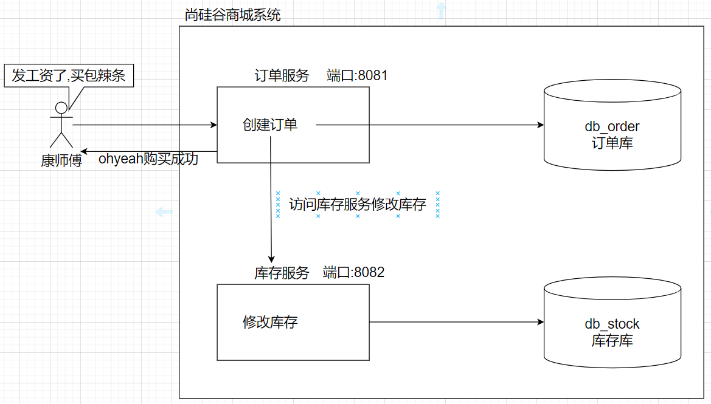

## 2.2 数据库创建

订单库+表 sql :

```sql
CREATE DATABASE guli_order;
USE guli_order;
CREATE TABLE `t_order`
(
    `id`             INT(11) NOT NULL AUTO_INCREMENT COMMENT '订单id',
    `product_id`     VARCHAR(255) DEFAULT NULL COMMENT '商品id',
    `user_id`        VARCHAR(255) DEFAULT NULL COMMENT '用户id',
    `order_sn`       VARCHAR(255) DEFAULT NULL COMMENT '订单编号',
    `count`          INT(11) DEFAULT '0' COMMENT '数量',
    `money`          INT(11) DEFAULT '0' COMMENT '商品金额',
    `create_time`    DATETIME COMMENT '创建时间',
    PRIMARY KEY (`id`)
) ENGINE = INNODB DEFAULT CHARSET = utf8;
```

库存库+表 sql:

```sql
CREATE DATABASE guli_stock;
USE guli_stock;
CREATE TABLE `t_stock`
(
    `id`             INT(11) NOT NULL AUTO_INCREMENT,
    `product_id`     VARCHAR(255) DEFAULT NULL,
    `title`          VARCHAR(255) DEFAULT NULL,
    `count`          INT(11) DEFAULT '0',
    PRIMARY KEY (`id`),
    UNIQUE KEY `uk_product_id` (`product_id`)
) ENGINE = INNODB DEFAULT CHARSET = utf8;
-- 初始化测试数据
INSERT INTO t_stock(product_id,title , COUNT) VALUES( '1001' , '卫龙辣条' , 1000);
```


## 2.3 工程搭建

idea中新建project

项目类型：EmptyProject


项目名称：springcloud_demo

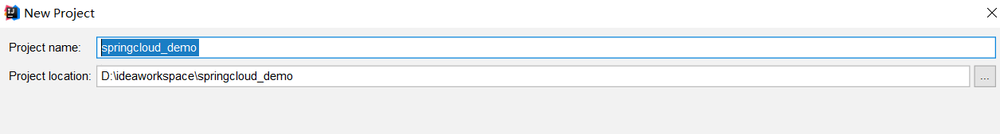

## 2.4 库存服务创建

**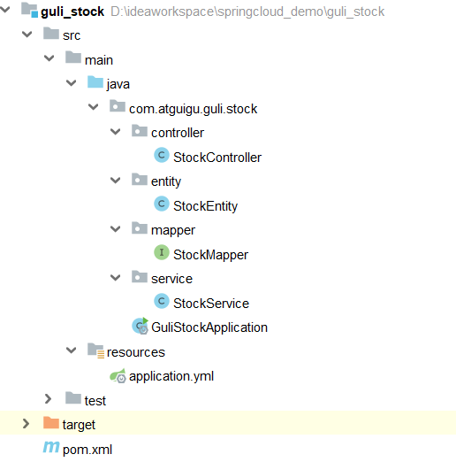**

### 2.4.1 创建springboot项目：guli_stock

**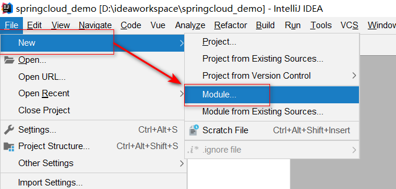**


**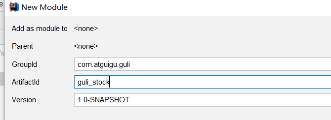**

### 2.4.2 pom文件依赖

父工程版本：2.3.6.RELEASE

```xml
<parent>
    <groupId>org.springframework.boot</groupId>
    <artifactId>spring-boot-starter-parent</artifactId>
    <version>2.3.6.RELEASE</version>
    <relativePath/> <!-- lookup parent from repository -->
</parent>
```

依赖：

```xml
<dependencies>
    <dependency>
        <groupId>org.springframework.boot</groupId>
        <artifactId>spring-boot-starter-web</artifactId>
    </dependency>
    <dependency>
        <groupId>mysql</groupId>
        <artifactId>mysql-connector-java</artifactId>
        <version>5.1.47</version>
    </dependency>
    <dependency>
        <groupId>org.springframework.boot</groupId>
        <artifactId>spring-boot-starter-data-jpa</artifactId>
    </dependency>
    <dependency>
        <groupId>org.projectlombok</groupId>
        <artifactId>lombok</artifactId>
    </dependency>
</dependencies>
```

### 2.4.3 application配置

创建application.yml添加配置

```yaml
server:
  port: 8082
spring:
  datasource:
    url: jdbc:mysql://localhost:3306/guli_stock?useUnicode=true&characterEncoding=utf-8&useSSL=false
    username: root
    password: 123456
    driver-class-name: com.mysql.jdbc.Driver
  jpa:
    show-sql: true # 输出sql
```

### 2.4.4 创建StockEntity

```java
import lombok.Data;
import javax.persistence.Column;
import javax.persistence.Entity;
import javax.persistence.Id;
import javax.persistence.Table;

@Data
@Entity
@Table(name="t_stock")
public class StockEntity {
    @Id
    private Integer id;
    @Column(name = "product_id")
    private String productId;
    @Column(name = "title")
    private String title;
    @Column(name = "count")
    private Integer count;
}
```

### 2.4.5 创建StockMapper

```java
import org.springframework.data.jpa.repository.JpaRepository;
import org.springframework.data.jpa.repository.Modifying;
import org.springframework.data.jpa.repository.Query;
import javax.transaction.Transactional;
public interface StockMapper extends JpaRepository<StockEntity , Integer> {
    //Spring Data JPA会根据我们所定义的⽅法名，⾃动⽣成对应的sql语句(方法结构需要满足要求)
    //文档地址: https://docs.spring.io/spring-data/jpa/docs/current/reference/html/
    //@Query：自定义sql实现查询，@Modifying：指定sql为更新,不添加此注解表示查询
    @Transactional //更新需要添加事务注解
    @Modifying
    @Query("update StockEntity s set s.count = s.count - ?2 where s.productId = ?1")
    int updateCountByProductId(String productId, Integer count);
}
```

### 2.4.6 创建StockService

```java
@Service
public class StockService  {
    @Autowired
    StockMapper stockMapper;
    //根据商品id更新库存
    public Boolean updateStockByProductId(String productId,Integer count){
        return stockMapper.updateCountByProductId(productId,count)==1;
    }
}
```

### 2.4.7 创建StockController

采用Rest风格：接口返回Json

创建根据商品id修改库存的接口

```java
@RestController
@RequestMapping("/stock")
public class StockController {
    @Autowired
    StockService stockService;
    @GetMapping("{productId}/{count}")
    public Boolean updateStock(@PathVariable("productId")String productId ,
                               @PathVariable("count") Integer count){
        return stockService.updateStockByProductId(productId,count);
    }
}
```

### 2.4.8 访问测试

启动项目测试： http://localhost:8082/stock/1002/2

**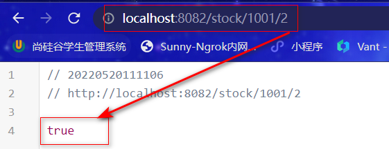**

## 2.5  订单服务创建

**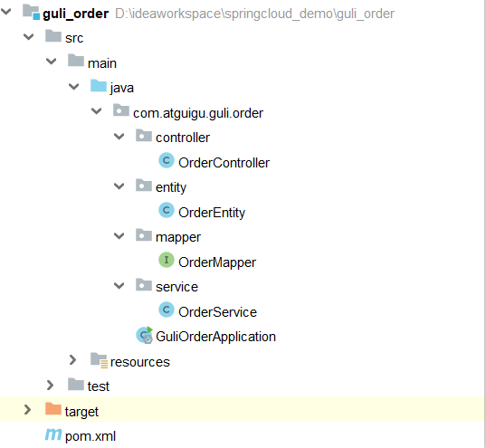**

### 2.5.1 创建springboot项目:guli_order

**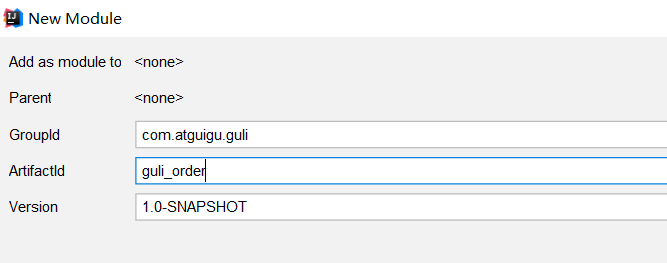**

### 2.5.2 pom文件依赖

参考guli_stock:依赖一样

### 2.5.3 application配置

参考guli_order: 修改端口号为8081、连接数据库的名称为guli_order

### 2.5.4 创建OrderEntity

```java
import lombok.Data;
import javax.persistence.*;
import java.math.BigDecimal;
import java.util.Date;
@Entity
@Table(name = "t_order")
@Data
public class OrderEntity {
    @Id
    //id生成策略 ：数据库主键自增
    @GeneratedValue(strategy=GenerationType.IDENTITY)
    private Integer id;
    @Column(name = "product_id")
    private String productId;
    private String userId;
    private String orderSn;
    private Integer count;
    private BigDecimal money;
    private Date createTime;
}
```

### 2.5.5 创建OrderMapper

```java
import org.springframework.data.jpa.repository.JpaRepository;
public interface OrderMapper extends JpaRepository<OrderEntity ,Integer> {
}
```

### 2.5.6 创建OrderService

```java
@Service
public class OrderService {
    @Autowired
    OrderMapper orderMapper;
    //创建订单
    public boolean saveOrder(String userId,String productId,Integer count){
        OrderEntity orderEntity = new OrderEntity();
        orderEntity.setCount(count);
        orderEntity.setOrderSn(UUID.randomUUID().toString().replace("-",""));
        orderEntity.setCreateTime(new Date());
        orderEntity.setMoney(new BigDecimal(1000));
        orderEntity.setProductId(productId);
        orderEntity.setUserId(userId);
        orderEntity = orderMapper.save(orderEntity);
        System.out.println(orderEntity);
        //TODO: 更新库存
        return orderEntity!=null;

    }
}
```

### 2.5.7 创建OrderController

```java
@RestController
@RequestMapping("/order")
public class OrderController {
    @Autowired
    OrderService orderService;
    @GetMapping("{userId}/{productId}/{count}")
    public Boolean createOrder(@PathVariable("userId")String userId,
                               @PathVariable("productId")String productId,
                               @PathVariable("count")Integer count){
        return orderService.saveOrder(userId,productId,count);
    }
}
```

### 2.5.8 访问测试

启动服务，访问：http://localhost:8081/order/9527/1001/2

**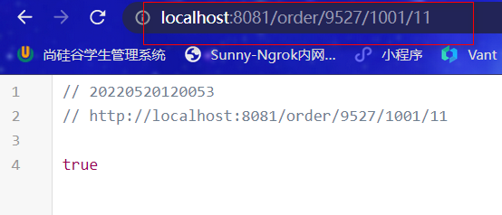**


# 3、HttpClient实现服务间远程调用

## 3.1 HttpClient简介

上面创建订单的业务保存订单成功后需要将库存数据一起更新，方法调用不能跨服务，所以必须借助于前面讲过的方式RPC或者RestApi的方式。

目前主流的方式使用Http+JSON，也就是原有web项目请求和响应协议报文格式不变的情况下，使用JSON格式进行数据交互。

在guli_order中创建订单成功后 发起Http协议的请求访问guli_stock修改库存。

Apache提供了java网络请求客户端HttpClient，官方文档：https://hc.apache.org/httpcomponents-client-5.1.x/

## 3.2 远程调用实现

### 3.2.1 guli_order引入HttpClient依赖

```xml
<dependency>
    <groupId>org.apache.httpcomponents</groupId>
    <artifactId>httpclient</artifactId>
</dependency>
```

### 3.2.2 测试HttpClient

```java
public static void main(String[] args) throws IOException {
    //初始化客户端
    HttpClient httpclient = HttpClients.createDefault();
    //设置get请求地址
    HttpGet httpGet = new HttpGet("http://www.atguigu.com");
    //执行请求得到结果
    HttpResponse response = httpclient.execute(httpGet);
    //获取状态码
    int statusCode = response.getStatusLine().getStatusCode();
    //解析响应体
    String result = EntityUtils.toString(response.getEntity(), "UTF-8");
    System.out.println(statusCode);
    System.out.println(result);
    //post方式请求
    //        HttpPost httpPost = new HttpPost("http://httpbin.org/post");
    //        List<NameValuePair> nvps = new ArrayList<>();
    //        nvps.add(new BasicNameValuePair("username", "vip"));
    //        nvps.add(new BasicNameValuePair("password", "secret"));
    //        httpPost.setEntity(new UrlEncodedFormEntity(nvps));
}
```

### 3.2.3 创建订单业务方法远程访问guli_stock更新库存

```java
//创建订单
public boolean saveOrder(String userId,String productId,Integer count){
    //................省略
    //TODO: 更新库存
    try {
        //初始化客户端
        HttpClient httpclient = HttpClients.createDefault();
        //设置get请求地址
        HttpGet httpGet = new HttpGet("http://localhost:8082/stock/"+productId+"/"+count);
        //执行请求得到结果
        HttpResponse response = httpclient.execute(httpGet);
        boolean b = Boolean.parseBoolean(EntityUtils.toString(response.getEntity()));
        System.out.println("库存更新结果 ："+b);
    } catch (Exception e) {
        e.printStackTrace();
    }
    return orderEntity!=null;

}
```


## 3.3 问题分析

远程访问失败时如何解决？

返回的结果如果比较复杂时(对象、集合类型)如何解决？

高并发时如何应对？

项目部署到测试或者生产服务器时有没有问题？


# 4、Eureka注册中心

## 4.1 Eureka服务注册与发现

### 4.1.1 Eureka简介

SpringCloud封装了Netflix公司开发的Eureka模块来实现服务治理。

在传统的RPC远程调用框架中，管理每个服务与服务之间依赖关系比较复杂、所以需要进行服务治理，管理服务与服务之间依赖关联，以实现服务调用，负载均衡、容错等，实现服务<font color="red">发现与注册</font>。

Eureka采用了CS的设计架构，Eureka Server作为服务注册功能的服务器，它是服务注册中心。系统中的其他微服务，使用Eureka的客户端连接到Eureka Server并维持心跳连接。这样系统的维护人员可以通过Eureka Server来监控系统中各个微服务是否正常运行。

在服务注册与发现中，有一个注册中心。当服务器启动的时候，会把当前自己服务器的信息，比如：服务通讯地址等以别名方式注册到注册中心上。

另一方（消费者服务），以该别名的方式去注册中心上获取到实际的服务通讯地址，然后，再实现本地RPC远程调用。

### 4.1.2 Eureka两个组件

l **Eureka Server提供服务注册服务**

各个微服务节点通过配置启动后，会在Eureka Server中进行注册，这样Eureka Server中的服务注册表中将会存储所有可用服务节点的信息，服务节点的信息可以在界面中直观看到。

l **Eureka Client通过注册中心进行访问**

是一个Java客户端，用于简化Eureka Server的交互，客户端同时也具备一个内置的、使用轮询（round-robin）负载算法的负载均衡器。在应用启动后，将会在Eureka Server发送心跳（默认周期30秒）。如果Eureka Server在多个心跳周期内没有收到某个节点的心跳，Eureka Server将会从服务注册表中把这个服务节点移出（默认90秒）

### 4.1.3 Eureka注册中心搭建

创建springboot项目: eureka_server

**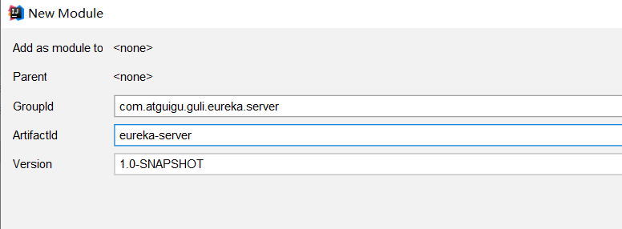**

application配置文件：

```yaml
server:
  port: 8888
eureka:
  instance:
    hostname: localhost
  client:
    # 是否向Eureka服务器注册其信息以供其它Eureka客户端发现
    register-with-eureka: false
    # 是否从注册中心获取注册的eureka客户端列表
    fetchRegistry: false
    service-url:
      #  注册中心地址
      defaultZone: http://${eureka.instance.hostname}:${server.port}/eureka
```

pom中引入依赖、指定springcloud版本：

```xml
<properties>
    <spring.cloud-version>Hoxton.SR9</spring.cloud-version>
</properties>
<dependencies>
    <dependency>
        <groupId>org.springframework.boot</groupId>
        <artifactId>spring-boot-starter-web</artifactId>
    </dependency>
    <dependency>
        <groupId>org.springframework.cloud</groupId>
        <artifactId>spring-cloud-starter-netflix-eureka-server</artifactId>
        <version>3.0.3</version>
    </dependency>
</dependencies>
<dependencyManagement>
    <dependencies>
        <dependency>
            <groupId>org.springframework.cloud</groupId>
            <artifactId>spring-cloud-dependencies</artifactId>
            <version>${spring.cloud-version}</version>
            <type>pom</type>
            <scope>import</scope>
        </dependency>
    </dependencies>
</dependencyManagement>
```

启动类上添加注解：@EnableEurekaServer

```java
@SpringBootApplication
@EnableEurekaServer
public class EurekaServerApplication {
    public static void main(String[] args) {
        SpringApplication.run(EurekaServerApplication.class,args);
    }
}
```

启动eureka_server访问：http://localhost:8888

​	可以看到空空如也的注册中心，等待客户端项目注册到其中

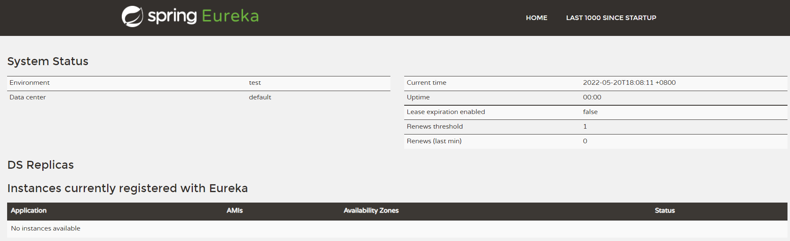

## 4.2 库存服务整合Eureka客户端

### 4.2.1 引入eureka客户端依赖

使用到springcloud组件(eureka-client)时需要配置springcloud版本，pom文件如下

```xml
<project xmlns="http://maven.apache.org/POM/4.0.0"
         xmlns:xsi="http://www.w3.org/2001/XMLSchema-instance"
         xsi:schemaLocation="http://maven.apache.org/POM/4.0.0 http://maven.apache.org/xsd/maven-4.0.0.xsd">
    <modelVersion>4.0.0</modelVersion>
    <parent>
        <groupId>org.springframework.boot</groupId>
        <artifactId>spring-boot-starter-parent</artifactId>
        <version>2.3.6.RELEASE</version>
        <relativePath/> <!-- lookup parent from repository -->
    </parent>
    <groupId>com.atguigu.guli</groupId>
    <artifactId>guli_stock</artifactId>
    <version>1.0-SNAPSHOT</version>
    <properties>
        <spring.cloud-version>Hoxton.SR9</spring.cloud-version>
    </properties>
    <dependencies>
        <dependency>
            <groupId>org.springframework.boot</groupId>
            <artifactId>spring-boot-starter-web</artifactId>
        </dependency>
        <dependency>
            <groupId>mysql</groupId>
            <artifactId>mysql-connector-java</artifactId>
            <version>5.1.47</version>
        </dependency>
        <dependency>
            <groupId>org.springframework.boot</groupId>
            <artifactId>spring-boot-starter-data-jpa</artifactId>
        </dependency>
        <dependency>
            <groupId>org.projectlombok</groupId>
            <artifactId>lombok</artifactId>
        </dependency>
        <dependency>
            <groupId>org.springframework.cloud</groupId>
            <artifactId>spring-cloud-starter-netflix-eureka-client</artifactId>
            <version>2.2.10.RELEASE</version>
        </dependency>
    </dependencies>
    <dependencyManagement>
        <dependencies>
            <dependency>
                <groupId>org.springframework.cloud</groupId>
                <artifactId>spring-cloud-dependencies</artifactId>
                <version>${spring.cloud-version}</version>
                <type>pom</type>
                <scope>import</scope>
            </dependency>
        </dependencies>
    </dependencyManagement>
</project>
```

### 4.2.3 application配置

```yaml
#spring:
  application:
    # 注册到注册中心的应用名：不能使用下划线
    name: guli-stock
eureka:
  instance:
    hostname: localhost
    # 是否将自己的ip注册到注册中心
    prefer-ip-address: true
    ip-address: 127.0.0.1
    fetch-registry: true
    # 注册到注册中心的应用名(组名)
  client:
    service-url:
      # 注册中心的地址
      defaultZone: http://localhost:8888/eureka
```


### 4.2.4 启动类上添加注解

```java
@EnableDiscoveryClient
```

### 4.2.5 启动测试

重启guli_stock服务

启动后，刷新eureka-server注册中心管理界面

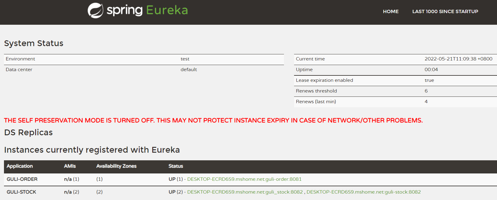


## 4.3 订单服务整合Eureka客户端

参考库存服务整合的步骤实现...

步骤略....

# 5、Ribbon实现负载均衡远程调用

## 5.1 Ribbon简介

Spring Cloud Ribbon是基于Netflix Ribbon实现的一套客户端负载均衡的工具。可以使用<font color="red">负载均衡算法进行服务调用</font>。

负载均衡：将用户的请求平均分配到多个服务器上，从而达到系统的HA(高可用)。

Ribbon客户端组件提供一系列完善的配置项，如：服务调用连接超时，重试等。从2017.1开始进入维护模式，不在进行版本迭代。

文档：https://github.com/Netflix/ribbon


实现原理：

Ribbon本地负载均衡，在调用微服务接口时候，先在注册中心上获取注册信息服务列表之后缓存到JVM本地，从而在本地实现远程服务调用。

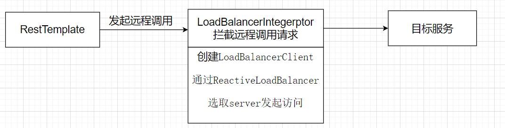

选取server的核心组件架构：


## 5.2 订单服务整合Ribbon实现远程访问库存服务

之前订单服务中是通过HttpClient实现远程访问的，现在可以使用高度封装过的Ribbon来简化操作。

### 5.2.1 依赖

guli_order服务的pom文件中引入ribbon的依赖

```xml
<dependency>
    <groupId>org.springframework.cloud</groupId>
    <artifactId>spring-cloud-starter-netflix-ribbon</artifactId>
</dependency>
<dependency>
    <groupId>com.netflix.ribbon</groupId>
    <artifactId>ribbon-eureka</artifactId>
</dependency>
```

### 5.2.2 创建配置类

创建配置类将RestTemplate注入到Spring容器中，并通过@LoadBalanced注解开启负载均衡

```java
@LoadBalanced
@Bean
public RestTemplate restTemplate(){
    return new RestTemplate();
}
```

### 5.2.3 远程调用的实现

```java
@Service
public class OrderService {
    @Autowired
    OrderMapper orderMapper;
    @Autowired
    RestTemplate restTemplate;
    //创建订单
    public boolean saveOrder(String userId,String productId,Integer count){
        OrderEntity orderEntity = new OrderEntity();
        orderEntity.setCount(count);
        orderEntity.setOrderSn(UUID.randomUUID().toString().replace("-",""));
        orderEntity.setCreateTime(new Date());
        orderEntity.setMoney(new BigDecimal(1000));
        orderEntity.setProductId(productId);
        orderEntity.setUserId(userId);
        orderEntity = orderMapper.save(orderEntity);
        System.out.println(orderEntity);
        //TODO: 更新库存
        //{1} 占位符，获取可变参数列表的中的第一个
        //GULI-STOCK:从注册中心获取库存服务地址+端口号的服务名
        Boolean flag = restTemplate.getForObject("http://GULI-STOCK/stock/{1}/{2}",
                Boolean.class, productId, count);
        System.out.println("修改库存结果："+ flag);
        return orderEntity!=null;
    }

}
```

访问创建订单接口测试：http://127.0.0.1:8081/order/9527/1001/22

### 5.2.4 Ribbon负载均衡的使用

#### 1、配置库存服务多实例启动

拷贝运行面板配置的库存启动类

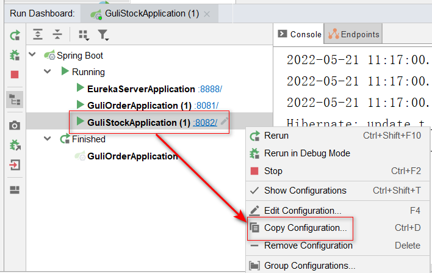

配置端口号：8182

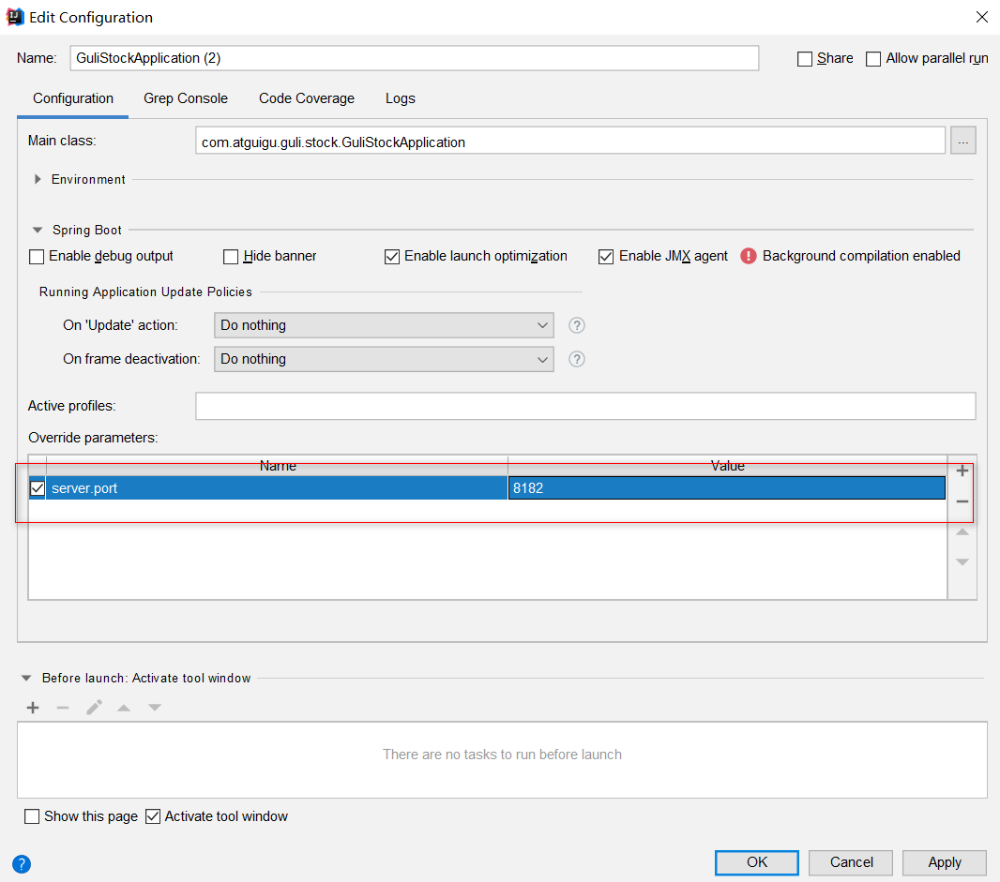

启动拷贝后的库存服务：

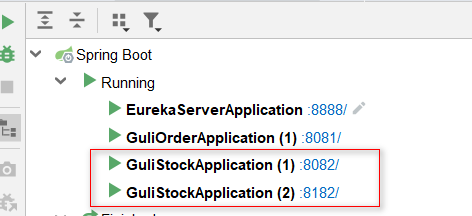

Eureka注册中心可以看到：

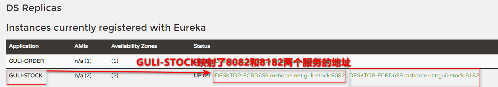

#### 2、多次访问创建订单的接口测试：

http://127.0.0.1:8081/order/9527/1001/22

Ribbon默认采用了轮询的负载均衡方式，每个服务各处理一次请求。底层使用IRule接口的实现类RoundRobinRule来处理挑选远程访问服务器的业务。


#### 3、自定义负载均衡策略：

除了使用Ribbon提供的众多IRule的实现类例如RetryRule(重试)、RandomRule(随机)的策略外，我们也可以通过实现IRule接口自定义负载均衡策略，下面我们自定义一个随机的负载均衡策略测试。

- 自定义负载均衡类

```java
public class MyRandomRule extends RandomRule {
    @Override
    public Server choose(ILoadBalancer lb, Object key) {
//        lb.getAllServers()
        //获取访问的在线的目标服务集合：例如通过GULI-STOCK现在可以获取到 8082和8182两个服务的配置
        List<Server> reachableServers = lb.getReachableServers();
        //获取在线目标服务的数量
        int count = reachableServers.size();
        //new Random().nextInt(count)获取 0~count-1之间的随机数，从集合中获取索引位置的服务
        return reachableServers.get(new Random().nextInt(count));
    }
}
```

- 配置

在ribbon配置类上使用@RibbonClient注解单独给GULI-STOCK服务的远程访问配置自定义负载均衡策略

```java
@RibbonClient(name = "GULI-STOCK",configuration = MyRandomRule.class)
```

如果希望MyRandomRule全局生效,可以在MyRandomRule类上添加@Component注解将其注入到容器中。

访问订单创建接口测试：http://127.0.0.1:8081/order/9527/1001/22

## 5.3 总结

ribbon远程调用则是通过Spring提供的RestTemplate实现，然后通过拦截器拦截请求，对请求路径中的服务名进行处理转为目标服务的ip+端口号。ribbon主要提供了负载均衡的策略。

但是这种方式实现远程访问，代码耦合度高，于是出现了基于ribbon的负载均衡策略封装性更好的声明式方式实现远程调用的OpenFeign.

# 6、声明式Rest客户端OpenFeign实现远程调用

Feign是一个声明式的web服务客户端，让编写web服务客户端变得非常容易，只需创建一个接口并在接口上添加注解即可

SpringCloud对Feign进行了封装，使其支持了SpringMVC标准注解和HttpMessageConverters。Feign可以与Eureka和Ribbon组合使用以支持负载均衡。

https://cloud.spring.io/spring-cloud-openfeign/reference/html/

## 6.1 订单服务引入OpenFeign依赖

guli_order服务的pom文件

```xml
<?xml version="1.0" encoding="UTF-8"?>
<project xmlns="http://maven.apache.org/POM/4.0.0"
         xmlns:xsi="http://www.w3.org/2001/XMLSchema-instance"
         xsi:schemaLocation="http://maven.apache.org/POM/4.0.0 http://maven.apache.org/xsd/maven-4.0.0.xsd">
    <modelVersion>4.0.0</modelVersion>
    <parent>
        <groupId>org.springframework.boot</groupId>
        <artifactId>spring-boot-starter-parent</artifactId>
        <version>2.3.6.RELEASE</version>
        <relativePath/> <!-- lookup parent from repository -->
    </parent>
    <groupId>com.atguigu.guli</groupId>
    <artifactId>guli_order</artifactId>
    <version>1.0-SNAPSHOT</version>
    <properties>
        <spring.cloud-version>Hoxton.SR9</spring.cloud-version>
    </properties>
    <dependencies>
        <dependency>
            <groupId>org.springframework.boot</groupId>
            <artifactId>spring-boot-starter-web</artifactId>
        </dependency>
        <dependency>
            <groupId>mysql</groupId>
            <artifactId>mysql-connector-java</artifactId>
            <version>5.1.47</version>
        </dependency>
        <dependency>
            <groupId>org.springframework.boot</groupId>
            <artifactId>spring-boot-starter-data-jpa</artifactId>
        </dependency>
        <dependency>
            <groupId>org.projectlombok</groupId>
            <artifactId>lombok</artifactId>
        </dependency>
        <dependency>
            <groupId>org.apache.httpcomponents</groupId>
            <artifactId>httpclient</artifactId>
        </dependency>
        <dependency>
            <groupId>org.springframework.cloud</groupId>
            <artifactId>spring-cloud-starter-netflix-eureka-client</artifactId>
            <version>2.2.10.RELEASE</version>
        </dependency>
        <dependency>
            <groupId>org.springframework.cloud</groupId>
            <artifactId>spring-cloud-starter-netflix-ribbon</artifactId>
        </dependency>
        <dependency>
            <groupId>com.netflix.ribbon</groupId>
            <artifactId>ribbon-eureka</artifactId>
        </dependency>
        <dependency>
            <groupId>org.springframework.cloud</groupId>
            <artifactId>spring-cloud-starter-openfeign</artifactId>
        </dependency>
    </dependencies>
    <dependencyManagement>
        <dependencies>
            <dependency>
                <groupId>org.springframework.cloud</groupId>
                <artifactId>spring-cloud-dependencies</artifactId>
                <version>${spring.cloud-version}</version>
                <type>pom</type>
                <scope>import</scope>
            </dependency>
        </dependencies>
    </dependencyManagement>
</project>
```

## 6.2 启动类上添加注解

```java
@EnableFeignClients
```

## 6.3 创建Feign客户端

```java
@FeignClient(value = "GULI-STOCK")//获取注册中心服务ip地址+端口号
public interface GuliStockClient {
    //库存服务的接口地址
    @GetMapping("/stock/{productId}/{count}")
    public Boolean updateStock(@PathVariable("productId")String productId ,
                               @PathVariable("count") Integer count);
}
```

## 6.4 修改创建订单的业务实现远程访问

guli_order服务创建订单的业务方法：

```java
@Autowired
GuliStockClient guliStockClient;
//    @Autowired
//    RestTemplate restTemplate;
//创建订单
public boolean saveOrder(String userId,String productId,Integer count){
    OrderEntity orderEntity = new OrderEntity();
    orderEntity.setCount(count);
    orderEntity.setOrderSn(UUID.randomUUID().toString().replace("-",""));
    orderEntity.setCreateTime(new Date());
    orderEntity.setMoney(new BigDecimal(1000));
    orderEntity.setProductId(productId);
    orderEntity.setUserId(userId);
    orderEntity = orderMapper.save(orderEntity);
    System.out.println(orderEntity);
    //TODO: 更新库存
    //{1} 占位符，获取可变参数列表的中的第一个
    //        Boolean flag = restTemplate.getForObject("http://GULI-STOCK/stock/{1}/{2}",
    //                Boolean.class, productId, count);
    //以调用方法的形式实现远程访问
    Boolean flag = guliStockClient.updateStock(productId, count);
    System.out.println("修改库存结果："+ flag);
    return orderEntity!=null;
}
```

## 6.5 访问测试

重启并访问guli_order创建订单接口：http://127.0.0.1:8081/order/9527/1001/22

## 6.6 访问超时配置

### 6.6.1 测试超时

guli_stock服务：业务方法中添加休眠代码

```java
//更新商品id更新库存
public Boolean updateStockByProductId(String productId,Integer count){
    try {
        Thread.sleep(3000);
    } catch (InterruptedException e) {
        e.printStackTrace();
    }
    return stockMapper.updateCountByProductId(productId,count)==1;
}
```

重启guli_stock服务

再次访问创建订单接口：http://127.0.0.1:8081/order/9527/1001/22

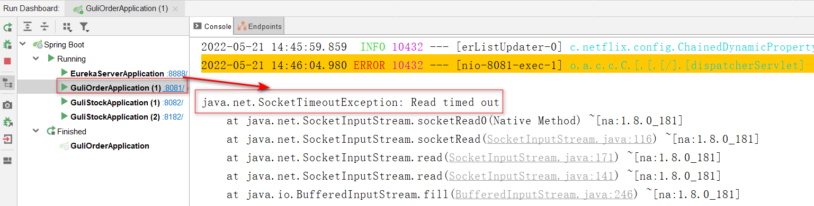

### 6.6.2 配置超时时长

guli_order服务的application.yml文件中添加如下配置

```yaml

ribbon:
  # 连接超时时间：默认1s，单位毫秒
  ConnectTimeout: 5000
  # 请求处理时间：默认1s，单位毫秒
  ReadTimeout: 5000
  # 关闭重试机制保证幂等性
  MaxAutoRetries: 0 #同一台实例最大重试次数,不包括首次调用
  MaxAutoRetriesNextServer: 1 #重试负载均衡其他的实例最大重试次数,不包括首次调用
```

重启guli_order，访问创建订单接口测试

## 6.7 远程调用日志打印

guli_order服务中创建Feign的日志配置类：

```java
@Configuration
public class FeignConfig {
    @Bean
    public Logger.Level level(){
        //FULL:详细日志
        //BASIC:简单日志
        //HEADERS：报文头日志
        //NONE: 不输出日志，默认
        return Logger.Level.FULL;//BASIC
    }
}
```

guli_order服务的application.yml文件中添加如下配置

```yaml
logging:
  level:
    # 配置GuliStockClient中输出日志时使用debug级别
    com.atguigu.guli.order.feign.GuliStockClient: debug
```

重启并访问guli_order创建订单接口测试：可以看到控制台日志

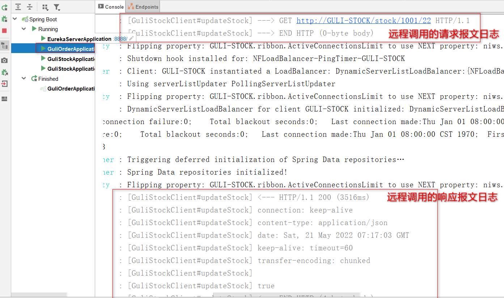


# 7、Hystrix断路器

## 7.1 简介

分布式系统是建立在网络之上的软件系统，网络波动、服务器宕机等情况导致服务和服务之间的远程调用不能保证一定成功。

多个微服务之间调用的时候，假如微服务A调用微服务B和微服务C，微服务B和微服务C又调用其他的微服务，这就是所谓的"**扇出**"。

如果扇出的链路上某个微服务的调用响应的时间过长或者不可用，对微服A的调用就会占用越来越多的系统资源，进而引起系统崩溃，所谓的"**雪崩效应**"。

对于高流量的应用来说，单一的后端依赖可能会导致所有的服务器上的所有资源都在几秒钟内饱和。比失败更糟糕的是，这些应用程序还可能导致服务之间的延迟增加，备份队列，线程和其他系统资源紧张，导致整个系统发生更多的级联故障。

**Hystrix**能够保证在一个依赖出问题的情况下，不会导致整体服务失败，避免级联故障，以提高分布式系统的弹性。当某个服务单元发生故障之后，**Hystrix**通过**断路器**的故障监控（类似熔断保险丝），向调用方返回一个符合预期的、可处理的备选响应（Fallback），而不是长时间的等待或者抛出调用方无法处理的异常，这样就保证了服务调用方的线程不会被长时间、不必要地占用

文档：https://github.com/Netflix/Hystrix

2017.7进入维护模式，不在进行版本迭代

## 7.2 Hystrix作用

服务限流Flowlimit：限制同时进入服务的流量

服务熔断Breaker：断开拒绝处理远程调用请求

服务降级Fallback：熔断后的兜底方案

Hystrix断路器：在SpringCloud框架里，熔断机制通过Hystrix实现。Hystrix会监控微服务间调用的状态，当失败的调用到一定阈值，缺省是10秒内20次调用并有50%的失败情况，就会启动熔断机制。熔断机制的注解是@HystrixCommand

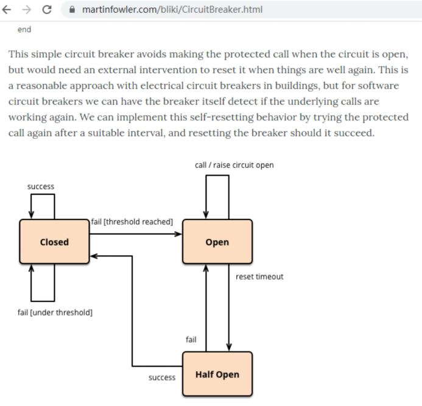

## 7.3 Hystrix熔断降级

### 7.3.1 制造远程访问异常

guli_stock服务更新库存的业务方法中休眠3秒钟代码保留

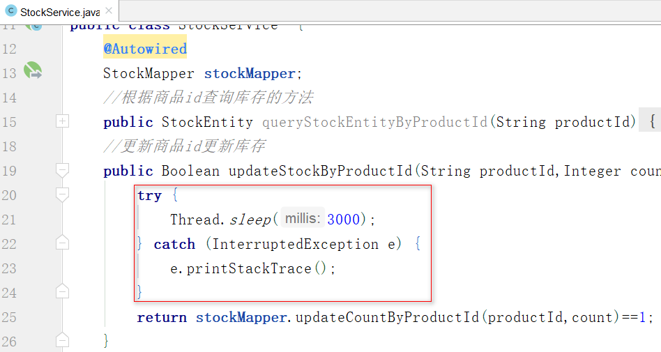

guli_order服务application中ribbon远程访问超时时长配置注释掉：

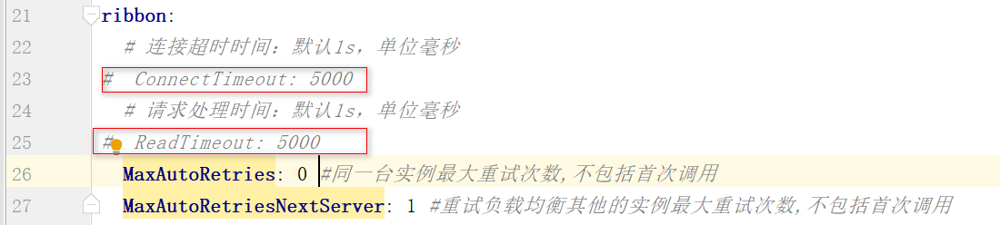

重启guli_order,访问创建订单接口：http://127.0.0.1:8081/order/9527/1001/22

会报错500~~~~

### 7.3.2 订单服务整合Hystrix熔断降级

#### 1、引入依赖

```xml
<dependency>
    <groupId>org.springframework.cloud</groupId>
    <artifactId>spring-cloud-starter-netflix-hystrix</artifactId>
</dependency>
```

#### 2、启动类注解

```java
@EnableCircuitBreaker
```

#### 3、创建降级方法

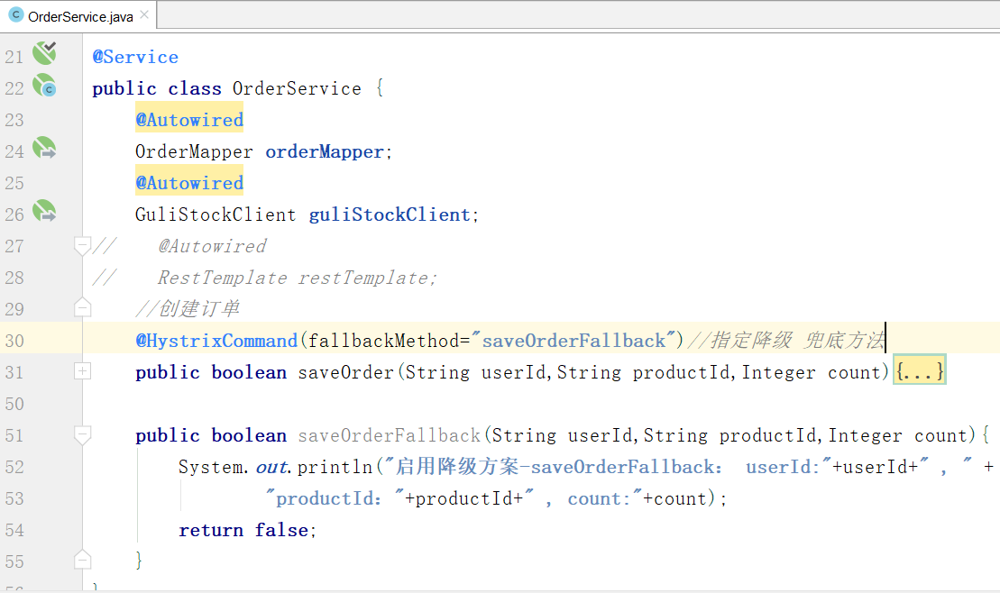

```java
@HystrixCommand(fallbackMethod="saveOrderFallback")//指定降级 兜底方法
public boolean saveOrder(String userId,String productId,Integer count){
	//省略....
}

public boolean saveOrderFallback(String userId,String productId,Integer count){
    System.out.println("启用降级方案-saveOrderFallback： userId:"+userId+" , " +
                       "productId："+productId+" , count:"+count);
    return false;
}
```

#### 4、测试

重启guli_order并访问创建订单接口：http://127.0.0.1:8081/order/9527/1001/22

**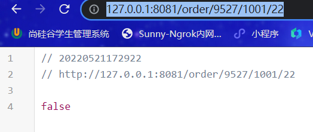**

## 7.4 断路器原理分析

### 7.4.1 断路器开关流程

#### 1、断路器开启关闭条件

当满足一定阀值的时候（默认10秒内超过20个请求次数）

当失败率达到一定的时候（默认10秒内超过50%请求失败）

到达以上阀值，断路器将会开启

当开启的时候，所有请求都不会进行转发

一段时间之后（默认是5秒），这个时候断路器是半开状态，会让其中一个请求进行转发。如果成功，断路器会关闭，若失败，继续开启。

#### 2、断路器打开之后

1、再有请求调用的时候，将不会调用主逻辑，而是直接调用降级fallbak。通过断路器，实现了自动地发现错误并将降级逻辑切换为主逻辑，减少响应延迟的效果。

2、当断路器打开，对主逻辑进行熔断之后，hystrix会启动一个休眠时间窗，在这个时间窗内，降级逻辑是临时的成为主逻辑，当休眠时间窗到期，断路器将进入半开状态，释放一次请求到原来的主逻辑上，如果此次请求正常返回，那么断路器将继续闭合，主逻辑恢复，如果这次请求依然有问题，断路器继续进入打开状态，休眠时间窗重新计时。

### 7.4.2 hystrixDashboard监控断路器状态

#### 1、简介

Hystrix提供了准实时的调用监控(Hystrix Dashboard)，Hystrix会持续地记录所有通过Hystrix发起的请求的执行信息，并以统计报表和图形的形式展示给用户，包括每秒执行多少请求多少成功，多少失败等。Netflix通过hystrix-metrics-event-stram项目实现了对以上指示的监控。Spring Cloud也提供了Hystrix Dashboard的整合，对监控内容转化成可视化界面。

#### 2、订单服务整合hystrixDashboard

guli_order引入hystrixDashboard依赖

```xml
<dependency>
    <groupId>org.springframework.cloud</groupId>
    <artifactId>spring-cloud-starter-netflix-hystrix-dashboard</artifactId>
</dependency>
<dependency>
    <groupId>org.springframework.boot</groupId>
    <artifactId>spring-boot-starter-actuator</artifactId>
</dependency>
```

application配置文件：

```yaml
#暴露全部的监控信息
management:
  endpoints:
    web:
      exposure:
        include: "*"
# 允许监控数据流的代理路径列表
hystrix:
  dashboard:
    proxy-stream-allow-list: "localhost"
```

启动类添加注解并配置服务监控：

```java
@SpringBootApplication
@EnableFeignClients
@EnableDiscoveryClient
@EnableHystrixDashboard
@EnableCircuitBreaker
public class GuliOrderApplication {
    public static void main(String[] args) {
        SpringApplication.run(GuliOrderApplication.class,args);
    }
    /**
     *此配置是为了服务监控而配置
     */
    @Bean
    public ServletRegistrationBean getServlet() {
        HystrixMetricsStreamServlet streamServlet = new HystrixMetricsStreamServlet();
        ServletRegistrationBean registrationBean = new ServletRegistrationBean(streamServlet);
        registrationBean.setLoadOnStartup(1);
        registrationBean.addUrlMappings("/hystrix.stream");
        registrationBean.setName("HystrixMetricsStreamServlet");
        return registrationBean;
    }
}
```


#### 3、测试

重启guli_order

访问Hystrix远程调用监控面板路径：http://localhost:8081/hystrix ，并在输入框输入地址: http://localhost:8081/hystrix.stream 点击 Monitor Stream解析 /hystrix.stream路径的远程调用数据流

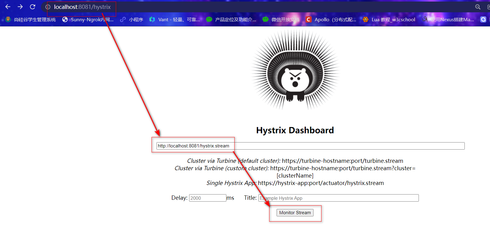

默认没有发起远程调用时，数据流为空，等待加载

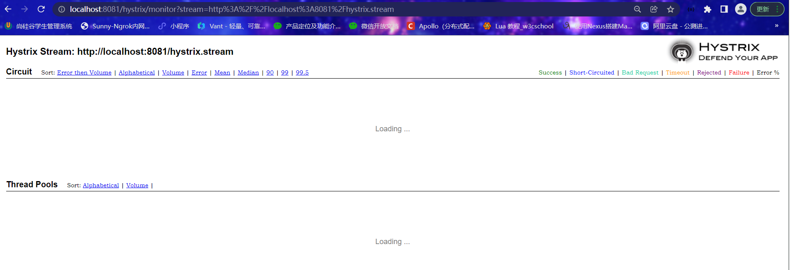


访问创建订单接口：http://127.0.0.1:8081/order/9527/1001/22  会发起远程调用，可以看到面板中监控到的数据流

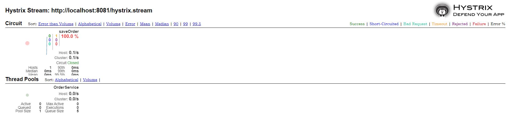

监控面板解析：

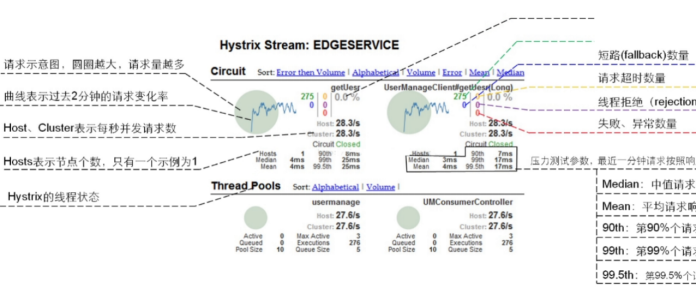

关闭guli_stock，然后使用 jmeter(如何使用参考7.4.2/4)并发访问创建订单接口测试，可以看到当当满足一定阀值的时候（默认10秒内超过20个请求次数）或者 当失败率达到一定的时候（默认10秒内超过50%请求失败）断路器状态变为开启。

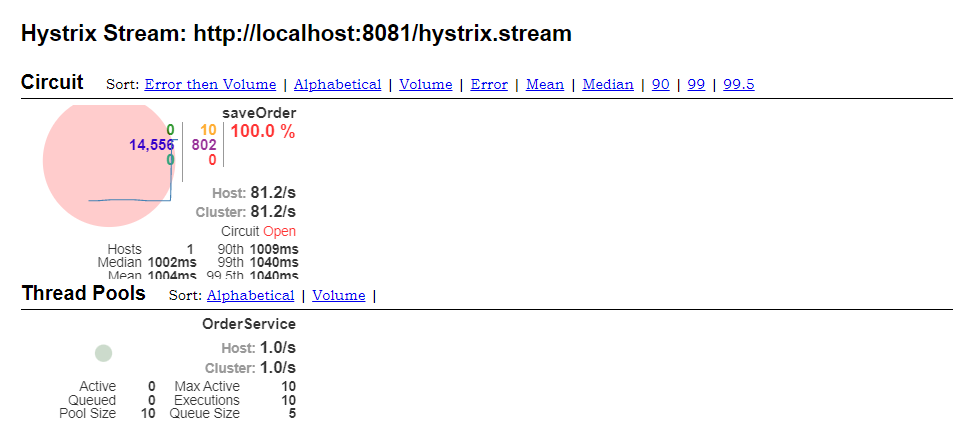

启动guli_stock服务，再查看面板状态

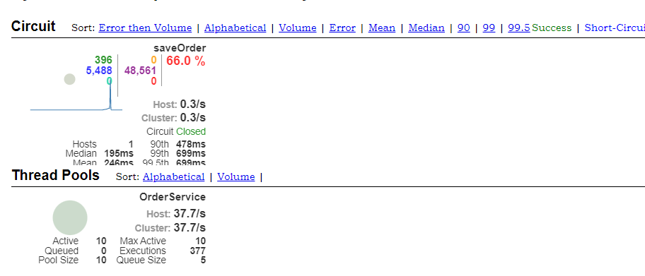

#### 4、jmeter使用说明

Apache JMeter 是 Apache 组织基于 Java 开发的压力测试工具，用于对软件做压力测试。

##### 启动jmeter

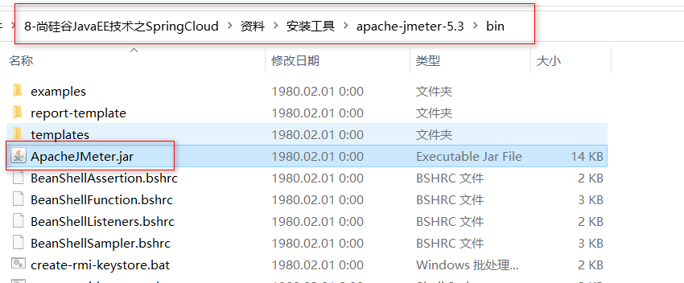

##### 创建线程组

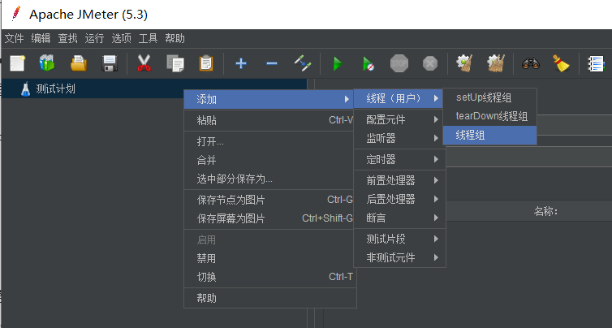

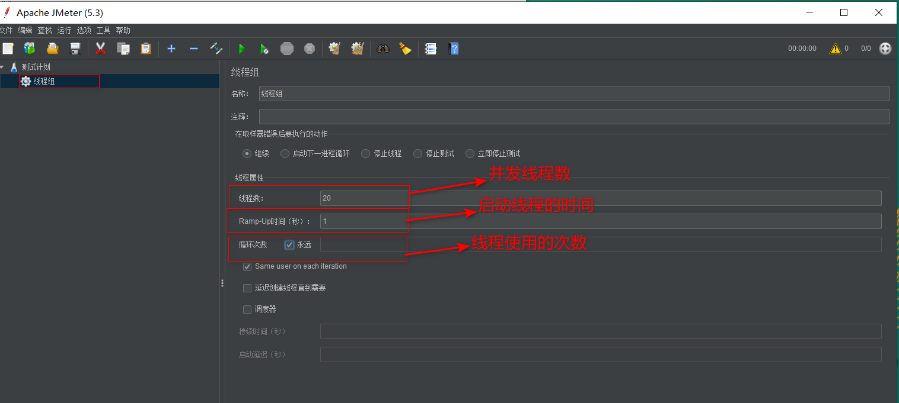

##### 添加线程组任务

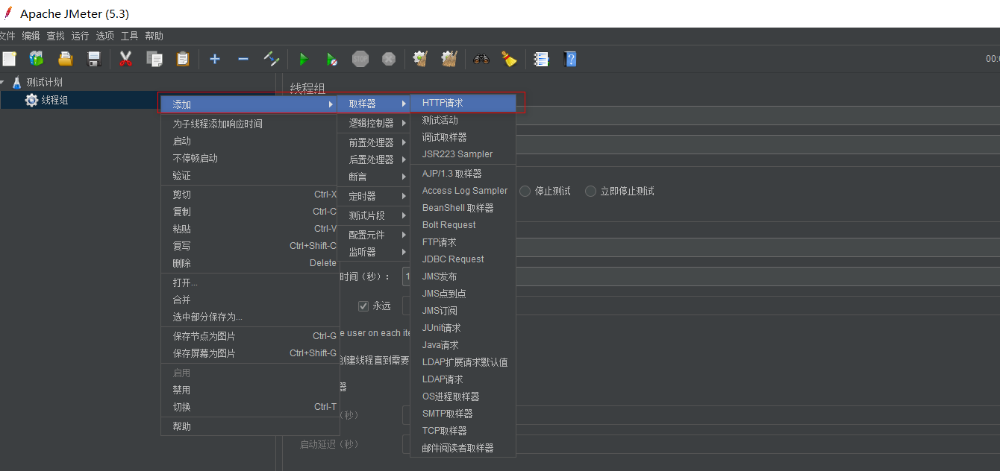


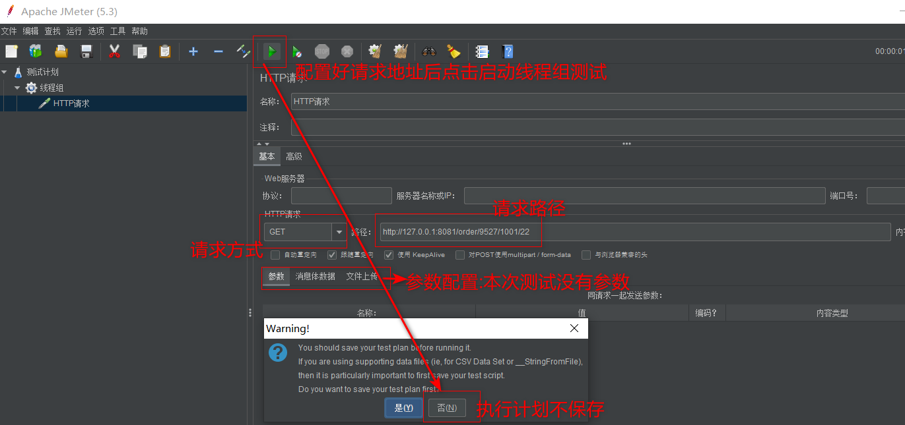

# 8、Gateway网关

## 8.1 简介

分布式架构项目会有多个微服务，以负载用户并发访问的请求，不同的微服务一般有不同的网络地址。但是项目在开发或者用户访问时会出现以下问题：

> 客户端会多次请求不同微服务，增加客户端的复杂性

> 存在跨域请求，在一定场景下处理相对复杂

> 认证复杂，每一个服务都需要独立认证

> 难以重构，随着项目的迭代，可能需要重新划分微服务，如果客户端直接和微服务通信，那么重构会难以实施

> 某些微服务可能使用了其他协议，直接访问有一定困难

网关提供了代理、路由、断言和过滤的功能。其中路由功能负责将外部请求转发到具体的微服务实例上，统一外部访问入口，而过滤器功能则负责对请求的处理过程进行干预，可以实现请求校验、服务聚合等功能，以后的访问微服务都是通过网关跳转后获得。

springCloud 1.x版本中都是采用的Zuul网关，2.x版本中，SpringCloud自己研发了一个网关代替Zuul,那就是SpringCloud Gateway

微服务架构图：

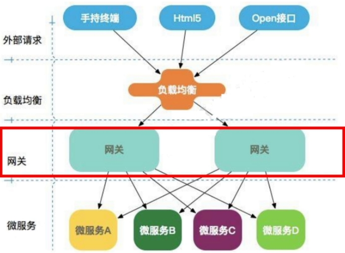

## 8.2 工作流程

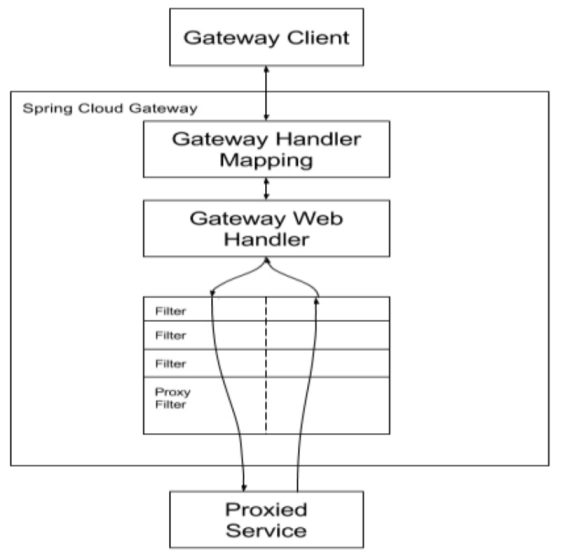


客户端向Spring Cloud Gateway发出请求。然后在Gateway Handler Mapping中找到与请求匹配的路由，将其发送到Gateway Web Handler.

Handler再通过指定的过滤器链来将请求发送给我们实际的服务执行业务逻辑，然后返回。

过滤器之间用虚线分开是因为过滤器可能会在发送代理请求之前（"pre"）或之后("post")执行业务逻辑。

Filter在"pre"类型的过滤器可以做参数校验、权限校验、流量监控、日志输出、协议转换等，在"post"类型的过滤器中可以做响应内容、响应头的修改，日志的输出，流量控制等有着非常重要的作用。

官网：

https://cloud.spring.io/spring-cloud-static/spring-cloud-gateway/2.2.1.RELEASE/reference/html/#gateway-how-it-works

## 8.3 搭建Gateway网关项目

### 8.3.1 创建springboot项目：guli-gateway 

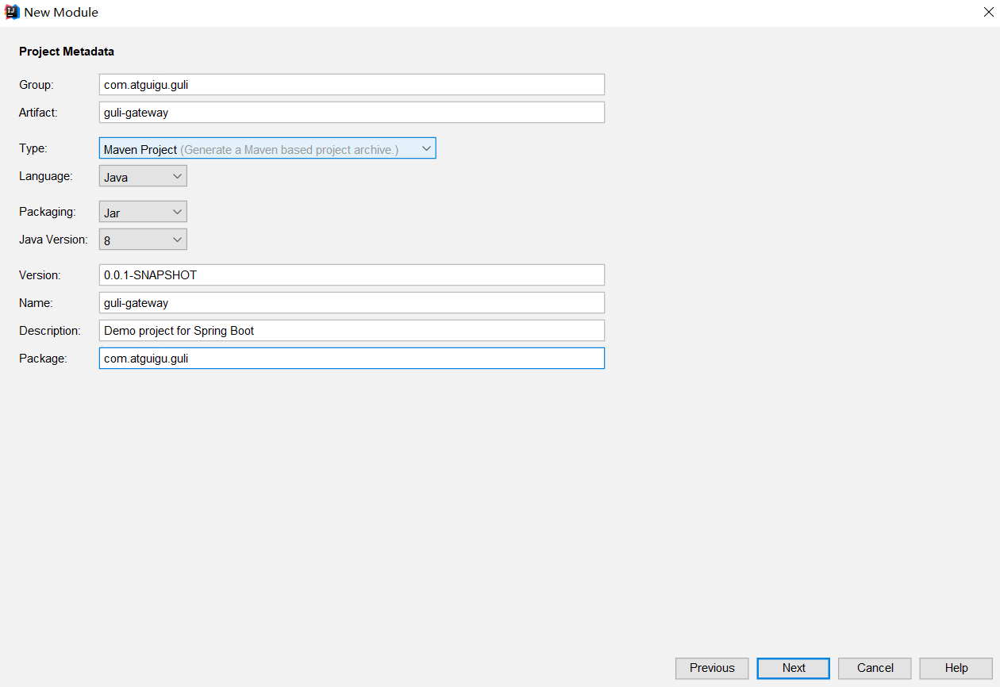

### 8.3.2 pom中引入依赖

```xml
<?xml version="1.0" encoding="UTF-8"?>
<project xmlns="http://maven.apache.org/POM/4.0.0" xmlns:xsi="http://www.w3.org/2001/XMLSchema-instance"
         xsi:schemaLocation="http://maven.apache.org/POM/4.0.0 https://maven.apache.org/xsd/maven-4.0.0.xsd">
    <modelVersion>4.0.0</modelVersion>
    <parent>
        <groupId>org.springframework.boot</groupId>
        <artifactId>spring-boot-starter-parent</artifactId>
        <version>2.3.6.RELEASE</version>
        <relativePath/> <!-- lookup parent from repository -->
    </parent>
    <groupId>com.atguigu.guli</groupId>
    <artifactId>guli-gateway</artifactId>
    <version>0.0.1-SNAPSHOT</version>
    <name>guli-gateway</name>
    <description>Demo project for Spring Boot</description>
    <properties>
        <java.version>1.8</java.version>
    </properties>
    <dependencies>
        <dependency>
            <groupId>org.springframework.boot</groupId>
            <artifactId>spring-boot-starter</artifactId>
        </dependency>

        <dependency>
            <groupId>org.springframework.boot</groupId>
            <artifactId>spring-boot-starter-test</artifactId>
            <scope>test</scope>
        </dependency>
        <dependency>
            <groupId>org.springframework.boot</groupId>
            <artifactId>spring-boot-starter-web</artifactId>
        </dependency>
        <dependency>
            <groupId>org.springframework.cloud</groupId>
            <artifactId>spring-cloud-starter-netflix-eureka-client</artifactId>
            <version>2.2.10.RELEASE</version>
        </dependency>
        <!-- 网关依赖：2.x的最新版本为2.2.10.RELEASE -->
        <dependency>
            <groupId>org.springframework.cloud</groupId>
            <artifactId>spring-cloud-starter-gateway</artifactId>
            <version>2.2.10.RELEASE</version>
        </dependency>
    </dependencies>

    <build>
        <plugins>
            <plugin>
                <groupId>org.springframework.boot</groupId>
                <artifactId>spring-boot-maven-plugin</artifactId>
            </plugin>
        </plugins>
    </build>
    <dependencyManagement>
        <dependencies>
            <dependency>
                <groupId>org.springframework.cloud</groupId>
                <artifactId>spring-cloud-dependencies</artifactId>
                <version>Hoxton.SR9</version>
            </dependency>
        </dependencies>
    </dependencyManagement>
</project>
```

### 8.3.3 配置

application.yml

```yaml
spring:
  application:
    name: guli-gateway
server:
  port: 80
eureka:
  instance:
    ip-address: 127.0.0.1
    prefer-ip-address: true
  client:
    service-url:
      defaultZone: http://localhost:8888/eureka/
```

### 8.3.4 路由配置

路由：网关服务将访问网关的请求根据路由配置路由到目标微服务处理，以便对请求进行过滤或者负载均衡

#### 1、通过路径匹配路由

```yaml
spring:
  cloud:
    gateway:
      routes:
      	# 路由id
        - id: order-route
          # 目标服务地址
          uri: http://localhost:8081
          predicates: # 断言列表
            # 路径断言：如果请求路径以/order开始，请求就路由到uri地址的服务处理
            - Path=/order/**
        - id: stock-route
          uri: http://localhost:8082
          predicates:
            - Path=/stock/**
```

启动网关项目：

​	访问网关项目，包含order路径的请求会被路由到订单服务：http://localhost/order/9527/1001/11

​	访问网关项目，包含stock路径的请求会被路由到库存服务：http://localhost/stock/1001/1

分布式架构项目，访问量较大的服务可以集群启动。但是如果以路径方式配置的路由只能路由到单个服务，无法负载均衡。gateway提供了基于ribbon负载均衡模块使用服务名实现负载均衡的配置方式。

#### 2、通过服务名匹配路由

```yaml
spring:
  application:
    name: guli-gateway
  cloud:
    gateway:
      routes:
        - id: order-route
          uri: lb://guli-order
          predicates:
            # 路径断言：如果请求路径以/order开始，请求就路由到uri地址的服务处理
            - Path=/order/**
        - id: stock-route
          uri: lb://guli-stock
          predicates:
            - Path=/stock/**
```

guli_stock服务以多实例方式启动

访问网关项目，包含stock路径的请求会被路由到库存服务：http://localhost/stock/1001/1

观察控制台，通过网关访问库存服务时，会以轮询的负载均衡策略路由到目标服务，以减少单台服务器负载的效果

#### 3、通过配置类配置路由

注释guli-gateway项目的 stock-route路由配置，这种方式使用较少

创建路由配置类：实现库存服务的路由

```java
@Configuration
public class RouteConfig {

    @Bean
    public RouteLocator routeLocator(RouteLocatorBuilder builder){
        return builder.routes()
                .route("stock-route", r->r.path("/stock/**").uri("lb://guli-stock"))
                .build();
    }
}
```

访问网关项目，包含stock路径的请求会被路由到库存服务：http://localhost/stock/1001/1


## 8.4 路由断言

### 8.4.1 简介

Spring Cloud Gateway 通过Predicate来匹配来自用户的请求

Spring Cloud Gateway 使用spring webflux的Handler Mapping为基础结构实现路由功能。

Spring Cloud Gateway创建Route对象时，使用RoutePredicateFactory创建Predicate对象。

Spring Cloud Gateway包含许多内置的路由断言Factories。这些断言都匹配HTTP请求的不同属性。多个路由断言Factories可以通过 and 组合使用

查看网关项目启动日志可以看到断言工厂加载过程：


### 8.4.2 断言工厂的使用

```yaml
          spring:
  application:
    name: guli-gateway
  cloud:
    gateway:
      routes:
        - id: order-route
          uri: lb://guli-order
          predicates:
            # 路径断言：如果请求路径以/order开始，请求就路由到uri地址的服务处理
            - Path=/order/**
        - id: stock-route
          uri: lb://guli-stock
          predicates:
            - Path=/stock/*,/user/*   #断言,路径相匹配的进行路由
            - After=2022-05-01T08:00:00.0+08:00 # 断言，在此时间后请求才会被匹配
            - Before=2022-05-01T09:08+08:00 # 断言，在此时间前请求才会被匹配
            - Between=2022-05-01T08:00:00.0+08:00,2022-05-02T09:10+08:00 # 断言，在此时间区间内访问的请求才会被匹配
            - Cookie=username,atguigu # 断言，请求头中携带Cookie: username=atguigu才可以匹配
            - Cookie=id,9527
            - Header=X-Request-Id,\d+ # 断言，请求头中要有X-Request-Id属性并且值为整数的正则表达式
            - Method=POST # 断言，请求方式为post方式才会被匹配
            - Query=pwd,[a-z0-9_-]{6} # 断言，请求参数中包含pwd并且值长度为6才会被匹配
```

通过postman测试

## 8.5 网关过滤器

### 8.5.1 简介

网关包含路由和过滤两大功能，过滤是通过Filter实现。SpringCloud Gateway内置了多种路由过滤器，他们都由GatewayFilter的工厂类来产生。

根据过滤时机不同，分两种类型Filter：一种是”pre”类型，在路由之前过滤请求，可以进行参数校验、权限校验、流量监控、日志输出、协议转换等。另一种是”post”类型，在返回响应之后过滤请求，可以进行响应内容、响应头的修改，日志的输出，流量监控等。

根据作用范围不同，也可以分为两种Filter：一种是”GatewayFilter”, 应用到单个路由或者一个分组的路由上。另外一种是”GlobalFilter”, 应用到所有的路由上。

### 8.5.2 全局过滤器GlobalFilter

GlobalFilter，通过GatewayFilterAdapter包装成GatewayFilterChain可识别的过滤器，它为请求业务以及路由的URI转换为真实业务服务的请求地址的核心过滤器，不需要配置，系统初始化时加载，作用在每个路由上。

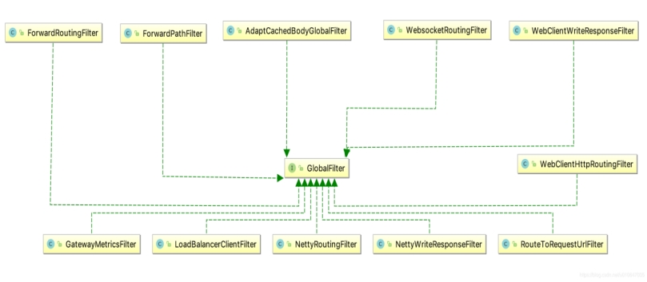

使用GlobalFilter时，一般逻辑较多，可以使用自定义GlobalFilter 来处理，自定义GlobalFilter需要实现GlobalFilter、Ordered 两个接口。

案例：自定义GlobalFilter，拦截所有访问库存服务的请求。

```java
@Component
public class MyPathGlobalFilter implements GlobalFilter , Ordered {
    //exchange: 交换机，可以获取请求对象和响应对象
    //chain: filter链，可以放行请求给下一个过滤器或目标服务
    @Override
    public Mono<Void> filter(ServerWebExchange exchange, GatewayFilterChain chain) {
        ServerHttpRequest request = exchange.getRequest();
        ServerHttpResponse response = exchange.getResponse();
        //获取请求路径，如果包含 /stock，则拦击请求,否则放行
        String path = request.getURI().getPath();
        AntPathMatcher antPathMatcher = new AntPathMatcher();
        if(antPathMatcher.match("/stock/**",path)){
            //拦截请求，响应拦截提示
            response.setStatusCode(HttpStatus.OK);//响应状态码
            response.getHeaders().set(HttpHeaders.CONTENT_TYPE,"text/html;charset=UTF-8");//设置响应头
            //设置响应体
            DataBuffer buffer = response.bufferFactory().wrap("访问失败,请联系管理员解决!".getBytes());
            return response.writeWith(Mono.just(buffer));
        }
        //放行请求
        return chain.filter(exchange);
    }

    @Override
    public int getOrder() {
        return 0;
    }
}
```

重启网关服务，访问订单和库存服务接口测试


### 8.5.3 GatewayFilter

#### 1、Gateway自带GatewayFilter的使用

Gateway自带了多个GatewayFilter，在yml指定route下配置需要使用的GatewayFilter工厂类类名即可使用：

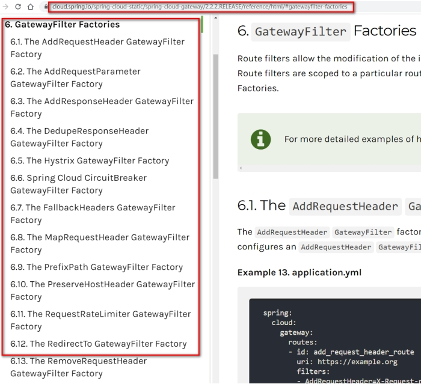


```yaml
spring:
  application:
    name: guli-gateway
  cloud:
    gateway:
      routes:
        - id: order-route
          uri: lb://guli-order
          predicates:
            # 路径断言：如果请求路径以/order开始，请求就路由到uri地址的服务处理
            - Path=/order/**
          filters:
          	# 添加请求参数的过滤器
            - AddRequestParameter=userKey,1234567
```

订单服务中获取请求参数查看：

```java
@RestController
@RequestMapping("/order")
public class OrderController {
    @Autowired
    OrderService orderService;
    @GetMapping("{userId}/{productId}/{count}")
    public Boolean createOrder(@PathVariable("userId")String userId,
                               @PathVariable("productId")String productId,
                               @PathVariable("count")Integer count,
                               @RequestParam("userKey")String userKey){
        System.out.println("userKey = "+ userKey);
        return orderService.saveOrder(userId,productId,count);
    }
}
```


#### 2、自定义GatewayFilter

需求：过滤请求，请求头中如果请求头中没有token则添加token。

```java
@Component
public class MyTokenGatewayFilterFactory extends AbstractGatewayFilterFactory {

    @Override
    public GatewayFilter apply(Object config) {
        return new GatewayFilter() {
            @Override
            public Mono<Void> filter(ServerWebExchange exchange, GatewayFilterChain chain) {
                ServerHttpRequest request = exchange.getRequest();
                MultiValueMap<String, HttpCookie> cookies = request.getCookies();
                HttpCookie httpCookie = cookies.getFirst("token");
                if(httpCookie==null){
                    ServerHttpResponse response = exchange.getResponse();
                    MultiValueMap<String, ResponseCookie> c = response.getCookies();
                    c.add("token", ResponseCookie.from("token",UUID.randomUUID().toString())
                            .build());
                }
                return chain.filter(exchange);
            }
        };
    }
}
```

网关项目application.yml中配置使用Filter：

```yaml
spring:
  application:
    name: guli-gateway
  cloud:
    gateway:
      routes:
        - id: order-route
          uri: lb://guli-order
          predicates:
            # 路径断言：如果请求路径以/order开始，请求就路由到uri地址的服务处理
            - Path=/order/**
          filters:
            - AddRequestParameter=token,1234567
            - MyToken
```

订单服务获取cookie中的token查看：

```java
@RestController
@RequestMapping("/order")
public class OrderController {
    @Autowired
    OrderService orderService;
    @GetMapping("{userId}/{productId}/{count}")
    public Boolean createOrder(@PathVariable("userId")String userId,
                               @PathVariable("productId")String productId,
                               @PathVariable("count")Integer count,
                               @RequestParam("userKey")String userKey,
                               @CookieValue("token")String token){
        System.out.println("userKey = "+ userKey);
        System.out.println("token = "+ token);
        return orderService.saveOrder(userId,productId,count);
    }
}
```

# 9、Sleuth分布式链路请求跟踪

## 9.1 简介

在分布式系统中，微服务有多个，服务之间调用关系也比较复杂，如果有的微服务网络或者服务器出现问题会导致服务提供失败，如何快速便捷的去定位出现问题的微服务，SpringCloud Sleuth 给我们提供了解决方案，它集成了Zipkin、HTrace 链路追踪工具，用服务链路追踪来快速定位问题。Zipkin使用较多。Zipkin 主要由四部分构成：收集器、数据存储、查询以及 Web 界面。Zipkin 的收集器负责将各系统报告过来的追踪数据进行接收；而数据存储默认使用 Cassandra，也可以替换为 MySQL；查询服务用来向其他服务提供数据查询的能力，而 Web 服务是官方默认提供的一个图形用户界面。

## 9.2 zipkin下载启动

zipkin下载地址：https://search.maven.org/remote_content?g=io.zipkin&a=zipkin-server&v=LATEST&c=exec

启动zipkin：java -jar zipkin-server-2.23.16-exec.jar

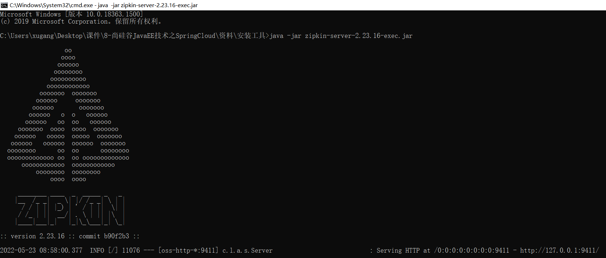

访问zipkin控制台： http://localhost:9411

项目的调用数据还未采集到zipkin，所以Zipkin控制台没有要进行追踪的微服务

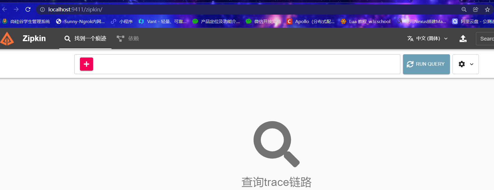


## 9.3 zipkin相关术语

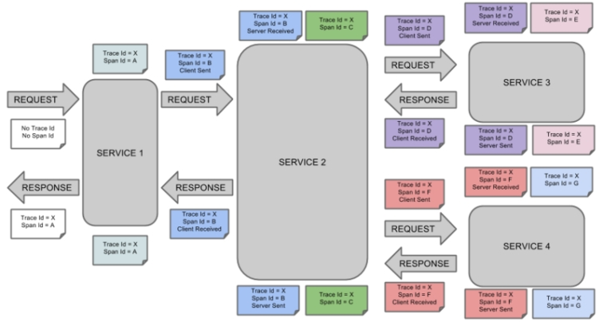


**1、Span**：基本工作单元，例如，在一个新建的span中发送一个RPC等同于发送一个回应请求给RPC，span通过一个64位ID唯一标识，trace以另一个64位ID表示，span还有其他数据信息，比如摘要、时间戳事件、关键值注释(tags)、span的ID、以及进度ID(通常是IP地址)，span在不断的启动和停止，同时记录了时间信息，当你创建了一个span，你必须在未来的某个时刻停止它。 可以简单理解为一次请求到响应的信息

**2 、Trace**：一系列spans组成的一个树状结构，例如，如果你正在跑一个分布式大数据工程，你可能需要创建一个trace。 

**3 、Annotation**：用来及时记录一个事件的存在，一些核心annotations用来定义一个请求的开始和结束 :

**4、 Client Sent** -客户端发起一个请求，这个annotion描述了这个span的开始。Server Received -服务端获得请求并准备开始处理它，如果将其sr减去cs时间戳便可得到网络延迟。

 **5、Server Sent** -注解表明请求处理的完成(当请求返回客户端)，如果ss减去sr时间戳便可得到服务端需要的处理请求时间

**6、 Client Received** -表明span的结束，客户端成功接收到服务端的回复，如果cr减去cs时间戳便可得到客户端从服务端获取回复的所有所需时间

## 9.4 项目整合zipkin和sleuth

订单服务和库存服务引入依赖：zipkin场景启动器中已经包含了sleuth的依赖

```xml
<dependency>
    <groupId>org.springframework.cloud</groupId>
    <artifactId>spring-cloud-starter-zipkin</artifactId>
    <version>2.2.6.RELEASE</version>
</dependency>
```

application.yml中添加配置：

```yaml
#spring:
  zipkin:
    sender:
      type: web #数据采集格式使用Http协议
    base-url: http://localhost:9411 # zipkin服务端地址
  sleuth:
    sampler:
      probability: 1.0 # 采样率值介于0~1之间，1表示全部采样
```


## 9.5 测试

重启订单和库存服务，在zipkin控制台页面上可以查看请求详情：

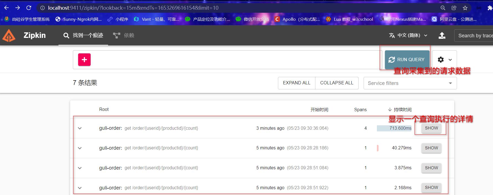


