# SpringCloud Alibaba

# 1、简介

## 1.1 背景

由于性能关系，Eureka停止更新，Hystrix和Ribbon进入维护模式，不再继续更新。

2018.10.31，Spring Cloud Alibaba正式入驻了Spring Cloud官网孵化器，并在Maven中央库发布了第一个版本。Spring Cloud Alibaba 致力于提供微服务开发的一站式解决方案。此项目包含开发分布式应用微服务的必需组件，方便开发者通过 Spring Cloud 编程模型轻松使用这些组件来开发分布式应用服务。依托 Spring Cloud Alibaba，您只需要添加一些注解和少量配置，就可以将 Spring Cloud 应用接入阿里微服务解决方案，通过阿里中间件来迅速搭建分布式应用系统。

参考：https://github.com/alibaba/spring-cloud-alibaba/blob/master/README-zh.md

常见的注册中心：

Eureka（原生，2.0遇到性能瓶颈，停止维护）

Zookeeper（支持，专业的独立产品。例如：dubbo）

Consul（原生，GO语言开发）

Nacos

相对于 Spring Cloud Eureka 来说，Nacos 更强大。

**Nacos = Spring Cloud Eureka + Spring Cloud Config**

Nacos 可以与 Spring, Spring Boot, Spring Cloud 集成，并能代替 Spring Cloud Eureka, Spring Cloud Config。

通过 Nacos Server 和 spring-cloud-starter-alibaba-nacos-config 实现配置的动态变更。

通过 Nacos Server 和 spring-cloud-starter-alibaba-nacos-discovery 实现服务的注册与发现。

nacos在阿里巴巴内部有超过10万的实例运行，已经过了类似双十一等各种大型流量的考验。

## 1.2 Nacos主要功能

Nacos主要提供以下四大功能：

- 服务发现和服务健康监测

- 动态配置服务

- 动态DNS服务

- 服务及其元数据管理

## 1.3 Nacos和SpringBoot、SpringCloud版本选择

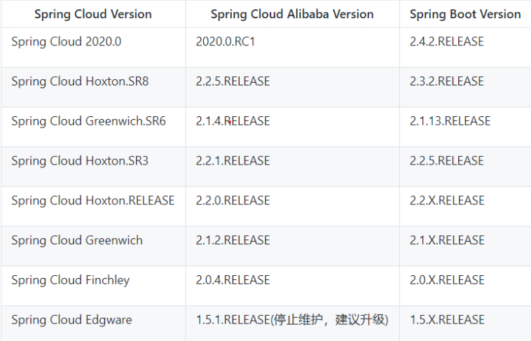

# 2、Nacos注册中心

## 2.1 案例准备

拷贝课件中准备的案例到工作空间(两个项目和之前eureka准备的项目一样)

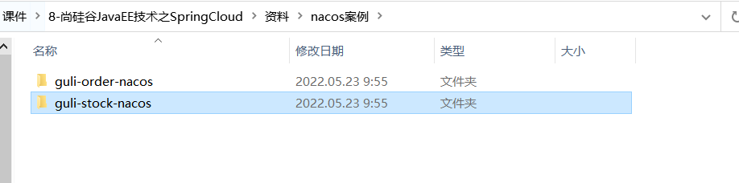

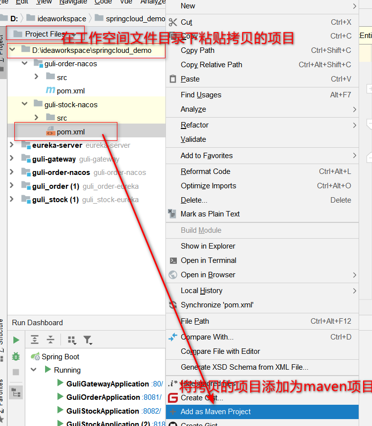

启动测试：

**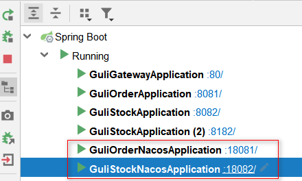**

## 2.2 Nacos注册中心下载启动

### 2.2.1 下载

下载地址：https://github.com/alibaba/nacos/releases

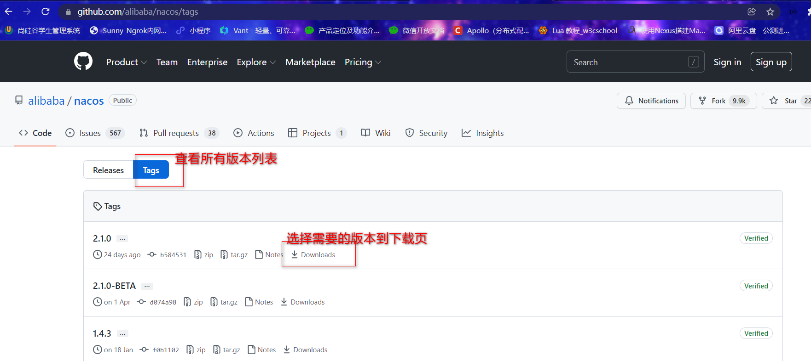


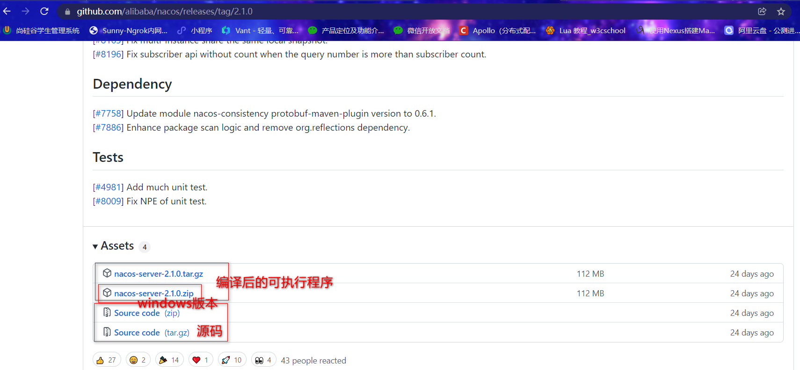

### 2.2.2 解压启动

解压下载的nacos-server.zip后的目录如下：


**启动nacos-server**

​	<b style="color:red;">注意！！！！！！：nacos运行的路径中不能有中文，将解压后的nacos剪切到无中文目录下启动</b>

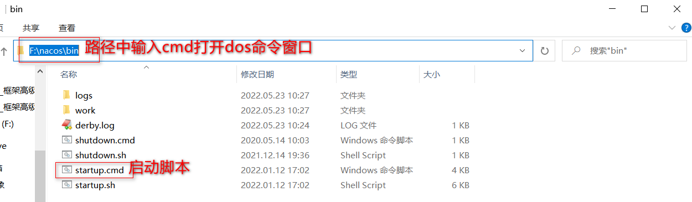

执行命令： startup.cmd  -m standalone

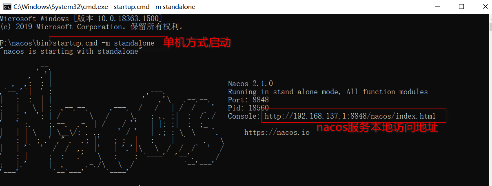

### 2.2.3 nacos-server访问测试

地址： http://localhost:8848/nacos

默认账号/密码：nacos/nacos

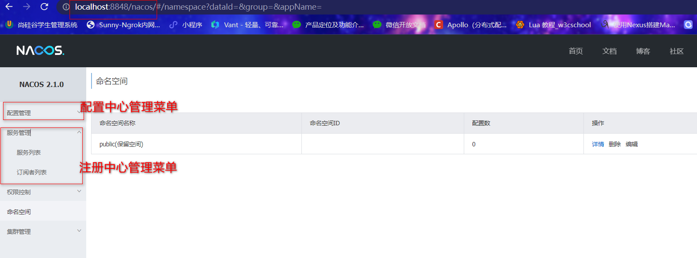

nacos-server集成了注册中心和配置中心的功能


## 2.3 nacos注册中心客户端整合

### 2.3.1 订单服务整合nacos注册中心

guli-order-nacos服务pom中引入依赖：

```xml
<dependency>
    <groupId>com.alibaba.cloud</groupId>
    <artifactId>spring-cloud-starter-alibaba-nacos-discovery</artifactId>
    <version>2.2.6.RELEASE</version>
</dependency>
```

application配置：

```yaml
#spring:
  application:
    name: guli-order-nacos
  cloud:
    nacos:
      discovery:
        server-addr: localhost:8848
```

重启guli-order-nacos：在控制台可以看到注册到nacos注册中心的日志

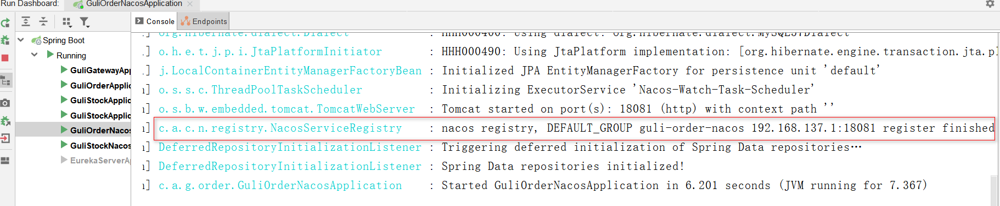

nacos-server管理控制台页面中可以看到：

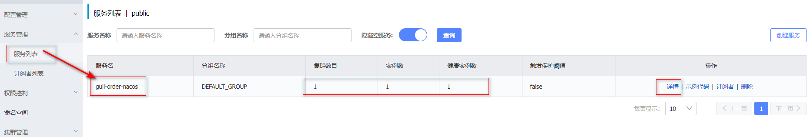

### 2.3.2 库存服务整合nacos注册中心

步骤参考订单服务的整合......

整合成功后配置库存服务多实例启动

- 拷贝启动配置

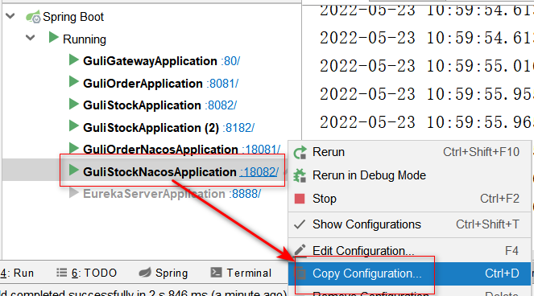

- 修改拷贝的启动配置的端口号启动

  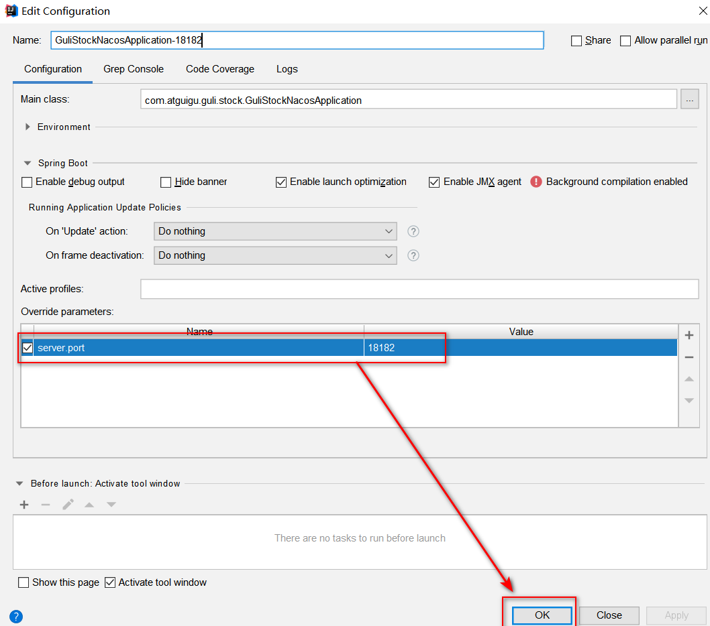

## 2.4 整合openFeign远程调用

### 2.4.1 订单服务整合openfeign

guli-order-nacos pom中引入依赖：

```xml
<dependency>
    <groupId>org.springframework.cloud</groupId>
    <artifactId>spring-cloud-starter-openfeign</artifactId>
    <version>2.2.6.RELEASE</version>
</dependency>
```

### 2.4.2 创建远程调用Feign客户端

guli-order-nacos中创建Feign客户端

```java
@FeignClient("guli-stock-nacos")
public interface GuliStockNacosClient {
    @GetMapping("/stock/{productId}/{count}")
    public Boolean updateStock(@PathVariable("productId")String productId ,
                               @PathVariable("count") Integer count);

}
```

### 2.4.3 添加@EnableFeignClients注解

```java
@SpringBootApplication
@EnableFeignClients
public class GuliOrderNacosApplication {
    public static void main(String[] args) {
        SpringApplication.run(GuliOrderNacosApplication.class,args);
    }
}
```

### 2.4.4 远程访问实现

guli-order-nacos中通过GuliStockNacosClient远程更新库存

```java
@Autowired
GuliStockNacosClient guliStockNacosClient;
//创建订单
public boolean saveOrder(String userId,String productId,Integer count){
	//.......
    Boolean stock = guliStockNacosClient.updateStock(productId, count);
    System.out.println("更新库存："+stock);
    return orderEntity!=null;
}
```

feign默认使用ribbon负载均衡模块轮询的策略进行远程调用。

# 3、Nacos配置中心

## 3.1 简介

在系统开发过程中，开发者通常会将一些需要变更的参数、变量等从代码中分离出来独立管理，以独立的配置文件的形式存在。目的是让静态的系统工件或者交付物（如 WAR，JAR 包等）更好地和实际的物理运行环境进行适配。配置管理一般包含在系统部署的过程中，由系统管理员或者运维人员完成。配置变更是调整系统运行时的行为的有效手段。

如果微服务架构中没有使用统一配置中心时，所存在的问题：

- 配置文件分散在各个项目里，不方便维护

- 配置内容安全与权限

- 更新配置后，项目需要重启

**nacos配置中心**：系统配置的集中管理（编辑、存储、分发）、动态更新不重启、回滚配置（变更管理、历史版本管理、变更审计）等所有与配置相关的活动。

## 3.2 nacos配置中心客户端整合

guli-order-nacos服务引入依赖：

```xml
<dependency>
    <groupId>com.alibaba.cloud</groupId>
    <artifactId>spring-cloud-starter-alibaba-nacos-config</artifactId>
    <version>2.2.6.RELEASE</version>
</dependency>
```

application中添加配置：

```yaml
#spring:
#  cloud:
#    nacos:
#      discovery:
#        server-addr: localhost:8848
      config: # 配置中心地址
        server-addr: localhost:8848
```

重启guli-order-nacos服务可以看到控制台日志：配置中心默认加载的配置文件

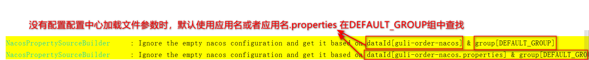

## 3.3 配置中心配置加载

### 3.3.1 默认配置加载

#### 1、创建配置

参考项目启动时的日志要加载的默认配置信息，我们可以在nacos配置中心默认分组中创建guli-order-nacos或者guli-order-nacos.properties配置文件 并提供配置。

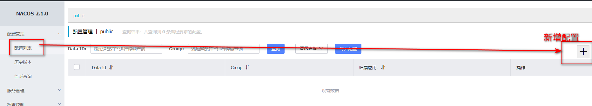

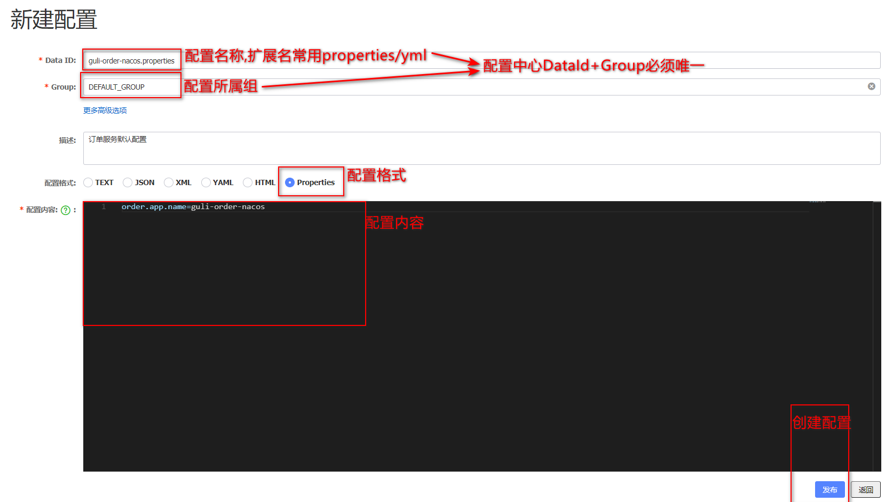

#### 2、订单服务加载配置

guli-order-nacos 获取配置中心配置：

```java
@Value("${order.app.name}")
String appName;
@GetMapping("{userId}/{productId}/{count}")
public Boolean createOrder(@PathVariable("userId")String userId,
                           @PathVariable("productId")String productId,
                           @PathVariable("count")Integer count){
    System.out.println("配置中心参数appName ：" + appName);
    return orderService.saveOrder(userId,productId,count);
}
```

访问接口测试：加载成功

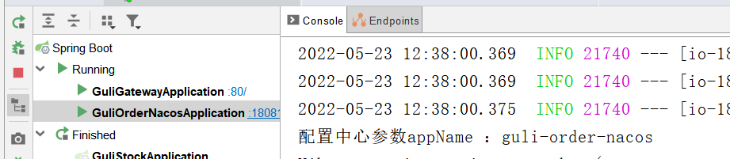

### 3.3.2 动态刷新配置

修改配置中心配置信息：将order.app.name值改为guli-order-naocs2,并发布配置

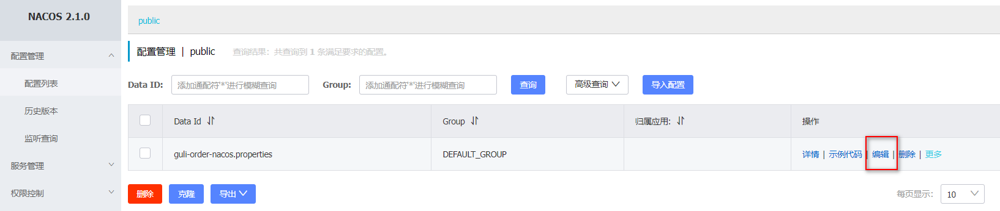

如果不重启订单服务，不能加载最新的配置。

在使用配置中心配置的类名上添加注解：@RefreshScope

```java
@RefreshScope
public class OrderController{ ... }
```

重新测试配置的动态加载...

### 3.3.3 多环境配置文件加载

nacos配置中心加载默认配置时还会使用开发中不同的环境去加载

订单服务application中添加环境配置：

```yaml
#spring:
  profiles:
    active: dev
```

重启订单服务，可以看到默认加载的配置文件如下：


参考3.3.2 在配置中心创建guli-order-nacos-dev.properties 编写配置测试加载。


### 3.3.4 多配置文件加载

除了默认的配置外，也可以自定义要加载的文件名。

#### 1、创建redis配置

**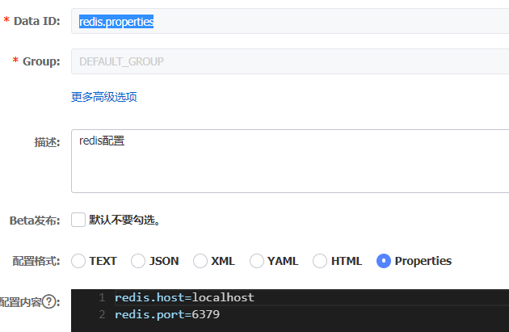**

#### 2、订单服务加载redis配置

不是默认的配置文件，需要创建bootstrap.yml/properties文件，编写要加载的配置文件信息

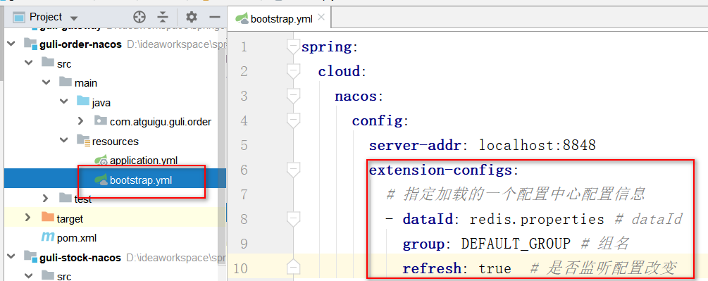

```yaml
spring:
  cloud:
    nacos:
      config:
        server-addr: localhost:8848
        extension-configs:
          # 指定加载的一个配置中心配置信息
          - dataId: redis.properties # dataId
            group: DEFAULT_GROUP # 组名
            refresh: true  # 是否监听配置改变
```

使用配置：

```java
@RestController
@RefreshScope
@RequestMapping("/order")
public class OrderController {
    @Autowired
    OrderService orderService;
    @Value("${order.app.name}")
    String appName;
    @Value("${redis.host}")
    String redisHost;
    @Value("${redis.port}")
    Integer redisPort;
    @GetMapping("{userId}/{productId}/{count}")
    public Boolean createOrder(@PathVariable("userId")String userId,
                               @PathVariable("productId")String productId,
                               @PathVariable("count")Integer count){
        System.out.println("配置中心参数appName ：" + appName);
        System.out.println("配置中心redis参数：host = "+ redisHost+" , port = "+ redisPort);
        return orderService.saveOrder(userId,productId,count);
    }
}
```

### 3.3.5 配置分组

在实际开发中，除了不同的环境外。不同的微服务或者业务功能，可能有不同的redis及mysql数据库。区分不同的环境我们使用名称空间（namespace），区分不同的微服务或功能，使用分组（group）。

当然，你也可以反过来使用，名称空间和分组只是为了更好的区分配置，提供的两个维度而已。

新增一个redis.properties，所属分组为ORDER_GROUP

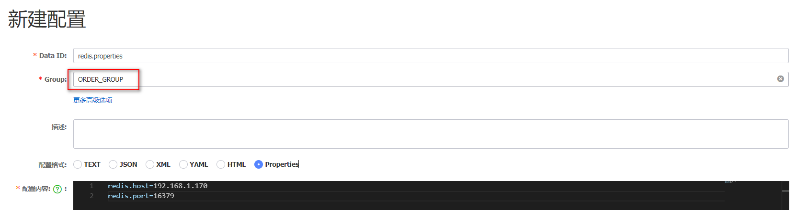

订单服务bootstrap配置中指定加载的redis配置分组：

```yaml
spring:
  cloud:
    nacos:
      config:
        server-addr: localhost:8848
        extension-configs:
          # 指定加载的一个配置中心配置信息
          - dataId: redis.properties # dataId
            group: ORDER_GROUP # 组名
            refresh: true  # 是否监听配置改变
```

### 3.3.6 指定名称空间加载配置

在实际开发中，通常有多套不同的环境（默认只有public），那么这个时候可以根据指定的环境来创建不同的 namespce，例如，开发、测试和生产三个不同的环境，那么使用一套 nacos 集群可以分别建以下三个不同的 namespace。以此来实现多环境的隔离。

#### 1、创建名称空间

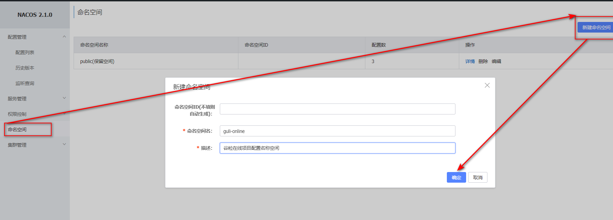

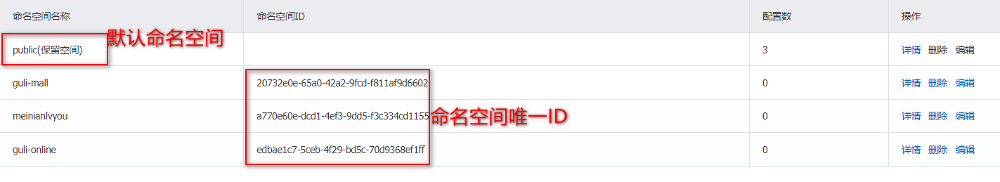

#### 2、克隆配置到guli-online命名空间

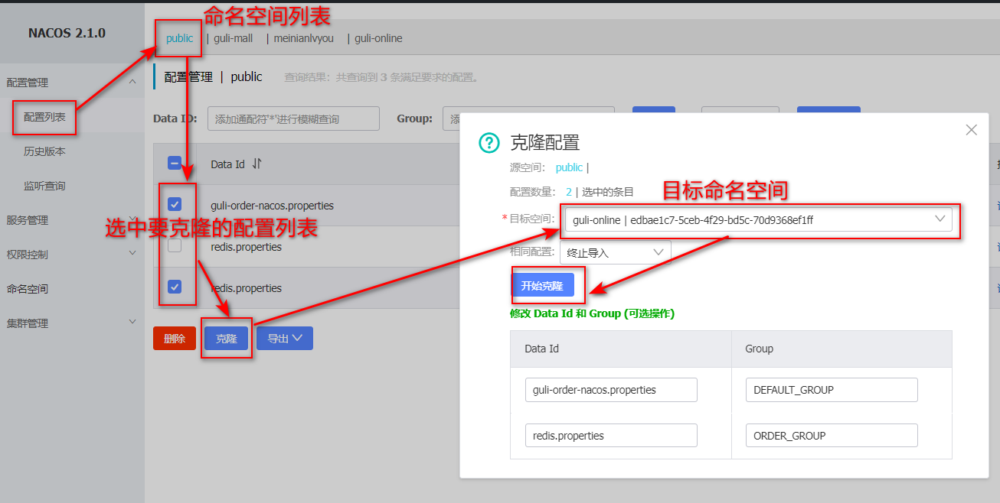

查看克隆以后的guli-online配置中心配置列表：

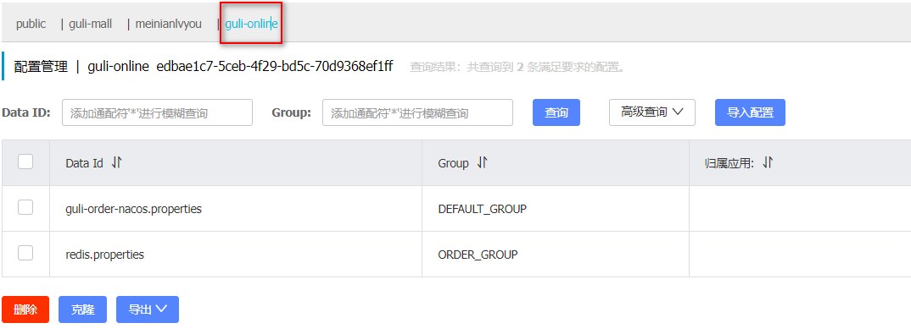

#### 3、订单服务切换加载配置的命名空间

在订单服务的bootstrap.yml中添加配置：spring.cloud.nacos.config.namespace并指定值为要加载配置的命名空间id

```yaml
spring:
  cloud:
    nacos:
      config:
        server-addr: localhost:8848
        namespace: edbae1c7-5ceb-4f29-bd5c-70d9368ef1ff   # guli-online命名空间ID
        extension-configs:
          # 指定加载的一个配置中心配置信息
          - dataId: redis.properties # dataId
            group: ORDER_GROUP # 组名
            refresh: true  # 是否监听配置改变
```

修改配置重启测试是否加载成功。

### 3.3.7 配置回滚

nacos还会保存配置修改的历史记录以防止误操作之后的回滚。

#### 1、查看历史版本

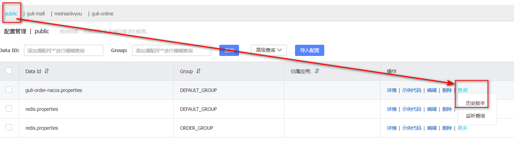

#### 2、回滚

点击详情可以查看配置信息，点击回滚确认后可以回滚成功。

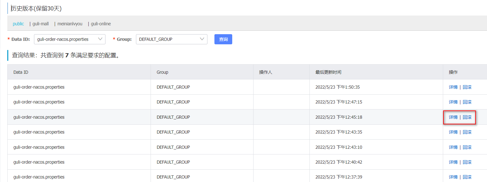


测试，略....

## 3.3 小结

配置中心将配置从各个应用中剥离出来，自成一体，对所有的配置进行单独的统一管理，优雅的解决了日志管理的诸多问题。在系统架构中，和安全、日志、监控等非功能需求一样，配置管理也是一种非功能需求。配置中心是整个微服务基础架构体系中的一个组件。总得来说，配置中心就是一种统一管理各种应用配置的基础服务组件。

# 4、Sentinel实现熔断与限流

## 4.1 简介

### 4.1.1 背景和作用

官网：https://sentinelguard.io/zh-cn/docs/introduction.html

随着微服务的流行，服务和服务之间的稳定性变得越来越重要。在大规模微服务架构的场景下，避免服务出现雪崩，要减少停机时间，要尽可能的提高服务可用性。限流和降级是一个非常重要的手段，具体实施方法可以归纳为八字箴言，分别是限流，降级，熔断和隔离。Sentinel 以流量为切入点，从流量控制、熔断降级、系统负载保护等多个维度保护服务的稳定性。

Sentinel 具有以下特征:

· 丰富的应用场景：Sentinel 承接了阿里巴巴近 10 年的双十一大促流量的核心场景，例如秒杀（即突发流量控制在系统容量可以承受的范围）、消息削峰填谷、集群流量控制、实时熔断下游不可用应用等。

· 完备的实时监控：Sentinel 同时提供实时的监控功能。您可以在控制台中看到接入应用的单台机器秒级数据，甚至 500 台以下规模的集群的汇总运行情况。

· 广泛的开源生态：Sentinel 提供开箱即用的与其它开源框架/库的整合模块，例如与 Spring Cloud、Dubbo、gRPC 的整合。您只需要引入相应的依赖并进行简单的配置即可快速地接入 Sentinel。

· 完善的 SPI 扩展点：Sentinel 提供简单易用、完善的 SPI 扩展接口。您可以通过实现扩展接口来快速地定制逻辑。例如定制规则管理、适配动态数据源等。

Sentinel 目前已经针对 Servlet、Dubbo、Spring Boot/Spring Cloud、gRPC 等进行了适配，用户只需引入相应依赖并进行简单配置即可非常方便地享受 Sentinel 的高可用流量防护能力。

### 4.1.2 Sentinel与Hystrix的区别

>  Hystrix常用的线程池隔离会造成线程上下切换的overhead比较大；

>  Hystrix使用的信号量隔离对某个资源调用的并发数进行控制，效果不错，但是无法对慢调用进行自动降级；

> Sentinel通过并发线程数的流量控制提供信号量隔离的功能；

>  Sentinel支持的熔断降级维度更多，可对多种指标进行流控、熔断，且提供了实时监控和控制面板，功能更为强大。

|                | Sentinel                                       | Hystrix                 |
| -------------- | ---------------------------------------------- | ----------------------- |
| 隔离策略       | 信号量隔离                                     | 线程池隔离/信号量隔离   |
| 熔断降级策略   | 基于响应时间或失败比率                         | 基于失败比率            |
| 实时指标实现   | 滑动窗口                                       | 滑动窗口（基于 RxJava） |
| 规则配置       | 支持多种数据源                                 | 支持多种数据源          |
| 扩展性         | 多个扩展点                                     | 插件的形式              |
| 基于注解的支持 | 支持                                           | 支持                    |
| 限流           | 基于 QPS，支持基于调用关系的限流               | 不支持                  |
| 流量整形       | 支持慢启动、匀速器模式                         | 不支持                  |
| 系统负载保护   | 支持                                           | 不支持                  |
| 控制台         | 开箱即用，可配置规则、查看秒级监控、机器发现等 | 不完善                  |
| 常见框架的适配 | Servlet、Spring Cloud、Dubbo、gRPC 等          | Servlet、Netflix        |


## 4.2 Sentinel控制台下载启动

下载地址：https://github.com/alibaba/Sentinel/releases

启动：

打开sentinel所在目录的dos命令窗口

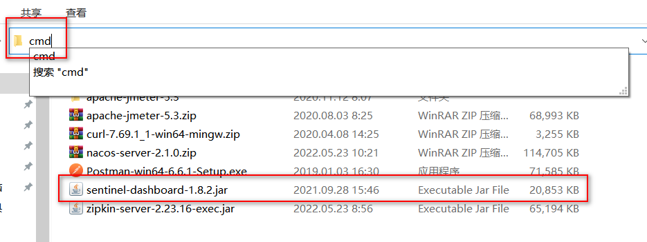

启动sentinel控制台:  java -jar  sentinel-dashboard-1.8.2.jar

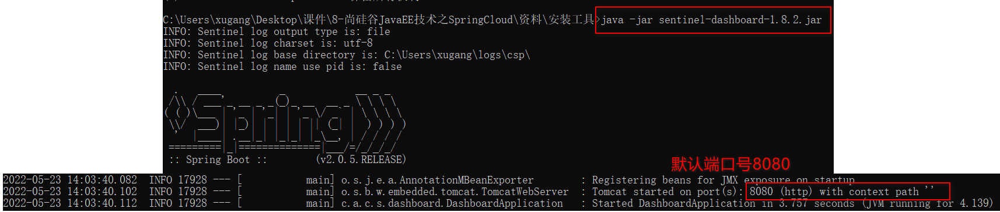

访问控制台：localhost:8080

默认账号/密码： sentinel

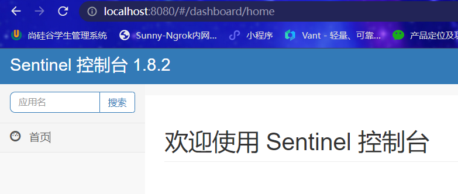


## 4.3 订单服务整合Sentinel

### 4.3.1 引入依赖

guli-order-nacos服务pom中引入依赖

```xml
<dependency>
    <groupId>com.alibaba.cloud</groupId>
    <artifactId>spring-cloud-starter-alibaba-sentinel</artifactId>
    <version>2.2.3.RELEASE</version>
</dependency>
```

### 4.3.2 配置

guli-order-nacos application中添加sentinel配置

```yaml
#spring:
#  cloud:
    sentinel:
      transport:
        port: 8719 # 数据传输端口号
        dashboard: localhost:8080 # sentinel控制台地址
      eager: true # 主动注册到sentinel控制台
      filter:
        url-patterns: /** # sentinel过滤的地址
```

### 4.3.3 测试

重启订单服务查看sentinel控制台，可以查看到成功注册的sentinel客户端

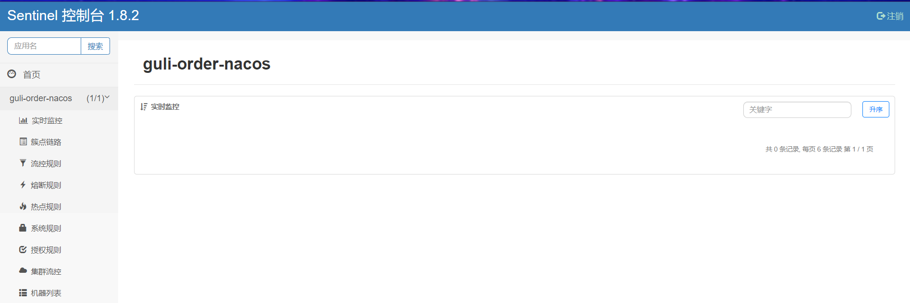


## 4.4 Sentinel流量控制

### 4.4.1 简介

Sentinel 支持以下几种规则：**流量控制规则**、**熔断降级规则**、**系统保护规则**、**来源访问控制规则** 和 **热点参数规则**。其中流量控制规则可以**基于QPS/并发数**或者**基于调用关系**对一个服务的流量进行控制

流量控制规则 (FlowRule)，重要属性：

|      Field      | 说明                                                         | 默认值                        |
| :-------------: | :----------------------------------------------------------- | :---------------------------- |
|    resource     | 资源名，资源名是限流规则的作用对象                           |                               |
|      count      | 限流阈值                                                     |                               |
|      grade      | 限流阈值类型，QPS 或线程数模式                               | QPS 模式                      |
|    limitApp     | 流控针对的调用来源                                           | `default`，代表不区分调用来源 |
|    strategy     | 调用关系限流策略：直接、链路、关联                           | 根据资源本身（直接）          |
| controlBehavior | 流控效果（直接拒绝 / 排队等待 / 慢启动模式），不支持按调用关系限流 | 直接拒绝                      |

同一个资源可以同时有多个限流规则。

**注意：流控规则默认保存在服务的运行内存中，重启服务流控规则需要重新配置**

### 4.4.2 基于QPS/并发数的流量控制

流量控制主要有两种统计类型，一种是统计线程数，另外一种则是统计 QPS。

#### 1、并发线程数流量控制

线程数限流用于保护业务线程数不被耗尽。例如，当应用所依赖的下游应用由于某种原因导致服务不稳定、响应延迟增加。这种隔离方案虽然能够控制线程数量，但无法控制请求排队时间，直接拒绝能够迅速降低系统压力。Sentinel线程数限流不负责创建和管理线程池，而是简单统计当前请求上下文的线程个数，如果超出阈值，新的请求会被立即拒绝。

在sentinel控制台新增流控规则：


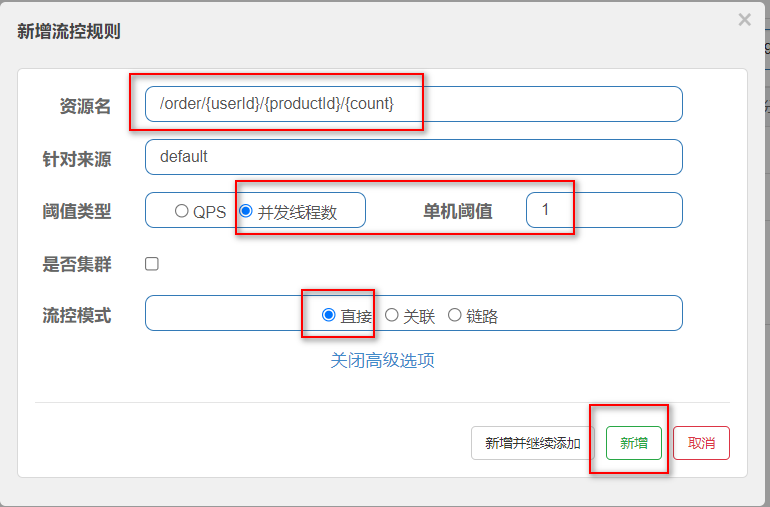

使用jmeter创建线程组并发访问创建订单接口。

浏览器同时直接访问创建订单接口，会出现限流后直接失败的页面：


在sentinel控制台实时监控也可以看到并发的请求被拒绝的数量(拒绝QPS)

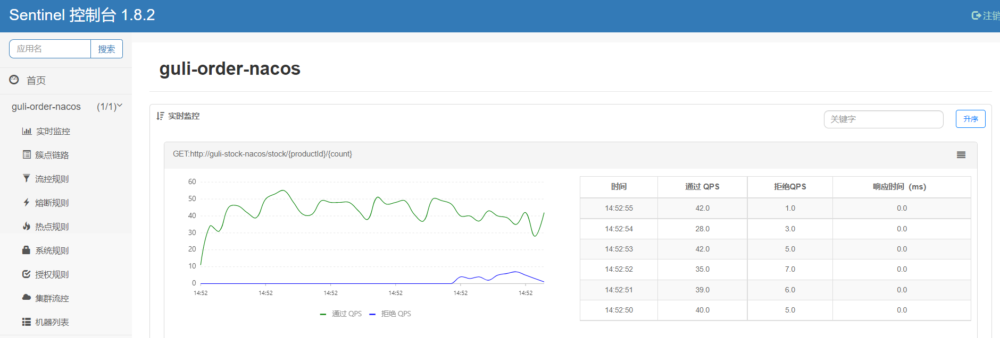

#### 2、QPS流量控制

当 QPS 超过某个阈值的时候，则采取措施进行流量控制。流量控制的手段包括下面 3 种，对应 `FlowRule` 中的 `controlBehavior` 字段：

- 直接拒绝方式。该方式是默认的流量控制方式，当QPS超过任意规则的阈值后，新的请求就会被立即拒绝。

  > 删除之前的流控规则，创建QPS流控规则，流控效果为快速失败

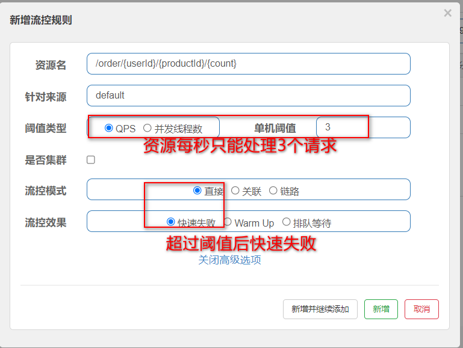

​	测试：以上配置手速较快的同学可以在浏览器快速刷新访问一秒钟超过3次请求则会进入流控页面。无需借助Jmeter测试


- 冷启动方式。该方式主要用于系统长期处于低水位的情况下，当流量突然增加时，直接把系统拉升到高水位可能瞬间把系统压垮。通过"冷启动"，让通过的流量缓慢增加，在一定时间内逐渐增加到阈值上限，给冷系统一个预热的时间，避免冷系统被压垮的情况。

  

  >删除之前的流控规则，创建QPS流控规则，流控效果为WarmUp

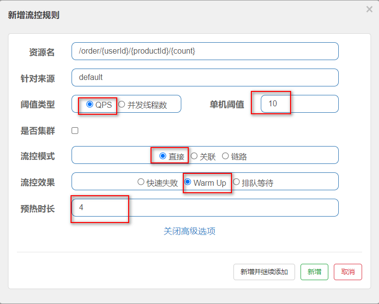

​	默认低水位QPS为 QPS阈值/冷加载因子(3) ，经过预热时长后才达到阈值，上面的配置低水位为 10/3也就是默认QPS为3，请求较多时，QPS4秒后会达到10

​	测试：手速快的同学又可以表现了，在浏览器地址栏访问创建订单接口，疯狂刷新访问，第一秒第四次请求会返回失败页面，到第四秒以后，基本不会出现失败页面。

​	jmeter并发测试，等到稳定时，QPS基本在10左右

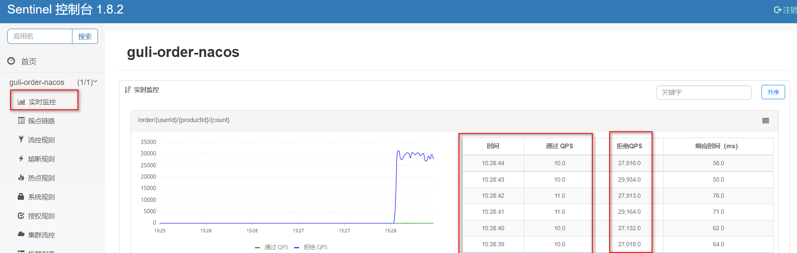


- 匀速器方式。这种方式严格控制了请求通过的间隔时间，也即是让请求以均匀的速度通过，对应的是漏桶算法。

  >订单服务创建订单接口中输出时间毫秒数重启，然后创建匀速器流控规则

  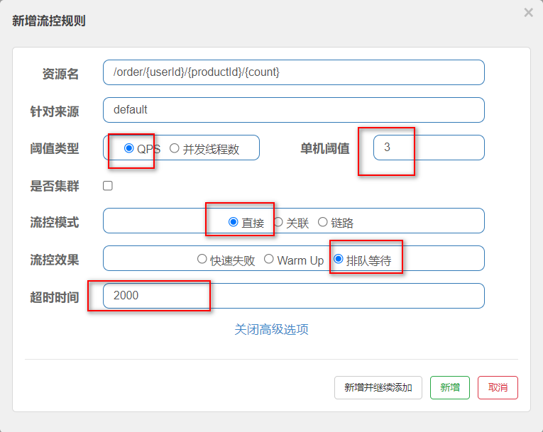

  以上规则：每秒可以通过3个请求，超过的请求排队等待，等待超过2000毫秒则超时返回失败页面

  测试：使用jmeter或者手动测试。

  

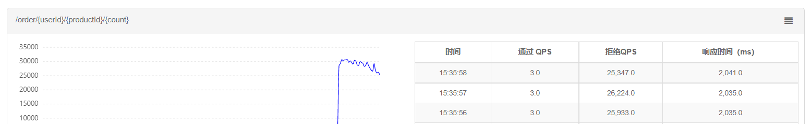

### 4.4.3 基于调用关系的流量控制

当关联的资源达到阈值时，就限流自己。例如A关联B，访问B达到阈值后，就限流A。

应用场景：两个接口使用共享资源时，进行流量限制

#### 1、订单服务创建新接口

关联的两个资源不需要有依赖或者调用关系

```java
@GetMapping("/test")
public String test(){
    return "test";
}
```

**重启订单服务**

#### 2、创建关联关系流控规则

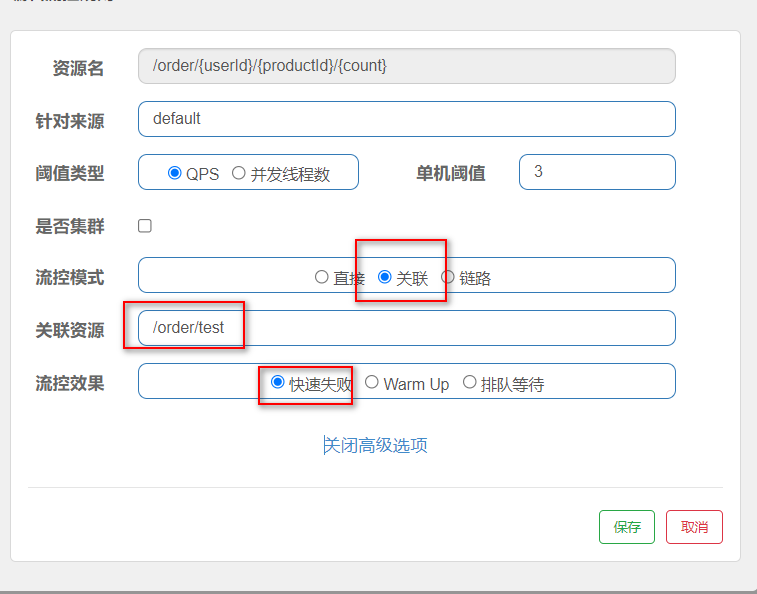

以上配置，如果访问/order/test资源的QPS超过3个，则对/order/{userId}/{productId}/{count}资源的访问进行限流，快速返回失败页面。

测试：

- 先在jmeter中通过线程组并发访问/order/test接口

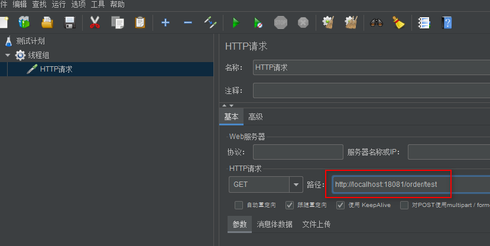

- 在浏览器中访问创建订单接口：http://localhost:18081/order/9527/1001/1 出现限流页面代表限流成功


## 4.5 Sentinel熔断降级

除了流量控制以外，对调用链路中不稳定的资源进行熔断降级也是保障高可用的重要措施之一。一个服务常常会调用别的模块，可能是另外的一个远程服务、数据库，或者第三方 API 等。例如，支付的时候，可能需要远程调用银联提供的 API；查询某个商品的价格，可能需要进行数据库查询。然而，这个被依赖服务的稳定性是不能保证的。如果依赖的服务出现了不稳定的情况，请求的响应时间变长，那么调用服务的方法的响应时间也会变长，线程会产生堆积，最终可能耗尽业务自身的线程池，服务本身也变得不可用。

### 4.5.1 调用下游服务熔断降级

#### 4.5.1.1 订单服务application配置

```yaml
feign:
  sentinel: # 启用sentinel对feign客户端的代理
    enabled: true
```

#### 4.5.1.2 编写Feign客户端的降级方案

```java
@Component
public class GuliStockNacosClientFallback implements GuliStockNacosClient{
    @Override
    public Boolean updateStock(String productId, Integer count) {
        System.out.println("远程访问失败，使用降级方案处理.");
        return false;
    }
}
```

#### 4.5.1.3 Feign客户端绑定降级方案

```java
@FeignClient(value = "guli-stock-nacos" , fallback = GuliStockNacosClientFallback.class)
public interface GuliStockNacosClient {
    @GetMapping("/stock/{productId}/{count}")
    public Boolean updateStock(@PathVariable("productId")String productId ,
                               @PathVariable("count") Integer count);

}
```

#### 4.5.1.4 测试

关闭库存服务，重启订单服务，访问订单服务创建订单接口测试：http://localhost:18081/order/9527/1001/1

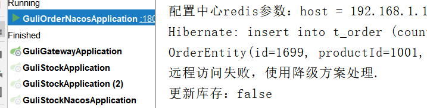

启动库存服务，访问创建订单接口时，不会使用降级方案处理。

### 4.5.2 不稳定资源的熔断降级

Sentinel 提供以下几种熔断策略：

**RT(平均响应时间,秒级)**

​		平均响应时间 (DEGRADE_GRADE_RT)：**超过阈值 且时间窗口内的请求>=5**，两个条件同时满足后触发降级，窗口期过后关闭断路器

​		RT 最大4900 ms，更大的需要通过启动配置项 -Dcsp.sentinel.statistic.max.rt=xxx 来配置。

**异常比例（秒级）**

​		QPS>=5且异常比例（秒级统计）超过阈值时，触发降级；时间窗口结束后，关闭降级

**异常数（分钟级）**

​		异常数（分钟统计）超过阈值时，触发降级；时间窗口结束后，关闭降级

Sentinel熔断降级会在调用链路中某个资源出现不稳定状态时（例如：调用超时或异常比例升高），对这个资源的调用进行限制，让请求快速失败，避免影响到其他的资源而导致级联错误。

当资源被降级后，在接下来的降级时间窗口之内，对该资源的调用都自动熔断（默认行为是抛出DegradeException）。

Sentinel的断路器是没有半开状态的,没有异常就关闭断路器恢复使用，有异常则继续打开断路器不可用。(对比Hystrix)

#### 4.5.2.1 平均响应时间

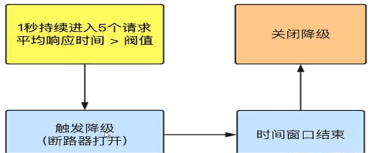


在订单服务的test接口中添加休眠代码，并重启订单服务。

```java
@GetMapping("/test")
public String test(){
    try {
        Thread.sleep(1000);
    } catch (InterruptedException e) {
        e.printStackTrace();
    }
    return "test";
}
```

sentinel控制台添加平均响应时间流控规则

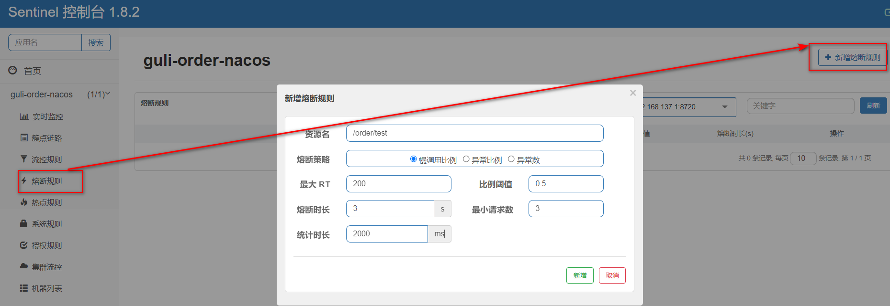

​	以上规则表示：访问/order/test资源，统计时长1秒内超过3个请求时，统计他们的平均响应时间，如果比例达到50%，则熔断3秒，时间窗口内所有请求都会返回默认流控页面。

​	测试：

		> 直接访问/order/test 是可以访问的。
		>
		> 使用jmeter并发访问/order/test，此时浏览器访问/order/test会直接返回失败，因为进入熔断状态了。

#### 4.5.2.2 异常比例

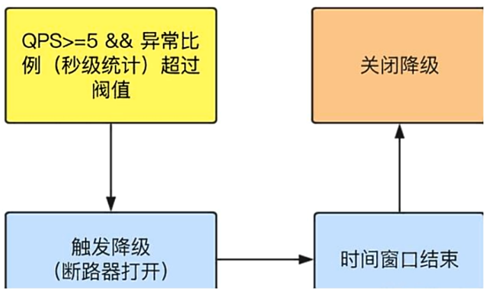

订单服务修改test接口并重启：

```java
@GetMapping("/test")
public String test(){
    int a = 1/0;
    return "test";
}
```

sentinel控制台创建异常比例熔断规则：

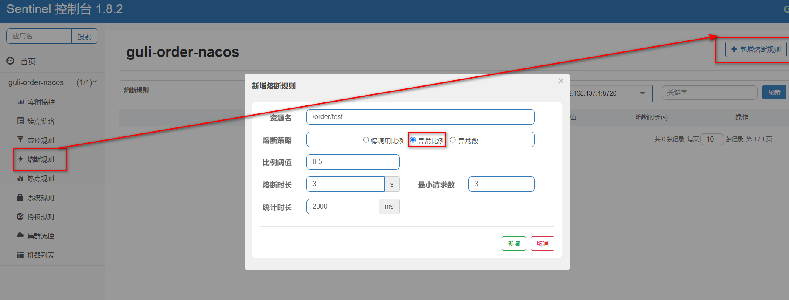

以上规则表示：在2秒内请求达到三个时，如果异常比例超过一半，熔断3秒钟，此时新的请求直接返回默认降级页面。

测试：浏览器中直接访问http://localhost:18081/order/test  连续访问测试

#### 4.5.2.3 异常数

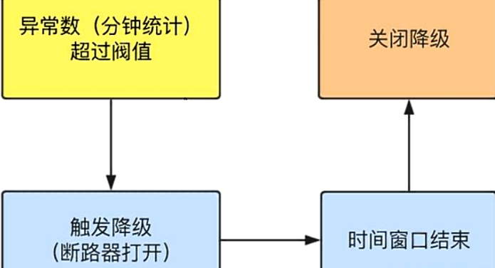

删除之前的熔断规则

创建异常数熔断规则

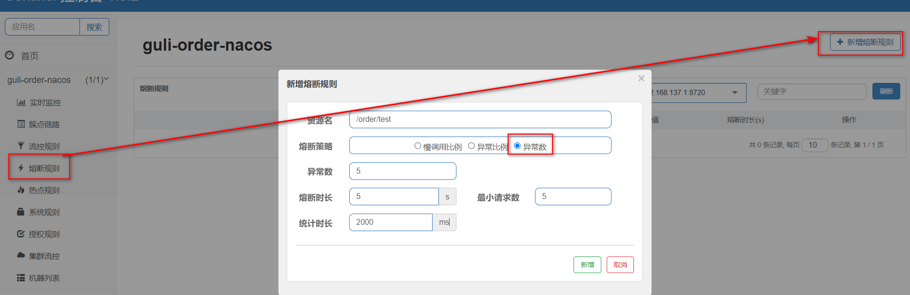

以上规则表示：2秒内达到五个请求时，如果异常数>=5个，熔断5秒(注意：1.8以前版本的sentinel，熔断时长必须超过60秒)

测试：访问订单服务 http://localhost:18081/order/test，观察慢慢访问和快速连续访问的区别。


## 4.6 热点参数限流

何为热点？热点即经常访问的数据。很多时候我们希望统计某个热点数据中访问频次最高的 Top K 数据，并对其访问进行限制。比如：

- 商品 ID 为参数，统计一段时间内最常购买的商品 ID 并进行限制
- 用户 ID 为参数，针对一段时间内频繁访问的用户 ID 进行限制

热点参数限流会统计传入参数中的热点参数，并根据配置的限流阈值与模式，对包含热点参数的资源调用进行限流。热点参数限流可以看做是一种特殊的流量控制，仅对包含热点参数的资源调用生效。

Sentinel 利用 LRU 策略统计最近最常访问的热点参数，结合令牌桶算法来进行参数级别的流控。

### 4.6.1 订单服务热点key测试方法

修改订单服务/order/test资源，接收两个参数pid和count,并且使用@SentinelResource注解指定资源名(热点参数必须通过注解配置的资源名来处理)

```java
@GetMapping("/test")
@SentinelResource(value = "testResource")
public String test(@RequestParam(value = "pid",required = false)String pid,
                   @RequestParam(value = "count",required = false)String count){
    System.out.println("购买商品的id为："+pid+" , 数量："+count);
    return "test";
}
```

重启订单服务

### 4.6.2 sentinel控制台添加热点参数规则

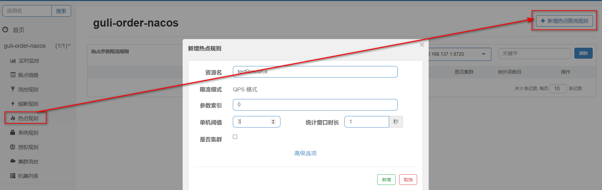

以上规则表示：携带第一个参数时(参数索引为0)访问资源testResource时，1秒内QPS超过3个的请求会抛出ParamFlowException，由于代码中每处理所以返回500页面。

### 4.6.3 测试

测试：浏览器连续快速访问 http://localhost:18081/order/test?pid=1

控制台可以看到以下异常。

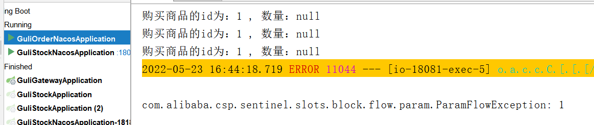

如果访问：http://localhost:18081/order/test?count=1 则没有异常

### 4.6.4 通过@SentinelResource返回兜底数据

@SentinelResource注解：

​		blockHandlerClass：兜底方法所在类

​		blockHandler：指定兜底方法，因为是使用类名.方法名调用的，所以必须是静态方法。必须接收异常处理

```java
@GetMapping("/test")
@SentinelResource(value = "testResource",blockHandler = "deadTest" , blockHandlerClass = OrderController.class)
public String test(@RequestParam(value = "pid",required = false)String pid,
                   @RequestParam(value = "count",required = false)String count){
    System.out.println("购买商品的id为："+pid+" , 数量："+count);
    return "test";
}
//也可以将熔断降级的自定义方法抽取到单独的一个类中，此处省略....
public static String deadTest(String pid, String count, BlockException blockException){
    System.out.println("deadTest---购买商品的id为："+pid+" , 数量："+count+" , 异常： "+ blockException);
    return "dead_test";
}
```

​		

重启服务

按照4.6.2重新配置热点参数规则

测试：浏览器连续快速访问 http://localhost:18081/order/test?pid=1

​	idea控制台：

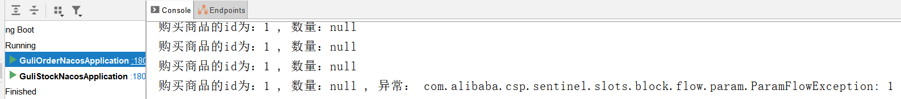

​	浏览器接收到的兜底数据

****

### 4.6.5 热点参数配置例外项

sentinel控制台修改之前的热点规则： 按照下图添加参数例外项(一定要点添加)

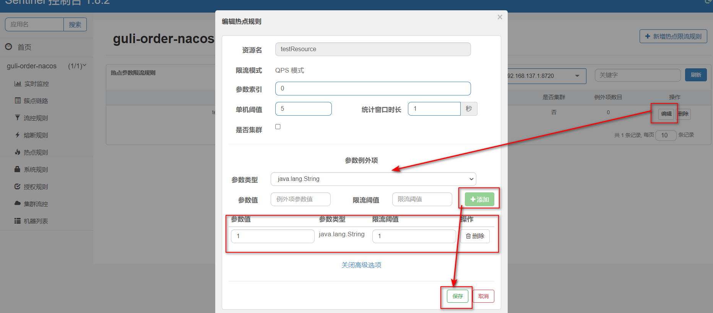

浏览器快速连续访问测试：

​	http://localhost:18081/order/test?pid=1

​	http://localhost:18081/order/test?pid=2

​	观察结果：

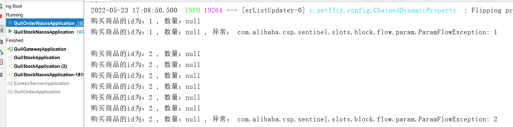

## 4.7 规则持久化

上述 方法只接受内存态的规则对象，但更多时候规则存储在文件、数据库或者配置中心当中。`DataSource` 接口给我们提供了对接任意配置源的能力。相比直接通过 API 修改规则，实现 `DataSource` 接口是更加可靠的做法。

我们推荐**通过控制台设置规则后将规则推送到统一的规则中心，客户端实现** `ReadableDataSource` **接口端监听规则中心实时获取变更**，流程如下：


### 4.7.1 、nacos配置中心创建流控规则配置

​	配置字段说明：


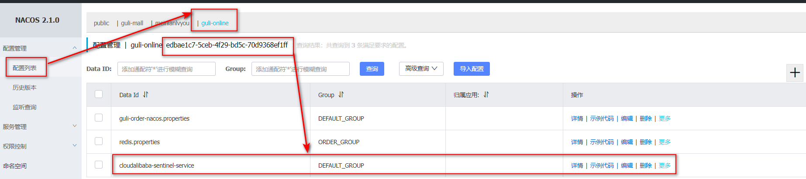

```json
[
    {
        "resource": "/retaLimit/byUrl",
        "limitApp": "default",
        "grade":   1,
        "count":   1,
        "strategy": 0,
        "controlBehavior": 0,
        "clusterMode": false    
    }
]
```


### 4.7.2、订单服务引入依赖

```xml
<dependency>
    <groupId>com.alibaba.csp</groupId>
    <artifactId>sentinel-datasource-nacos</artifactId>
    <version>1.8.1</version>
</dependency>
```

### 4.7.3、订单服务application添加配置

sentinel从nacos注册中心加载持久化规则的配置

```yaml
#spring:
#  cloud:
    sentinel:
      datasource:
        ds1:
          nacos:
            server-addr: localhost:8848
            dataId: cloudalibaba-sentinel-service
            namespace: edbae1c7-5ceb-4f29-bd5c-70d9368ef1ff
            groupId: DEFAULT_GROUP
            data-type: json
            rule-type: flow
```

### 4.7.4、测试

重启订单服务，刷新sentinel控制台可以看到持久化的流控规则