# 尚硅谷JavaEE技术之分布式事务

# 准备:

​	参考《**docker安装mysql8**》安装mysql8，**已经安装过的mysql8的可以忽略**

# 1. 本地事务回顾

## 1.1 什么是事务

**提供一种"要么什么都不做，要么做全套（All or Nothing）"机制。**

**基于单个服务单一数据库资源访问的事务，被称为本地事务(Local Transaction)**。

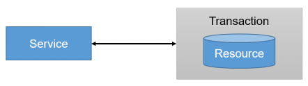

## 1.2 事务的作用

**保证数据一致性**

## 1.3 事务ACID四大特性

**A：原子性(Atomicity)**

“原子”的本意是“**不可再分**”，事务的原子性表现为一个事务中涉及到的多个操作在逻辑上缺一不可。事务的原子性要求事务中的所有操作要么都执行，要么都不执行。

**C：一致性(Consistency)**

“一致”指的是数据的一致，具体是指：所有数据都处于满足业务规则的一致性状态。一致性原则要求：一个事务中不管涉及到多少个操作，都必须保证**事务执行之前**数据是正确的，**事务执行之后**数据仍然是正确的。如果一个事务在执行的过程中，其中某一个或某几个操作失败了，则必须将其他所有操作撤销，将数据恢复到事务执行之前的状态，这就是回滚。

**I：隔离性(Isolation)**

在应用程序实际运行过程中，事务往往是并发执行的，所以很有可能有许多事务同时处理相同的数据，因此每个事务都应该与其他事务隔离开来，防止数据损坏。隔离性原则要求多个事务在**并发执行过程中不会互相干扰**。

**D：持久性(Durability)**

持久性原则要求事务执行完成后，对数据的修改永久的保存下来，不会因各种系统错误或其他意外情况而受到影响。通常情况下，事务对数据的修改应该被写入到**持久化存储器**中。

## 1.4 事务的并发问题

**脏读：** 一个事务可以读取另一个事务未提交的数据

事务A读取了事务B更新的数据，事务B未提交并回滚数据，那么A读取到的数据是脏数据

**不可重复读：**一个事务可以读取另一个事务已提交的数据  单条记录前后不匹配

事务 A 多次读取同一数据，事务 B 在事务A多次读取的过程中，对数据作了更新并提交，导致事务A多次读取同一数据时，结果 不一致。

**幻读(虚读)：** 一个事务可以读取另一个事务已提交的数据  读取的数据前后多了点或者少了点

系统管理员A将数据库中所有学生的成绩从具体分数改为ABCDE等级，但是系统管理员B就在这个时候插入了一条具体分数的记录，当系统管理员A更改结束后发现还有一条记录没有改过来，就好像发生了幻觉一样，这就叫幻读。

　　小结：不可重复读的和幻读很容易混淆，不可重复读侧重于修改，幻读侧重于新增或删除。解决不可重复读的问题只需锁住满足条件的行，解决幻读需要锁表。

## 1.5 MySQL事务隔离级别

| 事务隔离级别                 | 脏读 | 不可重复读 | 幻读 |
| ---------------------------- | ---- | ---------- | ---- |
| 读未提交（read-uncommitted） | √    | √          | √    |
| 读已提交（read-committed）   | ×    | √          | √    |
| 可重复读（repeatable-read）  | ×    | ×          | √    |
| 串行化（serializable）       | ×    | ×          | ×    |

隔离级别越高，性能越低。

一般情况下：脏读是不可允许的，不可重复读和幻读是可以被适当允许的。mysql默认的事务隔离级别为repeatable-read

****

## 1.6 事务相关命令(了解)

了解：mysql系统变量

```mysql
#查看mysql所有的[全局|会话]系统变量
SHOW [GLOBAL|SESSION] VARIABLES;
#模糊查询[全局|会话]系统变量
show [GLOBAL|SESSION] variables like '变量名';
#查看全局系统变量
SELECT @@变量名;
```

查看本次会话事务隔离级别：

```mysql
# mysql5.7
SELECT @@session.tx_isolation;
# mysql8
select @@transaction_isolation;
```

**设置当前会话事务隔离级别：**

```mysql
set session transaction isolation level read committed;
```

**查看当前会话事务隔离级别：**

```mysql
# mysql5.7
SELECT @@session.tx_isolation;
# mysql8
select @@transaction_isolation;
```

查看mysql默认自动提交状态：

```mysql
select @@autocommit
```

设置mysql默认自动提交状态：

```mysql
set autocommit = 0; -- 【不自动提交】
```

开启一个事务：

```mysql
start transaction;
```

**提交事务：**

```mysql
commit
```

**回滚事务：**

```mysql
rollback
```

在事务中创建一个保存点：

```mysql
savepoint tx1
```

回滚到保存点：

```mysql
rollback to tx1
```

## 1.7 事务传播行为（propagation behavior）

指的就是当一个事务方法被另一个事务方法调用时，这个事务方法应该如何进行。 
例如：methodA事务方法调用methodB事务方法时，methodB是继续在调用者methodA的事务中运行呢，还是为自己开启一个新事务运行，这就是由methodB的事务传播行为决定的。

Spring定义了七种传播行为：参考 TransactionDefinition类


| **事务传播行为类型** | **说明**                                                     |
| -------------------- | ------------------------------------------------------------ |
| REQUIRED             | 支持当前事务，如果不存在，就新建一个。默认                   |
| SUPPORTS             | 支持当前事务，如果不存在，就不使用事务                       |
| MANDATORY            | 支持当前事务，如果不存在，抛出异常                           |
| REQUIRES_NEW         | 如果有事务存在，挂起当前事务，创建一个新的事务               |
| NOT_SUPPORTED        | 以非事务方式执行操作，如果当前存在事务，就把事务挂起。       |
| NEVER                | 以非事务方式执行，如果当前存在事务，则抛出异常。             |
| NESTED               | 如果当前存在事务，则在嵌套事务内执行。如果当前没有事务，则执行与REQUIRED类似的操作。（外层事务抛出异常回滚，那么内层事务必须回滚，反之内层事务并不影响外层事务） |

- 依赖于JDBC3.0提供的SavePoint技术
- 删除用户 删除订单。在删除订单后，设置savePoint，执行删除用户。删除订单和删除用户在同一事务中，删除用户失败，事务回滚savePoint，由用户控制视图提交还是回滚

这七种事务传播机制最常用的就两种：

REQUIRED：一个事务，要么成功，要么失败

REQUIRES_NEW：一个业务中，两个不同事务，彼此之间没有关系。一个事务失败了不影响另一个事务

## 1.8   伪代码练习

传播行为伪代码模拟：有a,b,c,d,e等5个方法，a中调用b,c,d,e方法的传播行为在小括号中标出

```java
a(required){
	b(required);
	c(requires_new);
	d(required);
	e(requires_new);
	// a方法的业务
}
```

问题：

1. a方法的业务出现异常，会怎样？a,b,d回滚 c,e不回滚
2. d方法出现异常，会怎样？a,b,d回滚 c不回滚 ，e未执行
3. e方法出现异常，会怎样？a,b,d,e回滚 c不回滚，e方法出异常会上抛影响到上级方法
4. b方法出现异常，会怎样？a,b回滚 c,d,e未执行


**spring的事务是声明式事务，而声明式事务的本质是Spring AOP，SpringAOP的本质是动态代理。**

**事务要生效必须是代理对象在调用。**


## 1.9   回滚策略

事务很重要的另一个特征是程序出异常时，会回滚。但并不是所有的异常都会回滚。

默认情况下的回滚策略：

- 运行时异常：不受检异常，没有强制要求try-catch，都会回滚。例如：ArrayOutOfIndex，OutofMemory，NullPointException
- 编译时异常：受检异常，必须处理，要么try-catch要么throws，都不回滚。例如：FileNotFoundException


可以通过@Transactional注解的下面几个属性改变回滚策略：


rollbackFor：指定的异常必须回滚

noRollbackFor：发生指定的异常不用回滚

## 1.10   超时事务

@Transactional注解，还有一个属性是timeout超时时间，单位是秒。


timeout=3：是指第一个sql开始执行到最后一个sql结束执行之间的间隔时间。

即：超时时间（timeout）是指数据库超时，不是业务超时。

## 1.11   只读事务

@Transactional注解最后一个属性是只读事务属性


如果一个方法标记为readOnly=true事务，则代表该方法只能查询，不能增删改。readOnly默认为false


# 2. 事务练习案例

案例说明：

 	创建账户, 订单, 库存, 业务 四个服务。访问业务服务 下单接口，远程访问订单服务保存订单,远程访问库存服务减库存,远程访问账户服务修改用户账户余额同时记录日志。

## 2.1 导入数据库

将资料目录下的all_in_one.sql文件导入数据库


## 2.2 案例服务创建

先创建springboot项目：seata-demo

### 2.2.1 创建seata-demo父工程 

#### 1. pom文件

​	修改springboot版本：

```xml
<parent>
    <groupId>org.springframework.boot</groupId>
    <artifactId>spring-boot-starter-parent</artifactId>
    <version>2.3.6.RELEASE</version>
    <relativePath/> <!-- lookup parent from repository -->
</parent>
```

​	引入依赖：

```xml
<dependency>
    <groupId>org.springframework.boot</groupId>
    <artifactId>spring-boot-starter-web</artifactId>
</dependency>
<dependency>
    <groupId>mysql</groupId>
    <artifactId>mysql-connector-java</artifactId>
</dependency>
<dependency>
    <groupId>org.springframework.cloud</groupId>
    <artifactId>spring-cloud-starter-openfeign</artifactId>
    <version>2.2.6.RELEASE</version>
</dependency>
<dependency>
    <groupId>com.baomidou</groupId>
    <artifactId>mybatis-plus-boot-starter</artifactId>
    <version>3.4.3.4</version>
</dependency>
<dependency>
    <groupId>org.projectlombok</groupId>
    <artifactId>lombok</artifactId>
</dependency>
```

#### 2. 删除src目录

### 2.2.2 account-service 

在seata-demo下创建maven项目：account-service

application.yml

```yaml
server:
  port: 8111


spring:
  application:
    name: account-service
  datasource:
    driver-class-name: com.mysql.cj.jdbc.Driver
    url: jdbc:mysql://192.168.1.170:3306/db_account?useUnicode=true&characterEncoding=UTF-8&serverTimezone=Asia/Shanghai
    username: root
    password: 123456
```


#### 1、实体类

```java
@Data
@TableName(value = "account_tbl")
public class Account {
    @TableId
    private String id;
    private String userId;
    private Integer money;
}
```

```java
@Data
@TableName(value = "log_tbl")
public class Log {
    @TableId
    private String id;
    private Date gmtCreate;
    private Date gmtModified;
    private String orderId;
    private Integer money;
}
```

#### 2、Mapper

```java
public interface AccountMapper extends BaseMapper<Account> {
}
```

```java
public interface LogMapper extends BaseMapper<Log> {
}
```


#### 3、Service

```java
@Service
public class LogServiceImpl extends ServiceImpl<LogMapper, Log>{
}
```


```java
@Service
public class AccountServiceImpl extends ServiceImpl<AccountMapper,Account>{
    @Autowired
    LogServiceImpl logService;
    @Override
    public void debit(String userId, Integer money, String orderId) {
        //更新账户
        Account account = this.selectOne(new LambdaQueryWrapper<Account>()
                        .eq(Account::getUserId,userId));

        account.setMoney(account.getMoney()-money);
        this.updateById(account);
        //保存日志
        Log log = new Log();
        log.setGmtCreate(new Date());
        log.setGmtModified(new Date());
        log.setMoney(money);
        log.setOrderId(orderId);
        logService.save(log);

    }
}
```


#### 4、Controller

```java
@RestController
@RequestMapping("account")
public class AccountController {

    @Autowired
    private AccountServiceImpl accountService;

    @RequestMapping("/debit")
    public Boolean debit(String userId, Integer money , String orderId) {
        accountService.debit(userId, money,orderId);
        return true;
    }
}
```


#### 5、启动类

```java
@SpringBootApplication
@MapperScan(basePackages = "com.atguigu.account.mapper")
public class AccountApplication {
    public static void main(String[] args) {
        SpringApplication.run(AccountApplication.class,args);
    }
}
```


#### 6、启动测试

启动

访问测试: http://localhost:8111/account/debit?userId=1001&money=5&orderId=1


### 2.2.2 order-service

在seata-demo下创建maven项目：order-service

application.yml

```yaml
server:
  port: 8112

 
spring:
  application:
    name: order-service
  datasource:
    driver-class-name: com.mysql.cj.jdbc.Driver
    url: jdbc:mysql://192.168.1.170:3306/db_order?useUnicode=true&characterEncoding=UTF-8&serverTimezone=Asia/Shanghai
    username: root
    password: 123456
```


#### 1、实体类

```java
@Data
@TableName(value = "order_tbl")
public class Order {
    @TableId(type = IdType.AUTO)
    private String id;
    private String userId;
    private String commodityCode;
    private Integer money;
    private Integer count;
}
```


#### 2、Mapper

```java
public interface OrderMapper extends BaseMapper<Order> {
}
```

#### 3、Feign客户端

```java
@FeignClient(name = "account-service", url = "127.0.0.1:8111")
public interface AccountClient {

    @GetMapping("/account/debit")
    Boolean debit(@RequestParam("userId") String userId, @RequestParam("money") Integer money,
                  @RequestParam("orderId") String orderId);
}
```

#### 4、Service

```java
@Service
public class OrderServiceImpl extends ServiceImpl<OrderMapper, Order> {
    @Autowired
    AccountClient accountClient;
    public void create(String userId, String commodityCode, Integer count) {
        //创建订单保存
        Order order = new Order();
        order.setUserId(userId);
        order.setCommodityCode(commodityCode);
        order.setCount(count);
        order.setMoney(5);
        this.save(order);
        //修改用户账户余额
        accountClient.debit(userId, 5,order.getId());
    }
}
```


#### 5、Controller

```java
@RestController
@RequestMapping("order")
public class OrderController {

    @Autowired
    private OrderServiceImpl orderService;

    @GetMapping("/create")
    public Boolean create(String userId, String commodityCode, Integer count) {
        orderService.create(userId, commodityCode, count);
        return true;
    }
}
```


#### 6、启动类

```java
@SpringBootApplication
@EnableFeignClients
@MapperScan(basePackages = "com.atguigu.order.mapper")
public class OrderApplication {
    public static void main(String[] args) {
        SpringApplication.run(OrderApplication.class,args);
    }
}
```


#### 6、测试

启动服务，访问：

http://localhost:8112/order/create?userId=1001&commodityCode=2001&count=1

### 2.2.3 storage-service

在seata-demo下创建maven项目：storage-service

application.yml

```yaml
server:
  port: 8113


spring:
  application:
    name: storage-service
  datasource:
    driver-class-name: com.mysql.cj.jdbc.Driver
    url: jdbc:mysql://192.168.1.170:3306/db_storage?useUnicode=true&characterEncoding=UTF-8&serverTimezone=Asia/Shanghai
    username: root
    password: 123456
```


#### 1、实体类

```java
@Data
@TableName(value = "storage_tbl")
public class Storage {

    @TableId
    private Long id;
    private String commodityCode;
    private Integer count;
}
```


#### 2、Mapper

```java
public interface StorageMapper extends BaseMapper<Storage> {

}
```


#### 3、Service

```java
@Service
public class StorageServiceImpl extends ServiceImpl<StorageMapper, Storage> {
    public void deduct(String commodityCode, int count) {
        Storage storage = this.getOne(new LambdaQueryWrapper<Storage>().eq(Storage::getCommodityCode, commodityCode));
        storage.setCount(storage.getCount() - count);//减库存
        this.updateById(storage);
    }
}
```


#### 4、Controller

```java
@RestController
@RequestMapping("storage")
public class StorageController {

    @Autowired
    private StorageServiceImpl storageService;

    @GetMapping(path = "/deduct")
    public Boolean deduct(String commodityCode, Integer count) {
        storageService.deduct(commodityCode, count);
        return true;
    }
}
```


#### 5、启动类

```java
@SpringBootApplication
@EnableFeignClients
@MapperScan(basePackages = "com.atguigu.storage.mapper")
public class StorageApplication {
    public static void main(String[] args) {
        SpringApplication.run(StorageApplication.class,args);
    }
}
```


#### 6、测试

启动，访问：

http://localhost:8113/storage/deduct?commodityCode=2001&count=1

### 2.2.4 business-service

在seata-demo下创建maven项目：business-service

application.yml

```yaml
server:
  port: 8114

spring:
  application:
    name: business-service
```


#### 1、Feign客户端

```java
@FeignClient(name = "order-service", url = "127.0.0.1:8112")
public interface OrderFeignClient {

    @GetMapping("/order/create")
    void create(@RequestParam("userId") String userId,
                @RequestParam("commodityCode") String commodityCode,
                @RequestParam("count") Integer count);

}
```

```java
@FeignClient(name = "storage-service", url = "127.0.0.1:8113")
public interface StorageFeignClient {

    @GetMapping("/storage/deduct")
    void deduct(@RequestParam("commodityCode") String commodityCode,
                @RequestParam("count") Integer count);

}
```


#### 2、Service

```java
@Service
public class BusinessService {

    @Autowired
    private StorageFeignClient storageFeignClient;
    @Autowired
    private OrderFeignClient orderFeignClient;

    /**
     * 减库存，下订单
     *
     * @param userId
     * @param commodityCode
     * @param orderCount
     */
    public void purchase(String userId, String commodityCode, int orderCount) {
        storageFeignClient.deduct(commodityCode, orderCount);

        orderFeignClient.create(userId, commodityCode, orderCount);
    }
}
```


#### 3、Controller

```java
@RestController
@RequestMapping("business")
public class BusinessController {

    @Autowired
    private BusinessService businessService;
    /**
     * 模拟购买下单
     */
    @RequestMapping("/purchase")
    public Boolean purchaseCommit() {
        businessService.purchase("1001", "2001", 1);
        return true;
    }
}
```


#### 4、启动类

```java
@SpringBootApplication(exclude = DataSourceAutoConfiguration.class)
@EnableFeignClients
public class BusinessApplication {
    public static void main(String[] args) {
        SpringApplication.run(BusinessApplication.class, args);
    }
}
```


#### 5、测试

启动，访问：

http://localhost:8114/business/purchase

## 2.3 本地事务测试

使用account服务测试本地事务：

### 2.3.1 制造异常

更新账户后保存日志之前制造异常

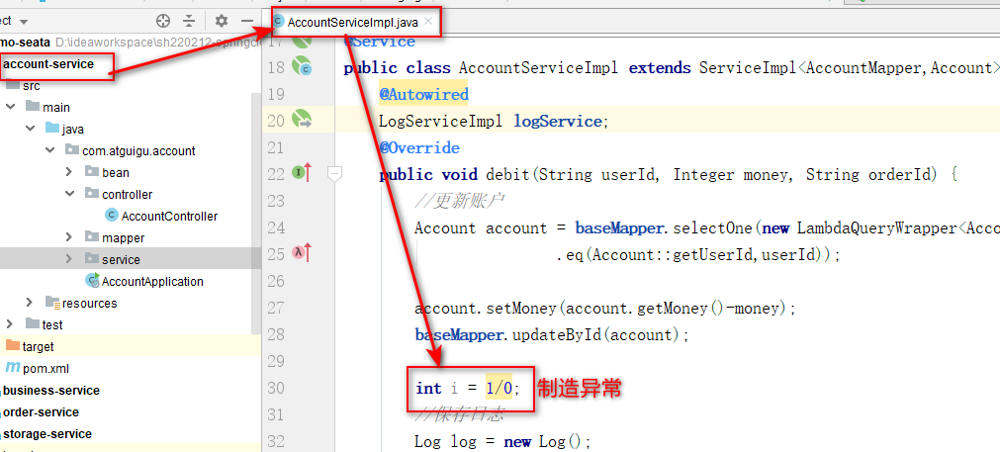

### 2.3.2 测试

重启服务，访问测试： http://localhost:8111/account/debit?userId=1001&money=5&orderId=1

此时用户账户余额减少，但是日志保存失败

### 2.3.3 添加本地事务管理

启动类上添加注解：@EnableTransactionManagement


业务方法上添加注解：@Transactional


### 2.3.4 测试本地事务管理

重启服务，访问测试： http://localhost:8111/account/debit?userId=1001&money=5&orderId=1

此时回滚成功。

### 2.3.5 Spring事务管理原理

**spring的事务是声明式事务，而声明式事务的本质是Spring AOP，SpringAOP的本质是动态代理。**

**事务要生效必须是代理对象在调用。**


## 2.4 分布式事务测试

保留account服务中的异常

访问business服务的接口：http://localhost:8114/business/purchase

由于account添加了本地事务管理，出现异常时账户余额修改和日志保存都失败了。

但是订单创建和库存修改都成功了。


传统的一个工程内为了保证数据的一致性，使用本地事务。本地事务只能解决同一工程中的事务问题，而现在的场景更加复杂，关系到两个工程模块，怎么保证要么都成功，要么都失败？

​		分布式事务就是一次大的操作由不同的小操作组成，这些小的操作分布在不同的服务器上，且属于不同的应用，分布式事务需要保证这些小操作要么全部成功，要么全部失败。

​		分布式事务场景：不同应用相同数据库，相同应用不同数据库，不同应用不同数据库。

​		分布式事务产生的原因：分布式系统异常除了本地事务那些异常之外，还有：机器宕机、网络异常、消息丢失、消息乱序、数据错误、不可靠的TCP、存储数据丢失...


# 3. 分布式事务理论

## 3.1 微服务分布式事务问题

-   首先，传统的**单体应用（Monolithic App）**，通过 3 个 Module，在同一个数据源上更新数据来完成一项业务。很自然的，整个业务过程的**数据一致性**由**本地事务**来保证。

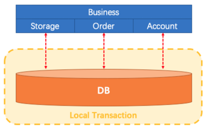

-   随着业务需求和架构的变化，**单体应用被拆分为微服务**：原来的 3 个 Module 被拆分为 3 个独立的服务，分别使用独立的数据源。业务过程将由 3 个服务的调用来完成。


-   此时，每一个服务内部的数据一致性仍由本地事务来保证。而整个业务层面的全局数据一致性要如何保障呢？这就是微服务架构下面临的，典型的分布式事务需求：我们需要一个分布式事务的解决方案保障业务全局的数据一致性。

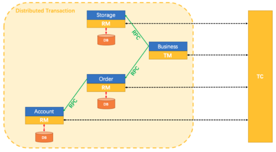

## 3.2 分布式系统和分布式事务

分布式系统：部署在不同结点上的系统通过网络交互来完成协同工作的系统。

分布式事务：指事务的参与者、支持事务的服务器、资源服务器以及事务管理器分别位于不同的分布式系统的不同节点之上。

指一次大的操作由不同的小操作组成的，这些小的操作分布在不同的服务器上，分布式事务需要保证这些小操作要么全部成功，要么全部失败。

**本质上来说，分布式事务就是为了保证不同数据库的数据一致性。**

## 3.3 分布式事务应用在哪些场景

-   电商系统中的下单扣库存

电商系统中，**订单系统**和**库存系统**是两个系统，一次下单的操作由两个系统协同完成

-   金融系统中的银行卡充值

在金融系统中通过银行卡向平台充值需要通过**银行系统**和**金融系统**协同完成。

-   教育系统中下单选课业务

在线教育系统中，用户购买课程，下单支付成功后学生选课成功，此事务由**订单系统**和**选课系统**协同完成。

-   SNS系统的消息发送

在社交系统中发送站内消息同时发送手机短信，一次消息发送由**站内消息系统**和**手机通信系统**协同完成。

删除旅游商品信息 需要将本地数据库和七牛云中的图片一起删除

图片删除不影响本地旅游商品数据删除业务

## 3.4 跨多服务多数据库的分布式事务

当一个服务操作访问不同的数据库资源，又希望对它们的访问具有事务特性时，就需要采用分布式事务来协调所有的事务参与者。

​       对于上面介绍的分布式事务应用架构，尽管一个服务操作会访问多个数据库资源，但是毕竟整个事务还是控制在单一服务的内部。如果一个服务操作需要调用另外一个服务，这时的事务就需要跨越多个服务了。在这种情况下，起始于某个服务的事务在调用另外一个服务的时候，需要以某种机制流转到另外一个服务，从而使被调用的服务访问的资源也自动加入到该事务当中来。下图反映了这样一个跨越多个服务的分布式事务：

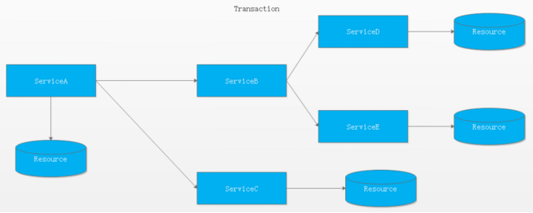

较之基于单一数据库资源访问的本地事务，分布式事务的应用架构更为复杂。在不同的分布式应用架构下，实现一个分布式事务要考虑的问题并不完全一样，比如对多资源的协调、事务的跨服务传播等，实现机制也是复杂多变。

## 3.5   分布式事务基础

数据库的 ACID 四大特性，已经无法满足我们分布式事务，这个时候又有一些新的大佬提出一些新的理论。

### 3.5.1  CAP

分布式存储系统的CAP原理（分布式系统的三个指标）：

1. **C**onsistency（一致性）：在分布式系统中的所有数据备份，在**同一时刻是否同样的值**。

   对于数据分布在不同节点上的数据来说，如果在某个节点更新了数据，那么在其他节点如果都能读取到这个最新的数据，那么就称为强一致，如果有某个节点没有读取到，那就是分布式不一致。

   ```
   一致性（Consistency）是指多副本（Replications）问题中的数据一致性。可以分为强一致性、与弱一致性。
   ① 强一致性
   简言之，在任意时刻，所有节点中的数据是一样的。
   例如，对于关系型数据库，要求更新过的数据能被后续的访问都能看到，这是强一致性。
   ② 弱一致性
   数据更新后，如果能容忍后续的访问只能访问到部分或者全部访问不到，则是弱一致性。
   最终一致性就属于弱一致性。
   ```

   

2. **A**vailability（可用性）：在集群中一部分节点故障后，集群整体是否还能响应客户端的读写请求。（要求数据需要备份）

3. **P**artition tolerance（分区容错）：大多数分布式系统都分布在多个子网络。每个子网络就叫做一个区（partition）。分区容错的意思是，区间通信可能失败。

CAP理论就是说在分布式存储系统中，最多只能实现上面的两点。而由于当前的网络硬件肯定会出现延迟丢包等问题，所以分区容忍性是我们无法避免的。所以我们只能在一致性和可用性之间进行权衡，没有系统能同时保证这三点。要么选择CP、要么选择AP。


我们的妥协：BASE


### 3.5.2   BASE

​	BASE是对CAP中一致性和可用性权衡的结果，其来源于对大规模互联网系统分布式实践的结论，是基于CAP定理逐步演化而来的，其核心思想是即使无法做到强一致性（Strong consistency），但每个应用都可以根据自身的业务特点，采用适当的方式来使系统达到最终一致性（Eventual consistency）。接下来看看BASE中的三要素：

1. Basically Available（**基本可用**）

   基本可用是指分布式系统在出现故障的时候，允许损失部分可用性，即保证核心可用。 
   电商大促时，为了应对访问量激增，部分用户可能会被引导到降级页面，服务层也可能只提供降级服务。这就是损失部分可用性的体现。

2. Soft state（软状态）

   软状态是指允许系统存在中间状态，而该中间状态不会影响系统整体可用性。分布式存储中一般一份数据至少会有三个副本，**允许不同节点间副本同步的延时**就是软状态的体现。mysql replication的异步复制也是一种体现。

3. Eventually consistent（最终一致性）

   最终一致性是指系统中的所有数据副本经过一定时间后，最终能够达到一致的状态。弱一致性和强一致性相反，最终一致性是弱一致性的一种特殊情况。

BASE模型是传统ACID模型的反面，不同于ACID，BASE强调牺牲高一致性，从而获得可用性，数据**允许在一段时间内的不一致，只要保证最终一致就可以了**。

**总而言之，没有最好的策略，好的系统应该是根据业务场景来进行架构设计的，只有适合的才是最好的。**

# 4. 分布式事务解决方案

分布式事务是企业集成中的一个**技术难点**，也是每一个分布式系统架构中都会涉及到的一个东西，特别是在微服务架构中，**几乎可以说是无法避免**。

主流的解决方案如下：

1.XA两段提交(低效率)-分布式事务解决方案

2.TCC三段提交(2段,高效率\[不推荐(补偿代码)\])

3.本地消息(MQ+Table)

4.消息事务+最终一致性(RocketMQ\[alibaba\])

5.Seata(alibaba)

## 4.1 基于XA协议的两阶段提交(2PC)

X/Open 组织（即现在的 Open Group ）定义了分布式事务处理模型

XA协议：XA是一个分布式事务协议。XA中大致分为两部分：**事务管理器**和**本地资源管理器**。其中本地资源管理器往往由数据库实现，比如Oracle、DB2这些商业数据库都实现了XA接口(MySQL从5.5版本开始支持，SQL Server 2005 开始支持，Oracle 7 开始支持。)，而事务管理器作为全局的调度者，负责各个本地资源的提交和回滚。

### 4.1.1 概念

二阶段提交2PC（Two phase Commit）是指，在分布式系统里，为了保证所有节点在进行事务提交时保持一致性的一种算法。

### 4.1.2 背景

在分布式系统里，每个节点都可以知晓自己操作的成功或者失败，却无法知道其他节点操作的成功或失败。

当一个事务跨多个节点时，为了保持事务的原子性与一致性，需要引入一个协调者（Coordinator）来统一掌控所有参与者（Participant）的操作结果，并指示它们是否要把操作结果进行真正的提交（commit）或者回滚（rollback）。

### 4.1.3 思路

2PC顾名思义分为两个阶段，其实施思路可概括为：

（1）投票阶段（voting phase）：参与者将操作结果通知协调者；

（2）提交阶段（commit phase）：收到参与者的通知后，协调者再向参与者发出通知，根据反馈情况决定各参与者是否要提交还是回滚；

### 4.1.4 举例

甲乙丙丁四人要组织一个会议，需要确定会议时间，不妨设甲是协调者，乙丙丁是参与者。

**投票阶段：**

（1）甲发邮件给乙丙丁，周二十点开会是否有时间；

（2）丁回复有时间；

（3）乙回复有时间；

（4）丙迟迟不回复，此时对于这个活动，甲乙丁均处于阻塞状态，算法无法继续进行；

（5）丙回复有时间（或者没有时间）；

**提交阶段：**

（1）协调者甲将收集到的结果反馈给乙丙丁（什么时候反馈，以及反馈结果如何，在此例中取决与丙的时间与决定）；

（2）乙收到；

（3）丙收到；

（4）丁收到；

### 4.1.5 实际应用交互流程

#### 1、2PC两阶段提交的正向流程

**第一阶段：**

2PC中包含着两个角色：事务协调者和事务参与者。让我们来看一看他们之间的交互流程：


在分布式事务的第一阶段，作为事务协调者的节点会首先向所有的参与者节点发送Prepare请求。

在接到Prepare请求之后，每一个参与者节点会各自执行与事务有关的数据更新，写入Undo Log和Redo Log。如果参与者执行成功，暂时不提交事务，而是向事务协调节点返回"完成"消息。

当事务协调者接到了所有参与者的返回消息，整个分布式事务将会进入第二阶段。

**第二阶段：**


在2PC分布式事务的第二阶段，如果事务协调节点在之前所收到都是正向返回，那么它将会向所有事务参与者发出Commit请求。

接到Commit请求之后，事务参与者节点会各自进行本地的事务提交，并释放锁资源。当本地事务完成提交后，将会向事务协调者返回"完成"消息。

当事务协调者接收到所有事务参与者的"完成"反馈，整个分布式事务完成。

#### 2、失败情况的处理流程

**第一阶段：**

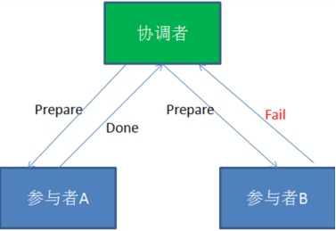

**第二阶段：**

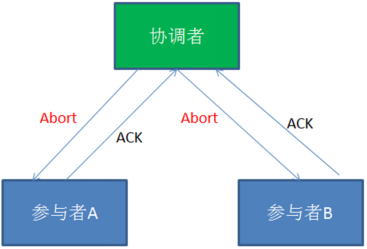

在2PC的第一阶段，如果某个事务参与者反馈失败消息，说明该节点的本地事务执行不成功，必须回滚。

于是在第二阶段，事务协调节点向所有的事务参与者发送Abort(中止)请求。接收到Abort请求之后，各个事务参与者节点需要在本地进行事务的回滚操作，回滚操作依照Undo Log来进行。

以上就是2PC两阶段提交协议的详细过程。

### 4.1.6 总结

**2PC两阶段提交究竟有哪些不足呢？**

1)  **性能问题**

2PC遵循强一致性。在事务执行过程中，各个节点占用着数据库资源，只有当所有节点准备完毕，事务协调者才会通知提交，参与者提交后释放资源。这样的过程有着非常明显的性能问题。

2)  **协调者单点故障问题**

2PC模型的核心，一旦事务协调者节点挂掉，参与者收不到提交或是回滚通知，参与者会一直处于中间状态无法完成事务。

3)  **丢失消息导致的不一致问题。**

第二个阶段，如果发生局部网络问题，一部分事务参与者收到了提交消息，另一部分事务参与者没收到提交消息，那么就导致了节点之间数据的不一致。


总的来说，XA协议比较简单，而且一旦商业数据库实现了XA协议，使用分布式事务的成本也比较低。但是，XA也有致命的缺点，那就是性能不理想，特别是在交易下单链路，往往并发量很高，XA无法满足高并发场景。

1. 两阶段提交涉及多次节点间的网络通信，通信时间太长！

2. 事务时间相对于变长了，锁定的资源的时间也变长了，造成资源等待时间也增加好多。

另外：XA目前在商业数据库支持的比较理想，在mysql数据库中支持的不太理想，mysql的XA实现，没有记录prepare阶段日志，主备切换会导致主库与备库数据不一致。许多nosql也没有支持XA，这让XA的应用场景变得非常狭隘。

**缺陷**：算法执行过程中，所有节点都处于阻塞状态，所有节点所持有的资源（例如数据库数据，本地文件等）都处于封锁状态。存在事务管理器的单点故障问题。

对应的开源框架：atomikos

**总的来说，2PC是一种比较保守的算法，效率很低。**

低并发强一致性

## 4.2 代码补偿事务(TCC）

TCC的作用主要是解决跨服务调用场景下的分布式事务问题

是一种编程式分布式事务解决方案。

TCC 其实就是采用的补偿机制，其核心思想是：针对每个操作，都要注册一个与其对应的确认和补偿（撤销）操作。TCC模式要求从服务提供三个接口：Try、Confirm、Cancel。

- Try：主要是对业务系统做检测及资源预留
- Confirm：真正执行业务，不作任何业务检查；只使用Try阶段预留的业务资源；Confirm操作满足幂等性。
- Cancel：释放Try阶段预留的业务资源；Cancel操作满足幂等性。

### 4.2.1 场景案例

以航班预定的案例，来介绍TCC要解决的事务场景。这里虚构一个场景，把自己当做航班预定的主人公，来介绍这个案例。从合肥 --\> 昆明 --\> 大理。

准备从合肥出发，到云南大理去游玩，然后使用美团App(机票代理商)来订机票。发现没有从合肥直达大理的航班，需要到昆明进行中转。如下图：


从图中我们可以看出来，从合肥到昆明乘坐的是四川航空，从昆明到大理乘坐的是东方航空。

 由于使用的是美团App预定，当我选择了这种航班预定方案后，美团App要去四川航空和东方航空各帮我购买一张票。如下图：


考虑最简单的情况：美团先去川航帮我买票，如果买不到，那么东航也没必要买了。如果川航购买成功，再去东航购买另一张票。

 现在问题来了：假设美团先从川航成功买到了票，然后去东航买票的时候，因为天气问题，东航航班被取消了。那么此时，美团必须取消川航的票，因为只有一张票是没用的，不取消就是浪费我的钱。那么如果取消会怎样呢？如果读者有取消机票经历的话，非正常退票，肯定要扣手续费的。在这里，川航本来已经购买成功，现在因为东航的原因要退川航的票，川航应该是要扣代理商的钱的。

 那么美团就要保证，如果任一航班购买失败，都不能扣钱，怎么做呢？

 两个航空公司都为美团提供以下3个接口：**机票预留接口、确认接口、取消接口**。美团App分2个阶段进行调用，如下所示：

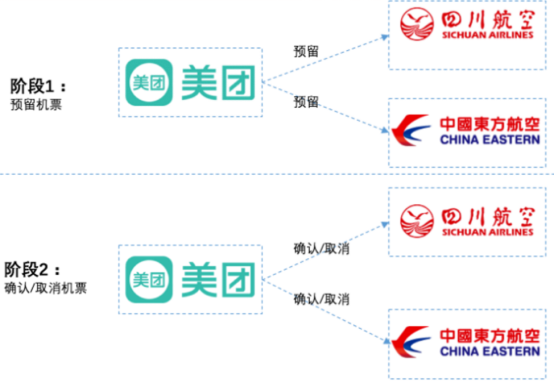

**在第1阶段：**主业务服务分别调用所有从业务的try操作，并在活动管理器中登记所有从业务服务。当所有从业务服务的try操作都调用成功或者某个从业务服务的try操作失败，进入第二阶段。

例如：美团分别请求两个航空公司预留机票，两个航空公司分别告诉美团预留成功还是失败。航空公司需要保证，机票预留成功的话，之后一定能购买到。

**在第2阶段：**活动管理器根据第一阶段的执行结果来执行confirm或cancel操作。如果第一阶段所有try操作都成功，则活动管理器调用所有从业务活动的confirm操作。否则调用所有从业务服务的cancel操作。

例如：

如果两个航空公司都预留成功，则分别向两个公司发送确认购买请求。

如果两个航空公司任意一个预留失败，则对于预留成功的航空公司也要取消预留。这种情况下，对于之前预留成功机票的航班取消，也不会扣用户的钱，因为购买并没实际发生，之前只是请求预留机票而已。

通过这种方案，可以保证两个航空公司购买机票的一致性，要不都成功，要不都失败，即使失败也不会扣用户的钱。如果在两个航班都已经已经确认购买后，再退票，那肯定还是要扣钱的。

当然，实际情况肯定这里提到的肯定要复杂，通常航空公司在第一阶段，对于预留的机票，会要求在指定的时间必须确认购买(支付成功)，如果没有及时确认购买，会自动取消。假设川航要求10分钟内支付成功，东航要求30分钟内支付成功。以较短的时间算，如果用户在10分钟内支付成功的话，那么美团会向两个航空公司都发送确认购买的请求，如果超过10分钟(以较短的时间为准)，那么就不能进行支付。

这个方案提供给我们一种跨服务保证事务一致性的一种解决思路，可以把这种方案当做TCC的雏形。

具体流程：

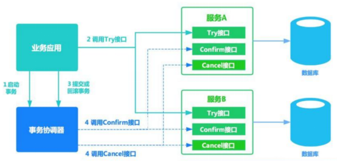

TCC是Try ( 尝试 ) --- Confirm(确认) --- Cancel ( 取消 ) 的简称:

| **操作方法** | **含义**                                                     |
| :----------- | ------------------------------------------------------------ |
| Try          | 完成所有业务检查（一致性），预留业务资源(准隔离性) 回顾上面航班预定案例的阶段1，机票就是业务资源，所有的资源提供者(航空公司)预留都成功，try阶段才算成功 |
| Confirm      | 确认执行业务操作，不做任何业务检查， 只使用Try阶段预留的业务资源。回顾上面航班预定案例的阶段2，美团APP确认两个航空公司机票都预留成功，因此向两个航空公司分别发送确认购买的请求。 |
| Cancel       | 取消Try阶段预留的业务资源。回顾上面航班预定案例的阶段2，如果某个业务方的业务资源没有预留成功，则取消所有业务资源预留请求。 |

缺点：

- Confirm和Cancel的**幂等性**很难保证。
- 这种方式缺点比较多，通常在**复杂场景下是不推荐使用**的，除非是非常简单的场景，非常容易提供回滚Cancel，而且依赖的服务也非常少的情况。
- 这种实现方式会造成**代码量庞大，耦合性高**。而且非常有局限性，因为有很多的业务是无法很简单的实现回滚的，如果串行的服务很多，回滚的成本实在太高。

不少大公司里，其实都是自己研发 TCC 分布式事务框架的，专门在公司内部使用。国内开源出去的：ByteTCC，TCC-transaction，Himly。

### 4.2.2 TCC两阶段提交与XA两阶段提交的区别

 XA是资源层面的分布式事务，d遨游性，在两阶段提交的整个过程中，一直会持有资源的锁。

TCC是业务层面的分布式事务，最终一致性，不会一直持有资源的锁。

其核心在于将业务分为两个操作步骤完成。不依赖 RM 对分布式事务的支持，而是通过对业务逻辑的分解来实现分布式事务。

## 4.3 本地消息表（异步确保）- 事务最终一致性


这种实现方式的思路，其实是源于 ebay，后来通过支付宝等公司的布道，在业内广泛使用。其基本的设计思想是将远程分布式事务拆分成一系列的本地事务。如果不考虑性能及设计优雅，借助关系型数据库中的表即可实现。

-   订单系统新增一条消息表，将新增订单和新增消息放到一个事务里完成，然后通过轮询的方式去查询消息表，将消息推送到 MQ，库存系统去消费 MQ。

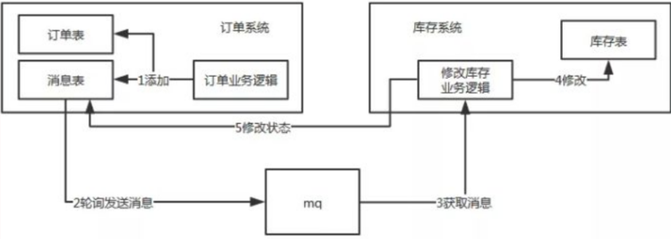

-   执行流程：

    -   订单系统，添加一条订单和一条消息，在一个事务里提交。

    -   订单系统，使用定时任务轮询查询状态为未同步的消息表，发送到 MQ，如果发送失败，就重试发送。

    -   库存系统，接收 MQ 消息，修改库存表，需要保证幂等操作。

    -   如果修改成功，调用 RPC 接口修改订单系统消息表的状态为已完成或者直接删除这条消息。

    -   如果修改失败，可以不做处理，等待重试。
-   订单系统中的消息有可能由于业务问题会一直重复发送，所以为了避免这种情况可以记录一下发送次数，当达到次数限制之后报警，人工接入处理；库存系统需要保证幂等，避免同一条消息被多次消费造成数据一致。
-   本地消息表这种方案实现了最终一致性，需要在业务系统里增加消息表，业务逻辑中多一次插入的 DB 操作，所以性能会有损耗，而且最终一致性的间隔主要由定时任务的间隔时间决定。
-   优点： 一种非常经典的实现，避免了分布式事务，实现了最终一致性。
-   缺点： 消息表会耦合到业务系统中，如果没有封装好的解决方案，会有很多杂活需要处理。

适用于高并发最终一致

低并发基本一致：二阶段提交

高并发强一致：没有解决方案

## 4.4 MQ 事务消息

有一些第三方的MQ是支持事务消息的，比如RocketMQ，他们支持事务消息的方式也是类似于采用的二阶段提交，但是市面上一些主流的MQ都是不支持事务消息的，比如 RabbitMQ 和 Kafka 都不支持。

以阿里的 RocketMQ 中间件为例，其思路大致为：

1)  RocketMQ提供了类似X/Open XA的分布事务功能，通过MQ的事务消息能达到分布式事务的最终一致。

2)  发送方在业务执行开始会先向消息服务器中投递 " **半消息** " ，半消息即暂时不会真正投递的消息，当发送方（即生产者）将消息成功发送给了MQ服务端且并未将该消息的二次确认结果返回，此时消息状态是" 暂时不可投递 " 状态（可以认为是状态未知）。该状态下的消息即半消息。

3)  如果出现网络闪断、生产者应用重启等原因导致事务消息二次确认丢失，MQ服务端会通过扫描发现某条消息长期处于 " 半消息 " 状态，MQ服务端会主动向生产者查询该消息的最终状态是处于Commit(消息提交)还是Rollback(消息回滚)。这个过程称为**消息回查**。

在业务方法内要想消息队列提交两次请求，一次发送消息和一次确认消息。如果确认消息发送失败了RocketMQ会定期扫描消息集群中的事务消息，这时候发现了Prepared消息，它会向消息发送者确认，所以生产方需要实现一个check接口，RocketMQ会根据发送端设置的**策略来决定是回滚还是继续发送确认消息**。这样就保证了消息发送与本地事务同时成功或同时失败。

**总体而言RocketMQ事务消息分为两条主线**

-   **定时任务发送流程：**发送half message(半消息)，执行本地事务，发送事务执行结果

-   **定时任务回查流程：**MQ服务器回查本地事务，发送事务执行结果

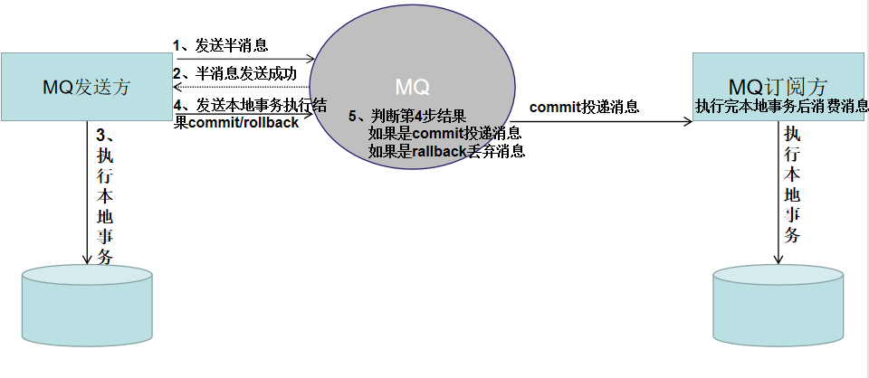

**具体流程如下**

1、Producer 向 MQ 服务器 发送消息 , MQ Server 将消息状态标记为 Prepared（预备状态），注意此时这条消息消费者（MQ订阅方）是无法消费到的。

2、MQ 服务器收到消息并持久化成功之后，会向Producer 确认首次消息发送成功，此时消息处于 half message(半消息) 状态，并未发送给对应的 Consumer 。

3、Producer 开始执行本地事务逻辑 , 通过本地数据库事务控制。

4、根据事务执行结果，Producer 向 MQ 服务器提交二次确认 ( commit 或者 rollback) 。MQ Server 收到 Commit 状态则将半消息标记为可投递，Consumer 最终将收到该消息；MQ Server 收到 Rollback 状态则删除半消息，Consumer 将不会接受该消息。

5、在断网或者应用重启的情况下，二次确认未成功的发给 MQ Server，MQ Server 会主动向 Producer 启动消息回查

6、Producer 根据事务执行结果，对消息回查返回对应的结果。

7、Mq Server根据返回结果，决定继续投递消息或者丢弃消息(重复第4步操作)。

注意 1-4 为事务消息的发送过程

**优点：** 实现了最终一致性，不需要依赖本地数据库事务。

**缺点：** 目前主流MQ中只有RocketMQ支持事务消息。

## 4.5 Seata

**介绍**

seata：Simple Extensible Autonomous Transaction Architecture

简单可扩展自治事务框架。

http://seata.io/zh-cn/

2019 年 1 月，阿里巴巴中间件团队发起了开源项目 Fescar（Fast & EaSy Commit And Rollback），和社区一起共建开源分布式事务解决方案。Fescar 的愿景是让分布式事务的使用像本地事务的使用一样，简单和高效，并逐步解决开发者们遇到的分布式事务方面的所有难题。

**Fescar 开源后，蚂蚁金服加入 Fescar 社区参与共建，并在 Fescar 0.4.0 版本中贡献了 TCC 模式。**

为了打造更中立、更开放、生态更加丰富的分布式事务开源社区，经过社区核心成员的投票，大家决定对 Fescar 进行品牌升级，并更名为 **Seata**，意为：**Simple Extensible Autonomous Transaction Architecture**，是一套一站式分布式事务解决方案。

Seata 融合了阿里巴巴和蚂蚁金服在分布式事务技术上的积累，并沉淀了新零售、云计算和新金融等场景下丰富的实践经验，但要实现**适用于所有的分布式事务场景**的愿景，仍有很长的路要走。因此，我们决定建立一个完全中立的分布式事务组织，希望更多的企业、开发者能够加入我们，一起打造 Seata。

现在使用seata的企业：


历史：

**Ant Financial**

XTS：Extended Transaction Service，可扩展事务服务。蚂蚁金服中间件团队自2007年以来开发了分布式事务中间件，广泛应用于Ant Financial，解决了跨数据库和服务的数据一致性问题。

DTX：Distributed Transaction Extended。自2013年以来，XTS已在Ant Financial Cloud上发布，名称为DTX。

**阿里巴巴**

TXC：Taobao Transaction Constructor。阿里巴巴中间件团队自2014年起启动该项目，以解决因应用程序架构从单片机改为微服务而导致的分布式事务问题。

GTS：Global Transaction Service。 TXC作为Aliyun中间件产品，新名称GTS自2016年起发布。

Fescar：我们从2019年开始基于TXC / GTS开源开源项目Fescar，以便在未来与社区密切合作。

**Seata社区**

Seata：简单的可扩展自治交易架构。 Ant Financial加入Fescar，使其成为一个更加中立和开放的分布式服务社区，并将Fescar更名为Seata。

**Seata**是一个分布式事务框架，设计思路是将一个分布式事务可以理解成一个全局事务，下面挂了若干个分支事务，而一个分支事务是一个满足 ACID 的本地事务，因此我们可以操作分布式事务像操作本地事务一样。一个注解搞定分布式事务。**Seata中有两种分布式事务实现方案，AT及TCC**

### 4.5.1 AT模式

Automatic (Branch) Transaction Mode

基于支持本地ACID事务的关系型数据库，对**业务无侵入**

-   **Transaction Coordinator （TC）：**事务协调器，**维护全局事务的运行状态**，负责协调并决定全局事务的提交或回滚。

-   **Transaction Manager（TM）：** 控制全局事务的边界，负责开启一个全局事务，并最终发起**全局提交**或**全局回滚**的决议。

-   **Resource Manager （RM）：**资源管理器，负责本地事务的注册，本地事务状态的汇报(投票)，并且**负责本地事务的提交和回滚**。

-   **XID：**一个全局事务的唯一标识

其中，TM是一个分布式事务的发起者和终结者，TC负责维护分布式事务的运行状态，而RM则负责本地事务的运行。

如下图所示：


下面是一个分布式事务在Seata中的执行流程：

1)  TM 向 TC 申请开启一个全局事务，全局事务创建成功并生成一个全局唯一的 XID

2)  XID 在微服务调用链路的上下文中传播。

3)  RM 向 TC 注册分支事务，接着执行这个分支事务并提交（重点：RM在第一阶段就已经执行了本地事务的提交/回滚），最后将执行结果汇报给TC

4)  TM 根据 TC 中所有的分支事务的执行情况，发起全局提交或回滚决议。

5)  TC 调度 XID 下管辖的全部分支事务完成提交或回滚请求。

Seata 中有三大模块，分别是 TM、RM 和 TC。 其中 TM 和 RM 是作为 Seata 的客户端与业务系统集成在一起，TC 作为 Seata 的服务端独立部署。

**至此，seata的协议机制总体上看与 XA 是一致的。但是是有一些差别的：**

XA 方案的 RM 实际上是在数据库层，RM 本质上就是数据库自身（通过提供支持 XA 的驱动程序来供应用使用）。

而 Fescar 的 RM 是以二方包的形式作为中间件层部署在应用程序这一侧的，不依赖于数据库本身对协议的支持，当然也不需要数据库支持 XA 协议。这点对于微服务化的架构来说是非常重要的：应用层不需要为本地事务和分布式事务两类不同场景来适配两套不同的数据库驱动。


这个设计，剥离了分布式事务方案对数据库在 **协议支持** 上的要求。

### 4.5.2 MT模式(TCC)

Manual (Branch) Transaction Mode

Seata还支持MT模式。MT模式本质上是一种TCC方案，业务逻辑需要被拆分为 Prepare/Commit/Rollback 3 部分，形成一个 MT 分支，加入全局事务。

不依赖于底层数据资源的事务支持，需自定义`prepare/commit/rollback`操作，对业务有侵入

如图所示：


MT 模式一方面是 AT 模式的补充。另外，更重要的价值在于，通过 MT 模式可以把众多非事务性资源纳入全局事务的管理中。

# 5. Seata解决分布式事务问题

springCloud整合seata案例：https://github.com/seata/seata-samples/tree/master/springcloud-jpa-seata

案例工程结构如下：


接下来，就根据这个官方案例学习seata该怎么使用。

怎么配置启动这些工程，官方也给出文档，参照demo工程中README.md：


版本声明：

nacos-server-1.4.2 + seata-server-1.4.2 + MySQL8 + Hoxton.SR9 + Alibaba2.2.6.RELEASE + SpringBoot2.3.6.RELEASE

https://github.com/alibaba/spring-cloud-alibaba/wiki/%E7%89%88%E6%9C%AC%E8%AF%B4%E6%98%8E

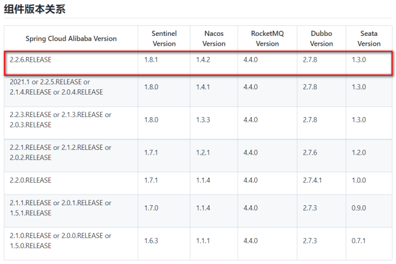


## 5.1 搭建TC服务器

下载地址：https://github.com/seata/seata/releases

自行下载，或者使用课前资料中提供的。一定要注意版本，seata-server需要和项目中整合的版本一致

### 5.1.1 数据库表准备

导入课件seata库的脚本：资料\\seata.sql

****


### 5.1.2 seata配置创建

**nacos配置中心新建dataId为seataServer.properties分组为SEATA_GROUP的配置，内容如下:**

****

**重点关注**

-   虚拟组配置，所有的微服务需要加入名称为：my\_test\_tx\_group的事务组中
-   设置TC进行全局事务控制的数据存储方式：store.mode有file,db,redis三种类型。这里选择db,修改mysql连接信息(url、user、password)

<font style='color:red;'>注意:数据库配置修改为自己的(url、username、password)</font>

```properties
transport.type=TCP
transport.server=NIO
transport.heartbeat=true
transport.enableClientBatchSendRequest=true
transport.threadFactory.bossThreadPrefix=NettyBoss
transport.threadFactory.workerThreadPrefix=NettyServerNIOWorker
transport.threadFactory.serverExecutorThreadPrefix=NettyServerBizHandler
transport.threadFactory.shareBossWorker=false
transport.threadFactory.clientSelectorThreadPrefix=NettyClientSelector
transport.threadFactory.clientSelectorThreadSize=1
transport.threadFactory.clientWorkerThreadPrefix=NettyClientWorkerThread
transport.threadFactory.bossThreadSize=1
transport.threadFactory.workerThreadSize=default
transport.shutdown.wait=3
##--------------
service.vgroupMapping.my_test_tx_group=default
##--------------
service.default.grouplist=127.0.0.1:8091
service.enableDegrade=false
service.disableGlobalTransaction=false
client.rm.asyncCommitBufferLimit=10000
client.rm.lock.retryInterval=10
client.rm.lock.retryTimes=30
client.rm.lock.retryPolicyBranchRollbackOnConflict=true
client.rm.reportRetryCount=5
client.rm.tableMetaCheckEnable=false
client.rm.tableMetaCheckerInterval=60000
client.rm.sqlParserType=druid
client.rm.reportSuccessEnable=false
client.rm.sagaBranchRegisterEnable=false
client.rm.tccActionInterceptorOrder=-2147482648
client.tm.commitRetryCount=5
client.tm.rollbackRetryCount=5
client.tm.defaultGlobalTransactionTimeout=60000
client.tm.degradeCheck=false
client.tm.degradeCheckAllowTimes=10
client.tm.degradeCheckPeriod=2000
client.tm.interceptorOrder=-2147482648

store.mode=db
store.db.datasource=druid
store.db.dbType=mysql
store.db.driverClassName=com.mysql.cj.jdbc.Driver
##--------------
store.db.url=jdbc:mysql://192.168.1.170:3306/seata?characterEncoding=UTF-8&serverTimezone=Asia/Shanghai
store.db.user=root
store.db.password=123456
store.db.minConn=5
store.db.maxConn=30
store.db.globalTable=global_table
store.db.branchTable=branch_table
store.db.queryLimit=100
store.db.lockTable=lock_table
##--------------
store.lock.mode=file
store.session.mode=file
store.publicKey=123
server.recovery.committingRetryPeriod=1000
server.recovery.asynCommittingRetryPeriod=1000
server.recovery.rollbackingRetryPeriod=1000
server.recovery.timeoutRetryPeriod=1000
server.maxCommitRetryTimeout=-1
server.maxRollbackRetryTimeout=-1
server.rollbackRetryTimeoutUnlockEnable=false
server.distributedLockExpireTime=10000
client.undo.dataValidation=true
client.undo.logSerialization=jackson
client.undo.onlyCareUpdateColumns=true
server.undo.logSaveDays=7
server.undo.logDeletePeriod=86400000
client.undo.logTable=undo_log
client.undo.compress.enable=true
client.undo.compress.type=zip
client.undo.compress.threshold=64k
log.exceptionRate=100
transport.serialization=seata
transport.compressor=none
metrics.enabled=false
metrics.registryType=compact
metrics.exporterList=prometheus
metrics.exporterPrometheusPort=9898
```

### 5.1.3 seata配置使用nacos配置

解压 课件\资料\tools\seata-server-1.4.2.zip，修改seata-server-1.4.2\\conf\\registry.conf设置TC 服务对应的注册中心和配置中心。(下载地址：<https://seata.io/zh-cn/index.html>) 这里选择Nacos，

<font style='color:red;'>注意：修改config下的配置type=\"nacos\", dataId = \"seataServer.properties\"，从nacos配置中心拉取配置。等：具体参考以下配置</font>

```properties
registry {
  # file 、nacos 、eureka、redis、zk、consul、etcd3、sofa
  type = "nacos"

  nacos {
    application = "seata-server"
    serverAddr = "127.0.0.1:8848"
    group = "SEATA_GROUP"
    namespace = ""
    cluster = "default"
    username = ""
    password = ""
  }
  eureka {
    serviceUrl = "http://localhost:8761/eureka"
    application = "default"
    weight = "1"
  }
  redis {
    serverAddr = "localhost:6379"
    db = 0
    password = ""
    cluster = "default"
    timeout = 0
  }
  zk {
    cluster = "default"
    serverAddr = "127.0.0.1:2181"
    sessionTimeout = 6000
    connectTimeout = 2000
    username = ""
    password = ""
  }
  consul {
    cluster = "default"
    serverAddr = "127.0.0.1:8500"
    aclToken = ""
  }
  etcd3 {
    cluster = "default"
    serverAddr = "http://localhost:2379"
  }
  sofa {
    serverAddr = "127.0.0.1:9603"
    application = "default"
    region = "DEFAULT_ZONE"
    datacenter = "DefaultDataCenter"
    cluster = "default"
    group = "SEATA_GROUP"
    addressWaitTime = "3000"
  }
  file {
    name = "file.conf"
  }
}

config {
  # file、nacos 、apollo、zk、consul、etcd3
  type = "nacos"

  nacos {
    serverAddr = "127.0.0.1:8848"
    namespace = ""
    group = "SEATA_GROUP"
    username = ""
    password = ""
    dataId = "seataServer.properties"
  }
  consul {
    serverAddr = "127.0.0.1:8500"
    aclToken = ""
  }
  apollo {
    appId = "seata-server"
    ## apolloConfigService will cover apolloMeta
    apolloMeta = "http://192.168.1.204:8801"
    apolloConfigService = "http://192.168.1.204:8080"
    namespace = "application"
    apolloAccesskeySecret = ""
    cluster = "seata"
  }
  zk {
    serverAddr = "127.0.0.1:2181"
    sessionTimeout = 6000
    connectTimeout = 2000
    username = ""
    password = ""
    nodePath = "/seata/seata.properties"
  }
  etcd3 {
    serverAddr = "http://localhost:2379"
  }
  file {
    name = "file.conf"
  }
}
```

修改seata-server-1.4.2\\conf\\file.conf注册信息：（修改连接数据库的地址账号密码）

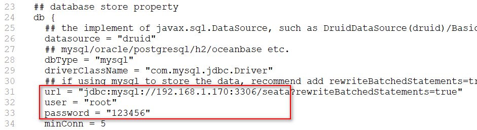


进入到seata-server-1.4.2\\bin目录运行seata-server.bat

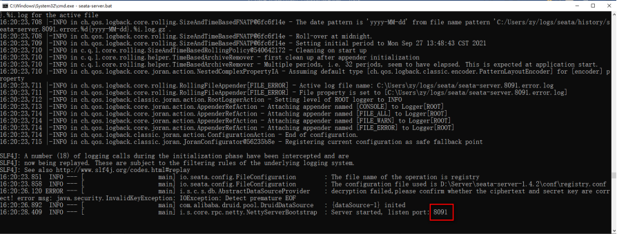

## 5.2 项目整合seata

### 5.2.1 数据库准备

之前的事务案例的每个数据库中创建：undo\_log表，每个业务数据库都需要这张表，用于数据的rollback。这个表必须有独立的id主键，否则，保存日志报错。(<b style='color:red'>注意：需要手动创建</b>)

****

```mysql
CREATE TABLE `undo_log` (
  `id` bigint(20) NOT NULL AUTO_INCREMENT,
  `branch_id` bigint(20) NOT NULL,
  `xid` varchar(100) NOT NULL,
  `context` varchar(128) NOT NULL,
  `rollback_info` longblob NOT NULL,
  `log_status` int(11) NOT NULL,
  `log_created` datetime NOT NULL,
  `log_modified` datetime NOT NULL,
  `ext` varchar(100) DEFAULT NULL,
  PRIMARY KEY (`id`),
  UNIQUE KEY `ux_undo_log` (`xid`,`branch_id`)
) ENGINE=InnoDB DEFAULT CHARSET=utf8;
```

### 5.2.2 项目引入seata依赖

在事务案例父项目demo-seata的pom中引入依赖，排除低版本依赖，重新引入1.4.2；传递给其他微服务项目使用。

```xml
<!--Seata依赖-->
<dependency>
    <groupId>com.alibaba.cloud</groupId>
    <artifactId>spring-cloud-starter-alibaba-seata</artifactId>
    <version>2.2.6.RELEASE</version>
    <exclusions>
        <exclusion>
            <groupId>io.seata</groupId>
            <artifactId>seata-spring-boot-starter</artifactId>
        </exclusion>
    </exclusions>
</dependency>
<dependency>
    <groupId>io.seata</groupId>
    <artifactId>seata-spring-boot-starter</artifactId>
    <version>1.4.2</version>
</dependency>
```


### 5.2.3 项目添加seata配置

account-service、 business-service 、 order-service、  storage-service四个服务

#### **1、application.yml**

​	添加以下配置：（seata事务组配置）

```yaml
seata:
  # seata事务组：一组分布式事务的服务配置需要一样
  tx-service-group: my_test_tx_group
  # seata配置文件名
  config:
    file:
      name: file.conf
```

在每个服务的resources下添加以下两个配置文件：

****

#### **2、file.conf**

```properties
transport {
  # tcp udt unix-domain-socket
  type = "TCP"
  #NIO NATIVE
  server = "NIO"
  #enable heartbeat
  heartbeat = true
  # the client batch send request enable
  enableClientBatchSendRequest = true
  #thread factory for netty
  threadFactory {
    bossThreadPrefix = "NettyBoss"
    workerThreadPrefix = "NettyServerNIOWorker"
    serverExecutorThread-prefix = "NettyServerBizHandler"
    shareBossWorker = false
    clientSelectorThreadPrefix = "NettyClientSelector"
    clientSelectorThreadSize = 1
    clientWorkerThreadPrefix = "NettyClientWorkerThread"
    # netty boss thread size,will not be used for UDT
    bossThreadSize = 1
    #auto default pin or 8
    workerThreadSize = "default"
  }
  shutdown {
    # when destroy server, wait seconds
    wait = 3
  }
  serialization = "seata"
  compressor = "none"
}
service {
  #transaction service group mapping
  vgroupMapping.my_test_tx_group = "default"
  #only support when registry.type=file, please don't set multiple addresses
  default.grouplist = "127.0.0.1:8091"
  #degrade, current not support
  enableDegrade = false
  #disable seata
  disableGlobalTransaction = false
}

client {
  rm {
    asyncCommitBufferLimit = 10000
    lock {
      retryInterval = 10
      retryTimes = 30
      retryPolicyBranchRollbackOnConflict = true
    }
    reportRetryCount = 5
    tableMetaCheckEnable = false
    reportSuccessEnable = false
  }
  tm {
    commitRetryCount = 5
    rollbackRetryCount = 5
  }
  undo {
    dataValidation = true
    logSerialization = "jackson"
    logTable = "undo_log"
  }
  log {
    exceptionRate = 100
  }
}
```

#### **3、registry.conf:**

```properties
registry {
  # file 、nacos 、eureka、redis、zk、consul、etcd3、sofa
  type = "file"

  file {
    name = "file.conf"
  }
}
config {
  # file、nacos 、apollo、zk、consul、etcd3、springCloudConfig
  type = "file"

  file {
    name = "file.conf"
  }
}
```


### 5.2.4 新建配置类

<b style='color:red'>在account-service 、 order-service、  storage-service三个服务服务下创建</b>

```java
@Configuration
public class DataSourceConfig {
    //循环依赖：
    //@SpringBootApplication(exclude = DataSourceAutoConfiguration.class)
    @Autowired
    DruidDataSource druidDataSource;
    @Bean
    @ConfigurationProperties(prefix = "spring.datasource")
    public DruidDataSource druidDataSource() {
        return new DruidDataSource();
    }

    /**
     * 需要将 DataSourceProxy 设置为主数据源，否则事务无法回滚
     * @param druidDataSource The DruidDataSource
     * @return The default datasource
     */
    @Primary
    @Bean("dataSource")
    public DataSource dataSource(DruidDataSource druidDataSource) {
        return new DataSourceProxy(druidDataSource);
    }
}
```

### 5.2.5 开启全局事务

business-service入口方法上添加 @GlobalTransactional


其他微服务的业务方法增加@Transactionial注解；


保留account-service的AccountServiceImpl中模拟的异常，验证全局事务回滚。


### 5.2.6 重启微服务

### 5.2.7 访问测试：

必须访问全局事务入口，也就是@GlobalTransactional标注的业务接口

http://localhost:8114/business/purchase

# 6. Seata之原理简介

## 6.1 再看TC/TM/RM三大组件


## 6.2 分布式事务的执行流程

-   TM开启分布式事务(TM向TC注册全局事务记录)

-   换业务场景，编排数据库，服务等事务内资源（RM向TC汇报资源准备状态）

-   TM结束分布式事务，事务一阶段结束（TM通知TC提交/回滚分布式事务）

-   TC汇总事务信息，决定分布式事务是提交还是回滚

-   TC通知所有RM提交/回滚资源，事务二阶段结束。

## 6.3 AT模式如何做到对业务的无侵入

是什么


### 6.3.1 一阶段加载

-   在一阶段，Seata会拦截\"业务SQL\"

    -   1.解析SQL语义，找到"业务SQL"要更新的业务数据，在业务数据被更新前，将其保存成"before image"

    -   2.执行\"业务SQL\"更新业务数据，在业务数据更新之后，

    -   3.其保存成"after image"，最后生成行锁。

-   以上操作全部在一个数据库事务内完成，这样保证了一阶段操作的原子性。


### 6.3.2 二阶段提交

-   二阶段如果顺利提交的话，因为"业务SQL"在一阶段已经提交至数据库，所以Seata框架只需将一阶段保存的快照数据和行锁删掉，完成数据清理即可。

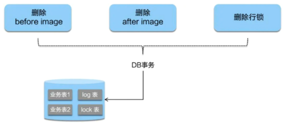

### 6.3.3 二阶段回滚

> 二阶段如果是回滚的话，Seata就需要回滚一阶段执行的"业务SQL",还原业务数据。
>
> 回滚方式便是用"before image"还原业务数据；但在还原前要首先校验脏写，对比"数据库当前业务数据"和"after image",如果两份数据完全一致就说明没有脏写，可以还原业务数据，如果不一致就说明有脏写，出现脏写就需要转人工处理。


# 7. 断点查看数据库表数据变化


**seata-server:** 一次分布式事务开始执行到回滚的日志

```
09:11:47.772  INFO --- [     batchLoggerPrint_1_1] i.s.c.r.p.server.BatchLogHandler         : SeataMergeMessage timeout=60000,transactionName=add(java.lang.String, int, int)
,clientIp:127.0.0.1,vgroup:my_test_tx_group
09:11:47.903  INFO --- [verHandlerThread_1_14_500] i.s.s.coordinator.DefaultCoordinator     : Begin new global transaction applicationId: business,transactionServiceGroup: my_test_tx_group, transactionName: add(java.lang.String, int, int),timeout:60000,xid:192.168.1.1:8091:7070851837933528692
09:11:47.934  INFO --- [     batchLoggerPrint_1_1] i.s.c.r.p.server.BatchLogHandler         : SeataMergeMessage xid=192.168.1.1:8091:7070851837933528692,branchType=AT,resourceId=jdbc:mysql://localhost:3306/fescar-business,lockKey=log_info:19
,clientIp:127.0.0.1,vgroup:my_test_tx_group
09:11:48.081  INFO --- [rverHandlerThread_1_4_500] i.seata.server.coordinator.AbstractCore  : Register branch successfully, xid = 192.168.1.1:8091:7070851837933528692, branchId = 7070851837933528694, resourceId = jdbc:mysql://localhost:3306/fescar-business ,lockKeys = log_info:19
09:11:48.090  INFO --- [     batchLoggerPrint_1_1] i.s.c.r.p.server.BatchLogHandler         : SeataMergeMessage xid=192.168.1.1:8091:7070851837933528692,branchType=AT,resourceId=jdbc:mysql://localhost:3306/fescar-business,lockKey=log_info:19;undo_log:66
,clientIp:127.0.0.1,vgroup:my_test_tx_group
09:11:48.195  INFO --- [verHandlerThread_1_15_500] i.seata.server.coordinator.AbstractCore  : Register branch successfully, xid = 192.168.1.1:8091:7070851837933528692, branchId = 7070851837933528696, resourceId = jdbc:mysql://localhost:3306/fescar-business ,lockKeys = log_info:19;undo_log:66
09:11:48.200  INFO --- [     batchLoggerPrint_1_1] i.s.c.r.p.server.BatchLogHandler         : SeataMergeMessage xid=192.168.1.1:8091:7070851837933528692,branchType=AT,resourceId=jdbc:mysql://localhost:3306/fescar-business,lockKey=log_info:19;undo_log:66;undo_log:67
,clientIp:127.0.0.1,vgroup:my_test_tx_group
09:11:48.323  INFO --- [rverHandlerThread_1_8_500] i.seata.server.coordinator.AbstractCore  : Register branch successfully, xid = 192.168.1.1:8091:7070851837933528692, branchId = 7070851837933528698, resourceId = jdbc:mysql://localhost:3306/fescar-business ,lockKeys = log_info:19;undo_log:66;undo_log:67
09:11:48.451  INFO --- [     batchLoggerPrint_1_1] i.s.c.r.p.server.BatchLogHandler         : SeataMergeMessage xid=192.168.1.1:8091:7070851837933528692,branchType=AT,resourceId=jdbc:mysql://localhost:3306/fescar-order,lockKey=order_info:19
,clientIp:127.0.0.1,vgroup:my_test_tx_group
09:11:48.582  INFO --- [verHandlerThread_1_17_500] i.seata.server.coordinator.AbstractCore  : Register branch successfully, xid = 192.168.1.1:8091:7070851837933528692, branchId = 7070851837933528700, resourceId = jdbc:mysql://localhost:3306/fescar-order ,lockKeys = order_info:19
09:11:48.627  INFO --- [     batchLoggerPrint_1_1] i.s.c.r.p.server.BatchLogHandler         : SeataMergeMessage xid=192.168.1.1:8091:7070851837933528692,branchType=AT,resourceId=jdbc:mysql://localhost:3306/fescar-order,lockKey=undo_log:66;order_info:19
,clientIp:127.0.0.1,vgroup:my_test_tx_group
09:11:48.710  INFO --- [verHandlerThread_1_18_500] i.seata.server.coordinator.AbstractCore  : Register branch successfully, xid = 192.168.1.1:8091:7070851837933528692, branchId = 7070851837933528702, resourceId = jdbc:mysql://localhost:3306/fescar-order ,lockKeys = undo_log:66;order_info:19
09:11:48.714  INFO --- [     batchLoggerPrint_1_1] i.s.c.r.p.server.BatchLogHandler         : SeataMergeMessage xid=192.168.1.1:8091:7070851837933528692,branchType=AT,resourceId=jdbc:mysql://localhost:3306/fescar-order,lockKey=undo_log:66;order_info:19;undo_log:67
,clientIp:127.0.0.1,vgroup:my_test_tx_group
09:11:48.809  INFO --- [verHandlerThread_1_19_500] i.seata.server.coordinator.AbstractCore  : Register branch successfully, xid = 192.168.1.1:8091:7070851837933528692, branchId = 7070851837933528705, resourceId = jdbc:mysql://localhost:3306/fescar-order ,lockKeys = undo_log:66;order_info:19;undo_log:67
09:11:48.919  INFO --- [     batchLoggerPrint_1_1] i.s.c.r.p.server.BatchLogHandler         : SeataMergeMessage xid=192.168.1.1:8091:7070851837933528692,branchType=AT,resourceId=jdbc:mysql://localhost:3306/fescar-item,lockKey=item_info:1
,clientIp:127.0.0.1,vgroup:my_test_tx_group
09:11:48.990  INFO --- [verHandlerThread_1_21_500] i.seata.server.coordinator.AbstractCore  : Register branch successfully, xid = 192.168.1.1:8091:7070851837933528692, branchId = 7070851837933528707, resourceId = jdbc:mysql://localhost:3306/fescar-item ,lockKeys = item_info:1
09:11:49.049  INFO --- [     batchLoggerPrint_1_1] i.s.c.r.p.server.BatchLogHandler         : SeataMergeMessage xid=192.168.1.1:8091:7070851837933528692,branchType=AT,resourceId=jdbc:mysql://localhost:3306/fescar-item,lockKey=undo_log:62;item_info:1
,clientIp:127.0.0.1,vgroup:my_test_tx_group
09:11:49.123  INFO --- [verHandlerThread_1_12_500] i.seata.server.coordinator.AbstractCore  : Register branch successfully, xid = 192.168.1.1:8091:7070851837933528692, branchId = 7070851837933528709, resourceId = jdbc:mysql://localhost:3306/fescar-item ,lockKeys = undo_log:62;item_info:1
09:11:49.128  INFO --- [     batchLoggerPrint_1_1] i.s.c.r.p.server.BatchLogHandler         : SeataMergeMessage xid=192.168.1.1:8091:7070851837933528692,branchType=AT,resourceId=jdbc:mysql://localhost:3306/fescar-item,lockKey=undo_log:62;undo_log:63;item_info:1
,clientIp:127.0.0.1,vgroup:my_test_tx_group
09:11:49.202  INFO --- [verHandlerThread_1_22_500] i.seata.server.coordinator.AbstractCore  : Register branch successfully, xid = 192.168.1.1:8091:7070851837933528692, branchId = 7070851837933528711, resourceId = jdbc:mysql://localhost:3306/fescar-item ,lockKeys = undo_log:62;undo_log:63;item_info:1
09:11:49.321  INFO --- [     batchLoggerPrint_1_1] i.s.c.r.p.server.BatchLogHandler         : SeataMergeMessage xid=192.168.1.1:8091:7070851837933528692,branchType=AT,resourceId=jdbc:mysql://localhost:3306/fescar-user,lockKey=user_info:zhangsan
,clientIp:127.0.0.1,vgroup:my_test_tx_group
09:11:49.393  INFO --- [verHandlerThread_1_23_500] i.seata.server.coordinator.AbstractCore  : Register branch successfully, xid = 192.168.1.1:8091:7070851837933528692, branchId = 7070851837933528713, resourceId = jdbc:mysql://localhost:3306/fescar-user ,lockKeys = user_info:zhangsan
09:11:49.406  INFO --- [     batchLoggerPrint_1_1] i.s.c.r.p.server.BatchLogHandler         : SeataMergeMessage xid=192.168.1.1:8091:7070851837933528692,branchType=AT,resourceId=jdbc:mysql://localhost:3306/fescar-user,lockKey=undo_log:33;user_info:zhangsan
,clientIp:127.0.0.1,vgroup:my_test_tx_group
09:11:49.470  INFO --- [verHandlerThread_1_16_500] i.seata.server.coordinator.AbstractCore  : Register branch successfully, xid = 192.168.1.1:8091:7070851837933528692, branchId = 7070851837933528715, resourceId = jdbc:mysql://localhost:3306/fescar-user ,lockKeys = undo_log:33;user_info:zhangsan
09:11:49.475  INFO --- [     batchLoggerPrint_1_1] i.s.c.r.p.server.BatchLogHandler         : SeataMergeMessage xid=192.168.1.1:8091:7070851837933528692,branchType=AT,resourceId=jdbc:mysql://localhost:3306/fescar-user,lockKey=undo_log:33;undo_log:34;user_info:zhangsan
,clientIp:127.0.0.1,vgroup:my_test_tx_group
09:11:49.641  INFO --- [verHandlerThread_1_24_500] i.seata.server.coordinator.AbstractCore  : Register branch successfully, xid = 192.168.1.1:8091:7070851837933528692, branchId = 7070851837933528717, resourceId = jdbc:mysql://localhost:3306/fescar-user ,lockKeys = undo_log:33;undo_log:34;user_info:zhangsan
09:11:52.255  INFO --- [     batchLoggerPrint_1_1] i.s.c.r.p.server.BatchLogHandler         : SeataMergeMessage xid=192.168.1.1:8091:7070851837933528692,extraData=null
,clientIp:127.0.0.1,vgroup:my_test_tx_group
09:11:54.769  INFO --- [verHandlerThread_1_25_500] io.seata.server.coordinator.DefaultCore  : Rollback branch transaction successfully, xid = 192.168.1.1:8091:7070851837933528692 branchId = 7070851837933528717
09:11:54.864  INFO --- [verHandlerThread_1_25_500] io.seata.server.coordinator.DefaultCore  : Rollback branch transaction successfully, xid = 192.168.1.1:8091:7070851837933528692 branchId = 7070851837933528715
09:11:54.958  INFO --- [verHandlerThread_1_25_500] io.seata.server.coordinator.DefaultCore  : Rollback branch transaction successfully, xid = 192.168.1.1:8091:7070851837933528692 branchId = 7070851837933528713
09:11:55.062  INFO --- [verHandlerThread_1_25_500] io.seata.server.coordinator.DefaultCore  : Rollback branch transaction successfully, xid = 192.168.1.1:8091:7070851837933528692 branchId = 7070851837933528711
09:11:55.168  INFO --- [verHandlerThread_1_25_500] io.seata.server.coordinator.DefaultCore  : Rollback branch transaction successfully, xid = 192.168.1.1:8091:7070851837933528692 branchId = 7070851837933528709
09:11:55.305  INFO --- [verHandlerThread_1_25_500] io.seata.server.coordinator.DefaultCore  : Rollback branch transaction successfully, xid = 192.168.1.1:8091:7070851837933528692 branchId = 7070851837933528707
09:11:55.570  INFO --- [verHandlerThread_1_25_500] io.seata.server.coordinator.DefaultCore  : Rollback branch transaction successfully, xid = 192.168.1.1:8091:7070851837933528692 branchId = 7070851837933528705
09:11:55.698  INFO --- [verHandlerThread_1_25_500] io.seata.server.coordinator.DefaultCore  : Rollback branch transaction successfully, xid = 192.168.1.1:8091:7070851837933528692 branchId = 7070851837933528702
09:11:55.813  INFO --- [verHandlerThread_1_25_500] io.seata.server.coordinator.DefaultCore  : Rollback branch transaction successfully, xid = 192.168.1.1:8091:7070851837933528692 branchId = 7070851837933528700
09:11:55.951  INFO --- [verHandlerThread_1_25_500] io.seata.server.coordinator.DefaultCore  : Rollback branch transaction successfully, xid = 192.168.1.1:8091:7070851837933528692 branchId = 7070851837933528698
09:11:56.078  INFO --- [verHandlerThread_1_25_500] io.seata.server.coordinator.DefaultCore  : Rollback branch transaction successfully, xid = 192.168.1.1:8091:7070851837933528692 branchId = 7070851837933528696
09:11:56.227  INFO --- [verHandlerThread_1_25_500] io.seata.server.coordinator.DefaultCore  : Rollback branch transaction successfully, xid = 192.168.1.1:8091:7070851837933528692 branchId = 7070851837933528694
09:11:56.387  INFO --- [verHandlerThread_1_25_500] io.seata.server.coordinator.DefaultCore  : Rollback global transaction successfully, xid = 192.168.1.1:8091:7070851837933528692.
```

