# 数字大屏开发完整流程文档

## 一、项目概述

本项目是一个基于 HTML + CSS + JavaScript 开发的数据可视化大屏项目，主要展示人才智汇平台的相关数据。

### 使用技术栈
- **前端基础**: HTML5 + CSS3 + JavaScript
- **布局方案**: Flex布局 + rem响应式适配
- **图表库**: ECharts 5.x
- **工具库**: jQuery + lib-flexible
- **样式预处理**: 支持Less
- **图标**: SVG图标

## 二、项目初始化与环境配置

### 2.1 创建项目结构
```
dataDashboard/
├── css/
│   └── index.css           # 主样式文件
├── images/
│   ├── background.png      # 背景图
│   ├── center.png         # 中心装饰图
│   └── 标题.png           # 标题图
├── js/                    # JavaScript文件目录
├── json/
│   ├── 中华人民共和国.json  # 中国地图数据
│   ├── 芜湖市.json         # 芜湖市地图数据
│   └── 芜湖市区数据.json    # 芜湖市区详细数据
├── svg/
│   ├── 天气.svg           # 天气图标
│   └── 定位.svg           # 定位图标
├── img/                   # 文档配图目录
├── index.html             # 主页面
├── package.json           # 依赖配置
└── package-lock.json      # 依赖锁定文件
```

### 2.2 安装依赖
```bash
# 初始化项目
npm init -y

# 安装核心依赖
npm install echarts jquery lib-flexible

# 如果使用Vite构建工具（可选）
npm install vite -D
```

### 2.3 引入必要文件
在 `index.html` 中引入核心库：
```html
<script src="node_modules/echarts/dist/echarts.min.js"></script>
<script src="node_modules/jquery/dist/jquery.min.js"></script>
<script src="node_modules/lib-flexible/flexible.js"></script>
```

## 三、响应式适配方案详解（六步骤）

> **重要提示**: 首先大屏需要自适应！要设置最大最小宽高！最大最小宽高要使用px单位！其他所有使用rem单位！

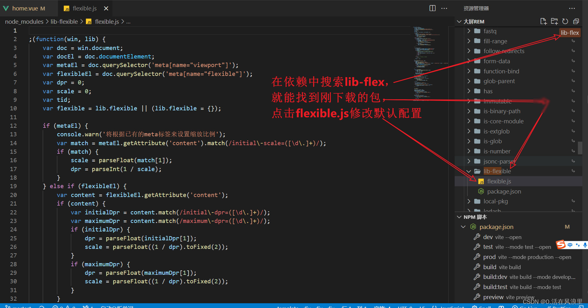

### 3.1 第一步：安装lib-flexible

```bash
# 使用npm安装
npm i -S lib-flexible

# 或使用cnpm安装
cnpm i -S lib-flexible
```

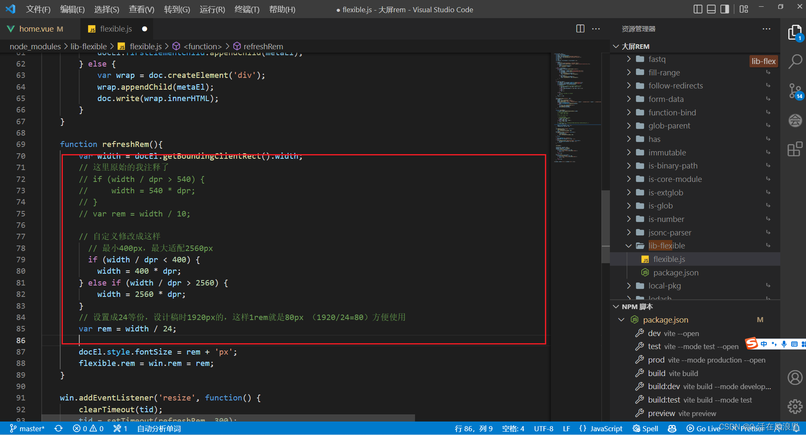

### 3.2 第二步：根据设计稿修改配置

因为默认情况下只会在540px分辨率以下生效，所以我们需要根据项目分辨率进行调整。

在 `node_modules/lib-flexible/flexible.js` 中修改代码：

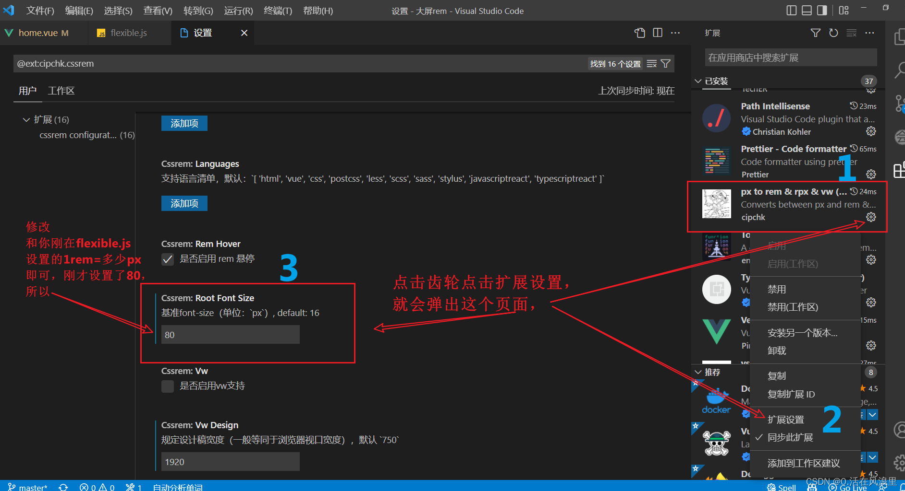

```javascript
// 修改原始的代码
// if (width / dpr > 540) {
//     width = 540 * dpr;
// }
// var rem = width / 10;

// 修改成为：
// 最小400px，最大适配2560px
if (width / dpr < 400) {
    width = 400 * dpr;
} else if (width / dpr > 2560) {
    width = 2560 * dpr;
}
// 设置成24等份，设计稿是1920px，这样1rem就是80px（1920/24=80）方便使用
var rem = width / 24;
```

#### rem适配核心原理
- **设计稿标准**: 1920px宽度
- **分割方案**: 使用flexible.js将屏幕分为24等份
- **基准计算**: 1920px ÷ 24 = 80px，即1rem = 80px
- **最小宽度**: 400px
- **最大宽度**: 2560px

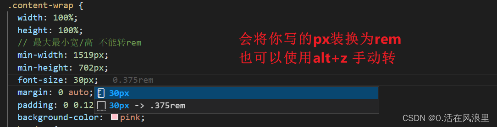

### 3.3 第三步：在main.js中引入（Vue项目）

如果是Vue项目，在main.js中引入：
```javascript
import { createApp } from 'vue'
import App from './App.vue'
import router from './router'
import store from './store'
// 引用flexible
import 'lib-flexible/flexible.js'

createApp(App).use(store).use(router).mount('#app')
```

如果是原生HTML项目，直接在HTML中引入：
```html
<script src="node_modules/lib-flexible/flexible.js"></script>
```

重启项目后，打开浏览器调试器，可以发现在浏览器大小改变时，html根节点上会自动设置font-size。

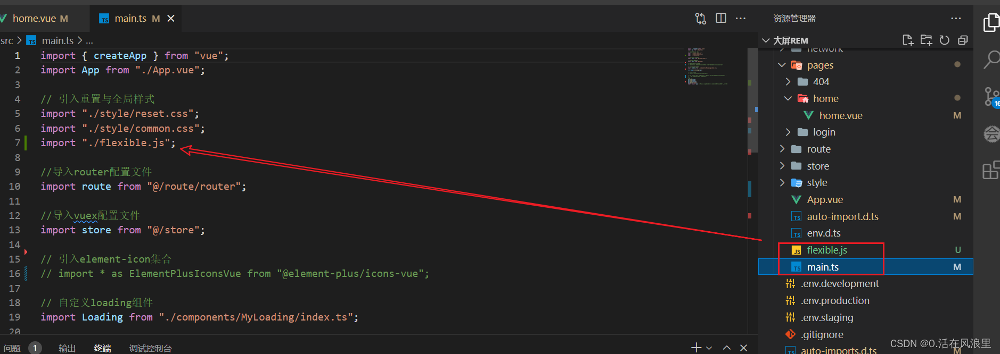

### 3.4 第四步：配置cssrem插件

在编写代码时，如果都根据80px为1rem手动转换会非常麻烦，所以在VSCode中安装cssrem插件来帮助转换。

#### cssrem插件安装与配置

1. 在VSCode扩展中搜索 **cssrem插件**（最新名字叫 **px to rem & rpx**）
2. 安装到VSCode中
3. 点击右下角设置按钮

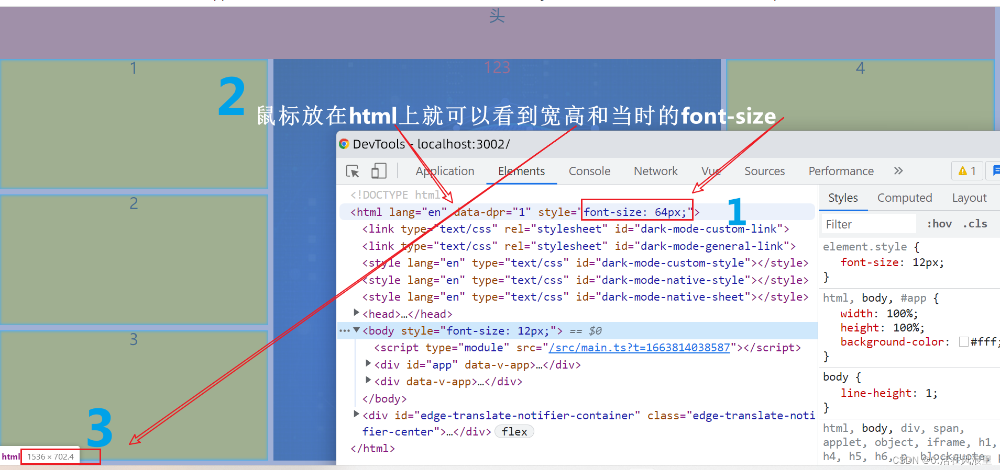

4. 修改Root Font Size（基准font-size）配置项为80

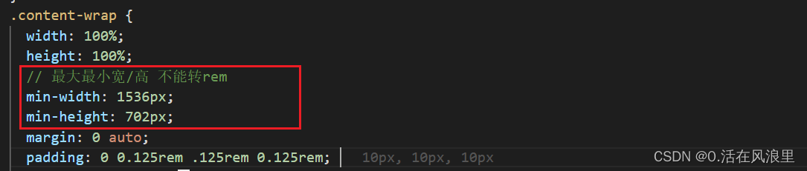

5. **重启VSCode确保生效**

### 3.5 第五步：页面使用示例

配置完成后，在编写CSS时可以直接输入px值，插件会自动提示转换为rem：

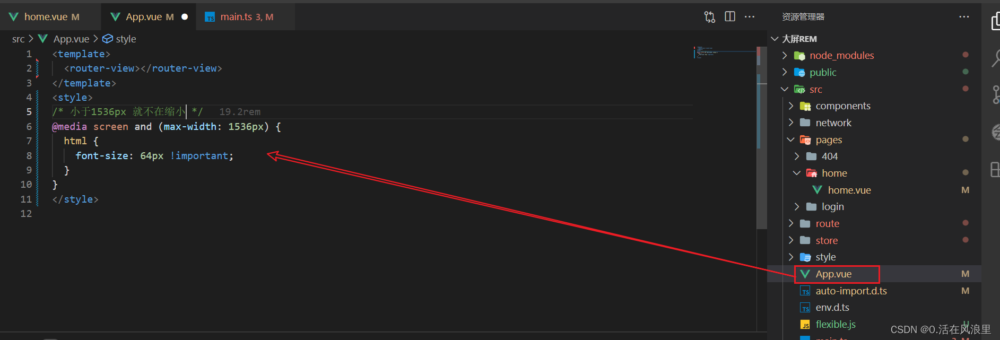

使用示例：
```css
.container {
  width: 1920px;  /* 插件会提示转换为 24rem */
  height: 1080px; /* 插件会提示转换为 13.5rem */
  font-size: 32px; /* 插件会提示转换为 0.4rem */
}
```

至此自适应px转rem前期配置已经完成！

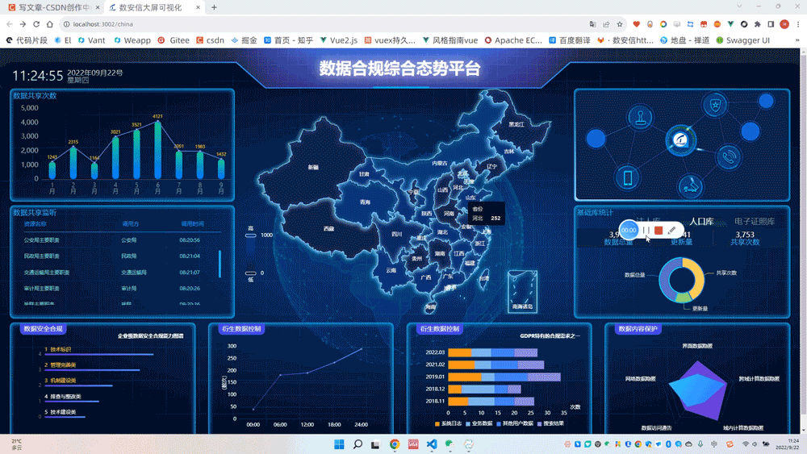

### 3.6 第六步：卸载依赖，复制flexible.js

**重要步骤**：由于我们修改了 `node_modules` 中的文件，当其他人拉取代码并安装依赖时，会恢复到默认配置。因此需要：

1. 复制修改后的文件到项目中：
```bash
# 复制修改后的文件到项目js目录
cp node_modules/lib-flexible/flexible.js ./js/

# 卸载npm依赖
npm uninstall lib-flexible
```

2. 修改HTML引用：
```html
<script src="js/flexible.js"></script>
```

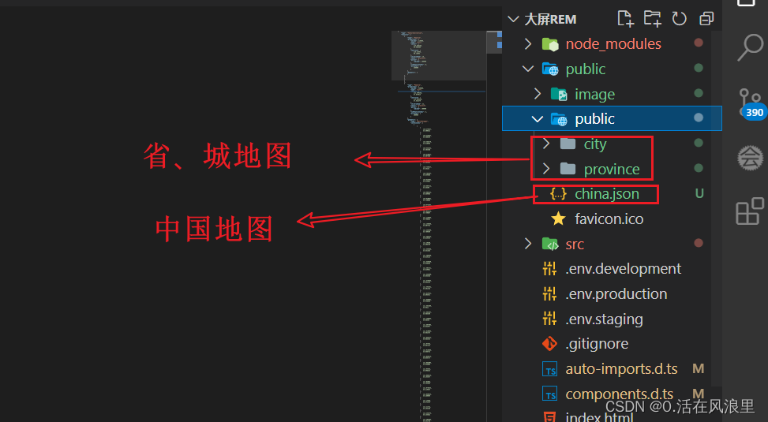

### 3.7 配置最大最小宽高约束

```css
/* 约束屏幕尺寸 */
@media screen and (max-width: 1024px) {
  html {
    font-size: 42px !important;
  }
}
@media screen and (min-width: 1920px) {
  html {
    font-size: 80px !important;
  }
}
```

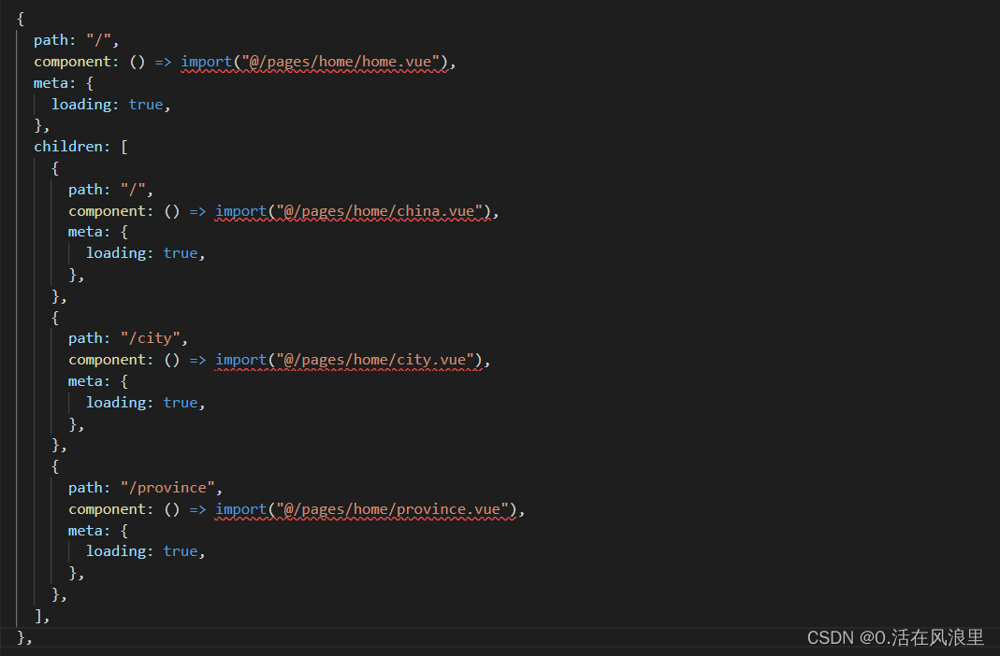

### 3.8 viewport meta标签配置

**必须添加**以确保移动端正确显示：
```html
<meta name="viewport" content="width=device-width, initial-scale=1.0, maximum-scale=1.0, user-scalable=no">
```

## 四、页面布局结构设计

### 4.1 整体布局架构

本项目采用**头部图片 + 三栏布局**的结构设计：

```html
<body>
  <!-- 头部区域 - 使用图片 -->
  <header>
    <div>定位信息</div>
    <div class="header-center">
      
    </div>
    <div>时间信息</div>
  </header>

  <!-- 主要内容区域 - 三栏布局 -->
  <section class="mailbox">
    <div class="column"><!-- 左侧列 flex: 3 --></div>
    <div class="column"><!-- 中间列 flex: 5 --></div>
    <div class="column"><!-- 右侧列 flex: 3 --></div>
  </section>
</body>
```

### 4.2 三栏布局配置详解

**核心布局比例**: 左中右 = **3：5：3**

```css
.mailbox {
  padding: 0.125rem 0.125rem 0;
  display: flex;
  height: calc(100vh - 头部高度);
  
  .column {
    flex: 3;  /* 左右列占3份 */
    
    /* 中间列占5份，获得更多展示空间 */
    &:nth-child(2) {
      flex: 5;  /* 中间列更宽，适合放置主要图表 */
      margin: 0 0.125rem 0.1875rem;
    }
  }
}
```

**布局设计说明**：
- **左侧列（flex: 3）**: 适合放置统计卡片、排行榜等纵向内容
- **中间列（flex: 5）**: 主要展示区域，适合放置地图、大型图表
- **右侧列（flex: 3）**: 对称设计，放置分析图表、实时数据等

### 4.3 左侧列布局细节

**左侧盒子垂直分布**: 每个盒子占1份，竖着一共占3份

```css
/* 左侧列内部布局 */
.column:first-child {
  display: flex;
  flex-direction: column;
  
  .panel {
    flex: 1;  /* 每个盒子占1份 */
    margin-bottom: 0.125rem;
    
    /* 最后一个盒子不需要下边距 */
    &:last-child {
      margin-bottom: 0;
    }
  }
}
```

**实际效果**：
```
┌─────────────────────┐
│   左侧盒子1 (1份)    │
├─────────────────────┤
│   左侧盒子2 (1份)    │
├─────────────────────┤
│   左侧盒子3 (1份)    │
└─────────────────────┘
```

### 4.4 公共面板样式

```css
.panel {
  position: relative;
  height: 3.875rem;
  border: 1px solid rgba(25, 186, 139, 0.17);
  background: url(../images/line.png);
  padding: 0 0.1875rem 0.5rem;
  margin-bottom: 0.1875rem;
  
  /* 科技感边框装饰 */
  &::before, &::after {
    position: absolute;
    content: "";
    width: 10px;
    height: 10px;
    border: 2px solid #02a6b5;
  }
  
  &::before {
    top: 0;
    left: 0;
    border-right: none;
    border-bottom: none;
  }
  
  &::after {
    top: 0;
    right: 0;
    border-left: none;
    border-bottom: none;
  }
}
```

### 4.5 响应式布局处理

```css
/* 小屏幕适配 */
@media screen and (max-width: 1366px) {
  .mailbox .column {
    &:nth-child(2) {
      flex: 4;  /* 中间列稍微缩小 */
    }
  }
}

/* 超宽屏适配 */
@media screen and (min-width: 2560px) {
  .mailbox {
    max-width: 2560px;
    margin: 0 auto;
  }
}
```

## 五、头部区域开发

### 5.1 头部图片设计

**设计特点**：
- 使用图片替代文字标题，更具视觉冲击力
- 图片格式建议：PNG（支持透明背景）
- 尺寸建议：适配1920px宽度屏幕，高度约120-150px

### 5.2 头部HTML结构

```html
<header>
  <!-- 左侧信息区域 -->
  <div class="header-left">
    
    <span id="header-positioning">芜湖</span>
    
    <div class="weather">
      
      <span id="header-weather">多云</span>
    </div>
    
    <span id="header-temperature">17°C～24°C</span>
  </div>
  
  <!-- 中间标题图片 -->
  <div class="header-center">
    
  </div>
  
  <!-- 右侧时间区域 -->
  <div class="header-right">
    <span id="date"></span>
    <span id="week"></span>
    <span id="hours"></span>
  </div>
</header>
```

### 5.3 头部样式配置

```css
header {
  display: flex;
  justify-content: space-between;
  align-items: center;
  padding: 0 0.25rem;
  height: 1.25rem;
  background: linear-gradient(90deg, rgba(0,0,0,0.8) 0%, rgba(0,0,0,0.4) 50%, rgba(0,0,0,0.8) 100%);
  
  .header-title {
    height: 1rem;
    width: auto;
    object-fit: contain;
  }
  
  .header-left, .header-right {
    flex: 1;
    display: flex;
    align-items: center;
    gap: 0.125rem;
  }
  
  .header-right {
    justify-content: flex-end;
  }
}
```

### 5.4 实时时间功能

```javascript
window.onload = () => {
  // 设置静态信息
  document.querySelector("#header-positioning").textContent = "芜湖";
  document.querySelector("#header-weather").textContent = "多云";
  document.querySelector("#header-temperature").textContent = "17°C～24°C";

  // 实时时间更新
  setInterval(() => {
    const date = new Date();
    const year = date.getFullYear();
    const month = date.getMonth() + 1;
    const day = date.getDate();
    const weekList = ["星期日", "星期一", "星期二", "星期三", "星期四", "星期五", "星期六"];
    const week = weekList[date.getDay()];
    const hours = date.getHours().toString().padStart(2, "0");
    const minutes = date.getMinutes().toString().padStart(2, "0");
    const seconds = date.getSeconds().toString().padStart(2, "0");
    
    document.querySelector("#date").textContent = `${year}.${month.toString().padStart(2, "0")}.${day.toString().padStart(2, "0")}`;
    document.querySelector("#week").textContent = week;
    document.querySelector("#hours").textContent = `${hours} : ${minutes} : ${seconds}`;
  }, 1000);
};
```

## 六、ECharts图表开发详解

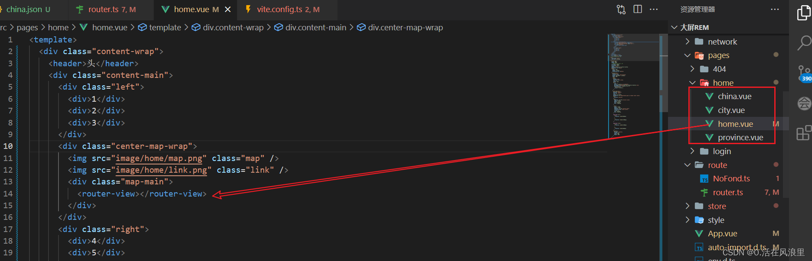

### 6.1 图表资源获取策略

**推荐资源网站**：
- **[MakeAPie社区](https://www.makeapie.cn/echarts_component/geo_1.html)** - ECharts图表案例库
- **[阿里云DataV](https://datav.aliyun.com/portal/school/atlas/area_selector?spm=a2crr.b71357980.0.0.33f726c01aqq4k)** - 地图数据获取平台

### 6.2 图表开发工作流程

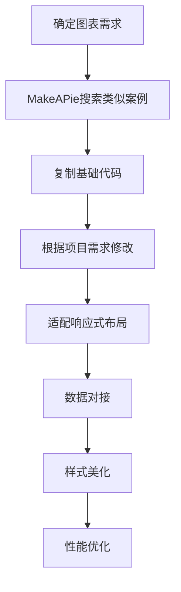

### 6.3 从MakeAPie获取图表代码

**操作步骤**：

1. **访问MakeAPie社区**：[https://www.makeapie.cn/echarts_component/geo_1.html](https://www.makeapie.cn/echarts_component/geo_1.html)

2. **选择合适的图表类型**：
   - 地图类：geo、series-map、series-effectScatter
   - 柱状图：series-bar
   - 散点图：series-scatter
   - 线图：series-line

3. **复制代码并修改**：
```javascript
// 从MakeAPie复制的基础代码
option = {
  // 原始配置...
};

// 修改为项目需求
option = {
  // 根据项目UI设计调整颜色
  color: ['#00d7ff', '#ff6b6b', '#4ecdc4'],
  
  // 适配响应式
  grid: {
    left: '3%',
    right: '4%',
    bottom: '3%',
    containLabel: true
  },
  
  // 使用项目数据
  series: [{
    data: projectData,  // 替换为实际数据
    // 其他配置...
  }]
};
```

### 6.4 地图数据获取与配置

**从阿里云DataV获取地图数据**：

1. **访问DataV地图选择器**：[https://datav.aliyun.com/portal/school/atlas/area_selector](https://datav.aliyun.com/portal/school/atlas/area_selector?spm=a2crr.b71357980.0.0.33f726c01aqq4k)

2. **选择地图区域**：
   - 全国地图：中华人民共和国
   - 省级地图：选择具体省份
   - 市级地图：选择具体城市

3. **下载JSON数据**：
```javascript
// 下载的地图数据存放路径
const mapDataPath = {
  china: './json/中华人民共和国.json',
  anhui: './json/安徽省.json',
  wuhu: './json/芜湖市.json',
  wuhuDistrict: './json/芜湖市区数据.json'
};
```

4. **注册和使用地图**：
```javascript
// 异步加载地图数据
async function loadMapData(mapName, dataPath) {
  try {
    const response = await fetch(dataPath);
    const geoJson = await response.json();
    
    // 注册地图
    echarts.registerMap(mapName, geoJson);
    
    return geoJson;
  } catch (error) {
    console.error(`地图数据加载失败: ${mapName}`, error);
    throw error;
  }
}

// 使用示例
loadMapData('wuhu', './json/芜湖市区数据.json')
  .then(() => {
    // 初始化地图图表
    initMapChart();
  });
```

### 6.5 ECharts基础配置模板

```javascript
// 通用ECharts开发模板
(function() {
  // 1. 初始化图表实例
  let myChart = echarts.init(document.querySelector(".chart-container"));
  
  // 2. 配置选项（从MakeAPie复制并修改）
  let option = {
    // 基础配置
    backgroundColor: 'transparent',
    
    // 响应式网格
    grid: {
      left: '3%',
      right: '4%',
      bottom: '3%',
      containLabel: true
    },
    
    // 提示框
    tooltip: {
      trigger: 'axis',
      backgroundColor: 'rgba(0,0,0,0.8)',
      textStyle: {
        color: '#fff'
      }
    },
    
    // 数据系列
    series: [{
      // 从MakeAPie复制的配置
      type: 'bar',
      data: [],
      itemStyle: {
        // 根据项目UI调整颜色
        color: new echarts.graphic.LinearGradient(0, 0, 0, 1, [
          {offset: 0, color: '#00d7ff'},
          {offset: 1, color: '#0066cc'}
        ])
      }
    }]
  };
  
  // 3. 应用配置
  myChart.setOption(option);
  
  // 4. 响应式处理
  window.addEventListener("resize", function() {
    myChart.resize();
  });
})();
```

### 6.6 常用图表类型配置

#### 6.6.1 热门地区排行（柱状图）

**从MakeAPie参考案例**：搜索"柱状图"或"series-bar"

```javascript
(function area() {
  let myChart = echarts.init(document.querySelector(".area .chart"));
  
  // 数据处理
  let charts = {
    cityList: ["弋江区", "镜湖区", "繁昌区", "湾沚区", "鸠江区", "无为市", "南陵县"],
    cityData: [258, 107, 350, 240, 336, 450, 123],
  };
  
  // 数据排序
  let combinedData = charts.cityList.map((name, i) => ({
    name: name,
    value: charts.cityData[i]
  })).sort((a, b) => b.value - a.value);
  
  // 响应式计算
  const getResponsiveSize = () => {
    const container = document.querySelector(".area .chart");
    return {
      fontSize: Math.max(10, Math.min(16, container.offsetWidth / 25)),
      barHeight: Math.max(8, Math.min(15, container.offsetHeight / 20)),
    };
  };
  
  const updateChart = () => {
    const responsive = getResponsiveSize();
    
    let option = {
      grid: {
        top: "0%", left: "0%", right: "0%", bottom: "0%",
        containLabel: true
      },
      yAxis: [{
        type: "category",
        inverse: true,
        data: combinedData.map(item => item.name),
        axisLabel: {
          color: "#b3ccf8",
          fontSize: responsive.fontSize,
        }
      }],
      xAxis: {
        type: "value",
        max: 500,
        show: false
      },
      series: [{
        type: "bar",
        barWidth: responsive.barHeight,
        data: combinedData.map((item, i) => ({
          name: item.name,
          value: item.value,
          // 从MakeAPie复制的渐变色配置
          itemStyle: {
            color: new echarts.graphic.LinearGradient(0, 0, 1, 0, [
              { offset: 0, color: `rgba(248,195,248, 0.3)` },
              { offset: 1, color: `rgba(248,195,248, 1)` }
            ])
          }
        })),
        label: {
          show: true,
          position: "right",
          color: "#fff",
          fontSize: responsive.fontSize,
          formatter: "{c}"
        }
      }]
    };
    
    myChart.setOption(option, true);
  };
  
  updateChart();
  window.addEventListener("resize", updateChart);
})();
```

#### 6.6.2 地图图表开发

**从MakeAPie参考案例**：搜索"地图下钻"或"series-effectScatter"

```javascript
(function() {
  let myChart = echarts.init(document.querySelector(".map .chart"));
  
  // 地图数据（从阿里云DataV获取）
  var mapname = "json/芜湖市区数据.json";
  var setData = [
    { name: "镜湖区", value: 85 },
    { name: "鸠江区", value: 92 },
    { name: "弋江区", value: 78 },
    { name: "湾沚区", value: 65 },
    { name: "繁昌区", value: 58 },
    { name: "南陵县", value: 71 },
    { name: "无为市", value: 88 },
  ];
  
  // 自定义图标（从MakeAPie复制的技巧）
  var img = 'image://data:image/png;base64,iVBORw0KGgoAAAANSUhEUgAAAGoAAAAYCAYAAAAF0KgMAAAABHNCSVQICAgIfAhkiAAAAAlwSFlzAAAAdgAAAHYBTnsmCAAAABl0RVh0U29mdHdhcmUAd3d3Lmlua3NjYXBlLm9yZ5vuPBoAAANbSURBVHic7ZpNaBNBFMefJBsllhb'; // 完整的base64数据
  
  var mapInit = () => {
    // 使用从阿里云DataV获取的地图数据
    fetch(mapname)
      .then(response => response.json())
      .then(geoJson => {
        echarts.registerMap("wuhu", geoJson);
        
        // 坐标映射（手动配置或从地图数据中提取）
        const geoCoordMap = {
          镜湖区: [118.458877, 31.231728],
          鸠江区: [118.260467, 31.372422],
          弋江区: [118.372867, 31.310278],
          湾沚区: [118.176544, 31.284123],
          繁昌区: [118.199825, 31.080156],
          南陵县: [118.334646, 30.913513],
          无为市: [117.902989, 31.303249]
        };
        
        // 数据转换（从MakeAPie学到的技巧）
        var convertData = (data) => {
          return data.map(item => {
            const geoCoord = geoCoordMap[item.name];
            return geoCoord ? {
              name: item.name,
              value: geoCoord.concat(item.value)
            } : null;
          }).filter(Boolean);
        };
        
        // 从MakeAPie复制并修改的配置
        let option = {
          tooltip: {
            trigger: "item",
            show: true,
            backgroundColor: "rgba(0,2,89,0.8)",
            formatter: function(params) {
              if (params.value && params.value.length > 2) {
                return params.name + "<br />数值: " + params.value[2] + "人";
              }
              return params.name;
            }
          },
          geo: {
            map: "wuhu",
            aspectScale: 0.75,
            zoom: 1.1,
            roam: false,
            itemStyle: {
              areaColor: "#01103D",
              borderColor: "#0281F0",
              borderWidth: 1,
              shadowColor: '#0281F0',
              shadowBlur: 10
            },
            emphasis: {
              itemStyle: {
                areaColor: "#0281F0"
              }
            }
          },
          series: [
            // 地图底层
            {
              name: "地图",
              type: "map",
              map: "wuhu",
              data: [],
              label: { show: false },
              itemStyle: {
                areaColor: 'transparent'
              }
            },
            // 散点图标（使用自定义图标）
            {
              name: "散点",
              type: "scatter",
              coordinateSystem: "geo",
              symbol: img,
              symbolSize: [32, 41],
              symbolOffset: [0, -20],
              data: convertData(setData),
              label: {
                show: false
              }
            },
            // 动画效果散点（从MakeAPie复制的效果）
            {
              name: "散点动画",
              type: "effectScatter",
              coordinateSystem: "geo",
              symbolSize: [10, 5],
              showEffectOn: "render",
              rippleEffect: {
                scale: 10,
                brushType: "stroke"
              },
              data: convertData(setData),
              itemStyle: {
                color: "#00d7ff",
                shadowBlur: 10,
                shadowColor: "#00d7ff"
              }
            },
            // 标签显示
            {
              name: "标签",
              type: "scatter",
              coordinateSystem: "geo",
              symbol: "circle",
              symbolSize: 1,
              data: convertData(setData),
              label: {
                show: true,
                position: "top",
                formatter: function(params) {
                  return params.value[2] + "人\n" + params.name;
                },
                color: "#fff",
                fontSize: 12
              },
              itemStyle: {
                color: "transparent"
              }
            }
          ]
        };
        
        myChart.setOption(option);
      })
      .catch(error => {
        console.error('地图数据加载失败:', error);
      });
  };
  
  // 延迟初始化，确保DOM完全加载
  setTimeout(mapInit, 1000);
})();
```

#### 6.6.3 饼图开发

**从MakeAPie参考案例**：搜索"饼图"或"series-pie"

```javascript
(function() {
  let myChart = echarts.init(document.querySelector(".type .chart"));
  
  // 项目数据
  var echartData = [
    { value: 4280, name: "普工" },
    { value: 2680, name: "外卖员" },
    { value: 1950, name: "保洁工" },
    { value: 3120, name: "校园招聘" },
    { value: 1470, name: "其他" }
  ];
  
  // 从MakeAPie复制并修改的配置
  let option = {
    tooltip: {
      trigger: 'item',
      formatter: '{a} <br/>{b}: {c} ({d%})'
    },
    legend: {
      orient: 'vertical',
      left: 10,
      textStyle: {
        color: '#fff'
      }
    },
    series: [{
      name: "岗位分布",
      type: "pie",
      radius: ["42%", "50%"],
      center: ["50%", "50%"],
      data: echartData,
      label: {
        formatter: function(params) {
          var total = echartData.reduce((sum, item) => sum + item.value, 0);
          var percent = ((params.value / total) * 100).toFixed(1);
          return `{white|${params.name}}\n{hr|}\n{yellow|${params.value}}\n{blue|${percent}%}`;
        },
        rich: {
          white: {
            color: '#fff',
            fontSize: 14
          },
          yellow: {
            color: '#ffc72b',
            fontSize: 16,
            fontWeight: 'bold'
          },
          blue: {
            color: '#00d7ff',
            fontSize: 12
          },
          hr: {
            borderColor: '#8378EA',
            width: '100%',
            borderWidth: 1,
            height: 0
          }
        }
      },
      itemStyle: {
        // 从MakeAPie复制的颜色配置
        color: function(params) {
          const colors = ['#00d7ff', '#ff6b6b', '#4ecdc4', '#45b7d1', '#f9ca24'];
          return colors[params.dataIndex % colors.length];
        }
      }
    }]
  };
  
  myChart.setOption(option);
  
  // 响应式处理
  window.addEventListener("resize", function() {
    myChart.resize();
  });
})();
```

### 6.7 图表开发最佳实践

#### 6.7.1 代码复用策略

```javascript
// 创建图表工厂函数
function createChart(selector, option) {
  const chart = echarts.init(document.querySelector(selector));
  chart.setOption(option);
  
  // 添加响应式处理
  window.addEventListener("resize", () => {
    chart.resize();
  });
  
  return chart;
}

// 使用方式
const barChart = createChart('.bar-chart', barOption);
const mapChart = createChart('.map-chart', mapOption);
```

#### 6.7.2 数据处理工具函数

```javascript
// 从MakeAPie学到的数据处理技巧
const DataUtils = {
  // 坐标转换
  convertData: function(data, coordMap) {
    return data.map(item => {
      const geoCoord = coordMap[item.name];
      return geoCoord ? {
        name: item.name,
        value: geoCoord.concat(item.value)
      } : null;
    }).filter(Boolean);
  },
  
  // 数据排序
  sortData: function(data, key = 'value', desc = true) {
    return data.sort((a, b) => {
      return desc ? b[key] - a[key] : a[key] - b[key];
    });
  },
  
  // 数据格式化
  formatData: function(data, formatter) {
    return data.map(formatter);
  }
};
```

### 6.8 图表资源管理

#### 6.8.1 创建资源配置文件

```javascript
// charts-config.js
const ChartsConfig = {
  // MakeAPie案例ID记录
  makeApieIds: {
    barChart: 'bars-12345',
    mapChart: 'map-67890',
    pieChart: 'pie-54321'
  },
  
  // 地图数据路径
  mapData: {
    china: './json/中华人民共和国.json',
    wuhu: './json/芜湖市区数据.json'
  },
  
  // 通用样式
  commonStyles: {
    colors: ['#00d7ff', '#ff6b6b', '#4ecdc4', '#45b7d1', '#f9ca24'],
    backgroundColor: 'transparent',
    textStyle: {
      color: '#fff',
      fontSize: 12
    }
  }
};
```

#### 6.8.2 图表版本管理

```javascript
// 记录图表来源和修改历史
const ChartSources = {
  areaChart: {
    source: 'https://www.makeapie.cn/editor.html?c=xH8dDQILDn',
    modifications: [
      '2024-01-15: 修改颜色适配项目主题',
      '2024-01-16: 添加响应式处理',
      '2024-01-17: 优化数据格式'
    ]
  },
  mapChart: {
    source: 'https://www.makeapie.cn/editor.html?c=xS1rKmVGEP',
    mapDataSource: 'https://datav.aliyun.com/portal/school/atlas/area_selector',
    modifications: [
      '2024-01-18: 替换地图数据为芜湖市',
      '2024-01-19: 添加自定义图标',
      '2024-01-20: 优化提示框样式'
    ]
  }
};
```

## 七、数据交互与动态更新

### 7.1 实时数据更新
```javascript
// 岗位浏览实时动态
(function() {
  const statusItems = document.querySelectorAll(".status-item");
  
  const mockData = [
    { name: "李*白", position: "奇瑞车间操作工", time: "2s前刚览过" },
    { name: "张*九", position: "三只松鼠包装工", time: "3s前刚览过" },
    // ... 更多数据
  ];
  
  let currentData = [...mockData];
  
  function updateStatusData() {
    // 随机更新时间
    currentData.forEach(item => {
      const seconds = Math.floor(Math.random() * 10) + 1;
      item.time = `${seconds}s前刚览过`;
    });
    
    // 偶尔添加新数据
    if (Math.random() < 0.3) {
      const names = ["刘*华", "张*友", "郭*城"];
      const positions = ["奇瑞装配工", "三只松鼠销售", "美团配送员"];
      
      const newItem = {
        name: names[Math.floor(Math.random() * names.length)],
        position: positions[Math.floor(Math.random() * positions.length)],
        time: "刚刚浏览"
      };
      
      currentData.unshift(newItem);
      if (currentData.length > 8) {
        currentData.pop();
      }
    }
    
    // 更新DOM
    statusItems.forEach((item, index) => {
      if (currentData[index]) {
        item.querySelector(".status-name").textContent = currentData[index].name;
        item.querySelector(".status-position").textContent = currentData[index].position;
        item.querySelector(".status-time").textContent = currentData[index].time;
      }
    });
  }
  
  setInterval(updateStatusData, 8000);
})();
```

### 7.2 数字滚动动画
```javascript
// 科技数字卡片更新
function updateCardNumbers(userCount, signupCount) {
  const userDigits = document.querySelectorAll("#user-count .digit-box");
  const signupDigits = document.querySelectorAll("#signup-count .digit-box");
  
  const userStr = userCount.toString().padStart(4, "0");
  const signupStr = signupCount.toString().padStart(4, "0");
  
  userDigits.forEach((digit, index) => {
    digit.textContent = userStr[index];
  });
  
  signupDigits.forEach((digit, index) => {
    digit.textContent = signupStr[index];
  });
}

// 调用示例
updateCardNumbers(8264, 3221);
```

## 八、性能优化与最佳实践

### 8.1 图表性能优化
```javascript
// 防抖处理窗口resize事件
function debounce(func, wait) {
  let timeout;
  return function executedFunction(...args) {
    const later = () => {
      clearTimeout(timeout);
      func(...args);
    };
    clearTimeout(timeout);
    timeout = setTimeout(later, wait);
  };
}

// 优化resize监听
const debouncedResize = debounce(() => {
  myChart.resize();
}, 100);

window.addEventListener("resize", debouncedResize);
```

### 8.2 内存管理
```javascript
// 图表销毁
function destroyChart() {
  if (myChart && !myChart.isDisposed()) {
    myChart.dispose();
  }
}

// 页面卸载时清理
window.addEventListener('beforeunload', destroyChart);
```

### 8.3 数据加载优化
```javascript
// 异步加载地图数据
async function loadMapData() {
  try {
    myChart.showLoading({
      text: '地图加载中...',
      color: '#00d7ff',
      textColor: '#fff',
      maskColor: 'rgba(0, 0, 0, 0.8)'
    });
    
    const response = await fetch(mapname);
    const geoJson = await response.json();
    
    echarts.registerMap("wuhu", geoJson);
    myChart.hideLoading();
    
    // 设置图表选项...
    
  } catch (error) {
    console.error("地图数据加载失败:", error);
    myChart.hideLoading();
  }
}
```

## 九、项目部署与维护

### 9.1 生产环境配置
```javascript
// 生产环境检测
const isProduction = location.hostname !== 'localhost';

// 根据环境配置API地址
const API_BASE_URL = isProduction 
  ? 'https://api.production.com' 
  : 'http://localhost:3000';
```

### 9.2 错误处理
```javascript
// 全局错误处理
window.addEventListener('error', function(event) {
  console.error('Global error:', event.error);
  // 可以发送错误报告到服务器
});

// Promise错误处理
window.addEventListener('unhandledrejection', function(event) {
  console.error('Unhandled promise rejection:', event.reason);
});
```

### 9.3 浏览器兼容性
```javascript
// 检查浏览器支持
if (!window.fetch) {
  console.error('当前浏览器不支持fetch API');
  // 加载polyfill或显示提示
}

if (!window.Promise) {
  console.error('当前浏览器不支持Promise');
  // 加载polyfill
}
```

## 十、扩展功能开发

### 10.1 主题切换
```css
/* 深色主题 */
body.dark-theme {
  --bg-color: #0a0e27;
  --text-color: #ffffff;
  --border-color: #1a2456;
}

/* 浅色主题 */
body.light-theme {
  --bg-color: #f5f5f5;
  --text-color: #333333;
  --border-color: #e0e0e0;
}
```

### 10.2 数据导出功能
```javascript
// 导出图表为图片
function exportChart(chartInstance, filename) {
  const url = chartInstance.getDataURL({
    pixelRatio: 2,
    backgroundColor: '#fff'
  });
  
  const link = document.createElement('a');
  link.href = url;
  link.download = filename + '.png';
  link.click();
}

// 导出数据为Excel
function exportToExcel(data, filename) {
  // 使用SheetJS等库实现Excel导出
}
```

### 10.3 全屏功能
```javascript
// 全屏切换
function toggleFullscreen() {
  if (!document.fullscreenElement) {
    document.documentElement.requestFullscreen();
  } else {
    document.exitFullscreen();
  }
}
```

## 十一、常见问题与解决方案

### 11.1 图表渲染问题
**问题**: 图表容器尺寸为0导致渲染失败
**解决**: 确保容器有明确的宽高，延迟初始化
```javascript
setTimeout(() => {
  if (container.offsetWidth > 0 && container.offsetHeight > 0) {
    myChart = echarts.init(container);
  }
}, 100);
```

### 11.2 响应式适配问题
**问题**: 在某些设备上rem计算不准确
**解决**: 添加viewport meta标签，使用CSS媒体查询做兜底
```html
<meta name="viewport" content="width=device-width, initial-scale=1.0, maximum-scale=1.0, user-scalable=no">
```

### 11.3 数据更新延迟问题
**问题**: 实时数据更新导致页面卡顿
**解决**: 使用requestAnimationFrame优化动画，控制更新频率
```javascript
let animationId;
function smoothUpdate() {
  // 更新逻辑
  animationId = requestAnimationFrame(smoothUpdate);
}
```

### 11.4 flexible.js在团队协作中的问题
**问题**: 修改node_modules文件在团队协作时容易丢失
**解决**: 
1. 将修改后的flexible.js复制到项目目录
2. 卸载npm依赖，避免覆盖
3. 在文档中说明配置步骤

### 11.5 不同分辨率下的显示问题
**问题**: 在超宽屏或小屏幕上显示异常
**解决**: 
1. 设置合理的最大最小宽高限制
2. 使用CSS媒体查询适配特殊尺寸
3. 添加容器最大宽度限制

## 十二、开发工具与调试技巧

### 12.1 Chrome DevTools使用
- **Performance面板**: 分析页面性能瓶颈
- **Memory面板**: 检查内存泄漏
- **Network面板**: 监控资源加载

### 12.2 ECharts调试
```javascript
// 开发环境下启用调试模式
if (process.env.NODE_ENV === 'development') {
  window.myChart = myChart; // 暴露到全局便于调试
}
```

### 12.3 移动端调试
- 使用Chrome Remote Debugging
- 配置vconsole进行移动端日志查看

```javascript
// 移动端调试工具
if (/Mobile|Android|iOS/.test(navigator.userAgent)) {
  import('vconsole').then(VConsole => {
    new VConsole.default();
  });
}
```

### 12.4 rem适配调试技巧
```javascript
// 在控制台查看当前rem值
console.log('当前1rem等于:', parseFloat(getComputedStyle(document.documentElement).fontSize), 'px');

// 实时监控屏幕变化
window.addEventListener('resize', () => {
  console.log('屏幕宽度:', window.innerWidth, '当前font-size:', getComputedStyle(document.documentElement).fontSize);
});
```

## 总结

本文档基于[CSDN博客教程](https://blog.csdn.net/m0_57904695/article/details/126985375)和实际项目经验，详细介绍了数字大屏项目的完整开发流程。特别强调了rem响应式适配的六个关键步骤：

**关键要点:**
1. **rem适配六步骤**: 安装lib-flexible → 修改配置 → 引入项目 → 配置cssrem插件 → 页面使用 → 复制文件到项目
2. **响应式设计**: 合理的rem适配方案是项目成功的基础，注意最大最小宽高的px限制
3. **ECharts图表**: 配置要注重性能和用户体验，做好响应式处理
4. **团队协作**: 避免直接修改node_modules，将配置文件复制到项目中
5. **性能优化**: 持续的性能监控和优化是必要的

本流程已在多个实际项目中验证，适用于各种规模的数字大屏开发需求。建议开发者根据具体项目需求调整相应的配置和实现方案。
