# 一、初始化项目

## 1.1 项目介绍

### b端和c端

xx后台管理系统，一般都是PC端，给公司的管理人员用的，或者公司员工（B端）。

京东，淘宝是给买家看的。移动端、PC端都是给客户看的（C端）。

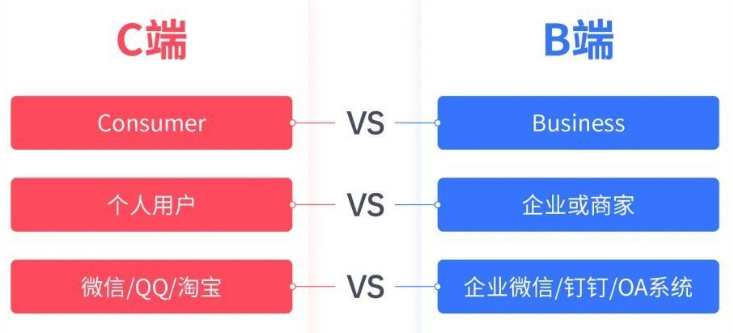

```

C端
“C端”是互联网术语，指的是消费者或个人用户端，主要涉及个人用户，强调用户的使用体验，通常以单个个体使用为主，核心功能是满足用户的基本需求，其他功能多为附加的，旨在为“碎片化的时间”服务，特点是数据量大，因为用户群体庞大，数据增长通常是指数级的

C端产品，C是Consumer的缩写，主要针对的是个人消费者，比如微信、QQ、抖音、淘宝、微博、爱奇艺视频等，更多的是希望引导用户在页面上多停留、消费。

C端产品，解决的是用户在生活场景中的需求痛点；
B端产品服务于组织，组织的需求不是从单个用户需求点出发，而是一种生产关系的连接和延伸。


C端产品的本质基本都是一个核心功能，例如：音乐类的核心功能就是听音乐；阅读类的核心功能就是阅读；游戏类的核心功能就是游戏。

B释义为：Business；通常为企业或商家为工作或商业目的而使用的系统型软件、工具或平台。例如：网易云、网易有数或企业内部的ERP系统等等。

C端&B端产品的本质及特性：

C端产品的特性可以总结为一个词——“分享”例如“评论”、“打赏”其实都基于“分享”，即让他人听见“我”的声音，看见“我”的想法。

B端产品的本质则是满足用户的工作需要，而工作需要从来不是单一的功能就可以满足的，其必然包括多项功能的复合及嵌套应用支持。

B端产品的特性也非常明确——即“协同工作”。在处于信息时代的现代公司或企业中，几乎已没有可以单独完成而不需要协同合作的工作。


B端，主要指针对于商业机构和公司用户的产品，多数都是系统级的管理产品，比如钉钉、OA系统、企业微信等，这类产品希望尽可能的高效、减少投入，帮公司去获得更好的业务体验

随着企业数字化时代的到来，B端产品正渗透到各场景工作中，常见的B端产品有：

办公协作类：如钉钉、石墨、企业微信等；

产品后台类：淘宝后台、微信后台、百度后台等；

平台工具类：微信公众平台、头条号工具等；

资源管理类：CRM系统、SCM系统、ERP系统、OA系统等；

数据可视类：腾讯云图、阿里云、京东云等；
```


b端也叫后台管理系统，面向：运营人员，或者后台管理员，如商城类管理系统，会包含商品管理、用户管理、订单管理、库存管理等信息。商家买这个系统，用来添加商品，管理商品信息。给商家管理用的。可以是人事管理系统，物业管理系统、生产管理系统，销售管理系统，oa办公系统，ERP企业管理系统等。

特点：需要登录才能看，不是面向所有人。

公司有专门的销售人员卖系统，而你作为开发人员，不断的添加新功能。当有客户需要特殊功能的时候，可以做定制化。（加需求，得加钱！）

### 前端端技术栈（B端）

技术栈：Vue3(Options api)  + Vue Router4.x+ElementPlus pinia

插件：axios、lodash、sass，echarts

```bash
pnpm i axios sass lodash
```

### 后端技术栈

nodejs 、express、mongoDB、jwt、restfulAPI

公司的后端多样化，java，php，c#，python，go，c++


项目开发流程 --需求分析-需求文档（产品经理）  

项目经理 

​	------- UI设计人员-》根据需求分析-设置出原型图（https://modao.cc/community?page=1&category=project_basic&jsid=SEM-BAIDU-CJPZ-GW&policy=everyone）

​    -------根据原型图-出设计稿（精细）

​    ------开发

​		   ---前端--静态页面 ---（）mock模拟数据

  		 ---后端---数据库设计--写restful api 接口  

​					如果提前给接口规范文档，前端也可以mock接口数据（模拟）


接口有问题--项目基本完成----搞前后端联调

测试 人员 测试 -》 bug   -》 测试 bug  -》测试     


内侧-》上传测试服务器-

上线-》前端打包以后的html和js-css-图片 上传 公司的服务器 （ftp工具）


## 1.2 项目创建

### vite创建项目

```sh
pnpm create vue
```


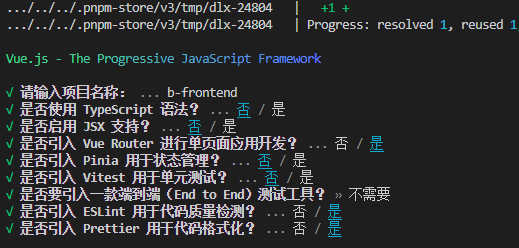


### 安装依赖

```sh
cd 项目文件家
pnpm install
```

### 启动项目

```sh
pnpm dev
```


### 插件安装：Vue - Official 

让vscode中的vue文件 支持vue的语言特性

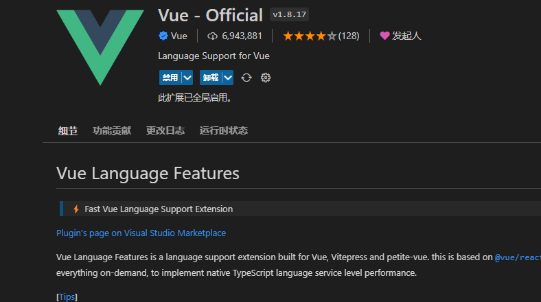


#### 装完 后编写vue文件会自动开启


## 1.3 项目结构

#### 结构总览

```
public/
src/ 源代码目录
	assets/ 项目中静态资源目录
	components/  一般公共组件
	views/		页面组件
	router/      路由目录
	
App.vue   页面根组件
main.js    项目入口js
index.html 项目入口页面
package.json
README.md
vite.config.js   项目的配置文件
```

node_modules:依赖的node工具包目录
public： 一般用于存放一些静态资源文件，例如图片，视频，音频等资源文件。需要特别注意的是			vite或者webpack在进行打包的时候，会将public中的所有静态资源原封不动的进行打包。
src 文件夹：就是指我们存放项目源代码的文件夹，程序员的工作主要在本文件夹内。
src下面的目录结构：
		assets：也是用于存放一些静态资源文件，与public中所不同的是，vite或者webpack在进行打包的时候，会将其认作为一个模块进行打包到js文件里面。
		components： 一般用于存放非路由组件（还有全局组件）。
		router：路由，此处配置项目路由。
		store：状态管理。
		views:路由页面组件
		App.vue:是项目的主组件，页面的入口文件是整个项目的根组件，所有组件的后缀名均为·vue。
		main.js是整个项目的入口文件。也是整个程序最开始执行的文件。

其他配置文件

​		xxx.lock:为了跨机器安装得到一致的结果

​		package.json:项目的说明性文件，用于说明项目的名字，版本，所配置的依赖；

​		README.MD：说明性的一个文件。

​		.gitignore:文件负责标记哪些目录或文件不需要上传到git

​		vue.config.js:是以一个项目的vite配置文件，也叫项目的配置文件

​        使用npm create vue项目的项目配置文件里面自己会有如下代码

```
import { fileURLToPath, URL } from "node:url";

import { defineConfig } from "vite";
import vue from "@vitejs/plugin-vue";

// https://vitejs.dev/config/
export default defineConfig({
  plugins: [vue()],
  resolve: {
    alias: {
      "@": fileURLToPath(new URL("./src", import.meta.url)),
    },
  },
});

```

​		这里要注意 alias 配置项，里面配置了一个项目文件路径的别名@ ，这个@ 在路径中出现永远指向了项目src文件夹，**方便我们在项目的任意文件下通过@使用使用src下面的文件**，而不用 `./views`  或者 '../views'

比如以前这样引入

```
import FindPage from "../views/FindPage.vue";
import App from "./App.vue";
```

现在可以这样引入

```
import FindPage from "@/views/FindPage.vue";
import App from "@/App.vue";
```

使用@的时候想要路径提示，还需要做一个jsonconfig.json配置，不过项目已经自动配置了

jsconfig.json

```
{
  "compilerOptions": {
    "paths": {
      "@/*": ["./src/*"]
    }
  },
  "exclude": ["node_modules", "dist"]
}

```


#### 删除无用文件

assets 里面 样式和图片文件

components里面的组件

views里面的组件

router/index.js 里面配置的路由

main.js里面引入的css

App.vue里面的只剩一个，基本代码即可

```
<script>
import { RouterView } from "vue-router";
</script>
<template>
  <RouterView />
</template>

<style scoped></style>

```


## 1.4 UI组件库element-plus 

element-plus 官网：https://cn.element-plus.org/zh-CN/

饿了么公司出品的适合开发后台和中台组件库

### 1.4.1 依赖安装

```sh
pnpm install element-plus
```

### 1.4.2 按需导入

如果你对打包后的文件大小不是很在乎，那么使用完整导入会更方便。

完整导入

这里我们使用按需导入

这种方式不需要导入任何组件，可以直接在项目中使用 ElementUI 里面的组件

```sh
pnpm install -D unplugin-vue-components unplugin-auto-import
```

### 1.4.3 文件配置

按需导入的配置都是照搬官网文档即可。[按需导入](https://element-plus.gitee.io/zh-CN/guide/quickstart.html#%E6%8C%89%E9%9C%80%E5%AF%BC%E5%85%A5)

```js
// vite.config.js
import { defineConfig } from 'vite'

// Element 按需导入
import AutoImport from 'unplugin-auto-import/vite'
import Components from 'unplugin-vue-components/vite'
import { ElementPlusResolver } from 'unplugin-vue-components/resolvers'

export default defineConfig({
  // ...
  plugins: [
    // ...
   	
    // Element 按需导入
    AutoImport({
      resolvers: [ElementPlusResolver()],
    }),
    Components({
      resolvers: [ElementPlusResolver()],
    }),
  ],
})
```

### 

### 引入组件库的样式

main.js 中引入，主要是一些 element-plus的一些全局函数，需要这个样式

```
import "element-plus/dist/index.css";
```


使用el组件的

```vue
<el-button type="primary">Primary</el-button>
```

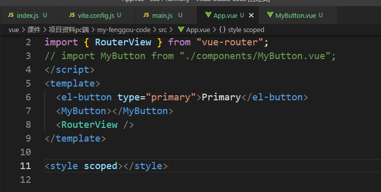


## 1.5 样式重置

#### 依赖安装

```sh
pnpm install normalize.css
```

#### main.js

```js
// main.js 引入
import 'normalize.css'
```

样式重置以后，默认你pading margin 就取消了，其他每个浏览器有差异的样式都被重置了

安装使用sass

```
pnpm i sass
```

安装以后，项目用可以使用sass


### 给页面设置100%高度

```
html,body,#app{
    height: 100%;
}
```

这里给 html，body ，#app ，设置100%高度，主要是防止页面整体滚动，一般管理系统里面都是某个组件内部滚动，页面整体不滚动


引入到mainjs中

```
import "@/assets/styles/index.scss";
```


## 图标安装

```
pnpm install @element-plus/icons-vue
```

注册

```
// 如果您正在使用CDN引入，请删除下面一行。


import * as ElementPlusIconsVue from "@element-plus/icons-vue"

const app = createApp(App)

// 全局注册图标
for (const [key, component] of Object.entries(ElementPlusIconsVue)) {
  app.component(key, component)
}
```


和使用

```

  <!-- 配置 el-icon 组件 -->
  <el-icon :size="size" :color="color">
    <Edit />
  </el-icon>
  <!-- 或者独立使用它，不从父级获取属性 -->
  <Edit style="font-size: 20px; width: 1em; height: 1em; margin-right: 8px" />

  <el-button type="primary" :icon="Edit" circle />

  <el-button type="primary" icon="Share"> Upload </el-button>
```


# 二、项目搭建

## 2.1 布局分析

登录、Layout 在一级路由显示

Layout 下配置二级路由, laytout的侧边栏里面配置管理系统的各个导航菜单，等于layout相当于是首页


## 2.2 一级路由配置

### 路由出口 App.vue

```vue
<template>
  <router-view></router-view>
</template>
```


### views/Layout.vue

```vue
<template>
  <div class="app_layout">
    <header>header</header>
    <aside>aside</aside>
    <main>main</main>
  </div>
</template>
```


#### router/index.js

```js
import Layout from "@/views/Layout/dex.vue";
import Login from "@/views/Login.vue";
import NotFound from "@/views/NotFound.vue";

const router = createRouter({
  history: createWebHashHistory(),
  routes: [
    { path: "/", component: Layout, children: [] },
    { path: "/login", name: "login", component: Login },
      
    { path: "/:pathMatch(.*)*", name: "NotFound", component: NotFound },
  ],
});
```

404路由配置不用记忆  vue-router里面找

 ```
 https://router.vuejs.org/zh/guide/essentials/dynamic-matching.html#%E6%8D%95%E8%8E%B7%E6%89%80%E6%9C%89%E8%B7%AF%E7%94%B1%E6%88%96-404-Not-found-%E8%B7%AF%E7%94%B1
 ```

我们这里需要创建一个NotFound组件即可

src/NotFound.vue

```
<template>
  <div>404 not found</div>
</template>

<script setup></script>

<style lang="scss" scoped></style>

```


## 2.3 Layout 布局


### 2.3.1 效果图分析

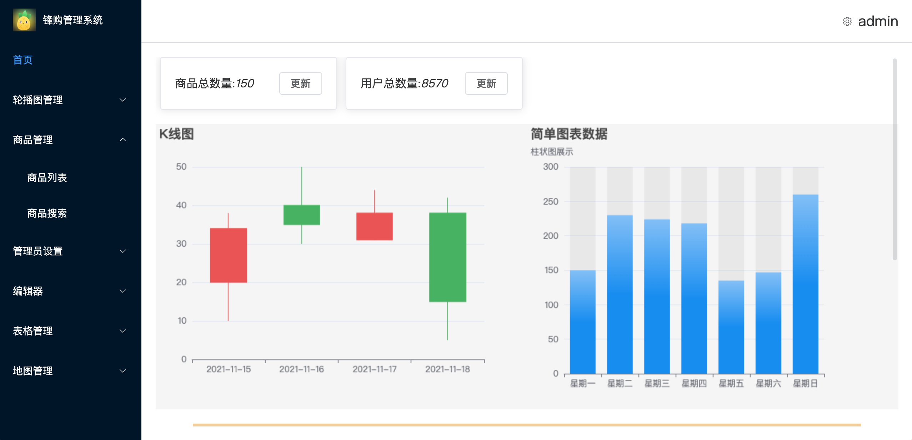

layout页面需要三个块，侧边栏，顶部（不是通栏的），主内容区域，这里我们使用elmentUI 里面提供 的Basic 基础组件/Container 布局容器

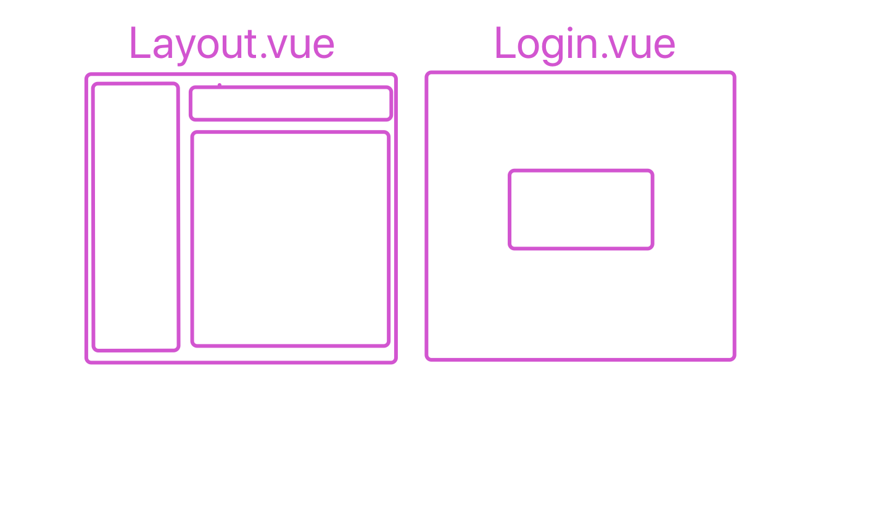

#### el内置组件-Basic 基础组件/Container 布局容器

地址：https://element-plus.gitee.io/zh-CN/component/container.html#%E5%B8%B8%E8%A7%81%E9%A1%B5%E9%9D%A2%E5%B8%83%E5%B1%80

#### Container 布局容器

用于布局的容器组件，方便快速搭建页面的基本结构：

`<el-container>`：外层容器。 当子元素中包含 `<el-header>` 或 `<el-footer>` 时，全部子元素会垂直上下排列， 否则会水平左右排列。

`<el-header>`：顶栏容器。

`<el-aside>`：侧边栏容器。

`<el-main>`：主要区域容器。

`<el-footer>`：底栏容器


我们在常见布局中选择一个 符合我们结构的，复制代码到layout组件中

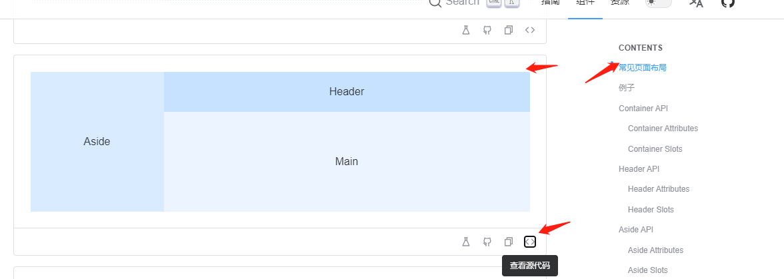

layout组件，稍作修改

```
<template>
  <el-container class="app-layout">
    <el-aside width="200px">Aside</el-aside>
    <el-container>
      <el-header>Header</el-header>
      <el-main>Main</el-main>
    </el-container>
  </el-container>
</template>

<script setup></script>

<style lang="scss" scoped>
.app_ayout {
  height: 100vh;
}
</style>

```

像是直接这样使用也行，但是后期，里面的代码会比较多，所以我们把 侧边栏，头部，内容区域，单独都再封装成三个组件


### 2.3.2 布局

头部栏中，我们把 这个例子中的头部代码和样式复制过来，修改

https://element-plus.gitee.io/zh-CN/component/container.html#%E4%BE%8B%E5%AD%90

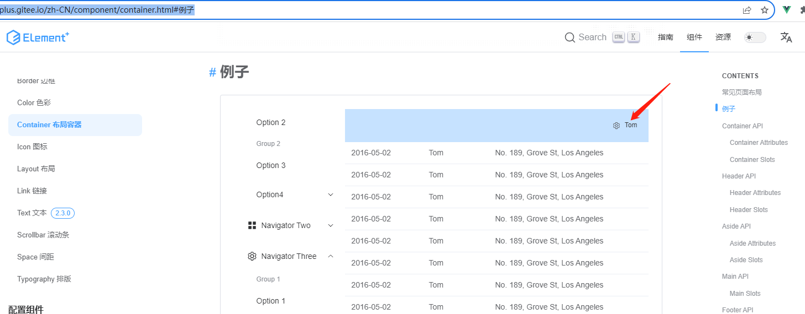

#### el-Header修改

```vue


  <el-header style="text-align: right; font-size: 12px">
    <div class="toolbar">
      <el-dropdown>
        <el-icon style="margin-right: 8px; margin-top: 1px"
          ><setting
        /></el-icon>
        <template #dropdown>
          <el-dropdown-menu>
            <el-dropdown-item>退出</el-dropdown-item>
          </el-dropdown-menu>
        </template>
      </el-dropdown>
      <span>张三</span>
    </div>
  </el-header>
</template>
<script>
export default {};
</script>
<style lang="scss">
.toolbar {
  display: inline-flex;
  align-items: center;
  justify-content: center;
  height: 100%;
  right: 20px;
}
</style>

```


#### 


#### el-aside里面：

侧边栏会用到menu导航

https://element-plus.gitee.io/zh-CN/component/menu.html

我们使用文档中，下面这块这个，可以定义颜色

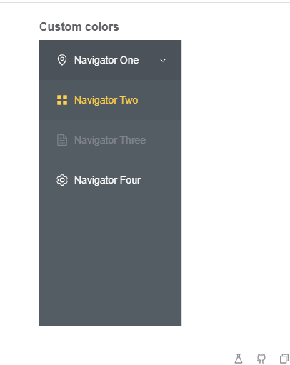

```vue


  <el-aside width="200px">
        <!-- active-text-color 选中的文字颜色-->
         <!-- background-color 背景颜色-->
         <!-- default-active="1" 默认激活的选项-->
      <el-menu
        active-text-color="#409eff"
        background-color="#001529"
        class="el-menu-vertical-demo"
        default-active="1"
        text-color="#fff"
        @open="handleOpen"
        @close="handleClose"
      >
        <el-menu-item>
          <!-- 原生标签直接引入 本地地址 -->
          <!--  -->
          <!-- 封装的组件是动态导入的，必须import的形式引入-并且挂载到data里面 -->
          <el-image :src="url" class="logo"></el-image>
          <!-- <el-image
            src="https://fuss10.elemecdn.com/e/5d/4a731a90594a4af544c0c25941171jpeg.jpeg"
          ></el-image> -->
          <span>锋购管理系统</span>
        </el-menu-item>
        <el-menu-item index="1">
          <el-icon><House /></el-icon>
          <span>首页</span>
        </el-menu-item>
        <el-sub-menu index="2">
          <template #title>
            <el-icon><PictureFilled /></el-icon>
            <span> 用户管理</span>
          </template>
          <el-menu-item index="1-1">用户列表</el-menu-item>
          <el-menu-item index="1-2">用户添加</el-menu-item>
        </el-sub-menu>
      </el-menu>

  </el-aside>


<script>
import url from "@/assets/vue.svg";
export default {
  data() {
    return {
      url,
    };
  },
  methods: {
    handleOpen() {},
    handleClose() {},
  },
};
</script>

<style lang="scss" scoped>
.el-menu {
  height: 100vh;
  .logo {
    width: 35px;
    height: 35px;
    margin-right: 10px;
  }
}

</style>

```


#### el-main里面

这里配置二级路由的出口，后期点击不同的menu，进入不同的二级路由

```

  <el-main>
    <router-view></router-view>
  </el-main>

<script>

```

## 嵌套路由配置


```
import { createRouter, createWebHashHistory } from "vue-router";
const routes = [
  {
    path: "/",
    name: "layout",
    component: () => import("@/views/Layout/index.vue"),
    meta: {
      // 标记当前页面是否需要登录权限
      requireLogin: true,
    },
    redirect: "main",
    children: [
      {
        path: "/main",
        name: "main",
        title: "首页",
        component: () => import("@/views/Main/index.vue"),
      },
      {
        path: "/product-manger",
        title: "商品管理",
        name: "product-manger",
        children: [
          {
            path: "/product-manger/product-list",
            title: "商品列表",
            name: "product-list",
            component: () => import("@/views/ProductList.vue"),
          },
          {
            path: "/product-manger/product-public",
            title: "发布商品",
            name: "product-public",
            component: () => import("@/views/ProductPublic.vue"),
          },
        ],
      }
    ];
    
  },
  {
    path: "/login",
    name: "login",
    title: "登录",
    component: () => import("@/views/Login/index.vue"),
  },
  // 将匹配所有内容并将其放在 `$route.params.pathMatch`
  {
    path: "/:pathMatch(.*)*",
    name: "NotFound",
    component: () => import("@/views/NotFound/index.vue"),
  },
];
const router = createRouter({
  history: createWebHashHistory(),
  routes: routes,
});

export default router;

```


注意layout子路由里的嵌套路由，我们多配置了一层,主要是后面生成侧边导航菜单方便

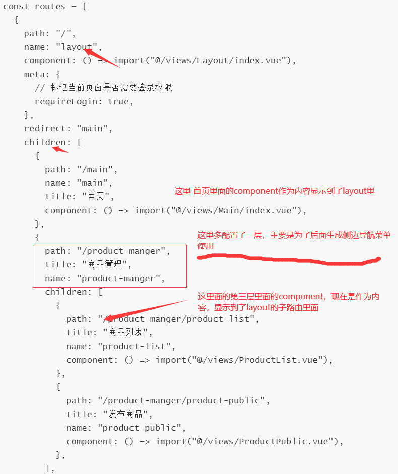

测试一下路由是否正常显示对应的组件！

```
访问/main  layout里面  显示 main.vue
方位 /product-manger/product-list  layout里面  显示 prodcutList.vue
```


# 导航菜单根据路由信息动态生成

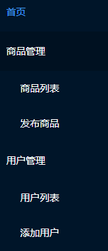

## 导航菜单

导航菜单我们可以直接写死，但是写死了不便于后期的扩展和维护。


写死的如下、

```
 <el-menu
        active-text-color="#409eff"
        background-color="#001529"
        class="el-menu-vertical-demo"
        default-active="1"
        text-color="#fff"
        @open="handleOpen"
        @close="handleClose"
      >
        <el-menu-item>
          <el-image :src="url" class="logo"></el-image>
          <span>锋购管理系统</span>
        </el-menu-item>
        <el-menu-item index="1">
          <el-icon><House /></el-icon>
          <span>首页</span>
        </el-menu-item>
        <el-sub-menu index="2">
          <template #title>
            <el-icon><PictureFilled /></el-icon>
            <span> 商品管理</span>
          </template>
          <el-menu-item index="1-1">商品列表</el-menu-item>
          <el-menu-item index="1-2">添加商品</el-menu-item>
        </el-sub-menu>
      </el-menu>
```

只有一级菜单的使用el-menu-item，有子级菜单的使用el-sub-menu这个

## 提取导航菜单数据

这里我们可以使用路由里面的数据，来生成导航菜单。

登录和layout不需要出现在导航菜单里面。

我们只需要layout的children里面的数据就可以。

所以我们将layout的children数据单独拿出来，提供给路由和生成导航菜单两个地方使用

router里面创建一个menu.js 定义一个数组，就是layout里面children里面的数据，导出

```
let menuArr = [
  {
    path: "/main",
    name: "main",
    title: "首页",
    component: () => import("@/views/Main/index.vue"),
  },
  {
    path: "/product-manger",
    title: "商品管理",
    name: "product-manger",
    children: [
      {
        path: "/product-manger/product-list",
        title: "商品列表",
        name: "product-list",
        component: () => import("@/views/ProductList.vue"),
      },
      {
        path: "/product-manger/product-public",
        title: "发布商品",
        name: "product-public",
        component: () => import("@/views/ProductPublic.vue"),
      },
    ],
  },
  {
    path: "/user-manger",
    title: "用户管理",
    name: "user-manger",
    children: [
      {
        path: "/user-manger/user-list",
        title: "用户列表",
        name: "user-list",
        component: () => import("@/views/UserList.vue"),
      },
      {
        path: "/user-manger/user-add",
        title: "添加用户",
        name: "user-add",
        component: () => import("@/views/UserAdd.vue"),
      },
    ],
  },
  {
    path: "/banner-manger",
    title: "轮播管理",
    name: "banner-manger",
    component: () => import("@/views/BannerList/index.vue"),
  },
];

export default menuArr;

```


路由里面仍然可以使用,

先导入，然后在laytout的children地方使用

```
import { createRouter, createWebHashHistory } from "vue-router";
import menuArr from "./menu.js";
const routes = [
  {
    path: "/",
    name: "layout",
    component: () => import("@/views/Layout/index.vue"),
    meta: {
      // 标记当前页面是否需要登录权限
      requireLogin: true,
    },
    redirect: "main",
    children: [...menuArr],
  },
  {
    path: "/login",
    name: "login",
    title: "登录",
    component: () => import("@/views/Login/index.vue"),
  },
  // 将匹配所有内容并将其放在 `$route.params.pathMatch`
  {
    path: "/:pathMatch(.*)*",
    name: "NotFound",
    component: () => import("@/views/NotFound/index.vue"),
  },
];
const router = createRouter({
  history: createWebHashHistory(),
  routes: routes,
});

export default router;

```

## 组件递归-生成侧边导航

侧边导航这里，我们就可以使用这个数据。

如果测导航菜单最多只有两级，我们这里遍历menuArr 使用两个vfor嵌套就行

```
    <el-aside width="200px">
      <el-menu
        active-text-color="#409eff"
        background-color="#001529"
        class="el-menu-vertical-demo"
        :default-active="$route.path"
        text-color="#fff"
        @open="handleOpen"
        @close="handleClose"
      >
        <el-menu-item>
          <el-image :src="url" class="logo"></el-image>
          <span>锋购管理系统</span>
        </el-menu-item>
        <template v-for="(item, index) in menuArr" :key="index">
          <el-sub-menu v-if="item.children" :index="item.path">
            <template #title>
              <span>
                {{ item.title }}
              </span>
            </template>
            <el-menu-item
              v-for="(v, i) in item.children"
              :key="i"
              :index="v.path"
            >
              <span>{{ v.title }}</span>
            </el-menu-item>
          </el-sub-menu>
          <el-menu-item v-else :index="item.path">
            <span>{{ item.title }}</span>
          </el-menu-item>
        </template>
      </el-menu>
    </el-aside>
```

js

```
<script>
import url from "@/assets/vue.svg";
import menuArr from "@/router/menu";
export default {
  data() {
    return {
      url,
      // menuList,
      menuArr,
      username: "zhangsan",
    };
  },
  methods: {
    handleOpen() {},
    handleClose() {},
    menuClick(v) {
      console.log(v);
      this.$router.push({ name: v.name });
    },
  },
};
</script>
```


如果可能有两层以上的菜单，也就是多层，改怎么办呢？再嵌套循环？no，用递归，组件也可以递归，一个组件内部也可以使用自己，这叫组件递归，组件递归可以生成无限级的菜单。

需要定义一个组件MyMenuItem，传入数组

```
 <el-aside width="200px">
      <el-menu
        active-text-color="#409eff"
        background-color="#001529"
        class="el-menu-vertical-demo"
        :default-active="currentIndex"
        text-color="#fff"
        @open="handleOpen"
        @close="handleClose"
      >
        <el-menu-item>
          <el-image :src="url" class="logo"></el-image>
          <span>锋购管理系统</span>
        </el-menu-item>
        <MyMenuItem :data="menuArr" />
      </el-menu>
    </el-aside>
    
```

记得注册这个组件

````
script>
import url from "@/assets/vue.svg";
import MyMenuItem from "./MyMenuItem.vue";
import menuArr from "@/router/menu";
export default {
  components: { MyMenuItem }
 } 
````

定义组件MyMenuItem

在组件里面遍历传入的数组，判断是否有子级，

如果没有子级直接使用el-menu-item，

如果有子级，使用el-sub-menu，然后在el-sub-menu组件的最后再次使用组件自己，就是递归组件自己

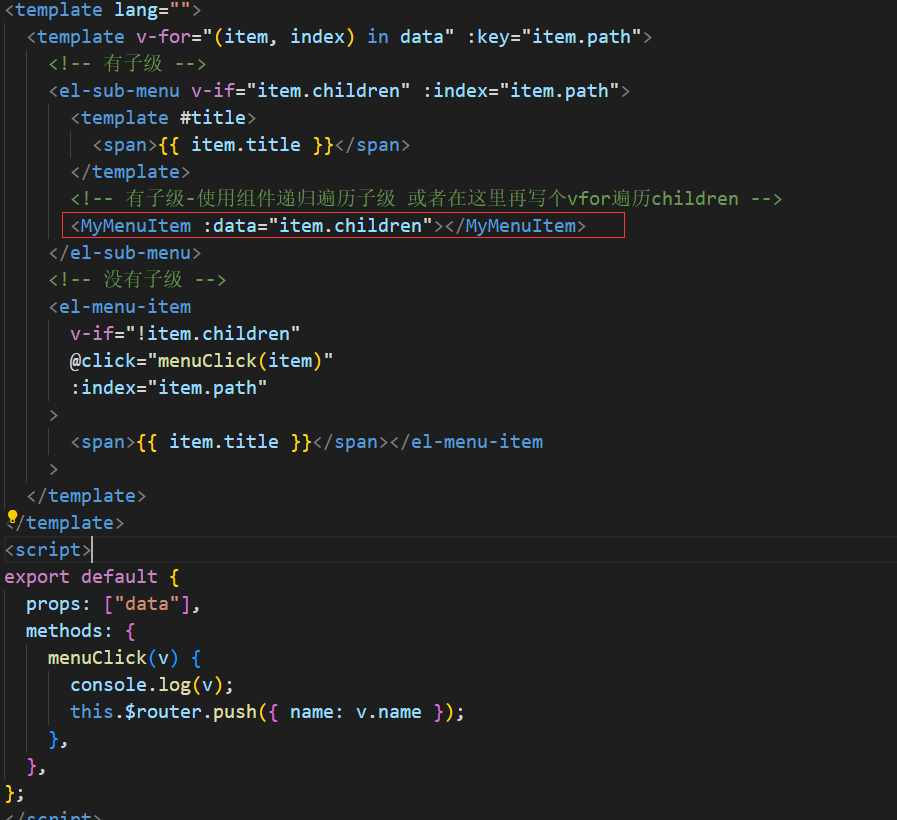

```
<template lang="">
  <template v-for="(item, index) in data" :key="item.path">
    <!-- 有子级 -->
    <el-sub-menu v-if="item.children" :index="item.path">
      <template #title>
        <span>{{ item.title }}</span>
      </template>
      <!-- 有子级-使用组件递归遍历子级 或者在这里再写个vfor遍历children -->
      <MyMenuItem :data="item.children"></MyMenuItem>
    </el-sub-menu>
    <!-- 没有子级 -->
    <el-menu-item
      v-if="!item.children"
      @click="menuClick(item)"
      :index="item.path"
    >
      <span>{{ item.title }}</span></el-menu-item
    >
  </template>
</template>
<script>
export default {
  props: ["data"],
  methods: {
    menuClick(v) {
      console.log(v);
      this.$router.push({ name: v.name });
    },
  },
};
</script>
<style lang=""></style>

```

这里还有一些属性，el-sub-menu 和el-menu-item都需要 index属性，index必须是唯一的，我们把路由的path属性绑定上去

el-menu需要配置一个默认选中的菜单的属性，属性值是要选中菜单的index，这里我们配置首页即可

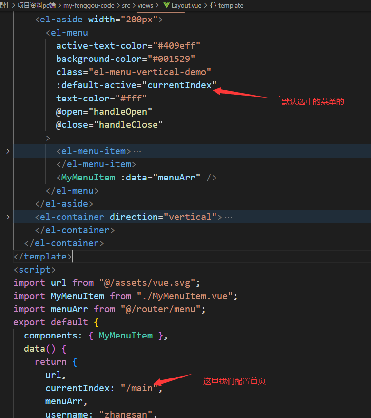


# 三、登录功能

## 3.1 效果图

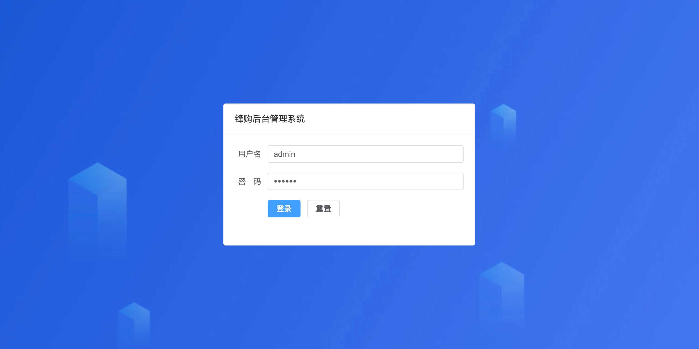


## 3.2 页面布局

#### 整体背景

```
<template>
  <div class="app_login">
  </div>
</template>

<style lang="scss">
.app_login {
  height: 100%;
  background-image: url("@/assets/images/bg.jpg");

}

```


#### card组件

参考  文档 https://element-plus.gitee.io/zh-CN/component/card.html#%E5%B8%A6%E6%9C%89%E9%98%B4%E5%BD%B1%E6%95%88%E6%9E%9C%E7%9A%84%E5%8D%A1%E7%89%87

用card组件，搭个基本架子，水平垂直居中

```
<template>
  <div class="app_login">
    <el-card shadow="hover">
      <template #header>
          <h3>锋购管理系统</h3>
      </template>
      内容
    </el-card>
  </div>
</template>
<script setup></script>
<style lang="scss">
.app_login {
  height: 100%;
  background-image: url("@/assets/images/bg.jpg");
  display: flex;
  .el-card {
    width: 400px;
    height: 300px;
    margin: auto;
    .card-header {
      text-align: center;
    }
  }
}
</style>

```


#### Form 表单

登录的表单


参考：https://element.eleme.cn/#/zh-CN/component/form

复制里面的--自定义校验规则--这个例子的代码修改

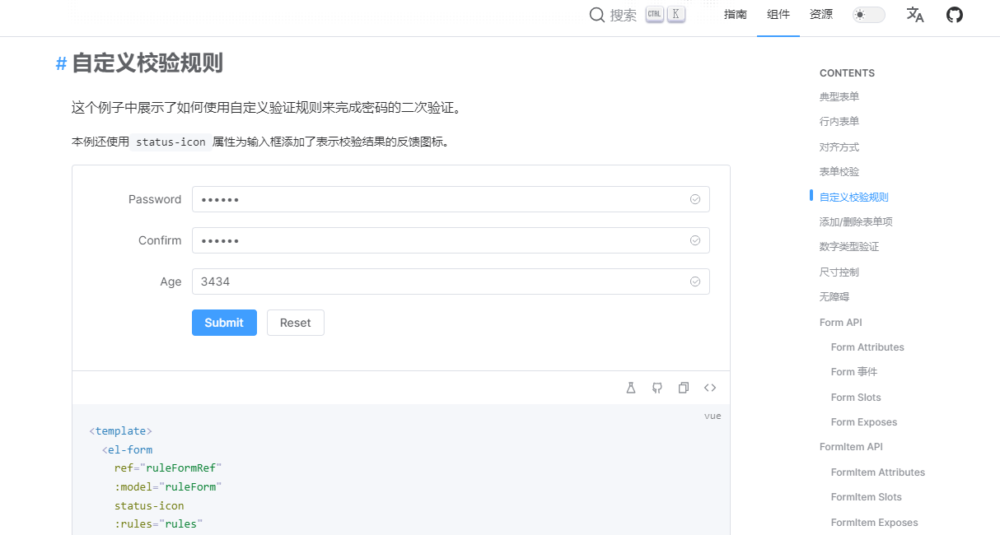


修改的结构如下

```
 <el-form ref="ruleFormRef" :model="loginForm" status-icon :rules="rules" label-width="120px">
        <el-form-item label="用户名" prop="username">
          <el-input
            v-model="loginForm.username"
            type="text"
            autocomplete="off"
          />
        </el-form-item>
        <el-form-item label="密&nbsp;&nbsp;&nbsp;&nbsp;码" prop="password">
          <el-input
            v-model="loginForm.password"
            type="password"
            autocomplete="off"
          />
        </el-form-item>

        <el-form-item>
          <el-button type="primary" @click="submitForm()">登录</el-button>
          <el-button @click="resetForm()">重置</el-button>
        </el-form-item>
      </el-form>
```


el-form   里面主要是  ` :model="loginForm"`   和 `:rules="rules" `

​		loginForm  是表单绑定的数据，需要提前在data里面定义好

​        rules 里面表单里面的校验规则，需要提前在data里面定义好


`Form` 组件提供了表单验证的功能，只需为 `rules` 属性传入约定的验证规则，并将 `form-Item` 的 `prop` 属性设置为需要验证的特殊键值即可

```
 loginForm: {
        username: "",
        password: "",
 },
 rules: {
        username: [
          {
            required: true,
            message: "用户名只能是以字母开头，只能是数字字母下划线组成，至少5位",
            pattern: /^[a-zA-Z]\w{4,}$/
          }
        ],
        password: [
          {
            required: true,
            trigger: "blur",
          },
        ],
      },
```


​        rules 里面表单里面的校验规则

```
 username: [
          {
          	//必填字段
            required: true,
            //检验的触发时机，在失去焦点的时候
            trigger: "blur",
           
          },
        ],
```


​			

el-form  里面的  ref="ruleFormRef"  一会在提交的时候需要用到这个表单的dom


el-form-item 主要是 ` prop="username"` 

​		表示这个item的验证规则是 rules 里面的 username验证规则

el-form-item 主要是 ` prop="password"` 

​		表示这个item的验证规则是 rules 里面的 username验证规则

el-input  主要是 ` v-model="loginForm.password" `  

​			表示input绑定的是 loginForm.password


```

<template>
  <div class="app_login">
    <el-card shadow="hover">
      <template #header>
        <h3>锋购后台管理系统</h3>
      </template>
      <el-form ref="ruleFormRef" :model="loginForm" status-icon :rules="rules" label-width="120px">
        <el-form-item label="用户名" prop="username">
          <el-input
            v-model="loginForm.username"
            type="text"
            autocomplete="off"
          />
        </el-form-item>
        <el-form-item label="密&nbsp;&nbsp;&nbsp;&nbsp;码" prop="password">
          <el-input
            v-model="loginForm.password"
            type="password"
            autocomplete="off"
          />
        </el-form-item>

        <el-form-item>
          <el-button type="primary" @click="submitForm()">登录</el-button>
          <el-button @click="resetForm()">重置</el-button>
        </el-form-item>
      </el-form>
    </el-card>
  </div>
</template>
```


#### 自定义校验规则

地址：https://element-plus.gitee.io/zh-CN/component/form.html#%E8%87%AA%E5%AE%9A%E4%B9%89%E6%A0%A1%E9%AA%8C%E8%A7%84%E5%88%99

rules里面 使用validator 函数定义 检验处理函数

​		value 是输入框的值，

​		callback 如果校验有问题调用 callback 传入 参数 `new Error("用户名至少是5为数字字母下划线")`	，参数里面的描述文字会在表单里面提示

​						如果校验没问题调用callback不用传入参数

​							


```
      rules: {
        username: [
          {
            required: true,
            trigger: "blur",
            validator: function (rule, value, callback) {
              console.log(rule, value);
              let reg = /^\w{5,}$/;
              if (!reg.test(value)) {
                callback(new Error("用户名至少是5为数字字母下划线"));
              } else {
                callback();
              }
            },
          },
        ],
        password: [
          {
            required: true,
            validator: function (rule, value, callback) {
              console.log(rule, value);
              let reg = /^\w{5,}$/;

              if (!reg.test(value)) {
                callback(new Error("密码至少是5为数字字母下划线"));
              } else {
                callback();
              }
            },
            trigger: "blur",
          },
        ],
      },
```


登录按钮和重置按钮

```
      <el-button type="primary" @click="submitForm()">登录</el-button>
       <el-button @click="resetForm()">重置</el-button>
```

事件

```
 methods: {
    resetForm() {
      this.$refs.ruleFormRef.resetFields();
      console.log("resetForm");
    },
    submitForm(formEl) {
      this.$refs.ruleFormRef.validate((valid) => {
        if (valid) {
          console.log("submit!");
          console.log(this.loginForm);
        } else {
          console.log("error submit!");
          return false;
        }
      });
    },
  },
```


登录整体如下：


```vue
<template>
  <div class="app_login">
    <el-card shadow="hover">
      <template #header>
        <h3>锋购后台管理系统</h3>
      </template>
      <el-form
        ref="ruleFormRef"
        :model="loginForm"
        status-icon
        :rules="rules"
        label-width="120px"
      >
        <el-form-item label="用户名" prop="username">
          <el-input
            v-model="loginForm.username"
            type="text"
            autocomplete="off"
          />
        </el-form-item>
        <el-form-item label="密&nbsp;&nbsp;&nbsp;&nbsp;码" prop="password">
          <el-input
            v-model="loginForm.password"
            type="password"
            autocomplete="off"
          />
        </el-form-item>

        <el-form-item>
          <el-button type="primary" @click="submitForm()">登录</el-button>
          <el-button @click="resetForm()">重置</el-button>
        </el-form-item>
      </el-form>
    </el-card>
  </div>
</template>
<script>
export default {
  data() {
    return {
      loginForm: {
        username: "",
        password: "",
      },
      rules: {
        username: [
          {
            required: true,
            trigger: "blur",
            validator: function (rule, value, callback) {
              console.log(rule, value);
              let reg = /^\w{5,}$/;
              if (!reg.test(value)) {
                callback(new Error("用户名至少是5为数字字母下划线"));
              } else {
                callback();
              }
            },
          },
        ],
        password: [
          {
            required: true,
            validator: function (rule, value, callback) {
              console.log(rule, value);
              let reg = /^\w{5,}$/;

              if (!reg.test(value)) {
                callback(new Error("密码至少是5为数字字母下划线"));
              } else {
                callback();
              }
            },
            trigger: "blur",
          },
        ],
      },
    };
  },
  mounted() {
    console.log(this.$refs.ruleFormRef);
    console.log("mounted");
  },
  methods: {
    resetForm() {
      this.$refs.ruleFormRef.resetFields();
      console.log("resetForm");
    },
    submitForm(formEl) {
      this.$refs.ruleFormRef.validate((valid) => {
        if (valid) {
          console.log("submit!");
          console.log(this.loginForm);
        } else {
          console.log("error submit!");
          return false;
        }
      });
    },
  },
};
</script>
<style lang="scss">
.app_login {
  // width: 100%;
  height: 100%;
  // background-color: red;
  background-image: url("@/assets/images/bg.jpg");
  display: flex;
  justify-content: center;
  align-items: center;
  .el-card {
    width: 400px;
    height: 300px;
    // margin: auto;
    .card-header {
      text-align: center;
    }
  }
}
.el-input__validateIcon {
  color: green;
}
</style>

```

接下来可以做登录的请求功能，先配置一下axios


# 四、接口服务器

hi-server 后端项目 启动

```
保证正常安装了 mongoDB
 依赖删除重装pnpm i
 插入管理员 cd mysql  -》 node test.js
 markdown 插入商品的链接-访问下
```


1. 下载项目

2. 进入项目目录，安装依赖

   ```sh
   npm install
   ```

3. 运行项目

   ```sh
   npm run start
   ```

4. 导入商品数据

 GET: http://localhost:3001/api/pro/uploadPro

5. 添加超级管理员

   ```sh
   cd mysql
   node test.js

   # admin/123456
   ```

6. OK

### 接口文档地址

http://localhost:3001/admindoc

> 只需要导入商品数据 和 超级管理员账号即可，其余数据均是通过用户操作取得


请求的基地址

```
http://localhost:3001/
```


# 五 、axios二次封装

安装axios

```
pnpm i axios
```

#### src/api/request.js

创建文件，创建实例，拦截器配置，导出实例


创建请求实例

https://www.axios-http.cn/docs/instance

```
const http = axios.create({
  baseURL: 'http://localhost:3001/admin',
  timeout: 60000,
});
export default http
```

拦截器配置

https://www.axios-http.cn/docs/interceptors

```
// 添加请求拦截器
http.interceptors.request.use(function (config) {
    // 在发送请求之前做些什么
    //读取本地的token，根据接口文档要求，设置到请求头里面
    return config;
  }, function (error) {
    // 对请求错误做些什么
    return Promise.reject(error);
  });

// 添加响应拦截器
http.interceptors.response.use(function (response) {
    // 2xx 范围内的状态码都会触发该函数。
    // 对响应数据做点什么
    return response;
  }, function (error) {
    // 超出 2xx 范围的状态码都会触发该函数。
    // 对响应错误做点什么
    return Promise.reject(error);
  });
```


axios的使用

```
// axios.get('url',{params:""}) get请求搜索参数
// axios.post('url',请求体)
// axios.put('url',请求体)
// axios.patch('url',请求体)
// axios.delete('url')

// axios({
//   url: "",
//   method: "get",
//   params: {} //搜索参数
// })

// axios({
//   url: "",
//   method: "post",
//   data: {} //请求体对象
// })
// axios({
//   url: "",
//   method: "put", //patch
//   data: {} //请求体对象
// })

// axios({
//   url: "",
//   method: "delete"
// })

```


### 请求拦截器 

请求之前判断本地是否有token ，有的 就根据接口文档要求 携带token

```

// 请求前执行
instance.interceptors.request.use(
  function (config) {
    // debugger
    // 在发送请求之前做些什么
    // ***********
    // 请求之前判断本地是否有token ，有的 就根据接口文档要求 携带token
    let token = localStorage.getItem("token")
    if (token) {
      config.headers.token = token
    }

    return config
  },
  function (error) {
    // 对请求错误做些什么
    return Promise.reject(error)
  }
)
```


### 响应拦截处理登录过期

```

// 添加响应拦截器
// 服务器返回数据了
instance.interceptors.response.use(
  function (response) {
    // 对响应数据做点什么
    // debugger
    if (response.data.code == 10119) {
      //token 无效---登录过期了
      ElMessage({
        message: response.data.message,
        type: "error"
      })
      //删除本地token
      localStorage.removeItem("token")
      // this.$router 不是在组件内部 不能用组件实例的属性
      router.push("/login")
    }
    return response
  },
  function (error) {
    // 对响应错误做点什么
    return Promise.reject(error)
  }
)
```


# 六、登录接口

### 接口文档

```
http://localhost:3001/admindoc/#api-Admin-PostLogin
```

登录接口

POST

```http
http://localhost:3001/admin/admin/login
```

参数

| 字段      | 类型   | 描述             |
| :-------- | :----- | :--------------- |
| adminname | string | 管理员账号 admin |
| password  | string | 密码 123456      |

Success 200

| 字段    | 类型   | 描述    |
| :------ | :----- | :------ |
| code    | String | 状态码. |
| message | String | 描述    |

- [Success-Response:](http://localhost:3001/admindoc/#success-examples-Admin-PostLogin-0_0_0-0)

```json
HTTP/1.1 200 OK
{
  "code": "200" || '10003' || '10005',
  "message": "登录成功" || 密码错误 ｜| 未注册,
}
```


### src/api/user.js

先配置请求方法loginRequest

```


import http from "@/api/request"


/**
 * 登录接口
 * @param {*} params  {adminname,password}
 * @returns
 */
export function loginRequest(adminname, password) {
  // http调用返回的是promise对象
  let p = http({
    method: "post",
    url: "/admin/admin/login",
    data: { adminname, password }
  })
  //   返回promsie  对象 ，外部就可以直接使用 p对象，就能知道 函数内部ajax请求状态
  return p
}


```

安装jsdoc vscode插件，函数写好以后，编辑器中输入 /** 回车  可以写jsdoc注释，jsdoc注释可以让我们使用函数的时候，有代码提示


### 登录页使用

登录按钮的点击事件内部，发起登录请求，成功以后把token存入本地，跳转到首页


#### ElMessage

不管是登录成功还是失败都弹出提示

登录失败，使用ElMessage 弹出失败的提示

登录成功，使用ElMessage 弹出成功提示

https://element-plus.gitee.io/zh-CN/component/message.html

引入ElMessage

```
import { ElMessage } from 'element-plus'
```

使用时调用此方法为 `ElMessage(options)`


登录按钮点击事件的逻辑

```
submitForm() {
      console.log(this.$refs.ruleForm) //获取表单组件
      //调用表单组件的自己方法 获取表单内部验证结果
      this.$refs.ruleForm.validate((r) => {
        console.log(r)
        if (r) {
          //通过验证
          //发起的登录请求
          loginRequest()
          loginRequest(this.ruleForm.username, this.ruleForm.pass).then((r) => {
            console.log(r.data)
            if (r.data.code == 200) {
              // 请求成功以后存入数据
              localStorage.setItem("token", r.data.data.token)
              localStorage.setItem("adminname", r.data.data.adminname)
              ElMessage({
                showClose: true,
                message: r.data.message,
                type: "success"
              })

              // 跳转到首页
              this.$router.push("/home")
            } else {
              ElMessage({
                showClose: true,
                message: r.data.message,
                type: "error"
              })
            }
          })
        } else {
          //没有通过验证

          ElMessage({
            showClose: true,
            message: "请检查输入框的内容",
            type: "error"
          })
        }
      })
    },
```

# 七、路由拦截

### 页面登录权限的访问控制-路由守卫

上面我们登录成功以后跳转到了首页。

其实用户直接在浏览器中输入框登录页的地址也是可以直接访问到的，但是这样是不合适的！

对于这种需要登录权限的页面，我们需要在路由的路由元中做一个配置，同时在路由跳转的时候，

**在路由守卫中获取当前的页面的路由元信息** ，结合**用户的当前登录状态**，**来做判断**

#### 1-router/index.js中-meta标记路由

路由文件中 给需要登录权限的页面路由添加标记字段，标记这个页面需要登录

```
 {
      path: "/",
      name: "layout",
      component: () => import("@/views/Layout/index.vue"),
      meta: {
        // 标记当前页面是否需要登录权限
        requireLogin: true,
      },
    },
```

#### 2-全局路由守卫beforeEach中判断

可以直接在router/index.js中写路由守卫，但是为了后期维护方便，我们把权限的配置专门放到router/permission.js这个文件中


创建 router/permission.js,配置到路由守卫，引入到mian.js文件  


```
//这个文件专门处理 用户权限的逻辑

function checkPermission(router) {
  router.beforeEach((to, from) => {
    let token = localStorage.getItem("token")
    if (to.meta.requireLogin == true) {
      //判断要跳转的页面 是否需要登录，如果需要就判断 是否有token
      // 如果没有 ，就跳转到 登录，
      if (token) {
        // next()
      } else {
        return { path: "/login" }
        // next({ path: "/login" })
      }
    } else {
      // next()
    }
  })
}

export default checkPermission

```


main.js中在引入router 之后 引入permission权限文件

```
import router from "./router";
import checkPermission from "./permission"

//调用要router 创建以后


const router = createRouter({
  history: createWebHashHistory(),
  routes: routes
})

checkPermission(router)

```


# 八、登录成功以后header中显示用户名-退出登录


### 登录成功以后，把用户名也存入本地

然后在laytout里面可以读取出来，成为data，然后header模版中使用


```
<template lang="">
  <el-header class="header" style="text-align: right; font-size: 12px">
    <div class="toolbar">
      <el-dropdown>
        <el-icon style="margin-right: 8px; margin-top: 1px"
          ><setting
        /></el-icon>
        <template #dropdown>
          <el-dropdown-menu>
          	<!-- 2- 退出按钮的点击事件 -->
            <el-dropdown-item @click="exitHandler()">退出</el-dropdown-item>
          </el-dropdown-menu>
        </template>
      </el-dropdown>
      <!-- 1- 显示用户名 --!>
      <span>{{ username }}</span>
    </div>
  </el-header>
</template>
```

js

```
  mounted() {
    this.username = localStorage.getItem("username");
  },
```


methods 里面添加

```
 exitHandler() {
      localStorage.removeItem("username");
      localStorage.removeItem("token");
      this.$router.push("/login");
    },
```


# 九、首页展示


### 创建首页组件Main

views/main/index.vue

```
<template lang="">
  <div>首页组件</div>
</template>
<script>
export default {};
</script>
<style lang=""></style>

```


### 配置layout的 二级路由

并且将根路径重定向到main组件


```
{
      path: "/",
      name: "layout",
      component: () => import("@/views/Layout/index.vue"),
      meta: {
        requireLogin: true,
      },
      //根路径，重定向到main页面
      redirect: "main",

      //配置根路径的 二级路由
      children: [
        { path: "main", title: "首页", name: "main",component: () => import("@/views/Main/index.vue"),
 },
      ],
    },
```

二级路由的出口已经在上面配置过了


在layout页面的content组件里面配置了`<router-view></router-view>`

```

  <el-main>
    <router-view></router-view>
  </el-main>


```


配置完以后，再打开http://localhost:5173/ 会自动重定向到 http://localhost:5173/#/main 

## 7.1 商品数量和用户数量的展示

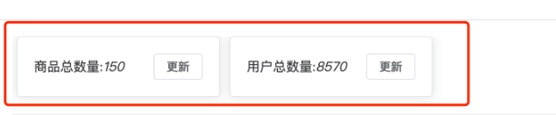

### Statistic - 商品总数量接口

GET

```http
http://localhost:3001/admin/statistic/product


http://localhost:3001/admin/statistic/user

```

Header

| 字段  | 类型   | 描述  |
| :---- | :----- | :---- |
| token | String | token |

 成功返回：

```json
{
  code: '200',
  message: '商品总数量',
  data
}
```


### api/api.js

添加接口地址配置

```js
statistic: "/statistic", // 商品总数量
```


### api/data.js:

添加接口请求配置

```js
import base from "./base";
import request from "./request";

/**
 * 首页用于展示的 - 商品总数量
 * @returns
 */
export const getStatisticDataApi = (type) =>
  request.get(base.statistic + `/${type}`);

```


### mian/index.vue 组件


这里面我们使用el-col和el-row 实现 行列布局 ，在列中放入el-card实现卡片布局

#### el-row组件和el-col组件 

参考 https://element-plus.gitee.io/zh-CN/component/layout.html

##### 使用行和列创建基础网格布局。

通过 `row` 和 `col` 组件，并通过 col 组件的 `span` 属性我们就可以自由地组合布局。

通过基础的 24 分栏，迅速简便地创建布局。

一个row可以分成了24栏，可以通过在row里面设置col

```
<template>
	
  <el-row>
    <el-col :span="24"><div class="grid-content ep-bg-purple-dark" /></el-col>
  </el-row>
  <el-row>
    <el-col :span="12"><div class="grid-content ep-bg-purple" /></el-col>
    <el-col :span="12"><div class="grid-content ep-bg-purple-light" /></el-col>
  </el-row>
  <el-row>
    <el-col :span="8"><div class="grid-content ep-bg-purple" /></el-col>
    <el-col :span="8"><div class="grid-content ep-bg-purple-light" /></el-col>
    <el-col :span="8"><div class="grid-content ep-bg-purple" /></el-col>
  </el-row>
  <el-row>
    <el-col :span="6"><div class="grid-content ep-bg-purple" /></el-col>
    <el-col :span="6"><div class="grid-content ep-bg-purple-light" /></el-col>
    <el-col :span="6"><div class="grid-content ep-bg-purple" /></el-col>
    <el-col :span="6"><div class="grid-content ep-bg-purple-light" /></el-col>
  </el-row>
  <el-row>
    <el-col :span="4"><div class="grid-content ep-bg-purple" /></el-col>
    <el-col :span="4"><div class="grid-content ep-bg-purple-light" /></el-col>
    <el-col :span="4"><div class="grid-content ep-bg-purple" /></el-col>
    <el-col :span="4"><div class="grid-content ep-bg-purple-light" /></el-col>
    <el-col :span="4"><div class="grid-content ep-bg-purple" /></el-col>
    <el-col :span="4"><div class="grid-content ep-bg-purple-light" /></el-col>
  </el-row>
</template>

<style lang="scss">
.el-row {
  margin-bottom: 20px;
}
.el-row:last-child {
  margin-bottom: 0;
}
.el-col {
  border-radius: 4px;
}

.grid-content {
  border-radius: 4px;
  min-height: 36px;
}
</style>

```

##### 分栏间隔

支持列间距。

行提供 `gutter` 属性来指定列之间的间距，其默认值为0。

```
 <el-row :gutter="20">
    <el-col :span="6"><div class="grid-content ep-bg-purple" /></el-col>
    <el-col :span="6"><div class="grid-content ep-bg-purple" /></el-col>
    <el-col :span="6"><div class="grid-content ep-bg-purple" /></el-col>
    <el-col :span="6"><div class="grid-content ep-bg-purple" /></el-col>
  </el-row>
```


##### 对齐方式

默认使用 flex 布局来对分栏进行灵活的对齐。

可以通过`justify` 属性来定义子元素的排版方式，其取值为start、center、end、space-between、space-around或space-evenly。

```
<template>
  <el-row class="row-bg">
    <el-col :span="6"><div class="grid-content ep-bg-purple" /></el-col>
    <el-col :span="6"><div class="grid-content ep-bg-purple-light" /></el-col>
    <el-col :span="6"><div class="grid-content ep-bg-purple" /></el-col>
  </el-row>
  <el-row class="row-bg" justify="center">
    <el-col :span="6"><div class="grid-content ep-bg-purple" /></el-col>
    <el-col :span="6"><div class="grid-content ep-bg-purple-light" /></el-col>
    <el-col :span="6"><div class="grid-content ep-bg-purple" /></el-col>
  </el-row>
  <el-row class="row-bg" justify="end">
    <el-col :span="6"><div class="grid-content ep-bg-purple" /></el-col>
    <el-col :span="6"><div class="grid-content ep-bg-purple-light" /></el-col>
    <el-col :span="6"><div class="grid-content ep-bg-purple" /></el-col>
  </el-row>
  <el-row class="row-bg" justify="space-between">
    <el-col :span="6"><div class="grid-content ep-bg-purple" /></el-col>
    <el-col :span="6"><div class="grid-content ep-bg-purple-light" /></el-col>
    <el-col :span="6"><div class="grid-content ep-bg-purple" /></el-col>
  </el-row>
  <el-row class="row-bg" justify="space-around">
    <el-col :span="6"><div class="grid-content ep-bg-purple" /></el-col>
    <el-col :span="6"><div class="grid-content ep-bg-purple-light" /></el-col>
    <el-col :span="6"><div class="grid-content ep-bg-purple" /></el-col>
  </el-row>
  <el-row class="row-bg" justify="space-evenly">
    <el-col :span="6"><div class="grid-content ep-bg-purple" /></el-col>
    <el-col :span="6"><div class="grid-content ep-bg-purple-light" /></el-col>
    <el-col :span="6"><div class="grid-content ep-bg-purple" /></el-col>
  </el-row>
</template>
```


#### 数量统计的整体布局


这里使用样式穿透设置了el-card__body里面的内容flex的对齐方式

```vue
<template lang="">
  <el-row :gutter="12">
    <el-col :span="6">
      <el-card shadow="always" class="statistic_count">
        <span>商品总数 : {{ userCount }} </span>
        <el-button @click="getProductData">更新</el-button>
      </el-card>
    </el-col>
    <el-col :span="6">
      <el-card shadow="always" class="statistic_count">
        <span> 用户总数 : {{ prodcutCount }} </span>
        <el-button @click="getUserData">更新</el-button>
      </el-card>
    </el-col>
  </el-row>
</template>

<style lang="scss" scoped>
.statistic_count {
  // 深层穿透  将el-card__body里面的 span 和 button 两端
  :deep(.el-card__body) {
    // .el-card__body {
    display: flex;
    justify-content: space-between;
    align-items: center; // span 文件垂直居中
  }
}

</style>
```

js

```
<script>
export default {
  data() {
    return { userCount: 0, prodcutCount: 0 };
  },
  methods: {
    getProductData() {},
    getUserData() {},
  },
};
</script>
```


## Vue样式隔离与样式穿透（deep使用）

### 1. Vue样式隔离scope

Vue组件之间没有做到样式隔离，Vue中的样式隔离，是通过`scoped`属性来实现的。当在`<style>`标签上使用`scoped`属性时.基本原理概括为以下几个步骤：

1. 为当前组件模板的所有DOM节点添加相同的attribute，添加的属性与其他的scope不重复，data属性(形如：data-v-123)来表示他的唯一性。
2. 在每句css选择器的末尾（编译后的生成的css语句）加一个当前组件的data属性选择器（如.ipt input[data-v-123]）来私有化样式
3. 如果组件内部包含有其他组件，只会给其他组件的最外层标签加上当前组件的data属性

例如：

```vue
<template>
  <div class="example">This is an example</div>
</template>

<style scoped>
.example {
  color: blue;
}
</style>
```

经过Vue的处理，以上代码将被转换为类似下面这样的代码：

```vue
<template>
  <div class="example" data-v-21e5b78>This is an example</div>
</template>

<style scoped>
.example[data-v-21e5b78] {
  color: blue;
}
</style>
```

注意：虽然通过`scoped`可以实现样式的局部化，但这并不意味着它可以阻止外部的全局样式影响当前组件，或者阻止当前组件的样式影响其子组件。

### 2. 为什么需要样式穿透

#### 2.1 样式穿透的原因

因为vue在做样式隔离时，有子组件时只会在最外层的元素添加data属性，而css添加时，只会在最后添加属性选择器。而`:deep`样式穿透就是要解决，css选择器添加问题。

例如：比如修改a-input的背景颜色

```vue
<template>
    <div>
        <el-input class="ipt"></el-input>
    </div>
</template>
<style scoped lang="scss">
.ipt{
    input{
        background-color: red;
    }
}
</style>
```

dom:

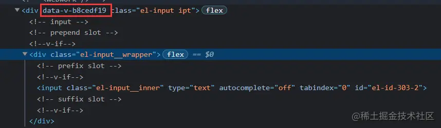

style样式

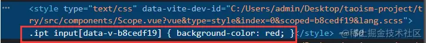

由此可见：不生效的原因是因为dom中选择器为`ipt[data-v-b8cedf19] input` 而style中默认为`.ipt input[data-v-b8cedf19]`,所以导致样式不生效。

#### 2.2 场景： 修改ui组件库样式不生效

就是上面的例子

####  2.3 deep 解决 使用ui组件库，样式穿透不生效


添加deep:

```vue
<template>
    <div>
        <el-input class="ipt"></el-input>
    </div>
</template>
<style scoped lang="scss">
.ipt{
    :deep(input){
        background-color: red;
    }
}
</style>
```

Vue 提供了样式穿透:deep() 他的作用就是用来改变 属性选择器的位置

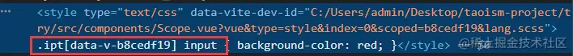

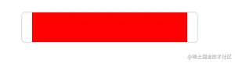


## 7.2 Token

是一个令牌，前后端交互的时候的一个身份验证信息。在请求的时候让前端传递给后端。通常是放到请求头上。

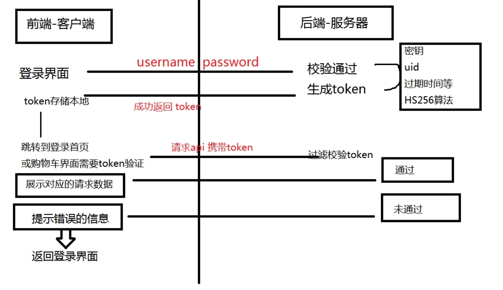

#### 携带token

很多接口发送请求，需要携带token，可以统一传递。

##### api/request.js：

```js


// 请求拦截，在真正发送请求前拦截 ...arg 查看有几个参数
http.interceptors.request.use(
  (config) => {
    // 统一携带 token
    config.headers.token = localStorage.getItem("token");


    return config;
  },
  (err) => {
    // 请求前就失败
    ElMessage.error("请求失败，请稍后再试！");
    return Promise.reject(err);
  }
);
```

#### 处理token 过期的情况

```
// 添加响应拦截器
http.interceptors.response.use(
  function (response) {
    // 2xx 范围内的状态码都会触发该函数。
    // 对响应数据做点什么
    console.log(response);
    if (response.data.code == 10119) {
      ElMessage.error(response.data.message);
      localStorage.removeItem("username");
      localStorage.removeItem("toekn");
      router.push("/login");
    }
    return response;
  },
  function (error) {
    // 超出 2xx 范围的状态码都会触发该函数。
    // 对响应错误做点什么
    return Promise.reject(error);
  }
);
```


## 7.3 更新按钮事件


```vue
<script>
import { getStatisticDataApi } from "@/api/data.js";
export default {
  data() {
    return { userCount: 0, prodcutCount: 0 };
  },
  mounted() {
    this.getProductData();
    this.getUserData();
  },
  methods: {
    getProductData() {
      getStatisticDataApi("product").then((r) => {
        console.log(r.data);
        this.prodcutCount = r.data.data;
      });
    },
    getUserData() {
      getStatisticDataApi("user").then((r) => {
        console.log(r.data);
        this.userCount = r.data.data;
      });
    },
  },
};
</script>
```


## 7.5 图表展示

echarts、 highcharts、d3 、antd-v ，图标插件一般都是基于 canvas 进行绘图。


### 7.5.1 Echarts基本使用

[在项目中引入 ECharts - 入门篇 - Handbook - Apache ECharts](https://echarts.apache.org/handbook/zh/basics/import)

1. 安装

```
npm install echarts --save
```

2. 使用官方示例渲染基础图表

   views/main/index.vue

模板

echarts需要有一个div作为容器，并且给容器一个宽和高

```
 <el-row>
    <el-col :span="12">
      <div id="main"></div>
    </el-col>
    <el-col :span="12"></el-col>
  </el-row>
  
<style>
#main {
  width: 100%;
  height: 70vh;
}
</style>  
```


js

这里使用echarts官网的示例代码

```typescript
  mounted() {
    
    this.initEharts();
  },  

  methods: {
    initEharts() {
      // 基于准备好的dom，初始化echarts实例
      var myChart = echarts.init(document.getElementById("main"));
      // 绘制图表
      myChart.setOption({
        title: {
          text: "ECharts 入门示例",
        },
        tooltip: {},
        xAxis: {
          data: ["衬衫", "羊毛衫", "雪纺衫", "裤子", "高跟鞋", "袜子"],
        },
        yAxis: {},
        series: [
          {
            name: "销量",
            type: "bar",
            data: [5, 20, 36, 10, 10, 20],
          },
        ],
      });
    },
  }       
```


## 7.6 data -图表数据

GET

```http
http://xxx/admin/data/simpleData
```


配置接口地址和请求函数

api/base.js

```
  kData: "/data/kData", // 简单K线图
  simpleData: "/data/simpleData", //简单图表数据
```

api/data.js

```
export const getKDataAPi = () => {
  return request.get(base.kData);
};
export const getSimpleDataAPi = () => {
  return request.get(base.simpleData);
};
```


修改  views/main/index.vue 中的initEcharts方法

添加一个请求，请求成功以后处理服务器返回的数据，为Echarts需要的数组

```
 async initEharts() {
      let res = await getSimpleDataAPi();
      console.log(res.data);
      //这里需要分析处理数据
      let xAxisData = res.data.data.map((v) => v.x);
      let seriesData = res.data.data.map((v) => v.val);

      // 基于准备好的dom，初始化echarts实例
      var myChart = echarts.init(document.getElementById("main"));
      // 绘制图表
      myChart.setOption({
        title: {
          text: "折线图",
        },
        tooltip: {},
        xAxis: {
          data: xAxisData,
        },
        yAxis: {},
        series: [
          {
            name: "销量",
            type: "line",
            data: seriesData,
          },
        ],
      });
      // 图标自适应变化，自动缩放
      window.addEventListener("resize", () => {
        myChart.resize();
      });
    },
```


## 7.7 data - K线图

GET

```http
http://xxx:0000/admin/data/kData
```

Header

| 字段  | 类型   | 描述  |
| :---- | :----- | :---- |
| token | String | token |

成功返回：

```json
{
  code: '200',
  message: '简单K线图',
  data
}
```


k线图这里面我们添加一个方法，和一个col

```
<el-row>
    <el-col :span="12">
      <div id="main"></div>
    </el-col>
    <el-col :span="12">
      <div id="main2"></div>
    </el-col>
  </el-row>
```

这里记得给main2一个宽高 

```
#main,
#main2 {
  width: 100%;
  height: 70vh;
}
```


js

```
 async initEharts2() {
      let res = await getKDataAPi();
      console.log(res.data);
      // 根据echats 柱状图需要的数据，处理服务器返回的数据
      let xAxisData = res.data.data.x;
      let seriesData = res.data.data.val;

      // 基于准备好的dom，初始化echarts实例
      var myChart = echarts.init(document.getElementById("main2"));
      // 绘制图表
      myChart.setOption({
        xAxis: {
          // data: ["2017-10-24", "2017-10-25", "2017-10-26", "2017-10-27"],
          data: xAxisData,
        },
        yAxis: {},
        series: [
          {
            type: "candlestick",
            data: seriesData,
          },
        ],
      });
      // 图标自适应变化，自动缩放
      window.addEventListener("resize", () => {
        myChart.resize();
      });
    },
```


## 7.8 图表自动缩放

浏览器尺寸变化时，图表跟着缩放

API：组件实例上的一些方法。

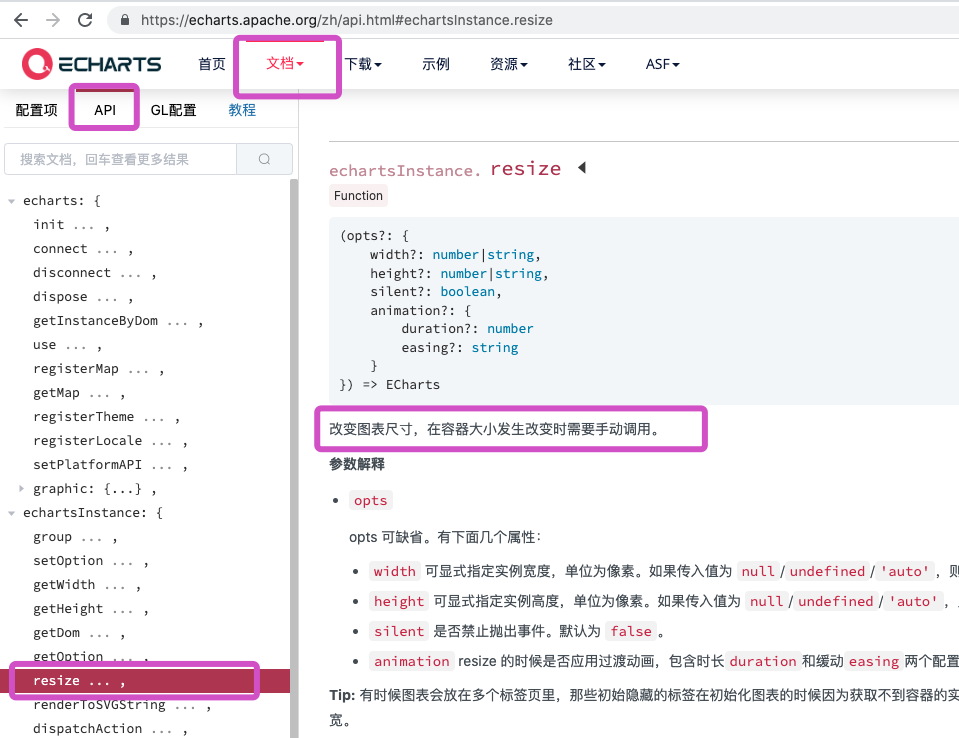


```js
// 图标自适应变化，自动缩放
window.addEventListener("resize", () => {
    myChart.resize();
});
```


  


# 十、商品管理


​	


## 9.2 Pro - 获取商品的列表

GET

```http
http://localhost:3001/admin/pro/list
```

**Header**

| 字段  | 类型   | 描述  |
| :---- | :----- | :---- |
| token | String | token |

**参数**


| 字段     | 类型   | 描述                     |
| :------- | :----- | :----------------------- |
| count    | Number | 页码，默认值为1          |
| limitNum | Number | 每页显示个数，默认值为10 |
| search   | String | 搜索的商品名             |
| category | String | 分类名                   |


**Success 200**

| 字段    | 类型   | 描述         |
| :------ | :----- | :----------- |
| code    | String | 状态码.      |
| message | String | 描述         |
| total   | Number | 商品的总数量 |
| data    | String | 数据         |

**成功返回：**

```json
HTTP/1.1 200 OK
{
  "code": "200",
  "message": "获取商品的列表",
  "total": len,
  "data": []
}
```


src/api/product.js

 ```
 import http from "@/api/request"
 
 /*
 
 列表请求
 
 */
 export function productListReq(count = 1, limitNum = 10, search = "") {
   // 返回了一个promise对象，promise 对象 他内部发起了ajax请求
   // http.get()
   return http({
     method: "get",
     url: "/admin/pro/list",
     params: { count, limitNum, search }
     // params: { count:count, limitNum, search }
   })
 }
 
 ```


#### 


#### ProductListPage.vue

```js
<template lang="">
  <div>商品列表</div>
</template>
<script>
import { getProListApi } from "@/api/pro.js";
export default {
  data() {
    return {
      proList: [],
      count: 1,
      limitNum: 10,
    };
  },
  async created() {
    let r = await getProListApi({ count: this.count, limitNum: this.limitNum });
    console.log(r.data.data);
    this.proList = r.data.data;
    
  },
};
</script>
<style lang=""></style>

```


## 表格渲染

基础表格https://element-plus.org/zh-CN/component/table.html#%E5%9F%BA%E7%A1%80%E8%A1%A8%E6%A0%BC


前面几个数据我们直接参照基础表格的用法使用即可

基础的表格展示用法。

当 `el-table` 元素中注入 `data` 对象数组后，在 `el-table-column` 中用 `prop` 属性来对应对象中的键名即可填入数据，用 `label` 属性来定义表格的列名。 可以使用 `width` 属性来定义列宽。


```
 <el-table-column prop="proname" label="名称" width="180" align="center" />
    <el-table-column prop="originprice" label="价格" width="180" />
    <el-table-column prop="brand" label="品牌" />
    <el-table-column prop="category" label="分类" />
    <el-table-column prop="sales" label="销量" />
    <el-table-column prop="stock" label="库存" />
```


自定义列的内容

https://element-plus.org/zh-CN/component/table.html#%E8%87%AA%E5%AE%9A%E4%B9%89%E5%88%97%E6%A8%A1%E6%9D%BF

表格里面的有操作按钮，图片，开关，这些东西的时候，我们需要自定义列的内容


```
 	<el-table-column label="是否售卖">
      <template #default="scope">
        <el-switch
          v-model="scope.row.issale"
          @change="handlerChangeSale(scope.$index, scope.row)"
            :active-value="1"
            :inactive-value="0"
        />
      </template>
    </el-table-column>
    <el-table-column label="操作">
      <template #default="scope">
        <el-button size="small" @click="handleEdit(scope.$index, scope.row)"
          >编辑</el-button
        >
        <el-button
          size="small"
          type="danger"
          @click="handleDelete(scope.$index, scope.row)"
          >删除</el-button
        >
      </template>
    </el-table-column>
    <el-table-column prop="img1" label="图片">
      <template #default="scope">
        <el-image
          style="width: 100px; height: 100px"
          :src="scope.row.img1"
          fit="fill"
        />
      </template>
    </el-table-column>
```


自定义列的显示内容，可组合其他组件使用。

通过 `slot` 作用域插槽 可以获取到 row, $index 的数据（表格渲染时候每一行的数据）

文档告诉我们这里scope.row 获取了，每一行渲染时候的数据，

scope.$index 每一行渲染时候的下标

比如售卖开关，使用行里面issale属性控制开关的状态，同时给开关添加change事件，事件里面用来修改状态

```
 	<el-table-column label="是否售卖">
      <template #default="scope">
        <el-switch
          v-model="scope.row.issale"
          @change="handlerChangeSale(scope.$index, scope.row)"
            :active-value="1"
            :inactive-value="0"
        />
      </template>
    </el-table-column>
```


 :active-value="1"

​      :inactive-value="0"  指定 switch 选中和非选中默认的值


编辑和删除按钮,同样需要定义列的内容，给内容添加点击事件，点击的时候获取列的下标和属性，事件里面可以使用

```
 <el-table-column label="操作">
      <template #default="scope">
        <el-button size="small" @click="handleEdit(scope.$index, scope.row)"
          >编辑</el-button
        >
        <el-button
          size="small"
          type="danger"
          @click="handleDelete(scope.$index, scope.row)"
          >删除</el-button
        >
      </template>
    </el-table-column>
```

商品的主图列,同样需要定义列的内容为图片

```
  <el-table-column prop="img1" label="图片">
      <template #default="scope">
        <el-image
          style="width: 100px; height: 100px"
          :src="scope.row.img1"
          fit="fill"
        />
      </template>
    </el-table-column>
```


```
<template lang="">
  <div>商品列表</div>
  <el-table :data="proList" style="width: 100%">
    <el-table-column prop="proname" label="名称" width="180" align="center" />
    <el-table-column prop="originprice" label="价格" width="180" />
    <el-table-column prop="brand" label="品牌" />
    <el-table-column prop="category" label="分类" />
    <el-table-column prop="sales" label="销量" />
    <el-table-column prop="stock" label="库存" />
    <el-table-column label="是否售卖">
      <template #default="scope">
        <el-switch
          v-model="scope.row.issale"
          @change="handlerChangeSale(scope.$index, scope.row)"
        />
      </template>
    </el-table-column>
    <el-table-column label="操作">
      <template #default="scope">
        <el-button size="small" @click="handleEdit(scope.$index, scope.row)"
          >编辑</el-button
        >
        <el-button
          size="small"
          type="danger"
          @click="handleDelete(scope.$index, scope.row)"
          >删除</el-button
        >
      </template>
    </el-table-column>
    <el-table-column prop="img1" label="图片">
      <template #default="scope">
        <el-image
          style="width: 100px; height: 100px"
          :src="scope.row.img1"
          fit="fill"
        />
      </template>
    </el-table-column>
  </el-table>
</template>
```


## 9.3 分页功能

分页组件文档 https://element-plus.org/zh-CN/component/pagination.html#%E5%9F%BA%E7%A1%80%E7%94%A8%E6%B3%95

 layout="prev, pager, next"  按钮顺序

total 数据总条数

v-model:current-page  当前页码

page-size每页容量

current-change 当前页码改变事件


```vue
    <el-pagination
      background
      layout="prev, pager, next"
      :total="total"
      v-model:current-page="count"
      :page-size="limitNum"
      @current-change="currentChange"
    />
```

js

```
 methods: {
    handleDelete(index, rowData) {
      console.log(index, rowData);
    },
    handleEdit() {},
    handleChangeSale() {},
    async currentChange() {
      console.log(this.count);
      this.loadList();
    },
    async loadList() {
      let r = await getProListApi({
        count: this.count,
        limitNum: this.limitNum,
      });
      console.log(r.data.data);
      this.proList = r.data.data;
      this.total = r.data.total;
    },
  },
```


## 9.4 搜索商品

还是用列表接口，只不过多了一个seach参数

### Pro | 获取商品的列表或者搜索商品

**0.0.0** 


GET

### 请求头

| 字段  | 类型   | 描述  |
| :---- | :----- | :---- |
| token | String | token |

### 参数

| 字段     | 类型   | 描述                     |
| :------- | :----- | :----------------------- |
| count    | Number | 页码，默认值为1          |
| limitNum | Number | 每页显示个数，默认值为10 |
| search   | String | 搜索的商品名             |
| category | String | 分类名                   |

商品列表上加搜索框和按钮

```
 <div class="search">
    <el-input
      v-model="searchText"
      style="width: 200px"
      placeholder="搜索商品"
    />
    <el-button type="primary" @click="seachHande()">搜索</el-button>
  </div>
  <div>商品列表</div>
```

数据

```
  data() {
    return {
      searchText: "",
      category: "",
    };
```

搜索事件，修改loadlist请求时候，添加两个参数

```
  methods: {
    async seachHande() {
      this.loadList();
    },
      async loadList() {
      let r = await getProListApi({
        count: this.count,
        limitNum: this.limitNum,
        search: this.searchText,
        category: this.category,
      });
      console.log(r.data.data);
      this.proList = r.data.data;
      this.total = r.data.total;
    },
```


## 9.5修改商品是否售卖

```http
/pro/updateFlag
```

**Header**

| 字段  | 类型   | 描述  |
| :---- | :----- | :---- |
| token | String | token |

**参数**

| 字段  | 类型   | 描述                                  |
| :---- | :----- | :------------------------------------ |
| proid | string | 产品的id                              |
| type  | string | 修改的数据 （isseckill, isrecommend） |
| flag  | string | 表示（true 选中 false 未选中）        |

**Success 200**

| 字段    | 类型   | 描述    |
| :------ | :----- | :------ |
| code    | String | 状态码. |
| message | String | 描述    |

**成功返回**

```json
HTTP/1.1 200 OK
{
  "code": "200",
  "message": "修改商品是否推荐或者秒杀",
}
```


base.js

增加接口地址

```
  proUpdateFlag: "/pro/updateFlag", //修改商品是否售卖
```


pro.js

增加请求函数

```js
/**
 * Pro - 修改商品是否推荐或者秒杀 type: isseckill, isrecommend
 * @param {*} params  {proid:'',type:'',flag:''}
 * @returns
 */
export const postUpdateFlag = (params) => request.post(base.proUpdateFlag, params);
```

事件

```vue
 <el-table-column label="是否售卖">
      <template #default="scope">
        <el-switch
          v-model="scope.row.issale"
          :active-value="1"
          :inactive-value="0"
          @change="handleChangeSale(scope.$index, scope.row)"
        />
      </template>
    </el-table-column>
```

这里注意，active-value 用于给sw设置开状态的值，默认是true，但是服务器返回的是数字1，所以这里我们通过这个属性修改开状态的默认值，不修改的话，change事件会在swtich初始化的时候默认调用一次！


```js
    async handleChangeSale(index, rowData) {
      console.log(index, "改变售卖状态");
      console.log(rowData.issale);
      let r = await postUpdateFlag({
        proid: rowData.proid,
        type: "issale",
        flag: rowData.issale ? 1 : 0,
      });
      console.log(r.data);
    },
```


## 9.6 删除商品

### Pro | 根据proid删除上传商品

DElETE请求

```http
http://localhost:3001/admin/pro/product/:proid
```

复制文本

### 请求头

| 字段  | 类型   | 描述  |
| :---- | :----- | :---- |
| token | String | token |

### 参数

| 字段  | 类型   | 描述     |
| :---- | :----- | :------- |
| proid | string | 产品的id |


请求函数

```js

/**
 * Pro - 根据proid删除商品
 * @param {string} proid  商品id
 * @returns
 */
export const productDelete = (proid) =>
  request.delete(base.proProduct + "/" + proid);
```


删除事件

```
  <el-table-column label="操作">
      <template #default="scope">
        <el-button size="small" @click="handleEdit(scope.$index, scope.row)"
          >编辑</el-button
        >
        <el-button
          size="small"
          type="danger"
          @click="handleDelete(scope.$index, scope.row)"
          >删除</el-button
        >
      </template>
    </el-table-column>
```

删除js

```
 handleDelete(index, rowData) {
      console.log(index, rowData);
      productDelete(rowData.proid).then((r) => {
        console.log(r.data);
        ElMessage.success("删除成功");
        // 删除成功以后，刷新列表
        this.loadList();
      });
    },
```


## 9.7 修改商品

点击编辑按钮的时候，需要弹出一个对话框，编辑商品

用到修改商品接口，上传图片接口

看接口文档，配置请求地址

base.js

```
  proProduct: "/pro/product", //删除商品-修改商品

  uploadImg: "/file/upload", //上传图片

```


看接口文档，写请求函数，

pro.js

```

/**
 * Pro - 根据proid修改商品
 * @param {string} proid  商品id
 * @returns
 */
export const productUpdate = (proid, body) =>
  request.patch(base.proProduct + "/" + proid, body);

/**
 * 上传图片
 * @param {*} params  {img:fileObj,}
 * @returns
 */
export const uploadImg = (formData) => request.post(base.uploadImg, formData);

```


data

这里data需要数据根据业务功能和文档一个一个添加即可

```
data() {
    return {
      proList: [],
      count: 1,
      limitNum: 5,
      total: 0,
      searchText: "",
      category: "",
      // 编辑弹框的显示和隐藏
      editDialogFormVisible: false,
      // 编辑的数据
      editRowData: {},
      // upload组件需要的 图片数据
      editFileList: [],
      // 控制 预览图片弹框的显示和隐藏
      dialogPreviewVisible: false,
      // 预览图片的地址
      dialogPreviewImageUrl: "",
    };
```


编辑按钮

```
 <el-table-column label="操作">
      <template #default="scope">
        <el-button size="small" @click="handleEdit(scope.$index, scope.row)"
          >编辑</el-button
        >
        <el-button
          size="small"
          type="danger"
          @click="handleDelete(scope.$index, scope.row)"
          >删除</el-button
        >
      </template>
    </el-table-column>
```


编辑按钮-事件

弹框需要准备一个变量控制，弹框的显示和隐藏，自己定义一个就好，editDialogFormVisible

同时要把需要编辑id内容保存起来（定义变量editRowData）， 用于在弹框中显示

编辑中用到了商品图片的组件，需要参照商品图片组件文档https://element-plus.org/zh-CN/component/upload.html#%E7%85%A7%E7%89%87%E5%A2%99

编辑时候，图片墙的数据，upload组件需要特定的格式，我们把服务返回的图片数据，转为组件需要的格式

```
  // 点击编辑按钮
    handleEdit(index, rowData) {
      // 这里必须做一次深拷贝**不然的话，编辑表单修改了内容以后，表格里面也会实时变化，因为都用的同一个对象，深拷贝以后会产生一个新的对象
      // this.editRowData = rowData; //

      this.editRowData = JSON.parse(JSON.stringify(rowData)); //\
      // 先把所有的图片属性都置为空
      let imgKey = ["img1", "img2", "img3", "img4"];
      this.editFileList = [];
      // 再根据editFileList里面的值 ，拼接出来接口需要的 数据 editRowData里面的img1  img2 img3 img4
      imgKey.forEach((v) => {
        let imgUrl = this.editRowData[v];
        if (imgUrl) {
          this.editFileList.push({ name: v, url: imgUrl });
        }
      });
      console.log(this.editRowData);
      this.editDialogFormVisible = true;
    },
```


编辑的弹框

弹出框-参照弹框文档 https://element-plus.org/zh-CN/component/dialog.html#%E8%87%AA%E5%AE%9A%E4%B9%89%E5%86%85%E5%AE%B9


编辑中用到了商品图片的组件，需要参照商品图片组件文档https://element-plus.org/zh-CN/component/upload.html#%E7%85%A7%E7%89%87%E5%A2%99


```
  <!-- 编辑的内容 -->
  <el-dialog v-model="editDialogFormVisible" title="商品信息编辑" width="800">
    <el-form :model="editRowData">
      <el-form-item label="名称">
        <el-input v-model="editRowData.proname" autocomplete="off" />
      </el-form-item>
      <el-form-item label="品牌">
        <el-input v-model="editRowData.brand" autocomplete="off" />
      </el-form-item>
      <el-form-item label="价格">
        <el-input v-model="editRowData.originprice" autocomplete="off" />
      </el-form-item>
      <el-form-item label="库存">
        <el-input v-model="editRowData.stock" autocomplete="off" />
      </el-form-item>
      <el-form-item label="售卖">
        <el-switch
          v-model="editRowData.issale"
          :active-value="1"
          :inactive-value="0"
        />
      </el-form-item>
      <el-form-item label="详情">
        <el-input v-model="editRowData.desc" autocomplete="off" />
      </el-form-item>
      <el-form-item label="图片">
        <el-upload
          :file-list="editFileList"
          list-type="picture-card"
          :limit="4"
          :on-preview="handlePictureCardPreview"
          :on-remove="handleRemove"
          :http-request="uploadImgFn"
          :on-success="uploadImgSuccess"
        >
          <el-icon><Plus /></el-icon>
        </el-upload>
        <el-dialog v-model="dialogPreviewVisible">
          
        </el-dialog>
      </el-form-item>
    </el-form>
    <template #footer>
      <div class="dialog-footer">
        <el-button @click="editDialogFormVisible = false">取消</el-button>
        <el-button type="primary" @click="saveEdit"> 保存 </el-button>
      </div>
    </template>
  </el-dialog>
```


这里上传图片的方法我们需要自己定义，参照文档使用http-request属性

这里file-list属性，不用v-model绑定，直接绑定属性就行

on-success上传图片请求成功，因为服务器返回的数据格式不一样，所以这里，我们需要自己把返回的数据，转为组件需要的数据，保存到file-list属性里面


切记：出问题，需要看文档！


后面几个js 方法,

保存按钮

上传图片成功回调

上传图片函数

图片预览

```
 // 点击保存按钮
    async saveEdit() {
      for (let i = 1; i < 5; i++) {
        this.editRowData["img" + i] = "";
      }
      // 准备修改商品信息，直接用editRowData
      this.editFileList.forEach((v) => {
        this.editRowData[v.name] = v.url;
      });
      console.log(this.editRowData);

      // 调用修改商品信息接口
      let r = await productUpdate(this.editRowData.proid, this.editRowData);
      console.log(r);
      // 隐藏弹出框;
      this.editDialogFormVisible = false;
      // 修改成功以后，刷新列表-获取最新数据
      this.loadList();
    },
    // 上传图片成功回调--根据文档定义
    uploadImgSuccess(r) {
      console.log(r.data.fileUrl);
      console.log(this.editFileList);

      this.editFileList.push({
        url: r.data.fileUrl,
        name: "img" + (this.editFileList.length + 1),
      });
    },
    // 自定义上传图片方法-根据文档定义
    uploadImgFn(options) {
      console.log(options);
      let fd = new FormData();
      fd.append("img", options.file);
       fd.append("id", '22');
      return uploadImg(fd);
    },
    // 图片预览
    handlePictureCardPreview(uploadFile) {
      console.log(uploadFile);
      //要预览的图片地址，赋值给变量，变量在dialog中显示
      this.dialogPreviewImageUrl = uploadFile.url;
      this.dialogPreviewVisible = true;
    },
```


## 9.8 发布商品

类似-编辑表单里面的功能

接口

发布商品和上传图片

```
/**
 * Pro - 发布商品
 * @param {object} body  {proid:'',type:'',flag:''}
 * @returns
 */
export const productPost = (body) => request.post(base.proProduct + "/", body);

```


引入

```
import { uploadImg, productPost } from "@/api/pro.js";

```


模版跟编辑一样

```
<template lang="">
  <div class="con">
    <div>发布商品</div>
    <el-form :model="editRowData" class="cform">
      <el-form-item label="名称">
        <el-input v-model="editRowData.proname" autocomplete="off" />
      </el-form-item>
      <el-form-item label="品牌">
        <el-input v-model="editRowData.brand" autocomplete="off" />
      </el-form-item>
      <el-form-item label="价格">
        <el-input v-model="editRowData.originprice" autocomplete="off" />
      </el-form-item>
      <el-form-item label="库存">
        <el-input v-model="editRowData.stock" autocomplete="off" />
      </el-form-item>
      <el-form-item label="售卖">
        <el-switch
          v-model="editRowData.issale"
          :active-value="1"
          :inactive-value="0"
        />
      </el-form-item>
      <el-form-item label="详情">
        <el-input v-model="editRowData.desc" autocomplete="off" />
      </el-form-item>
      <el-form-item label="图片">
        <el-upload
          :file-list="editFileList"
          list-type="picture-card"
          :limit="4"
          :on-preview="handlePictureCardPreview"
          :on-remove="handleRemove"
          :http-request="uploadImgFn"
          :on-success="uploadImgSuccess"
        >
          <el-icon><Plus /></el-icon>
        </el-upload>
        <el-dialog v-model="dialogPreviewVisible">
          
        </el-dialog>
      </el-form-item>

      <div class="dialog-footer">
        <el-button type="primary" @click="saveEdit"> 发布商品 </el-button>
      </div>
    </el-form>
  </div>
</template>
```


js

数据跟编辑表单一样

```
data() {
    return {
      // 编辑的数据
      editRowData: {},
      // upload组件需要的 图片数据
      editFileList: [],
      // 控制 预览图片弹框的显示和隐藏
      dialogPreviewVisible: false,
      // 预览图片的地址
      dialogPreviewImageUrl: "",
    };
  },
```

函数也一样，保存按钮-改成修改按钮，调用接口改变，其他一样

```
  // 图片删除
    handleRemove() {
      console.log("图片删除");
      console.log(this.editFileList);
    },
    // 点击保存按钮
    async saveEdit() {
      for (let i = 1; i < 5; i++) {
        this.editRowData["img" + i] = "";
      }
      // 准备修改商品信息，直接用editRowData
      this.editFileList.forEach((v) => {
        this.editRowData[v.name] = v.url;
      });
      console.log(this.editRowData);
      // ***** 调用发布接口
      let r = await productPost(this.editRowData);
      console.log(r.data);
    },
    // 上传图片成功回调--根据文档定义
    uploadImgSuccess(r) {
      console.log(r.data.fileUrl);
      console.log(this.editFileList);

      this.editFileList.push({
        url: r.data.fileUrl,
        name: "img" + (this.editFileList.length + 1),
      });
    },
    // 自定义上传图片方法-根据文档定义
    uploadImgFn(options) {
      console.log(options);
      let fd = new FormData();
      fd.append("img", options.file);
      return uploadImg(fd);
    },
    // 图片预览
    handlePictureCardPreview(uploadFile) {
      console.log(uploadFile);
      //要预览的图片地址，赋值给变量，变量在dialog中显示
      this.dialogPreviewImageUrl = uploadFile.url;
      this.dialogPreviewVisible = true;
    },
```


# 十一、用户管理

## 10.1 获取管理员列表

GET

```http
/admin/list
```

**Header**

| 字段  | 类型   | 描述 |
| :---- | :----- | :--- |
| token | string |      |

**Success 200**

| 字段    | 类型   | 描述    |
| :------ | :----- | :------ |
| code    | String | 状态码. |
| message | String | 描述    |

**成功返回**

```json
HTTP/1.1 200 OK
{
  "code": "200",
  "message": "管理员列表" 
}
```


### admin.js:

```js

/**
 * Admin - 管理员列表
 */
export const getAdminListApi = () => request.get(base.adminList);

```

注意，这里列表接口后端没有分页处理，而只是一下子返回了所有的用户，这里面我们前端做一个分页处理

### 表格渲染

分页：

page-size / v-model:page-size	每页显示条目个数	
current-page / v-model:current-page	当前页数

```vue
<template>
  <el-table :data="renderList" style="width: 100%">
    <el-table-column label="索引" type="index" width="80"> </el-table-column>
    <el-table-column prop="adminname" label="管理员名称"> </el-table-column>
    <el-table-column prop="adminid" label="管理员id"> </el-table-column>
    <el-table-column prop="role" label="角色">
      <template #default="{ row }">
        <el-tag :type="row.role === 1 ? '' : 'danger'">{{
          row.role === 1 ? "普通管理员" : "超级管理员"
        }}</el-tag>
      </template>
    </el-table-column>
  </el-table>
  <div class="pagination">
    <el-pagination
      background
      layout="prev, pager, next"
      :total="tableData.length"
      v-model:current-page="currentPage"
      v-model:page-size="pageSize"
    >
    </el-pagination>
  </div>
</template>

<script>
import { getAdminListApi } from "@/api/admin";
export default {
  name: "AdminList",
  data() {
    return {
      tableData: [],
      currentPage: 1, //当前页
      pageSize: 10, // 一页显示多少条
    };
  },
  created() {
    this.getAdminList();
  },
  computed: {
    // 前端分页
    renderList() {
      // 1   0-9  2: 10-19  3:20-29
      const start = (this.currentPage - 1) * this.pageSize;
      return this.tableData.slice(start, this.currentPage * this.pageSize);
    },
  },
  methods: {
    // 获取列表
    async getAdminList() {
      try {
        const res = await getAdminListApi();
        console.log(res);
        this.tableData = res.data.data;
        console.log(this.tableData.length);
      } catch (err) {
        console.log(err);
      }
    },
  },
};
</script>

<style lang="scss" scoped>
.pagination {
  display: flex;
  margin: 30px;
  justify-content: center; //居中
}
</style>
```


## 10.2 添加管理员


#### 添加表单结构

```vue
<el-form
      :model="adminForm"
      status-icon
      :rules="rules"
      ref="from"
      label-width="100px"
      class="admin_form"
    >
      <el-form-item label="管理员名称" prop="adminname">
        <el-input type="text" v-model="adminForm.adminname"></el-input>
      </el-form-item>
      <el-form-item label="管理员密码" prop="password">
        <el-input type="password" v-model="adminForm.password"></el-input>
      </el-form-item>

      <el-form-item label="管理员角色" prop="role">
        <el-radio-group v-model="adminForm.role">
          <el-radio :label="1">普通管理员</el-radio>
          <el-radio :label="2">超级管理员</el-radio>
        </el-radio-group>
      </el-form-item>
      <el-form-item label="管理员权限" prop="checkedKeys"> </el-form-item>
    </el-form>

  <el-button type="primary" @click="handleSubmit">提交</el-button>

```

#### 表单数据

这里把表单数据放到了一个对象中，容易管理

```js
data() {
    return {
      adminForm: {
        adminname: "",
        password: "",
        role: 1,
        checkedKeys: [],
      },
      // 定义验证规则
      rules: {
        adminname: [
          { required: true, message: "请输入管理员名称", trigger: "blur" },
        ],
        password: [
          { required: true, message: "请输入password", trigger: "blur" },
        ],
      },
    };
  },
```


#### 权限属性结构el-tree

添加用户的时候，需要控制这个用户的操作权限，同一个tree展示


```vue
 <el-form-item label="权限" :label-width="100">
     <!-- node-key	每个树节点用来作为唯一标识的属性，整棵树应该是唯一的	string -->
     <el-tree
              ref="treeRef"
              :data="menus"
              node-key="name"
              show-checkbox
              :props="{ label: 'title', children: 'items' }"
              />
</el-form-item>
```

树里面的data 数据使用menu.js里面的目录数据

```
import menuArr from "@/router/menu";

data(){
	return { menuArr}
}
```

e-treel绑定一个ref属性，后面我们去获取 el-tree里面的选中的数据，el-tree提供了一个方法

#### 提交按钮事件-获取表单数据

```
handleSubmit() {
      this.$refs.form.validate(async (valid) => {
        console.log(this.$refs.treeRef.getCheckedKeys(false),this.adminForm);
         if (valid) {
          console.log('通过表单验证')
        } else {
          console.log("error submit!");
          console.log('没有通过表单验证-让表单报错')
          return false;
        }
       
      });
    },
```


#### 添加接口

POST

```http
t
```

**Header**

| 字段  | 类型   | 描述 |
| :---- | :----- | :--- |
| token | string |      |

**参数**

| 字段        | 类型   | 描述 |
| :---------- | :----- | :--- |
| adminname   | string |      |
| password    | string |      |
| role        | string |      |
| checkedKeys | string |      |

**Success 200**

| 字段    | 类型   | 描述    |
| :------ | :----- | :------ |
| code    | String | 状态码. |
| message | String | 描述    |

**成功返回**

```json
HTTP/1.1 200 OK
{
  "code": "200" || '10004',
  "message": "添加管理员成功" || 该管理员已存在,
}
```


```js
/**
 * Admin - 添加管理员
 * @param {*} params
 * @returns
 */
export const postAddAdminApi = (params) => request.post(base.adminAdd, params);
```


```js
handleSubmit() {
      this.$refs.form.validate(async (valid) => {
        console.log(this.$refs.treeRef.getCheckedKeys(false));
        debugger;
        if (valid) {
          // (1)调接口新增
          try {
            const res = await postAddAdminApi({
              ...this.adminForm,
              checkedKeys: this.$refs.treeRef.getCheckedKeys(false),
            });
            console.log(res);
            this.handleDone();
            // 刷新当前列表
          } catch (error) {
            console.log(error);
          }
        } else {
          console.log("error submit!");
          return false;
        }
      });
    },
```


#### 重置表单内容的方法

添加请求成功以后重置表单数据


```js
methods: {
    handleDone() {
      // 1、重置表单
      this.values = {
        adminname: "",
        password: "",
        role: 1,
        checkedKeys: [],
      };
      // 单独重置tree
      this.$refs.treeRef.setCheckedKeys([], false);
    
    },
  },
```


## 10.3 删除管理员

POST

```http
/admin/delete
```

**Header**

| 字段  | 类型   | 描述 |
| :---- | :----- | :--- |
| token | string |      |

**参数**

| 字段    | 类型   | 描述 |
| :------ | :----- | :--- |
| adminid | string |      |

**Success 200**

| 字段    | 类型   | 描述    |
| :------ | :----- | :------ |
| code    | String | 状态码. |
| message | String | 描述    |

**成功返回**

```json
HTTP/1.1 200 OK
{
  "code": "200",
  "message": "删除管理员" 
}
```


#### api/admin.js：

```js
/**
 * 删除管理员
 * @param {*} adminid
 * @returns
 */
export const postDeleteAdminApi = (params) =>
  request.post(base.adminDel, params);
```


#### userList.vue

```vue
<el-table-column fixed="right" label="操作">
      <template #default="scope">
        <el-button type="danger" @click="handleDelete(scope.row)" size="small"
          >删除</el-button
        >
      </template>
    </el-table-column>
```


```js
import { getAdminListApi, postDeleteAdminApi } from "@/api/admin";

// 删除
    async handleDelete(row) {
      console.log(row);
      const { adminid } = row;
      try {
        await postDeleteAdminApi({ adminid });
        //重新加载列表数据
        this.getAdminList();
      } catch (error) {
        console.log(error);
      }
    },
```


# 十二、 用户权限控制

我们之前做过登录权限控制，不同的用户有时候也需要不同的权限，菜单权限，页面权限

## 登录权限

​	 登录的时候被token 存入本地

```
localstorage.setItem('token','aa')
```


​	 路由配置中使用meta 记录 页面是否需要登录

```
meta:{requireLogin:true}
```


​	  全局路由前置守卫

```
//这个文件专门处理 用户权限的逻辑

function checkPermission(router) {
  router.beforeEach((to, from) => {
    let token = localStorage.getItem("token")
    if (to.meta.requireLogin == true) {
      //判断要跳转的页面 是否需要登录，如果需要就判断 是否有token
      // 如果没有 ，就跳转到 登录，
      if (token) {
        // next()
      } else {
        return { path: "/login" }
        // next({ path: "/login" })
      }
    } else {
      // next()
    }
  })
}

export default checkPermission

```


## 页面级别权限控制

超级管理员：拥有所有操作权限，可以访问所有页面。

其他管理员：拥有部分权限


根据角色控制页面权限（Rbac 权限控制-根据角色控制不同用户权限）


页面级别指的是，如果没有权限就无法访问整个页面，所以就要从菜单、路由守卫等方面下手，来阻止用户通过地址栏访问页面。

从菜单方面，要根据权限来渲染菜单。

从路由方面呢，要通过路由守卫阻止用户访问无权限访问的页面。

二选一


### 首先

需要在用户登录的时候，把用户的权限信息 存入本地

```
    // 请求成功以后存入数据
           localStorage.setItem("role", r.data.data.role)
          localStorage.setItem("checkedkeys", JSON.stringify(r.data.data.checkedkeys))
```


### 第一种-方法--路由守卫-进行页面权限控制（项目权限点）

这种控制的话，等于是把所有的操作菜单都保留了，用户都可以看到，只是不能进去


1-需要在登录的时候，提前把用户的登录信息都提前保存了（本地或者全局状态中）

2-在router.js中增加 一个全局路由拦截(路由守卫)用来判断


```js
//页面权限控制 实现方式1：路由拦截

  // 处理 页面权限
  router.beforeEach((to, from) => {
    let role = localStorage.getItem("role")
    let checkedkeys = JSON.parse(localStorage.getItem("checkedkeys"))

    // 1-如果 role 是 2  超管--具有所有页面的访问权限
    if (role == 2) {
    } else {
      //2-普通的管理员
      // 判断 要访问的地址，是否在checkdkeys 里面，如果在说明有权限，如果不再说明没有权限
      //把首页 和 layout,login 三个页面 不同判断权限  直接添加进去
      checkedkeys = [...checkedkeys, "home", "layout", "login"]
      console.log("当前用户具有的操作权限", checkedkeys)
      console.log("要访问的页面", to.name)
      //判断 要访问的页面 名字，是否在权限列表中

      // 不在处理一下
      if (!checkedkeys.includes(to.name)) {
        console.log("你没有访问权限")
        ElMessage({
          type: "error",
          message: "你没有访问权限" 
        })
        return false
      }
    }
  })
}

```


### 第二种方法-根据权限生成动态菜单，进行页面访问权限控制(项目高级点)

这种思路是，根据不同的用户，生成不同的操作菜单。不具备这个页面访问权限的，压根就看不到这个页面的菜单。

同时路由也是动态添加上的！没有权限的用户，压根就没有写这个路由！（当然路由不动态添加也可以，使用路由拦截，做权限判断也可以）


1-根据用户的登录信息，生成动态菜单

```
       <el-tree
          ref="treeRef"
          :data="menuArr"
          node-key="name"
          show-checkbox
          :props="{ label: 'name', children: 'children' }"
          @check="treeChange"
          :check-strictly="true"
        />
```

check-strictly 默认 子级checkbox和父级的checkbox 有一个 严格关系，（子有一个没选中，父就没有选中）

设置 :check-strictly="true" ，子如果不选中，那么父也可以选中

直接在layout中写逻辑，来生成动态权限菜单

```js
  data() {
    return {
      menuArr: [],
      activeIndex: "/home"
    }
  },  

mounted() {
    //保存用户具有权限的菜单信息
    let newMenuArr = []
    let role = localStorage.getItem("role")
    let checkedkeys = JSON.parse(localStorage.getItem("checkedkeys"))
    menuArr.forEach((menu) => {
      //获取每一个菜单信息
      console.log(menu)
      //判断当前用户 所有这个菜单 权限，如果添加到 newMenuArr中
      if (role == 2) {
        //  如果是超管--能看到所有菜单，都添加进去
        newMenuArr.push(menu)
      } else {
        // debugger

        //不是超管，服务器返回了一个 权限 checkedkeys
        //遍历的menu.name 如果在 checkedkeys 里面  如果 在  添加进去newMenu中
        if (checkedkeys.includes(menu.name)) {
          // menu.name 如果在 checkedkeys 里面  如果 在  添加进去newMenu中
          newMenuArr.push(menu)
          if (menu.children) {
            //记录这个menu菜单  具有权限的孩子菜单

            let newChildren = []

            menu.children.forEach((secondMenu) => {
              //如果二级菜单 如果在权限数组中，就添加到 newChildren 厘米
              if (checkedkeys.includes(secondMenu.name)) {
                newChildren.push(secondMenu)
              } else {
              }
            })
            //到这里 子菜单也处理了
            // 把得到 最细拿到 有权限的孩子菜单 替换原来的  孩子菜单
            menu.children = newChildren
          }
        }
      }
    })

    console.log("具有权限的菜单", newMenuArr)
    this.menuArr = newMenuArr
  },
```

定义到data里面

```js
 data() {
    return {
      url,
      currentIndex: "/main",
      menuArr,
      authMenuArr,//动态权限菜单
      username: "zhangsan",
    };
  },
```

修改模版 中MyMenuItem的数据源

```
        <MyMenuItem :data="authMenuArr" />

```


如果只用第一种就也可以，但是用户能看到所有操作菜单！

如果配合二种，用户看不到没有权限的菜单！就比较完美


如果只用第二种，有个bug，如果用户知道的你路由地址，地址栏中直接输入路由地址，也可以访问没有操作权限的页面！可以让后端，在调用相关接口的时候做个权限判断！

或者我们路由修改成动态添加的！


### 第三种-动态路由

routes里面配置的路由，主要是,layout里面的子路由，不写死，根据服务器返回的数据动态生成，这样，这样用户知道页面访问的地址，也访问不了这个样，因为系统中就没有配置这个路由！


下面代码写到laytout组件执行的时候

利用layout 里面生成的权限菜单数据（权限菜单数据同时也是layout里面的 路由配置）

直接使用vue-router提供的addRoute方法，通过遍历一个个添加到 layout的children里面。


下面代码写到routerjs中即可，最好做个判断，如果登录以后才去动态添加路由信息

```
let authMenuArr = createAuthMenus();
debugger;

authMenuArr.forEach((v) => {
  router.addRoute("layout", v);
});

```


通过 router.getRoutes() 方法 可以观察到所有的路由配置信息（注意，这个结果是数组 扁平化以后的结果！！！！ 嵌套的路由都会直接放入数组第一层里面）

```
//可以观察到所有的路由配置信息
console.log(router.getRoutes());
```


## 指令级别的按钮权限


添加按钮-按钮

 通过指令和指令的值  ` v-auth="['admin:list:add']"`，指定只有   用户的权限信息具备这个 字符串，才能可以使用添加管理的按钮，想让谁能看到这个按钮，需要在前端写死信息，然后指令中判断

```
  <el-button type="primary" @click="dialogFormVisible = true" v-auth="['admin:list:add']"
    >添加管理员</el-button
  >
```


main js中 注册指令


指令级别的 按钮权限，主要来控制添加按钮的显示和隐藏。

用户的权限信息具备这个 字符串，才能可以使用添加管理的按钮

```
app.directive("auth", {
  mounted(el, binding) {
    console.log(el); //指令所在的元素 dom
    console.log(binding.value); //给指令绑定的值--> 记录 谁有操作权限  ['admin:list:delete', 'common:list:delete']
    // 拿到服务返回的用户的按钮权限信息
    let userStore = useUserStore();
    // debugger;
    console.log(userStore.auths);

    // 判断  auths 中 是否一个元素 在 binding.value
    let flag = false;
    userStore.auths.forEach((v) => {
      debugger;

      //  v 是否在 binding.value中
      if (binding.value.includes(v)) {
        flag = true;
      }
    });
    if (flag == false) {
      // el.style.display='none'
      el.remove();
    }

    //
  }
});
```


# 十三、项目优化

#### 路由懒加载

修改静态路由为路由懒加载 ，可以减少，实现打包时候的代码分割，减少首页体积

最好是把，一级页面都用静态路由，二级的页面（内页都用动态路由）

```
import Layout from "@/views/Layout.vue";//静态路由

//修改静态路由为路由懒加载
const Layout = () => import('@/views/Layout.vue')
```


#### keepalive-缓存组件

layout 里面的几个子路由需要频繁的切换，我们可以 使用keepalive缓存组件，切换的时候不会真的删除组件，创建新组件，而是组件一旦被创建，下次直接复用，提高切换效率

```

        <el-main>
          <!-- 二级路由出口 -->
          <router-view v-slot="{ Component }">
            <keep-alive>
              <component :is="Component" />
            </keep-alive>
          </router-view>
        </el-main>
```


# 十四、打包上线

配置文件

配置相对路径

```
import { defineConfig } from 'vite'
// ...

// https://vitejs.dev/config/
export default defineConfig({
  base: './',
  // ...
})
```


打包

```
npm run build
```


这样打包以后的文件里面引用的资源都是相对路径，而不是绝对路径。

默认这里是 / 根路径，如果我们的打包以后的前端代码不是放到服务器的根目录下面，用绝对的路径，就会报错，找不到资源！！！！！

npm run build  （把请求地址改成线上的地址）

打包命令执行成功以后 ，dist文件下面的内容就是我们需要放到线上或者生产环境里面代码了


打包命令执行成功以后 ，dist文件下面的内容就可以上传到服务器了，dist文件下面的内容就可以上传到服务器了


有些时候，`前端`、`后台` 项目部署在公司是属于运维的事情


ftp上传文件到服务器

1-ftp 服务器的地址  ftp://12.xx.xx.xx 

2-ftp 账号--用户名和密码


# 十五、开发时候的跨域问题


开发中，我们前端自己的测试服务器，就是我们自己的电脑，一般都是localhost开头的网址（内网地址比如是192.168.1.111）

我们要使用后端的接口，开发中，后端的接口一般都是部署在他自己电脑上(ip地址比如是 192.168.1.222)

如果后端的代码中没有配置允许跨域的权限，我们访问接口会报如下错误！

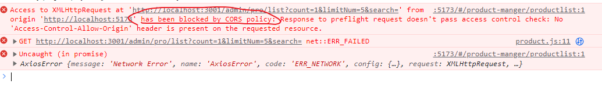

能沟通最后，让后端添加几句代码就行。（线上上线以后，一般前后端的代码都是在同一个服务器上，没有跨域问题）

如果不能沟通，开发中，我们也可以使用vite同server代理来解决这个问题（上线就不行了）


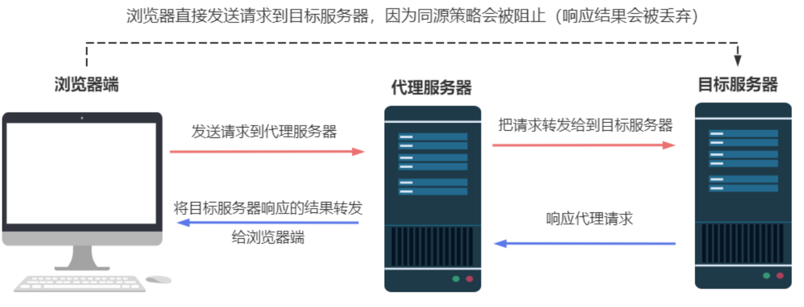


## 什么是跨域？

当浏览器向一个不同域名、不同端口或不同协议的资源发出请求时，产生的问题，称为**跨域问题**。这是由于同源策略（Same-Origin Policy）导致的。   接口中  http：//地址：端口号     

协议：域名：端口号 --前面页面的地址和访问的接口地址有一个不一样就叫跨域

## 什么是同源策略及限制？

同源策略是一种用于隔离潜在恶意文件的关键的安全机制（如果缺少了同源策略，浏览器很容易受到XSS、CSFR等攻击），它会**限制**以下的的种行为。

- Cookie、LocalStorage 和 IndexDB 无法读取
- DOM和JS对象无法获得
- AJAX 请求不能发送


## 跨域的解决方法

### 1： jsonp比较老  利用script标签的特性  src具有跨域能力

### 2：postMessage 

是一种 [HTML5](https://developer.mozilla.org/zh-CN/docs/Web/API/Window/postMessage) 新增的跨文档通信方式，它可以在两个不同窗口之间进行安全跨域通信。postMessage 的基本原理是在一个窗口中发送消息，在另一个窗口中监听消息并进行处理，从而完成跨域通信

### 3：websocket （qq，微信聊天）

[WebSocket](https://developer.mozilla.org/zh-CN/docs/Web/API/WebSocket) 是一种基于 TCP 协议的双向通信协议，它提供了一种浏览器和服务器之间实时、低延迟、高效率的全双工通信方式，同时允许跨域通讯。

### 4-跨域资源共享（CORS，服务器配置-常用）

[CORS](https://link.juejin.cn?target=https%3A%2F%2Fdeveloper.mozilla.org%2Fzh-CN%2Fdocs%2FWeb%2FHTTP%2FCORS)（Cross-Origin Resource Sharing）是一种机制，用于允许浏览器向跨源服务器发送 XMLHttpRequest 请求，从而克服浏览器的同源限制。

CORS需要浏览器和服务器同时支持。整个CORS通信过程，都是浏览器自动完成，不需要用户参与。对于开发者来说，CORS通信与同源的AJAX通信没有差别，代码完全一样。浏览器一旦发现AJAX请求跨源，就会自动添加一些附加的头信息，有时还会多出一次附加的请求，但用户不会有感觉。

因此，**实现CORS通信的关键是服务器**。只要服务器实现了CORS接口，就可以跨源通信。

### 5-**nginx反向代理接口跨域**

一般运维人员配置或者公司后端配，我们了解

**浏览器是禁止跨域的，但是服务端不禁止**

实现思路：通过nginx配置一个代理服务器（域名与domain1相同，端口不同）做中间件，反向代理访问domain2接口。

nginx具体配置：

```ini
#proxy服务器
server {
    listen       81;
    server_name  www.domain1.com;

    location / {
        proxy_pass   http://www.domain2.com:8080;  #反向代理
        proxy_cookie_domain www.domain2.com www.domain1.com; #修改cookie里域名
        index  index.html index.htm;

        # 当用webpack-dev-server等中间件代理接口访问nignx时，此时无浏览器参与，故没有同源限制，下面的跨域配置可不启用
        add_header Access-Control-Allow-Origin http://www.domain1.com;  #当前端只跨域不带cookie时，可为*
        add_header Access-Control-Allow-Credentials true;
    }
}
```

此处的意思为：nginx 反向代理服务监听 [www.domain1.com](https://link.juejin.cn?target=http%3A%2F%2Fwww.domain1.com) 的81端口，如果有请求过来，则转到proxy_pass配置的对应服务器上


### 6-nodejs中间件代理跨域（代理插件-仅限开发中使用）

node中间件实现跨域代理，原理大致与nginx相同，都是通过启一个代理服务器，实现数据的转发

仅限开发中使用，上面上线以后，前后端一般是在一个服务器上的！


#### server


```
import { fileURLToPath, URL } from "node:url"

import { defineConfig } from "vite"
import vue from "@vitejs/plugin-vue"
import VueDevTools from "vite-plugin-vue-devtools"

// Element 按需导入
import AutoImport from "unplugin-auto-import/vite"
import Components from "unplugin-vue-components/vite"
import { ElementPlusResolver } from "unplugin-vue-components/resolvers"

// https://vitejs.dev/config/
export default defineConfig({
  plugins: [
    vue(),
    VueDevTools(),
    // Element 按需导入
    AutoImport({
      resolvers: [ElementPlusResolver()]
    }),
    Components({
      resolvers: [ElementPlusResolver()]
    })
  ],
  resolve: {
    alias: {
      "@": fileURLToPath(new URL("./src", import.meta.url))
    }
  },
  base: "./",
  server: {
    open: true, //自动打开测试服务器
    // port: 8880, // 自定义端口，默认为5173
    open: true, // 服务启动后，自动在浏览器中打开，默认是不打开的

  }
})

```

cors true 以后，vite服务器， 会自动给我们请求的跨域数据，添加cors响应头，很容易就跨域了


#### 使用proxy配置项

```
  server: {
    open: true, //自动打开测试服务器
    // port: 8880, // 自定义端口，默认为5173
    open: true, // 服务启动后，自动在浏览器中打开，默认是不打开的
    // cors: true
    proxy: {
      //  ------^/admin是字符串 http://localhost:5173/admin 的简写法

      "^/admin": "http://127.0.0.1:3001/"

      // 以上表示，当我向 http://localhost:5173/admin地址及下级路径发请求时，帮我转发到`
      // http://127.0.0.1:3001/`地址及对应的下级路径发请求，不是 /admin开头的，不用管
      // 如下
      // http://localhost:5173/admin/admin/userlist --> http://127.0.0.1:3001/admin/admin/userlist
    }
  }
```


修改请求的基地址

```
const instance = axios.create({
  // 统一的基本配置
  //   请求基地址
  // baseURL: "http://localhost:3001",
  baseURL: "/",
  // 现在，在超时前，所有请求都会等待 60 秒
  timeout: 60000
})
```

 baseURL: "/",  以后，表示，我们axios请求的都是http://localhost:5173了，proxy配置了，会自动转发到http://127.0.0.1:3001/  上


rewrite

```
 "/mi-test": {
        //代理地址
        target: "https://api-mall.mihoyogift.com", //需要代理的地址
        changeOrigin: true, //是否跨域
        // secure: false,
        rewrite: (path) => path.replace(/^\/mi-test/, "")
      }
```


- 
- target是我们实际要请求的服务器的地址
- rewrite，你可以将匹配到`/api`开头的路径进行重写，将其替换为空字符串。这样，前端代码发起的请求将会从浏览器的角度来看，变成与前端代码部署的同一个域下的请求，因此不再触发跨域限制
  例如，我们要请求服务器/get 路径， 则我们需要向我们配置的代理服务器发送请求，则代理服务器会将请求转发到目标地址进行处理，并根据配置进行修改后再发送给目标服务器


我们想请求 本地服务器http://127.0.0.1:5137/  以mi-test 开头的请求， 就会发送请求到代理服务器，因为代理服务器会代理前缀为/mi-test的地址 。代理服务器帮助我们请求https://api-mall.mihoyogift.com 这个服务器！（并且会把地址中  /mi-test 替换成 空字符串  ）


相当于我们请求

```
http://127.0.0.1:5137/mi-test/common/homeishop/v1/goods/puzzle_goods_info?puzzle_id=mall_cn__1709290768&component_id=pz-eWUweyahLE
```

就会变成

```
https://api-mall.mihoyogift.com/common/homeishop/v1/goods/puzzle_goods_info?puzzle_id=mall_cn__1709290768&component_id=pz-eWUweyahLE
```


js

```
    // let url =
    //   "https://api-mall.mihoyogift.com/common/homeishop/v1/goods/puzzle_goods_info?puzzle_id=mall_cn__1709290768&component_id=pz-eWUweyahLE"

    // let url =
    //   "/common/homeishop/v1/goods/puzzle_goods_info?puzzle_id=mall_cn__1709290768&component_id=pz-eWUweyahLE"

    let url =
      "/mi-test/common/homeishop/v1/goods/puzzle_goods_info?puzzle_id=mall_cn__1709290768&component_id=pz-eWUweyahLE"

    axios.get(url).then((r) => {
      console.log(r.data)
    })
```


### 总结

jsonp（只支持get请求，支持老的IE浏览器）适合加载不同域名的js、css，img等静态资源；

CORS（支持所有类型的HTTP请求，但浏览器IE10以下不支持）适合做ajax各种跨域请求，客户端不用处理，后端处理；

Nginx代理跨域和nodejs中间件跨域原理都相似，都是搭建一个服务器，直接在服务器端请求HTTP接口，这适合前后端分离的前端项目调后端接口。

postMessage、websocket都是HTML5新特性，兼容性不是很好，只适用于主流浏览器和IE10，**一般现在都能用**

